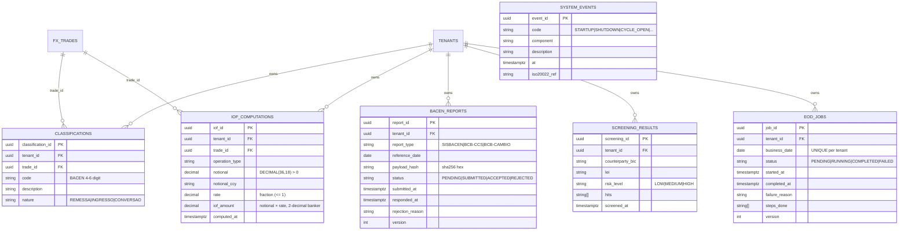

# ERD — Compliance + Admin Domain

**Source migration:** `migrations/000008_create_compliance_admin.up.sql`
**Ontology:** `.base/aasc/ontology/core/compliance.ttl`

## Constraints

- `CLASSIFICATIONS.nature` enum + `code` length 4-6
- `IOF_COMPUTATIONS.rate` 0..1 + `iof_amount >= 0`
- `BACEN_REPORTS.{report_type,status}` enum CHECKs
- `SCREENING_RESULTS.risk_level` enum
- `EOD_JOBS UNIQUE (tenant_id, business_date)` + `status` enum

## Indexes

- `idx_iof_op_type (tenant_id, operation_type, computed_at DESC)` — IOF audit by op
- `idx_bacen_tenant_status (tenant_id, status, reference_date DESC)` — submission queue
- `idx_screen_high (tenant_id, screened_at DESC) WHERE risk_level = 'HIGH'` — partial for SISCOAF triage
- `idx_eod_status (tenant_id, status, business_date DESC)` — EOD orchestrator monitor
