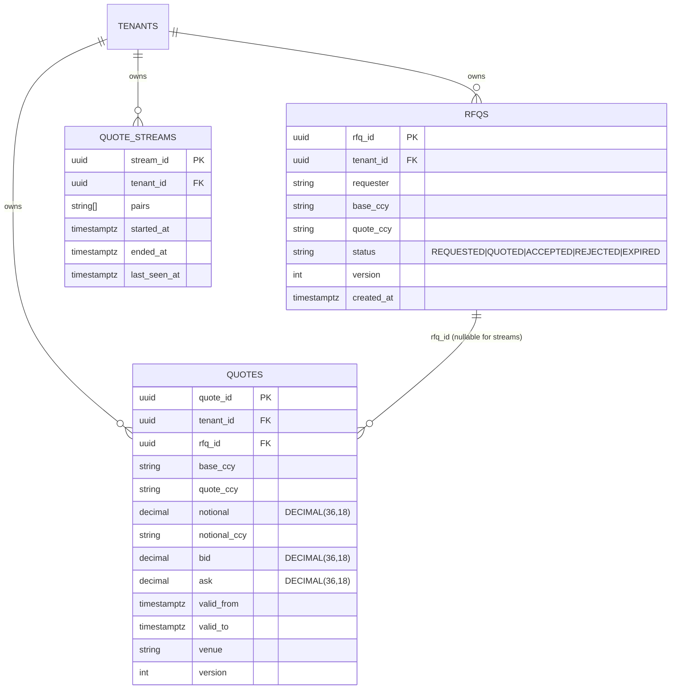

# ERD — Quote Domain

**Source migration:** `migrations/000003_create_quotes.up.sql`
**Ontology:** `.base/aasc/ontology/core/quote.ttl`

## Constraints

- `QUOTES.bid <= ask` (CHECK)
- `QUOTES.base_ccy <> quote_ccy` (RN_FX_001)
- `QUOTES.valid_to > valid_from`
- `QUOTES.notional_ccy IN (base_ccy, quote_ccy)`
- `RFQS.base_ccy <> quote_ccy`

## Indexes

- `idx_quotes_rfq (rfq_id)` — RFQ → quotes lookup
- `idx_quotes_tenant_pair_valid (tenant_id, base_ccy, quote_ccy, valid_to DESC)` — live quote feed
- `idx_streams_tenant_open (tenant_id) WHERE ended_at IS NULL` — open streams only
