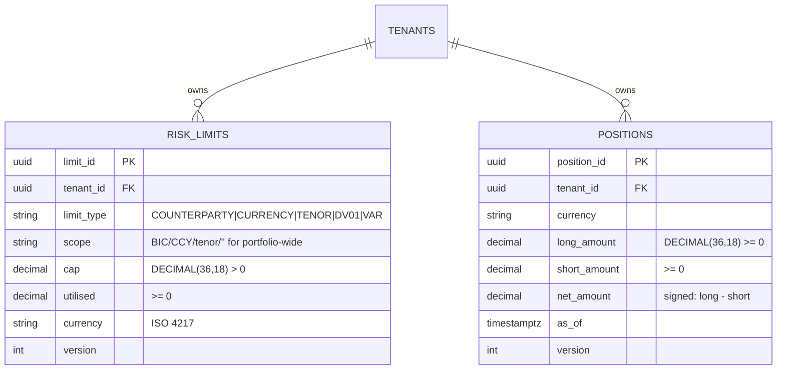

# ERD — Risk + Position Domain

**Source migration:** `migrations/000007_create_risk_position.up.sql`
**Ontology:** (planned in `.base/aasc/ontology/core/risk.ttl` + `position.ttl`)

## Constraints

- `RISK_LIMITS.limit_type` enum CHECK
- `RISK_LIMITS UNIQUE (tenant_id, limit_type, scope)` — one limit per scope
- `RISK_LIMITS.cap > 0` + `utilised >= 0`
- `POSITIONS.long/short_amount >= 0`
- `POSITIONS UNIQUE (tenant_id, currency)` — one position per CCY

## Indexes

- `idx_limits_breaching (tenant_id) WHERE utilised >= cap` — partial for breach observability
- `idx_limits_tenant_type (tenant_id, limit_type)` — Find() lookup
- `idx_positions_tenant_asof (tenant_id, as_of DESC)` — most-recent positions
