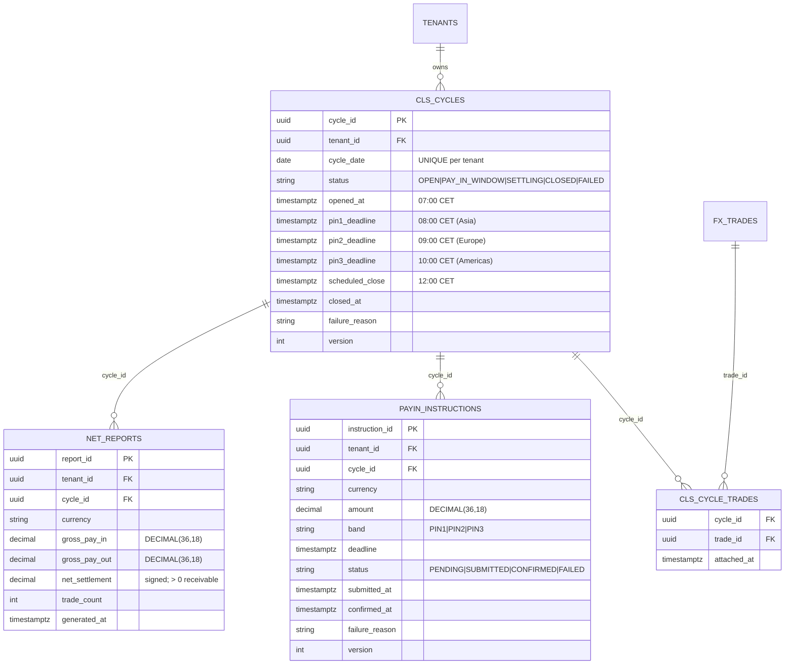

# ERD — CLS Settlement Domain (CLS Cycles + PayIn + NetReport)

**Source migration:** `migrations/000006_create_settlement.up.sql`
**Ontology:** `.base/aasc/ontology/core/cls_settlement.ttl`

## Constraints

- `CLS_CYCLES.status` enum CHECK + `pin1 < pin2 < pin3 < scheduled_close`
- `UNIQUE (tenant_id, cycle_date)` — one cycle per business date
- `PAYIN_INSTRUCTIONS.amount > 0`
- `PAYIN_INSTRUCTIONS.band` ∈ {PIN1,PIN2,PIN3}
- `NET_REPORTS.gross_pay_in / gross_pay_out >= 0`
- `UNIQUE (cycle_id, currency)` on NET_REPORTS

## Indexes

- `idx_cycles_open (tenant_id, cycle_date) WHERE status IN (OPEN,PAY_IN_WINDOW,SETTLING)` — partial for scheduler
- `idx_payin_cycle_ccy (cycle_id, currency)` — NetReport aggregation
- `idx_payin_status_deadline (tenant_id, status, deadline)` — deadline monitor
