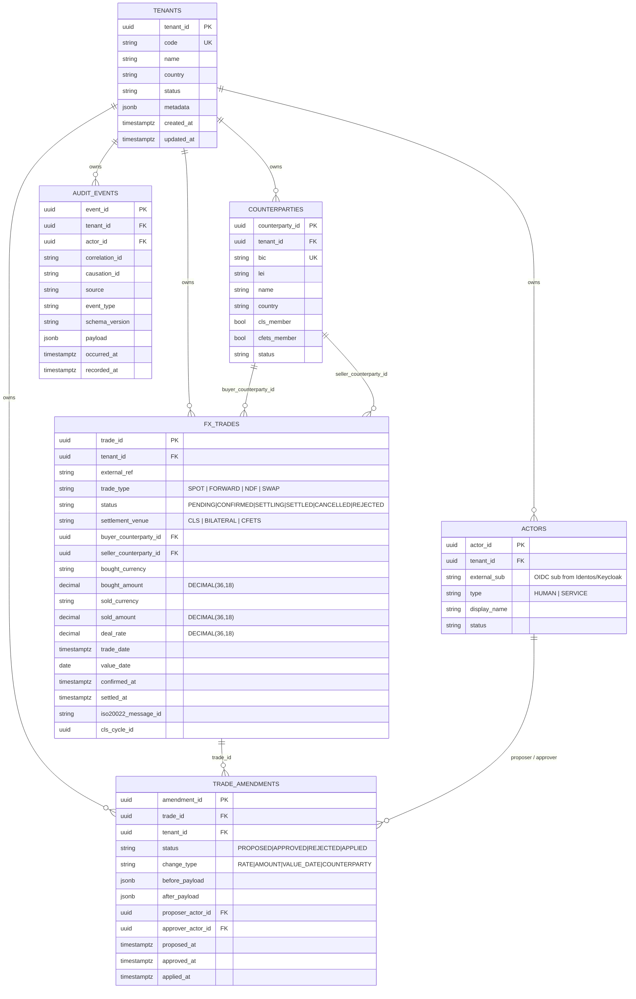

# ERD — Trade Domain

**Source migrations:** `migrations/000001_create_tenants.up.sql` + `migrations/000002_create_fx_trades.up.sql`

**Ontology grounding:** `.base/aasc/ontology/core/trade.ttl`

## Entities

## Constraints

- `FX_TRADES.bought_currency <> sold_currency` (RN_FX_001)
- `FX_TRADES.{bought,sold}_amount > 0` (RN_FX_026)
- `FX_TRADES.deal_rate > 0`
- `FX_TRADES.status` ∈ enum (CHECK)
- `FX_TRADES.trade_type` ∈ {SPOT,FORWARD,NDF,SWAP}
- `FX_TRADES.settlement_venue` ∈ {CLS,BILATERAL,CFETS}
- `TRADE_AMENDMENTS.status` ∈ {PROPOSED,APPROVED,REJECTED,APPLIED}

## Indexes

- `idx_trades_tenant_status_value (tenant_id, status, value_date)` — main filter for List
- `idx_trades_venue_cycle (settlement_venue, cls_cycle_id) STORING (status)` — CLS scheduler
- `idx_trades_buyer / idx_trades_seller` — counterparty exposure aggregation
- `idx_trades_value_date WHERE status IN (CONFIRMED,SETTLING)` — partial settlement queue
- `idx_trades_iso_msg WHERE iso20022_message_id IS NOT NULL` — inbound message correlation

## Related ERDs

- erd-quote-domain.md (RFQ + Quote)
- erd-settlement-domain.md (cls_cycles + payin + net_reports)
- erd-risk-position-domain.md (limits + positions)
- erd-compliance-admin-domain.md
