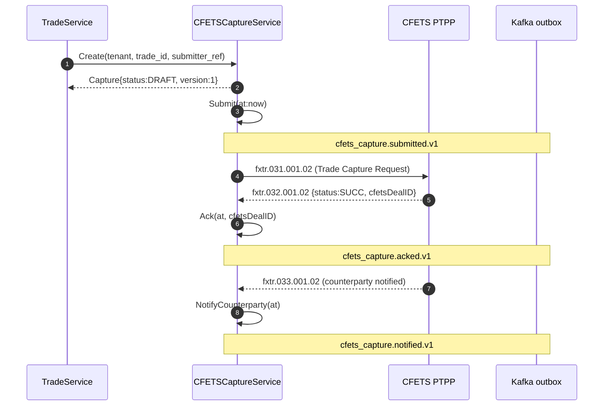
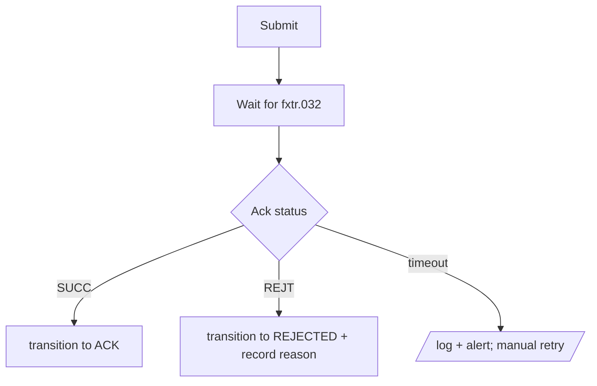

# RFLW.024.040.01 — CFETS Trade Capture

## Description

For trades involving CNY (USDCNY), ExchangeOS captures the trade with CFETS
(China Foreign Exchange Trade System) via PTPP:

1. Submit `fxtr.031.001.02` (Trade Capture Request)
2. Wait for `fxtr.032.001.02` (Ack — SUCC|REJT + CFETSDealID on success)
3. CFETS forwards `fxtr.033.001.02` to the counterparty (informational notification)

## Sequence

## Error Flow

## Business Rules

- Currency pair must include CNY (USDCNY etc.) — RN_FX_001 validation upstream

## Observability

- Metric `cfets_capture.submitted.v1` counter
- Metric `cfets_capture.acked.v1` / `cfets_capture.rejected.v1` (label: reason)
- Histogram for ack latency (submit → ack)
