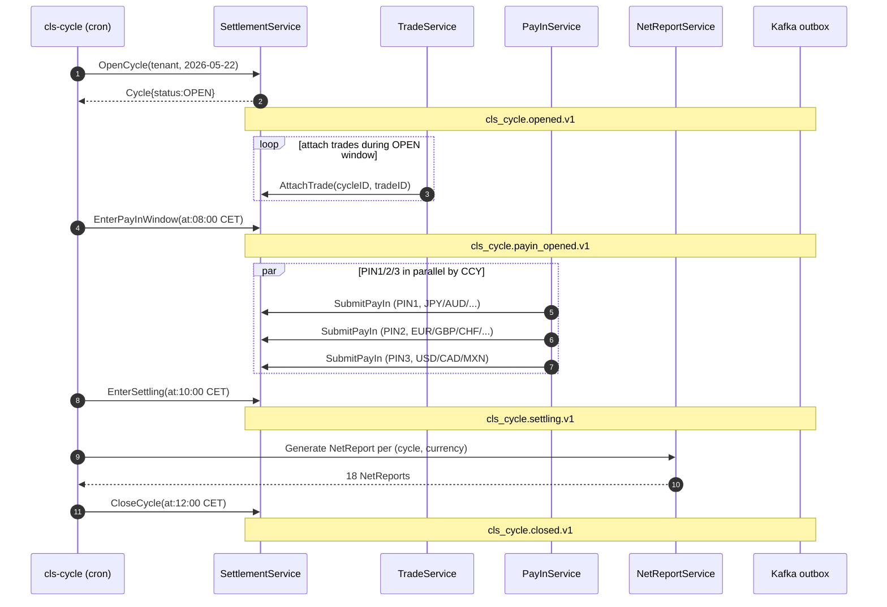

# RFLW.024.020.01 — CLS Daily Cycle Lifecycle

## Description

Scheduled cycle orchestration anchored to Europe/Zurich CET timezone:

| CET    | Event |
|--------|-------|
| 07:00  | Cycle OPEN — trades attach |
| 08:00  | PIN1 deadline (Asia-Pacific PayIns) |
| 09:00  | PIN2 deadline (Europe PayIns) |
| 10:00  | PIN3 deadline (Americas PayIns) — enter SETTLING |
| 12:00  | Cycle CLOSED — NetReport emitted |

## Sequence



## Error Flow

```mermaid
flowchart TB
    A[PIN deadline reached] --> B{All PayIns confirmed?}
    B -- yes --> Settle[enter SETTLING]
    B -- no --> Fail[FailCycle reason="PIN deadline missed"]
    Fail --> Notify[admi.004 system event]
```

## Business Rules

- RN_FX_010 — PvP for 18 CLS-eligible currencies
- Deadline ordering enforced by `cls_cycles` CHECK pin1 < pin2 < pin3 < scheduled_close

## Observability

- Metric `cls_cycle.opened.v1` / `cls_cycle.closed.v1` counters
- Per-PIN-band PayIn latency histogram
- Grafana dashboard panel: deadline burn-down

## Compliance Notes

- CLS daily cycle is monitored by BACEN for CCY exposure (DEC reporting if BRL on either leg).
