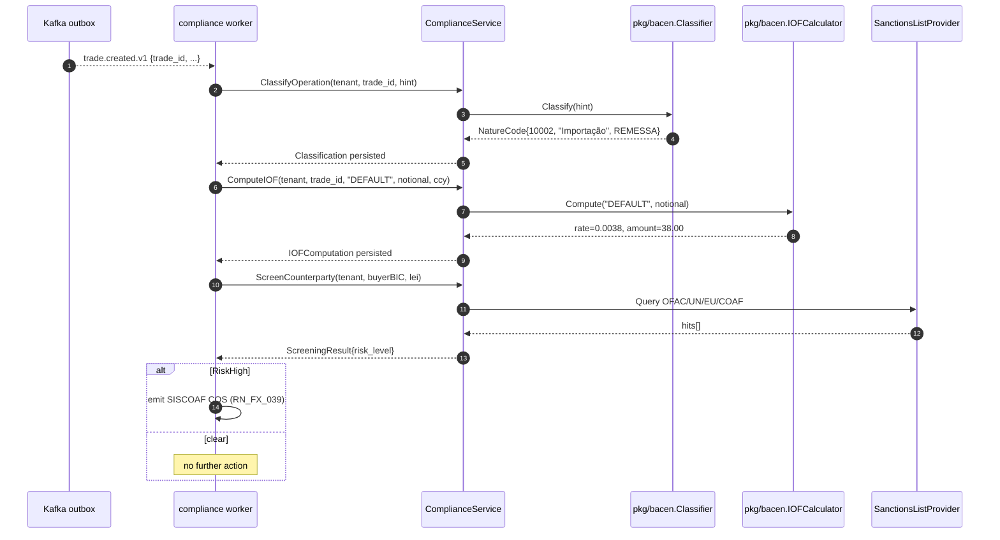
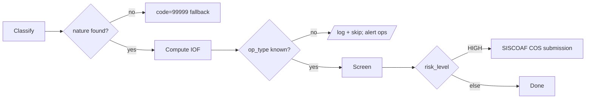

# RFLW.024.030.01 — BACEN Classification + IOF on Trade Booked

## Description

When a Trade is booked, the compliance worker (subscriber to `trade.created.v1`):

1. Resolves BACEN nature code via `pkg/bacen.Classifier`
2. Computes IOF amount via `pkg/bacen.IOFCalculator`
3. Screens counterparty against OFAC/UN/EU/COAF lists
4. If risk HIGH, emits SISCOAF COS per RN_FX_039

## Sequence

## Error Flow

## Business Rules

- RN_FX_028 — 95 nature codes per Circ 3.690 (classifier ByCode + free-text fallback)
- RN_FX_037 — 6 IOF rates per Decreto 12.499/2025
- RN_FX_039 — COS for SISCOAF within 1 business day of HIGH-risk detection

## Observability

- Metric `compliance.classification.created` counter (label: nature, code)
- Metric `compliance.iof.computed` histogram (label: op_type)
- Metric `compliance.screening.hits` counter (label: risk_level)
- Alert: ScreeningResult HIGH → PagerDuty critical
