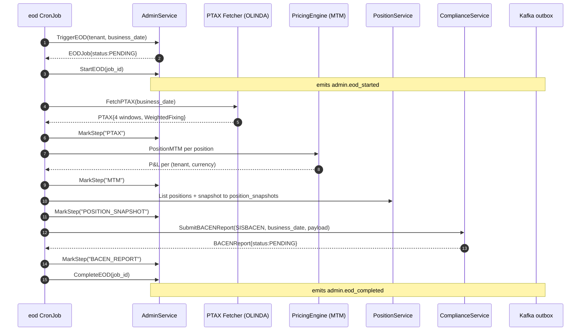

# RFLW.024.050.01 — End-of-Day Batch

## Description

Daily batch orchestrated by `cmd/eod` (CronJob 23:00 UTC weekdays). Runs 4
canonical steps with idempotent step-mark tracking on the EODJob aggregate.
If any step fails the job moves to FAILED with the step as failure_reason.

## Sequence



## Error Flow

```mermaid
flowchart TB
    A[Step fails] --> B[FailEOD reason=step]
    B --> C[admi.004 EOD_FAILED event]
    C --> D[PagerDuty critical]
    D --> Retry{Next run<br/>(idempotent)}
    Retry -- yes --> Resume[MarkStep skips done steps]
    Retry -- no --> Manual[Manual intervention]
```

## Business Rules

- Idempotent: re-running an EODJob with already-completed steps via `MarkStep` is a no-op
- One EOD per (tenant, business_date) — UNIQUE constraint on eod_jobs
- RN_FX_028 — BACEN classifications must be in place before SISBACEN submission
- RN_FX_037 — IOF computations frozen at EOD timestamp

## Observability

- Metric `admin.eod_job.duration` histogram per step
- Metric `admin.eod_job.status` counter (label: status)
- Grafana panel: "Last 30 EOD runs by tenant"
- Alert: any FAILED EOD → critical
