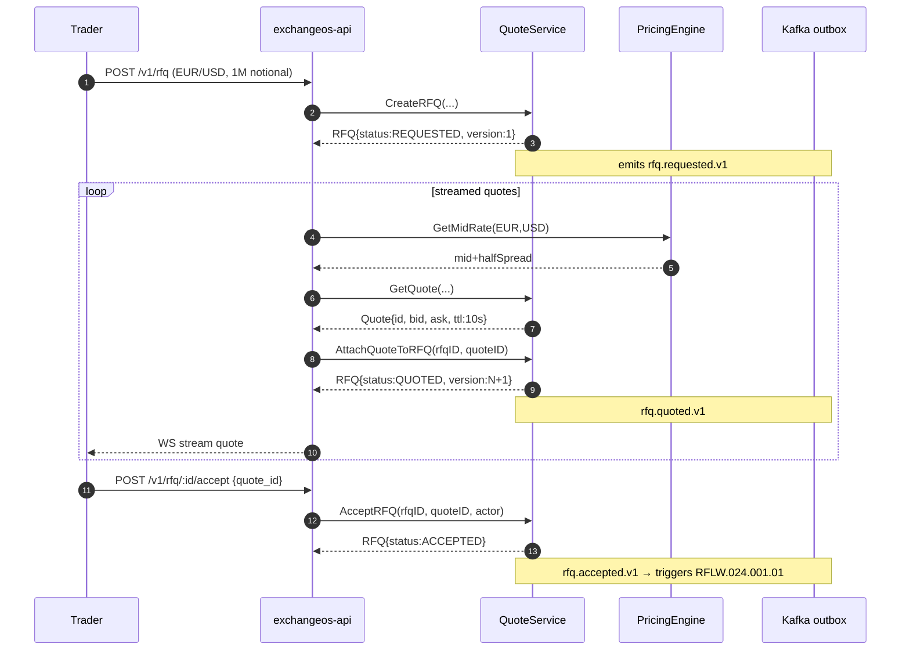
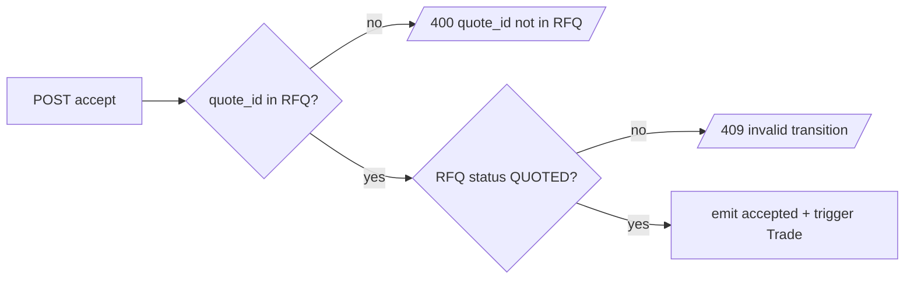

# RFLW.024.010.01 — RFQ Streaming Lifecycle

## Description

Trader requests a quote via RFQ; pricing engine streams multiple quotes; trader
picks one + accepts. Acceptance emits `rfq.accepted.v1` which downstream Trade
flow (RFLW.024.001.01) reacts to.

## Sequence

## Error Flow

## Business Rules

- RN_FX_001 — currency pair validated by domain.NewRFQ

## Observability

- OTel span `rfq.lifecycle` covering CreateRFQ → all AttachQuote → Accept
- Metric `rfq.accepted.v1` counter

## Related Patterns

- FX-EDA-* (outbox dispatcher)
- FX-API-* (cursor pagination for RFQ list)
