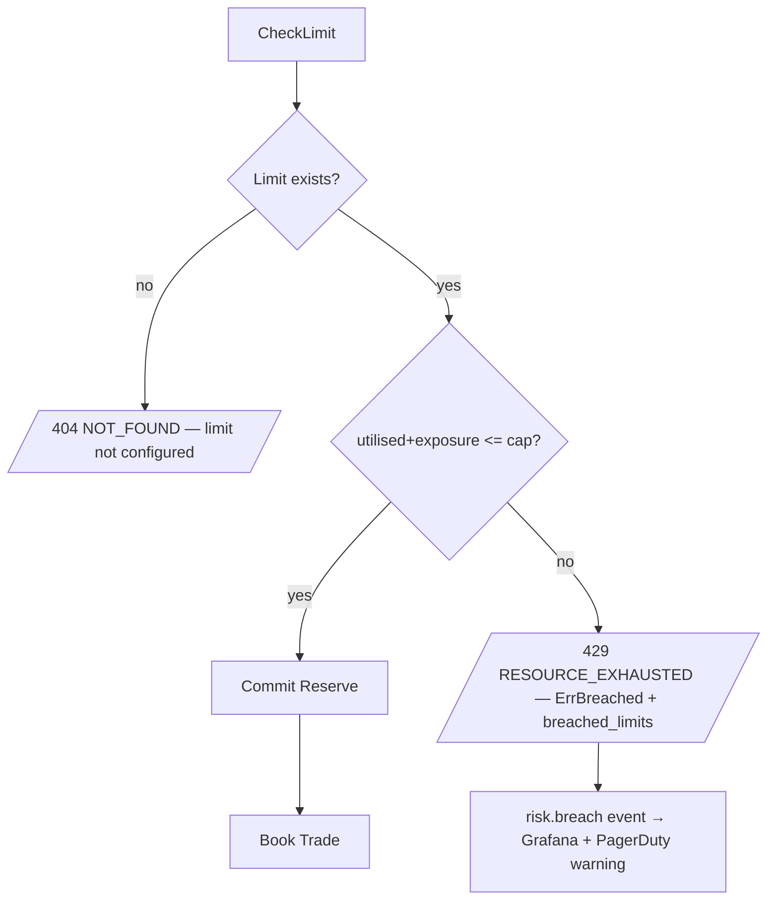

# RFLW.024.060.01 — Pre-Trade Risk Limit Check

## Description

Before a Trade is booked, the application service consults RiskService.CheckLimit
for the counterparty BIC. If allowed, RiskService.Reserve commits the exposure.
If breached, the trade is rejected with `ErrBreached` and a structured response.

## Sequence

```mermaid
sequenceDiagram
    autonumber
    participant TS as TradeService
    participant RS as RiskService
    participant LR as LimitRepo
    participant KB as Kafka outbox

    TS->>RS: CheckLimit(tenant, COUNTERPARTY, BIC, proposed_exposure)
    RS->>LR: Find(tenant, COUNTERPARTY, BIC)
    LR-->>RS: Limit{cap, utilised, version}
    RS->>RS: would utilised+exposure > cap?
    alt within cap
        RS-->>TS: CheckResult{allowed:true}
        TS->>RS: Reserve(tenant, COUNTERPARTY, BIC, exposure)
        RS->>LR: Save(Limit with utilised+=exposure, version+=1)
        RS-->>TS: Limit{utilised: new, version: new}
        TS->>TS: NewFXTrade(...)
        Note over TS,KB: emits trade.created.v1
    else breach
        RS-->>TS: CheckResult{allowed:false, breached_limits:[id], explanation}
        TS-->>TS: reject; ErrBreached propagates to caller
        Note over RS,KB: emits risk.breach event (alert)
    end
```

## Error Flow



## Business Rules

- RN_FX_015 — NOP monitored realtime; halt if exceeds BCB cap
- Reserve is atomic: NO partial reservation — caller must split or reject
- Release on Trade Cancel restores capacity

## Observability

- Metric `risk.check.duration` histogram
- Metric `risk.breach.v1` counter (label: limit_type, scope) — alert if rate > 0
- Trace span carries limit_id when breach hits
