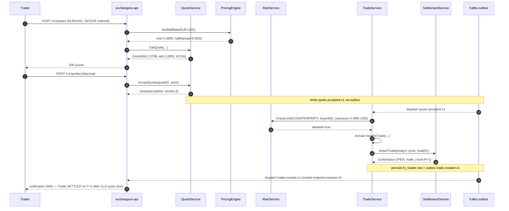
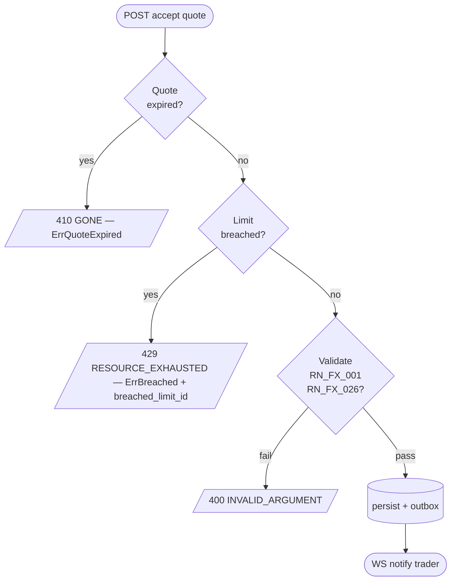

# RFLW.024.001.01 — Book FX Spot Trade via CLS

## Description

Trader (or counterparty) submits a spot quote that, on acceptance, becomes a
booked FX trade routed to CLS for PvP settlement on T+2.

## Pre-conditions

1. Counterparty (buyer + seller) BICs are CLS members (`bic_records.cls_eligible = true` via reda lookup).
2. Currency pair is CLS-eligible (18 CCYs).
3. Tenant has a non-breached COUNTERPARTY limit for the buyer BIC.

## Actors / Participants

- **Trader (UI)** — submits via REST + WebSocket
- **exchangeos-api** — REST/gRPC service
- **exchangeos.PricingEngine** — quotes spot mid + half-spread
- **exchangeos.QuoteService** — persists Quote + RFQ
- **exchangeos.RiskService** — pre-trade limit check
- **exchangeos.TradeService** — books FXTrade
- **exchangeos.SettlementService** — attaches trade to today's CLS cycle
- **Kafka outbox** — emits trade.created.v1 → downstream
- **CLS Bank (CLSBUS33)** — receives fxtr.014.001.05 envelope (out of scope here)

## Sequence

## Error Flow

## Business Rules Applied

| Code | Rule |
|------|------|
| RN_FX_001 | Currency pair must be valid + ACTIVE in refdata |
| RN_FX_002 | Spot default T+2 (USD/CAD T+1) — handled by pricing.Tenor.ValueDate |
| RN_FX_010 | PvP via CLS for the 18 eligible CCYs |
| RN_FX_026 | NEVER float64 for money/rate — decimal.Decimal throughout |

## Observability

- **OTel spans:** GetQuote → AcceptQuote → CheckLimit → BookTrade → AttachTrade
- **Metrics:** `quote.accepted.v1` counter, `trade.created.v1` counter, `risk.breach` counter
- **Logs:** correlation_id propagated through TenantContext

## Compliance Notes

- BACEN: trade is classified post-book by ComplianceService (Circ 3.690 code, IOF computation).
- COS: not required for clear screening (LOW); HIGH-risk would trigger SISCOAF submission per RN_FX_039.

## Related Patterns

- FX-DDD-* (Domain-Driven Design)
- FX-EDA-* (Event-Driven Architecture — outbox dispatch)
- FX-IAM-* (TenantContext extraction)
- FX-OTEL-* (span propagation)
