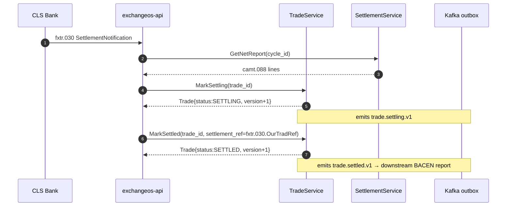
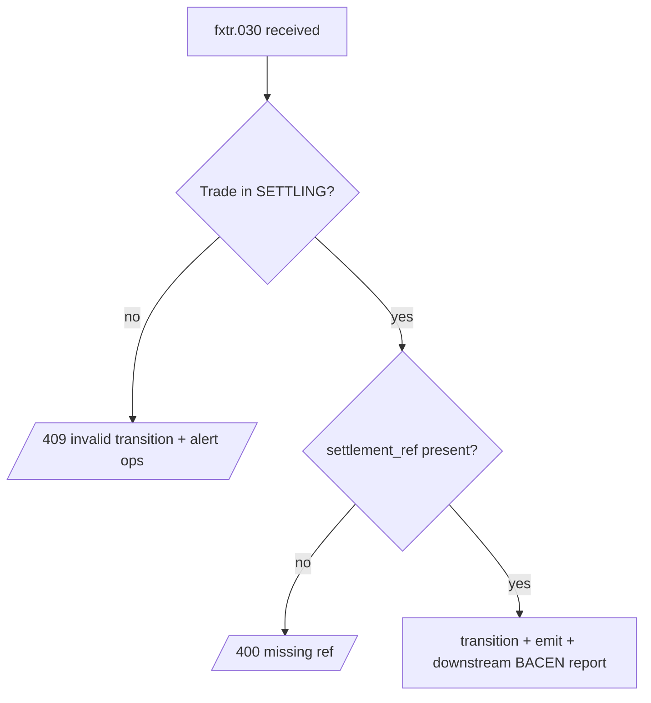

# RFLW.024.002.01 — Settle FX Trade via CLS PvP

## Description

After the CLS cycle closes for the trade's value_date, CLS reports settlement
via fxtr.030 + camt.088. ExchangeOS reflects the SETTLING → SETTLED transition
on the FXTrade aggregate and emits trade.settled.v1.

## Sequence

## Error Flow

## Business Rules

- RN_FX_010 — CLS PvP for 18 eligible CCYs
- RN_FX_026 — decimal precision preserved through settlement amounts
- Cancellation forbidden after SETTLING (domain enforces)

## Observability

- Metric `trade.settled.v1` counter (label: settlement_venue)
- Span links: settle span linked to original book span via trade_id
- Settlement latency histogram (trade_date → settled_at)
