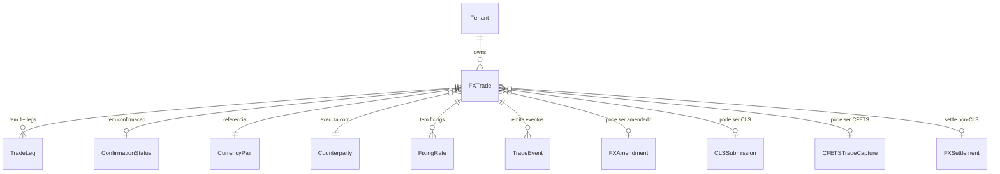
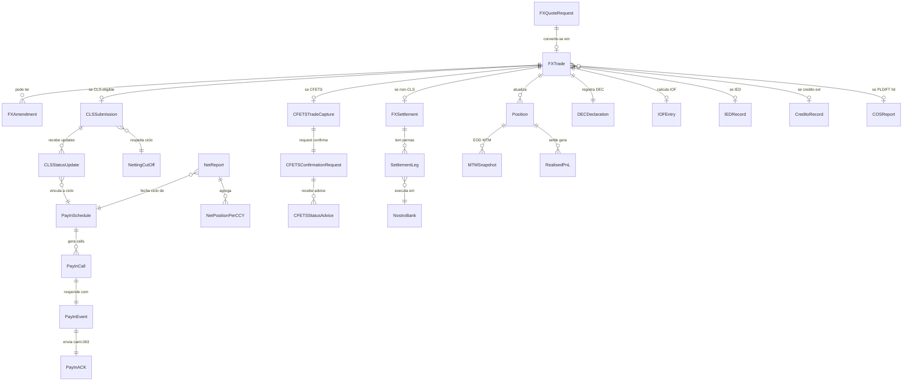
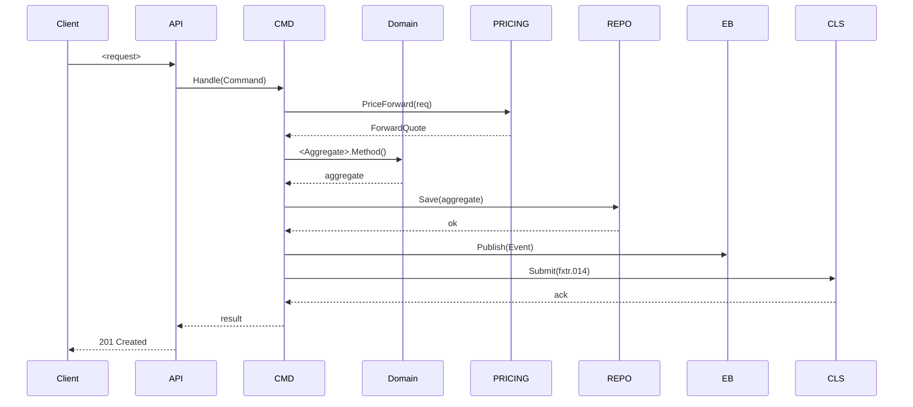
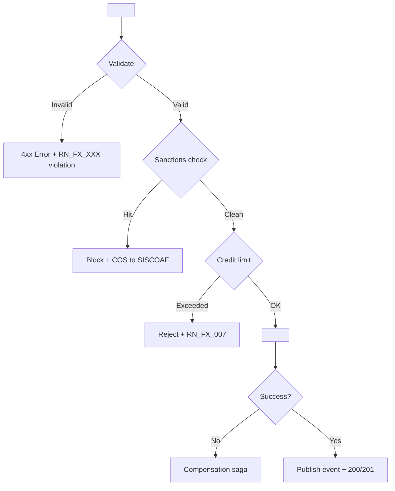
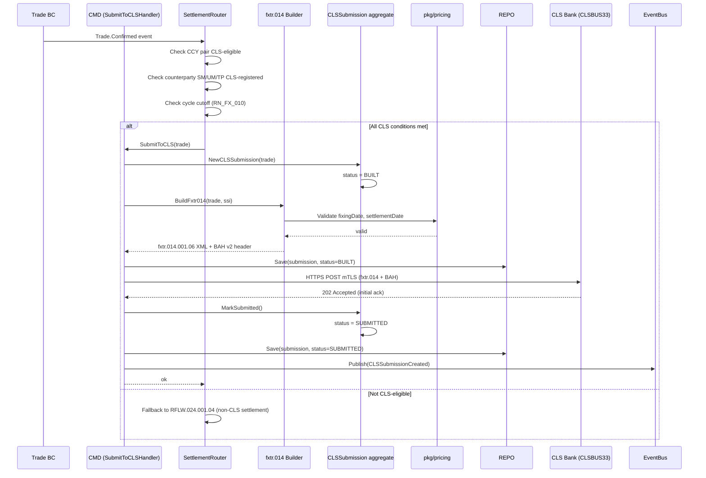
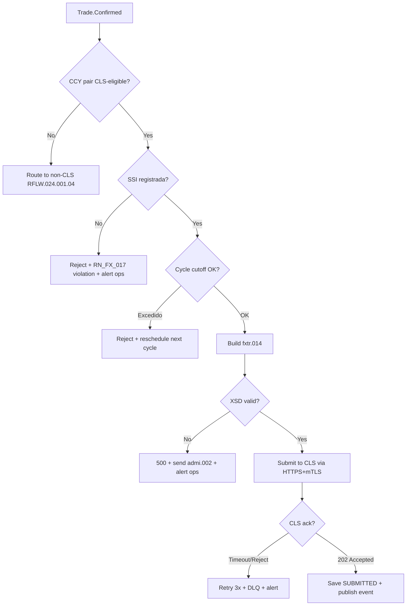

# Allenty v3.11.7 — ExchangeOS: FX + Pre-Commit HARD Enforcement (zero GitHub Actions desperdicado)

> **Version:** 3.11.4
> **Date:** 2026-05-24
> **Status:** DRAFT — Pending approval (revisao 17: Database Sync Pattern unificado + integracao nativa AccountOS/PaymentOS via shared CRDB hub `cockroachdb/modules/exchangeos/` + cross-module CDC + Kafka event sync)
> **Scope:** ExchangeOS (Standalone FX Module) — cobertura completa FX + Patterns (16 catalogos / 740 patterns) + CRUD/deploy local + TDD/E2E + **Database Sync Pattern** (shared CRDB hub TLS + native AccountOS + PaymentOS + LedgerOS + AuthorityOS + RiskOS + ComplOS + TreasuryOS + Identos integration via CDC + Kafka events)
> **Source primaria:** [ISO 20022 FX Messages](https://www.iso20022.org/fx_messages.page), [iotafinance fxtr catalogue](https://www.iotafinance.com/en/SWIFT-ISO20022-Business-area-fxtr-Foreign-Exchange-Trade.html), [Oracle FLEXCUBE CLS workflow](https://docs.oracle.com/cd/E74659_01/html/FX/FX07_CLS.htm), [CFETS Business Services](http://www.chinamoney.com.cn/english/ausbas/), [RBA CLS Operational Arrangements](https://www.rba.gov.au/payments-and-infrastructure/rits/information-papers/cls-rits-session-times-and-operational-arrangements/introduction.html)
> **Dependency:** Allenty v3.8.0 (OnboardOS + AccountOS), PaymentOS (messaging), LedgerOS (dual-ledger), AuthorityOS (BACEN/CCS)
> **Reference principal:** [iso20022.org/iso-20022-message-definitions?business-domain[0]=21](https://www.iso20022.org/iso-20022-message-definitions?business-domain%5B0%5D=21) (FX = business domain ID 21)
> **Submitting Organisations:** **CLS** (Continuous Linked Settlement Bank — settlement member protocol) + **CFETS** (China Foreign Exchange Trade System — post-trade capture & confirmation). Sao as **unicas** duas organizacoes registradas na ISO para FX Business Domain.
>
> ### ⚠ Novidades em relacao a revisao 3.11.6 → 3.11.7 (Pre-Commit HARD Enforcement — zero GitHub Actions desperdicado)
>
> - **Nova secao §22 — Pre-Commit HARD Enforcement Pipeline (Cost-Saving)** — TODOS os gatilhos de testes (**TDD + E2E + Security + SAST + Supply Chain**) rodam LOCALMENTE OBRIGATORIAMENTE antes de cada commit/push, evitando desperdiciar minutos de GitHub Actions com erros previsiveis:
>     - **Princip:** "se nao roda local, nao chega no GitHub" — premissa **zero waste**
>     - **Hard enforcement:** `--no-verify` bloqueado por wrapper script + alerta Slack + audit log
>     - **3 tiers de gatilhos** com budgets de tempo SLOs (vs §18 que era + relaxado):
>         - **Tier 1 (pre-commit, < 30s):** TDD unit tests impactados + lint + format + secrets (gitleaks) + SAST (gosec) + Trivy fs scan
>         - **Tier 2 (pre-push, < 3min):** Tier 1 + govulncheck (CVE) + osv-scanner + integration tests impactados + Supply Chain (Cosign verify deps + SBOM diff) + buf breaking + container scan
>         - **Tier 3 (pre-merge `make premerge`, < 15min):** TODOS + full integration + E2E + IaC scan + SLSA L3 attestation
>     - **Smart triggering** via test impact analysis: `go test ./...` filtrado por arquivos modificados (`git diff --name-only HEAD`)
>     - **Caching agressivo** (pkg/mod, build, test results, tool databases) reduzindo tempo 3-5x
>     - **Cost reporting**: dashboard semanal mostra GitHub Actions minutos economizados ($$/sprint)
>     - **CI mirrors local exact** — se passou local, passa no CI (zero discrepancia); CI mantido como safety net + audit
> - **Nova subsecao §14.27 FX-COMMIT-* — 25 patterns** dedicado a Pre-Commit Enforcement:
>     - Hard enforcement (5): no-verify block, audit log bypass, Slack alert, branch protection re-run, commit-msg validation
>     - Tier 1 pre-commit (8): TDD impactados, lint+format, gitleaks staged, gosec impactados, Trivy fs delta, parallel exec, < 30s SLO, caching
>     - Tier 2 pre-push (6): govulncheck, osv-scanner, integration impactados, Cosign verify deps, SBOM diff, < 3min SLO
>     - Tier 3 pre-merge (3): full E2E + IaC + SLSA attestation, < 15min SLO
>     - Cost reporting (3): GitHub Actions minutos saved/week, $$ ROI dashboard, weekly report Slack
> - **Nova Fase 15P — Pre-Commit HARD Enforcement + Cost-Saving** com 50+ subtarefas; Milestone MS-023x (Sprint 19).
> - **`scripts/git-hooks-wrapper.sh`** — wrapper que intercepta `git commit --no-verify` e BLOQUEIA (apenas allow se variavel emergency overridden + audit)
> - **`scripts/test-impact-analysis.sh`** — calcula tests afetados por mudancas (reduce TDD time 70%+)
> - **`docs/cost-savings-dashboard.md`** — relatorio semanal automatico
>
> ### ⚠ Novidades em relacao a revisao 3.11.5 → 3.11.6 (Cross-Platform Tooling — qualquer SO)
>
> - **Nova secao §21 — Cross-Platform Build & Run Tooling** — todo o fluxo de build/test/run/deploy local funciona em **qualquer SO** (macOS, Linux, Windows, WSL2, Alpine containers):
>     - **Primary tool: Task** ([taskfile.dev](https://taskfile.dev/)) — single Go binary, sintaxe YAML, paralelo, native em macOS/Linux/Windows
>     - **Backward compat: Makefile** — delega para `task <target>` para devs Linux/macOS acostumados (zero breaking change)
>     - **Win32 native fallback: PowerShell scripts** em `scripts/win/` — espelham os shell scripts bash de `scripts/`
>     - **Mage (opcional)** — Magefile em Go puro para devs que querem evitar Task/Make completamente
>     - **Bash scripts shell-agnostic** — usam `/usr/bin/env bash`, evitam bashisms quando possivel, dual-mode (POSIX sh fallback)
>     - **Docker Compose v2** universal (zero `docker-compose` legacy v1)
> - **Decisao tecnica:** **Task** como source-of-truth (`Taskfile.yml` no raiz); Makefile e auto-gerado a partir do Taskfile via `task --json` (no drift)
> - **Cross-platform considerations:**
>     - Paths: `/` cross-platform (Go + Docker), `${PWD}` works em todos os shells; evitar backslash hardcoded
>     - Shells: comandos POSIX-compliant; uso de `[[` apenas em scripts marcados `#!/usr/bin/env bash`
>     - Tools: install scripts cross-platform via `go install` (universal), `brew` para macOS, `apt` Linux, `choco`/`winget` Windows
>     - Docker volumes: cuidado com perms em Windows; usar named volumes em vez de bind-mounts quando possivel
>     - Line endings: `.gitattributes` enforce `LF` para scripts (.sh, .yml); `CRLF` para `.bat`/`.ps1`
> - **Nova subsecao §14.26 FX-XOS-* — 20 patterns** dedicado a Cross-Platform Tooling:
>     - Task primary (5): Taskfile.yml structure, includes, vars, parallel deps, watch mode
>     - Makefile delegation (4): auto-gen from Taskfile, backward compat targets, .PHONY discipline, SHELL portability
>     - PowerShell Win32 (4): scripts/win/ mirror, param() validation, error action stop, cross-shell helpers
>     - Bash POSIX-compliance (4): #!/usr/bin/env bash standard, avoid bashisms, POSIX fallback, shellcheck CI
>     - Docker cross-platform (3): named volumes, BuildKit multi-arch, host networking caveats Win/Mac
> - **Nova Fase 15O — Cross-Platform Tooling** com 30+ subtarefas; Milestone MS-023w (Sprint 18-19).
> - **CI matrix** atualizado: `ubuntu-latest` + `macos-latest` + `windows-latest` rodando os mesmos `task` commands.
>
> ### ⚠ Novidades em relacao a revisao 3.11.4 → 3.11.5 (Integration Audit + Gap Closure)
>
> - **Nova secao §20 — Integration Audit (Kafka/DB/gRPC/Sync × 13 modulos)** — matriz de verificacao explicita cruzando os 4 vetores de integracao contra cada modulo dependente. Resultado: **identificados 7 gaps reais** + adicionado item de acao para cada.
> - **Gaps identificados e fechados:**
>     1. **`pkg/integration/<module>/`** — convencao detalhada nao tinha protobuf import path nem stub de health check; fechado em §20.2
>     2. **Kafka topic ACLs (FX-KP-SEC-006)** nao mapeavam principal-per-client e producer/consumer permissions per topic exato; fechado em §20.3
>     3. **CDC consumer responsibilities** (qual modulo consome qual `__exchangeos_cdc.*` topic) nao tinha matriz unica; fechado em §20.4
>     4. **gRPC service discovery + LB strategy** (DNS + headless service K8s + xDS roadmap) faltava; fechado em §20.5
>     5. **Schema evolution policy cross-module** (proto v1→v2 deprecation window + Avro compat per topic) sem playbook; fechado em §20.6
>     6. **Saga compensation across modulos** (quem desfaz o que se ExchangeOS rollback) sem matriz formal; fechado em §20.7
>     7. **Integration test scope per gRPC client** (testcontainers stub vs real module mock) nao tinha decision tree; fechado em §20.8
> - **Nova subsecao §14.25 FX-INT-* — 25 patterns** dedicado a Integration Verification:
>     - Module discovery (5): proto imports, gRPC dial config, health check downstream, OTel context propagation cross-module, retry/timeout per call class
>     - Kafka topic ownership (5): producer ACL, consumer ACL, schema subject naming, compatibility mode per topic, partition key consistency
>     - CDC consumer registry (4): consumer per CDC topic, lag SLA per consumer, schema evolution upcaster, replay procedures
>     - Saga compensation matrix (4): per-step compensation, idempotent retries, distributed transaction PROIBIDA, manual review queue para failures
>     - Integration testing strategy (4): testcontainers full module vs mock decision tree, contract testing producer-consumer, chaos tests por integration point, cross-module E2E coverage
>     - Schema evolution governance (3): proto v1→v2 deprecation 6 month window, Avro BACKWARD compat enforce, breaking change PR review
> - **Nova Fase 15N — Integration Verification & Gap Closure** com 40+ subtarefas; Milestone MS-023v (Sprint 18).
> - **CI integration audit job** novo: `.github/workflows/integration-audit.yml` valida ALL 13 modulos × 4 vetores quarterly.
>
> ### ⚠ Novidades em relacao a revisao 3.11.3 → 3.11.4 (Database Sync Pattern + AccountOS/PaymentOS native)
>
> - **Nova secao §19 — Database Sync Pattern + Native Cross-Module Integration**:
>     - **Padrao unificado de database** em toda Revenu Platform: shared CRDB hub TLS (`cockroachdb/modules/<module>/`); ExchangeOS adota o pattern desde dia 1 igual authorityos/onboardos (NUNCA inline `--insecure` como accountos/paymentos atual)
>     - **Migration recomendada** para accountos + paymentos do inline `--insecure` para shared hub TLS (proposed em F15M-G — out of scope mas documentado)
>     - **3 padroes de sync** entre ExchangeOS e outros modulos:
>         - **Sync gRPC pull (sync read):** Para refdata frequente (currency pair status, counterparty active) e validacoes pre-trade (credit limit, sanctions)
>         - **Sync CDC push (assincrono):** CockroachDB CHANGEFEED → Kafka → consumers nos outros modulos (Position update → AccountOS multi-CCY balance; Trade settled → AuthorityOS DEC; Trade booked → RiskOS NOP)
>         - **Sync Kafka domain events (assincrono):** Outbox pattern em cada BC publica em `exchangeos.<bc>.<event>`; outros modulos subscribe per business case
>     - **Native AccountOS integration:**
>         - Multi-CCY balance: AccountOS expoe `accountos.v1.AccountService.GetMultiCurrencyBalance(account_id) → map[CCY]Money`
>         - CNR (Conta Nao-Residente): AccountOS resolve tenant + CNR + multi-currency sub-accounts; ExchangeOS valida CNR-elegivel pre-trade
>         - Tenant resolution: ExchangeOS importa schema tenant de AccountOS (`tenants` table single source of truth)
>         - 5 gRPC RPCs canonicas: GetAccount, GetMultiCurrencyBalance, DebitForFXTrade, CreditFromFXSettle, RegisterCNR
>     - **Native PaymentOS integration:**
>         - Cross-border PIX: ExchangeOS aciona PaymentOS para iniciar PIX outbound em CCY destino
>         - Wire TED FX: ExchangeOS dispara wire TED com FX rate booked
>         - 4 gRPC RPCs canonicas: InitiateCrossBorderPIX, InitiateWireTEDFX, GetCrossBorderStatus, CancelOutboundPayment
>         - Settlement saga: PaymentOS publica `paymentos.cross-border.settled` → ExchangeOS atualiza FXSettlement
>     - **All other modules integration:** LedgerOS (multi-CCY postings PvP atomic), AuthorityOS (DEC/SCE-IED/SCE-Credito/COS submit), RiskOS (credit reserve + NOP), ComplOS (sanctions + AML), TreasuryOS (nostro funding + exposure sync), Identos (auth + AuthZ), KeycloakOS (token issuance)
>     - **CDC Kafka topics canonicas:** `__exchangeos_cdc.fx_trades`, `__exchangeos_cdc.positions`, `__exchangeos_cdc.cls_submissions`, `__exchangeos_cdc.dec_declarations` — consumidos por AccountOS (balance update), AuthorityOS (audit), Flink (analytics)
>     - **Tenant resolution unificada** via single source of truth em AccountOS — ExchangeOS NUNCA cria tenant local; sempre referencia FK para `accountos.tenants.id`
> - **Nova subsecao §14.24 FX-SYNC-* — 40 patterns** dedicado a Database Sync + Cross-Module Integration:
>     - Shared CRDB Hub (8): TLS shared CA pattern, isolated cluster per module, cluster name convention, DB name = module name, node cert SAN, persistent volume per module, network revenu-platform-net, hub Makefile delegation
>     - Sync Patterns (10): sync gRPC pull, sync CDC push CockroachDB CHANGEFEED, async Kafka domain events outbox, request-response vs fire-and-forget, idempotency keys, dedup tables, eventual consistency, saga compensation, cross-aggregate transactions PROIBIDA (saga only), tenant scoping cross-module
>     - AccountOS Integration (6): tenant FK single source, multi-CCY balance gRPC, CNR validation, debit/credit FX trade RPCs, account events subscribe, eventual consistency 1s SLA
>     - PaymentOS Integration (6): cross-border PIX initiation, wire TED FX execution, settlement callback, status sync, payment events subscribe, retry policy
>     - Other Modules (10): LedgerOS multi-CCY postings, AuthorityOS DEC/SCE/COS, RiskOS credit+NOP, ComplOS sanctions+AML, TreasuryOS nostro+exposure, Identos+KeycloakOS auth, OnboardOS optional, CardOS cross-ref optional, InvestOS cross-ref, BillingOS fees
> - **Nova Fase 15M — Database Sync + Cross-Module Native Integration** com 60+ subtarefas; Milestone MS-023u (Sprint 17-18).
> - **Migration playbook** para accountos + paymentos adotarem shared hub TLS (out of scope mas documentado em F15M-G).
>
> ### ⚠ Novidades em relacao a revisao 3.11.2 → 3.11.3 (TDD + E2E + Security Local Gates pre-push)
>
> - **Nova secao §18 — TDD Workflow + E2E Flows + Security Local Gates** (pre-push validation completa):
>     - **TDD workflow Red-Green-Refactor** estabelecido como padrao para TODA mudanca em `modules/<bc>/domain/` ou `pkg/pricing/` — escrever test PRIMEIRO, ver falhar (Red), implementar minimo (Green), refatorar (Refactor)
>     - **3 ciclos de pre-push gates** rodando localmente ANTES do `git push`:
>         1. **Pre-commit (rapido, < 5s):** gitleaks (secrets) + golangci-lint (style/sec) + commitlint (Conventional Commits) + hadolint (Dockerfiles) + actionlint (workflows YAML)
>         2. **Pre-push (medio, < 60s):** gosec (SAST) + govulncheck (CVE) + go test unit (race) + buf lint (proto) + redocly lint (OpenAPI) + asyncapi validate (events) + Trivy filesystem scan
>         3. **Pre-merge (completo, < 15min):** todos os anteriores + go test integration (testcontainers CRDB) + Trivy container scan + Checkov (Terraform) + tfsec + SHACL ontology + RN_FX coverage + OPA Gatekeeper test
>     - **E2E flows local** via docker-compose full stack (`make local-up && make test-e2e`) com cenarios canonicos: full saga CLS lifecycle, full saga CFETS, full saga BACEN (DEC+IOF+SCE-IED), nostro reconciliation, EOD MTM batch, COS detection → SISCOAF filing
>     - **Lefthook** (substituto moderno do husky/pre-commit Python) configurado em `lefthook.yml` na raiz; rapido (paralelizado) e write em Go
>     - **CI espelha 100%** os gates locais — desenvolvedor que passa local pre-push NUNCA tem PR vermelho (zero push falho)
>     - **TDD acceptance criteria:** cada RN_FX_NNN tem teste explicit cobertura; cada novo aggregate ou domain service e introduzido por test que falha primeiro (Red); domain layer mantem 90%+ coverage
> - **Nova subsecao §14.23 FX-QA-* — 35 patterns** dedicado a Quality Assurance Local:
>     - TDD workflow (8): Red-Green-Refactor cycle, test-first nos commits, golden tests para CIP/PTAX/cross-rate, contract testing, mutation testing opcional (go-mutesting)
>     - Pre-commit gates (8): lefthook + gitleaks + golangci-lint + commitlint + hadolint + actionlint + gofumpt + goimports
>     - Pre-push gates (10): gosec + govulncheck + go test race + buf lint + redocly + asyncapi validate + Trivy fs + osv-scanner + license check + cred-rotator dry-run
>     - Pre-merge gates (5): go test integration testcontainers + Trivy container + Checkov + tfsec + SHACL + RN_FX coverage + OPA conftest
>     - E2E local (4): docker-compose full stack, saga CLS/CFETS/BACEN canonical, nostro recon scenario, EOD batch test
> - **Nova Fase 15L — Local Quality Gates + TDD/E2E Suite** com 50+ subtarefas; Milestone MS-023t (Sprint 17).
> - **3 arquivos centrais materializados:**
>     - `lefthook.yml` — git hooks (pre-commit + pre-push) paralelizados
>     - `.pre-commit-config.yaml` — fallback para times que usam pre-commit Python (espelha lefthook)
>     - `Makefile` targets dedicados: `make tdd`, `make precommit`, `make prepush`, `make premerge`, `make e2e-local`
>
> ### ⚠ Novidades em relacao a revisao 3.11.1 → 3.11.2 (CRUD Tests Database Local + Deploy Local)
>
> - **Nova secao §17 — Deploy Local + CRUD Tests Integration** seguindo EXATAMENTE o pattern de `revenu-platform/cockroachdb/modules/authorityos/`:
>     - **Registrar ExchangeOS no hub CRDB** via `cd cockroachdb && NAME=exchangeos make new-module` (cria `cockroachdb/modules/exchangeos/` com node cert assinado pela shared CA, docker-compose, .env, certs/, data/)
>     - **TLS shared CA**: certs gerados em `cockroachdb/certs/` (ca.crt + client.root.crt + node.crt) compartilhados; modulo herda + recebe node cert dedicado com SAN `crdb-exchangeos`
>     - **Network compartilhada** `revenu-platform-net` (10.99.0.0/16 bridge) com alias `crdb-exchangeos`
>     - **Database isolada**: cluster name `revenu-exchangeos`, DB name `exchangeos`, container `crdb-exchangeos`, default port 26257 (interno; expose via `make expose NAME=exchangeos`)
>     - **3 modos de execucao**: (a) app na host com `make expose` (dev), (b) app em container na shared network (CI), (c) testcontainers-go (unit/integration tests)
>     - **CRUD test suite per BC** (~280 tests): cada um dos 14 BCs com Create + Read + Update + Delete (soft) + List + bulk + custom actions; usa CockroachDB real via testcontainers-go (NUNCA mock para integration tests, conforme RN_FX)
>     - **Test fixtures versionadas** em `tests/integration/fixtures/` + golden cases em `tests/integration/golden/` + sample data scripts em `.base/erds/examples/`
>     - **Makefile ExchangeOS** com targets `make crdb-up`, `make crdb-down`, `make crdb-expose`, `make crdb-sql`, `make crdb-migrate`, `make crdb-seed`, `make test-integration`, `make test-crud`, `make local-up`, `make local-down`
>     - **CI integration**: pipeline `.github/workflows/integration.yml` usa testcontainers-go com mesmo CRDB version v24.3.32 + TLS certs gerados on-the-fly
> - **Nova subsecao §14.22 FX-TEST-* — 40 patterns** dedicado a testing strategy:
>     - Unit testing (8): table-driven, testify/require, mockery generates, golden files, parallel tests, race detector, fuzz tests, benchmarks
>     - Integration testing (10): testcontainers-go CockroachDB, shared CA loading, TLS verify-full, migrations apply pre-test, fixtures load, transaction rollback per test, isolation via per-test schema, cleanup hooks, parallel test isolation, snapshot tests
>     - CRUD testing (12): Create happy path + duplicate + validation errors, Read existing + not-found + tenant-isolation, Update full + partial + version conflict (optimistic), Delete soft + already-deleted + cascade behavior, List pagination cursor + filters + empty, bulk batch + partial success
>     - E2E testing (5): full saga CLS lifecycle, full CFETS flow, multi-service via docker-compose, contract tests with counterparty stubs, load test sustained
>     - Compliance testing (5): RN_FX_NNN coverage matrix, ISO 27001 controls evidence, SHACL ontology validation, OpenAPI/AsyncAPI contract, audit log Merkle integrity
> - **Nova Fase 15K — Local Deploy + CRUD Test Suite** com 80+ subtarefas; Milestone MS-023s (Sprint 16-17).
> - **`tests/` estrutura completa:** `tests/{unit,integration,e2e,contract,load,compliance,patterns}/` + helpers em `tests/testhelpers/{crdb,kafka,vault,otel,iam}/`.
> - **`Makefile` raiz ExchangeOS** com ~30 targets cobrindo full lifecycle local + CI.
>
> ### ⚠ Novidades em relacao a revisao 3.11.0 → 3.11.1 (OpenTelemetry nativo para Go)
>
> - **Nova secao §16 — ExchangeOS Telemetry (OpenTelemetry nativo)** cobrindo:
>     - **3 pillars unificados** via OTel: Traces (distributed tracing), Metrics (RED + USE + business KPIs), Logs (structured slog → OTLP logs)
>     - **OTel Go SDK v1.x** com tres providers: `TracerProvider`, `MeterProvider`, `LoggerProvider` configurados em `pkg/telemetry/`
>     - **OTel Collector pipeline:** Receivers (OTLP gRPC :4317 + OTLP HTTP :4318 + Prometheus scrape) → Processors (batch + memory_limiter + attributes + tail_sampling + redaction PII) → Exporters (Prometheus Remote Write para metrics + Tempo para traces + Loki para logs + GCP Cloud Operations dual export)
>     - **Auto-instrumentation:** gRPC + HTTP + database/sql + Kafka via otelhttp, otelgrpc, otelsql, otelsarama
>     - **Manual instrumentation FX-especifica:** trade booking spans, CLS submission spans, PayIn cycle traces, NOP gauge realtime, MTM EOD batch spans, pricing CIP histogram, RFQ latency, COS detection counter
>     - **Context propagation:** W3C Trace Context + Baggage para tenant_id, user_id, correlation_id, causation_id propagados automaticamente em gRPC + HTTP + Kafka headers
>     - **Sampling strategies:** Tail-based sampling no Collector (errors 100% + critical CLS/CFETS 100% + slow > 1s 100% + baseline 1%), reduce volume ~95% sem perder signals
>     - **Backends multi-tier:** Tempo (traces 30d hot, S3 1y cold), Mimir/Prometheus (metrics 90d), Loki (logs 14d + S3 archive 10y BACEN compliance), Grafana unified UI
>     - **Security:** mTLS para OTel Collector + redaction processor para PII (CPF, CNPJ, account numbers) + attribute filter para credentials never logged
>     - **GCP integration:** dual export para Cloud Trace + Cloud Monitoring + Cloud Logging (managed) alem do stack self-hosted Grafana
> - **Nova subsecao §14.21 FX-OTEL-* — 60 patterns** dedicado a OpenTelemetry:
>     - Foundation (10): SDK setup, providers, resource attributes, exporters, propagators
>     - Tracing (12): manual spans, attributes, events, status, exception recording, child spans, baggage
>     - Metrics (10): instruments (Counter/UpDownCounter/Histogram/Gauge/Observable), bucket strategy, exemplars
>     - Logs (8): slog → OTel bridge, structured fields, correlation traceID/spanID
>     - Auto-instrumentation (6): gRPC, HTTP, database/sql, Kafka, Redis, HTTP client
>     - Sampling (4): head-based + tail-based + ratio-based + always-on for errors
>     - OTel Collector (6): receivers, processors (batch, memory_limiter, redaction, attributes), exporters, configs
>     - Security & PII (4): mTLS Collector, redaction processor, attribute filter, sanitization helpers
> - **Nova Fase 15J — Telemetry Suite (OpenTelemetry)** com 70+ subtarefas; Milestone MS-023r (Sprint 16).
> - **`pkg/telemetry/` materializado:** providers, instrumenters por BC, decorators, middleware
> - **`internal/telemetry/` config:** OTel SDK init, exporter wiring, sampler config
> - **OTel Collector Helm chart** + ConfigMap em `k8s/otel-collector/`
> - **Grafana dashboards** FX-specific em `docker/grafana/dashboards/` (trade volume, RFQ latency, CLS cycle, NOP realtime, MTM EOD, COS detection, RED+USE per BC)
>
> ### ⚠ Novidades em relacao a revisao 3.10.1 → 3.11.0 (IAM nativo Identos + KeycloakOS + ISO 27000-27005)
>
> - **Nova secao §15 — ExchangeOS IAM Integration** cobrindo:
>     - **Identos Integration**: gRPC client para `:9084`, propagacao tenant + roles via context, scope-based authorization, session validation, consent management para client-facing operations
>     - **KeycloakOS Integration**: Realm `revenu-exchangeos` no Keycloak v26.5.3, Organizations multi-tenancy, JWT validation via JWKS, Token Exchange RFC 8693, Step-up auth para amendments + cancellations > USD 100k, FAPI 2.0 conformance, ICP-Brasil X.509 para counterparties bancarios
>     - **client_id / client_secret flow** OAuth2 Client Credentials Grant (RFC 6749 4.4) para todas as integracoes M2M: Counterparties (CLS, CFETS, SWIFT), Internal modulos (LedgerOS, PaymentOS, AccountOS, AuthorityOS, RiskOS, ComplOS, TreasuryOS), External providers (Refinitiv, Bloomberg, PTAX/BACEN OLINDA)
>     - **Vault SPI** para client_secret rotation automatica (30d TTL)
>     - **AuthZ Policy Engine** via Identos com decision points em cada endpoint
> - **Nova subsecao §14.20 FX-IAM-* — 50 patterns** com prefixo dedicado (nao colide com FX-GRPC-SEC-*):
>     - Identos Integration (8 patterns): gRPC adapter, context propagation, session, consent, authz policy, federation, audit, observability
>     - KeycloakOS Integration (10 patterns): realm strategy, Organizations, JWT JWKS, Token Exchange, Step-up, FAPI 2.0, WebAuthn/Passkeys, X.509 ICP-Brasil, custom SPI, Vault SPI secrets
>     - Client Credentials flow (8 patterns): client_id/client_secret canonical, secret rotation 30d, secret in Vault never in code, scope-per-client granular, audit per token issuance, JWKS validation cache 5min, tenant binding via claim, mTLS-bound tokens BACEN SPI
>     - Token Management (6 patterns): JWT structure (iss/aud/sub/exp/iat/jti/scope/tenant_id/roles), access token TTL 1h, refresh token TTL 24h sliding, revocation via Bloom filter no KrakenD, jti dedup table, audience validation per service
>     - Scope-Based RBAC (10 patterns): scope catalog `exchangeos:<resource>:<verb>`, 4 roles base (`fx_trader`, `fx_compliance_officer`, `fx_readonly`, `fx_admin`), 4-eyes via `fx_supervisor` role para amendments > threshold, tenant scoping enforcement, ABAC para regras dinamicas (countryparty country, amount tier), service-account vs user-account distincao, RBAC interceptor gRPC + middleware HTTP, audit decision log
>     - ISO 27001 Annex A IAM controls (8 patterns): A.5.15 access control, A.5.16 identity management, A.5.17 authentication info, A.5.18 access rights, A.8.2 privileged access, A.8.3 information access restriction, A.8.4 source code access, A.8.5 secure authentication
> - **Nova subsecao §15.5 ISO 27000 Series Coverage** mapeando **6 standards**:
>     - **ISO/IEC 27000:2022** — Overview & vocabulary (glossary alinhado a LedgerOS)
>     - **ISO/IEC 27001:2022** — ISMS requirements + 93 Annex A controls mapeados para ExchangeOS
>     - **ISO/IEC 27002:2022** — Controls implementation guidance (93 controls com guidance especifico FX)
>     - **ISO/IEC 27003:2017** — ISMS implementation guidance (4-phase roadmap)
>     - **ISO/IEC 27004:2016** — Monitoring + measurement + analysis + evaluation (security metrics SLIs/SLOs)
>     - **ISO/IEC 27005:2022** — Information security risk management (STRIDE + DREAD integration)
> - **Nova Fase 15I — IAM + ISO 27000-27005 Suite** com 80+ subtarefas; Milestone MS-023q (Sprint 15-16).
> - **8 docs `08-security/` materializados:** iso27000-fx-framework, iso27001-fx-annex-a-mapping, iso27002-fx-controls-implementation, iso27003-fx-isms-roadmap, iso27004-fx-security-metrics, iso27005-fx-risk-management, iam-scope-catalog-fx, oauth2-fx-zero-trust-plan.
>
> ### ⚠ Novidades em relacao a revisao 3.10.0 → 3.10.1 (API/Endpoint Patterns — gRPC, REST/OpenAPI, AsyncAPI)
>
> - **Nova subsecao §14.16-18 — 3 catalogos de patterns para APIs/endpoints com fluxos completos, CRUD e security**:
>     - **FX-GRPC-*** — **gRPC patterns** (55 patterns): proto contracts versionados, services per BC, streaming bidirecional/server/client, interceptors (auth/audit/recovery/validation/tenant/tracing), mTLS BACEN SPI certificates, JWT Keycloak, RBAC fine-grained, tenant isolation, deadlines + retries idempotentes, connection pooling, load balancing client-side, health checks, reflection desabilitado em prod, error handling com status codes, metadata propagation, protobuf evolution rules.
>     - **FX-API-*** — **REST/OpenAPI/CRUD patterns** (50 patterns): OpenAPI 3.1 specs, RFC 7807 Problem Details para errors, pagination cursor-based, idempotency keys, versioning via URL path (v1, v2), HATEOAS opcional, CRUD canonical para cada aggregate, query language (filtros + sort + projection), rate limiting, OAuth2 Bearer + scopes, mTLS client cert, CORS restrictive, security headers (CSP, HSTS, X-Frame-Options), request/response validation, RFC 8288 Link headers, ETag + conditional requests, Webhooks com retry + signing HMAC.
>     - **FX-ASYNC-*** — **AsyncAPI 3.0 patterns** (45 patterns): specs por BC, event schemas Avro/Protobuf, channels naming `exchangeos.<bc>.<event>`, security schemes (OAuth2 + mTLS + SASL + X509), JWT claims em event metadata, scope-based event filtering, mTLS para Kafka SASL_SSL, schema registry integration, codegen (asyncapi-codegen), testing governance, financial events templates, replay strategies, dead letter handling, cross-channel correlation, BACEN SPI OAuth2 mTLS-bound tokens.
> - **150 patterns adicionais** (55 GRPC + 50 API + 45 ASYNC) — total geral de patterns ExchangeOS: **555**.
> - **5 specs concretas geradas:**
>     - `api/openapi/exchangeos-v1.yaml` — OpenAPI 3.1 cobrindo TODOS os endpoints REST (CRUD por aggregate)
>     - `api/asyncapi/exchangeos-v1.yaml` — AsyncAPI 3.0 cobrindo TODOS os events publicados/subscritos
>     - `proto/exchangeos/v1/*.proto` — ja existe (§3); enriquecido com convencoes FX-GRPC-*
>     - `api/postman/exchangeos.collection.json` — Postman collection auto-gerada do OpenAPI
>     - `api/asyncapi-docs/` — HTML docs gerados via @asyncapi/html-template
> - **Nova Fase 15H — API Contracts Suite** com 100+ subtarefas; Milestone MS-023p (Sprint 14-15).
> - **Foco em SECURITY:** mTLS para tudo (gRPC + Kafka), OAuth2 + scope per-endpoint, RBAC fine-grained, audit interceptor em TODA chamada, rate limiting per-tenant.
> - **Foco em CRUD completo:** cada aggregate (FXTrade, FXQuoteRequest, CLSSubmission, PayInSchedule, NetReport, CFETSTradeCapture, FXSettlement, Position, DECDeclaration, etc) tem o set canonical Create/Read/Update/Delete (quando aplicavel) + List (com pagination cursor + filtros) + bulk ops onde justificavel.
>
> ### ⚠ Novidades em relacao a revisao 3.9.9 → 3.10.0 (DevSecOps + Supply Chain + IaC + Kubernetes + Docker + Terraform + GCP)
>
> - **Nova subsecao §14.11-14 — 4 catalogos de patterns para CI/CD + infraestrutura + supply chain** (best practices + security + data):
>     - **FX-DS-*** — **DevSecOps & CI-CD** (50 patterns): GitHub Flow modificado, branch protection, Conventional Commits, parallel CI pipeline, sequential security gates (SAST gosec + SCA govulncheck + secrets gitleaks/trufflehog + container Trivy/Grype + IaC Checkov/tfsec + license scanning), SLSA L3 supply chain (provenance + attestation), build reproducibility, Cosign + Sigstore para image signing, SBOM CycloneDX/SPDX, GitHub OIDC para GCP (zero-key WIF), 3-environment promotion (dev auto / staging auto / production manual+approval), preview environments por PR, rollback automatico, observability integrada CI metrics, BACEN audit-friendly pipeline.
>     - **FX-K8S-*** — **Kubernetes** (40 patterns): GKE Autopilot 1.29+, Helm 3 charts atomicos (rollout + rollback), HPA baseado em metricas custom (Kafka lag, gRPC p95), VPA + KEDA event-driven scaling, PodDisruptionBudget para HA, NetworkPolicies default-deny, Pod Security Standards restricted, mTLS Istio service mesh, OPA Gatekeeper constraints (no privileged, no root, image registry allowlist), GitOps via ArgoCD (preferred) ou Flux, sealed-secrets/external-secrets para Vault integration, kubectl plugins (krew), Lens/k9s para ops, Falco runtime threat detection, Velero backup K8s state.
>     - **FX-IAC-*** — **Terraform + GCP Infrastructure as Code** (40 patterns): Terraform 1.5+ com state remoto GCS+KMS, workspaces por ambiente, modules reutilizaveis, terraform-google-modules registry, GKE Autopilot, Cloud KMS para encryption keys (CMEK), Secret Manager para sensitive config, Workload Identity Federation (zero-key), VPC Service Controls para perimeter security, Private Service Connect para PostgreSQL/CockroachDB, Cloud Armor para WAF, Cloud CDN para static, Cloud Load Balancing global, Artifact Registry para Docker images, Binary Authorization para image signing enforcement, Cloud Logging + Cloud Monitoring + Cloud Trace, Cloud Audit Logs para compliance BACEN, Backup and DR, Disaster Recovery active-passive multi-region.
>     - **FX-DOC-*** — **Docker & Container Security** (20 patterns): multi-stage builds Go (build → runtime distroless), distroless base (gcr.io/distroless/static-debian12:nonroot), non-root UID 65534, read-only root filesystem, drop ALL capabilities, no shell em runtime, image size < 50MB, SBOM gerado no build, image signing Cosign keyless via GitHub OIDC, SLSA provenance attestation, vulnerability scanning Trivy/Grype, base image rotation 30d, Docker Hub mirror em Artifact Registry, dockerfile linting hadolint, container scanning em CI + admission webhook.
> - **150 patterns adicionais** (50 DS + 40 K8S + 40 IAC + 20 DOC) — total geral de patterns ExchangeOS: **420**.
> - **Nova Fase 15G — DevSecOps + IaC + Supply Chain Patterns Suite** com 100+ subtarefas; Milestone MS-023o (Sprint 14).
> - **Planos `.base/plans/06-infrastructure/`, `.base/plans/07-cicd/`, `.base/plans/08-security/`** criados espelhando LedgerOS (terraform, kubernetes, docker, vault, cicd, git-flow, release-management, threat-model, ISO 27001 mapping).
> - **GCP recursos explicitos:** GKE Autopilot, Cloud KMS (CMEK), Secret Manager, Workload Identity Federation, VPC SC, Private Service Connect, Cloud Armor, Cloud Logging/Monitoring/Trace, Cloud Audit Logs, Artifact Registry, Binary Authorization, Backup and DR.
> - **CI/CD workflow files** explicitos: `.github/workflows/{ci.yml,security.yml,deploy-dev.yml,deploy-staging.yml,deploy-prod.yml,nightly-scan.yml,sbom-publish.yml}`.
> - **Supply Chain Security:** **SLSA L3 obrigatorio** para todos os artifacts (provenance + attestation + Cosign signing keyless GitHub OIDC + SBOM CycloneDX).
>
> ### ⚠ Novidades em relacao a revisao 3.9.8 → 3.9.9 (Patterns CockroachDB + Kafka + Apache Flink)
>
> - **Nova subsecao §14.7-9 — 3 catalogos de patterns para infraestrutura de dados** (best practices + security + data):
>     - **FX-CP-*** — **CockroachDB para FX** (50 patterns): multi-CCY postings atomicos, multi-region replication CLS/CFETS/BACEN, secondary indexes para hot queries (NOP, MTM EOD), CDC streaming para Kafka, MVCC + AS OF SYSTEM TIME para audit, SERIALIZABLE isolation para PvP, RBAC + Row-Level Security, encryption at rest (KMS), TLS 1.3, follower reads para queries position, REGIONAL BY ROW para tenant locality, change feeds → Kafka `__exchangeos_cdc.*`, automated backups + PITR para compliance 10y.
>     - **FX-KP-*** — **Kafka para FX** (60 patterns): cluster KRaft 3-broker RF=3 min.insync=2, security mTLS + SASL/SCRAM-SHA-512 + ACLs, schema registry Confluent/Apicurio, idempotent producers acks=all, exactly-once via transactional API, partition key tenant_id para ordering, compacted topics para refdata snapshots, DLQ por consumer group, MirrorMaker para DR multi-region, BACEN-compliant audit (SISCOAF events), encryption at rest + TLS in-transit, hot ACL rotation, quota multi-tenant, KIP-500 ZK-less, Tiered Storage para audit 10y, IBM MQ bridge inbound/outbound.
>     - **FX-FP-*** — **Apache Flink para FX** (40 patterns): stateful stream processing para NOP/VaR realtime, event-time windows com watermarks, CEP para fraud detection (smurfing FX, layering, wash trading), exactly-once com checkpoints + savepoints, CockroachDB CDC source → Flink → Kafka sink, Flink SQL para analytics MTM EOD, fan-out PayIn 18 CCYs via KeyedStream, Side Outputs para SISCOAF detection, Async I/O para PTAX/Refinitiv enrichment, encryption at rest checkpoints (S3 SSE-KMS), RBAC via Kerberos, Flink K8s operator com HPA, broadcast state para refdata propagation, savepoints versionados para schema evolution.
> - **150 patterns adicionais** (50 CP + 60 KP + 40 FP) elevando o total de patterns ExchangeOS para **270**.
> - **Foco em SEGURITY** explicito: mTLS, SASL, ACL, RBAC, encryption at rest, TLS in-transit, KMS, audit, BACEN compliance.
> - **Foco em DATA** explicito: schema design, indexing, partitioning, CDC, replication, exactly-once, transactions, isolation levels, watermarks, savepoints.
> - **Nova Fase 15F — Infrastructure Patterns Suite** com 90+ subtarefas; Milestone MS-023n (Sprint 13).
>
> ### ⚠ Novidades em relacao a revisao 3.9.7 → 3.9.8 (Confirmacao `.base/erds/` + Patterns Suite Go/DDD/EDA)
>
> - **CONFIRMADO:** `.base/erds/` (rename de `.base/erds/`) — alinhado com convencao AuthorityOS `.base/docs/erds/` mas hospedado em `.base/erds/` por solicitacao explicita.
> - **Toda referencia anterior a `.base/erds/` foi atualizada para `.base/erds/`** (estrutura interna preservada).
> - **Nova secao §14 ExchangeOS Patterns Suite** em `.base/plans/01-architecture/patterns/` com 3 catalogos novos espelhando o pattern LedgerOS GP-*/RP-*:
>     - **FX-GP-*** — Golang patterns aplicados a FX (40 patterns): decimal precision, concurrency safe, channels para fan-in/fan-out de cycles, context propagation, graceful shutdown EOD, generics para protobuf marshalers, sync.Pool para hot path pricing, atomic counters para NOP realtime.
>     - **FX-DDD-*** — Domain-Driven Design patterns aplicados a FX (35 patterns): aggregate boundaries (FXTrade, CLSSubmission, PayInSchedule, NetReport, CFETSTradeCapture, FXSettlement, Position, DECDeclaration, etc), invariants em construtores, value objects (Money, Rate, CurrencyPair, Tenor), domain services (Pricing Engine, MatchingService, SettlementOrchestrator), repository interfaces como ports, specification pattern para RN_FX_*, anti-corruption layers para fxtr/CLS/CFETS, 4-eyes workflow.
>     - **FX-EDA-*** — Event-Driven Architecture patterns aplicados a FX (45 patterns): outbox pattern com 1 BC = N topics, saga orquestrada vs coreografada (CLS lifecycle = orquestrada; refdata sync = coreografada), idempotency keys com TTL, dedup tables, DLQ para fxtr.014 rejeitados, event sourcing parcial (audit_log), CQRS por BC, compacted topics para refdata snapshots, fan-out PayInCall para 18 CCYs em paralelo.
> - **120 patterns totais** documentados — todos com `Code | Pattern | Priority | Source | Example Go snippet`.
> - **Nova Fase 15E — Patterns Suite** com 80+ subtarefas; Milestone MS-023m (Sprint 12-13).
> - **CI enforcement:** cada pattern com exemplo Go testavel (compiled in `tests/patterns/`).
>
> ### ⚠ Novidades em relacao a revisao 3.9.6 → 3.9.7 (ERDs Suite — agora em `.base/erds/`)
>
> - **Nova secao §13 ExchangeOS ERDs Suite** em `.base/erds/` — ERDs completos espelhando o pattern AuthorityOS `.base/docs/erds/` (Mermaid `erDiagram` + ASCII tecnico + SQL DDL + diagrams `.mmd` standalone + scripts).
> - **14 ERDs por BC** (um por bounded context): trade, quote, amendment, cls_settlement, payin, netreport, cfets_capture, cfets_confirmation, settlement-non-cls, refdata, admin, risk, position, compliance-bacen.
> - **5 cross-BC ERDs** que mapeiam relacionamentos entre BCs: `erd-fx-trade-lifecycle.md` (trade → cls_settlement → payin → netreport → settlement → position), `erd-bacen-compliance-flow.md` (trade → compliance → SCE-*), `erd-refdata-dependencies.md` (refdata → trade/cls/cfets), `erd-multicurrency-postings.md` (position → ledger), `erd-cross-module-platform.md` (ExchangeOS ↔ AccountOS/AuthorityOS/RiskOS/etc).
> - **DDL CockroachDB completo** em `entities/sql/` — 1 arquivo por BC + master `exchangeos-ddl-cockroachdb.sql` consolidado (alinhado com `migrations/` 000001-000020+).
> - **Cardinalidades + FKs + indices + constraints** documentadas para cada tabela (Mermaid + SQL).
> - **Outbox + idempotency + audit tables** comuns documentadas em `entities/common/`.
> - **Tools ERD-as-code:** scripts para gerar diagrams `.mmd` a partir do DDL CockroachDB (Mermaid auto-gen via SchemaSpy / dbdiagram.io export); validacao de FK consistency.
> - **Cobertura:** ~45 tabelas raiz + ~25 tabelas de eventos/audit/outbox = ~70 tabelas mapeadas com relacionamentos completos.
> - **Nova Fase 15D — ERDs Suite** com 60+ subtarefas; Milestone MS-023l (Sprint 12).
>
> ### ⚠ Novidades em relacao a revisao 3.9.5 → 3.9.6 (Flows Suite)
>
> - **Nova secao §12 ExchangeOS Flows Suite** em `.base/flows/` espelhando exatamente o pattern PaymentOS/LedgerOS (organizacao por modulo/integracao, RFLW.NNN.NNN.NN naming, Mermaid sequence+flowchart).
> - **Domain code RFLW.024** atribuido ao ExchangeOS (proxima sequencia apos Paymentos=021).
> - **13 subdominios de flows** organizados: `exchangeos/` (internal core), `cls/` (CLS Bank — fxtr + PayIn + NetReport + admi), `cfets/` (CFETS PTPP — fxtr 031-038), `bacen/` (DEC/SCE-IED/SCE-Credito/SCE-CBE/SISCOAF/IOF/95-codes), `swift-mt/` (legacy MT300/MT304/MT202), `pricing/` (CIP/NDF/PTAX/MTM/CrossRate), `ledger-exchangeos/`, `accountos-exchangeos/`, `authorityos-exchangeos/`, `riskos-exchangeos/`, `complos-exchangeos/`, `treasuryos-exchangeos/`, `paymentos-exchangeos/` (cross-border PIX), `templates/`.
> - **65+ flows individuais** documentados com Mermaid sequence diagram + flowchart de erros + metadata padronizada (Code, Domain, Engine/Module, Version, Status, Created, Updated, Author, Traceability).
> - **Cada flow tem rastreabilidade** ao codigo Go correspondente (`Traceability` aponta para o handler/service em `modules/*/application/`).
> - **CI integration:** lint Mermaid + verificacao de links + traceability checker (Go file existe).
> - **Nova Fase 15C — Flows Suite** com 70+ subtarefas, 1 sprint dedicada (MS-023k).
>
> ### ⚠ Novidades em relacao a revisao 3.9.4 → 3.9.5 (Ontologia Semantica Completa)
>
> - **Nova secao §11 ExchangeOS Semantic Ontology Suite** — mapa completo de **35 arquivos TTL v1.2.0** organizados em `.base/aasc/ontology/` espelhando exatamente o pattern LedgerOS (core/, compliance/, domains/, shapes/, imports/, tools/, docs/, fixtures/, releases/, reports/, VERSION, INDEX.md, CHANGELOG.md, README.md).
> - **Ontologia OWL 2 DL** com namespace `http://exchangeos.revenu.tech/ontology/...`, alinhada com **FIBO** (Financial Industry Business Ontology — canonical base) e **ISO 20022** (complementary standard).
> - **18 ontologias core** modeladas: foundation (`finance-fx`, `exchangeos-master`), por BC (`trade`, `quote`, `amendment`, `cls-settlement`, `payin`, `netreport`, `cfets-capture`, `cfets-confirmation`, `settlement-non-cls`, `refdata`, `admin`, `risk`, `position`, `compliance-bacen`), pricing (`pricing-cip`).
> - **9 bridges** para integracao semantica: `fibo-alignment`, `fibo-fx-derivatives-alignment`, `iso20022-fx-bridge`, `iso20022-cls-bridge`, `iso20022-cfets-bridge`, `iso20022-camt-payin-bridge`, `iso20022-camt-netreport-bridge`, `bacen-rmcci-bridge`, `ledgeros-multicurrency-bridge`.
> - **8 SHACL shapes** v1.2.0 para validacao: `exchangeos-shapes`, `fxtr-cls-shapes`, `fxtr-cfets-shapes`, `camt-payin-shapes`, `camt-netreport-shapes`, `admi-cls-shapes`, `reda-cls-shapes`, `bacen-cambio-shapes`.
> - **Compliance shapes** especificos: BACEN cambio (com 50+ RN_FX_*), VASP self-custody, eFX limits, IOF, PLD/FT tipologias.
> - **Domains organization:** `cls/`, `cfets/`, `bacen/`, `pricing/`, `swift-mt-bridge/`.
> - **Tools:** scripts bash para validacao SHACL, geracao de docs, release, backup, quality metrics.
> - **Nova Fase 15B — Ontology Suite** com 50+ subtarefas, **2.500+ triples** de cobertura semantica, validacao SHACL automatica no CI.
> - **Versionamento ontologico:** v1.2.0 inicial (alinhado com pattern LedgerOS), bump policy major/minor/patch documentada em `CHANGELOG.md` da ontologia.
>
> ### ⚠ Novidades em relacao a revisao 3.9.3 → 3.9.4 (cobertura regulatoria BACEN)
>
> - **Nova secao §2.6 BACEN Regulatory Coverage** — mapa completo do marco legal cambial brasileiro: Lei 14.286/2021 + 8 Resolucoes BCB (277/278/279/280/281/337/348/539) + Joint Res BCB-CVM 13/2024 + Res 561/2026 (eFX) + Regulacao Ativos Virtuais (vigencia 02/02/2026) + Circ 3.978/2020 (PLD/FT) + Circ 3.690/2013 (classificacao com 95 codigos atualizados).
> - **Categorias de Instituicoes Autorizadas (Res 277):** Bancos+CEF (todas as ops) / Corretoras/distribuidoras/corretoras de cambio/SCFI/agencias fomento (ops especificas) / IPs autorizadas BCB (IP emissora de moeda eletronica). Determina **qual licenca a Revenu precisa adquirir**.
> - **Sistemas BACEN integrados:** Sistema Cambio, SISBACEN, **SCE-IED** (Investimento Estrangeiro Direto — sucessor RDE-IED), **SCE-Credito** (Credito Externo — sucessor RDE-ROF), **SCE-CBE** (Capitais Brasileiros no Exterior), **SISCOAF** (PLD/FT), **SISCOMEX** (Comercio Exterior — RFB + SECEX + BACEN integrados).
> - **IOF Cambio 2025-2026 atualizado:** 3,5% unificado (cartao/cash/cheque viagem/emprestimo<365d), 1,10% remessa investimento exterior, 0,38% entrada / 3,5% saida ops nao especificadas. STF 17/jul/2025 manteve Decreto 12.499.
> - **Resolucao 561/2026 (eFX — vigencia 01/10/2026):** restringe pagamentos internacionais a instituicoes autorizadas BCB. Limite USD 10k para investimentos. Periodo de transicao ate 31/05/2027 para nao autorizadas requererem licenca.
> - **Regulacao Ativos Virtuais (vigencia 02/02/2026):** integra PSAVs/VASPs ao mercado de cambio. Limite USD 100k para PSAVs. Proibe transferencia para self-custody non-resident. Proibe transferencia FX-denominated (stablecoins) para self-custody em geral.
> - **PIX Internacional (Project Nexus / BIS Innovation Hub):** em fase avancada de planejamento, lancamento 2025/2026 — integrar como rota nativa do `settlement` quando disponivel.
> - **Nova Fase 9B — BACEN Integration Suite** com 30+ subtarefas para SCE-IED, SCE-Credito, SCE-CBE, SISCOAF, classificacao 95 codigos, IOF calculator, validador VASP, PIX Internacional gateway.
> - **24 novas business rules: RN_FX_027..050** mapeando cada requisito BACEN especifico.
>
> ### ⚠ Novidades em relacao a revisao 3.9.2 → 3.9.3
>
> - **Nova secao §2.5 Pricing & Algorithms Module** — biblioteca matematica em `pkg/pricing/` baseada na formula canonica de [iotafinance.com — Forward Foreign Exchange Rate](https://www.iotafinance.com/en/Formula-Forward-Foreign-Exchange-Rate.html): `C_f = C_s · (1 + i_p · n/N_p) / (1 + i_b · n/N_b)` (CIP, simple interest, day-count por CCY).
> - Variantes: compounded (>1Y), continuous (modelos quant), forward points <-> outright, NDF settlement (BRL onshore/offshore, CNY, INR, KRW), MTM com discount factor, cross rate triangulation via USD pivot.
> - **PTAX D-1 / D-2 fixing** baseado em metodologia BACEN: 4 windows survey 10/11/12/13h Sao Paulo, truncated mean (descarta top-2 e bottom-2) ± 0.0004 spread; integracao com BACEN OLINDA API.
> - Day-count conventions completos (ACT/360, ACT/365, ACT/365.25, ACT/ACT, 30/360) por CCY.
> - Spot date calculator T+N com bilateral calendar + US holiday pula (mesmo para non-USD pairs majores via USD pivot).
> - Tenor calculator (ON/TN/SN/1W/2W/3W/1M/2M/3M/6M/9M/1Y/18M/2Y) com end-of-month rule.
> - **Nova Fase 4P** com 23 sub-tarefas, 60+ golden tests (BIS/CME/BACEN/WMR) + 20+ property-based tests (gopter).
> - Precisao decimal firme: `github.com/shopspring/decimal` (jamais `float64`), 8 decimais internos, banker's rounding (half-even).
> - Adicionadas 6 novas business rules: RN_FX_021..026 (CIP, NDF, cross rate, day-count, spot date, decimal precision).
>
> ### ⚠ Correcoes em relacao a revisao 3.9.1 → 3.9.2 (mantidas)
>
> - **`fxti` e `fxmt` NAO existem na ISO 20022.** Verificado em iso20022.org + iotafinance.com + Oracle docs + LSEG: a FX Business Domain (ID 21) tem **uma unica business area de mensagens**: `fxtr` (Foreign Exchange Trade), com **15 mensagens** cobrindo todo o ciclo (oito CFETS para Trade Capture/Confirmation + sete CLS para Trade Instruction Lifecycle). Removidas todas as referencias a "fxti.001-005" e "fxmt.001-004" como mensagens ISO. O catalogo FX esta esgotado pelas 15 fxtr + dependencias CLS em camt/admi/reda.
> - O equivalente funcional a "FX RFQ / Quote / Order" e modelado como **servico interno Revenu** (gRPC + protobuf proprio em `proto/exchangeos/v1/quote.proto`, **nao** XML ISO 20022). Quando uma Quote vira Trade, o ExchangeOS gera **`fxtr.014.001.06`** (CLS Trade Instruction) ou **`fxtr.031.001.02`** (CFETS Trade Capture Report) sobre wire, conforme rota de counterparty.
> - O equivalente funcional a "FX Amendment" usa **`fxtr.015.001.06`** (CLS Instruction Amendment) ou **`fxtr.035.001.02`** (CFETS Confirmation Request Amendment) na wire. Nao ha mensagem ISO de "novation" em fxtr — novation real, quando necessaria, e modelada como **`fxtr.016` (cancel) + novo `fxtr.014` (new instruction)** com correlation ID.
> - Adicionada secao **§2.2 Entity Relationship & Actor Model** (atores reais validados via Oracle FLEXCUBE) e **§2.3 CLS Daily Cycle** (07:00-12:00 CET, 3 pay-in deadlines).
> - Adicionada secao **§2.4 Legacy SWIFT MT bridge** (MT300 + MT304) para counterparties pre-ISO 20022.

---

## 1. Visao Geral

ExchangeOS e o **modulo canonico de Foreign Exchange** da Revenu Platform — repositorio proprio, go.mod proprio, Dockerfile, Helm chart — seguindo exatamente o mesmo padrao arquitetural de PaymentOS, AuthorityOS, AccountOS e OnboardOS.

```
┌──────────────────────────────────────────────────────────────────────────────┐
│                          FX TRADE LIFECYCLE PIPELINE                         │
│                                                                              │
│  Cliente/Trader → [ExchangeOS] → Quote → Trade → Confirm → Settle → Report   │
│                    :8094 / :9094                                             │
│                       │                                                      │
│                       ├── fxtr  (FX Trade)         ──► trade booking         │
│                       ├── fxti  (FX Trade Init)    ──► RFQ / quote           │
│                       ├── fxmt  (FX Management)    ──► amend / cancel        │
│                       ├── admi  (Administration)   ──► system events         │
│                       ├── camt  (Cash Management)  ──► settlement / nostro   │
│                       └── reda  (Reference Data)   ──► currencies / calendar │
│                       │                                                      │
│                       ├── LedgerOS    (FX postings + multi-currency books)   │
│                       ├── PaymentOS   (cross-border PIX, wire, TED FX)       │
│                       ├── AccountOS   (multi-currency accounts)              │
│                       ├── AuthorityOS (BACEN cambio: Res. 277/2022,          │
│                       │                Lei 14.286/2021 - Novo Marco)         │
│                       ├── TreasuryOS  (exposure, nostro reconciliation)      │
│                       ├── ComplOS     (sanctions, OFAC, COAF)                │
│                       ├── RiskOS      (credit limit, market risk, VaR)       │
│                       └── Identos     (trader/operator authorization)        │
└──────────────────────────────────────────────────────────────────────────────┘
```

**Princípios (herdados da Allenty v3.8.0):**
- **Microservico standalone** — repositorio `exchangeos`, go.mod proprio, Dockerfile, Helm chart, schema CockroachDB isolado
- **Estrutura identica a PaymentOS/AuthorityOS** — `cmd/`, `modules/`, `pkg/`, `internal/`, `proto/`
- **Comunicacao gRPC sync + Kafka async** + **IBM MQ** opcional (reuso direto do `paymentos/internal/ibmmq/`) para counterparties legados SWIFT/MQ
- **LedgerGateway dual** (internal=LedgerOS gRPC, production=Temenos REST, stub=testes) com suporte **multi-currency** e **multi-leg** (debit BRL nostro / credit USD nostro em um unico atomic posting)
- **DDD + CQRS + Clean Architecture** em todas as camadas
- **ISO 20022-native**: domain models, value objects e events derivados diretamente dos XSD oficiais (fxtr/fxti/fxmt/admi/camt/reda)
- **Seguranca**: mTLS, Keycloak JWT, tenant context, Vault para SSI/credenciais counterparties
- **Compliance BACEN cambio**: integracao nativa com Lei 14.286/2021 (Novo Marco Cambial) + Res. BCB 277/2022 + DEC (Declaracao Eletronica de Cambio) via AuthorityOS

---

## 2. Modulo

### 2.1 ExchangeOS — Foreign Exchange Trading & Settlement

**Tier:** 3 (External) | **HTTP:** :8094 | **gRPC:** :9094 | **Repo:** `exchangeos`

#### Bounded Contexts

| BC | Aggregate Root | Responsabilidade | ISO 20022 Family |
|----|---------------|------------------|------------------|
| FX Trade | `FXTrade` | Booking de operacoes spot/forward/swap/NDF (modelo de dominio canonico) | (modelo interno; vira fxtr.014/031 na fronteira) |
| FX Quote / RFQ | `FXQuoteRequest` | RFQ, indicative quotes, executable quotes (client-facing) | (gRPC interno — NAO ISO 20022; quote aceita vira fxtr.014/031) |
| FX Amendment & Cancellation | `FXAmendment`, `FXCancellation` | Amendments, cancelamentos, novacao (orquestracao interna) | (gRPC interno; vira fxtr.015/016/035/036 na fronteira) |
| **FX CLS Settlement** | `CLSSubmission`, `CLSStatusUpdate` | Submissao + lifecycle de trades no CLS (Instruction/Amendment/Cancellation + Status notifications) | `fxtr` (CLS variant: 008/013/014/015/016/017/030) |
| **FX PayIn Lifecycle** | `PayInSchedule`, `PayInCall`, `PayInEvent` | Recebimento de PayIn Schedule, atendimento de PayIn Calls, ACK de eventos PayIn | `camt.061/062/063` |
| **FX Net Report** | `NetReport` | Net position multilateral por CCY/ciclo CLS, reconciliacao | `camt.088` |
| **FX CFETS Capture** | `CFETSTradeCapture` | Trade Capture Report bilateral (China interbank) | `fxtr.031/032/033` |
| **FX CFETS Confirmation** | `CFETSConfirmationRequest`, `CFETSStatusAdvice` | Confirmation matching bilateral CFETS | `fxtr.034/035/036/037/038` |
| FX Settlement (non-CLS) | `FXSettlement` | Instrucoes de liquidacao gross, nostro, BACEN Tx 70 | `camt.052/053/054/056/060/087` |
| FX Reference Data | `CurrencyPair` / `Counterparty` / `Calendar` / `NettingCutOff` | Currency pairs, holidays, SSI, mercados, CLS netting cutoffs | `reda.016/017/018/028/029` + `reda.060/061` |
| FX Administration | `SystemEvent`, `StaticDataSync`, `MessageReject` | Reject, system events, static data sync, processing requests | `admi.002/004/009/010/011/017` |
| FX Risk & Limits | `TradingLimit` | Credit lines, market limits, VaR, exposure | (interno + RiskOS) |
| FX Position | `Position` | Realtime position keeping, P&L, NOP | (interno + LedgerOS) |
| FX Compliance | `RegulatoryReport`, `DECDeclaration` | DEC/BACEN, COAF, OFAC, embargos | (interno + AuthorityOS) |

#### Catalogo ISO 20022 — FX Business Domain (Domain ID 21)

> **IMPORTANTE — Dois fluxos distintos por organisation submissora:**
>
> - **CLS** (Continuous Linked Settlement) — fluxo de PvP settlement. Reune as mensagens "Instruction" (fxtr.014/015/016) + "Status" (fxtr.008/013/017/030) + PayIn lifecycle (camt.061/062/063) + NetReport (camt.088) + Static Data sync (admi.009/010) + System Events (admi.004/011/017) + Netting CutOff RefData (reda.060/061).
> - **CFETS** (China Foreign Exchange Trade System) — fluxo de **Trade Capture Report** (fxtr.031/032/033) e **Trade Confirmation Request** (fxtr.034/035/036/037/038). Usado para matching e confirmacao bilateral interbancaria.
>
> Ambos os fluxos sao **first-class** no ExchangeOS — sem nenhuma sobreposicao semantica. O `pkg/iso20022/fxtr/` versiona ambos.

##### Foreign Exchange Trade (fxtr) — fluxo **CLS Settlement**

| Schema ID | Nome | Direcao | Uso |
|-----------|------|---------|-----|
| `fxtr.008.001.08` | ForeignExchangeTradeStatusNotificationV08 | inbound (CLS → ExchangeOS) | Notif de status do trade no ciclo CLS |
| `fxtr.013.001.03` | ForeignExchangeTradeWithdrawalNotificationV03 | inbound (CLS → ExchangeOS) | Trade removido do ciclo CLS (unmatched / withdrawn) |
| `fxtr.014.001.06` | ForeignExchangeTradeInstructionV06 | outbound (ExchangeOS → CLS) | Submissao primaria do trade ao CLS |
| `fxtr.015.001.06` | ForeignExchangeTradeInstructionAmendmentV06 | outbound (ExchangeOS → CLS) | Amendment de trade ja submetido |
| `fxtr.016.001.06` | ForeignExchangeTradeInstructionCancellationV06 | outbound (ExchangeOS → CLS) | Cancellation de trade ja submetido |
| `fxtr.017.001.06` | ForeignExchangeTradeStatusAndDetailsNotificationV06 | inbound (CLS → ExchangeOS) | Notif consolidada de status + detalhes |
| `fxtr.030.001.06` | ForeignExchangeTradeBulkStatusNotificationV06 | inbound (CLS → ExchangeOS) | Notif em lote (bulk) de status |

##### Foreign Exchange Trade (fxtr) — fluxo **CFETS Trade Capture & Confirmation**

| Schema ID | Nome | Direcao | Uso |
|-----------|------|---------|-----|
| `fxtr.031.001.02` | ForeignExchangeTradeCaptureReportV02 | inbound/outbound | Trade Capture Report (post-trade) |
| `fxtr.032.001.02` | ForeignExchangeTradeCaptureReportRequestV02 | outbound | Request de captura de trade(s) |
| `fxtr.033.001.02` | ForeignExchangeTradeCaptureReportAcknowledgementV02 | inbound/outbound | ACK do Trade Capture Report |
| `fxtr.034.001.02` | ForeignExchangeTradeConfirmationRequestV02 | outbound | Solicita confirmation matching |
| `fxtr.035.001.02` | ForeignExchangeTradeConfirmationRequestAmendmentRequestV02 | outbound | Amendment da confirmation request |
| `fxtr.036.001.02` | ForeignExchangeTradeConfirmationRequestCancellationRequestV02 | outbound | Cancellation da confirmation request |
| `fxtr.037.001.02` | ForeignExchangeTradeConfirmationStatusAdviceV02 | inbound | Status advice da confirmation |
| `fxtr.038.001.02` | ForeignExchangeTradeConfirmationStatusAdviceAcknowledgementV02 | outbound | ACK do status advice |

##### Administration (admi) — fluxo **CLS**

| Schema ID | Nome | Direcao | Uso |
|-----------|------|---------|-----|
| `admi.002.001.01` | MessageRejectV01 | inbound/outbound | Rejeicao de mensagens malformadas/invalidas |
| `admi.004.001.02` | SystemEventNotificationV02 | inbound | Open/close de sessao, halt, manutencao CLS |
| `admi.009.001.02` | StaticDataRequestV02 | outbound | Request da lista de static data (CCYs, members, etc.) |
| `admi.010.001.02` | StaticDataReportV02 | inbound | Report do static data CLS |
| `admi.011.001.01` | SystemEventAcknowledgementV01 | outbound | ACK de SystemEventNotification |
| `admi.017.001.02` | ProcessingRequestV02 | outbound | Request de processamento generico (CLS ops) |

##### Cash Management (camt) — fluxo **CLS PayIn / Net Report**

| Schema ID | Nome | Direcao | Uso |
|-----------|------|---------|-----|
| `camt.061.001.02` | PayInCallV02 | inbound (CLS → ExchangeOS) | Call para member efetuar PayIn imediato por CCY |
| `camt.062.001.03` | PayInScheduleV03 | inbound (CLS → ExchangeOS) | Cronograma de PayIns (slots de janela) |
| `camt.063.001.02` | PayInEventAcknowledgementV02 | inbound/outbound | ACK de evento de PayIn (PayIn realizado, falhado, postponed) |
| `camt.088.001.04` | NetReportV04 | inbound (CLS → ExchangeOS) | Net position por CCY no ciclo (compensacao multilateral) |

##### Reference Data (reda) — fluxo **CLS Netting Cycle**

| Schema ID | Nome | Direcao | Uso |
|-----------|------|---------|-----|
| `reda.060.001.02` | NettingCutOffReferenceDataUpdateRequestV02 | outbound | Request de atualizacao do cutoff de netting |
| `reda.061.001.02` | NettingCutOffReferenceDataReportV02 | inbound | Report dos cutoffs vigentes (cycle calendar) |

##### Servicos internos Revenu (NAO sao ISO 20022 — wire format proprio)

> **IMPORTANTE:** As "extensoes" `fxti` e `fxmt` mencionadas em revisoes anteriores deste plano **NAO sao mensagens ISO 20022**. Verificacao via site oficial: a FX Business Domain (ID 21) tem **apenas `fxtr`** como business area de mensagens. Removidas todas as referencias a "fxti/fxmt como standard". O equivalente funcional vive como servico interno Revenu, com wire format proprio (protobuf):

| Servico interno | Wire | Mapeamento para ISO 20022 (na fronteira) |
|-----------------|------|------------------------------------------|
| **Quote / RFQ / Order** (`proto/exchangeos/v1/quote.proto`) | gRPC protobuf | Quote aceita + Order convertida → `fxtr.014.001.06` outbound (rota CLS) ou `fxtr.031.001.02` outbound (rota CFETS) |
| **Amendment** (`proto/exchangeos/v1/amendment.proto`) | gRPC protobuf | Amendment aprovado → `fxtr.015.001.06` outbound (CLS) ou `fxtr.035.001.02` outbound (CFETS) |
| **Cancellation** (`proto/exchangeos/v1/amendment.proto`) | gRPC protobuf | Cancellation aprovada → `fxtr.016.001.06` outbound (CLS) ou `fxtr.036.001.02` outbound (CFETS) |
| **Novation** (`proto/exchangeos/v1/amendment.proto`) | gRPC protobuf | Modelada como `fxtr.016` (cancel original) + `fxtr.014` (new trade com counterparty substituto) + correlation ID |
| **SSI / Calendar interno** | gRPC protobuf | Espelha conceitos de `reda.016/017/018/028/029` mas usado internamente — nao trafega na wire ISO |
| **Nostro reconciliation** | XML ISO | `camt.052/053/054` inbound (nostro bank → ExchangeOS) — fora do CLS PayIn |

> **Nota:** Mensagens `head.001` (BAH — Business Application Header) sao envelope obrigatorio em todas as mensagens fxtr/admi/camt/reda enviadas, conforme padrao ISO 20022. Tratadas pelo `pkg/iso20022/bah/`. A versao do BAH e selecionada por **submitting organisation** (CLS usa BAH v2; CFETS usa BAH v1 ou v2 dependendo do schema version).
>
> **Pinning de versao:** Todas as mensagens sao pinadas na versao especifica listada acima (ex: `fxtr.014.001.06` — namespace `urn:iso:std:iso:20022:tech:xsd:fxtr.014.001.06`). O codegen gera tipos Go por **(family, msg, variant, version)** para permitir convivencia de v05/v06 em transicoes futuras.

#### State Machines

**FXQuoteRequest:**
```
DRAFT → SUBMITTED → QUOTED → ACCEPTED → CONVERTED_TO_TRADE
                          ↓
                       REJECTED | EXPIRED | WITHDRAWN
```

**FXTrade:**
```
NEW → MATCHED → CONFIRMED → SETTLEMENT_PENDING → SETTLED
   ↓        ↓           ↓                   ↓
 REJECTED CANCELLED  AMENDED             FAILED → DISPUTE → SETTLED/WRITE_OFF
                        ↓
                    NOVATED
```

**FXSettlement:**
```
INSTRUCTED → MATCHED_AT_CSD → SENT_TO_NOSTRO → PVP_LOCKED →
PAY_LEG_DONE + RECEIVE_LEG_DONE → SETTLED → RECONCILED
                                        ↓
                                  PARTIAL → DISPUTED → RESOLVED
```

#### Aggregates & Rules

| Rule | Descricao |
|------|-----------|
| RN_FX_001 | Currency pair deve existir no `CurrencyPair` aggregate e estar `ACTIVE` |
| RN_FX_002 | Spot trade: settlement = T+2 (default), exceto USD/CAD = T+1, USD/MXN = T+1 |
| RN_FX_003 | Forward: tenor max 12M (config por counterparty); usa forward points de RefData |
| RN_FX_004 | Swap: near-leg + far-leg atomicos; cancelamento de near cancela far |
| RN_FX_005 | NDF: requer fixing source (PTAX-BACEN, WMR, ECB) e fixing date |
| RN_FX_006 | Quote expira em 30s (spot) / 60s (forward) / configuravel por tenor |
| RN_FX_007 | Credit limit (RiskOS) consultado pre-trade; reject se exceder |
| RN_FX_008 | Sanctions screening (ComplOS): OFAC SDN + ONU + COAF + BCB lista |
| RN_FX_009 | DEC obrigatoria para todo cambio > USD 10K equiv (Lei 14.286/2021) |
| RN_FX_010 | PVP via CLS quando ambas as pernas estiverem em CCY elegiveis (18 CCYs) |
| RN_FX_011 | Non-CLS settlement: requer Herstatt risk approval acima de threshold |
| RN_FX_012 | Confirmacao matching obrigatoria (auto-match) antes de settlement |
| RN_FX_013 | Amendment requer 4-eyes (2 traders ou 1 trader + 1 supervisor) acima de USD 100K |
| RN_FX_014 | Cancelamento apos `SETTLEMENT_PENDING` requer counterparty agreement |
| RN_FX_015 | NOP (Net Open Position) monitorada em tempo real; halt se exceder limite BCB |
| RN_FX_016 | Calendar: trade nao pode ser bookado em feriado bilateral (CCY1 ou CCY2) |
| RN_FX_017 | SSI obrigatoria para counterparty antes do primeiro settlement |
| RN_FX_018 | Fixing rate snapshot armazenado no posting (auditoria) |
| RN_FX_019 | Mark-to-market diario (EOD) via fixing source; revaluation P&L para LedgerOS; calculado via `pkg/pricing/mtm.go` |
| RN_FX_020 | Reconciliation nostro: T+1 vs camt.053; breaks geram evento `NostroBreakDetected` |
| RN_FX_021 | Forward rate quoted = `pkg/pricing/forward.Simple(Cs, ib, ip, n, Nb, Np)` — CIP no-arbitrage. Continuous compounding apenas para tenors > 1Y ou modelos quant |
| RN_FX_022 | NDF onshore BRL = PTAX D-1 (offer); NDF offshore BRL = PTAX D-2 (offer ISDA/EMTA). Hard-coded em `pkg/pricing/ndf.go` |
| RN_FX_023 | Cross rate (non-USD pairs) via USD pivot triangulation; drift > 10 bps gera `TriangulationDriftDetected` |
| RN_FX_024 | Day-count convention vem de `CurrencyPair` (default ACT/360; GBP/ZAR = ACT/365); jamais hard-coded |
| RN_FX_025 | Spot date T+N por `CurrencyPair.SpotLag`; pular feriado bilateral + US (mesmo para non-USD pairs) |
| RN_FX_026 | Toda rate persiste com 8 decimais internos (`decimal.Decimal`); exibida com pip-factor do par. Jamais `float64` para money/rates |
| RN_FX_027 | **(Res 277)** Toda operacao FX so pode ser executada por instituicao autorizada BCB. Categoria da Revenu (banco / corretora / IP) determina escopo. Rejeitar operacao fora do escopo da licenca |
| RN_FX_028 | **(Res 277 + Circ 3.690)** Toda operacao FX precisa de codigo natureza valido (12 elementos / 95 codigos vigentes). Auto-suggest pelo contexto, mas obrigatoria validacao final |
| RN_FX_029 | **(Res 561, vigencia 01/10/2026)** Servico eFX para investimentos: limite USD 10.000 (ou equivalente) por transacao. Aplica apenas as instituicoes nao-bancarias |
| RN_FX_030 | **(VASP 02/02/2026)** Operacoes VASP/PSAV limite USD 100.000. Acima disso, deve usar outra instituicao do mercado de cambio |
| RN_FX_031 | **(VASP)** Proibido transferir ativos virtuais para self-custody wallet de non-resident |
| RN_FX_032 | **(VASP)** Proibido transferir ativos virtuais denominados em ME (stablecoins) para self-custody em geral |
| RN_FX_033 | **(Res 280)** Toda operacao classifica residente vs nao-residente. Default por CPF/CNPJ + endereco fiscal; over-ride manual auditavel |
| RN_FX_034 | **(Lei 14.286 + Res 278)** IED inbound: gera registro automatico no SCE-IED em ate 30 dias. Falha → bloqueia novas operacoes do investidor |
| RN_FX_035 | **(Res 278)** Credito externo: gera registro SCE-Credito ao fechar contrato. Numero de operacao SCE-Credito vincula ao posting LedgerOS |
| RN_FX_036 | **(Res 279)** CBE: residente com ativos no exterior >= USD 1MM gera declaracao SCE-CBE anual; >= USD 100MM gera trimestral. ExchangeOS exporta agregados ao residente |
| RN_FX_037 | **(Decreto 12.499/2025)** IOF cambio calculado automaticamente: 3,5% turismo/cartao/cash, 1,10% investimento exterior, 3,5% saida nao-especificada, 0,38% entrada nao-especificada, 0% emprestimo >= 365d |
| RN_FX_038 | **(IOF)** Posting LedgerOS desdobra principal + IOF em lancamentos separados com COSIF correto (3.7.x.xx para tributos) |
| RN_FX_039 | **(Circ 3.978/2020)** Operacao suspeita identificada → fila de revisao em ate 24h; COS enviada ao SISCOAF ate o 1º dia util apos decisao |
| RN_FX_040 | **(Circ 3.978)** Monitoramento PLD/FT automatico: fragmentacao, smurfing, pass-through, contraparte de paraiso fiscal, PEPs, jurisdicoes de risco FATF |
| RN_FX_041 | **(Res 277)** Contrato de cambio (compra ou venda) deve registrar no Sistema Cambio com todos os 12 elementos da natureza + dados das partes |
| RN_FX_042 | **(SISBACEN)** Cada operacao gera registro SISBACEN imediato (sync). Falha de registro deve bloquear settlement |
| RN_FX_043 | **(SISCOMEX)** Operacoes vinculadas a importacao/exportacao consultam LI/DI/DUE/DUIMP no SISCOMEX para validacao previa |
| RN_FX_044 | **(Joint Res 13/2024)** Investimento estrangeiro via mercado financeiro: integrar com bourseos/investos para fluxo CVM |
| RN_FX_045 | **(Res 348/2023)** Operacao "cambio simbolico" / simultanea sem movimentacao real — suportar mas validar elegibilidade (revogada em casos especificos) |
| RN_FX_046 | **(Lei 14.286)** Penalidade base ate R$ 250.000 por descumprimento de prestacao de informacoes. Manter audit trail tamper-evident |
| RN_FX_047 | **(Res 277, CNR)** Operacao em conta de nao-residente (CNR) integra com AccountOS; movimentacao financeira sem cambio gera registro especial |
| RN_FX_048 | **(eFX Res 561)** Periodo de transicao ate 31/05/2027 para instituicoes nao autorizadas requererem licenca IP. Apos isso, cessam em 30 dias |
| RN_FX_049 | **(PIX Internacional)** Quando disponivel (2025-2026), adapter Nexus deve precificar via `pkg/pricing/` e emitir registro normal de cambio |
| RN_FX_050 | **(RMCCI)** Toda decisao operacional dubia consulta o RMCCI vigente. Manter linkage doc-by-doc nos comentarios de specs |

#### Domain Events (~24 events)

- **Quote:** `QuoteRequested`, `QuoteIssued`, `QuoteAccepted`, `QuoteRejected`, `QuoteExpired`
- **Trade:** `TradeBooked`, `TradeMatched`, `TradeConfirmed`, `TradeAmended`, `TradeCancelled`, `TradeNovated`
- **Settlement:** `SettlementInstructed`, `SettlementSentToNostro`, `PVPLocked`, `LegSettled`, `SettlementCompleted`, `SettlementFailed`, `NostroBreakDetected`
- **Refdata:** `CurrencyPairActivated`, `CurrencyPairSuspended`, `SSIRegistered`, `SSIRevoked`, `CalendarPublished`
- **Admin/Risk:** `MarketEventReceived`, `NOPLimitBreached`, `CreditLimitBreached`, `SanctionsHit`
- **Compliance:** `DECRegistered`, `RegulatoryReportSubmitted`

#### Integracoes Externas (Portas)

| Porta (Interface) | Adapter Producao | Adapter Dev |
|--------------------|-----------------|-------------|
| `MarketDataProvider` | RefinitivAdapter, BloombergAdapter | StubMarketDataAdapter |
| `QuoteEngine` | InternalPricingEngine, FXallAdapter, EBSAdapter | StubQuoteAdapter |
| `CounterpartyGateway` | SwiftFINGateway (MT300/MT304), SwiftMXGateway (ISO 20022), CLSGateway, BMEFXAdapter | StubCounterpartyAdapter |
| `FixingSource` | PTAXAdapter (BACEN), WMRAdapter, ECBAdapter | StubFixingAdapter |
| `SettlementNetwork` | CLSAdapter, NostroBankAdapter, BACENSPBAdapter (Tx 70) | StubSettlementAdapter |
| `SanctionsScreener` | ComplOSGRPCAdapter | StubSanctionsAdapter |
| `RiskScorer` | RiskOSGRPCAdapter | StubRiskAdapter |
| `RegulatoryReporter` | AuthorityOSGRPCAdapter (DEC/BACEN/COAF) | StubReporterAdapter |
| `LedgerGateway` | LedgerOSGRPCAdapter, TemenosFXAdapter | StubLedgerAdapter |
| `IdentityProvisioner` | IdentosGRPCAdapter | StubIdentityAdapter |
| `MQTransport` | IBMMQAdapter (reuso `paymentos/internal/ibmmq/`) | StubMQAdapter |

#### Dual-Ledger Wiring (Multi-Currency)

| Operacao FX | LedgerGateway Method | Postagem |
|----|----|----|
| FX Spot booking (T+2) | `PostMultiLegTransaction` | DR Trading P&L / CR Trading Balance (per CCY) |
| FX Spot settlement | `PostMultiLegTransaction` | DR Nostro CCY1 / CR Nostro CCY2 (PvP atomic) |
| FX Forward booking | `PostTransaction` | DR Unrealised P&L / CR Forward Liability |
| MTM EOD | `PostTransaction` | DR/CR Unrealised P&L (revaluation) |
| Realised P&L on settle | `PostTransaction` | DR/CR Realised FX Gain/Loss |
| Margin Call | `PostTransaction` | DR Counterparty Margin / CR Cash |
| Reconciliation break | `PostTransaction` (Suspense) | DR/CR Suspense Account |

---

### 2.2 Entity Relationship & Actor Model

Modelo canonico dos atores do ecossistema FX, validado em **Oracle FLEXCUBE Treasury (FX07_CLS workflow)** e na arquitetura CLSSettlement publica. Cada actor tem uma responsabilidade distinta e troca um subconjunto especifico das 15 mensagens fxtr (+ camt/admi/reda).

#### Diagrama de atores (CLS-eligible flow)

```
                                       ┌─────────────────────┐
                                       │   CLS Bank          │
                                       │   BIC: CLSBUS33     │
                                       │   (Central Settle-  │
                                       │    ment System)     │
                                       └──────────┬──────────┘
                                                  │
                       ┌──────────────────────────┼──────────────────────────┐
                       │                          │                          │
                       │  fxtr.014/015/016        │  fxtr.008/013/017/030    │
                       │  camt.063 (PayIn ACK)    │  camt.061/062 (PayIn)    │
                       │  admi.011 (Event ACK)    │  camt.088 (NetReport)    │
                       │  admi.009 (StaticReq)    │  admi.004 (SystemEvent)  │
                       │  reda.060 (CutOff Req)   │  admi.010 (StaticReport) │
                       │  admi.017 (Processing)   │  reda.061 (CutOff Rpt)   │
                       │                          │  admi.002 (Reject)       │
                       ▼                          ▲
              ┌────────────────────┐    ┌────────────────────┐
              │ Settlement Member  │    │ Settlement Member  │
              │ (Side A — Buy)     │    │ (Side B — Sell)    │
              └─────────┬──────────┘    └─────────┬──────────┘
                        │                         │
                        │ MT300 / MT304           │ MT300 / MT304
                        │ (legacy SWIFT FIN)      │ (legacy SWIFT FIN)
                        │                         │
                        ▼                         ▼
              ┌────────────────────┐    ┌────────────────────┐
              │ Third Party        │    │ Third Party        │
              │ (User Member /     │    │ (User Member /     │
              │  Buy-side fund)    │    │  Sell-side fund)   │
              └─────────┬──────────┘    └─────────┬──────────┘
                        │                         │
                        └────────── Trade ────────┘
                              (matched at execution)

  Nostro Banks (per CCY)  ──── MT202 / MT202COV ────►  Pay-In to CLS Bank
                          ◄─── MT202 / MT202COV ────   Pay-Out from CLS Bank

  Central Banks (per CCY) ──── RTGS Settlement   ───►  CLSBUS33 ESA account
                              (Fed, ECB, BOJ, BOE, RBA, BOC, SNB, RBNZ, SR, HKMA, MAS, etc.)
```

#### Tabela de atores

| Actor | Identificador | Responsabilidade | Mensagens enviadas | Mensagens recebidas |
|-------|---------------|------------------|--------------------|---------------------|
| **CLS Bank** | BIC: `CLSBUS33` | Central settlement system, multilateral net calculator, PvP authority sobre 18 CCYs elegiveis | fxtr.008, fxtr.013, fxtr.017, fxtr.030 / camt.061 (PayInCall), camt.062 (PayInSchedule), camt.088 (NetReport) / admi.002, admi.004, admi.010 / reda.061 | fxtr.014, fxtr.015, fxtr.016 / camt.063 (PayInACK) / admi.009, admi.011, admi.017 / reda.060 |
| **Settlement Member (SM)** | BIC do banco membro | Membro direto CLS — submete trades em nome proprio + de Third Parties; opera Nostro accounts; responsavel pelos PayIns | fxtr.014/015/016 (Trade) / camt.063 (PayIn ACK) / admi.009/011/017 / reda.060 / MT202 (Nostro PayIn) | fxtr.008/013/017/030 / camt.061/062/088 / admi.002/004/010 / reda.061 / MT300/MT304 (Third Party) |
| **User Member (UM)** | Conta direta com CLS via SM | Tem conta CLS, submete trades via Settlement Member (sem operar Nostro direto) | fxtr.014/015/016 (via SM como sponsor) | fxtr.017/030 (status via SM) |
| **Third Party (TP)** | Cliente do SM | Cliente do banco membro — nao tem conta CLS direta; usa servico do SM | Trade orders proprietarias para SM | MT300/MT304 confirmation do SM |
| **Counterparty (CP)** | BIC contraparte | Outra parte da operacao FX (pode ser SM, UM, TP ou non-CLS) | Trade bilateral via CLS ou non-CLS | Idem |
| **Nostro Bank** | Banco correspondente per CCY | Banco onde o SM mantem conta na CCY especifica; executa PayIn/PayOut | MT202/MT202COV (Pay-Out execution) | MT202/MT202COV (Pay-In instruction), camt.052/053/054 (account statement) |
| **Central Bank (RTGS)** | Por CCY (Fed/ECB/BOJ/BOE/RBA/BOC/SNB/RBNZ/SR/HKMA/MAS/Norges/Riksbank/etc.) | Sistema RTGS local da CCY; CLS mantem ESA (Exchange Settlement Account) | Final settlement notification ao Nostro | Pay-In/Pay-Out instructions |
| **Liquidity Provider (LP)** | BIC | Provedor de liquidez intraday para SMs durante o ciclo (in/out swaps) | Liquidity swap MT202 | Pay-Out compensatorio |

#### Diagrama de atores (CFETS flow — China RMB interbank)

```
                                    ┌──────────────────────────┐
                                    │  CFETS (PTPP)            │
                                    │  Post-Trade Processing   │
                                    │  Platform                │
                                    │  Operator: CFETS         │
                                    │  Regulator: PBoC         │
                                    └──────────┬───────────────┘
                                               │
                       ┌───────────────────────┼───────────────────────┐
                       │                       │                       │
                       │  fxtr.031 (Capture)   │  fxtr.037 (Status)    │
                       │  fxtr.033 (Cap ACK)   │  fxtr.033 (Capt ACK)  │
                       │                       │                       │
                       ▼                       ▲                       ▲
              ┌────────────────────┐  fxtr.032 (Capture Req)
              │  Member Bank A     │  fxtr.034 (Confirmation Req)
              │  (Buy-side)        │  fxtr.035 (Conf Amendment)
              └─────────┬──────────┘  fxtr.036 (Conf Cancellation)
                        │              fxtr.038 (Conf Status ACK)
                        │                       │
                        │                       │
              Bilateral trade matched
              via CFETS PTPP
                        │
                        ▼
              ┌────────────────────┐
              │  Member Bank B     │
              │  (Sell-side)       │
              └────────────────────┘

  Settlement (RMB and offshore CCY): PBoC settlement systems
  (CNAPS for CNY, offshore via correspondent banks)
```

#### Tabela de atores (CFETS)

| Actor | Identificador | Responsabilidade | Mensagens |
|-------|---------------|------------------|-----------|
| **CFETS PTPP** | Operator code CFETS | Post-Trade Processing Platform — captura, matching e confirmation de trades interbank China | Recebe fxtr.031/032/034/035/036/038, envia fxtr.033/037 |
| **Member Bank** | CFETS Member ID | Banco membro autorizado pelo PBoC | Envia/recebe fxtr.031-038 |
| **PBoC** | People's Bank of China | Regulador supervisor; opera CNAPS para CNY settlement | Recebe regulatory reports |
| **Offshore correspondent** | BIC | Banco correspondente para perna NaoCNY do trade | MT202 settlement instructions |

---

### 2.3 CLS Daily Cycle (Settlement Day Timeline)

Validado em [RBA CLS Operational Arrangements](https://www.rba.gov.au/payments-and-infrastructure/rits/information-papers/cls-rits-session-times-and-operational-arrangements/introduction.html). Todos os times em **CET** (Central European Time). 18 CCYs elegiveis CLS (USD, EUR, GBP, JPY, CHF, CAD, AUD, NZD, SEK, NOK, DKK, SGD, HKD, KRW, ZAR, ILS, MXN, HUF — verificar updates).

```
┌──────────────────────────────────────────────────────────────────────────────┐
│  T-1: 00:00 CET — Trade submission window OPENS                             │
│        (fxtr.014/015/016 outbound aceitas para value date T)                 │
│  ⬇                                                                           │
│  T-1: 06:30 CET — Initial PayIn Schedule emitida pela CLS                   │
│        (camt.062.001.03 inbound: cronograma do ciclo do dia)                │
│  ⬇                                                                           │
│  T0:  00:00 CET — Cutoff de submission para CCYs APAC                       │
│  ⬇                                                                           │
│  T0:  06:30 CET — Settlement Initiation: CLS comeca a calcular netting      │
│  ⬇                                                                           │
│  T0:  07:00 CET — PAY-IN WINDOW ABRE (todas as 18 CCYs)                     │
│  ⬇                                                                           │
│  T0:  08:00 CET — 1st PayIn deadline (CCYs APAC: JPY, AUD, NZD, HKD,        │
│                   SGD, KRW)                                                  │
│  ⬇                                                                           │
│  T0:  09:00 CET — 2nd PayIn deadline (CCYs EUR/EMEA: EUR, GBP, CHF, SEK,    │
│                   NOK, DKK, HUF, ZAR, ILS)                                   │
│  ⬇                                                                           │
│  T0:  10:00 CET — 3rd PayIn deadline (CCYs Americas: USD, CAD, MXN)         │
│        (camt.061 PayInCall outbound from CLS, camt.063 ACK from member)     │
│  ⬇                                                                           │
│  T0:  07:00-12:00 CET — Settlement processing (gross per trade, PvP atomic) │
│        (fxtr.017/030 status notifications continuas)                         │
│  ⬇                                                                           │
│  T0:  12:00 CET — Settlement window FECHA                                   │
│  ⬇                                                                           │
│  T0:  12:00-22:00 CET — Pay-Outs aos Members                                │
│  ⬇                                                                           │
│  T0:  22:00 CET — Net Report final emitido                                   │
│        (camt.088.001.04 inbound: net positions por CCY do ciclo)             │
│  ⬇                                                                           │
│  T0:  EOD — Reconciliation nostro + admi.004 SessionClose                   │
└──────────────────────────────────────────────────────────────────────────────┘
```

**Implicacoes para o ExchangeOS:**
- O `cmd/eod/main.go` precisa rodar **22:00 CET diario** (apos NetReport final) para reconciliacao multilateral e MTM
- O `cmd/worker/main.go` precisa monitorar **camt.061 PayInCall** com latencia < 1 minuto (SLA pratico CLS) para nao perder deadline
- Cada deadline 08:00/09:00/10:00 CET dispara saga de funding: consulta TreasuryOS → emite MT202 ao Nostro → aguarda camt.054 confirmacao → emite camt.063 ACK a CLS
- `admin.SystemEvent` handler precisa processar admi.004 SessionOpen/SessionClose para chavear estado interno (block submissions fora da janela)

---

### 2.5 Pricing & Algorithms Module (`pkg/pricing/`)

> **Fonte principal:** [iotafinance.com — Forward Foreign Exchange Rate](https://www.iotafinance.com/en/Formula-Forward-Foreign-Exchange-Rate.html)
> **Teoria de fundo:** Covered Interest Rate Parity (CIP) — a relacao no-arbitrage que liga 4 variaveis de mercado observaveis: spot, forward, juros base CCY, juros price CCY.
> **Localizacao do pacote:** `pkg/pricing/` (shared lib usada por `quote`, `trade`, `position`, `compliance` e `eod`).

#### 2.5.1 Formula canonica — Forward FX Rate (CIP, simple interest)

```
            ( 1 + i_p · n / N_p )
C_f = C_s · ─────────────────────
            ( 1 + i_b · n / N_b )
```

| Simbolo | Descricao | Tipo Go | Unidade |
|---------|-----------|---------|---------|
| `C_f` | Forward exchange rate (price/base) | `decimal.Decimal` (5-8 casas) | razao quote-CCY por unidade base-CCY |
| `C_s` | Spot exchange rate (mid, bid ou ask conforme cenario) | `decimal.Decimal` | razao quote-CCY por unidade base-CCY |
| `i_b` | Interest rate de deposito em base-CCY no tenor `n` | `decimal.Decimal` | decimal (ex: 0.05 = 5%) |
| `i_p` | Interest rate de deposito em price-CCY no tenor `n` | `decimal.Decimal` | decimal |
| `n` | Numero de dias entre spot date e delivery date do forward | `int` | dias-calendario |
| `N_b` | Day-count base-year da base-CCY (360, 365 ou 366) | `int` | dias |
| `N_p` | Day-count base-year da price-CCY (360, 365 ou 366) | `int` | dias |

#### 2.5.2 Variantes da formula a implementar

| Variante | Quando usar | Formula |
|----------|-------------|---------|
| **Simple interest, day-count por CCY** (canonica iotafinance) | Default — tenors ≤ 1Y | acima |
| **Compounded (annual)** | Tenors > 1Y, mercados que usam compounded yield | `C_f = C_s · (1 + i_p)^(n/N_p) / (1 + i_b)^(n/N_b)` |
| **Continuous compounding** | Modelos quant (Black-Scholes FX options), benchmarks academicos | `C_f = C_s · e^((r_p - r_b) · T)` onde `T = n/N` |
| **Forward Points (pips)** | Mercado de balcao cota o forward via pontos sobre o spot | `Pts = (C_f − C_s) · 10^pip_factor` onde `pip_factor` depende do par (JPY pairs: 2; majores: 4; metais: 2) |
| **Forward outright a partir dos pontos** | Reconstrucao de C_f para booking | `C_f = C_s + Pts / 10^pip_factor` |
| **FX Swap implied rate** | Pricing de swaps near/far | `Implied_diff = C_swap_far − C_swap_near` (em pips) |
| **NDF — Non-Deliverable Forward Settlement** | NDFs (USD/BRL, USD/CNY, USD/INR, USD/KRW etc) | `Settlement_USD = Notional_BRL · (1/Fixing − 1/Strike)` (BRL NDF) ou `Settlement_NDF_CCY = Notional · (Strike − Fixing) / Fixing` (forma geral) |
| **PTAX D-1 fixing (BRL NDF onshore)** | NDFs BRL settled em territorio nacional | Fixing = `PTAX_offer(D-1)` calculado pelo BACEN: media truncada (descarta top-2 e bottom-2 dos 4 dealer windows 10h/11h/12h/13h Sao Paulo) ± 0.0004 spread |
| **PTAX D-2 fixing (BRL NDF offshore)** | Standard ISDA/EMTA offshore BRL NDFs | Fixing = `PTAX_offer(D-2)` mesmo metodo |

#### 2.5.3 Algoritmo de Cross Rate (Triangulation) — USD pivot

Para um par non-USD (ex: EURBRL) quando o ExchangeOS so tem feed de USD-quoted rates:

```
C(EUR/BRL) = C(USD/BRL) / C(USD/EUR)               # ambos em "USD = 1 base"
C(EUR/BRL) = C(EUR/USD) · C(USD/BRL)               # forma multiplicativa equivalente

Para bid/ask (precisao maxima):
C_bid(EUR/BRL) = C_bid(USD/BRL) / C_ask(USD/EUR)
C_ask(EUR/BRL) = C_ask(USD/BRL) / C_bid(USD/EUR)
```

**Regras de validacao:**
- Ambas as rates referem-se ao **mesmo value date** (spot ou forward de mesmo tenor)
- USD eh o pivot universal (excecoes: EURJPY usa EUR pivot quando ambos sao majores)
- Decimal precision minima: **8 casas internas**, **4-5 casas exibidas** (1 pip)
- Verificar consistencia: `|C_bid · C_ask^(−1) − 1| < ε_arbitrage` (~10 bps) — alem disso, raise `TriangulationDriftDetected` event

#### 2.5.4 Bid-Ask spread & No-arbitrage band

Para precificar uma quote executavel, sempre aplicar spread sobre o mid CIP:

```
C_f_mid = formula CIP acima (com i_b e i_p mid)
C_f_bid = C_s_bid · (1 + i_p_bid · n/N_p) / (1 + i_b_ask · n/N_b)   # vende base
C_f_ask = C_s_ask · (1 + i_p_ask · n/N_p) / (1 + i_b_bid · n/N_b)   # compra base
```

Spread executavel para counterparty = `max(modelo_spread_bps, regulatory_min_spread_bps) + counterparty_markup_bps`.

**Margem aplicavel** vem de tabela configuravel:
- `tier_1` counterparties (top 10): 2-5 bps
- `tier_2` corporates: 10-25 bps
- `tier_3` retail/SME: 50-200 bps

#### 2.5.5 Day-count conventions a suportar

| Convention | N (year basis) | Quando usar | CCYs tipicos |
|------------|----------------|-------------|--------------|
| `ACT/360` | 360 | Money market default — global | USD, EUR, JPY, CHF, CAD, BRL, MXN, AUD, NZD, SGD, HKD |
| `ACT/365` | 365 | UK e ex-commonwealth money market | GBP, ZAR, HKD (alguns produtos), INR, THB |
| `ACT/365.25` | 365.25 | Long-dated forwards (raro) | uso academico |
| `ACT/ACT` | ano juliano efetivo | Bonds reference | uso minimal em FX spot/forward |
| `30/360` (US) | 360 | Bonds USD | raro em FX |

Implementacao: `pkg/pricing/daycount/` com interface `Convention.YearFraction(start, end time.Time) decimal.Decimal`.

#### 2.5.6 Spot date calculation (T+N)

Para calcular `spot_date` a partir de `trade_date`:

```
T+0: USD/CAD, USD/TRY, USD/RUB (algumas convencoes)
T+1: USD/PKR, USD/PHP
T+2: TODOS os majores (USD/EUR, USD/JPY, USD/GBP, USD/CHF, USD/BRL, etc.) — default
```

Algoritmo:
1. Start = `trade_date`
2. `spot_date = NextBusinessDay(start, lag)` onde `lag` vem de `CurrencyPair.SpotLag` (default 2)
3. Pular feriado em **ambos** os calendarios (CCY base + CCY quote) — bilateral calendar
4. Para majores que envolvem USD, tambem pular feriado US (mesmo quando USD nao e perna)
5. Se `value_date` cair em feriado de qualquer perna ou US, rolar para next business day (modified following)

#### 2.5.7 Forward date calculation (tenor-based)

```
forward_date = AddTenor(spot_date, tenor)
```

Tenors padrao: `ON` (overnight), `TN` (tomorrow/next), `SN` (spot/next), `1W`, `2W`, `3W`, `1M`, `2M`, `3M`, `6M`, `9M`, `1Y`, `18M`, `2Y`.

Regras:
- `1M` = mesmo dia do mes seguinte, modified following se nao for business day
- `end of month rule`: se `spot_date = ultimo business day do mes`, entao `forward_date = ultimo business day do mes-target`
- Quebrar tenor em meses inteiros + dias residuais quando nao for mes-cheio (ex: 45D = nao standard, calcula dia-a-dia)

#### 2.5.8 Mark-to-market (MTM) — revaluation diaria

Para um trade booked a `C_trade` com `value_date` futuro, no EOD:

```
MTM_PnL_per_unit = NotionalBaseCCY · (C_market_today − C_trade)
PV_MTM = MTM_PnL_per_unit · DF(today → value_date, priceCCY_rate)
```

onde `DF` e o discount factor da price-CCY no tenor restante: `DF = 1 / (1 + i_p · n_remaining / N_p)`.

**Fonte de market rate hoje:**
- BRL: PTAX D-0 (intraday) ou fechamento BACEN
- Majores: WMR 4PM London Fix (LSEG)
- Alternativa: ECB EUR reference rate (16:00 CET)

#### 2.5.9 Algoritmos auxiliares

| Algoritmo | Path Go | Descricao |
|-----------|---------|-----------|
| `Inverse(rate, decimals)` | `pkg/pricing/inverse.go` | Calcula 1/rate com manuseio de precisao (evitar drift): `inverse = round(1/rate, decimals)` |
| `PipFactor(pair)` | `pkg/pricing/pip.go` | Retorna 4 para majores, 2 para JPY pairs, 2 para XAU/XAG, 0 para HUF/IDR |
| `RoundToPip(rate, pair)` | `pkg/pricing/pip.go` | Arredonda usando half-even (banker's rounding) para o pip do par |
| `BusinessDaysBetween(start, end, calendars)` | `pkg/pricing/calendar.go` | Conta dias uteis interceptando bilateral calendars |
| `NextBusinessDay(d, calendars)` | `pkg/pricing/calendar.go` | Modified following: pula feriados, mas se cair em mes seguinte, volta para previous |
| `IsHoliday(d, ccy_calendar)` | `pkg/pricing/calendar.go` | Consulta `refdata` Calendar aggregate |
| `ImpliedDeposit(C_s, C_f, otherRate, n, N1, N2)` | `pkg/pricing/implied.go` | Resolve a CIP para descobrir o juros implicito de uma CCY dado o forward observado |

#### 2.5.10 Precisao decimal — politica firme

| Operacao | Casas decimais internas | Casas decimais exibidas |
|----------|------------------------|-------------------------|
| Spot rate storage | 8 | 4 (majores), 2 (JPY/HUF) |
| Forward rate storage | 8 | 4 (majores), 2 (JPY/HUF) |
| Forward points | 6 | 2-3 |
| Interest rate | 10 | 4 (em %) |
| Discount factor | 12 | n/a (uso interno) |
| Notional amount | 2 ou conforme CCY (JPY=0, BHD=3) | mesmo |
| P&L | 2 ou conforme CCY | mesmo |

**Library Go:** `github.com/shopspring/decimal` (jamais `float64` para money/rates).
**Rounding:** Banker's rounding (half-even) para evitar bias sistematico.
**Round trip test:** `round(round(x, 8), 4) == round(x, 4)` deve ser sempre valido.

---

### 2.4 Legacy SWIFT MT Bridge

Para counterparties que **ainda nao operam ISO 20022 nativo** (~70% do mercado em 2026), o ExchangeOS suporta bridge bidirecional ISO 20022 ↔ SWIFT MT, baseado no padrao **Oracle FLEXCUBE FX07_CLS**:

| MT Message | ISO 20022 Equivalente | Uso | Direcao |
|------------|----------------------|-----|---------|
| **MT300** | `fxtr.014.001.06` | FX Confirmation bilateral (counterparty-to-counterparty) | outbound a todos counterparties |
| **MT304** | `fxtr.014.001.06` (com Settlement Member como receiver) | FS Confirmation ao Settlement Member CLS | outbound ao SM quando deal eh CLS-eligible |
| **MT202** | (sem equivalente fxtr; mapeia a camt.054) | Bank-to-bank funds transfer para Nostro PayIn | outbound a Nostro bank |
| **MT202COV** | (sem equivalente fxtr) | Cover payment com remittance info | outbound a Nostro bank |
| **MT103** | `pacs.008.001.xx` (PaymentOS) | Customer credit transfer | delegado ao PaymentOS |

**Settlement parties em MT300/MT304 (Fields 53/56/57):**

| Cenario | Field 53 (Delivery Agent) | Field 56 (Intermediary) | Field 57 (Receiving Agent) |
|---------|--------------------------|-------------------------|----------------------------|
| Third Party → Settlement Member (Sold side) | SM BIC | — | `CLSBUS33` |
| Third Party → Settlement Member (Bought side) | `CLSBUS33` | `CLSBUS33` | SM BIC |
| Third Party ↔ Third Party (Sold side) | Our SM | `CLSBUS33` | Counterparty SM |
| Third Party ↔ Third Party (Bought side) | Counterparty SM | `CLSBUS33` | Our SM |

O bridge MT-MX vive em `modules/cls_settlement/infrastructure/swift/` e usa o `internal/ibmmq/` (espelhado de PaymentOS) como transport.

---

### 2.6 BACEN Regulatory Coverage

> Mapeamento completo do **marco legal cambial brasileiro** aplicavel ao ExchangeOS, baseado em pesquisa direta no site oficial do BACEN e fontes correlatas (set/2026). Cada item nesta secao gera obrigacoes diretas no modulo `modules/compliance/bacen/` (Fase 9B).

#### 2.6.1 Marco Legal e Resolucoes Aplicaveis

| Norma | Vigencia | Escopo | Impacto ExchangeOS |
|-------|----------|--------|-------------------|
| **Lei nº 14.286/2021** ("Novo Marco Cambial") | 31/12/2022 | Reestrutura mercado de cambio + capitais internacionais + prestacao de informacoes ao BCB | Base legal para TODAS as operacoes |
| **Resolucao BCB nº 277/2022** | 31/12/2022 | Mercado de cambio, ingresso/saida de valores em R$ e ME, instituicoes autorizadas, eFX | Define quais licencas a Revenu precisa, classificacao operacoes |
| **Resolucao BCB nº 278/2022** | 31/12/2022 | Credito externo + Investimento Estrangeiro Direto (IED) + prestacao informacoes BCB | SCE-IED + SCE-Credito integration |
| **Resolucao BCB nº 279/2022** | 31/12/2022 | Capital brasileiro no exterior (CBE) | SCE-CBE integration |
| **Resolucao BCB nº 280/2022** | 31/12/2022 | Definicao de residente / nao residente (PF e PJ) | Determina elegibilidade de operacao |
| **Resolucao BCB nº 281/2022** | 31/12/2022 | Disposicoes transitorias para creditos externos e IED | Migracao do legado RDE para SCE |
| **Resolucao BCB nº 337/2023** | 22/08/2023 | Alteracoes em Res 277 | Atualizacoes operacionais |
| **Resolucao BCB nº 348/2023** | 01/11/2023 | Revoga obrigatoriedade de cambio simbolico em casos especificos | Simplifica fluxo IED |
| **Resolucao Conjunta BCB/CVM nº 13/2024** | 03/12/2024 | Investimentos estrangeiros via mercado financeiro/capitais | Integracao com bourseos/investos |
| **Resolucao BCB nº 539/2025** | 18/12/2025 | Atualizacoes complementares | Mapear delta vs Res 277 |
| **Resolucao BCB nº 561/2026** ("eFX 2026") | **01/10/2026** | Restringe servico de pagamentos/transferencias internacionais (eFX) a instituicoes autorizadas BCB | Limite USD 10k para investimentos; period de transicao ate 31/05/2027 |
| **Regulacao Ativos Virtuais (VASP)** | **02/02/2026** | Integra PSAVs/VASPs ao mercado de cambio | Limite USD 100k; proibe self-custody non-resident |
| **Circular BCB nº 3.690/2013** (atualizada nov/2023) | 16/12/2013 | Classificacao de naturezas de operacao de cambio | 95 codigos (reduzidos de 174); 12 elementos compoem a natureza |
| **Circular BCB nº 3.978/2020** | 23/01/2020 | PLD/FT — Prevencao Lavagem de Dinheiro e Financiamento ao Terrorismo | SISCOAF integration |
| **Decreto nº 12.499/2025** (mantido STF 17/jul/2025) | 2025 | Aliquotas IOF cambio atualizadas | Aplicar IOF correto por tipo de operacao |
| **RMCCI** (Regulamento Mercado Cambio e Capitais Internacionais) | Vigente | Manual operacional consolidado | Referencia constante para `compliance/bacen` |

#### 2.6.2 Instituicoes Autorizadas a Operar no Mercado de Cambio (Res 277, art. X)

| Categoria | Pode operar | Limite eFX (Res 561) | Acao Revenu |
|-----------|-------------|----------------------|-------------|
| **Bancos comerciais/multiplos + Caixa Economica Federal** | TODAS as operacoes de cambio | Sem limite | Adquirir licenca bancaria OU parceria com banco licenciado |
| **Corretoras de cambio** | Operacoes ate limites (turismo, transferencias unilaterais, comercio exterior limitado) | Sim, conforme licenca | Adquirir licenca de corretora de cambio |
| **Corretoras de titulos/distribuidoras (CTVM/DTVM)** | Operacoes para investimento financeiro | Limitado a investimento | Caso integracao com bourseos/investos |
| **SCFI (Sociedades Credito Financiamento Investimento)** | Operacoes vinculadas a credito/financiamento | Sim para credito | N/A inicialmente |
| **Agencias de Fomento** | Operacoes vinculadas a fomento | Sim para fomento | N/A inicialmente |
| **IPs autorizadas BCB (Instituicoes de Pagamento emissoras de moeda eletronica/post-paid/credito)** | eFX especifico | USD 10k por transacao em investimentos | **ROTA RECOMENDADA: adquirir licenca IP** dado escopo Revenu |

> **OPEN QUESTION CRITICA:** A Revenu opera hoje como qual categoria? E qual a meta? A decisao define se ExchangeOS tem TODAS as funcionalidades (banco) ou subset (IP eFX). Esta resposta impacta diretamente o escopo do MVP.

#### 2.6.3 Sistemas BACEN a Integrar

| Sistema | Substitui | Proposito | Cliente Go em ExchangeOS |
|---------|-----------|-----------|--------------------------|
| **Sistema Cambio** | — | Registro de contratos de cambio (compra/venda); cada contrato unico | `modules/compliance/bacen/sistema_cambio/` |
| **SISBACEN** | (legacy) | Sistema de informacoes BCB; recebe dados de operacoes | `modules/compliance/bacen/sisbacen/` |
| **SCE-IED** | RDE-IED | Prestacao informacoes sobre IED no Brasil | `modules/compliance/bacen/sce_ied/` |
| **SCE-Credito** | RDE-ROF | Prestacao informacoes sobre credito externo | `modules/compliance/bacen/sce_credito/` |
| **SCE-CBE** | — | Capitais Brasileiros no Exterior (declaracao por residentes) | `modules/compliance/bacen/sce_cbe/` |
| **SISCOAF** | — | Comunicacao de Operacoes Suspeitas (COS) ao COAF | `modules/compliance/bacen/siscoaf/` |
| **SISCOMEX** | — | Comercio exterior integrado (RFB + SECEX + BACEN); LI, DI, DUE, DUIMP | `modules/compliance/bacen/siscomex/` (consulta) |
| **OLINDA API** | — | API oficial BACEN para dados publicos (PTAX, taxas, indicadores) | `pkg/pricing/ptax.go` (ja em F4P.15) |
| **PIX Internacional** (Project Nexus) | (futuro) | Cross-border PIX via BIS Innovation Hub | `modules/settlement/infrastructure/pix_intl/` (roadmap) |

#### 2.6.4 Classificacao de Operacoes (Circular 3.690/2013)

Estrutura dos **12 elementos** que compoem a natureza de uma operacao de cambio:

```
Posicoes 1-5: Codigo do fato gerador (do Anexo I-XIII conforme tipo)
Posicao  6  : Natureza do comprador/vendedor de ME no pais (1-9)
Posicao  7  : Indicacao de garantia governo brasileiro (S/N)
Posicao  8-9: Natureza do pagador/recebedor no exterior (00-99)
Posicao 10-12: Detalhamento por anexo (codigo do produto, motivo, etc.)
```

**95 codigos vigentes** organizados em 13 anexos por categoria:
- Anexo I — Exportacao de bens
- Anexo II — Importacao de bens
- Anexo III — Servicos diversos
- Anexo IV — Transferencias unilaterais (doacoes, manutencao residentes etc)
- Anexo V — Operacoes de credito (emprestimos, financiamentos)
- Anexo VI — Investimento estrangeiro direto (IED)
- Anexo VII — Investimento brasileiro no exterior
- Anexo VIII — Capital estrangeiro em portfolio (CVM 4373/Res 13/2024)
- Anexo IX — Cambio simbolico / Operacoes simultaneas
- Anexo X — Operacoes interbancarias
- Anexo XI — Turismo e viagens internacionais
- Anexo XII — Operacoes com cartoes
- Anexo XIII — Operacoes especiais e residual

**Acao no ExchangeOS:** `modules/compliance/bacen/classification/` mantem dicionario versionado dos 95 codigos com migration automatica em novas Circulares BACEN. Validation pre-trade: nenhuma operacao pode ser bookada sem codigo natureza valido + auto-suggest baseado no contexto.

#### 2.6.5 IOF Cambio — Aliquotas 2025-2026 (Decreto 12.499/2025)

| Tipo de Operacao | Aliquota | Quando aplica |
|------------------|----------|---------------|
| Cartoes credito/debito internacional, cash, cartao pre-pago intl, cheque viagem (turismo/uso pessoal) | **3,5%** | Em cada operacao |
| Emprestimos externos prazo < 365 dias | **3,5%** | Na contratacao |
| Emprestimos externos prazo >= 365 dias | 0% | — |
| Remessa para investimento financeiro/capital no exterior | **1,10%** | Na remessa |
| Operacoes nao especificadas — entrada (recurso entra no Brasil) | **0,38%** | No ingresso |
| Operacoes nao especificadas — saida (recurso sai do Brasil) | **3,5%** | Na saida |
| VGBL aportes ate R$ 50k/mes (2026) | **0%** | Limite |
| VGBL aportes acima do limite | **5%** | Excedente |

**Acao no ExchangeOS:** `modules/compliance/bacen/iof/` calcula IOF automatico para cada quote/trade conforme tipo. Posting LedgerOS desdobra: principal + IOF separados, com COSIF correto.

#### 2.6.6 PLD/FT — Comunicacao de Operacoes Suspeitas (Circ 3.978/2020)

| Requisito | Detalhe |
|-----------|---------|
| **COAF** | UIF (Unidade de Inteligencia Financeira) autarquica especial vinculada ao BACEN |
| **SISCOAF** | Sistema oficial de envio das COS (Comunicacoes de Operacao Suspeita) |
| **Prazo de envio COS** | Ate o **1º dia util** apos a decisao de comunicar |
| **Procedimentos exigidos** | Automatizados + manuais para identificacao de operacoes atipicas. Considerar: partes, valores, formas, instrumentos, falta de fundamento economico/legal |
| **Tipologias** | Manual COAF — fragmentacao, pass-through, smurfing, PEPs, paraisos fiscais, fluxos atipicos |
| **Penalidades** | Multa, advertencia, suspensao, ate cassacao da autorizacao |
| **Volume 2025** | 3,1 milhoes de COS recebidas no SISCOAF (+20% YoY) |

**Acao no ExchangeOS:** integracao via `modules/compliance/bacen/siscoaf/`. Regra de envio automatico para casos claros (fragmentacao detectada, operacao para sancoes, etc) + fila de revisao manual para casos limitrofes. Audit trail tamper-evident.

#### 2.6.7 Prazos de Prestacao de Informacoes (Lei 14.286 + Res 278/279)

| Sistema | Periodicidade | Trigger | Prazo |
|---------|---------------|---------|-------|
| SCE-IED Periodica Anual | Anual | Empresa receptora de IED | 01/jan a 31/mar do ano seguinte |
| SCE-IED Quinquenal | A cada 5 anos | Empresas com ativos >= R$ 100 mil em 31/12 | Conforme cronograma BCB |
| SCE-IED Evento | Por evento | Mudanca societaria, capital, conversao | 30 dias do evento |
| SCE-Credito | Por operacao | Contratacao/amortizacao/quitacao credito externo | 30 dias do evento |
| SCE-CBE | Anual + por evento | Residente com ativos no exterior >= USD 1MM | 15/abr (anual); 30 dias (evento) |
| Trimestral SCE-CBE | Trimestral | Residente com ativos no exterior >= USD 100MM | 15 dias apos fim do trimestre |
| Sistema Cambio | Por contrato | Toda operacao de cambio | Imediato (no fechamento do contrato) |
| COS COAF (SISCOAF) | Por evento | Operacao suspeita identificada | 1º dia util apos decisao |

**Penalidade base por descumprimento:** ate **R$ 250.000,00** por infracao.

#### 2.6.8 PIX Internacional (Project Nexus / BIS Innovation Hub)

| Item | Status |
|------|--------|
| Coordenacao | BIS Innovation Hub |
| Participantes | BCB, BoT (Thailand), BSP (Philippines), BNM (Malaysia), MAS (Singapore), RBI (India), BoE (Reino Unido — observer) |
| Lancamento previsto | 2025-2026 |
| Mecanismo | Pagador envia em BRL → conversao automatica → beneficiario recebe em CCY local |
| Rate | Competitivo + transparente |
| Integracao ExchangeOS | Roadmap: adicionar `modules/settlement/infrastructure/pix_intl/` na Fase 11 — adapter Nexus quando disponivel |

#### 2.6.9 Conta de Nao Residente (CNR) e Investimento via Mercado Financeiro

| Item | Detalhe |
|------|---------|
| **CNR** | Conta corrente para PF/PJ sem residencia fiscal no Brasil. Sucessora da CDE/conta 4373 |
| **Resolucao Conjunta BCB/CVM 13/2024** | Atualiza regras para investimento estrangeiro via mercado de capitais |
| **Cambio simbolico (Res 348/2023)** | Revogou obrigatoriedade em diversos casos — operacao financeira sem movimentacao real |
| **Integracao com AccountOS** | CNRs sao um tipo de conta no AccountOS; ExchangeOS opera FX sobre saldo CNR |
| **Custodia** | Para investimento via Res 13/2024, integracao com bourseos/investos |

---

## 3. Estrutura de Pastas (Padrao PaymentOS/AuthorityOS)

```
revenu-platform/exchangeos/
├── cmd/
│   ├── api/main.go                    # HTTP (:8094) + gRPC (:9094) entrypoint
│   ├── migrator/main.go               # CockroachDB migrations
│   ├── worker/main.go                 # Async event processor (settlement, reconciliation)
│   ├── mq-bridge/main.go              # IBM MQ <-> internal Kafka bridge (SWIFT FIN)
│   ├── cls-cycle/main.go              # CLS Daily Cycle scheduler (deadlines 08:00/09:00/10:00 CET, 12:00 settlement close, 22:00 NetReport)
│   └── eod/main.go                    # End-of-day batch (MTM, P&L, statements) — roda 22:00 CET pos-NetReport
├── modules/
│   ├── trade/                         # BC: FX Trade (fxtr)
│   │   ├── domain/
│   │   │   ├── aggregates/            # FXTrade aggregate
│   │   │   ├── entities/              # TradeLeg, FixingRate, ConfirmationStatus
│   │   │   ├── events/                # TradeBooked, TradeMatched, etc.
│   │   │   ├── repositories/          # FXTradeRepo (port)
│   │   │   ├── services/              # TradeBookingService, MatchingService
│   │   │   ├── specifications/        # RN_FX_001..020
│   │   │   ├── ports/                 # CounterpartyGateway, FixingSource, LedgerGateway
│   │   │   └── valueobjects/          # CurrencyPair, TradeID, Tenor, ForwardPoints, Rate
│   │   ├── application/
│   │   │   ├── command/               # BookTrade, ConfirmTrade, MatchTrade
│   │   │   └── query/                 # GetTrade, ListTrades, GetTradeHistory
│   │   ├── infrastructure/
│   │   │   ├── persistence/           # GORM repos
│   │   │   ├── iso20022/              # fxtr.014/015/016/017/030/031 marshalers
│   │   │   ├── grpc/                  # Outbound gRPC clients
│   │   │   ├── messaging/             # Kafka publisher + IBM MQ adapter
│   │   │   └── acl/                   # Anti-corruption layers
│   │   ├── interfaces/
│   │   │   └── http/                  # Gin handlers (REST gateway)
│   │   ├── grpc/
│   │   │   ├── server/                # FXTradeService implementation
│   │   │   └── proto/                 # exchangeos.v1.trade
│   │   └── module.go
│   ├── quote/                         # BC: FX Quote / RFQ (gRPC interno — NAO ISO 20022)
│   │   ├── domain/                    # FXQuoteRequest aggregate, RFQ logic
│   │   ├── application/
│   │   ├── interfaces/grpc/           # FXQuoteService (proto interno, sem XML)
│   │   └── module.go
│   ├── amendment/                     # BC: FX Amendment & Cancellation (gRPC interno; vira fxtr.015/016/035/036 na fronteira)
│   │   ├── domain/                    # FXAmendment, FXCancellation aggregates
│   │   ├── application/               # Roteia para cls_settlement (fxtr.015/016) ou cfets_confirmation (fxtr.035/036)
│   │   └── module.go
│   ├── cls_settlement/                # BC: FX CLS Settlement (fxtr CLS variant)
│   │   ├── domain/                    # CLSSubmission, CLSStatusUpdate aggregates
│   │   ├── infrastructure/iso20022/   # fxtr.008/013/014/015/016/017/030 (.001.0X versions)
│   │   ├── infrastructure/cls/        # CLS Bank API adapter (HTTPS / SwiftNet)
│   │   └── module.go
│   ├── payin/                         # BC: FX PayIn Lifecycle (camt CLS PayIn)
│   │   ├── domain/                    # PayInSchedule, PayInCall, PayInEvent aggregates
│   │   ├── infrastructure/iso20022/   # camt.061/062/063
│   │   ├── infrastructure/nostro/     # Disparo de PayIn no nostro do member
│   │   └── module.go
│   ├── netreport/                     # BC: FX Net Report (camt.088)
│   │   ├── domain/                    # NetReport aggregate, multilateral netting position
│   │   ├── infrastructure/iso20022/   # camt.088
│   │   └── module.go
│   ├── cfets_capture/                 # BC: FX CFETS Trade Capture (fxtr 031/032/033)
│   │   ├── domain/                    # CFETSTradeCapture aggregate
│   │   ├── infrastructure/iso20022/   # fxtr.031/032/033
│   │   ├── infrastructure/cfets/      # CFETS gateway adapter
│   │   └── module.go
│   ├── cfets_confirmation/            # BC: FX CFETS Confirmation (fxtr 034-038)
│   │   ├── domain/                    # CFETSConfirmationRequest, CFETSStatusAdvice
│   │   ├── infrastructure/iso20022/   # fxtr.034/035/036/037/038
│   │   └── module.go
│   ├── settlement/                    # BC: FX Settlement non-CLS (camt + BACEN Tx 70)
│   │   ├── domain/                    # FXSettlement aggregate, gross/PvP fallback logic
│   │   ├── infrastructure/iso20022/   # camt.052/053/054/056/060/087
│   │   ├── infrastructure/bacen/      # BACEN Tx 70 (SPB) via AuthorityOS
│   │   ├── infrastructure/nostro/     # Generic nostro bank adapters (SWIFT MT202/202COV via MQ)
│   │   └── module.go
│   ├── refdata/                       # BC: FX Reference Data (reda)
│   │   ├── domain/                    # CurrencyPair, Counterparty, Calendar, SSI, NettingCutOff
│   │   ├── infrastructure/iso20022/   # reda.016/017/018/028/029 + reda.060/061 (CLS netting)
│   │   ├── infrastructure/sources/    # BACEN, ECB, NYFR feeds, CLS static data sync
│   │   └── module.go
│   ├── admin/                         # BC: FX Administration (admi CLS variant)
│   │   ├── domain/                    # SystemEvent, StaticDataSync, MessageReject, ProcessingRequest
│   │   ├── infrastructure/iso20022/   # admi.002/004/009/010/011/017
│   │   └── module.go
│   ├── risk/                          # BC: FX Risk & Limits
│   │   ├── domain/                    # TradingLimit, NOP, VaR
│   │   ├── infrastructure/grpc/       # RiskOS client
│   │   └── module.go
│   ├── position/                      # BC: FX Position
│   │   ├── domain/                    # Position aggregate, P&L calculation
│   │   ├── infrastructure/ledger/     # LedgerGateway client
│   │   └── module.go
│   └── compliance/                    # BC: FX Compliance (core + BACEN suite)
│       ├── domain/                    # DECDeclaration, RegulatoryReport, SanctionsHit aggregates
│       ├── infrastructure/grpc/       # AuthorityOS + ComplOS clients
│       ├── infrastructure/audit/      # Tamper-evident audit log (Merkle/hash chain)
│       ├── bacen/                     # BACEN Integration Suite (Fase 9B)
│       │   ├── classification/        # F9B-A: 95 codigos Circ 3.690 (12-element nature codes)
│       │   ├── sistema_cambio/        # F9B-B: Sistema Cambio + SISBACEN (Res 277)
│       │   ├── sce_ied/               # F9B-C: SCE-IED (Res 278) — IED inbound
│       │   ├── sce_credito/           # F9B-D: SCE-Credito (Res 278) — credito externo
│       │   ├── sce_cbe/               # F9B-E: SCE-CBE (Res 279) — Capitais Brasileiros no Exterior
│       │   ├── siscoaf/               # F9B-F: SISCOAF + PLD/FT (Circ 3.978)
│       │   ├── siscomex/              # F9B-G: SISCOMEX read-only (LI, DI, DUE, DUIMP)
│       │   ├── iof/                   # F9B-H: IOF calculator (Decreto 12.499/2025)
│       │   ├── efx/                   # F9B-I: eFX compliance (Res 561/2026)
│       │   ├── vasp/                  # F9B-J: VASP/PSAV (regulacao 02/02/2026)
│       │   ├── residency/             # F9B-K: residente vs nao-residente (Res 280)
│       │   ├── rmcci/                 # F9B-L: RMCCI knowledge base + linkage
│       │   └── penalty/               # F9B-M: penalty risk tracker
│       └── module.go
├── pkg/
│   ├── pricing/                       # FX Pricing & Algorithms (CIP forward formula, cross rates, NDF, MTM)
│   │   ├── forward.go                 # CIP forward rate (simple, compounded, continuous)
│   │   ├── crossrate.go               # Triangulation via USD pivot (bid/ask aware)
│   │   ├── ndf.go                     # NDF settlement formulas (BRL onshore/offshore, CNY, INR, KRW)
│   │   ├── ptax.go                    # PTAX D-1/D-2 fixing client + caching
│   │   ├── points.go                  # Forward points <-> outright conversion
│   │   ├── pip.go                     # PipFactor, RoundToPip (banker's rounding)
│   │   ├── inverse.go                 # 1/rate with precision handling
│   │   ├── spread.go                  # Bid/ask spread application, no-arbitrage band check
│   │   ├── mtm.go                     # Mark-to-market revaluation, PV discount factor
│   │   ├── daycount/                  # ACT/360, ACT/365, ACT/365.25, ACT/ACT, 30/360
│   │   ├── calendar.go                # NextBusinessDay, IsHoliday, BusinessDaysBetween (bilateral)
│   │   ├── tenor.go                   # AddTenor (ON, TN, SN, 1W..2Y), end-of-month rule
│   │   ├── spotdate.go                # T+N spot date calculator (USD/CAD T+1, majors T+2)
│   │   ├── implied.go                 # ImpliedDeposit (reverse-engineer i from observed forward)
│   │   └── *_test.go                  # Golden tests com casos de mercado real (BIS, CME, BACEN)
│   ├── iso20022/                      # ISO 20022 toolkit shared (pinned versions)
│   │   ├── bah/                       # Business Application Header (head.001 v1, v2)
│   │   ├── fxtr/
│   │   │   ├── fxtr_008_001_08/       # CLS: ForeignExchangeTradeStatusNotificationV08
│   │   │   ├── fxtr_013_001_03/       # CLS: ForeignExchangeTradeWithdrawalNotificationV03
│   │   │   ├── fxtr_014_001_06/       # CLS: ForeignExchangeTradeInstructionV06
│   │   │   ├── fxtr_015_001_06/       # CLS: ForeignExchangeTradeInstructionAmendmentV06
│   │   │   ├── fxtr_016_001_06/       # CLS: ForeignExchangeTradeInstructionCancellationV06
│   │   │   ├── fxtr_017_001_06/       # CLS: ForeignExchangeTradeStatusAndDetailsNotificationV06
│   │   │   ├── fxtr_030_001_06/       # CLS: ForeignExchangeTradeBulkStatusNotificationV06
│   │   │   ├── fxtr_031_001_02/       # CFETS: ForeignExchangeTradeCaptureReportV02
│   │   │   ├── fxtr_032_001_02/       # CFETS: ForeignExchangeTradeCaptureReportRequestV02
│   │   │   ├── fxtr_033_001_02/       # CFETS: ForeignExchangeTradeCaptureReportAcknowledgementV02
│   │   │   ├── fxtr_034_001_02/       # CFETS: ForeignExchangeTradeConfirmationRequestV02
│   │   │   ├── fxtr_035_001_02/       # CFETS: ForeignExchangeTradeConfirmationRequestAmendmentRequestV02
│   │   │   ├── fxtr_036_001_02/       # CFETS: ForeignExchangeTradeConfirmationRequestCancellationRequestV02
│   │   │   ├── fxtr_037_001_02/       # CFETS: ForeignExchangeTradeConfirmationStatusAdviceV02
│   │   │   └── fxtr_038_001_02/       # CFETS: ForeignExchangeTradeConfirmationStatusAdviceAcknowledgementV02
│   │   ├── admi/
│   │   │   ├── admi_002_001_01/       # CLS: MessageRejectV01
│   │   │   ├── admi_004_001_02/       # CLS: SystemEventNotificationV02
│   │   │   ├── admi_009_001_02/       # CLS: StaticDataRequestV02
│   │   │   ├── admi_010_001_02/       # CLS: StaticDataReportV02
│   │   │   ├── admi_011_001_01/       # CLS: SystemEventAcknowledgementV01
│   │   │   └── admi_017_001_02/       # CLS: ProcessingRequestV02
│   │   ├── camt/
│   │   │   ├── camt_052_001_xx/       # nostro snapshot
│   │   │   ├── camt_053_001_xx/       # nostro statement EOD
│   │   │   ├── camt_054_001_xx/       # nostro DR/CR notif
│   │   │   ├── camt_056_001_xx/       # cancel settle instr
│   │   │   ├── camt_060_001_xx/       # account reporting request
│   │   │   ├── camt_061_001_02/       # CLS: PayInCallV02
│   │   │   ├── camt_062_001_03/       # CLS: PayInScheduleV03
│   │   │   ├── camt_063_001_02/       # CLS: PayInEventAcknowledgementV02
│   │   │   ├── camt_087_001_xx/       # modify payment
│   │   │   └── camt_088_001_04/       # CLS: NetReportV04
│   │   ├── reda/
│   │   │   ├── reda_016_001_xx/       # SSI cancellation
│   │   │   ├── reda_017_001_xx/       # SSI
│   │   │   ├── reda_018_001_xx/       # SSI status advice
│   │   │   ├── reda_028_001_xx/       # CalendarReport
│   │   │   ├── reda_029_001_xx/       # CalendarQuery
│   │   │   ├── reda_060_001_02/       # CLS: NettingCutOffReferenceDataUpdateRequestV02
│   │   │   └── reda_061_001_02/       # CLS: NettingCutOffReferenceDataReportV02
│   │   ├── envelope/                  # nvlp envelope
│   │   ├── registry/                  # Version registry: namespace → Go struct, per (family, msg, version)
│   │   ├── codegen/                   # XSD → Go codegen (idem ledgeros/codegen)
│   │   └── validator/                 # XSD/SHACL validation
│   │
│   │   # NOTA: NAO existe pasta "fxti" ou "fxmt" — esses nao sao codigos ISO 20022.
│   │   # Quote/Amendment/Cancellation internos vivem em proto/exchangeos/v1/ (gRPC proprio).
│   │   # A traducao para fxtr na wire e feita pelo modulo `cls_settlement` ou `cfets_capture` na fronteira.
│   ├── domain/                        # Shared types: Money, CurrencyCode, ISIN
│   ├── ledger/                        # LedgerGateway interface + factory (idem AccountOS)
│   ├── events/                        # Event publisher interface
│   ├── outbox/                        # Transactional outbox (Kafka)
│   ├── resilience/                    # Circuit breaker, retry, hedging
│   ├── tenant/                        # TenantContext propagation
│   ├── mq/                            # IBM MQ wrapper (reusa paymentos/internal/ibmmq)
│   └── health/                        # Health checks
├── internal/
│   ├── config/                        # Configuration (env, Vault)
│   ├── db/                            # CockroachDB client
│   ├── kafka/                         # Apache Kafka client (publisher + consumer)
│   ├── ibmmq/                         # IBM MQ wrapper (espelha paymentos/internal/ibmmq)
│   ├── vault/                         # Vault secrets (SSI, MQ creds, counterparty keys)
│   ├── telemetry/                     # OTel + Prometheus
│   ├── middleware/                    # Interceptors (auth, audit, validation)
│   └── tls/                           # mTLS PKI rotation
├── proto/
│   └── exchangeos/v1/
│       ├── trade.proto                # FXTradeService
│       ├── quote.proto                # FXQuoteService
│       ├── amendment.proto            # FXAmendmentService
│       ├── settlement.proto           # FXSettlementService
│       ├── refdata.proto              # FXRefDataService
│       ├── admin.proto                # FXAdminService
│       ├── risk.proto                 # FXRiskService
│       ├── position.proto             # FXPositionService
│       ├── compliance.proto           # FXComplianceService
│       └── common.proto               # Shared types
├── migrations/                        # CockroachDB DDL (000001-000020+)
├── seeds/                             # Currency pairs, calendars, SSI test data
├── k8s/
│   ├── helm/exchangeos/               # Helm chart
│   └── policies/                      # NetworkPolicies, mTLS
├── docker/
│   └── grafana/                       # FX dashboards
├── docs/
│   └── adr/                           # ExchangeOS-specific ADRs
├── .base/                             # Allenty foundation docs (este plano + outros)
├── .claude/                           # Claude context
├── Dockerfile
├── Dockerfile.dev
├── Dockerfile.test
├── docker-compose.yml
├── docker-compose.local.yml
├── docker-compose.test.yml
├── docker-compose.kafka-cluster.yml
├── Makefile
├── go.mod                             # module github.com/revenu-tech/exchangeos
├── go.sum
├── .env.example
├── .golangci.yml
├── CLAUDE.md
└── README.md
```

---

## 4. Plano de Fases

### Overview das Fases

| Fase | Nome | Escopo | Dependencia |
|------|------|--------|-------------|
| **F1** | Foundation & Scaffolding | Repo, go.mod, CI/CD, proto contracts, DB schemas | Nenhuma |
| **F2** | ISO 20022 Toolkit | XSD download, codegen, BAH, envelope, validator | F1 |
| **F3** | Reference Data Core (reda) | Currency pairs, calendar, SSI, counterparty refdata | F1, F2 |
| **F4P** | Pricing & Algorithms Core (`pkg/pricing/`) | Forward FX (CIP iotafinance), cross rate triangulation, NDF, PTAX, MTM, day-count, calendar, points | F3 |
| **F4** | Quote / RFQ Core (gRPC interno) | RFQ, quote engine (consome F4P), quote lifecycle | F2, F3, **F4P** |
| **F5** | Trade Core (fxtr) | Booking, matching, confirmation lifecycle | F2, F3, F4 |
| **F6** | Amendment & Management (fxmt) | Amend, cancel, novation | F5 |
| **F7** | Settlement Core (CLS + PayIn + NetReport + non-CLS) | F7A cls_settlement (fxtr CLS), F7B payin (camt 061-063), F7C netreport (camt.088), F7D settlement non-CLS, F7E router | F5 |
| **F7F** | CFETS Trade Capture & Confirmation | F7F-A cfets_capture (fxtr 031-033), F7F-B cfets_confirmation (fxtr 034-038) | F5 |
| **F8** | Risk & Position | Credit limits, NOP, VaR, P&L, position keeping | F5, F7 |
| **F9** | Compliance Core | DEC, sanctions screening, audit log tamper-evident | F5, F7 |
| **F9B** | BACEN Integration Suite | F9B-A classificacao 95 codigos, F9B-B Sistema Cambio/SISBACEN, F9B-C SCE-IED, F9B-D SCE-Credito, F9B-E SCE-CBE, F9B-F SISCOAF, F9B-G SISCOMEX, F9B-H IOF, F9B-I eFX Res 561, F9B-J VASP, F9B-K residencia, F9B-L RMCCI linkage, F9B-M penalty tracker | F9 |
| **F10** | Dual-Ledger Wiring | LedgerGateway multi-currency, MTM, P&L postings | F5, F7, F8 |
| **F11** | Counterparty Adapters | SWIFT FIN (IBM MQ), SWIFT MX, CLS, BACEN Tx 70, Refinitiv | F2, F5, F7 |
| **F12** | Administration (admi) | System events, message reject, resend, file format change | F2, F5 |
| **F13** | Cross-Module EDA & Saga | Saga FX end-to-end, Kafka events, outbox, IBM MQ bridge | F5, F7, F10, F11 |
| **F14** | Infrastructure & Deploy | Docker, K8s, Helm, Vault, observability, EOD batch | F1 |
| **F15** | Allenty Documentation | Engine, orchestrator, patterns (FX-*), ADRs, milestones | F2-F13 |
| **F15B** | Ontology Suite (`.base/aasc/ontology/`) | 35 TTL v1.2.0 (18 core + 9 bridges + 8 shapes + 5 compliance + 16 domains) + 7 FIBO imports + 6 fixtures + SHACL validation CI + tools | F2-F13, F15 |
| **F15C** | Flows Suite (`.base/flows/`) | 85 flows em 13 subdominios com Mermaid sequence + flowchart + metadata RFLW.024.NNN.NN + CI lint/traceability/cross-ref + auto-gen index | F2-F13, F15, F15B |
| **F15D** | ERDs Suite (`.base/erds/`) | 23 ERDs .md (14 BC + 5 cross-BC + 4 common) + 14+ Mermaid .mmd + 16 SQL DDL CockroachDB + 5 matrices (FK/cardinalidade/ownership/tenant/retention) + 5 schemas docs + 8 sample queries + 6 tools + CI sync/audit | F1, F2-F13, F15B |
| **F15E** | Patterns Suite app layer (`200-202-*`) | 3 catalogos: 40 FX-GP-* (Golang) + 35 FX-DDD-* (Domain-Driven Design) + 45 FX-EDA-* (Event-Driven Architecture) = **120 patterns app layer** | F1, F2-F13, F15B, F15C, F15D |
| **F15F** | Patterns Suite infra/data (`205-207-*`) | 3 catalogos: 50 FX-CP-* (CockroachDB) + 60 FX-KP-* (Kafka) + 40 FX-FP-* (Apache Flink) = **150 patterns infra**; FOCO security (44 patterns) + data (130 patterns); snippets Go/Java/PyFlink compilaveis | F1, F2-F13, F15B, F15C, F15D, F15E |
| **F15G** | Patterns Suite DevSecOps/IaC (`210-213-*`) + planos `06/07/08-*` | 4 catalogos: 50 FX-DS-* (DevSecOps + CI/CD + SLSA L3) + 40 FX-K8S-* (Kubernetes + GKE Autopilot) + 40 FX-IAC-* (Terraform + GCP) + 20 FX-DOC-* (Docker distroless) = **150 patterns devops**; + planos `06-infrastructure/`, `07-cicd/`, `08-security/` materializados; + 8 GitHub Actions workflows; + Terraform repo; + 5 Helm charts; + Dockerfiles distroless | F1, F8, F14, F15F |
| **F15H** | Patterns Suite API contracts (`220-222-*`) + specs `api/` | 3 catalogos: 55 FX-GRPC-* (proto + services + streaming + interceptors + security + ops) + 50 FX-API-* (OpenAPI 3.1 + CRUD canonical + RFC 7807 errors + pagination cursor + security + webhooks) + 45 FX-ASYNC-* (AsyncAPI 3.0 + schemas Avro + channels Kafka + security mTLS/OAuth2/SASL + tooling/governance) = **150 patterns API**; + 5 specs concretas (OpenAPI/AsyncAPI/Protobuf/Postman/HTML docs) | F1, F4, F15E, F15F, F15G |
| **F15I** | IAM + ISO 27000-27005 Suite (`230-*`) + `08-security/` (8 docs) | 1 catalogo: 50 FX-IAM-* (Identos integration + KeycloakOS realm/clients + client_credentials flow + token mgmt + RBAC scopes + ISO 27001 controls); + integracao nativa **Identos** (gRPC :9084) + **KeycloakOS** (realm `revenu-exchangeos` + 14 clients M2M + 2 user) + Vault SPI rotation 30d + 8 docs ISO 27000/27001/27002/27003/27004/27005 + 93 Annex A controls mapeados | F1, F4, F8, F15G, F15H |
| **F15J** | Telemetry Suite (OpenTelemetry) (`240-*`) + `pkg/telemetry/` | 1 catalogo: 60 FX-OTEL-* (Foundation + Tracing + Metrics + Logs + Auto-instr + Sampling + Collector + Security/PII); + **`pkg/telemetry/` shared lib** + OTel Collector Helm + ConfigMap + 10 Grafana dashboards FX-specific + SLI/SLO catalog + alerting + multi-tier backends (Tempo+Mimir+Loki+Grafana+GCP Cloud Ops dual) | F1, F8, F15F, F15I |
| **F15K** | Local Deploy + CRUD Test Suite (`cockroachdb/modules/exchangeos/`) | Registro no hub CRDB shared (TLS shared CA + isolated cluster `crdb-exchangeos`) + 3 docker-compose + Makefile raiz 30+ targets + **~290 CRUD tests** (14 BCs × ~20) + ~30 E2E/contract/load/compliance + 5 test helpers + 10 seeds + 20 migrations + 1 catalogo FX-TEST-* (40 patterns) + 4 CI workflows | F1, F15B, F15D, F15F, F15G |
| **F15L** | Local Quality Gates + TDD/E2E (`lefthook.yml` + `.pre-commit-config.yaml` + Makefile + scripts) | TDD workflow Red-Green-Refactor + 30 security gates locais em 3 ciclos (9 pre-commit + 13 pre-push + 11 pre-merge) + 10 E2E cenarios canonicos + 9 Makefile quality targets + 7 scripts + 1 catalogo FX-QA-* (35 patterns) + 4 docs onboarding + CI espelha local 100% — **zero push falho** | F15G, F15H, F15I, F15J, F15K |
| **F15M** | Database Sync + Cross-Module Native Integration | Shared CRDB hub TLS desde dia 1 (ADR-015) + 3 sync patterns (gRPC pull + CDC push + Kafka events) + 13 integrations nativas (AccountOS + PaymentOS + LedgerOS + AuthorityOS + RiskOS + ComplOS + TreasuryOS + Identos + KeycloakOS + OnboardOS + BillingOS + CardOS/InvestOS v2) + 7 CDC topics + 11 Kafka domain events + tenant materialized view + 1 catalogo FX-SYNC-* (40 patterns) + migration playbook accountos/paymentos | F1, F4, F7, F10, F13, F15J, F15K, F15L |
| **F15N** | Integration Verification & Gap Closure | Auditoria 4 vetores × 13 modulos (§20 matrix) + closure dos 7 gaps identificados (`pkg/integration/_template/`, Kafka ACL matrix Terraform, CDC consumer registry, gRPC service discovery + LB, schema evolution policy, saga compensation matrix, integration test strategy) + 1 catalogo FX-INT-* (25 patterns) + CI integration audit quarterly + validation tests | F1, F15A-M |
| **F15O** | Cross-Platform Tooling (Task + Makefile + PowerShell + Bash POSIX + Docker cross-platform) | `Taskfile.yml` source-of-truth + Makefile auto-gerado + `scripts/win/` PowerShell mirror + `scripts/` bash POSIX-compliant + shellcheck CI + docker-compose named volumes + multi-arch buildx + `.gitattributes` line endings + CI matrix `[ubuntu, macos, windows]` + 4 docs onboarding + 1 catalogo FX-XOS-* (20 patterns) — **ExchangeOS roda identicamente em qualquer SO** | F1, F15E, F15G, F15K, F15L |
| **F15P** | Pre-Commit HARD Enforcement + Cost-Saving (zero GitHub Actions desperdicado) | Git wrapper bloqueia `--no-verify` + 3 tiers SLO (Tier 1 < 30s pre-commit / Tier 2 < 3min pre-push / Tier 3 < 15min pre-merge) com TODOS gatilhos (TDD + E2E + Security + SAST + Supply Chain) + test impact analysis (70%+ speedup) + 7 caches agressivos + cost reporting weekly Slack + Grafana dashboard + 25 FX-COMMIT-* patterns + 4 docs onboarding | F15G, F15H, F15I, F15J, F15K, F15L, F15M, F15N, F15O |
| **F16** | Testing & Quality | Integration, E2E, performance, compliance scan, SHACL validation | F13 |

> **Paralelizacao:** F1 desbloqueia F2 + F14. F2 desbloqueia F3-F12 (mas em ordem F3 → F4 → F5). F11 paralelo a F6-F10. F13 depende de F5+F7+F10+F11. F15 roda em paralelo com F3-F13. F16 e a fase final.

---

### Fase 1 — Foundation & Scaffolding

**Objetivo:** Criar o repositorio, estrutura de pastas, configuracao base, CI/CD, proto contracts e schemas de banco.

| # | Tarefa | Artefato | Detalhes |
|---|--------|----------|---------|
| F1.1 | Criar repositorio `exchangeos` | `revenu-platform/exchangeos/` | go.mod (`github.com/revenu-tech/exchangeos`), Go 1.25.1, .gitignore, LICENSE, CLAUDE.md |
| F1.2 | Scaffolding completo | `cmd/`, `modules/`, `pkg/`, `internal/`, `proto/` | Estrutura da secao 3, Makefile com targets build/test/lint/run/proto/migrate |
| F1.3 | Proto contracts | `proto/exchangeos/v1/` | 9 services: trade, quote, amendment, settlement, refdata, admin, risk, position, compliance. buf.yaml + buf.gen.yaml |
| F1.4 | Proto contracts compartilhados | `revenu-platform/proto/` | Atualizar buf.yaml com `exchangeos/v1`. Gerar stubs Go consumidos por outros modulos |
| F1.5 | CockroachDB migrations | `migrations/000001-000020` | Tabelas: `fx_trades`, `fx_trade_legs`, `fx_quotes`, `fx_amendments`, `fx_settlements`, `fx_settlement_legs`, `currency_pairs`, `calendars`, `holidays`, `ssi`, `counterparties`, `trading_limits`, `positions`, `dec_declarations`, `nostro_breaks`, `outbox`, `idempotency`, `system_events`, `audit_log` |
| F1.6 | CI pipeline | `.github/workflows/ci.yml` | Build, test, lint (golangci-lint), buf lint, security-scan (gosec, trivy), SHACL validation, XSD compliance check |
| F1.7 | Dockerfile + docker-compose | `Dockerfile`, `docker-compose.yml` | Multi-stage build, dev compose com CockroachDB + Kafka + IBM MQ + Vault + Prometheus + Grafana |
| F1.8 | .env.example + config | `.env.example`, `internal/config/` | Env vars: DB, Kafka, IBM MQ, Vault, LEDGER_MODE, MD_PROVIDER, FIXING_SOURCES, CLS_ENABLED, BACEN_TX70_ENDPOINT, ports, Keycloak |
| F1.9 | Health checks | `pkg/health/` | `/healthz`, `/readyz`, `/livez` (padrao RP-SEC-003) |
| F1.10 | Entrypoints cmd/ | `cmd/api/main.go` | Gin server + gRPC server + graceful shutdown, wiring basico |

**Entregavel F1:** Repositorio compilavel (`go build ./...`), CI green, docker-compose up funcional, schemas criados.

---

### Fase 2 — ISO 20022 Toolkit

**Objetivo:** Construir o toolkit ISO 20022 compartilhado por todos os BCs, com **pinning explicito de versao** por (family, msg, variant, version) — garantindo coexistencia segura quando ISO publicar v07/v08 no futuro.

| # | Tarefa | Artefato | Detalhes |
|---|--------|----------|---------|
| F2.1a | Download XSD CLS fxtr | `.base/knowledge/iso-20022/fx/fxtr/` | 7 XSD: fxtr.008.001.08, fxtr.013.001.03, fxtr.014.001.06, fxtr.015.001.06, fxtr.016.001.06, fxtr.017.001.06, fxtr.030.001.06 |
| F2.1b | Download XSD CFETS fxtr | `.base/knowledge/iso-20022/fx/fxtr/` | 8 XSD: fxtr.031.001.02, fxtr.032.001.02, fxtr.033.001.02, fxtr.034.001.02, fxtr.035.001.02, fxtr.036.001.02, fxtr.037.001.02, fxtr.038.001.02 |
| F2.1c | Download XSD CLS admi | `.base/knowledge/iso-20022/fx/admi/` | 6 XSD: admi.002.001.01, admi.004.001.02, admi.009.001.02, admi.010.001.02, admi.011.001.01, admi.017.001.02 |
| F2.1d | Download XSD CLS camt PayIn + NetReport | `.base/knowledge/iso-20022/fx/camt/` | 4 XSD: camt.061.001.02, camt.062.001.03, camt.063.001.02, camt.088.001.04 |
| F2.1e | Download XSD CLS reda Netting | `.base/knowledge/iso-20022/fx/reda/` | 2 XSD: reda.060.001.02, reda.061.001.02 |
| F2.1f | Download XSD camt nostro/recon | `.base/knowledge/iso-20022/fx/camt/` | 6 XSD: camt.052/053/054/056/060/087 (latest stable) |
| F2.1g | Download XSD reda SSI/Calendar | `.base/knowledge/iso-20022/fx/reda/` | 5 XSD: reda.016/017/018/028/029 (latest stable) |
| F2.1h | Download BAH | `.base/knowledge/iso-20022/common/` | head.001.001.02 (BAH v2 — CLS) e head.001.001.01 (BAH v1 — fallback CFETS) |
| F2.2 | XSD → Go codegen | `pkg/iso20022/codegen/` | Reutilizar tooling do `ledgeros/codegen` (xsdgen wrapper). Output: structs Go tipados por **(family, msg, variant, version)**. Geracao reprodutivel via `go generate ./...` |
| F2.3 | BAH (head.001) | `pkg/iso20022/bah/` | Wrap/unwrap BAH v1 e BAH v2, selecao por organisation submissora, signature support (XML-DSig) |
| F2.4 | Envelope (nvlp) | `pkg/iso20022/envelope/` | nvlp envelope wrapping, multi-message batch (necessario para fxtr.030 bulk e camt.088 NetReport) |
| F2.5 | XSD validator | `pkg/iso20022/validator/` | XML schema validation usando libxml2 ou xsd-go. Validacao pinned por namespace exato (rejeitar v05 num handler de v06) |
| F2.6 | SHACL validator | `pkg/iso20022/validator/shacl.go` | Validar instancias contra `iso20022-fx-shapes.ttl` (novo, Fase 15) |
| F2.7 | Marshalers por (family, msg, version) | `pkg/iso20022/<family>/<msg_vNN>/marshal.go` | XML → Go struct / Go struct → XML com canonicalization (C14N). Um marshaler por versao para isolar quebras |
| F2.8 | Version registry | `pkg/iso20022/registry/` | Tabela `namespace → Go type` e `MessageID → (family, msg, version)`. Roteador dispatching mensagens inbound para o handler certo |
| F2.9 | Organisation router | `pkg/iso20022/registry/org_router.go` | Mapeia counterparty BIC/LEI → organisation profile (CLS, CFETS, generic) e seleciona variante (ex: fxtr.014 v06 sempre que destino=CLS) |
| F2.10 | Toolkit tests | `pkg/iso20022/**/*_test.go` | 90+ tests: parse de cada **schema ID exato** (32 schemas FX-specific + 11 generic = 43), roundtrip XML, validacao positive/negative, BAH v1 vs v2, namespace mismatch rejection, organisation router |

**Entregavel F2:** Toolkit ISO 20022 funcional com pinning de versao. Capaz de parse + generate de **32 mensagens FX-specific** (15 fxtr + 6 admi + 4 camt CLS + 2 reda CLS + 5 reda SSI/Cal) **+ 6 camt nostro/recon + extensoes Revenu** = ~43 schemas pinados.

---

### Fase 3 — Reference Data Core (reda)

**Objetivo:** Implementar BC de Reference Data com currency pairs, calendars, SSI, counterparties.

| # | Tarefa | Artefato | Detalhes |
|---|--------|----------|---------|
| F3.1 | Value Objects | `modules/refdata/domain/valueobjects/` | CurrencyCode (ISO 4217), CurrencyPair, ISO15022Code, BICCode (ISO 9362), IBAN, LEI |
| F3.2 | CurrencyPair aggregate | `modules/refdata/domain/aggregates/` | base/quote CCY, conventions (lot size, pip, settlement T+N), status, active markets |
| F3.3 | Calendar aggregate | `modules/refdata/domain/aggregates/` | Holidays por CCY, settlement calendar, bilateral calendar (CCY1 + CCY2), BACEN, NYFR, BOE |
| F3.4 | Counterparty aggregate | `modules/refdata/domain/aggregates/` | LEI, BIC, status, credit rating, sanctions status, SSI references |
| F3.5 | SSI aggregate | `modules/refdata/domain/aggregates/` | Standing Settlement Instructions por counterparty+CCY: nostro BIC, IBAN/BBAN, intermediary |
| F3.6 | Domain Events | `modules/refdata/domain/events/` | CurrencyPairActivated, SSIRegistered, CalendarPublished, CounterpartyOnboarded |
| F3.7 | Specifications | `modules/refdata/domain/specifications/` | ValidCurrency, ActiveCounterparty, ValidSSI, NotInSanctions, NotHoliday |
| F3.8 | Repository interfaces | `modules/refdata/domain/repositories/` | CurrencyPairRepo, CalendarRepo, CounterpartyRepo, SSIRepo |
| F3.9 | Reference Data sources | `modules/refdata/infrastructure/sources/` | BACEN PTAX feed, ECB daily feed, NYFR holiday calendar, ANBIMA Brazilian markets |
| F3.10a | ISO 20022 inbound/outbound (SSI/Cal) | `modules/refdata/infrastructure/iso20022/` | reda.016/017/018 (SSI), reda.028/029 (Calendar) marshal/handler |
| F3.10b | ISO 20022 inbound/outbound (CLS Netting CutOff) | `modules/refdata/infrastructure/iso20022/cls/` | reda.060.001.02 outbound (UpdateRequest), reda.061.001.02 inbound (Report). Sincroniza `NettingCutOff` aggregate com o calendar de ciclos CLS |
| F3.11 | `NettingCutOff` aggregate | `modules/refdata/domain/aggregates/` | Cycle ID, cutoff time UTC, CCY-specific cutoff, status (ACTIVE/SUSPENDED). Consumido por cls_settlement e payin |
| F3.12 | Seed data | `seeds/` | Top 30 currency pairs (18 CCYs CLS-eligible marcados), BACEN/NYFR/BOE/TARGET2 calendars 2026, sample SSI, CLS netting cutoffs |
| F3.13 | CQRS Commands & Queries | `modules/refdata/application/` | ActivateCurrencyPair, RegisterSSI, PublishCalendar, UpdateNettingCutOff / GetCurrencyPair, ListCalendars, GetSSI, GetActiveNettingCutOff |
| F3.14 | Domain unit tests | `modules/refdata/**/*_test.go` | 50+ tests (40 base + 10 NettingCutOff) |

**Entregavel F3:** Reference Data funcional. Currency pairs ativos com flag CLS-eligible, calendars carregados, SSI/counterparties cadastrados, CLS Netting CutOffs sincronizados.

---

### Fase 4P — Pricing & Algorithms Core (`pkg/pricing/`)

**Objetivo:** Implementar a biblioteca matematica completa de pricing FX em `pkg/pricing/`, consumida por Quote, Trade, Position, Compliance e EOD. Baseada na formula canonica de [iotafinance.com — Forward Foreign Exchange Rate](https://www.iotafinance.com/en/Formula-Forward-Foreign-Exchange-Rate.html) (CIP) + variantes (continuous, points, NDF, MTM, cross rate triangulation, PTAX fixing).

**Esta fase precede F4 (Quote)** — o Quote depende inteiramente de `pkg/pricing/` para gerar rates executaveis.

| # | Tarefa | Artefato | Detalhes |
|---|--------|----------|---------|
| F4P.1 | Dependencias e tipos base | `pkg/pricing/types.go`, `go.mod` | Adiciona `github.com/shopspring/decimal`. Define `Rate`, `Tenor`, `DayCountConv`, `CurrencyCode`, `PipFactor` |
| F4P.2 | Day-count conventions | `pkg/pricing/daycount/` | `ACT/360`, `ACT/365`, `ACT/365.25`, `ACT/ACT`, `30/360`. Interface `Convention.YearFraction(start, end time.Time) decimal.Decimal`. Por CCY: USD/EUR/JPY/CHF/CAD/BRL → ACT/360; GBP/ZAR → ACT/365 |
| F4P.3 | Calendar engine | `pkg/pricing/calendar.go` | `BusinessDaysBetween`, `NextBusinessDay` (modified following), `IsHoliday`. Consulta `refdata.Calendar` aggregate. Bilateral calendar (CCY1 ∩ CCY2) + sempre US holiday para majores via USD pivot |
| F4P.4 | Spot date calculator | `pkg/pricing/spotdate.go` | T+N por CurrencyPair.SpotLag (default T+2; USD/CAD T+1; USD/TRY/RUB T+0). Pula feriado em ambas pernas + US |
| F4P.5 | Tenor calculator | `pkg/pricing/tenor.go` | `AddTenor(spot_date, tenor)` para ON/TN/SN/1W/2W/3W/1M/2M/3M/6M/9M/1Y/18M/2Y. End-of-month rule. Dias residuais via dia-a-dia |
| F4P.6 | **Forward FX rate — simple interest (canonica)** | `pkg/pricing/forward.go::Simple` | Implementa `C_f = C_s · (1 + i_p · n/N_p) / (1 + i_b · n/N_b)` (formula iotafinance). Inputs: `Cs decimal.Decimal, ib, ip decimal.Decimal, n int, Nb, Np int`. Output: `Cf decimal.Decimal` com 8 decimais internos |
| F4P.7 | Forward FX rate — compounded | `pkg/pricing/forward.go::Compounded` | `C_f = C_s · (1+i_p)^(n/N_p) / (1+i_b)^(n/N_b)` para tenors > 1Y |
| F4P.8 | Forward FX rate — continuous | `pkg/pricing/forward.go::Continuous` | `C_f = C_s · e^((r_p − r_b)·T)` (para modelos quant Black-Scholes FX) |
| F4P.9 | Forward Points <-> Outright | `pkg/pricing/points.go` | `PointsFromRates(Cs, Cf, pair) → Pts` e `RateFromPoints(Cs, Pts, pair) → Cf`. PipFactor por par |
| F4P.10 | Pip handling | `pkg/pricing/pip.go` | `PipFactor(pair)`: 4 (majores), 2 (JPY pairs, XAU/XAG), 0 (HUF/IDR/KRW caso aplicavel). `RoundToPip(rate, pair)` com banker's rounding (half-even) |
| F4P.11 | Inverse rate | `pkg/pricing/inverse.go` | `Inverse(rate, decimals) → 1/rate` com manuseio explicito de precisao (evitar drift round-trip) |
| F4P.12 | Bid/Ask spread engine | `pkg/pricing/spread.go` | `ForwardBid` e `ForwardAsk`: aplicam mix correto (bid spot · ip_bid / ib_ask, etc.). `NoArbitrageBand(C_bid, C_ask, eps)` check |
| F4P.13 | Cross rate triangulation | `pkg/pricing/crossrate.go` | `CrossViaUSD(rateA_USDX, rateB_USDY, isInverted)` com bid/ask. Detecta drift de arbitragem (>= 10 bps) e emite event `TriangulationDriftDetected` |
| F4P.14 | NDF formulas | `pkg/pricing/ndf.go` | `BRLNDFSettlementUSD(notionalBRL, strike, fixing) → settlementUSD` (= notionalBRL · (1/fixing − 1/strike)). Forma generica para CNY/INR/KRW NDFs |
| F4P.15 | **PTAX D-1/D-2 fixing** | `pkg/pricing/ptax.go` | Cliente HTTP para BACEN OLINDA API (PTAX800). Implementa metodo D-1 (onshore BRL NDF) e D-2 (offshore standard EMTA/ISDA). Cache TTL 1 dia. Fallback: 4-window survey 10h/11h/12h/13h Sao Paulo com average truncada (descarta 2 highest + 2 lowest) ± 0.0004 spread |
| F4P.16 | Mark-to-Market | `pkg/pricing/mtm.go` | `MTM(trade, marketRate, valuationDate) → PnL` com discount factor: `DF = 1 / (1 + i_p · n_remaining / N_p)`. Inputs: trade entrada, market rate de hoje, value date residual |
| F4P.17 | Implied deposit (reverse CIP) | `pkg/pricing/implied.go` | Dada `C_s, C_f, i_b, n, Nb, Np` resolver para `i_p` (ou vice-versa). Util para validar mercado vs modelo |
| F4P.18 | Market data fetchers (interfaces) | `pkg/pricing/marketdata/` | `MarketDataProvider` interface (Refinitiv/Bloomberg/Internal). Get spot, get yield curves por CCY, get fixings. Adapters implementados em F11 |
| F4P.19 | Pricing engine top-level | `pkg/pricing/engine.go` | `Engine.PriceForward(req) → ForwardQuote` orquestra: spot fetch → yield fetch → CIP calc → spread aplicado → output. Caching de yield curves com TTL configuravel |
| F4P.20 | Golden tests com casos reais | `pkg/pricing/*_test.go` | 60+ tests usando casos publicos: BIS quarterly reviews, CME whitepapers, BACEN PTAX historico. Inclui casos JPY (pip factor 2), BRL/NDF, cross EURBRL via USD, end-of-month roll, T+2 over US holiday |
| F4P.21 | Benchmark/perf tests | `pkg/pricing/bench_test.go` | Target: `ForwardSimple` < 5µs, `CrossViaUSD` < 8µs, `MTM` < 10µs (apenas calculos, sem I/O) |
| F4P.22 | Property-based tests | `pkg/pricing/property_test.go` | Usando `gopter`: inverse(inverse(rate)) ≈ rate (precisao), forward(forward, neg-tenor) ≈ spot, cross rate consistency (A→B→A ≈ 1) |
| F4P.23 | Specifications integration | `modules/trade/domain/specifications/` | Adicionar `WithinNoArbitrageBand` (consulta pricing), `MTMWithinLimit` |

**Entregavel F4P:** Biblioteca `pkg/pricing/` completa, 60+ golden tests, 20+ property tests, benchmarks dentro do target. Cobre 100% da formula iotafinance + extensoes (NDF, PTAX, cross rate, MTM, points).

> **Validacao matematica:** Em F16 (Testing), reservada uma sub-fase para auditoria por terceiros (quant analyst externo) validar os resultados contra reference rates publicas (PTAX historico do BACEN, WMR fix LSEG, ECB reference rates).

---

### Fase 4 — Quote / RFQ Core (servico interno Revenu, NAO ISO 20022)

**Objetivo:** Implementar BC de Quote/RFQ com lifecycle completo via gRPC interno. **Nao ha mensagens ISO 20022 para Quote/RFQ na FX Business Domain** — verificado em iso20022.org. A wire de saida acontece somente quando a Quote vira Trade (= `fxtr.014.001.06` outbound CLS ou `fxtr.031.001.02` outbound CFETS).

| # | Tarefa | Artefato | Detalhes |
|---|--------|----------|---------|
| F4.1 | Value Objects | `modules/quote/domain/valueobjects/` | QuoteID, Rate (bid/ask/mid), Spread, Tenor, Lifetime |
| F4.2 | FXQuoteRequest aggregate | `modules/quote/domain/aggregates/` | State machine quote, expiracao TTL, executable vs indicative |
| F4.3 | Domain Events | `modules/quote/domain/events/` | QuoteRequested, QuoteIssued, QuoteAccepted, QuoteRejected, QuoteExpired, QuoteConvertedToTrade |
| F4.4 | Specifications | `modules/quote/domain/specifications/` | QuoteFresh, MarketOpen, CreditLineAvailable, ValidCurrencyPair |
| F4.5 | Quote engine port | `modules/quote/domain/ports/` | QuoteEngine interface |
| F4.6 | Quote engine adapters | `modules/quote/infrastructure/sources/` | **InternalPricingEngine consome `pkg/pricing/` (F4P)** — calcula forward via CIP, aplica spread, retorna bid/ask. RefinitivAdapter, BloombergAdapter, FXallAdapter, EBSAdapter para feeds de mercado |
| F4.7 | gRPC service interno | `modules/quote/interfaces/grpc/` + `proto/exchangeos/v1/quote.proto` | FXQuoteService: RequestQuote, GetQuote, AcceptQuote, RejectQuote, ConvertToTrade. **Protobuf proprio — sem XML/ISO** |
| F4.8 | Pre-trade checks | `modules/quote/application/` | Sanctions screening pre-quote (ComplOS), credit limit check pre-quote (RiskOS) |
| F4.9 | Quote TTL scheduler | `cmd/worker/` | Background job expira quotes apos TTL |
| F4.10 | CQRS Commands & Queries | `modules/quote/application/` | RequestQuote, AcceptQuote, RejectQuote, ConvertToTrade / GetQuote, ListQuotes |
| F4.11 | Trade Route Selection | `modules/quote/application/services/` | Apos `ConvertToTrade`, consulta `OrganisationProfileRegistry` para decidir: CLS (fxtr.014) vs CFETS (fxtr.031) vs SWIFT MX bilateral vs MT300 legacy |
| F4.12 | Domain unit tests | `modules/quote/**/*_test.go` | 35+ tests |

**Entregavel F4:** Quote lifecycle funcional via gRPC interno + routing para a wire ISO correta na conversao em Trade.

---

### Fase 5 — Trade Core (fxtr)

**Objetivo:** Implementar BC de FXTrade — coracao do sistema.

| # | Tarefa | Artefato | Detalhes |
|---|--------|----------|---------|
| F5.1 | Value Objects | `modules/trade/domain/valueobjects/` | TradeID, TradeDate, ValueDate, NearDate, FarDate, Tenor, Rate, ForwardPoints, FixingDate, FixingRate, NDFFlag, SwapFlag |
| F5.2 | FXTrade aggregate | `modules/trade/domain/aggregates/` | State machine completa (secao 2.1), private fields, version field, multi-leg support |
| F5.3 | TradeLeg entity | `modules/trade/domain/entities/` | BuyCcy, SellCcy, Amount, ValueDate, SettlementBIC |
| F5.4 | ConfirmationStatus entity | `modules/trade/domain/entities/` | Auto-match logic, internal/external, timestamps |
| F5.5 | Domain Events | `modules/trade/domain/events/` | TradeBooked, TradeMatched, TradeConfirmed, TradeAmended, TradeCancelled, TradeNovated |
| F5.6 | Specifications (RN_FX_*) | `modules/trade/domain/specifications/` | RN_FX_001-006, RN_FX_010-014, RN_FX_016 |
| F5.7 | TradeBookingService | `modules/trade/domain/services/` | Domain service: valida → reserva limite → cria trade → emite evento |
| F5.8 | MatchingService | `modules/trade/domain/services/` | Auto-match com counterparty confirmation, fuzzy matching tolerance |
| F5.9 | ISO 20022 inbound/outbound | `modules/trade/infrastructure/iso20022/` | fxtr.008/014/015/016/030/031/034/035/037/038 marshal/handler |
| F5.10 | CQRS Commands | `modules/trade/application/command/` | BookSpotTrade, BookForwardTrade, BookSwapTrade, BookNDFTrade, ConfirmTrade, MatchTrade |
| F5.11 | CQRS Queries | `modules/trade/application/query/` | GetTrade, ListTrades, GetTradeHistory, GetUnconfirmedTrades, GetTradeBlotter |
| F5.12 | Domain unit tests | `modules/trade/**/*_test.go` | 60+ tests: state machine, all trade types, specs, services |

**Entregavel F5:** Trade booking completo. Spot/forward/swap/NDF bookados, matched, confirmed via fxtr messages.

---

### Fase 6 — Amendment / Cancellation / Novation (servico interno; roteia para fxtr na fronteira)

**Objetivo:** Implementar BC de amendments/cancellations/novacao via gRPC interno. **Nao ha familia `fxmt` na ISO 20022** — verificado em iso20022.org. A wire usa as mensagens fxtr existentes:

- **Amendment** → `fxtr.015.001.06` (CLS) ou `fxtr.035.001.02` (CFETS) outbound
- **Cancellation** → `fxtr.016.001.06` (CLS) ou `fxtr.036.001.02` (CFETS) outbound
- **Novation** → `fxtr.016` cancel-original + `fxtr.014` new-trade com correlation ID (CLS) ou equivalente CFETS

| # | Tarefa | Artefato | Detalhes |
|---|--------|----------|---------|
| F6.1 | Value Objects | `modules/amendment/domain/valueobjects/` | AmendmentID, AmendmentType (TRADE_TERMS / COUNTERPARTY_SUB / DATE_SHIFT), CancellationReason, NovationID, CorrelationID |
| F6.2 | FXAmendment aggregate | `modules/amendment/domain/aggregates/` | Captura mudanca proposta, 4-eyes workflow (RN_FX_013), validacao window (pre-settlement only) |
| F6.3 | FXCancellation aggregate | `modules/amendment/domain/aggregates/` | Cancellation lifecycle, RN_FX_014 (counterparty agreement after SETTLEMENT_PENDING) |
| F6.4 | FXNovation aggregate | `modules/amendment/domain/aggregates/` | Substituicao de counterparty via cancel+new-trade pattern com correlation, regulatory implications |
| F6.5 | Domain Events | `modules/amendment/domain/events/` | AmendmentProposed, AmendmentApproved, AmendmentApplied, CancellationRequested, CancellationConfirmed, NovationRequested, NovationCompleted |
| F6.6 | Specifications | `modules/amendment/domain/specifications/` | RN_FX_013 (4-eyes > USD 100K), RN_FX_014 (counterparty agreement post-PENDING), AmendableWindow (pre-cycle cutoff CLS) |
| F6.7 | gRPC service interno | `modules/amendment/interfaces/grpc/` + `proto/exchangeos/v1/amendment.proto` | FXAmendmentService: ProposeAmendment, ApproveAmendment, RequestCancellation, RequestNovation. **Protobuf proprio** |
| F6.8 | 4-eyes workflow | `modules/amendment/application/` | RBAC: trader propoe, supervisor aprova; integracao Keycloak para roles |
| F6.9 | Wire routing | `modules/amendment/application/services/` | Apos aprovacao, roteia para cls_settlement (gera fxtr.015/016) ou cfets_confirmation (gera fxtr.035/036) conforme `OrganisationProfileRegistry` |
| F6.10 | CQRS Commands & Queries | `modules/amendment/application/` | ProposeAmendment, ApproveAmendment, RequestCancellation, RequestNovation / GetAmendment, ListAmendments |
| F6.11 | Domain unit tests | `modules/amendment/**/*_test.go` | 30+ tests: amendment lifecycle, cancellation, novation via cancel+new pattern, wire routing |

**Entregavel F6:** Amendment + Cancellation + Novation funcional via gRPC interno; tradutor para wire fxtr.015/016/035/036 na fronteira. 4-eyes enforced.

---

### Fase 7 — Settlement Core (CLS + PayIn + NetReport + non-CLS)

**Objetivo:** Implementar settlement com 4 BCs distintos — CLS Submission, PayIn Lifecycle, Net Report, non-CLS (gross/BACEN/nostro). Cada BC e isolado e endereca um conjunto exato de mensagens ISO 20022.

#### F7A — CLS Settlement (`modules/cls_settlement/`)

| # | Tarefa | Artefato | Detalhes |
|---|--------|----------|---------|
| F7A.1 | Value Objects | `modules/cls_settlement/domain/valueobjects/` | CLSTradeID, CLSStatus (NEW / MATCHED / FUNDED / SETTLED / RESCINDED / WITHDRAWN), CLSCycleID, MemberBIC |
| F7A.2 | `CLSSubmission` aggregate | `modules/cls_settlement/domain/aggregates/` | State machine: BUILT → SUBMITTED (fxtr.014) → AMENDED (fxtr.015) → CANCELLED (fxtr.016) ou SETTLED (via fxtr.017/030) |
| F7A.3 | `CLSStatusUpdate` aggregate | `modules/cls_settlement/domain/aggregates/` | Recebe e materializa updates inbound: fxtr.008 (status), fxtr.013 (withdrawal), fxtr.017 (status&details), fxtr.030 (bulk) |
| F7A.4 | Domain Events | `modules/cls_settlement/domain/events/` | CLSSubmissionCreated, CLSAmendmentSent, CLSCancellationSent, CLSStatusReceived, CLSWithdrawalReceived, CLSSettled |
| F7A.5 | Specifications | `modules/cls_settlement/domain/specifications/` | RN_FX_010 (PvP CLS-eligible), RN_FX_017 (SSI required), CycleOpen (cutoff nao excedido), MemberInGoodStanding |
| F7A.6 | CLS message builder | `modules/cls_settlement/domain/services/` | Constroi fxtr.014.001.06 (Instruction), fxtr.015.001.06 (Amendment), fxtr.016.001.06 (Cancellation) a partir de FXTrade canonical |
| F7A.7 | CLS inbound dispatcher | `modules/cls_settlement/application/` | Roteia fxtr.008, fxtr.013, fxtr.017, fxtr.030 para handlers especificos do CLSStatusUpdate |
| F7A.8 | CLS adapter (transport) | `modules/cls_settlement/infrastructure/cls/` | CLS Bank API integration (HTTPS REST ou SwiftNet — definir em Open Question). PKI mutual auth |
| F7A.9 | ISO 20022 marshalers | `modules/cls_settlement/infrastructure/iso20022/` | Wire-in para `pkg/iso20022/fxtr/fxtr_008_001_08`, `..._013_001_03`, `..._014_001_06`, `..._015_001_06`, `..._016_001_06`, `..._017_001_06`, `..._030_001_06` |
| F7A.10 | CQRS Commands & Queries | `modules/cls_settlement/application/` | SubmitToCLS, AmendCLSSubmission, CancelCLSSubmission / GetCLSSubmission, ListPendingCLS, GetCLSCycleStatus |
| F7A.11 | Domain unit tests | `modules/cls_settlement/**/*_test.go` | 45+ tests: build/send fxtr.014/015/016 (exact wire), parse fxtr.008/013/017/030, state machine transitions, cycle cutoff enforcement |

#### F7B — PayIn Lifecycle (`modules/payin/`)

| # | Tarefa | Artefato | Detalhes |
|---|--------|----------|---------|
| F7B.1 | Value Objects | `modules/payin/domain/valueobjects/` | PayInScheduleID, PayInCallID, PayInEventID, PayInSlot (window start/end), PayInStatus |
| F7B.2 | `PayInSchedule` aggregate | `modules/payin/domain/aggregates/` | Materializa camt.062.001.03 inbound (cronograma diario de PayIns por CCY) |
| F7B.3 | `PayInCall` aggregate | `modules/payin/domain/aggregates/` | Materializa camt.061.001.02 inbound (call imediata). Dispara ordem de transferencia via nostro |
| F7B.4 | `PayInEvent` aggregate | `modules/payin/domain/aggregates/` | Tracking de eventos PayIn (made / postponed / failed / partial). Emite camt.063.001.02 outbound (ACK) |
| F7B.5 | Domain Events | `modules/payin/domain/events/` | PayInScheduleReceived, PayInCallReceived, PayInExecuted, PayInFailed, PayInPostponed, PayInAcknowledged |
| F7B.6 | Specifications | `modules/payin/domain/specifications/` | PayInWithinWindow, NostroFunded (saldo suficiente), CurrencyEligible |
| F7B.7 | PayIn orchestrator | `modules/payin/domain/services/` | Recebe PayInCall → consulta nostro saldo (TreasuryOS) → emite ordem MT202 ao nostro bank → emite camt.063 ACK |
| F7B.8 | ISO 20022 marshalers | `modules/payin/infrastructure/iso20022/` | Wire-in para `pkg/iso20022/camt/camt_061_001_02`, `..._062_001_03`, `..._063_001_02` |
| F7B.9 | Nostro fund check | `modules/payin/infrastructure/treasury/` | Consulta saldo realtime via TreasuryOS gRPC pre-PayIn |
| F7B.10 | CQRS Commands & Queries | `modules/payin/application/` | ProcessPayInCall, AcknowledgePayInEvent / GetPayInSchedule, ListPendingCalls, GetPayInHistory |
| F7B.11 | **CLS Daily Cycle scheduler** | `cmd/cls-cycle/main.go` | Timer-driven worker: alarmes em 08:00 / 09:00 / 10:00 CET para APAC/EMEA/Americas pay-in deadlines, 12:00 CET para settlement close, 22:00 CET para final NetReport+EOD. Cada alarme dispara o orchestrator se houver PayIn pendente |
| F7B.12 | Pay-in deadline alerting | `internal/telemetry/` | Prometheus alerts: `payin_pending_within_5min`, `payin_missed_deadline`, `cycle_cutoff_breach` |
| F7B.13 | Domain unit tests | `modules/payin/**/*_test.go` | 40+ tests: schedule materialization, call processing, ACK generation, nostro funding check, window enforcement, **3 deadline groups (APAC/EMEA/Americas) com timing fake-clock** |

#### F7C — Net Report (`modules/netreport/`)

| # | Tarefa | Artefato | Detalhes |
|---|--------|----------|---------|
| F7C.1 | Value Objects | `modules/netreport/domain/valueobjects/` | NetReportID, NetPositionPerCCY, CycleID, ReportTimestamp |
| F7C.2 | `NetReport` aggregate | `modules/netreport/domain/aggregates/` | Materializa camt.088.001.04 inbound. Snapshot multilateral net por CCY ao cutoff do ciclo |
| F7C.3 | Domain Events | `modules/netreport/domain/events/` | NetReportReceived, NetReportReconciled, NetReportBreakDetected |
| F7C.4 | Reconciliation engine | `modules/netreport/domain/services/` | Compara `NetReport.NetPerCCY` vs soma interna das submissoes CLS → detecta breaks |
| F7C.5 | ISO 20022 marshalers | `modules/netreport/infrastructure/iso20022/` | Wire-in para `pkg/iso20022/camt/camt_088_001_04` |
| F7C.6 | CQRS Commands & Queries | `modules/netreport/application/` | ReconcileNetReport / GetNetReport, ListNetReports, GetReconciliationStatus |
| F7C.7 | Domain unit tests | `modules/netreport/**/*_test.go` | 20+ tests: parse, reconciliation matches, breaks detected |

#### F7D — Settlement non-CLS (`modules/settlement/`)

| # | Tarefa | Artefato | Detalhes |
|---|--------|----------|---------|
| F7D.1 | Value Objects | `modules/settlement/domain/valueobjects/` | SettlementID, SettlementMethod (GROSS / NOSTRO / BACEN_TX70), IntermediaryBIC |
| F7D.2 | `FXSettlement` aggregate | `modules/settlement/domain/aggregates/` | State machine (secao 2.1), partial settlement; usado quando trade NAO e elegivel para CLS |
| F7D.3 | `SettlementLeg` entity | `modules/settlement/domain/entities/` | Pay leg / Receive leg, status, timestamps, nostro reference |
| F7D.4 | `NostroBreak` entity | `modules/settlement/domain/entities/` | Diferenca camt.053 vs internal, categoria (timing/amount/missing) |
| F7D.5 | Domain Events | `modules/settlement/domain/events/` | SettlementInstructed, LegSettled, SettlementCompleted, SettlementFailed, NostroBreakDetected |
| F7D.6 | Specifications | `modules/settlement/domain/specifications/` | RN_FX_011 (Herstatt threshold), RN_FX_017 (SSI), RN_FX_018 (fixing snapshot) |
| F7D.7 | Orchestrator non-CLS | `modules/settlement/domain/services/` | Roteia: gross via nostro vs BACEN Tx 70 |
| F7D.8 | Nostro adapter | `modules/settlement/infrastructure/nostro/` | Generic nostro bank (SWIFT MT202/MT202COV via IBM MQ) |
| F7D.9 | BACEN Tx 70 adapter | `modules/settlement/infrastructure/bacen/` | SPB Tx 70 via AuthorityOS gRPC bridge |
| F7D.10 | Reconciliation engine | `modules/settlement/infrastructure/recon/` | Compara camt.053 inbound vs internal postings, detecta breaks |
| F7D.11 | ISO 20022 marshalers | `modules/settlement/infrastructure/iso20022/` | camt.052/053/054 inbound, camt.056/060/087 outbound |
| F7D.12 | CQRS Commands & Queries | `modules/settlement/application/` | InstructSettlement, MarkLegSettled, OpenDispute / GetSettlement, ListPending, GetBreaks |
| F7D.13 | Domain unit tests | `modules/settlement/**/*_test.go` | 50+ tests: gross flow, BACEN Tx 70, recon breaks |

#### F7E — Settlement router (top-level)

| # | Tarefa | Artefato | Detalhes |
|---|--------|----------|---------|
| F7E.1 | SettlementRouter | `modules/trade/application/services/` | Recebe FXTrade.Confirmed → decide rota: (a) CLS-eligible + within cutoff → cls_settlement; (b) caso contrario → settlement non-CLS |

**Entregavel F7:** Settlement multi-pista funcional. CLS PvP completo (Instruction + PayIn + NetReport) para 18 CCYs elegiveis, gross/non-CLS para os demais com BACEN Tx 70 integrado, recon nostro automatica. Total 145+ tests.

---

### Fase 7F — CFETS Trade Capture & Confirmation

**Objetivo:** Cobertura completa do fluxo CFETS (organisation submitting) para Trade Capture (fxtr.031/032/033) e Trade Confirmation (fxtr.034/035/036/037/038). Independente do CLS — pode operar em paralelo para a mesma operacao.

#### F7F-A — CFETS Trade Capture (`modules/cfets_capture/`)

| # | Tarefa | Artefato | Detalhes |
|---|--------|----------|---------|
| F7F-A.1 | Value Objects | `modules/cfets_capture/domain/valueobjects/` | CFETSTradeID, CaptureReportID, CaptureStatus |
| F7F-A.2 | `CFETSTradeCapture` aggregate | `modules/cfets_capture/domain/aggregates/` | State machine: BUILT → REPORTED (fxtr.031) → ACK_RECEIVED (fxtr.033). Suporta replay via fxtr.032 (request) |
| F7F-A.3 | Domain Events | `modules/cfets_capture/domain/events/` | CaptureReportSent, CaptureReportRequested, CaptureReportAcknowledged |
| F7F-A.4 | ISO 20022 marshalers | `modules/cfets_capture/infrastructure/iso20022/` | Wire-in para `pkg/iso20022/fxtr/fxtr_031_001_02`, `..._032_001_02`, `..._033_001_02` |
| F7F-A.5 | CFETS adapter | `modules/cfets_capture/infrastructure/cfets/` | Transport CFETS (HTTPS REST ou MQ — definir em Open Question), PKI, China-specific compliance hooks |
| F7F-A.6 | CQRS Commands & Queries | `modules/cfets_capture/application/` | SendCaptureReport, RequestCaptureReport / GetCapture, ListCaptures |
| F7F-A.7 | Domain unit tests | `modules/cfets_capture/**/*_test.go` | 18+ tests: build fxtr.031 exact wire, parse fxtr.033, request/reply flow via fxtr.032 |

#### F7F-B — CFETS Trade Confirmation (`modules/cfets_confirmation/`)

| # | Tarefa | Artefato | Detalhes |
|---|--------|----------|---------|
| F7F-B.1 | Value Objects | `modules/cfets_confirmation/domain/valueobjects/` | CFETSConfirmationID, ConfirmationStatus (PENDING / AMENDED / CANCELLED / MATCHED / REJECTED) |
| F7F-B.2 | `CFETSConfirmationRequest` aggregate | `modules/cfets_confirmation/domain/aggregates/` | State machine: BUILT → SENT (fxtr.034) → AMENDED (fxtr.035) ou CANCELLED (fxtr.036) ou ADVICE_RECEIVED (fxtr.037) |
| F7F-B.3 | `CFETSStatusAdvice` aggregate | `modules/cfets_confirmation/domain/aggregates/` | Materializa fxtr.037 inbound, emite fxtr.038 ACK outbound |
| F7F-B.4 | Domain Events | `modules/cfets_confirmation/domain/events/` | ConfirmationRequested, ConfirmationAmended, ConfirmationCancelled, ConfirmationStatusAdviceReceived, ConfirmationStatusAdviceAcked |
| F7F-B.5 | Specifications | `modules/cfets_confirmation/domain/specifications/` | AmendableWithinWindow, CancellableBeforeMatching |
| F7F-B.6 | ISO 20022 marshalers | `modules/cfets_confirmation/infrastructure/iso20022/` | Wire-in para `pkg/iso20022/fxtr/fxtr_034_001_02`, `..._035_001_02`, `..._036_001_02`, `..._037_001_02`, `..._038_001_02` |
| F7F-B.7 | CFETS adapter (reuso) | `modules/cfets_confirmation/infrastructure/cfets/` | Reuso do transport CFETS do F7F-A |
| F7F-B.8 | CQRS Commands & Queries | `modules/cfets_confirmation/application/` | RequestConfirmation, AmendConfirmation, CancelConfirmation, AckStatusAdvice / GetConfirmation, ListConfirmations |
| F7F-B.9 | Domain unit tests | `modules/cfets_confirmation/**/*_test.go` | 30+ tests: 5-message lifecycle (034-038), state transitions, amendment/cancellation windows |

**Entregavel F7F:** Conectividade CFETS funcional. Trade Capture Report bilateral + Confirmation Request lifecycle (034-038) integrados.

---

### Fase 8 — Risk & Position

**Objetivo:** Implementar gestao de limites, NOP em tempo real e position keeping.

| # | Tarefa | Artefato | Detalhes |
|---|--------|----------|---------|
| F8.1 | TradingLimit aggregate | `modules/risk/domain/aggregates/` | Credit limit per counterparty, settlement limit, daily volume cap |
| F8.2 | Position aggregate | `modules/position/domain/aggregates/` | Real-time position per CCY pair, intraday + EOD snapshots |
| F8.3 | NOP calculator | `modules/position/domain/services/` | Net Open Position, monitora limite BCB (RN_FX_015) |
| F8.4 | VaR calculator | `modules/risk/domain/services/` | Historical VaR + parametric VaR, integracao com RiskOS |
| F8.5 | MTM service | `modules/position/domain/services/` | Mark-to-market EOD, revaluation P&L, fixing snapshot (RN_FX_019) |
| F8.6 | Domain Events | `modules/{risk,position}/domain/events/` | NOPLimitBreached, CreditLimitBreached, PositionUpdated, MTMCalculated, PnLRealised |
| F8.7 | RiskOS gRPC client | `modules/risk/infrastructure/grpc/` | EvaluatePreTradeRisk, ReserveCreditLimit, ReleaseCreditLimit |
| F8.8 | LedgerGateway client | `modules/position/infrastructure/ledger/` | GetBalance, PostTransaction (revaluation) |
| F8.9 | EOD batch | `cmd/eod/main.go` | Cron diario: snapshot positions, MTM, P&L postings, gera statements |
| F8.10 | CQRS Commands & Queries | `modules/{risk,position}/application/` | ReserveLimit, ReleaseLimit / GetPosition, GetNOP, GetVaR, GetPnL |
| F8.11 | Domain unit tests | `modules/{risk,position}/**/*_test.go` | 40+ tests |

**Entregavel F8:** Position keeping + risk management funcionais. NOP/limites enforced pre-trade, MTM diario funcionando.

---

### Fase 9 — Compliance Core (DEC + Sanctions + Audit)

**Objetivo:** Core de compliance (DEC, sanctions screening, audit log) que serve de base para a Fase 9B (BACEN Integration Suite — detalhada abaixo).

| # | Tarefa | Artefato | Detalhes |
|---|--------|----------|---------|
| F9.1 | DECDeclaration aggregate | `modules/compliance/domain/aggregates/` | Declaracao Eletronica de Cambio (Lei 14.286/2021), classificacao com 12 elementos (Circ 3.690), finalidade |
| F9.2 | RegulatoryReport aggregate (umbrella) | `modules/compliance/domain/aggregates/` | Roteia para sub-agregados especificos (SCE-IED, SCE-Credito, SCE-CBE, COAF, FATCA, CRS) |
| F9.3 | SanctionsHit aggregate | `modules/compliance/domain/aggregates/` | OFAC SDN / ONU / BCB lista / FATF jurisdicoes risco, workflow de aprovacao |
| F9.4 | Domain Events | `modules/compliance/domain/events/` | DECRegistered, RegulatoryReportSubmitted, SanctionsHit, COSFiled, IEDRegistered, CreditoRegistered, CBEDeclared |
| F9.5 | Specifications | `modules/compliance/domain/specifications/` | RN_FX_008 (sanctions), RN_FX_009 (DEC obrigatoria > USD 10K), RN_FX_039 (PLD/FT triggers) |
| F9.6 | ComplOS gRPC client (screening) | `modules/compliance/infrastructure/grpc/` | ScreenSanctions (pre-trade), ScreenAML |
| F9.7 | Audit log tamper-evident | `modules/compliance/infrastructure/audit/` | Append-only log com hash chain (Merkle); imutavel; RN_FX_046 |
| F9.8 | Domain unit tests | `modules/compliance/**/*_test.go` | 30+ tests core |

**Entregavel F9:** DEC + Sanctions + Audit Log funcionais. Base para Fase 9B.

---

### Fase 9B — BACEN Integration Suite (`modules/compliance/bacen/`)

**Objetivo:** Implementar a integracao end-to-end com todos os sistemas BACEN listados em §2.6. Esta fase materializa o **marco legal cambial brasileiro completo** dentro do ExchangeOS.

#### F9B-A — Classificacao de Naturezas (Circ 3.690/2013, atualizada nov/2023)

| # | Tarefa | Artefato | Detalhes |
|---|--------|----------|---------|
| F9B-A.1 | Catalogo dos 95 codigos | `modules/compliance/bacen/classification/codes.yaml` | Dicionario versionado dos 95 codigos (Anexos I-XIII), incluindo descricao, validade, anexo, contexto tipico |
| F9B-A.2 | NatureCode aggregate | `modules/compliance/bacen/classification/domain/` | Valida 12-element nature code (1-5 fato gerador, 6 comprador, 7 garantia, 8-9 contraparte externa, 10-12 detalhamento) |
| F9B-A.3 | Auto-suggest engine | `modules/compliance/bacen/classification/services/` | Regras heuristicas: tipo trade + counterparty + finalidade → top-3 sugestoes de codigo |
| F9B-A.4 | Validador estrutural | `modules/compliance/bacen/classification/validator.go` | Rejeita codigo invalido / desativado / fora do anexo correto para o tipo |
| F9B-A.5 | Migration tracker | `modules/compliance/bacen/classification/migration.go` | Monitora publicacoes BACEN; detecta novos codigos / desativacoes; gera PR automatico |
| F9B-A.6 | Tests | `*_test.go` | 25+ tests: cobertura por anexo, casos boundary, retro-compat |

#### F9B-B — Sistema Cambio + SISBACEN (Res 277)

| # | Tarefa | Artefato | Detalhes |
|---|--------|----------|---------|
| F9B-B.1 | SistemaCambio client | `modules/compliance/bacen/sistema_cambio/` | Cliente HTTPS para Sistema Cambio BCB. Submete contrato de cambio (compra/venda) com 12 elementos da natureza + dados partes |
| F9B-B.2 | ExchangeContract aggregate | `modules/compliance/bacen/sistema_cambio/domain/` | Contrato unico por operacao; numero gerado pelo Sistema Cambio; vincula a FXTrade |
| F9B-B.3 | SISBACEN integration | `modules/compliance/bacen/sisbacen/` | Cliente para registrar dados consolidados no Sistema de Informacoes do BCB |
| F9B-B.4 | Sync orchestrator | `modules/compliance/bacen/sistema_cambio/application/` | Apos trade.Confirmed → registra Sistema Cambio + SISBACEN sincronamente; falha bloqueia settlement (RN_FX_042) |
| F9B-B.5 | Tests | `*_test.go` | 15+ tests: contrato valido, codigo natureza presente, sync failure handling |

#### F9B-C — SCE-IED (Investimento Estrangeiro Direto, Res 278)

| # | Tarefa | Artefato | Detalhes |
|---|--------|----------|---------|
| F9B-C.1 | SCE-IED client | `modules/compliance/bacen/sce_ied/client.go` | HTTPS client para SCE-IED system (substituto do RDE-IED) |
| F9B-C.2 | IEDRecord aggregate | `modules/compliance/bacen/sce_ied/domain/` | Registro de IED; numero SCE-IED unico; vincula investidor estrangeiro + empresa receptora |
| F9B-C.3 | Event-based reporter | `modules/compliance/bacen/sce_ied/application/` | Para cada operacao IED inbound, registra em 30 dias (RN_FX_034) |
| F9B-C.4 | Periodic reporter (anual) | `cmd/worker/` | Cron 01/jan-31/mar gera declaracao anual consolidada para cada empresa receptora |
| F9B-C.5 | Quinquennial reporter | `cmd/worker/` | Trigger para empresas com ativos >= R$ 100k em 31/12 |
| F9B-C.6 | Tests | `*_test.go` | 20+ tests |

#### F9B-D — SCE-Credito (Credito Externo, Res 278)

| # | Tarefa | Artefato | Detalhes |
|---|--------|----------|---------|
| F9B-D.1 | SCE-Credito client | `modules/compliance/bacen/sce_credito/client.go` | HTTPS client (substituto do RDE-ROF) |
| F9B-D.2 | CreditoRecord aggregate | `modules/compliance/bacen/sce_credito/domain/` | Registro de credito externo; numero SCE-Credito unico; tracking contratacao/amortizacao/quitacao |
| F9B-D.3 | Event reporter | `modules/compliance/bacen/sce_credito/application/` | RN_FX_035: registra em 30 dias por evento; vincula numero SCE-Credito ao posting LedgerOS |
| F9B-D.4 | Tests | `*_test.go` | 15+ tests |

#### F9B-E — SCE-CBE (Capitais Brasileiros no Exterior, Res 279)

| # | Tarefa | Artefato | Detalhes |
|---|--------|----------|---------|
| F9B-E.1 | SCE-CBE client | `modules/compliance/bacen/sce_cbe/client.go` | HTTPS client |
| F9B-E.2 | CBEDeclaration aggregate | `modules/compliance/bacen/sce_cbe/domain/` | Declaracao residente sobre ativos no exterior. Tiers: >= USD 1MM (anual, 15/abr) / >= USD 100MM (trimestral) |
| F9B-E.3 | Aggregator service | `modules/compliance/bacen/sce_cbe/application/` | Soma posicoes do residente cross-account, gera declaracao consolidada |
| F9B-E.4 | Annual cron | `cmd/worker/` | Trigger 15/abr |
| F9B-E.5 | Quarterly cron | `cmd/worker/` | Trigger 15 dias apos fim do trimestre |
| F9B-E.6 | Tests | `*_test.go` | 18+ tests |

#### F9B-F — SISCOAF (PLD/FT, Circ 3.978/2020)

| # | Tarefa | Artefato | Detalhes |
|---|--------|----------|---------|
| F9B-F.1 | SISCOAF client | `modules/compliance/bacen/siscoaf/client.go` | HTTPS client para envio de COS (Comunicacao de Operacao Suspeita) |
| F9B-F.2 | COS aggregate | `modules/compliance/bacen/siscoaf/domain/` | Estado: DETECTED → UNDER_REVIEW → APPROVED_FOR_FILING → FILED → ACKED |
| F9B-F.3 | Monitoring rules engine | `modules/compliance/bacen/siscoaf/rules/` | RN_FX_040: detecta fragmentacao, smurfing, pass-through, paraiso fiscal, PEP, jurisdicao FATF risco |
| F9B-F.4 | Review queue UI hook | `modules/compliance/bacen/siscoaf/application/` | Fila de revisao manual com SLA 24h; integracao com Identos para RBAC compliance officer |
| F9B-F.5 | Auto-filer | `cmd/worker/` | Para COS aprovadas, envia ao SISCOAF ate o 1º dia util seguinte (RN_FX_039) |
| F9B-F.6 | Tipologias library | `modules/compliance/bacen/siscoaf/tipologias.go` | Manual COAF tipologias mapeadas em regras |
| F9B-F.7 | Tests | `*_test.go` | 30+ tests: cobre cada tipologia, fluxo manual + auto |

#### F9B-G — SISCOMEX (Comercio Exterior)

| # | Tarefa | Artefato | Detalhes |
|---|--------|----------|---------|
| F9B-G.1 | SISCOMEX client | `modules/compliance/bacen/siscomex/client.go` | HTTPS client read-only para consultar LI, DI, DUE, DUIMP |
| F9B-G.2 | Pre-trade validator | `modules/compliance/bacen/siscomex/validator.go` | RN_FX_043: valida operacao FX vinculada a importacao/exportacao contra documento SISCOMEX vigente |
| F9B-G.3 | Cache | `internal/cache/` | Cache TTL 1h para consultas frequentes |
| F9B-G.4 | Tests | `*_test.go` | 12+ tests |

#### F9B-H — IOF Calculator (Decreto 12.499/2025)

| # | Tarefa | Artefato | Detalhes |
|---|--------|----------|---------|
| F9B-H.1 | IOFCalculator | `modules/compliance/bacen/iof/calculator.go` | Engine que classifica operacao + aplica aliquota correta (RN_FX_037): 3,5% turismo/cartao, 1,10% investimento exterior, 0,38% entrada nao-espec, 3,5% saida nao-espec, 0% emprestimo >= 365d |
| F9B-H.2 | IOFRule registry | `modules/compliance/bacen/iof/rules.yaml` | Yaml versionado por data de vigencia; auto-load do decreto vigente |
| F9B-H.3 | VGBL handler | `modules/compliance/bacen/iof/vgbl.go` | Isencao 0% ate R$ 50k/mes (2026); 5% acima |
| F9B-H.4 | Ledger desdobramento | `modules/compliance/bacen/iof/posting.go` | RN_FX_038: emite posting LedgerOS separado para IOF (COSIF 3.7.x.xx) |
| F9B-H.5 | Tests | `*_test.go` | 25+ tests: todas as combinacoes (tipo op × tenor × valor × VGBL) |

#### F9B-I — eFX Compliance (Res 561/2026, vigencia 01/10/2026)

| # | Tarefa | Artefato | Detalhes |
|---|--------|----------|---------|
| F9B-I.1 | eFX Limit Engine | `modules/compliance/bacen/efx/limits.go` | RN_FX_029: aplica limite USD 10k por transacao para servico eFX em investimentos |
| F9B-I.2 | Authorized institution check | `modules/compliance/bacen/efx/authority.go` | RN_FX_027: valida licenca da Revenu vs operacao requerida; rejeita fora de escopo |
| F9B-I.3 | Transition tracker | `modules/compliance/bacen/efx/transition.go` | RN_FX_048: tracking ate 31/05/2027 para nao autorizadas requererem licenca IP |
| F9B-I.4 | Tests | `*_test.go` | 15+ tests |

#### F9B-J — VASP Compliance (Ativos Virtuais, vigencia 02/02/2026)

| # | Tarefa | Artefato | Detalhes |
|---|--------|----------|---------|
| F9B-J.1 | VASPValidator | `modules/compliance/bacen/vasp/validator.go` | RN_FX_030: limite USD 100k para PSAV; acima usa outra instituicao |
| F9B-J.2 | SelfCustodyBlocker | `modules/compliance/bacen/vasp/self_custody.go` | RN_FX_031/032: bloqueia transferencia para self-custody non-resident; bloqueia stablecoin para self-custody em geral |
| F9B-J.3 | StablecoinDetector | `modules/compliance/bacen/vasp/stablecoin.go` | Lista de stablecoins denominadas em ME (USDT, USDC, EUROC etc); classificacao automatica |
| F9B-J.4 | Tests | `*_test.go` | 18+ tests |

#### F9B-K — Residency Determination (Res 280)

| # | Tarefa | Artefato | Detalhes |
|---|--------|----------|---------|
| F9B-K.1 | ResidencyClassifier | `modules/compliance/bacen/residency/classifier.go` | RN_FX_033: PF (CPF + endereco fiscal); PJ (CNPJ + sede). Integration com onboardos/identos |
| F9B-K.2 | Over-ride workflow | `modules/compliance/bacen/residency/override.go` | Compliance officer pode reclassificar com auditoria; 4-eyes |
| F9B-K.3 | Tests | `*_test.go` | 10+ tests |

#### F9B-L — RMCCI Knowledge Base & Linkage

| # | Tarefa | Artefato | Detalhes |
|---|--------|----------|---------|
| F9B-L.1 | RMCCI index | `modules/compliance/bacen/rmcci/index.yaml` | Mapeia cada artigo do RMCCI vigente a um id; vincula a specs do dominio |
| F9B-L.2 | Spec linkage | (todos os modulos) | RN_FX_050: cada spec/aggregate referencia o artigo RMCCI/Resolucao aplicavel em comentario |
| F9B-L.3 | Drift monitor | `cmd/worker/` | Monitora atualizacoes do RMCCI; alerta compliance officer; gera PR com linkage atualizado |

#### F9B-M — Penalty Tracker

| # | Tarefa | Artefato | Detalhes |
|---|--------|----------|---------|
| F9B-M.1 | PenaltyRisk aggregate | `modules/compliance/bacen/penalty/domain/` | RN_FX_046: tracking de descumprimentos potenciais; estima exposure a R$ 250k por infracao |
| F9B-M.2 | Alerting | `internal/telemetry/` | Prometheus alerts para risco alto |
| F9B-M.3 | Tests | `*_test.go` | 8+ tests |

**Entregavel F9B:** Integracao completa com todos os sistemas BACEN. ExchangeOS opera de forma 100% compliant com o marco legal cambial brasileiro vigente em 2026.

---

### Fase 10 — Dual-Ledger Wiring

**Objetivo:** LedgerGateway multi-currency com postings atomicos multi-leg.

| # | Tarefa | Artefato | Detalhes |
|---|--------|----------|---------|
| F10.1 | LedgerGateway interface | `pkg/ledger/gateway.go` | Estende interface AccountOS: PostMultiLegTransaction (atomic multi-CCY), PostTransaction, GetBalance, ReserveBalance |
| F10.2 | GRPCPostingAdapter | `modules/position/infrastructure/ledger/grpc_adapter.go` | LEDGER_MODE=internal → gRPC LedgerOS :9081 (padrao LG-POST-001) |
| F10.3 | TemenosFXAdapter | `modules/position/infrastructure/ledger/temenos_adapter.go` | LEDGER_MODE=production → REST Temenos T24 FX module |
| F10.4 | StubAdapter | `modules/position/infrastructure/ledger/stub_adapter.go` | In-memory map para testes |
| F10.5 | ACL Multi-currency | `modules/position/infrastructure/ledger/acl.go` | Mapping multi-CCY: COSIF 1.6.x.xx (nostro), 6.x.xx (P&L), 4.9.x.xx (suspense) |
| F10.6 | COA mapping FX | `modules/position/infrastructure/ledger/coa.go` | Charts of accounts especificos FX: trading P&L, MTM, realised gain/loss, nostro per CCY, suspense |
| F10.7 | Ledger router factory | `modules/position/infrastructure/ledger/router.go` | NewLedgerGateway(cfg) → switch LEDGER_MODE |
| F10.8 | Multi-leg posting tests | `*_test.go` | 30+ tests: spot atomic, forward, swap (2-leg), MTM revaluation, partial settle, rollback |

**Entregavel F10:** Todas as operacoes FX postadas no ledger via dual-ledger pattern, com multi-currency atomico.

---

### Fase 11 — Counterparty Adapters

**Objetivo:** Adapters de transporte para as duas **organisations submissoras de XSD** (CLS + CFETS) + SWIFT FIN/MX + BACEN + market data providers.

| # | Tarefa | Artefato | Detalhes |
|---|--------|----------|---------|
| F11.1 | IBM MQ wrapper | `internal/ibmmq/` | Espelha `paymentos/internal/ibmmq/` — connection pool, queue manager, channel, SSL |
| F11.2 | **CLS adapter (transport)** | `modules/cls_settlement/infrastructure/cls/` | CLS Settlement Member API (HTTPS REST + SwiftNet), PKI mutual auth, TLC (Total Loss Constraint) checks. Suporta dispatch para BCs `cls_settlement`, `payin`, `netreport`, `admin` (CLS variant), `refdata` (Netting CutOff) |
| F11.3 | **CFETS adapter (transport)** | `modules/cfets_capture/infrastructure/cfets/` (compartilhado) | CFETS gateway (HTTPS REST + China-specific PKI / SM2/SM3 caso aplicavel). Dispatch para BCs `cfets_capture` e `cfets_confirmation`. Compliance flags China (PBOC requirements) |
| F11.4 | SWIFT FIN adapter (fallback) | `modules/settlement/infrastructure/swift/fin_adapter.go` | MT300 (FX Confirmation bilateral), MT304 (FS Confirmation a Settlement Member CLS), MT202/MT202COV (Settlement Nostro) via IBM MQ. Implementa **mapping de Settlement Parties (Fields 53/56/57)** conforme padrao Oracle FLEXCUBE FX07_CLS (§2.4): Third Party → SM → CLSBUS33 → Counterparty SM. Suprime SGEN para deals CLS-eligible |
| F11.5 | SWIFT MX adapter (generico) | `modules/settlement/infrastructure/swift/mx_adapter.go` | Native ISO 20022 via SwiftNet HTTPS — usado para counterparties bilaterais (non-CLS, non-CFETS) que aceitam fxtr nativo |
| F11.6 | BACEN Tx 70 adapter | `modules/settlement/infrastructure/bacen/` | Sistema Cambio (SPB Tx 70) via AuthorityOS bridge |
| F11.7 | Refinitiv adapter | `modules/quote/infrastructure/sources/refinitiv_adapter.go` | RICs, Eikon, FXall RFS streaming via gRPC |
| F11.8 | Bloomberg adapter | `modules/quote/infrastructure/sources/bloomberg_adapter.go` | BLP API, FXGO terminal |
| F11.9 | PTAX/BACEN fixing | `modules/refdata/infrastructure/sources/ptax_adapter.go` | PTAX daily + intraday tunnel rates |
| F11.10 | ECB/NYFR feeds | `modules/refdata/infrastructure/sources/ecb_adapter.go` | EUR reference rates, USD federal reserve rates |
| F11.11 | **Organisation profile registry** | `pkg/iso20022/registry/org_profile.go` | Mapeia counterparty (BIC/LEI) → organisation profile: `{transport: cls|cfets|swift_fin|swift_mx|bacen, variant: cls_v06|cfets_v02|generic, bah_version: v1|v2}`. Resolvido em runtime pelo `SettlementRouter` |
| F11.12 | Stub adapters | `**/stub_*.go` | Stubs deterministicos para dev/test (input por counterparty ID + currency pair). Inclui CLS stub e CFETS stub completos |
| F11.13 | Resilience config | `pkg/resilience/` | Circuit breaker, retry, timeout, hedging por adapter |
| F11.14 | Vault for SSI/creds | `internal/vault/` | API keys, MQ certs, BIC SSI, CLS PKI, CFETS PKI armazenados em Vault KVv2 com rotacao |
| F11.15 | Adapter tests | `*_test.go` | 65+ tests: httptest mocks (CLS + CFETS + SWIFT), MQ in-memory queue, circuit breaker open/close, retry, fallback, organisation profile resolution |

**Entregavel F11:** Conectividade end-to-end com **CLS + CFETS como adapters first-class**, plus SWIFT FIN/MX fallbacks. Fluxo FX possivel via qualquer das 4 rotas de transporte.

---

### Fase 12 — Administration (admi — CLS variant)

**Objetivo:** Mensagens admi do **CLS** para system events, reject, static data sync e processing requests.

| # | Tarefa | Artefato | Detalhes |
|---|--------|----------|---------|
| F12.1 | `SystemEvent` aggregate | `modules/admin/domain/aggregates/` | Materializa admi.004.001.02 inbound: open/close de sessao CLS, halt, manutencao. Dispara admi.011.001.01 ACK outbound |
| F12.2 | `MessageReject` aggregate | `modules/admin/domain/aggregates/` | Materializa admi.002.001.01: rejeicoes de XSD/SHACL/business com codigo + reason. Inbound (CLS rejeita ExchangeOS) e outbound (ExchangeOS rejeita CLS) |
| F12.3 | `StaticDataSync` aggregate | `modules/admin/domain/aggregates/` | Workflow: emite admi.009.001.02 (StaticDataRequest) outbound → recebe admi.010.001.02 (StaticDataReport) inbound → atualiza `RefData` (member list, CCY list, settlement parameters) |
| F12.4 | `ProcessingRequest` aggregate | `modules/admin/domain/aggregates/` | Emite admi.017.001.02 outbound para operacoes CLS especificas (ex: forcar reprocessamento de ciclo) |
| F12.5 | Domain Events | `modules/admin/domain/events/` | SystemEventReceived, SystemEventAcked, MessageRejected, StaticDataRequested, StaticDataReceived, ProcessingRequested |
| F12.6 | ISO 20022 marshalers | `modules/admin/infrastructure/iso20022/` | Wire-in para `pkg/iso20022/admi/admi_002_001_01`, `..._004_001_02`, `..._009_001_02`, `..._010_001_02`, `..._011_001_01`, `..._017_001_02` |
| F12.7 | Event dispatcher | `modules/admin/application/` | Roteamento de admi.004 inbound para BCs interessados (CLS halt → bloqueia cls_settlement.SubmitToCLS; reabre quando admi.004 close → open recebido) |
| F12.8 | Static data sync scheduler | `cmd/worker/` | Cron diario emite admi.009 (StaticDataRequest); aplica delta do admi.010 (StaticDataReport) ao RefData; gera evento `RefDataSynced` |
| F12.9 | ACK orchestrator | `modules/admin/application/` | Garante admi.011 ACK para cada admi.004 inbound; retry/DLQ em caso de falha |
| F12.10 | CQRS Commands & Queries | `modules/admin/application/` | RecordSystemEvent, RecordReject, RequestStaticData, IssueProcessingRequest / ListEvents, ListRejects, GetStaticDataSyncStatus |
| F12.11 | Domain unit tests | `modules/admin/**/*_test.go` | 30+ tests: cada um dos 6 schema IDs (002/004/009/010/011/017) parsed/built, halt-blocks-cls integration test, static data sync delta |

**Entregavel F12:** Admi totalmente integrado para CLS — system events propagados aos BCs, rejects auditados, static data sincronizado diariamente, processing requests operacionais.

---

### Fase 13 — Cross-Module EDA & Saga

**Objetivo:** Fluxo end-to-end FX via saga orquestrada e eventos Kafka/IBM MQ.

| # | Tarefa | Artefato | Detalhes |
|---|--------|----------|---------|
| F13.1 | Kafka setup | `internal/kafka/` | Topics: `exchangeos.quote`, `exchangeos.trade`, `exchangeos.amendment`, `exchangeos.cls_settlement`, `exchangeos.payin`, `exchangeos.netreport`, `exchangeos.cfets_capture`, `exchangeos.cfets_confirmation`, `exchangeos.settlement` (non-CLS), `exchangeos.refdata`, `exchangeos.admin`, `exchangeos.position`, `exchangeos.compliance` (particionados por tenant) |
| F13.2 | Event publisher (por BC) | `modules/*/infrastructure/messaging/` | Publish apos commit (outbox pattern). Subject: `exchangeos.{bc}.{event-type}` |
| F13.3 | Transactional outbox | `pkg/outbox/` | Outbox table + poller (100ms). Pattern identico a PaymentOS/AuthorityOS |
| F13.4 | IBM MQ bridge | `cmd/mq-bridge/main.go` | Bridge bidirectional: MQ ↔ Kafka. Inbound SWIFT FIN → Kafka topic; outbound Kafka → MQ queue |
| F13.5 | Subscribers internos | `modules/*/infrastructure/messaging/` | Trade subscribe Quote.QuoteAccepted → BookTrade; Settlement subscribe Trade.TradeConfirmed → InstructSettlement |
| F13.6 | Subscribers externos | Documentar consumers | AuthorityOS subscreve `exchangeos.compliance.dec-registered`; TreasuryOS subscreve `exchangeos.position.*` |
| F13.7 | Saga: FX Trade Lifecycle (CLS-eligible) | `modules/trade/application/saga/` | Saga CLS: 1. ValidateRefData → 2. ScreenSanctions → 3. ReserveCreditLimit (RiskOS) → 4. BookTrade → 5. RegisterDEC (AuthorityOS) → 6. SubmitToCLS (fxtr.014.001.06) → 7. AwaitCLSStatus (fxtr.017.001.06) → 8. ReceivePayInSchedule (camt.062) → 9. AnswerPayInCall (camt.061 → MT202 → camt.063) → 10. ReceiveNetReport (camt.088) → 11. PostMultiLegLedger → 12. ReconcileNostro. Compensacoes em cada passo: fxtr.015 (amendment) ou fxtr.016 (cancellation) |
| F13.7b | Saga: FX Trade Lifecycle (CFETS) | `modules/trade/application/saga/` | Saga CFETS: 1-5 idem → 6. RequestConfirmation (fxtr.034.001.02) → 7. AwaitStatusAdvice (fxtr.037.001.02) → 8. AckStatusAdvice (fxtr.038.001.02) → 9. SendCaptureReport (fxtr.031.001.02) → 10. AwaitCaptureAck (fxtr.033.001.02) → 11. InstructSettlement non-CLS → 12. PostMultiLegLedger. Compensacoes: fxtr.035 (amendment), fxtr.036 (cancellation) |
| F13.7c | Saga: FX Trade Lifecycle (non-CLS, non-CFETS) | `modules/trade/application/saga/` | Saga generica: usa SWIFT MX/FIN ou BACEN Tx 70 conforme `OrganisationProfile` da counterparty |
| F13.8 | Saga: FX Settlement Failure | `modules/settlement/application/saga/` | Saga: 1. DetectFailure → 2. RecordDispute → 3. NotifyCounterparty → 4. ResolveOrEscalate → 5. Repost ou WriteOff |
| F13.9 | DLQ + replay | `internal/kafka/` | Dead Letter Queue, alertas Prometheus, replay tool |
| F13.10 | Idempotency | `pkg/events/` | Idempotency key (event ID) em todos os handlers. Dedup table |
| F13.11 | Saga + EDA tests | `*_test.go` | 50+ tests: saga happy path, compensacao, subscribers, MQ bridge, DLQ, idempotency, outbox delivery |

**Entregavel F13:** Fluxo end-to-end funcional: RFQ → Quote → Trade → Settlement → Position update → Reconciliation, com SWIFT FIN integration.

---

### Fase 14 — Infrastructure & Deploy

**Objetivo:** Preparar ExchangeOS para deploy em K8s.

| # | Tarefa | Artefato | Detalhes |
|---|--------|----------|---------|
| F14.1 | Dockerfile multi-stage | `Dockerfile` | Build stage (Go 1.25.1) + runtime stage (distroless) |
| F14.2 | Dockerfile.dev | `Dockerfile.dev` | Hot-reload com Air |
| F14.3 | Helm chart | `k8s/helm/exchangeos/` | Deployment (api, worker, mq-bridge, eod), Service, SA, HPA, PDB, ConfigMap, Secret (Vault). Liveness/readiness probes |
| F14.4 | Kustomize overlays | `k8s/kustomize/` | base/, overlays/dev/, overlays/staging/, overlays/production/ |
| F14.5 | Network policies | `k8s/policies/` | Ingress: KrakenD + cluster-internal :8094/:9094. Egress: CockroachDB, Kafka, IBM MQ, Vault, LedgerOS, AuthorityOS, ComplOS, RiskOS, internet (CLS, Refinitiv, BACEN) |
| F14.6 | Vault policy | `vault/policies/exchangeos-policy.hcl` | KVv2 read/write para SSI, MQ creds, counterparty API keys, CLS certs |
| F14.7 | Observability | `internal/telemetry/` | OTel tracing (Tempo), Prometheus metrics (quote_latency, trade_booking_latency, settlement_latency, nostro_breaks, nop_value, credit_utilization), slog structured logs |
| F14.8 | Grafana dashboards | `docker/grafana/` | ExchangeOS dashboard: trade volume, settlement success rate, NOP, P&L, latencies, MQ throughput, nostro breaks |
| F14.9 | docker-compose integracao | `docker-compose.yml` | ExchangeOS + CockroachDB + Kafka + IBM MQ + Vault + Prometheus + Grafana + LedgerOS stub + AuthorityOS stub |
| F14.10 | EOD scheduler | `cmd/eod/` | K8s CronJob: 18h GMT, executa MTM, P&L postings, gera camt.052/053 |
| F14.11 | Alerting rules | `k8s/prometheus/alerts.yaml` | NostroBreak detected, NOPLimitBreached, SettlementFailed, CLSDown |

**Entregavel F14:** Deploy completo em docker-compose e K8s, observability completa, EOD batch operacional.

---

### Fase 15 — Allenty Documentation

**Objetivo:** Documentacao Allenty completa do ExchangeOS.

| # | Tarefa | Artefato | Detalhes |
|---|--------|----------|---------|
| F15.1 | ExchangeOS Engine doc | `.base/plans/02-core-domain/exchangeos-engine.md` | 15th engine. ~1,500 linhas. Template Identos: TOC, Purpose, BCs, Aggregates, Rules, Events, CQRS, State Machines, Integrations, ISO 20022 mapping |
| F15.2 | ExchangeOS Orchestrator | `.base/plans/05-integrations/exchangeos-orchestrator.md` | ~1,000 linhas. Saga flows, counterparty adapters, CLS integration, BACEN cambio, IBM MQ bridge |
| F15.3 | FX-* Pattern Catalog | `.base/plans/01-architecture/patterns/121-exchangeos-patterns.md` | 30 patterns: FX-QUO (quote), FX-TRD (trade), FX-AMD (amendment), FX-STL (settlement), FX-PVP (CLS/PVP), FX-NST (nostro), FX-POS (position), FX-RSK (risk), FX-DEC (compliance), FX-MQT (IBM MQ), FX-ISO (ISO 20022 marshaling) |
| F15.4 | ADR: ExchangeOS Architecture | `.base/plans/00-governance/decision-records/ADR-011-exchangeos-architecture.md` | Standalone vs embedded, multi-currency dual-ledger, CLS strategy, SWIFT FIN vs MX |
| F15.5 | ADR: PVP Strategy | `.base/plans/00-governance/decision-records/ADR-012-pvp-strategy.md` | CLS first para CCYs elegiveis, fallback gross com Herstatt threshold |
| F15.6 | ADR: ISO 20022 FX Coverage | `.base/plans/00-governance/decision-records/ADR-013-iso20022-fx-coverage.md` | Decisao de cobrir fxtr+fxti+fxmt+admi+camt+reda, decomposicao trea → fxti/fxmt |
| F15.7 | Platform Topology update | `revenu-platform-topology.md` | Adicionar ExchangeOS (Tier 3, :8094, BCs, integrations) |
| F15.8 | RP-* Pattern Catalog update | `118-revenu-platform-patterns.md` | Adicionar RP-MOD-005 (ExchangeOS) |
| F15.9 | Communication Matrix | `revenu-platform-topology.md` | Matrix atualizada: ExchangeOS ↔ LedgerOS/PaymentOS/AccountOS/AuthorityOS/ComplOS/RiskOS/TreasuryOS/Identos |
| F15.10 | Integration Flows | `.base/flows/exchangeos/` | Mermaid: RFQ, trade booking, PVP settlement, nostro recon, EOD MTM, DEC registration |
| F15.11 | (Movido para Fase 15B) Ontologia | — | **Ver Fase 15B — Ontology Suite** (35 TTL v1.2.0 detalhados em §10/§11) |
| F15.12 | (Movido para Fase 15B) Bridge ISO 20022 FX | — | **Ver F15B-C.3** (`bridges/iso20022-fx-bridge.ttl` extende ledgeros) |
| F15.13 | ISO 20022 Plan: Fase 3 closure | `.base/plans/03-ontology/iso20022-full-coverage-plan.md` | Atualizar plano ISO 20022: fxti e fxmt deixam de ser AUSENTE. Add ExchangeOS como consumer canonico |
| F15.14 | Milestone MS-023 | `.base/plans/milestones/backlog/MS-023-exchangeos-iso20022-fx.md` | ExchangeOS milestone com criterios de aceite |
| F15.15 | Roadmap update | `roadmap/status-dashboard.md`, `changelog.md` | Bump v3.9.0, adicionar MS-023 |
| F15.16 | version.md bump | `.base/plans/version.md` | v3.8.0 → v3.9.0 |
| F15.17 | BACEN compliance docs | `.base/plans/09-compliance/bacen/cambio-novo-marco.md` | Lei 14.286/2021 + Res. BCB 277/2022, mapping para ExchangeOS |

**Entregavel F15:** Documentacao Allenty completa (1 engine, 1 orchestrator, 30 patterns, 3 ADRs, ontologia FX, 1 milestone, compliance docs).

---

### Fase 15B — Ontology Suite (`.base/aasc/ontology/`)

**Objetivo:** Materializar a §10/§11 — criar todos os 35 arquivos TTL v1.2.0 + 7 FIBO imports + tools de validacao SHACL/OWL 2 DL. Espelha o pattern LedgerOS exatamente.

#### F15B-A — Foundation & Tooling

| # | Tarefa | Artefato | Detalhes |
|---|--------|----------|---------|
| F15B-A.1 | Criar estrutura de pastas | `.base/aasc/ontology/{core,bridges,shapes,compliance,domains,imports,fixtures,docs,releases,reports,tools}/` | `mkdir -p` espelho do LedgerOS |
| F15B-A.2 | VERSION + INDEX.md + CHANGELOG.md + README.md | `.base/aasc/ontology/` (4 arquivos) | `VERSION=1.2.0`, INDEX.md com arvore visual, CHANGELOG bump policy, README entry-point |
| F15B-A.3 | Scripts de automacao | `.base/aasc/ontology/tools/*.sh` | 6 scripts: backup, generate-docs (Widoco/Pylode), organize, quality-metrics (rdfunit), release, run-tests (SHACL + reasoner) |
| F15B-A.4 | CI integration | `.github/workflows/ontology.yml` | Roda OWL 2 DL profile check + HermiT consistency + SHACL validation + fixture conformance em cada PR |
| F15B-A.5 | Reuso LedgerOS imports | `.base/aasc/ontology/imports/iso20022/README.md` | Politica de reuso (avoid duplication) — ExchangeOS importa via `owl:imports` de ledgeros |

#### F15B-B — Core Ontology (18 TTL files)

| # | Tarefa | Artefato | Triples estimadas |
|---|--------|----------|-------------------|
| F15B-B.1 | `core/00-master-index.ttl` | Master ontology declaration + imports tree | ~50 |
| F15B-B.2 | `core/finance-fx.ttl` | Base FX model: Money, ExchangeRate, CurrencyPair, Tenor, DayCountConv, PipFactor, Notional | ~150 |
| F15B-B.3 | `core/exchangeos-master.ttl` | Master class structure: FXTrade umbrella, BC mapping, status taxonomy | ~120 |
| F15B-B.4 | `core/trade.ttl` | BC: FXTrade canonical model — Spot, Forward, Swap, NDF; TradeLeg; ConfirmationStatus; State machine | ~180 |
| F15B-B.5 | `core/quote.ttl` | BC: Quote / RFQ / Order (internal Revenu) | ~80 |
| F15B-B.6 | `core/amendment.ttl` | BC: Amendment, Cancellation, Novation (cancel+new pattern) | ~70 |
| F15B-B.7 | `core/cls-settlement.ttl` | BC: CLS Submission, CLSStatusUpdate, CLSStatus enumeration; alinhado com fxtr.014/015/016/017/030 | ~150 |
| F15B-B.8 | `core/payin.ttl` | BC: PayInSchedule, PayInCall, PayInEvent; alinhado com camt.061/062/063 | ~100 |
| F15B-B.9 | `core/netreport.ttl` | BC: NetReport; alinhado com camt.088 | ~50 |
| F15B-B.10 | `core/cfets-capture.ttl` | BC: CFETSTradeCapture; alinhado com fxtr.031/032/033 | ~80 |
| F15B-B.11 | `core/cfets-confirmation.ttl` | BC: CFETSConfirmationRequest, CFETSStatusAdvice; alinhado com fxtr.034-038 | ~120 |
| F15B-B.12 | `core/settlement-non-cls.ttl` | BC: FXSettlement non-CLS, SettlementLeg, NostroBreak; camt 052/053/054/056/060/087 | ~130 |
| F15B-B.13 | `core/refdata.ttl` | BC: CurrencyPair, Counterparty, Calendar, SSI, NettingCutOff; reda 016/017/018/028/029/060/061 | ~150 |
| F15B-B.14 | `core/admin.ttl` | BC: SystemEvent, MessageReject, StaticDataSync, ProcessingRequest; admi 002/004/009/010/011/017 | ~100 |
| F15B-B.15 | `core/risk.ttl` | BC: TradingLimit, NOP, VaR, HerstattRisk | ~80 |
| F15B-B.16 | `core/position.ttl` | BC: Position, RealisedPnL, UnrealisedPnL, MTMSnapshot | ~90 |
| F15B-B.17 | `core/compliance-bacen.ttl` | BC: DECDeclaration, RegulatoryReport, SanctionsHit, COSReport, NaturalCode, IEDRecord, CreditoRecord, CBEDeclaration, IOFEntry | ~250 |
| F15B-B.18 | `core/pricing-cip.ttl` | pkg/pricing model: ForwardFXFormula, NDFFormula, CrossRateFormula, MTMFormula, PTAXSurvey | ~150 |

#### F15B-C — Bridges (9 TTL files)

| # | Tarefa | Artefato | Triples |
|---|--------|----------|---------|
| F15B-C.1 | `bridges/fibo-alignment.ttl` | Top-level alignment ExchangeOS → FIBO (subClassOf + skos:closeMatch para 50+ FIBO classes) | ~120 |
| F15B-C.2 | `bridges/fibo-fx-derivatives-alignment.ttl` | FIBO/DER detalhado: Forwards, Options (out-of-scope no MVP mas referenciado), Swaps | ~80 |
| F15B-C.3 | `bridges/iso20022-fx-bridge.ttl` | Extende `ledgeros/iso20022-fx-bridge.ttl` com mapeamento por message ID exato (008/013/014/015/016/017/030/031-038) | ~150 |
| F15B-C.4 | `bridges/iso20022-cls-bridge.ttl` | CLS Bank protocol mapping (variants fxtr CLS) | ~70 |
| F15B-C.5 | `bridges/iso20022-cfets-bridge.ttl` | CFETS PTPP mapping (variants fxtr CFETS) | ~70 |
| F15B-C.6 | `bridges/iso20022-camt-payin-bridge.ttl` | PayIn aggregates ↔ camt 061/062/063 | ~50 |
| F15B-C.7 | `bridges/iso20022-camt-netreport-bridge.ttl` | NetReport ↔ camt.088 | ~30 |
| F15B-C.8 | `bridges/bacen-rmcci-bridge.ttl` | Mapeia operacoes ExchangeOS para artigos RMCCI + Resolucoes BCB 277/278/279/280/281/337/348/539/561 | ~120 |
| F15B-C.9 | `bridges/ledgeros-multicurrency-bridge.ttl` | Mapeia FXSettlement → LedgerOS PostMultiLegTransaction (COSIF multi-CCY) | ~80 |

#### F15B-D — SHACL Shapes (8 TTL files)

| # | Tarefa | Artefato | Constraints estimadas |
|---|--------|----------|-----------------------|
| F15B-D.1 | `shapes/exchangeos-shapes.ttl` | Top-level: FXTrade min properties, Position consistency, Quote TTL | ~50 |
| F15B-D.2 | `shapes/fxtr-cls-shapes.ttl` | Validacao por XSD ID exato dos 7 fxtr CLS variants (008/013/014/015/016/017/030) | ~80 |
| F15B-D.3 | `shapes/fxtr-cfets-shapes.ttl` | Validacao dos 8 fxtr CFETS (031-038) | ~80 |
| F15B-D.4 | `shapes/camt-payin-shapes.ttl` | PayIn schedule consistency, call within window | ~40 |
| F15B-D.5 | `shapes/camt-netreport-shapes.ttl` | NetReport amounts add up per CCY; cycle consistency | ~30 |
| F15B-D.6 | `shapes/admi-cls-shapes.ttl` | Admi 002/004/009/010/011/017 structural validation | ~40 |
| F15B-D.7 | `shapes/reda-cls-shapes.ttl` | RefData (SSI BIC valid format, Calendar dates ordered, NettingCutOff future) | ~50 |
| F15B-D.8 | `shapes/pricing-shapes.ttl` | Rate decimal precision (8 internal / 4-5 displayed); PipFactor por par; day-count consistency | ~30 |

#### F15B-E — Compliance & Regulatory Shapes (5 TTL files)

| # | Tarefa | Artefato | Constraints |
|---|--------|----------|-------------|
| F15B-E.1 | `compliance/bacen-cambio-shapes.ttl` | **50 business rules RN_FX_001..050 codificados em SHACL** | ~150 |
| F15B-E.2 | `compliance/bacen-vasp-shapes.ttl` | RN_FX_030/031/032: USD 100k, self-custody non-resident ban, stablecoin self-custody ban | ~40 |
| F15B-E.3 | `compliance/bacen-efx-shapes.ttl` | RN_FX_029/048: USD 10k limit, instituicoes autorizadas, transition 31/05/2027 | ~30 |
| F15B-E.4 | `compliance/bacen-iof-shapes.ttl` | RN_FX_037/038: 6 aliquotas IOF + VGBL + ledger desdobramento | ~50 |
| F15B-E.5 | `compliance/bacen-pldft-shapes.ttl` | RN_FX_039/040: SISCOAF prazo 1 dia util, tipologias COAF (fragmentacao, smurfing, pass-through, PEPs, paraisos) | ~80 |

#### F15B-F — Domain-Specific Ontologies (5 subfolders, 16 TTL files)

| # | Tarefa | Artefato | Triples |
|---|--------|----------|---------|
| F15B-F.1 | `domains/cls/cls-daily-cycle.ttl` | Settlement Day Timeline com W3C Time Ontology (07:00, 08:00, 09:00, 10:00, 12:00, 22:00 CET) | ~80 |
| F15B-F.2 | `domains/cls/cls-actors.ttl` | Settlement Member, User Member, Third Party, CLSBUS33, Nostro Bank, Central Bank, Liquidity Provider | ~100 |
| F15B-F.3 | `domains/cls/cls-eligible-currencies.ttl` | 18 individuals (USD/EUR/GBP/JPY/CHF/CAD/AUD/NZD/SEK/NOK/DKK/SGD/HKD/KRW/ZAR/ILS/MXN/HUF) com PayIn deadline group | ~70 |
| F15B-F.4 | `domains/cfets/cfets-ptpp.ttl` | Post-Trade Processing Platform model | ~60 |
| F15B-F.5 | `domains/cfets/cfets-china-regulatory.ttl` | PBoC requirements, CNAPS, China-specific compliance | ~70 |
| F15B-F.6 | `domains/bacen/classification-95-codes.ttl` | **95 individuals dos codigos de natureza Circ 3.690** organizados em 13 Anexos | ~400 |
| F15B-F.7 | `domains/bacen/rmcci-articles.ttl` | RMCCI artigos individuais com hasArticleNumber + appliesToOperationType | ~200 |
| F15B-F.8 | `domains/bacen/sce-ied-events.ttl` | SCE-IED event types (Capital, Dividendos, Lucros, ConversaoCambio) + prazos 30d/anual/quinquenal | ~80 |
| F15B-F.9 | `domains/bacen/sce-credito-events.ttl` | SCE-Credito event types (Contratacao, Amortizacao, Quitacao, Renegociacao) | ~60 |
| F15B-F.10 | `domains/bacen/sce-cbe-thresholds.ttl` | Thresholds USD 1MM (anual) / USD 100MM (trimestral) | ~30 |
| F15B-F.11 | `domains/bacen/pix-internacional-nexus.ttl` | Project Nexus model: BIS Innovation Hub, BCB+BoT+BSP+BNM+MAS+RBI participants | ~50 |
| F15B-F.12 | `domains/pricing/day-count-conventions.ttl` | 5 individuals: ACT/360, ACT/365, ACT/365.25, ACT/ACT, 30/360 com property hasYearBasis | ~30 |
| F15B-F.13 | `domains/pricing/ptax-methodology.ttl` | 4 PTAX windows (10/11/12/13h Sao Paulo) + truncated mean + 0.0004 spread | ~50 |
| F15B-F.14 | `domains/pricing/cip-formula.ttl` | CIP formula structure: variables (Cs, ib, ip, n, Nb, Np); variants (Simple/Compounded/Continuous) | ~70 |
| F15B-F.15 | `domains/swift-mt-bridge/mt300-fx-confirmation.ttl` + `mt304-fs-confirmation.ttl` + `mt202-mt202cov.ttl` | Modelos legacy MT + mapping para fxtr/camt | ~150 |

#### F15B-G — Imports (FIBO subset)

| # | Tarefa | Artefato | Detalhes |
|---|--------|----------|---------|
| F15B-G.1 | Download FIBO 2025-Q4 release | `imports/fibo/*.ttl` | Spec: https://spec.edmcouncil.org/fibo/, subset relevante FX |
| F15B-G.2 | FND/Accounting/CurrencyAmount | `imports/fibo/FND-Accounting-CurrencyAmount.ttl` | Money, Currency, ExchangeRate base FIBO |
| F15B-G.3 | FND/FinancialDates | `imports/fibo/FND-FinancialDates.ttl` | BusinessDay, SettlementDate |
| F15B-G.4 | DER/DerivativesContracts/Swaps | `imports/fibo/DER-DerivativesContracts-Swaps.ttl` | FX Swap base |
| F15B-G.5 | DER/DerivativesContracts/Forwards | `imports/fibo/DER-DerivativesContracts-Forwards.ttl` | FX Forward base |
| F15B-G.6 | DER/DerivativesContracts/Options | `imports/fibo/DER-DerivativesContracts-Options.ttl` | Out-of-scope MVP, mas importado para extensao futura |
| F15B-G.7 | SEC/Securities/IdentifiersAndIndices | `imports/fibo/SEC-Securities-IdentifiersAndIndices.ttl` | ISIN, BBG, etc |
| F15B-G.8 | BE/LegalEntities | `imports/fibo/BE-LegalEntities-LegalEntities.ttl` | Counterparty base |

#### F15B-H — Fixtures (test instances)

| # | Tarefa | Artefato | Triples |
|---|--------|----------|---------|
| F15B-H.1 | `fixtures/valid-trade-cls.ttl` | Trade Spot USD/BRL com fxtr.014.001.06 completo (todos os fields obrigatorios) | ~50 |
| F15B-H.2 | `fixtures/valid-trade-cfets.ttl` | Trade USD/CNY com fxtr.031.001.02 completo | ~50 |
| F15B-H.3 | `fixtures/valid-payin-cycle.ttl` | Cycle CLS T0 com PayInSchedule + 3 PayInCalls + 3 ACKs | ~80 |
| F15B-H.4 | `fixtures/invalid-trade-no-ssi.ttl` | Trade sem SSI registrado (deve falhar RN_FX_017 em SHACL) | ~20 |
| F15B-H.5 | `fixtures/invalid-vasp-self-custody.ttl` | VASP transfer para self-custody non-resident (deve falhar RN_FX_031) | ~20 |
| F15B-H.6 | `fixtures/golden-pricing-cases.ttl` | 60 golden cases pricing (BIS/CME/BACEN PTAX historico/WMR) | ~250 |

#### F15B-I — Documentation

| # | Tarefa | Artefato |
|---|--------|----------|
| F15B-I.1 | `docs/architecture.md` | Arquitetura 3 layers (foundation + bridges + shapes) |
| F15B-I.2 | `docs/fibo-mapping.md` | FIBO mapping detalhado (50+ classes) |
| F15B-I.3 | `docs/iso20022-mapping.md` | ISO 20022 mapping por message ID |
| F15B-I.4 | `docs/bacen-mapping.md` | BACEN regulatory mapping (RMCCI + Res 277-561) |
| F15B-I.5 | `docs/pricing-formulas.md` | Formulas em notacao matematica + Turtle |
| F15B-I.6 | `docs/shacl-validation-guide.md` | Como rodar validacao SHACL local + CI |
| F15B-I.7 | `docs/ontology-tree.md` | Arvore visual completa (atualizada em cada release) |
| F15B-I.8 | HTML docs auto-gerado | `tools/generate-docs.sh` via Widoco / Pylode |

#### F15B-J — Release & Quality

| # | Tarefa | Artefato | Detalhes |
|---|--------|----------|---------|
| F15B-J.1 | Validacao OWL 2 DL profile | CI | Apache Jena Profile Checker em todos os 35 TTL |
| F15B-J.2 | Consistency check | CI | HermiT 1.4.x reasoner — sem contradicoes |
| F15B-J.3 | SHACL validation | CI | `pyshacl` valida fixtures contra todas as shapes |
| F15B-J.4 | FIBO coverage report | weekly | Custom script: % de classes FIBO referenciadas (target ≥ 80% das relevantes para FX) |
| F15B-J.5 | ISO 20022 coverage report | weekly | Custom script: 32 schemas FX-domain referenciados (deve ser 100%) |
| F15B-J.6 | Release v1.2.0 snapshot | `releases/v1.2.0/` | zip + tar.gz + manifest.txt SHA256 |
| F15B-J.7 | Integration com codigo Go | `pkg/iso20022/validator/shacl.go` | Carrega shapes em runtime e valida instancias geradas |

**Entregavel F15B:** Ontologia semantica completa (35 TTL v1.2.0 + 7 FIBO + 6 fixtures), ~4.300 triples, 100% validados em CI (OWL 2 DL + HermiT + SHACL), release v1.2.0 publicado, docs HTML gerados.

---

### Fase 15C — Flows Suite (`.base/flows/`)

**Objetivo:** Materializar a §12 — criar **85 flows individuais** em 13 subdominios espelhando o pattern PaymentOS/LedgerOS, com naming `RFLW.024.NNN.NN`, Mermaid sequence + flowchart, metadata padronizada, e CI lint/traceability.

#### F15C-A — Foundation, Template & Tooling

| # | Tarefa | Artefato | Detalhes |
|---|--------|----------|---------|
| F15C-A.1 | Estrutura de pastas | `.base/flows/{exchangeos,cls,cfets,bacen,swift-mt,pricing,ledger-exchangeos,accountos-exchangeos,authorityos-exchangeos,riskos-exchangeos,complos-exchangeos,treasuryos-exchangeos,paymentos-exchangeos,templates,tools}/` | mkdir -p espelho PaymentOS |
| F15C-A.2 | `index.md` + `README.md` raiz | `.base/flows/` | Master index com links para todos os subdominios; README explica naming convention + pattern |
| F15C-A.3 | Flow template oficial | `.base/flows/templates/flow-template.md` | Template completo conforme §12.3 (metadata YAML + Description + Pre/Post + Actors + Mermaid sequence + Mermaid flowchart + RN_FX + Observability + Compliance) |
| F15C-A.4 | Tools — lint, traceability, index gen, RN refs, stats | `.base/flows/tools/*.sh` | 5 scripts conforme §12.6 |
| F15C-A.5 | CI workflow | `.github/workflows/flows.yml` | Roda todos os tools em PRs que tocam `.base/flows/` |
| F15C-A.6 | Domain code RFLW.024 reservation | `revenu-platform/.flows-registry.md` | Documentar atribuicao no registry da plataforma |

#### F15C-B — Internal Core Flows (10 flows em `exchangeos/`)

| # | Code | Flow | Traceability |
|---|------|------|--------------|
| F15C-B.1 | RFLW.024.001.01 | fx-trade-book (Spot/Forward/Swap/NDF) | `modules/trade/application/command/book_trade.go` |
| F15C-B.2 | RFLW.024.001.02 | fx-trade-match | `modules/trade/domain/services/matching_service.go` |
| F15C-B.3 | RFLW.024.001.03 | fx-trade-confirm | `modules/trade/application/command/confirm_trade.go` |
| F15C-B.4 | RFLW.024.002.01 | fx-quote-rfq | `modules/quote/application/command/request_quote.go` |
| F15C-B.5 | RFLW.024.002.02 | fx-quote-accept-convert | `modules/quote/application/command/convert_to_trade.go` |
| F15C-B.6 | RFLW.024.003.01 | fx-amendment-propose | `modules/amendment/application/command/propose_amendment.go` |
| F15C-B.7 | RFLW.024.003.02 | fx-amendment-approve (4-eyes) | `modules/amendment/application/command/approve_amendment.go` |
| F15C-B.8 | RFLW.024.003.03 | fx-novation (cancel+new pattern) | `modules/amendment/application/command/request_novation.go` |
| F15C-B.9 | RFLW.024.004.01 | fx-position-keeping (real-time) | `modules/position/domain/services/position_keeper.go` |
| F15C-B.10 | RFLW.024.004.02 | fx-eod-mtm | `cmd/eod/main.go` |

#### F15C-C — CLS Bank Flows (15 flows em `cls/`)

| # | Code | Flow | ISO 20022 |
|---|------|------|-----------|
| F15C-C.1 | RFLW.024.010.01 | cls-submission-instruction | fxtr.014.001.06 outbound |
| F15C-C.2 | RFLW.024.010.02 | cls-submission-amendment | fxtr.015.001.06 outbound |
| F15C-C.3 | RFLW.024.010.03 | cls-submission-cancellation | fxtr.016.001.06 outbound |
| F15C-C.4 | RFLW.024.011.01 | cls-status-notification | fxtr.008.001.08 inbound |
| F15C-C.5 | RFLW.024.011.02 | cls-status-details | fxtr.017.001.06 inbound |
| F15C-C.6 | RFLW.024.011.03 | cls-bulk-status | fxtr.030.001.06 inbound |
| F15C-C.7 | RFLW.024.011.04 | cls-withdrawal | fxtr.013.001.03 inbound |
| F15C-C.8 | RFLW.024.012.01 | cls-payin-schedule-receive | camt.062.001.03 inbound |
| F15C-C.9 | RFLW.024.012.02 | cls-payin-call-handle | camt.061.001.02 inbound + MT202 + camt.063 outbound |
| F15C-C.10 | RFLW.024.012.03 | cls-payin-ack | camt.063.001.02 outbound |
| F15C-C.11 | RFLW.024.013.01 | cls-netreport-reconcile | camt.088.001.04 inbound |
| F15C-C.12 | RFLW.024.014.01 | cls-admi-system-event | admi.004.001.02 + admi.011.001.01 |
| F15C-C.13 | RFLW.024.014.02 | cls-admi-static-data-sync | admi.009 + admi.010 |
| F15C-C.14 | RFLW.024.014.03 | cls-admi-reject | admi.002.001.01 |
| F15C-C.15 | RFLW.024.015.01 | cls-netting-cutoff-update | reda.060 + reda.061 |

#### F15C-D — CFETS Flows (8 flows em `cfets/`)

| # | Code | Flow | ISO 20022 |
|---|------|------|-----------|
| F15C-D.1 | RFLW.024.020.01 | cfets-trade-capture-send | fxtr.031.001.02 outbound |
| F15C-D.2 | RFLW.024.020.02 | cfets-trade-capture-request | fxtr.032.001.02 outbound |
| F15C-D.3 | RFLW.024.020.03 | cfets-trade-capture-ack | fxtr.033.001.02 in/out |
| F15C-D.4 | RFLW.024.021.01 | cfets-confirmation-request | fxtr.034.001.02 outbound |
| F15C-D.5 | RFLW.024.021.02 | cfets-confirmation-amend | fxtr.035.001.02 outbound |
| F15C-D.6 | RFLW.024.021.03 | cfets-confirmation-cancel | fxtr.036.001.02 outbound |
| F15C-D.7 | RFLW.024.021.04 | cfets-status-advice-handle | fxtr.037.001.02 inbound |
| F15C-D.8 | RFLW.024.021.05 | cfets-status-advice-ack | fxtr.038.001.02 outbound |

#### F15C-E — BACEN Regulatory Flows (15 flows em `bacen/`)

| # | Code | Flow | Lei/Resolucao |
|---|------|------|---------------|
| F15C-E.1 | RFLW.024.030.01 | bacen-dec-register | Lei 14.286/2021 |
| F15C-E.2 | RFLW.024.030.02 | bacen-classification-95-codes | Circ 3.690/2013 |
| F15C-E.3 | RFLW.024.030.03 | bacen-sistema-cambio-register | Res 277/2022 |
| F15C-E.4 | RFLW.024.030.04 | bacen-sisbacen-sync | Res 277 |
| F15C-E.5 | RFLW.024.031.01 | bacen-sce-ied-event (30d) | Res 278 |
| F15C-E.6 | RFLW.024.031.02 | bacen-sce-ied-anual (01/jan-31/mar) | Res 278 |
| F15C-E.7 | RFLW.024.031.03 | bacen-sce-ied-quinquenal (R$ 100k+) | Res 278 |
| F15C-E.8 | RFLW.024.032.01 | bacen-sce-credito-event | Res 278 |
| F15C-E.9 | RFLW.024.033.01 | bacen-sce-cbe-anual (USD 1MM+) | Res 279 |
| F15C-E.10 | RFLW.024.033.02 | bacen-sce-cbe-trimestral (USD 100MM+) | Res 279 |
| F15C-E.11 | RFLW.024.034.01 | bacen-siscoaf-cos-file | Circ 3.978/2020 |
| F15C-E.12 | RFLW.024.035.01 | bacen-iof-calculate | Decreto 12.499/2025 |
| F15C-E.13 | RFLW.024.036.01 | bacen-vasp-screen (USD 100k, self-custody) | VASP 02/02/2026 |
| F15C-E.14 | RFLW.024.037.01 | bacen-efx-limit-check (USD 10k) | Res 561, 01/10/2026 |
| F15C-E.15 | RFLW.024.038.01 | bacen-siscomex-validate | RFB+SECEX+BACEN |

#### F15C-F — Legacy SWIFT MT Bridge Flows (5 flows em `swift-mt/`)

| # | Code | Flow |
|---|------|------|
| F15C-F.1 | RFLW.024.040.01 | mt300-fx-confirmation-out |
| F15C-F.2 | RFLW.024.040.02 | mt304-fs-confirmation-out (Fields 53/56/57) |
| F15C-F.3 | RFLW.024.040.03 | mt202-nostro-payin |
| F15C-F.4 | RFLW.024.040.04 | mt202cov-cover-payment |
| F15C-F.5 | RFLW.024.040.05 | mt-mx-bridge (bidirecional) |

#### F15C-G — Pricing Flows (8 flows em `pricing/`)

| # | Code | Flow |
|---|------|------|
| F15C-G.1 | RFLW.024.050.01 | pricing-forward-cip (formula iotafinance) |
| F15C-G.2 | RFLW.024.050.02 | pricing-cross-rate-triangulation (USD pivot) |
| F15C-G.3 | RFLW.024.050.03 | pricing-ndf-brl-onshore (PTAX D-1) |
| F15C-G.4 | RFLW.024.050.04 | pricing-ndf-brl-offshore (PTAX D-2) |
| F15C-G.5 | RFLW.024.051.01 | pricing-ptax-fetch (BACEN OLINDA API) |
| F15C-G.6 | RFLW.024.051.02 | pricing-ptax-fallback-survey (4 windows) |
| F15C-G.7 | RFLW.024.052.01 | pricing-mtm-eod |
| F15C-G.8 | RFLW.024.052.02 | pricing-spot-date-calc (T+N bilateral) |

#### F15C-H — Integration Flows com outros modulos Revenu (24 flows)

| # | Pasta | Code | Flow |
|---|-------|------|------|
| F15C-H.1-5 | `ledger-exchangeos/` | RFLW.024.060.01-05 | multi-leg-spot, forward-booking, mtm-revaluation, realised-pnl, iof-posting |
| F15C-H.6-8 | `accountos-exchangeos/` | RFLW.024.070.01-03 | cnr-fx-debit, multicurrency-balance, fx-trade-account |
| F15C-H.9-12 | `authorityos-exchangeos/` | RFLW.024.080.01-04 | dec-submit, bacen-tx70, sanctions-screen, judicial-block |
| F15C-H.13-15 | `riskos-exchangeos/` | RFLW.024.090.01-03 | credit-limit-reserve, nop-monitor, var-eod |
| F15C-H.16-17 | `complos-exchangeos/` | RFLW.024.100.01-02 | sanctions-pretrade, aml-monitor |
| F15C-H.18-20 | `treasuryos-exchangeos/` | RFLW.024.110.01-03 | nostro-funding, exposure-sync, liquidity-swap |
| F15C-H.21-24 | `paymentos-exchangeos/` | RFLW.024.120.01-04 | cross-border-pix-init, pix-intl-nexus, wire-ted-fx, cross-border-settle |

#### F15C-I — Per-subfolder Index + Cross-references

| # | Tarefa | Artefato | Detalhes |
|---|--------|----------|---------|
| F15C-I.1 | Auto-gerar `index.md` em cada subpasta | 13 arquivos `index.md` | Roda `tools/generate-index.sh` |
| F15C-I.2 | Cross-references entre flows | (em cada arquivo) | Cada flow lista `Related Flows` predecessor + successor; navegavel |
| F15C-I.3 | Linkage com RN_FX_NNN | (em cada arquivo) | Cada flow lista `Business Rules Applied` validadas pelo lint |
| F15C-I.4 | Linkage com ontologia | (em cada arquivo) | Cada flow lista `Related Ontology` apontando para classes TTL relevantes |
| F15C-I.5 | Linkage com patterns FX-* | (em cada arquivo) | Cada flow lista `Related Patterns` (FX-QUO, FX-TRD, FX-STL etc, Fase 15.F15.3) |

#### F15C-J — Quality Assurance

| # | Tarefa | Artefato | Detalhes |
|---|--------|----------|---------|
| F15C-J.1 | Mermaid lint via CLI | CI | `mermaid-cli` valida sintaxe de todos os diagrams |
| F15C-J.2 | Metadata YAML validator | `tools/lint-flows.sh` | Verifica que todo flow tem Code, Domain, Module, Version, Status, Traceability |
| F15C-J.3 | Traceability checker | `tools/check-traceability.sh` | Para cada flow, valida que `modules/<bc>/...` existe (resolvido para o Go file) |
| F15C-J.4 | RN_FX_NNN cross-ref | `tools/validate-rn-refs.sh` | Para cada RN_FX_NNN citado, valida que existe em §2.1 do plano |
| F15C-J.5 | Cross-link checker | `tools/check-links.sh` | Valida `Related Flows` apontam para arquivos existentes |
| F15C-J.6 | Coverage report | `tools/flow-stats.sh` | Conta flows por subdominio, por status, por engine; alerta se subdominio essencial < N flows |
| F15C-J.7 | Visual rendering CI | `.github/workflows/flows.yml` | Renderiza Mermaid → PNG/SVG e anexa como CI artifact |

**Entregavel F15C:** 85 flows individuais em `.base/flows/` com Mermaid sequence + flowchart, metadata padronizada, lint + traceability + cross-ref validados em CI, index automatico por subpasta.

---

### Fase 15D — ERDs Suite (`.base/erds/`)

**Objetivo:** Materializar a §13 — criar **23 arquivos .md de ERD** (14 BC + 5 cross-BC + 4 common) + **14 .mmd standalone** + **16 SQL DDL** + matrices + schemas docs + tools ERD-as-code. ~70 tabelas mapeadas, ~120 FKs, ~85 indices secundarios.

#### F15D-A — Foundation & Templates

| # | Tarefa | Artefato | Detalhes |
|---|--------|----------|---------|
| F15D-A.1 | Estrutura de pastas | `.base/erds/{domain,cross-bc,common,sql,diagrams,matrices,schemas,examples,tools}/` | mkdir -p |
| F15D-A.2 | README + INDEX + CHANGELOG | `.base/erds/{README,INDEX,CHANGELOG}.md` | Pattern explanation + master index + bump policy |
| F15D-A.3 | ERD template | `.base/erds/templates/erd-template.md` | Template conforme §13.2 |
| F15D-A.4 | Tools — erd-from-ddl, ddl-from-migrations, validate-fk, render-png, tenant-audit, stats | `.base/erds/tools/*.sh` | 6 scripts conforme §13.1 |
| F15D-A.5 | CI workflow | `.github/workflows/entities.yml` | Roda validate-fk + tenant-audit + render Mermaid em PRs que tocam `.base/erds/` ou `migrations/` |

#### F15D-B — Domain ERDs (14 arquivos por BC)

| # | Arquivo | BC | Aggregate root + tabelas principais |
|---|---------|----|--------------------------------------|
| F15D-B.1 | `domain/erd-trade-domain.md` | trade | `fx_trades`, `fx_trade_legs`, `fixing_rates`, `confirmation_status`, `trade_events` |
| F15D-B.2 | `domain/erd-quote-domain.md` | quote | `fx_quotes`, `quote_responses`, `quote_events` |
| F15D-B.3 | `domain/erd-amendment-domain.md` | amendment | `fx_amendments`, `fx_cancellations`, `fx_novations`, `amendment_approvals` (4-eyes) |
| F15D-B.4 | `domain/erd-cls-settlement-domain.md` | cls_settlement | `cls_submissions`, `cls_status_updates`, `cls_events`, `cls_member_directory` |
| F15D-B.5 | `domain/erd-payin-domain.md` | payin | `payin_schedules`, `payin_calls`, `payin_events`, `payin_acks` |
| F15D-B.6 | `domain/erd-netreport-domain.md` | netreport | `net_reports`, `net_positions_per_ccy`, `reconciliation_breaks` |
| F15D-B.7 | `domain/erd-cfets-capture-domain.md` | cfets_capture | `cfets_trade_captures`, `capture_reports`, `capture_acks` |
| F15D-B.8 | `domain/erd-cfets-confirmation-domain.md` | cfets_confirmation | `cfets_confirmation_requests`, `cfets_status_advices` |
| F15D-B.9 | `domain/erd-settlement-non-cls-domain.md` | settlement | `fx_settlements`, `settlement_legs`, `nostro_breaks`, `nostro_banks` |
| F15D-B.10 | `domain/erd-refdata-domain.md` | refdata | `currency_pairs`, `calendars`, `holidays`, `ssi`, `counterparties`, `netting_cutoffs`, `organization_profiles` |
| F15D-B.11 | `domain/erd-admin-domain.md` | admin | `system_events`, `message_rejects`, `static_data_syncs`, `processing_requests` |
| F15D-B.12 | `domain/erd-risk-domain.md` | risk | `trading_limits`, `credit_lines`, `nop_snapshots`, `var_snapshots`, `herstatt_exposures` |
| F15D-B.13 | `domain/erd-position-domain.md` | position | `positions`, `position_snapshots`, `realised_pnl`, `unrealised_pnl`, `mtm_snapshots` |
| F15D-B.14 | `domain/erd-compliance-bacen-domain.md` | compliance-bacen | `dec_declarations`, `ied_records`, `credito_records`, `cbe_declarations`, `iof_entries`, `cos_reports`, `nature_codes`, `residency_classifications`, `sanctions_hits`, `penalty_risks` |

Cada ERD inclui: Mermaid `erDiagram`, ASCII tecnico, tabela de campos (column/type/null/PK-FK/index/desc), enums, indices secundarios, CHECK constraints, tenant scoping, retention, cross-references com flows + ontologia + RN_FX.

#### F15D-C — Cross-BC ERDs (5 arquivos)

| # | Arquivo | Escopo |
|---|---------|--------|
| F15D-C.1 | `cross-bc/erd-fx-trade-lifecycle.md` | Quote → Trade → CLS/CFETS → PayIn → NetReport → Settlement → Position (end-to-end) |
| F15D-C.2 | `cross-bc/erd-bacen-compliance-flow.md` | Trade/Settlement → Compliance → SCE-IED/SCE-Credito/SCE-CBE/DEC/IOF/COS |
| F15D-C.3 | `cross-bc/erd-refdata-dependencies.md` | RefData (CurrencyPair, Counterparty, SSI, Calendar, NettingCutOff) → todos os BCs consumidores |
| F15D-C.4 | `cross-bc/erd-multicurrency-postings.md` | Position/Settlement → LedgerOS multi-CCY (PostMultiLegTransaction atomic PvP) |
| F15D-C.5 | `cross-bc/erd-cross-module-platform.md` | ExchangeOS ↔ AccountOS (CNR + multi-CCY balance), AuthorityOS (DEC/Tx70/sanctions), RiskOS (credit/NOP/VaR), ComplOS (sanctions/AML), TreasuryOS (nostro/exposure), PaymentOS (cross-border PIX) |

#### F15D-D — Common ERDs (4 arquivos)

| # | Arquivo | Tabelas comuns |
|---|---------|----------------|
| F15D-D.1 | `common/erd-outbox-pattern.md` | `outbox`, `idempotency_keys`, `event_delivery_status`, `dlq_events` |
| F15D-D.2 | `common/erd-audit-trail.md` | `audit_log` (Merkle hash chain), append-only design, tamper-evident |
| F15D-D.3 | `common/erd-tenant-isolation.md` | `tenants`, `organizations`, multi-tenant scoping pattern |
| F15D-D.4 | `common/erd-soft-delete-versioning.md` | `version` field padrao (optimistic concurrency), `deleted_at` opcional para soft-delete |

#### F15D-E — SQL DDL CockroachDB (16 arquivos)

| # | Arquivo | Conteudo |
|---|---------|----------|
| F15D-E.1 | `sql/exchangeos-ddl-cockroachdb.sql` | Master consolidado (concatena 01-15 + 99) — executavel idempotente |
| F15D-E.2-15 | `sql/01-refdata-ddl.sql` ... `sql/14-compliance-bacen-ddl.sql` | Um DDL por BC: CREATE TABLE + ALTER + CREATE INDEX + CREATE CHECK + CREATE TYPE ENUM |
| F15D-E.16 | `sql/15-common-ddl.sql` | outbox + idempotency + event_delivery_status + audit_log + tenants + organizations + dlq_events |
| F15D-E.17 | `sql/99-indexes-constraints.sql` | Indices secundarios + partial indexes + CHECK constraints + FK ON DELETE policies consolidados |

Cada DDL alinhado 1:1 com migration correspondente em `migrations/000NNN-create-<bc>-tables.up.sql`. Tool `ddl-from-migrations.sh` regenera o consolidado a partir das migrations.

#### F15D-F — Diagrams standalone Mermaid (14+ arquivos .mmd)

| # | Tarefa | Detalhes |
|---|--------|----------|
| F15D-F.1 | Auto-gerar 14 .mmd | `tools/erd-from-ddl.sh` extrai ERD do DDL e gera Mermaid sintatico `.mmd` standalone |
| F15D-F.2 | Master canonical `erd-master-canonical.mmd` | Diagrama completo ~70 tabelas (gerado a partir do master DDL) |
| F15D-F.3 | Render PNG | `tools/render-mermaid-png.sh` → PNG/SVG anexos em docs/ |

#### F15D-G — Matrices (5 arquivos)

| # | Arquivo | Conteudo |
|---|---------|----------|
| F15D-G.1 | `matrices/fk-matrix.md` | Tabela com cada FK: source → target, ON DELETE behavior (CASCADE/RESTRICT/SET NULL), razao |
| F15D-G.2 | `matrices/cardinality-matrix.md` | Cardinalidade por par (1:1, 1:N, N:M, 0..1 opcional) |
| F15D-G.3 | `matrices/ownership-matrix.md` | **Enforcement arquitetural**: cada tabela tem 1 BC owner (write); outros BCs leem via repo. Tool valida que nenhum BC escreve em tabela de outro |
| F15D-G.4 | `matrices/tenant-scoping-matrix.md` | Tabelas tenant-scoped (todas exceto refdata global). Tool `tenant-scoping-audit.sh` valida em CI |
| F15D-G.5 | `matrices/retention-matrix.md` | Politicas de retencao + justificativa (compliance BACEN 5y/10y, audit, operacional) |

#### F15D-H — Schemas docs (5 arquivos)

| # | Arquivo | Topico |
|---|---------|--------|
| F15D-H.1 | `schemas/decimal-precision.md` | NUMERIC(20,8) para rates, (20,2)/(20,3)/(20,0) para money por CCY, (20,10) interest, (20,12) DF |
| F15D-H.2 | `schemas/temporal-fields.md` | TIMESTAMPTZ UTC vs DATE vs CET para CLS cycle |
| F15D-H.3 | `schemas/enum-types.md` | Catalogo de 40+ ENUMs CockroachDB |
| F15D-H.4 | `schemas/jsonb-fields.md` | Campos JSONB com indices GIN, payload raw ISO 20022, metadata extra |
| F15D-H.5 | `schemas/partitioning-strategy.md` | Partitioning por tenant_id + range por trade_date, warm/cold tiers |

#### F15D-I — Examples & Sample Queries (8 arquivos)

| # | Arquivo | Conteudo |
|---|---------|----------|
| F15D-I.1 | `examples/sample-cls-trade-lifecycle.sql` | INSERTs para trade USD/BRL CLS end-to-end |
| F15D-I.2 | `examples/sample-cfets-trade-lifecycle.sql` | INSERTs trade USD/CNY CFETS |
| F15D-I.3 | `examples/sample-payin-cycle.sql` | Ciclo CLS T0 completo (PayInSchedule + 3 calls + ACKs) |
| F15D-I.4 | `examples/sample-bacen-dec-iof.sql` | DEC + IOF posting com COSIF |
| F15D-I.5 | `examples/query-position-by-ccy.sql` | View materializada de position aggregada |
| F15D-I.6 | `examples/query-nop-realtime.sql` | NOP realtime via window function |
| F15D-I.7 | `examples/query-mtm-eod.sql` | MTM EOD por trade |
| F15D-I.8 | `examples/query-pldft-detection.sql` | Detection de fragmentacao para SISCOAF |

#### F15D-J — Quality Assurance & Cross-Sync

| # | Tarefa | Artefato | Detalhes |
|---|--------|----------|---------|
| F15D-J.1 | DDL ↔ Migrations sync | CI | `ddl-from-migrations.sh` regenera master DDL; falha se drift |
| F15D-J.2 | FK consistency Mermaid ↔ DDL | CI | `validate-fk-consistency.sh` valida cada FK declarada no Mermaid existe no DDL e vice-versa |
| F15D-J.3 | Tenant scoping audit | CI | `tenant-scoping-audit.sh` — toda tabela exceto refdata tem tenant_id NOT NULL |
| F15D-J.4 | Ownership audit | CI | Para cada migration, valida que apenas o BC owner cria/altera suas tabelas (regra: 1 BC = N tabelas exclusivas) |
| F15D-J.5 | Cross-ref completeness | CI | Cada ERD lista flows + ontologia + RN_FX aplicaveis; lint quebra build se referencia broken |
| F15D-J.6 | Render Mermaid PNG | CI artifact | Anexa PNG renderizado em cada PR; preview para reviewer |
| F15D-J.7 | Coverage report | weekly | `erd-stats.sh` gera report: tabelas/colunas/FKs/indices por BC; alerta se BC < 3 tabelas |
| F15D-J.8 | Decimal precision audit | CI | Verifica que todo campo de money/rate usa NUMERIC (jamais FLOAT/DOUBLE) — RN_FX_026 enforce |

**Entregavel F15D:** ERDs Suite completa em `.base/erds/` (renomeado de `.base/entities/` por confirmacao explicita):
- 23 ERDs .md (14 BC + 5 cross-BC + 4 common)
- 14+ Mermaid `.mmd` standalone (auto-gerados)
- 16 SQL DDL CockroachDB executaveis
- 5 matrices (FK, cardinalidade, ownership, tenant, retention)
- 5 schemas docs
- 8 sample queries/inserts
- 6 tools de automacao
- ~70 tabelas mapeadas, ~120 FKs, ~85 indices, 40+ ENUMs, ~50 CHECK constraints
- CI: DDL ↔ migrations sync + FK consistency + tenant scoping + ownership + cross-ref completeness

---

### Fase 15E — Patterns Suite (Golang + DDD + EDA)

**Objetivo:** Materializar a §14 — criar **3 catalogos de patterns** (FX-GP-* / FX-DDD-* / FX-EDA-*) em `.base/plans/01-architecture/patterns/200-202-*.md` espelhando o pattern LedgerOS GP-*/RP-*, **120 patterns** documentados com priority, source, code snippet Go compilavel.

#### F15E-A — Foundation & Templates

| # | Tarefa | Artefato | Detalhes |
|---|--------|----------|---------|
| F15E-A.1 | Estrutura de pastas | `.base/plans/01-architecture/patterns/` | Adicionar arquivos 200-202; mkdir `tests/patterns/` para snippets compilaveis |
| F15E-A.2 | Pattern template | `.base/plans/01-architecture/patterns/TEMPLATE.md` | Copiado de LedgerOS, adaptado: `ID | Pattern | Priority | Source | Example` |
| F15E-A.3 | Summary table generator | `tools/generate-patterns-index.sh` | Auto-gera tabela resumo a partir dos arquivos |
| F15E-A.4 | Code snippet validator | `tools/validate-snippets.sh` | Para cada FX-GP-* / FX-DDD-* / FX-EDA-*, extrai Go snippet e `go build ./tests/patterns/...` |
| F15E-A.5 | CI workflow | `.github/workflows/patterns.yml` | Roda validators em PRs que tocam `patterns/` |

#### F15E-B — FX-GP-* Golang Patterns (40 patterns em `200-fx-golang-patterns.md`)

| # | Tarefa | Detalhes |
|---|--------|----------|
| F15E-B.1 | Section: decimal precision (FX-GP-001..005) | shopspring/decimal, banker's rounding, NUMERIC, context, timeout |
| F15E-B.2 | Section: concurrency (FX-GP-006..011) | context cancel, sync.Pool, atomic, RWMutex, channels, errgroup |
| F15E-B.3 | Section: errors (FX-GP-013..018) | sentinel, custom types, wrap, Is/As, HTTP/gRPC mapping |
| F15E-B.4 | Section: logging (FX-GP-019) | slog structured |
| F15E-B.5 | Section: graceful ops (FX-GP-020..025) | shutdown EOD, phased, worker manager, draining, K8s probes |
| F15E-B.6 | Section: resilience (FX-GP-026..030) | circuit breaker, bulkhead, retry, hedging |
| F15E-B.7 | Section: types (FX-GP-031..036) | composite types, functional options, interfaces, embed, iota |
| F15E-B.8 | Section: time + testing (FX-GP-037..040) | UTC/CET, AfterFunc, mockery, testcontainers, -race |
| F15E-B.9 | Code snippets compilaveis | `tests/patterns/golang/*_test.go` |
| F15E-B.10 | Validacao | CI `go build ./tests/patterns/golang/...` + `go test` |

#### F15E-C — FX-DDD-* Domain-Driven Design (35 patterns em `201-fx-ddd-patterns.md`)

| # | Tarefa | Detalhes |
|---|--------|----------|
| F15E-C.1 | Section: aggregates (FX-DDD-001..007) | boundary, root, ID refs, single TX, invariants, version, events |
| F15E-C.2 | Section: value objects (FX-DDD-008..011) | Money/Rate/CCY, self-validating, equality, entity vs VO |
| F15E-C.3 | Section: services (FX-DDD-012) | Domain services (Matching, Pricing, Settlement) |
| F15E-C.4 | Section: repositories + ports (FX-DDD-013..014, 016..018) | Interface no domain, ACL, hexagonal |
| F15E-C.5 | Section: specifications (FX-DDD-015) | RN_FX_001..050 composable |
| F15E-C.6 | Section: bounded contexts (FX-DDD-019..021) | BC = schema, Context Map, Ubiquitous Language via TTL |
| F15E-C.7 | Section: CQRS (FX-DDD-022..024) | command vs query separation |
| F15E-C.8 | Section: domain events (FX-DDD-025..026) | past tense, schema, ID + version |
| F15E-C.9 | Section: saga + 4-eyes (FX-DDD-027..029) | Orquestrada, compensation, RBAC |
| F15E-C.10 | Section: design rules (FX-DDD-030..035) | soft delete, small aggregates, eventual consistency, conformist ISO |
| F15E-C.11 | Code snippets em `tests/patterns/ddd/*_test.go` | Exemplos compilaveis |

#### F15E-D — FX-EDA-* Event-Driven Architecture (45 patterns em `202-fx-eda-patterns.md`)

| # | Tarefa | Detalhes |
|---|--------|----------|
| F15E-D.1 | Section: outbox (FX-EDA-001..002) | Transactional outbox + poller |
| F15E-D.2 | Section: topics (FX-EDA-003..006) | 1 BC = N topics, partitioning, envelope, Schema Registry |
| F15E-D.3 | Section: idempotency + delivery (FX-EDA-007..010) | Idempotency key, consumer group, DLQ, retry backoff |
| F15E-D.4 | Section: saga orquestrada vs coreografada (FX-EDA-011..012) | Quando usar cada |
| F15E-D.5 | Section: compacted topics + event sourcing parcial (FX-EDA-013..017) | Refdata snapshots, audit_log Merkle, snapshot strategy, CDC |
| F15E-D.6 | Section: naming + tracing (FX-EDA-018..021) | Naming, headers, correlation/causation IDs |
| F15E-D.7 | Section: exactly-once + perf (FX-EDA-022..028) | EOS, async, fan-out/in 18 CCYs, backpressure, acks=all, RF=3 |
| F15E-D.8 | Section: replay + saga details (FX-EDA-029..034) | Replay tool, saga state machine, compensation reverse, pivot |
| F15E-D.9 | Section: schema evolution + handlers (FX-EDA-035..039) | versioning, upcaster, timeout, push consumer, manual commit |
| F15E-D.10 | Section: IBM MQ bridge + consistency (FX-EDA-040..045) | MQ↔Kafka, eventual consistency SLA, read-your-writes, subscribe&filter, partition ordering |
| F15E-D.11 | Code snippets em `tests/patterns/eda/*_test.go` | Kafka mock + outbox + saga unit tests |

#### F15E-E — Cross-reference & Linkage

| # | Tarefa | Artefato |
|---|--------|----------|
| F15E-E.1 | Cada RN_FX_NNN cita FX-DDD-015 (specification) e/ou FX-EDA-* aplicaveis | `§2.1` business rules |
| F15E-E.2 | Cada ERD em `.base/erds/` cita FX-GP-001/003 (decimal precision) | `§13.7 decimal-precision.md` |
| F15E-E.3 | Cada flow em `.base/flows/` cita FX-EDA-001/007/011 quando aplicavel | §12 |
| F15E-E.4 | Cada TTL em `.base/aasc/ontology/` referencia FX-DDD-* via `skos:related` | §10 |
| F15E-E.5 | Master cross-ref matrix | `.base/plans/01-architecture/patterns/CROSS-REF-MATRIX.md` | Tabela patterns × RN_FX × ERDs × flows × ontology |

#### F15E-F — Quality Assurance

| # | Tarefa | Detalhes |
|---|--------|----------|
| F15E-F.1 | Lint markdown | CI verifica YAML metadata em headers |
| F15E-F.2 | Code snippet build | `go build ./tests/patterns/...` no CI |
| F15E-F.3 | Code snippet test | `go test -race ./tests/patterns/...` no CI |
| F15E-F.4 | Cross-ref validator | Cada pattern referenciado em outro doc deve existir |
| F15E-F.5 | Priority distribution check | Garantir CRITICAL >= 30% dos patterns (sao tier-1) |
| F15E-F.6 | Coverage report weekly | Stats por categoria, priority, source |

**Entregavel F15E:** 3 catalogos completos (40 FX-GP + 35 FX-DDD + 45 FX-EDA = 120 patterns) em `.base/plans/01-architecture/patterns/200-202-*.md`, com **code snippets Go compilaveis** em `tests/patterns/`, CI validators, cross-ref matrix com todos os outros artefatos.

---

### Fase 15F — Infrastructure Patterns Suite (CockroachDB + Kafka + Apache Flink)

**Objetivo:** Materializar a §14.7-14.9 — criar **3 catalogos adicionais** com **150 patterns** focados em **best practices + security + data** para a infraestrutura de dados do ExchangeOS:
- `205-fx-cockroachdb-patterns.md` — **50 FX-CP-*** (FX-CP-ARC + SD + TX + CDC + SEC + OPS)
- `206-fx-kafka-patterns.md` — **60 FX-KP-*** (FX-KP-CFG + TOP + PRD + CON + SEC + SER + OPS)
- `207-fx-flink-patterns.md` — **40 FX-FP-*** (FX-FP-ARC + ST + TM + CEP + CN + SQL + OPS)

#### F15F-A — Foundation & Tooling

| # | Tarefa | Artefato | Detalhes |
|---|--------|----------|---------|
| F15F-A.1 | Arquivos base | `.base/plans/01-architecture/patterns/{205,206,207}-fx-{cockroachdb,kafka,flink}-patterns.md` | Estrutura espelhando GP-EVT/CP-ARC do LedgerOS |
| F15F-A.2 | CI workflow | `.github/workflows/infra-patterns.yml` | Lint + validacao cross-ref + snippets compilaveis |
| F15F-A.3 | Code snippets compilaveis | `tests/patterns/{crdb,kafka,flink}/*` | Go (CRDB, Kafka) + Java/PyFlink (Flink) snippets |
| F15F-A.4 | Cross-ref matrix update | `CROSS-REF-MATRIX.md` (F15E-E.5) | Adiciona linha Patterns × ERDs × Flows para FX-CP/KP/FP |

#### F15F-B — FX-CP-* CockroachDB Patterns (50 patterns)

| # | Section | Patterns | Detalhes |
|---|---------|----------|---------|
| F15F-B.1 | Architecture (FX-CP-ARC-*) | 10 | Multi-region (NY+London+Sao Paulo), REGIONAL BY ROW, Raft, DistSQL |
| F15F-B.2 | Schema Design (FX-CP-SD-*) | 10 | UUID, hash-sharded, NUMERIC, ENUMs, JSONB+GIN, TIMESTAMPTZ, CHECK, FK, idempotency |
| F15F-B.3 | Transactions (FX-CP-TX-*) | 8 | SERIALIZABLE, multi-leg atomic, optimistic concurrency, retry 40001, AS OF SYSTEM TIME, outbox+TX |
| F15F-B.4 | CDC + Streaming (FX-CP-CDC-*) | 6 | CHANGEFEED → Kafka, resolved timestamps, Avro + Schema Registry, cursor recovery |
| F15F-B.5 | **Security (FX-CP-SEC-*)** | **10** | **TLS 1.3, mTLS, Vault PKI 4h TTL, KMS AES-256, RBAC, RLS, audit→SIEM, no password, network policies, pgcrypto LGPD** |
| F15F-B.6 | Operations & Compliance (FX-CP-OPS-*) | 6 | Backups S3+KMS, PITR 30d, retention 10y, DR drill mensal, Prometheus, migrations idempotentes |
| F15F-B.7 | Snippets Go (pgx) | `tests/patterns/crdb/*.go` | Transactional ops, retry, CHANGEFEED, RBAC setup |
| F15F-B.8 | Section "Mapeamento para tabelas ExchangeOS" | (no doc) | Para cada padrao, lista quais tabelas (`fx_trades`, `positions`, etc) sao impactadas |

#### F15F-C — FX-KP-* Kafka Patterns (60 patterns)

| # | Section | Patterns | Detalhes |
|---|---------|----------|---------|
| F15F-C.1 | Cluster & Config (FX-KP-CFG-*) | 10 | KRaft, 3-5 brokers, RF=3, min.insync=2, unclean.leader=false, acks=all, idempotence, transactional, Tiered Storage |
| F15F-C.2 | Topics Design (FX-KP-TOP-*) | 10 | Naming `exchangeos.<bc>.<event>`, 1 BC = N topics, partition key tenant_id, compacted refdata, DLQ |
| F15F-C.3 | Producers (FX-KP-PRD-*) | 8 | Idempotent, hash balancer, lz4/zstd, batch=64KB, retries=MAX, headers obrigatorios, transactional |
| F15F-C.4 | Consumers (FX-KP-CON-*) | 8 | Manual commit, max.poll=500, isolation=read_committed, parallel partition, graceful shutdown |
| F15F-C.5 | **Security (FX-KP-SEC-*)** | **12** | **TLS 1.3, mTLS, SASL/SCRAM-SHA-512, OAUTHBEARER, ACLs fine-grained, hostname verification, cert rotation 90d, encryption at rest, audit→SIEM, network isolation** |
| F15F-C.6 | Schema Management (FX-KP-SER-*) | 5 | Confluent Schema Registry, BACKWARD/FORWARD compat, Avro/Protobuf, subject naming, versioning |
| F15F-C.7 | Operations & DR (FX-KP-OPS-*) | 7 | Cruise Control, MirrorMaker 2 cross-region, DR active-passive, DLQ replay, lag monitoring, quotas |
| F15F-C.8 | Snippets Go (segmentio/kafka-go) | `tests/patterns/kafka/*.go` | Producer transactional, consumer EOS, ACL setup, mTLS config |

#### F15F-D — FX-FP-* Apache Flink Patterns (40 patterns)

| # | Section | Patterns | Detalhes |
|---|---------|----------|---------|
| F15F-D.1 | Architecture (FX-FP-ARC-*) | 6 | K8s Operator, JM HA, TM HPA, RocksDB state, checkpoints S3+KMS, savepoints versionados |
| F15F-D.2 | Stateful Processing (FX-FP-ST-*) | 8 | KeyedStream tenant+pair, ValueState NOP, MapState refdata, broadcast state, TTL, incremental checkpoints |
| F15F-D.3 | Time & Windows (FX-FP-TM-*) | 6 | Event time, watermarks por counterparty (CLS 5s/CFETS 30s/internal 1s), tumbling 1min NOP, sliding VaR |
| F15F-D.4 | CEP — Fraud Detection (FX-FP-CEP-*) | 6 | Smurfing FX, layering, wash trading, PEP rapid, FATF jurisdictions → Side Output → SISCOAF |
| F15F-D.5 | Connectors (FX-FP-CN-*) | 6 | CockroachDB CDC source, Kafka EOS, Async I/O PTAX/Refinitiv, JDBC sink, S3 Parquet sink |
| F15F-D.6 | SQL Analytics (FX-FP-SQL-*) | 4 | MTM EOD, streaming JOINs com temporal table, top-N, UDFs |
| F15F-D.7 | **Security & Operations (FX-FP-OPS-*)** | **4** | **Kerberos auth, TLS inter-Flink, checkpoint encryption KMS, RBAC + Keycloak SSO** |
| F15F-D.8 | Snippets Java/PyFlink | `tests/patterns/flink/*.java` ou `*.py` | Stateful job, CEP fraud, K8s deployment YAML, savepoint operations |

#### F15F-E — Cross-references Update

| # | Tarefa | Detalhes |
|---|--------|----------|
| F15F-E.1 | ERDs `.base/erds/schemas/decimal-precision.md` cita FX-CP-SD-003 | Linkage |
| F15F-E.2 | ERDs `.base/erds/matrices/tenant-scoping-matrix.md` cita FX-CP-ARC-002 (REGIONAL BY ROW) | Linkage |
| F15F-E.3 | Flows `cls/cls-payin-call-handle.md` cita FX-KP-PRD-008 (transactional) | Linkage |
| F15F-E.4 | Flows `bacen/bacen-siscoaf-cos-file.md` cita FX-FP-CEP-001..006 | Linkage |
| F15F-E.5 | RN_FX_026 cita FX-GP-001 + FX-CP-SD-003 | Decimal precision chain |
| F15F-E.6 | RN_FX_010 (PvP CLS-eligible) cita FX-CP-TX-002 (multi-leg atomic) | PvP foundation |
| F15F-E.7 | RN_FX_017 (SSI required) cita FX-KP-TOP-005 (compacted refdata snapshot) | Refdata sync |
| F15F-E.8 | RN_FX_039/040 (PLD/FT) cita FX-FP-CEP-001..006 | Fraud detection |

#### F15F-F — Quality Assurance

| # | Tarefa | Detalhes |
|---|--------|----------|
| F15F-F.1 | Markdown lint | YAML metadata em headers |
| F15F-F.2 | Snippets Go compile + test -race | CRDB + Kafka snippets |
| F15F-F.3 | Snippets Flink compile (Maven build) | Java/PyFlink snippets |
| F15F-F.4 | Cross-ref consistency | Cada FX-CP-*/FX-KP-*/FX-FP-* referenciado em outro doc deve existir |
| F15F-F.5 | Security priority distribution | CRITICAL >= 50% dos security patterns (44 patterns security-focused) |
| F15F-F.6 | Coverage report semanal | Stats por categoria, priority, infra layer |

**Entregavel F15F:** 3 catalogos completos (50 FX-CP-* + 60 FX-KP-* + 40 FX-FP-* = **150 patterns infra/data**) em `.base/plans/01-architecture/patterns/205-207-*.md`, snippets Go/Java/PyFlink compilaveis em `tests/patterns/{crdb,kafka,flink}/`, CI validators, cross-ref matrix atualizada. **Total Patterns Suite: 270 patterns**.

---

### Fase 15G — DevSecOps + IaC + Supply Chain Patterns Suite

**Objetivo:** Materializar a §14.11-14.14 — criar **4 catalogos adicionais** com **150 patterns** focados em **CI/CD + Security + Supply Chain + GCP + Kubernetes + Terraform + Docker**, plus materializar planos `.base/plans/06-infrastructure/`, `.base/plans/07-cicd/`, `.base/plans/08-security/` espelhando LedgerOS.

#### F15G-A — Foundation, Workflows & Tooling

| # | Tarefa | Artefato | Detalhes |
|---|--------|----------|---------|
| F15G-A.1 | Arquivos base patterns | `.base/plans/01-architecture/patterns/{210,211,212,213}-fx-{devsecops-cicd,kubernetes,terraform-gcp,docker-container}-patterns.md` | Espelha LedgerOS DS-*/127 |
| F15G-A.2 | GitHub Actions workflows | `.github/workflows/{ci.yml,security.yml,deploy-dev.yml,deploy-staging.yml,deploy-prod.yml,nightly-scan.yml,sbom-publish.yml,preview-env.yml}` | 8 workflows base |
| F15G-A.3 | Terraform infra repo | `infra/{environments/{dev,staging,production}/, modules/{gke,kms,vault,kafka,crdb,observability,iam,vpc,artifact-registry}/, global/}` | IaC completo |
| F15G-A.4 | Helm charts | `k8s/helm/{exchangeos,exchangeos-worker,exchangeos-cls-cycle,exchangeos-eod,exchangeos-mq-bridge}/` | 5 charts |
| F15G-A.5 | Dockerfiles | `Dockerfile{,.dev,.test}` para cada entrypoint | Multi-stage distroless |
| F15G-A.6 | CI integration | Lint/build/test/scan no PR | Aggregate gate job |

#### F15G-B — FX-DS-* DevSecOps & CI-CD (50 patterns)

| # | Section | Patterns | Detalhes |
|---|---------|----------|---------|
| F15G-B.1 | Git Flow (FX-DS-FLOW-*) | 8 | GitHub Flow modificado, branch protection, Conventional Commits, PR template FX-especifico |
| F15G-B.2 | CI (FX-DS-CI-*) | 10 | Parallel pipeline, service containers, coverage gate, hadolint, buf breaking, aggregate gate, timeouts, matrix builds, cache, CI metrics |
| F15G-B.3 | **Security (FX-DS-SEC-*)** | **12** | Sequential pipeline SAST→SCA→Secrets→Container→IaC→License→SBOM; gosec/staticcheck, govulncheck/osv-scanner, gitleaks/trufflehog, Trivy/Grype, Checkov/tfsec, go-licenses, SARIF upload, daily scan, pre-commit, security review, CISA KEV |
| F15G-B.4 | CD (FX-DS-CD-*) | 8 | 3-environment promotion (dev auto → staging auto → prod manual+2 approvers), Helm atomic, Argo Rollouts canary, preview env por PR, DB migrations job, smoke tests + rollback, feature flags, deploy windows respeitando CLS cycle |
| F15G-B.5 | **Supply Chain (FX-DS-SC-*)** | **8** | SLSA L3, Cosign keyless via GitHub OIDC, Sigstore Rekor, SBOM CycloneDX+SPDX, build reproducibility, immutable tags, Binary Authorization, dependency pinning, threat model documentado |
| F15G-B.6 | Operations (FX-DS-OPS-*) | 4 | DORA metrics, post-mortem template blameless, runbooks por componente, on-call PagerDuty |
| F15G-B.7 | GitHub Actions workflows completos | `.github/workflows/` | 8 workflows com SLSA L3 |
| F15G-B.8 | Snippets YAML em `tests/patterns/devsecops/` | Exemplos completos | ci.yml, security.yml, deploy-prod.yml validados |

#### F15G-C — FX-K8S-* Kubernetes (40 patterns)

| # | Section | Patterns | Detalhes |
|---|---------|----------|---------|
| F15G-C.1 | Cluster (FX-K8S-CLU-*) | 8 | GKE Autopilot 1.29+, Workload Identity, private cluster, multi-zone, multi-region DR, quotas, taints/tolerations, autoscaler |
| F15G-C.2 | Helm & Deployments (FX-K8S-DEP-*) | 6 | Helm 3 atomicos, values.yaml por env, helmfile, Argo Rollouts canary/blue-green, probes, PreStop hook |
| F15G-C.3 | Scaling (FX-K8S-SCL-*) | 5 | HPA com metricas custom (Kafka lag, gRPC p95), KEDA event-driven, VPA recommendation, PDB minAvailable=2, cooldown 5min |
| F15G-C.4 | **Security (FX-K8S-SEC-*)** | **10** | NetworkPolicies default-deny, explicit allow, PSS restricted, Istio mTLS STRICT, OPA Gatekeeper constraints, SecurityContext non-root + readOnly + dropALL, seccomp RuntimeDefault, Falco, Image Pull via WIF, audit log → Cloud Logging 10y |
| F15G-C.5 | Secrets & Config (FX-K8S-CFG-*) | 4 | external-secrets + Vault, GCP Secret Manager, ConfigMaps/Secrets, sealed-secrets opcional |
| F15G-C.6 | GitOps & Ops (FX-K8S-OPS-*) | 7 | ArgoCD App-of-Apps, image updater auto staging/manual prod, Velero backup, DR drill quarterly, k9s/Lens, krew plugins |
| F15G-C.7 | Helm charts completos | `k8s/helm/exchangeos*/` | 5 charts production-ready |
| F15G-C.8 | OPA Gatekeeper constraints | `k8s/policies/gatekeeper/*.yaml` | no-privileged, no-root, image-allowlist |
| F15G-C.9 | NetworkPolicies | `k8s/policies/network/*.yaml` | default-deny + explicit allow per BC |

#### F15G-D — FX-IAC-* Terraform + GCP (40 patterns)

| # | Section | Patterns | Detalhes |
|---|---------|----------|---------|
| F15G-D.1 | Terraform Foundation (FX-IAC-TF-*) | 8 | GCS state + KMS, locking, workspaces, modules reutilizaveis, terraform-google-modules, version pinning, fmt/validate/tflint/tfsec pre-commit, plan no PR |
| F15G-D.2 | GCP Compute & Network (FX-IAC-GCP-*) | 12 | GKE Autopilot, VPC custom, Cloud NAT, VPC Service Controls, Private Service Connect, LB global, Cloud Armor WAF, CDN, firewall policies hierarchical, DNSSEC, multi-region DR, Cloud Interconnect |
| F15G-D.3 | **Security & Compliance (FX-IAC-SEC-*)** | **12** | Workload Identity Federation GitHub OIDC, Cloud KMS CMEK, HSM tier FIPS 140-2 L3, key rotation auto annual, Secret Manager + rotation, Binary Authorization, Cloud Audit Logs BACEN, IAM least privilege, SA com WIF, hierarchy Org→Folders→Projects, Security Command Center Premium, Cloud Asset Inventory |
| F15G-D.4 | Data & Storage (FX-IAC-DAT-*) | 5 | CockroachDB Dedicated via PSC, GCS bucket lock 10y, BigQuery row+column security, Backup and DR managed, Artifact Registry |
| F15G-D.5 | Observability (FX-IAC-OBS-*) | 3 | Cloud Logging/Monitoring/Trace, Managed Prometheus + Grafana Cloud, SLI/SLO config-as-code |
| F15G-D.6 | Terraform repo completo | `infra/{environments,modules,global}/` | Production-ready IaC |
| F15G-D.7 | Plan + apply pipeline | `.github/workflows/terraform.yml` | terraform plan no PR, apply manual com approval |
| F15G-D.8 | Drift detection | nightly cron | Detect drift entre state e realidade GCP |

#### F15G-E — FX-DOC-* Docker & Container (20 patterns)

| # | Tarefa | Detalhes |
|---|--------|----------|
| F15G-E.1 | Dockerfile multi-stage por entrypoint | api, worker, cls-cycle, eod, mq-bridge — todos distroless |
| F15G-E.2 | Distroless base obrigatorio | gcr.io/distroless/static-debian12:nonroot |
| F15G-E.3 | Non-root + read-only + no shell | Hardening baseline |
| F15G-E.4 | Multi-arch buildx | amd64 + arm64 |
| F15G-E.5 | Dockerfile lint hadolint | Em CI |
| F15G-E.6 | OCI labels | source, version, revision, created, licenses |
| F15G-E.7 | SBOM CycloneDX via syft | No build, publicado em Artifact Registry |
| F15G-E.8 | Cosign keyless signing | GitHub OIDC → Sigstore |
| F15G-E.9 | SLSA provenance | slsa-github-generator |
| F15G-E.10 | Trivy + Grype scanning | CI + admission webhook |
| F15G-E.11 | Base image rotation 30d | Renovate auto-PR |
| F15G-E.12 | Artifact Registry replacement | No Docker Hub direto |

#### F15G-F — Plans `.base/plans/{06-infrastructure,07-cicd,08-security}/`

Materializar planos espelhando LedgerOS:

| Plan | Arquivos |
|------|----------|
| `06-infrastructure/` | `database.md, deployment-reference.md, docker.md, kubernetes.md, terraform.md, vault.md, observability.md, gcp-architecture.md, gke-autopilot.md, kms-strategy.md, secret-manager.md, migration-sequence.md` |
| `07-cicd/` | `cicd.md, git-flow.md, release-management.md, supply-chain-security.md, github-actions-workflows.md, slsa-l3-roadmap.md` |
| `08-security/` | `iso27000-security-framework.md, iso27001-iam-mapping.md, oauth2-zero-trust-plan.md, threat-model.md, threat-model-supply-chain.md, devsecops.md, audit-trails.md, cryptography.md, vault-pki-rotation.md, gcp-vpc-service-controls.md, binary-authorization-policy.md, gitleaks-config.md, gosec-config.md, trivy-config.md, checkov-config.md` |

#### F15G-G — Cross-references com outros artefatos

| # | Tarefa | Detalhes |
|---|--------|----------|
| F15G-G.1 | RN_FX_046 (penalty BACEN) cita FX-IAC-SEC-007 (Cloud Audit Logs) | compliance audit |
| F15G-G.2 | ERDs (encryption) cita FX-IAC-SEC-002 (CMEK) | data at rest |
| F15G-G.3 | Flows compliance cita FX-DS-CD-008 (deploy window CLS) | operational safety |
| F15G-G.4 | Patterns FX-KP-SEC-* cita FX-IAC-SEC-001 (WIF) | unified auth |
| F15G-G.5 | Patterns FX-CP-SEC-* cita FX-K8S-CFG-001 (external-secrets + Vault) | secrets pipeline |
| F15G-G.6 | Master cross-ref matrix atualizada | `CROSS-REF-MATRIX.md` |

#### F15G-H — Quality Assurance

| # | Tarefa | Detalhes |
|---|--------|----------|
| F15G-H.1 | YAML lint workflows GitHub Actions | `actionlint` em CI |
| F15G-H.2 | Terraform plan dry-run | Validador em CI |
| F15G-H.3 | Helm chart lint + template | `helm lint` + `helm template` |
| F15G-H.4 | Dockerfile lint | hadolint |
| F15G-H.5 | Cross-ref consistency | Cada FX-DS/K8S/IAC/DOC referenciado em outro doc deve existir |
| F15G-H.6 | Security priority distribution | CRITICAL >= 60% dos 78 security patterns |
| F15G-H.7 | SLSA L3 verification | slsa-verifier valida provenance dos artifacts |
| F15G-H.8 | OPA Gatekeeper constraint tests | conftest test |

**Entregavel F15G:** 4 catalogos (50 FX-DS + 40 FX-K8S + 40 FX-IAC + 20 FX-DOC = **150 patterns DevSecOps/IaC**) em `.base/plans/01-architecture/patterns/210-213-*.md`, + planos `06-infrastructure/07-cicd/08-security/` materializados, + 8 GitHub Actions workflows, + Terraform infra repo completo, + 5 Helm charts production-ready, + Dockerfiles multi-stage distroless. **TOTAL Patterns Suite: 420 patterns** (120 app + 150 data + 150 devops).

---

### Fase 15H — API Contracts Suite (gRPC + REST/OpenAPI + AsyncAPI)

**Objetivo:** Materializar a §14.16-14.18 — criar **3 catalogos de patterns** (FX-GRPC-* / FX-API-* / FX-ASYNC-*) com **150 patterns** focados em endpoint flows, CRUD canonical e security; + materializar **5 specs concretas executaveis** (OpenAPI 3.1, AsyncAPI 3.0, protobuf, Postman, HTML docs).

#### F15H-A — Foundation & Tooling

| # | Tarefa | Artefato | Detalhes |
|---|--------|----------|---------|
| F15H-A.1 | Arquivos base | `.base/plans/01-architecture/patterns/{220,221,222}-fx-{grpc,api-rest,asyncapi}-patterns.md` | Espelha LedgerOS GP-/AP-* |
| F15H-A.2 | Buf workspace | `proto/buf.work.yaml + buf.yaml + buf.gen.yaml` | Codegen + lint + breaking |
| F15H-A.3 | OpenAPI tooling | `api/openapi/{exchangeos-v1.yaml, tools/}` | oapi-codegen + redocly lint |
| F15H-A.4 | AsyncAPI tooling | `api/asyncapi/{exchangeos-v1.yaml, tools/}` | asyncapi-codegen + html-template + validate + diff |
| F15H-A.5 | CI workflows | `.github/workflows/{contracts.yml, breaking-check.yml}` | Lint + validate + breaking check no PR |

#### F15H-B — FX-GRPC-* gRPC Patterns (55 patterns)

| # | Section | Patterns | Detalhes |
|---|---------|----------|---------|
| F15H-B.1 | Proto Contracts (FX-GRPC-PROTO-*) | 8 | buf workspace, proto3, versionamento package v1/v2, lint, 1 file/service, shared common.proto, protoc-gen-validate |
| F15H-B.2 | Services & RPCs (FX-GRPC-SVC-*) | 10 | 1 Service/BC, naming, Request/Response, Unary/Server-stream/Client-stream/Bidi, google.protobuf.* helpers (Empty, Timestamp, FieldMask, Any) |
| F15H-B.3 | Streaming (FX-GRPC-STR-*) | 6 | Server streaming RFQ + position updates, client streaming batch, bidi RFQ chat, keep-alive, backpressure |
| F15H-B.4 | Interceptors (FX-GRPC-INT-*) | 8 | Auth (JWT/JWKS), Tenant, Audit, Recovery, Validation (protoc-gen-validate), Tracing (OTel), Metrics (Prometheus), RateLimit |
| F15H-B.5 | **Security (FX-GRPC-SEC-*)** | **12** | mTLS obrigatorio, TLS 1.3, cert rotation 90d via cert-manager+Vault, BACEN SPI mTLS, JWT validation, PerRPC creds, SA identity via CN, RBAC scopes, tenant isolation, role extraction, reflection desabilitada prod, MaxRecvMsgSize |
| F15H-B.6 | Performance & Ops (FX-GRPC-OPS-*) | 11 | Connection pooling, LB client-side, keepalive 30s, deadline propagation, retry service config, health checks, gzip compression, grpcurl debug, chain interceptors, graceful stop, status codes idiomatic |
| F15H-B.7 | 13 proto services completos | `proto/exchangeos/v1/{trade,quote,amendment,cls_settlement,payin,netreport,cfets_capture,cfets_confirmation,settlement,refdata,admin,risk,position,compliance}.proto` | Production-ready |
| F15H-B.8 | Snippets Go | `tests/patterns/grpc/*.go` | Compilaveis |

#### F15H-C — FX-API-* REST/OpenAPI/CRUD Patterns (50 patterns)

| # | Section | Patterns | Detalhes |
|---|---------|----------|---------|
| F15H-C.1 | OpenAPI Spec (FX-API-SPEC-*) | 8 | OpenAPI 3.1 source-of-truth, spec-first, operationIDs, components/schemas, multiple response codes, examples, securitySchemes, servers |
| F15H-C.2 | **CRUD canonical (FX-API-CRUD-*)** | **12** | Resource naming, POST 201+Location, GET 200, LIST cursor pagination, PUT full, PATCH RFC 7396/6902, DELETE soft/hard, bulk, custom actions verb-after-noun, search via POST body, **Idempotency-Key obrigatorio** |
| F15H-C.3 | Errors (FX-API-ERR-*) | 6 | **RFC 7807 Problem Details**, problem fields + extension (rn_fx_code), 400/401/422/429 specifics |
| F15H-C.4 | Pagination & Query (FX-API-QRY-*) | 6 | Cursor-based, limit 50/1000, items+next_cursor, filtering, sorting comma-sep, projection (sparse fieldsets) |
| F15H-C.5 | **Security (FX-API-SEC-*)** | **12** | OAuth2 Bearer JWT, scopes per-endpoint, mTLS client cert opcional, rate limiting tenant+endpoint, CORS restrictive, security headers (CSP/HSTS/XFO/XCT), TLS 1.3, request size limit, input validation defense-in-depth, output encoding, audit log |
| F15H-C.6 | Conditional + Webhooks (FX-API-EXT-*) | 6 | ETag/If-Match, Last-Modified, webhooks outbound, retry+DLQ 24h, HMAC-SHA256 signing, replay protection |
| F15H-C.7 | OpenAPI 3.1 spec completo | `api/openapi/exchangeos-v1.yaml` | TODOS os endpoints REST CRUD por aggregate |
| F15H-C.8 | Postman collection auto-gerada | `api/postman/exchangeos.collection.json` | Para QA + dev |
| F15H-C.9 | Snippets Go | `tests/patterns/api-rest/*.go` | Handlers + middleware compilaveis |

#### F15H-D — FX-ASYNC-* AsyncAPI 3.0 Patterns (45 patterns)

| # | Section | Patterns | Detalhes |
|---|---------|----------|---------|
| F15H-D.1 | Foundation (FX-ASYNC-FND-*) | 8 | AsyncAPI 3.0, 1 spec/BC + master, send/receive operations, channels=topics Kafka, messages reusaveis, operation traits, server bindings, tags |
| F15H-D.2 | Schemas (FX-ASYNC-SCH-*) | 8 | **Avro em Schema Registry**, schemaFormat, backward compat, envelope padronizado, shared types, evolution rules, subject naming, versioning @v2 parallel |
| F15H-D.3 | Channels & Bindings (FX-ASYNC-CHN-*) | 6 | Naming `exchangeos.<bc>.<event>`, Kafka binding, channel parameters dinamicos, operation bindings, DLQ tagging, headers obrigatorios |
| F15H-D.4 | **Security (FX-ASYNC-SEC-*)** | **12** | Security scheme registry, X.509, SASL/SCRAM-SHA-512, OAuth2 client_creds + authz_code, OIDC discovery Keycloak, JWT em event metadata, scope-based event filtering, BACEN SPI OAuth2 mTLS-bound, mTLS Kafka SASL_SSL |
| F15H-D.5 | Tooling & Governance (FX-ASYNC-OPS-*) | 11 | asyncapi-codegen Go, html-template, AsyncAPI Studio, validate em CI, contract testing, **asyncapi diff** breaking check, Schema Registry linkage, semver, tagging, license header, spec hosted URL publica |
| F15H-D.6 | AsyncAPI 3.0 spec completo | `api/asyncapi/exchangeos-v1.yaml` | TODOS os events publicados/subscritos |
| F15H-D.7 | HTML docs auto-gerados | `api/asyncapi-docs/` | Via @asyncapi/html-template, publicado em docs site |
| F15H-D.8 | Snippets Go | `tests/patterns/asyncapi/*.go` | Producers + consumers compilaveis |

#### F15H-E — 5 Specs Concretas (entregaveis principais)

| # | Spec | Path | Conteudo |
|---|------|------|----------|
| F15H-E.1 | **OpenAPI 3.1** | `api/openapi/exchangeos-v1.yaml` | TODOS os endpoints REST: 14 aggregates × CRUD canonical = ~100+ endpoints; securitySchemes; problem+json errors; pagination cursor; examples |
| F15H-E.2 | **AsyncAPI 3.0** | `api/asyncapi/exchangeos-v1.yaml` | TODOS os events: ~24 domain events × send/receive operations; envelope padronizado; security mTLS+OAuth2; Kafka bindings; schema registry refs |
| F15H-E.3 | **Protobuf** | `proto/exchangeos/v1/*.proto` | 14 services + common.proto; protoc-gen-validate constraints; reflection desabilitada prod |
| F15H-E.4 | **Postman collection** | `api/postman/exchangeos.collection.json` | Auto-gerada do OpenAPI; environments dev/staging/prod; OAuth2 pre-request script |
| F15H-E.5 | **HTML docs site** | `api/asyncapi-docs/` + Redoc para OpenAPI | Publicado em GitHub Pages ou docs.exchangeos.revenu.tech |

#### F15H-F — Cross-references com outros artefatos

| # | Tarefa | Detalhes |
|---|--------|----------|
| F15H-F.1 | Flows `.base/flows/` citam patterns FX-GRPC-* / FX-API-* / FX-ASYNC-* aplicaveis | Linkage |
| F15H-F.2 | ERDs `.base/erds/` citam schemas correspondentes do OpenAPI/AsyncAPI | Linkage |
| F15H-F.3 | Cada FX-GRPC-SVC-001 (1 Service/BC) referencia §3 module structure | Linkage |
| F15H-F.4 | Cada FX-API-CRUD-* aponta para handlers em `modules/<bc>/interfaces/http/` | Traceability |
| F15H-F.5 | Cada FX-ASYNC-FND-* aponta para topics em `internal/kafka/` | Traceability |
| F15H-F.6 | Master CROSS-REF-MATRIX atualizada com patterns API | Cross-ref global |

#### F15H-G — Quality Assurance

| # | Tarefa | Detalhes |
|---|--------|----------|
| F15H-G.1 | Buf lint + breaking em CI | Proto contracts validados |
| F15H-G.2 | Redocly lint para OpenAPI | spec validation |
| F15H-G.3 | asyncapi validate + diff em CI | spec + breaking change detection |
| F15H-G.4 | Spec ↔ codigo sync: oapi-codegen + asyncapi-codegen regenera; falha se drift | CI |
| F15H-G.5 | Contract testing producer/consumer | Pact ou similar |
| F15H-G.6 | Postman tests automatizados | Newman em CI smoke test |
| F15H-G.7 | Security audit dos endpoints (DAST scanner) | ZAP no nightly |
| F15H-G.8 | Security audit dos protos (buf-cli + custom rules) | Reflection desabilitada, etc |

**Entregavel F15H:** 3 catalogos (55 FX-GRPC + 50 FX-API + 45 FX-ASYNC = **150 patterns API**) em `.base/plans/01-architecture/patterns/220-222-*.md`, + 5 specs concretas executaveis (OpenAPI 3.1 + AsyncAPI 3.0 + Protobuf + Postman + HTML docs), + snippets Go compilaveis, + CI breaking-check para todos os contratos. **TOTAL Patterns Suite: 555 patterns** (120 app + 150 data + 150 devops + 150 API).

---

### Fase 15I — IAM + ISO 27000-27005 Coverage Suite

**Objetivo:** Materializar a §15 — integracao nativa Identos + KeycloakOS + client_id/client_secret + cobertura **ISO 27000 / 27001 / 27002 / 27003 / 27004 / 27005** completa. Cria catalogo FX-IAM-* (50 patterns) + 8 docs em `08-security/` espelhando LedgerOS.

#### F15I-A — Foundation IAM

| # | Tarefa | Artefato | Detalhes |
|---|--------|----------|---------|
| F15I-A.1 | `pkg/iam/identos/` client compartilhado | `pkg/iam/identos/{client.go, mock.go, options.go}` | gRPC client com circuit breaker + cache |
| F15I-A.2 | `pkg/iam/keycloak/` JWT validator | `pkg/iam/keycloak/{jwks.go, validator.go, cache.go}` | JWKS cache 5min, RS256, audience check |
| F15I-A.3 | `pkg/iam/vault/` secret resolver | `pkg/iam/vault/{client.go, rotation.go}` | client_secret resolver + rotation hooks |
| F15I-A.4 | `pkg/iam/rbac/` decision engine | `pkg/iam/rbac/{policy.go, scope.go, abac.go}` | Scope + ABAC decision local + Identos remote |
| F15I-A.5 | gRPC interceptor `internal/middleware/auth_interceptor.go` | Extrai JWT, valida via JWKS, injecta context tenant/roles/scopes | Para CADA RPC |
| F15I-A.6 | HTTP middleware `internal/middleware/auth_middleware.go` | Idem para REST endpoints | Para CADA HTTP request |

#### F15I-B — Identos Integration (F15I-B-1..8)

| # | Tarefa | Detalhes |
|---|--------|----------|
| F15I-B.1 | Identos proto consumido | `proto/identos/v1/*.proto` importado em `go.mod` |
| F15I-B.2 | gRPC client com circuit breaker (FX-GP-026) | Sony/gobreaker; 5 failures = open |
| F15I-B.3 | Token validation cache (5min) com singleflight | Reduz Identos calls em hot path |
| F15I-B.4 | AuthZ Policy decision com fallback local | Se Identos down, decide localmente via cached policy snapshot |
| F15I-B.5 | Consent management para RFQ external | gRPC call para `ConsentService` |
| F15I-B.6 | Identity Federation para counterparty SSO | Itau, Bradesco, internacional |
| F15I-B.7 | Audit publisher async para `exchangeos.audit.*` Kafka topic | Nao bloqueia request hot path |
| F15I-B.8 | Identos health check em `/readyz` | Falha readiness se Identos down > 30s |

#### F15I-C — KeycloakOS Integration (F15I-C-1..10)

| # | Tarefa | Detalhes |
|---|--------|----------|
| F15I-C.1 | Realm `revenu-exchangeos` provisionado via Terraform Keycloak provider | `infra/modules/keycloak/realm.tf` |
| F15I-C.2 | Organizations seeds (counterparty + internal) | Terraform `organizations.tf` |
| F15I-C.3 | Clients catalog provisionado (§15.3.3) | 14 clients M2M + 2 user clients |
| F15I-C.4 | JWKS cache implementacao + key rotation handler | Reload on Keycloak `KeyAdded` event |
| F15I-C.5 | Token Exchange RFC 8693 client | `pkg/iam/keycloak/exchange.go` |
| F15I-C.6 | Step-up authentication para amendments > USD 100k | OIDC `acr_values` claim check |
| F15I-C.7 | FAPI 2.0 conformance config + tests | Conformance suite oficial |
| F15I-C.8 | ICP-Brasil X.509 client cert support | BACEN counterparties bancarios |
| F15I-C.9 | Custom SPI para tenant_id claim (Organizations → JWT mapper) | Deployed via Keycloak Operator |
| F15I-C.10 | Vault SPI Secrets — config + cron de rotation -3d | client_secret armazenado em Vault, nao no Keycloak DB |

#### F15I-D — Client Credentials Flow (FX-IAM-CC-*)

| # | Tarefa | Detalhes |
|---|--------|----------|
| F15I-D.1 | Vault paths organizados: `kv/exchangeos/clients/<client_id>` | Por client |
| F15I-D.2 | Client_secret rotation cron job (`cmd/cred-rotator/main.go`) | Roda diariamente; rotaciona se TTL <= 3 dias |
| F15I-D.3 | Vault SPI hook no Keycloak para fetch secret on validation | Pattern AU-KC-006 |
| F15I-D.4 | Audit log per token issuance via Keycloak Events SPI → Kafka | Async para `exchangeos.audit.token_issued` |
| F15I-D.5 | mTLS-bound tokens (cnf claim x5t#S256) para BACEN SPI | RFC 8705 |
| F15I-D.6 | Scope enforcement no token endpoint | Keycloak rejeita se client nao tem scope |
| F15I-D.7 | Tenant binding via Organizations + custom claim mapper | `https://exchangeos/tenant_id` |
| F15I-D.8 | Tests de rotation: simula expiry, valida rotation pre-emptive | `tests/iam/rotation_test.go` |

#### F15I-E — Token Management (FX-IAM-TKN-*)

| # | Tarefa | Detalhes |
|---|--------|----------|
| F15I-E.1 | JWT structure validator (iss/aud/sub/exp/iat/jti/scope/tenant_id/roles) | `pkg/iam/keycloak/validator.go` |
| F15I-E.2 | TTL config: access 1h, refresh 24h sliding | Keycloak realm settings |
| F15I-E.3 | KrakenD Bloom filter revocation list (rebuild 1min) | `infra/krakend/config.json` |
| F15I-E.4 | jti dedup table CockroachDB `idempotency_keys` (TTL exp + 1h) | Anti-replay |
| F15I-E.5 | Audience validation strict: `aud=exchangeos` required | Reject 401 se ausente |
| F15I-E.6 | RS256 signing keys em Vault HSM | Vault Transit secret engine |

#### F15I-F — Scope-Based RBAC + ABAC (FX-IAM-RBAC-*)

| # | Tarefa | Detalhes |
|---|--------|----------|
| F15I-F.1 | Scope catalog `iam-scope-catalog-fx.md` materializado | §15.4 completo |
| F15I-F.2 | 4 base roles + 1 elevation no Keycloak | `fx_trader`, `fx_compliance_officer`, `fx_readonly`, `fx_admin`, `fx_supervisor` |
| F15I-F.3 | ABAC engine `pkg/iam/rbac/abac.go` | Rules dinamicas (country, amount tier, time-of-day) |
| F15I-F.4 | Tenant scoping audit em CI (FX-IAM-RBAC-004) | Cada query DB tem WHERE tenant_id |
| F15I-F.5 | RBAC interceptor gRPC + HTTP middleware | Em CADA endpoint |
| F15I-F.6 | JIT admin elevation: temp token 1h via API `/admin/elevate` | Audit + Slack alert obrigatorio |
| F15I-F.7 | Tests cobertura RBAC: matrix role × scope × resource × decision | `tests/iam/rbac_matrix_test.go` |

#### F15I-G — ISO 27000-27005 Docs em `08-security/`

| Doc | Arquivo | Conteudo principal | Lines |
|-----|---------|-------------------|-------|
| F15I-G.1 | `08-security/iso27000-fx-framework.md` | Framework adoption + 6-layer stack + glossary | ~600 |
| F15I-G.2 | `08-security/iso27001-fx-annex-a-mapping.md` | **93 Annex A controls mapeados** + evidence per control | ~1200 |
| F15I-G.3 | `08-security/iso27002-fx-controls-implementation.md` | Implementation guidance + Go/Helm/Terraform snippets per control | ~1500 |
| F15I-G.4 | `08-security/iso27003-fx-isms-roadmap.md` | 4-phase ISMS roadmap (Foundation → Domain → Integration → Certification) | ~400 |
| F15I-G.5 | `08-security/iso27004-fx-security-metrics.md` | 10+ metrics SLI/SLO + Prometheus exporters + alerting rules | ~500 |
| F15I-G.6 | `08-security/iso27005-fx-risk-management.md` | STRIDE + DREAD threat model + risk register FX-specific | ~700 |
| F15I-G.7 | `08-security/iam-scope-catalog-fx.md` | Scopes (§15.4) + ABAC rules + role matrix | ~400 |
| F15I-G.8 | `08-security/oauth2-fx-zero-trust-plan.md` | Zero-trust arch + token policies + revocation playbook | ~500 |

#### F15I-H — FX-IAM-* Pattern Catalog (50 patterns)

| # | Tarefa | Detalhes |
|---|--------|----------|
| F15I-H.1 | `230-fx-iam-rbac-patterns.md` criado | 50 patterns conforme §14.20 |
| F15I-H.2 | Snippets Go compilaveis | `tests/patterns/iam/*.go` |
| F15I-H.3 | Cada pattern referenciado em ISO 27001 control | Coluna "ISO Control" |
| F15I-H.4 | Cross-ref matrix update | Patterns × ERDs × Flows × ISO controls |

#### F15I-I — Quality Assurance & Certification Prep

| # | Tarefa | Detalhes |
|---|--------|----------|
| F15I-I.1 | ISO 27001 evidence repository structure | `.base/plans/08-security/evidence/` |
| F15I-I.2 | Gap analysis: 93 controls × implementation status | `iso27001-gap-analysis.md` |
| F15I-I.3 | Internal audit checklist | `iso27001-internal-audit-checklist.md` |
| F15I-I.4 | External audit prep (Sprint 16) | Documentacao para auditor externo |
| F15I-I.5 | Penetration test scope | `08-security/penetration-test-plan-fx.md` |
| F15I-I.6 | Compliance metrics dashboard (Grafana) | ISO 27004 SLIs/SLOs realtime |

**Entregavel F15I:** 1 catalogo FX-IAM-* (50 patterns) em `230-fx-iam-rbac-patterns.md`, + 8 docs em `08-security/` (ISO 27000-27005 completos) + integracao nativa Identos (`pkg/iam/identos/`) + KeycloakOS (realm + 14 clients + Vault SPI) + client_secret rotation 30d automatica + cred-rotator worker + ISO 27001 evidence repo. **TOTAL Patterns Suite: 605 patterns** (120 app + 150 data + 150 devops + 150 API + **50 IAM**).

---

### Fase 15J — Telemetry Suite (OpenTelemetry Nativo)

**Objetivo:** Materializar a §16 — instrumentacao OTel nativa para Go cobrindo 3 pillars (traces + metrics + logs), Collector pipeline, sampling tail-based, backends multi-tier, dashboards Grafana FX-specific, SLI/SLO. Cria catalogo FX-OTEL-* (60 patterns) + `pkg/telemetry/` materializado.

#### F15J-A — Foundation OTel

| # | Tarefa | Artefato | Detalhes |
|---|--------|----------|---------|
| F15J-A.1 | `pkg/telemetry/` shared lib | `pkg/telemetry/{providers.go, tracer.go, meter.go, logger.go, propagators.go}` | TracerProvider + MeterProvider + LoggerProvider + W3C propagators |
| F15J-A.2 | `internal/telemetry/init.go` por cmd | api, worker, cls-cycle, eod, mq-bridge | Init no startup + graceful shutdown |
| F15J-A.3 | semantic conventions stable v1.27.0 | `go.opentelemetry.io/otel/semconv/v1.27.0` | Resource + span attributes |
| F15J-A.4 | OTLP gRPC exporter com mTLS | Endpoint Collector :4317 | TLS cert via Vault PKI |
| F15J-A.5 | Per-BC tracer + meter factory | `pkg/telemetry/factory.go` | NewTracer(bc string), NewMeter(bc string) |
| F15J-A.6 | Tests | `pkg/telemetry/*_test.go` | Span recording, metric assertions |

#### F15J-B — Tracing (FX-OTEL-TR-*)

| # | Tarefa | Detalhes |
|---|--------|----------|
| F15J-B.1 | Manual instrumentation FX-specific por BC | 14 BCs cobertos |
| F15J-B.2 | Span attributes obrigatorios + condicionais | tenant, user, correlation, fx-specific |
| F15J-B.3 | Error recording + status codes | span.RecordError + span.SetStatus |
| F15J-B.4 | Events para milestones (quote_issued, trade_matched, payin_acked) | span.AddEvent |
| F15J-B.5 | Span links para sagas (Kafka publish ↔ consume) | trace.Link |
| F15J-B.6 | Cardinality control: NUNCA UUID em attribute | CI lint custom |
| F15J-B.7 | PII scrubbing em attributes | Helpers em `pkg/telemetry/scrub.go` |
| F15J-B.8 | Tests cobertura tracing por BC | 14 test files |

#### F15J-C — Metrics (FX-OTEL-MT-*)

| # | Tarefa | Detalhes |
|---|--------|----------|
| F15J-C.1 | Counters: trades_booked_total, cls_submissions_total, cos_filed_total, etc | per BC |
| F15J-C.2 | Histograms com FX-specific buckets | RFQ, Trade, CLS, PayIn (§16.2.2) |
| F15J-C.3 | ObservableGauges para NOP, position_pnl, mtm_value via callbacks | RegisterCallback |
| F15J-C.4 | Exemplars enabled (linka metric value a trace) | Config no SDK |
| F15J-C.5 | Cardinality control: validar attr set < 10K por metric em CI | Custom checker |
| F15J-C.6 | Auto-runtime metrics (goroutines, GC, memory) | runtime/metrics auto-export |
| F15J-C.7 | Tests cobertura metrics | metric.Reader test recorder |

#### F15J-D — Logs (FX-OTEL-LG-*)

| # | Tarefa | Detalhes |
|---|--------|----------|
| F15J-D.1 | slog default handler JSON + otelslog bridge | Auto-inject trace_id + span_id |
| F15J-D.2 | Structured fields por BC: helpers slog.String() wrappers | DRY |
| F15J-D.3 | PII mascarado: helpers MaskCPF, MaskCNPJ, MaskAccount | Em `pkg/telemetry/mask.go` |
| F15J-D.4 | Context obrigatorio (slog.InfoContext) lint | golangci-lint custom rule |
| F15J-D.5 | Sampling logs INFO em hot path | per-host 100 req/s ratelimit |
| F15J-D.6 | Tests cobertura logs + trace correlation | testhelper |

#### F15J-E — Auto-Instrumentation (FX-OTEL-AI-*)

| # | Tarefa | Detalhes |
|---|--------|----------|
| F15J-E.1 | otelhttp middleware em Gin | r.Use(otelgin.Middleware) |
| F15J-E.2 | otelgrpc StatsHandler em gRPC server + client | grpc.StatsHandler |
| F15J-E.3 | otelsql.Register em pgx (CockroachDB) | sql.Open wrapped |
| F15J-E.4 | otelsarama wrap Kafka producer + consumer | Producer + ConsumerGroupHandler |
| F15J-E.5 | otelhttp.NewTransport em http.Client outbound (PTAX, Refinitiv) | Outbound HTTP |
| F15J-E.6 | redisotel se aplicavel | Opcional |

#### F15J-F — OTel Collector

| # | Tarefa | Detalhes |
|---|--------|----------|
| F15J-F.1 | Helm chart OTel Collector contrib | `k8s/otel-collector/Chart.yaml` |
| F15J-F.2 | ConfigMap `config.yaml` completo (§16.3) | Receivers + processors + exporters |
| F15J-F.3 | DaemonSet (1 per node) + Service LoadBalancer | HA |
| F15J-F.4 | mTLS certs via Vault PKI cert-manager | Auto-rotation 90d |
| F15J-F.5 | Tail-sampling policies completas | errors + CLS/CFETS + slow + baseline 1% |
| F15J-F.6 | Redaction processor com regex PII completos | CPF, CNPJ, account |
| F15J-F.7 | Self-monitoring: Collector exports own metrics + logs | internal_telemetry |
| F15J-F.8 | NetworkPolicy: apenas pods exchangeos podem enviar OTLP | K8s isolation |

#### F15J-G — Backends Multi-Tier

| # | Tarefa | Detalhes |
|---|--------|----------|
| F15J-G.1 | Tempo deployment (Helm) com S3 backend + 30d hot / 1y cold | Traces |
| F15J-G.2 | Mimir (ou Prometheus + Thanos) com 90d retention + downsampling 1m/5m/1h | Metrics |
| F15J-G.3 | Loki com S3 backend + 14d hot + 10y archive (BACEN) | Logs |
| F15J-G.4 | Grafana com data sources Tempo + Mimir + Loki | Unified UI |
| F15J-G.5 | GCP Cloud Operations dual export (Cloud Trace + Monitor + Logging) | Managed redundancy |
| F15J-G.6 | Object storage lifecycle policy (S3 → Glacier apos N dias) | Cost optimization |

#### F15J-H — Dashboards Grafana FX-Specific

| # | Dashboard | Painels |
|---|-----------|---------|
| F15J-H.1 | `fx-trade-red.json` | Rate, Errors, Duration per BC |
| F15J-H.2 | `fx-cls-cycle.json` | PayIn windows, fxtr.014 rate, NetReport recon |
| F15J-H.3 | `fx-nop-realtime.json` | NOP per ccy_pair + alert thresholds |
| F15J-H.4 | `fx-mtm-eod.json` | EOD duration + P&L breakdown |
| F15J-H.5 | `fx-cos-detection.json` | COS rate, SISCOAF filing success |
| F15J-H.6 | `fx-pricing-perf.json` | RFQ + CIP + PTAX latencies |
| F15J-H.7 | `fx-iam-security.json` | Failed auth, JWT latency, cert rotation |
| F15J-H.8 | `fx-bacen-compliance.json` | DEC, IOF, SCE-IED counts |
| F15J-H.9 | `fx-sli-slo.json` | All SLIs vs SLOs + error budget burn |
| F15J-H.10 | `fx-resource-usage.json` | Goroutines, GC, memory, Kafka lag, CRDB conns |

#### F15J-I — SLI/SLO + Alerting

| # | Tarefa | Detalhes |
|---|--------|----------|
| F15J-I.1 | SLI catalog em `08-security/iso27004-fx-security-metrics.md` | 8+ SLIs definidos |
| F15J-I.2 | SLOs config-as-code via Terraform (Prometheus alerts) | error budget |
| F15J-I.3 | Alerting rules Prometheus: SLI < SLO threshold | PagerDuty integration |
| F15J-I.4 | Recording rules para queries hot path (NOP, p95 latencies) | Pre-compute |
| F15J-I.5 | Multi-window multi-burn-rate alerts (Google SRE workbook pattern) | Reduce noise |

#### F15J-J — Quality Assurance

| # | Tarefa | Detalhes |
|---|--------|----------|
| F15J-J.1 | CI: lint OTel instrumentation (custom checker) | No global tracer, semantic conventions |
| F15J-J.2 | CI: cardinality validation (attr sets < threshold) | Custom |
| F15J-J.3 | CI: PII scrub check (helpers usados) | Custom regex |
| F15J-J.4 | Integration test: full pipeline (Go app → Collector → backends) | testcontainers |
| F15J-J.5 | Load test: 16K+ TPS sustained sem perda de signals criticos | k6 |
| F15J-J.6 | Documentation: `docs/observability-guide.md` em portuguese | Onboarding |

**Entregavel F15J:** 1 catalogo FX-OTEL-* (60 patterns) em `240-fx-opentelemetry-patterns.md`, + `pkg/telemetry/` shared lib materializada, + OTel Collector Helm chart + ConfigMap completo, + 10 Grafana dashboards FX-specific, + SLI/SLO catalog com alerting rules, + integration test full-pipeline. **TOTAL Patterns Suite: 665 patterns** (120 app + 150 data + 150 devops + 150 API + 50 IAM + **60 OTel**).

---

### Fase 15K — Local Deploy + CRUD Test Suite (Database Local + testcontainers)

**Objetivo:** Materializar a §17 — registrar ExchangeOS no hub CockroachDB shared (`cockroachdb/modules/exchangeos/`) seguindo EXATAMENTE o pattern do authorityos (TLS shared CA + per-module isolated cluster) + criar suite completa de **~280 CRUD integration tests** com testcontainers-go + Makefile completo + 1 catalogo FX-TEST-* (40 patterns).

#### F15K-A — CRDB Hub Registration & Local Stack

| # | Tarefa | Artefato | Detalhes |
|---|--------|----------|---------|
| F15K-A.1 | Registrar exchangeos no hub | `cockroachdb/modules/exchangeos/` | Run `NAME=exchangeos make new-module` no `cockroachdb/` — gera certs/, data/, docker-compose.yml, .env |
| F15K-A.2 | INTEGRATION.md FX-specific | `cockroachdb/modules/exchangeos/INTEGRATION.md` | Adaptado do authorityos para FX (DB name, cluster name, DATABASE_URL examples) |
| F15K-A.3 | docker-compose.local.yml app | `exchangeos/docker-compose.local.yml` | App + worker + cls-cycle + eod + mq-bridge na shared network, mount certs |
| F15K-A.4 | Makefile raiz com 30+ targets | `exchangeos/Makefile` | build, test, test-crud, test-integration, crdb-* delegation, local-up/down/reset, proto/openapi/asyncapi gen |
| F15K-A.5 | docker-compose.deps.yml | `exchangeos/docker-compose.deps.yml` | Kafka + Vault + Keycloak + OTel Collector na shared network |
| F15K-A.6 | docker-compose.test.yml | `exchangeos/docker-compose.test.yml` | Efemero para CI (testcontainers-go style mas docker-compose) |
| F15K-A.7 | Cert symlink | `exchangeos/certs/` → `../cockroachdb/modules/exchangeos/certs/` | DX para tools locais |

#### F15K-B — Migrations & Seeds

| # | Tarefa | Artefato | Detalhes |
|---|--------|----------|---------|
| F15K-B.1 | golang-migrate CLI integration | `cmd/migrator/main.go` | Targets: up, down, status, force, version |
| F15K-B.2 | Migrations 000001-000020 | `migrations/*.sql` | Por BC (alinhado §13 ERDs); idempotente (IF NOT EXISTS); transactional |
| F15K-B.3 | 10 seed SQL files | `seeds/01-10_*.sql` | Tenants, currency pairs, calendars, counterparties, SSI, netting cutoffs, nature codes 95, trading limits, IOF rules, organizations |
| F15K-B.4 | Migration test em CI | `tests/migration/migration_test.go` | Apply all up; apply all down; assert schema match |
| F15K-B.5 | `make crdb-migrate`, `make crdb-seed`, `make crdb-reset` | Makefile targets | Lifecycle ops |

#### F15K-C — Test Helpers (`tests/testhelpers/`)

| # | Tarefa | Artefato | Detalhes |
|---|--------|----------|---------|
| F15K-C.1 | CRDB testcontainer helper | `tests/testhelpers/crdb/{container.go, migrations.go, fixtures.go, teardown.go}` | testcontainers-go v0.34+ + same CRDB version v24.3.32 + TLS verify-full + auto migrations |
| F15K-C.2 | Kafka testcontainer helper | `tests/testhelpers/kafka/` | Confluent CP image; auto-create topics |
| F15K-C.3 | Vault testcontainer helper | `tests/testhelpers/vault/` | Vault dev mode com seeds |
| F15K-C.4 | OTel test recorder | `tests/testhelpers/otel/recorder.go` | Captura spans/metrics em memoria |
| F15K-C.5 | IAM helper | `tests/testhelpers/iam/jwt_generator.go` + `identos_mock.go` | Gera JWTs validos + mocks Identos gRPC |
| F15K-C.6 | Fixture loader | `tests/testhelpers/fixtures/loader.go` | YAML → INSERT statements |
| F15K-C.7 | Transactional rollback per test | `tests/testhelpers/crdb/tx.go` | tx.Rollback() em defer para isolation |
| F15K-C.8 | Parallel test safety | `tests/testhelpers/crdb/parallel.go` | Per-test schema (CREATE SCHEMA tenant_<test_id>) |

#### F15K-D — CRUD Tests por BC (14 BCs × ~20 tests = ~280 tests)

| # | BC | Arquivo | Tests count |
|---|----|---------|-------------|
| F15K-D.1 | trade | `tests/integration/trade_crud_test.go` | 22 (20 base + 2 FX-specific: Spot vs Forward booking, Swap multi-leg) |
| F15K-D.2 | quote | `tests/integration/quote_crud_test.go` | 18 (TTL expiration tests adicionais) |
| F15K-D.3 | amendment | `tests/integration/amendment_crud_test.go` | 22 (4-eyes workflow tests) |
| F15K-D.4 | cls_settlement | `tests/integration/cls_settlement_crud_test.go` | 24 (state machine completa + fxtr.014/015/016/017/030 marshaling) |
| F15K-D.5 | payin | `tests/integration/payin_crud_test.go` | 22 (cycle completo + 3 PayIn deadlines) |
| F15K-D.6 | netreport | `tests/integration/netreport_crud_test.go` | 18 (reconciliation cases) |
| F15K-D.7 | cfets_capture | `tests/integration/cfets_capture_crud_test.go` | 18 |
| F15K-D.8 | cfets_confirmation | `tests/integration/cfets_confirmation_crud_test.go` | 20 (5-message lifecycle fxtr.034-038) |
| F15K-D.9 | settlement (non-CLS) | `tests/integration/settlement_crud_test.go` | 22 (gross + BACEN Tx70) |
| F15K-D.10 | refdata | `tests/integration/refdata_crud_test.go` | 22 (CurrencyPair + Calendar + SSI + NettingCutOff) |
| F15K-D.11 | admin | `tests/integration/admin_crud_test.go` | 18 (admi.002/004/009/010/011/017) |
| F15K-D.12 | risk | `tests/integration/risk_crud_test.go` | 18 (limits + NOP + VaR) |
| F15K-D.13 | position | `tests/integration/position_crud_test.go` | 22 (realtime + EOD MTM + P&L) |
| F15K-D.14 | compliance_bacen | `tests/integration/compliance_bacen_crud_test.go` | 24 (DEC + SCE-IED + SCE-Credito + SCE-CBE + IOF + COS + nature codes) |
| **TOTAL** | | | **~290 CRUD tests** |

Cada test file segue o template §17.6 (Create happy + duplicates + validation + Read + tenant-isolation + Update full/partial/concurrency + Delete soft/cascade + List pagination/filters/sort + bulk + custom actions + audit trail).

#### F15K-E — E2E + Contract + Load + Compliance Tests

| # | Tipo | Path | Detalhes |
|---|------|------|----------|
| F15K-E.1 | E2E full saga CLS | `tests/e2e/cls_lifecycle_e2e_test.go` | Quote → Trade → CLSSubmission → Status → PayIn → NetReport → Settlement → Position |
| F15K-E.2 | E2E full saga CFETS | `tests/e2e/cfets_lifecycle_e2e_test.go` | Quote → Trade → CFETSCapture → CFETSConfirmation → Settlement |
| F15K-E.3 | E2E full saga BACEN | `tests/e2e/bacen_lifecycle_e2e_test.go` | Trade → DEC register → IOF posting → SCE-IED event |
| F15K-E.4 | Contract test gRPC | `tests/contract/grpc_contract_test.go` | Buf breaking detection |
| F15K-E.5 | Contract test OpenAPI | `tests/contract/openapi_contract_test.go` | Schemathesis ou similar |
| F15K-E.6 | Contract test AsyncAPI | `tests/contract/asyncapi_contract_test.go` | Producer/consumer contract |
| F15K-E.7 | Load test trade booking | `tests/load/trade_booking_k6.js` | 1000 trades/min sustained |
| F15K-E.8 | Load test RFQ throughput | `tests/load/rfq_k6.js` | 10000 quotes/min burst |
| F15K-E.9 | Compliance RN_FX coverage | `tests/compliance/rn_fx_matrix_test.go` | Validar cada RN_FX_001..050 tem >= 1 test |
| F15K-E.10 | Compliance SHACL ontology | `tests/compliance/shacl_test.go` | Validar fixtures contra TTL shapes |
| F15K-E.11 | Compliance ISO 27001 evidence | `tests/compliance/iso27001_evidence_test.go` | Cada control tem evidence file |

#### F15K-F — FX-TEST-* Pattern Catalog (40 patterns em `250-fx-testing-patterns.md`)

| Section | Patterns | Foco |
|---------|----------|------|
| Unit Testing (8) | Table-driven, testify/require, mockery, golden files, parallel, race detector, fuzz, benchmarks | Hot path dev |
| Integration Testing (10) | testcontainers-go CRDB + Kafka + Vault, shared CA loading, TLS verify-full, migrations apply, fixtures, tx rollback, isolation per-test, parallel safety, snapshot tests, cleanup hooks | Pre-commit + pre-merge |
| CRUD Testing (12) | Create happy + duplicate + validation, Read + not-found + tenant-iso, Update full + partial + concurrency, Delete soft + cascade, List cursor + filters + empty, bulk | Per-aggregate |
| E2E Testing (5) | Full saga CLS/CFETS, docker-compose multi-service, contract stubs, audit verification, load sustained | Pre-release |
| Compliance Testing (5) | RN_FX coverage matrix, ISO 27001 evidence, SHACL ontology, contract OpenAPI/AsyncAPI, audit log Merkle | Pre-audit |

#### F15K-G — CI Workflows

| # | Workflow | Trigger | Detalhes |
|---|----------|---------|---------|
| F15K-G.1 | `.github/workflows/integration.yml` | PR + push main | Roda test-crud + test-integration usando testcontainers-go (Docker no runner) |
| F15K-G.2 | `.github/workflows/e2e.yml` | nightly | docker-compose full stack + tests E2E |
| F15K-G.3 | `.github/workflows/load.yml` | weekly | Load test contra staging |
| F15K-G.4 | `.github/workflows/compliance.yml` | PR + nightly | RN_FX coverage + SHACL + ISO 27001 evidence |

#### F15K-H — Documentation

| # | Doc | Path |
|---|-----|------|
| F15K-H.1 | `docs/local-development.md` | Setup local + deploy local guide |
| F15K-H.2 | `docs/testing-guide.md` | Unit + integration + E2E + CRUD patterns |
| F15K-H.3 | `docs/crdb-integration.md` | Como integrar com `cockroachdb/modules/exchangeos/` |
| F15K-H.4 | README ExchangeOS atualizado | Quickstart pointing to Makefile + local-up |

**Entregavel F15K:** 
- Registro completo no `cockroachdb/modules/exchangeos/` espelhando authorityos
- TLS shared CA + per-module node cert (SAN `crdb-exchangeos`)
- 3 docker-compose files (`local`, `test`, `deps`)
- Makefile raiz com 30+ targets cobrindo full lifecycle
- **~290 CRUD integration tests** (14 BCs × ~20 tests cada)
- ~30 E2E + contract + load + compliance tests
- 5 test helpers packages (`tests/testhelpers/{crdb,kafka,vault,otel,iam}/`)
- 10 seeds SQL files
- ~20 migrations files
- 1 catalogo FX-TEST-* (40 patterns) em `250-fx-testing-patterns.md`
- 4 CI workflows (`integration`, `e2e`, `load`, `compliance`)
- 4 docs em `docs/`
- **TOTAL Patterns Suite: 705 patterns** (665 prev + 40 FX-TEST)

---

### Fase 15L — Local Quality Gates + TDD/E2E Suite (Pre-Push Validation)

**Objetivo:** Materializar a §18 — instalar lefthook + `.pre-commit-config.yaml` fallback + Makefile quality targets + 30 security gates locais distribuidos em 3 ciclos (pre-commit/pre-push/pre-merge) + 10 E2E cenarios canonicos + 35 FX-QA-* patterns. **Zero push falho** ao GitHub.

#### F15L-A — Git Hooks Foundation

| # | Tarefa | Artefato | Detalhes |
|---|--------|----------|---------|
| F15L-A.1 | `lefthook.yml` raiz | `lefthook.yml` | pre-commit + pre-push sections com 22 checks paralelizados |
| F15L-A.2 | `.pre-commit-config.yaml` fallback | `.pre-commit-config.yaml` | Espelha lefthook para devs com pre-commit Python |
| F15L-A.3 | Makefile install targets | `make install-hooks`, `make install-tools` | One-shot dev setup |
| F15L-A.4 | Tools installation script | `scripts/install-dev-tools.sh` | Instala gosec, govulncheck, gitleaks, hadolint, trivy, syft, cosign, helm, etc |
| F15L-A.5 | Onboarding docs | `docs/onboarding.md` | Quickstart 5min new developer |

#### F15L-B — Pre-Commit Gates (~5s, 9 checks)

| # | Check | Tool |
|---|-------|------|
| F15L-B.1 | Secrets detection (staged) | gitleaks protect --staged |
| F15L-B.2 | Go lint + auto-fix | golangci-lint run --fix |
| F15L-B.3 | Commit message format | commitlint (Conventional Commits) |
| F15L-B.4 | Dockerfile lint | hadolint |
| F15L-B.5 | GitHub Actions YAML lint | actionlint |
| F15L-B.6 | Go format | gofumpt -l -w |
| F15L-B.7 | Imports order | goimports -w |
| F15L-B.8 | YAML lint | yamllint |
| F15L-B.9 | Markdown lint | markdownlint |

#### F15L-C — Pre-Push Gates (~60s, 13 checks)

| # | Check | Tool |
|---|-------|------|
| F15L-C.1 | SAST Go | gosec -severity=high |
| F15L-C.2 | Vuln scan Go | govulncheck ./... |
| F15L-C.3 | Vuln scan OSV | osv-scanner --lockfile=go.mod |
| F15L-C.4 | Build all | go build ./... |
| F15L-C.5 | Unit tests + race | go test -race -short |
| F15L-C.6 | Coverage gate | ./scripts/check-coverage.sh (domain 80% / app 70%) |
| F15L-C.7 | Buf lint + breaking | buf lint && buf breaking |
| F15L-C.8 | OpenAPI lint | redocly lint |
| F15L-C.9 | AsyncAPI validate | asyncapi validate |
| F15L-C.10 | Trivy fs | trivy fs --severity HIGH,CRITICAL |
| F15L-C.11 | License check | go-licenses check |
| F15L-C.12 | Creds rotation freshness | make creds-check (alert > 28d) |
| F15L-C.13 | Cert PKI freshness | make certs-check (alert > 85d) |

#### F15L-D — Pre-Merge Gates (~15min, 11 checks)

| # | Check | Tool |
|---|-------|------|
| F15L-D.1 | Integration tests CRUD | testcontainers-go CRDB + Kafka + Vault |
| F15L-D.2 | Contract tests gRPC | buf breaking + custom contract |
| F15L-D.3 | Container scan | Trivy + Grype |
| F15L-D.4 | IaC Terraform | Checkov + tfsec |
| F15L-D.5 | Helm chart lint | helm lint + helm template |
| F15L-D.6 | OPA Gatekeeper test | conftest test k8s/ |
| F15L-D.7 | SHACL ontology validate | pyshacl |
| F15L-D.8 | RN_FX coverage matrix | custom script (each RN tem >= 1 test) |
| F15L-D.9 | ISO 27001 evidence | custom script |
| F15L-D.10 | Performance baseline | go test -bench vs baseline (regression > 10% fail) |
| F15L-D.11 | Mutation test (opcional) | go-mutesting pricing |

#### F15L-E — E2E Cenarios Canonicos (10 cenarios)

| # | Cenario | Path |
|---|---------|------|
| F15L-E.1 | E2E-001 Full saga CLS lifecycle | `tests/e2e/cls_lifecycle_e2e_test.go` |
| F15L-E.2 | E2E-002 Full saga CFETS | `tests/e2e/cfets_lifecycle_e2e_test.go` |
| F15L-E.3 | E2E-003 Full saga BACEN compliance (DEC + IOF + SCE-IED) | `tests/e2e/bacen_lifecycle_e2e_test.go` |
| F15L-E.4 | E2E-004 Nostro reconciliation | `tests/e2e/nostro_recon_e2e_test.go` |
| F15L-E.5 | E2E-005 EOD MTM batch | `tests/e2e/eod_mtm_e2e_test.go` |
| F15L-E.6 | E2E-006 COS detection → SISCOAF filing | `tests/e2e/cos_siscoaf_e2e_test.go` |
| F15L-E.7 | E2E-007 VASP rejection self-custody | `tests/e2e/vasp_rejection_e2e_test.go` |
| F15L-E.8 | E2E-008 eFX limit USD 10k | `tests/e2e/efx_limit_e2e_test.go` |
| F15L-E.9 | E2E-009 Step-up auth amendment > USD 100k | `tests/e2e/stepup_amendment_e2e_test.go` |
| F15L-E.10 | E2E-010 Token rotation client_secret zero downtime | `tests/e2e/token_rotation_e2e_test.go` |

#### F15L-F — Makefile Quality Targets

| # | Target | Tempo | Detalhes |
|---|--------|-------|----------|
| F15L-F.1 | `make tdd` | continuous | gotestsum --watch para TDD |
| F15L-F.2 | `make precommit` | ~5s | Ciclo 1 manual |
| F15L-F.3 | `make prepush` | ~60s | Ciclo 2 manual |
| F15L-F.4 | `make premerge` | ~15min | Ciclo 3 completo (CI run igual) |
| F15L-F.5 | `make e2e-local` | ~10min | Full E2E suite |
| F15L-F.6 | `make creds-check` | ~2s | Rotation freshness |
| F15L-F.7 | `make certs-check` | ~2s | Cert expiry |
| F15L-F.8 | `make rn-fx-coverage` | ~5s | RN_FX_NNN coverage matrix |
| F15L-F.9 | `make iso27001-evidence` | ~5s | ISO 27001 evidence completeness |

#### F15L-G — Scripts

| # | Script | Detalhes |
|---|--------|---------|
| F15L-G.1 | `scripts/install-dev-tools.sh` | Instala 15+ tools (gosec, govulncheck, gitleaks, hadolint, trivy, syft, cosign, helm, opa, etc) |
| F15L-G.2 | `scripts/check-coverage.sh DOMAIN_PCT APP_PCT` | Parse coverage.out e valida |
| F15L-G.3 | `scripts/check-creds-rotation.sh` | Lista clients com secret > 28d |
| F15L-G.4 | `scripts/check-certs-expiry.sh` | Lista certs com expiry < 7d |
| F15L-G.5 | `scripts/rn-fx-coverage-matrix.sh` | Para cada RN_FX_NNN, valida >= 1 test cita |
| F15L-G.6 | `scripts/iso27001-evidence-check.sh` | Para cada control, valida evidence file existe |
| F15L-G.7 | `scripts/bench-vs-baseline.sh` | Compara benchmark com baseline.txt; fail se regressao > 10% |

#### F15L-H — FX-QA-* Pattern Catalog (35 patterns)

| # | Tarefa | Detalhes |
|---|--------|---------|
| F15L-H.1 | `260-fx-qa-tdd-e2e-patterns.md` | 35 patterns conforme §14.23 |
| F15L-H.2 | Snippets compilaveis | `tests/patterns/qa/*` (lefthook + Makefile + scripts examples) |

#### F15L-I — CI Espelha Local Gates

| # | Tarefa | Artefato |
|---|--------|----------|
| F15L-I.1 | `.github/workflows/quality-gates.yml` | CI roda `lefthook run pre-commit/pre-push --all-files` + `make premerge` |
| F15L-I.2 | Cache de tools | `actions/cache@v4` para gosec, trivy DB, etc |
| F15L-I.3 | Status badge no README | "Quality Gates: passing" |
| F15L-I.4 | Branch protection: require quality-gates green | `.github/branch-protection.yml` (provisionado via Terraform) |

#### F15L-J — Docs Onboarding

| # | Doc | Path |
|---|-----|------|
| F15L-J.1 | `docs/onboarding.md` | Quickstart 5min novo dev |
| F15L-J.2 | `docs/tdd-workflow.md` | TDD Red-Green-Refactor exemplo |
| F15L-J.3 | `docs/quality-gates.md` | Explicacao detalhada dos 30 gates |
| F15L-J.4 | `docs/e2e-testing.md` | Como rodar E2E local |

**Entregavel F15L:**
- `lefthook.yml` + `.pre-commit-config.yaml` instalados e funcionais
- 30 security gates distribuidos em 3 ciclos (9 pre-commit + 13 pre-push + 11 pre-merge — alguns sobrepoem)
- 10 E2E cenarios canonicos com `require.Eventually` para async
- 9 Makefile quality targets
- 7 scripts auxiliares em `scripts/`
- 1 catalogo FX-QA-* (35 patterns) em `260-fx-qa-tdd-e2e-patterns.md`
- 4 docs onboarding
- CI espelha 100% os gates locais — zero push falho
- **TOTAL Patterns Suite: 740 patterns** (705 prev + 35 FX-QA)

---

### Fase 15M — Database Sync + Cross-Module Native Integration

**Objetivo:** Materializar §19 — adotar shared CRDB hub TLS desde dia 1 (igual authorityos), implementar 3 padroes de sync (gRPC pull + CDC push + Kafka events), integrar nativamente com 13 modulos da plataforma (AccountOS + PaymentOS sao critical-path), e documentar migration playbook para accountos/paymentos legados.

#### F15M-A — Shared CRDB Hub Adoption (alinha com F15K)

| # | Tarefa | Artefato | Detalhes |
|---|--------|----------|---------|
| F15M-A.1 | Confirmar ExchangeOS usa shared hub TLS (NUNCA inline insecure) | `cockroachdb/modules/exchangeos/` | Decisao arquitetural; documentar em ADR |
| F15M-A.2 | Decision Record (ADR-015) | `docs/adr/015-shared-crdb-hub-adoption.md` | Por que NAO inline insecure; trade-offs |
| F15M-A.3 | Comparison matrix (state atual) | `docs/db-pattern-matrix.md` | Tabela §19.1 |

#### F15M-B — Sync Pattern A — gRPC Pull (sync)

| # | Tarefa | Artefato | Detalhes |
|---|--------|----------|---------|
| F15M-B.1 | gRPC clients shared lib | `pkg/integration/{accountos,paymentos,ledgeros,authorityos,riskos,complos,treasuryos,identos,keycloakos,onboardos,billingos}/` | 1 client per modulo |
| F15M-B.2 | Circuit breaker + retry per client | `pkg/integration/<module>/client.go` | Gobreaker + exponential backoff |
| F15M-B.3 | Tracing propagation (OTel) | Auto via otelgrpc | Span context cross-modulo |
| F15M-B.4 | Mock generation per client | `pkg/integration/<module>/mock/` | mockery for tests |
| F15M-B.5 | Health check downstream | `pkg/integration/<module>/health.go` | Periodic ping; impacta ExchangeOS readiness |
| F15M-B.6 | Tests | `pkg/integration/<module>/*_test.go` | Mock-based unit tests |

#### F15M-C — Sync Pattern B — CDC Push

| # | Tarefa | Artefato | Detalhes |
|---|--------|----------|---------|
| F15M-C.1 | CockroachDB CHANGEFEED setup | Migration script | SQL DDL com CHANGEFEED FOR TABLE para 7 tabelas |
| F15M-C.2 | Avro schemas Schema Registry | `schemas/avro/cdc/*.avsc` | 7 schemas para CDC topics |
| F15M-C.3 | CDC monitoring | Prometheus metric `exchangeos_cdc_lag_seconds` | Alert se > 5s |
| F15M-C.4 | CDC pause/resume runbook | `08-security/runbooks/cdc-ops.md` | Cenarios de schema migration |
| F15M-C.5 | Tests CDC pipeline | `tests/integration/cdc/*_test.go` | testcontainers + assert event arrived |

#### F15M-D — Sync Pattern C — Kafka Domain Events

| # | Tarefa | Artefato | Detalhes |
|---|--------|----------|---------|
| F15M-D.1 | 11 topic catalog formalizado | `api/asyncapi/exchangeos-v1.yaml` | Atualizar para incluir TODOS os events §19.2.3 |
| F15M-D.2 | Outbox pattern per BC | `modules/<bc>/infrastructure/messaging/outbox.go` | Em cada BC |
| F15M-D.3 | Outbox poller | `cmd/worker/outbox_poller.go` | 100ms interval |
| F15M-D.4 | Event versioning | Schema Registry BACKWARD/FORWARD compat | FX-EDA-035 |
| F15M-D.5 | DLQ per consumer group | `exchangeos.<bc>.*.dlq` | Replay tool |
| F15M-D.6 | Tests outbox + DLQ | `tests/integration/outbox/*_test.go` | testcontainers Kafka |

#### F15M-E — Native AccountOS Integration

| # | Tarefa | Artefato | Detalhes |
|---|--------|----------|---------|
| F15M-E.1 | gRPC client AccountOS | `pkg/integration/accountos/client.go` | 7 RPCs §19.3.1 |
| F15M-E.2 | Tenant materialized view via CDC | `migrations/000NNN_tenants_view.sql` | CREATE MATERIALIZED VIEW + refresh 1min |
| F15M-E.3 | CNR cache local | `modules/refdata/infrastructure/cache/cnr_cache.go` | TTL 1h + refresh on event |
| F15M-E.4 | Account event subscriber | `cmd/worker/accountos_events_consumer.go` | account.frozen/unfrozen/closed/cnr.status_changed/kyc.updated |
| F15M-E.5 | Balance reserve/release saga | `modules/trade/application/saga/balance_reserve_saga.go` | Saga distributed |
| F15M-E.6 | Tests cobertura AccountOS integration | `tests/integration/accountos_integration_test.go` | 15+ tests |

#### F15M-F — Native PaymentOS Integration

| # | Tarefa | Artefato | Detalhes |
|---|--------|----------|---------|
| F15M-F.1 | gRPC client PaymentOS | `pkg/integration/paymentos/client.go` | 4 RPCs §19.4.1 |
| F15M-F.2 | Cross-border PIX saga | `modules/settlement/application/saga/cross_border_pix_saga.go` | §19.4.3 |
| F15M-F.3 | Wire TED FX saga | `modules/settlement/application/saga/wire_ted_fx_saga.go` | Alternative path |
| F15M-F.4 | PaymentOS event subscriber | `cmd/worker/paymentos_events_consumer.go` | cross-border.initiated/settled/failed |
| F15M-F.5 | Tests cobertura PaymentOS integration | `tests/integration/paymentos_integration_test.go` | 12+ tests |
| F15M-F.6 | E2E cenario cross-border | `tests/e2e/cross_border_pix_e2e_test.go` | Update §18.3 com novo cenario |

#### F15M-G — Migration Playbook (out of scope, documentado)

| # | Tarefa | Artefato | Detalhes |
|---|--------|----------|---------|
| F15M-G.1 | Playbook migration accountos | `docs/migration/accountos-to-shared-hub.md` | Step-by-step + risks |
| F15M-G.2 | Playbook migration paymentos | `docs/migration/paymentos-to-shared-hub.md` | Idem |
| F15M-G.3 | Test isolation: ExchangeOS funciona com accountos/paymentos AINDA EM legacy mode | tests/integration | Backward compat |
| F15M-G.4 | Open Source PR proposta para platform team | (out of scope para ExchangeOS) | Coordinated platform initiative |

#### F15M-H — Other Modules Integration

| # | Modulo | Tarefas |
|---|--------|---------|
| F15M-H.1 | LedgerOS | gRPC client + multi-CCY postings + saga |
| F15M-H.2 | AuthorityOS | DEC/SCE/COS submit gRPC + BACEN events |
| F15M-H.3 | RiskOS | Credit reserve gRPC + NOP events |
| F15M-H.4 | ComplOS | Sanctions + AML gRPC |
| F15M-H.5 | TreasuryOS | Nostro + exposure gRPC + CDC subscribe |
| F15M-H.6 | Identos + KeycloakOS | (ja em F15I) |
| F15M-H.7 | OnboardOS | Kafka event subscribe |
| F15M-H.8 | BillingOS | Kafka event publish |
| F15M-H.9 | CardOS / InvestOS | (roadmap v2) |

#### F15M-I — FX-SYNC-* Pattern Catalog (40 patterns)

| # | Tarefa | Detalhes |
|---|--------|---------|
| F15M-I.1 | `270-fx-sync-cross-module-patterns.md` criado | 40 patterns §14.24 |
| F15M-I.2 | Snippets compilaveis | `tests/patterns/sync/*` |
| F15M-I.3 | Cross-ref matrix update | Patterns × outros artefatos |

#### F15M-J — Quality Assurance

| # | Tarefa | Detalhes |
|---|--------|---------|
| F15M-J.1 | E2E cross-module saga test | `make e2e-cross-module` |
| F15M-J.2 | Contract test cross-module | Pact-style |
| F15M-J.3 | Chaos engineering | Network partition entre ExchangeOS + AccountOS; verifica saga compensation |
| F15M-J.4 | CDC monitoring + alerting | Prometheus + Grafana panel `exchangeos-cdc-health` |
| F15M-J.5 | Documentation update | INTEGRATION.md ExchangeOS section "Cross-module sync patterns" |

**Entregavel F15M:**
- Shared CRDB hub TLS adoption confirmada (ADR-015)
- `pkg/integration/<module>/` 13 packages com gRPC clients + circuit breakers + tests
- CDC CHANGEFEED configurado para 7 tabelas → Kafka topics `__exchangeos_cdc.*`
- 11 Kafka domain event topics formalizados em AsyncAPI 3.0
- Outbox pattern + DLQ + replay tool implementados
- Native AccountOS: 7 RPCs + tenant materialized view + CNR cache + 5 event subscribers + balance reserve saga + 15+ tests
- Native PaymentOS: 4 RPCs + cross-border PIX saga + wire TED FX saga + event subscribers + 12+ tests + 1 E2E
- Migration playbook documentado para accountos + paymentos (out of scope mas recomendado)
- 1 catalogo FX-SYNC-* (40 patterns) em `270-fx-sync-cross-module-patterns.md`
- E2E cross-module saga test + chaos engineering + CDC monitoring
- **TOTAL Patterns Suite: 780 patterns** (740 prev + 40 FX-SYNC)

---

### Fase 15N — Integration Verification & Gap Closure

**Objetivo:** Materializar §20 — auditoria explicita 4 vetores (Kafka × DB × gRPC × Sync) × 13 modulos, fechar os 7 gaps identificados, e estabelecer CI integration audit quarterly.

#### F15N-A — Gap Closure (7 gaps identificados)

| # | Gap | Solucao | Arquivo |
|---|-----|---------|---------|
| F15N-A.1 | Gap #1 — `pkg/integration/<module>/` convencao | Template materializado + linter custom | `pkg/integration/_template/`, `tools/integration-lint.sh` |
| F15N-A.2 | Gap #2 — Kafka ACL matrix | Terraform `kafka_acl` resources | `infra/modules/kafka/acls.tf` |
| F15N-A.3 | Gap #3 — CDC consumer registry | YAML registry + Prometheus alerts | `docs/cdc-consumers.yaml`, `infra/observability/cdc-alerts.yaml` |
| F15N-A.4 | Gap #4 — gRPC service discovery + LB | gRPC dial config standard | `pkg/integration/_template/dial.go` |
| F15N-A.5 | Gap #5 — Schema evolution policy | Playbook documentado + CI checks | `docs/schema-evolution-policy.md` |
| F15N-A.6 | Gap #6 — Saga compensation matrix | Matrix YAML + per-saga compensation tests | `docs/sagas/compensation-matrix.yaml` |
| F15N-A.7 | Gap #7 — Integration test strategy | Decision tree + tests por categoria | `docs/integration-test-strategy.md` |

#### F15N-B — FX-INT-* Pattern Catalog (25 patterns)

| # | Tarefa | Detalhes |
|---|--------|---------|
| F15N-B.1 | `280-fx-integration-verification-patterns.md` | 25 patterns conforme §14.25 |
| F15N-B.2 | Snippets compilaveis | `tests/patterns/integration/*` |
| F15N-B.3 | Cross-ref matrix update | Patterns × outros artefatos |

#### F15N-C — CI Integration Audit Quarterly

| # | Tarefa | Artefato |
|---|--------|----------|
| F15N-C.1 | `.github/workflows/integration-audit.yml` | Cron quarterly + manual trigger |
| F15N-C.2 | Audit script | `scripts/integration-audit.sh` — valida 13 modulos × 4 vetores conforme §20.1 |
| F15N-C.3 | Report artifact | HTML report em S3 + GitHub Pages |
| F15N-C.4 | Slack notification | Falha audit → #exchangeos-platform alert |

#### F15N-D — Validation Tests

| # | Tarefa | Detalhes |
|---|--------|---------|
| F15N-D.1 | Test cobertura matrix §20.1 | Para cada celula da matrix, 1+ test que valida |
| F15N-D.2 | Contract tests cross-module | Pact-style; 13 modulos × ~3 contracts cada |
| F15N-D.3 | Chaos tests integration points | Network partition + slow + reject para cada CRITICAL path |
| F15N-D.4 | E2E cross-module coverage matrix | 1 saga end-to-end per CRITICAL path |

**Entregavel F15N:**
- 7 gaps de integracao fechados (Kafka ACL matrix Terraform + CDC consumer registry + gRPC service discovery + schema evolution policy + saga compensation matrix + integration test strategy + `pkg/integration/_template/`)
- 1 catalogo FX-INT-* (25 patterns) em `280-fx-integration-verification-patterns.md`
- CI integration audit quarterly + Slack notification
- Validation tests garantindo 100% das celulas da matrix §20.1 cobertas
- **TOTAL Patterns Suite: 805 patterns** (780 prev + 25 FX-INT)

---

### Fase 15O — Cross-Platform Tooling (Task + Makefile + PowerShell)

**Objetivo:** Materializar §21 — Task primary + Makefile auto-gerado + PowerShell mirror + Bash POSIX-compliant + Docker cross-platform. ExchangeOS roda identicamente em macOS, Linux, Windows nativo, WSL2, Alpine.

#### F15O-A — Task Foundation

| # | Tarefa | Artefato |
|---|--------|----------|
| F15O-A.1 | `Taskfile.yml` raiz | Source-of-truth com includes modulares |
| F15O-A.2 | `tasks/{build,test,crdb,local,quality,gen}.yml` | Includes per dominio |
| F15O-A.3 | PLATFORM detection var | Cross-platform branching |
| F15O-A.4 | `task install-tools` cross-platform | Detecta SO + delega |
| F15O-A.5 | `task --watch` para TDD | Watch mode |

#### F15O-B — Makefile Delegation (backward compat)

| # | Tarefa | Artefato |
|---|--------|----------|
| F15O-B.1 | `Makefile` auto-gerado de Taskfile | `task --gen-makefile` no CI |
| F15O-B.2 | Delegation pattern `%: @task $@` | Universal target |
| F15O-B.3 | Error message claro se task nao instalado | UX |
| F15O-B.4 | Documentar em README `make` works = `task` works | DX |

#### F15O-C — PowerShell Win32

| # | Tarefa | Artefato |
|---|--------|----------|
| F15O-C.1 | `scripts/win/install-dev-tools.ps1` | Choco/scoop install |
| F15O-C.2 | `scripts/win/local-up.ps1` | Delega para `task local-up` |
| F15O-C.3 | `scripts/win/test.ps1` | Delega para `task test` |
| F15O-C.4 | `scripts/win/README.md` | Quick reference para Win32 devs |

#### F15O-D — Bash POSIX-Compliant Scripts

| # | Tarefa | Artefato |
|---|--------|----------|
| F15O-D.1 | `scripts/install-dev-tools.sh` | macOS/Linux cross |
| F15O-D.2 | Audit shellcheck CI | `shellcheck scripts/*.sh` |
| F15O-D.3 | `set -euo pipefail` em todos scripts | Fail-fast |
| F15O-D.4 | Linter custom: detecta bashisms | Custom rule shellcheck |

#### F15O-E — Docker Cross-Platform

| # | Tarefa | Artefato |
|---|--------|----------|
| F15O-E.1 | docker-compose com named volumes (no bind-mounts dev) | Cross-platform |
| F15O-E.2 | BuildKit multi-arch builds (`linux/amd64,linux/arm64`) | M1/M2 Mac + Linux x86 |
| F15O-E.3 | `host.docker.internal` para host access universal | Windows/Mac compat |
| F15O-E.4 | Volume perms troubleshooting docs | `docs/docker-troubleshooting.md` |

#### F15O-F — .gitattributes + Line Endings

| # | Tarefa | Artefato |
|---|--------|----------|
| F15O-F.1 | `.gitattributes` enforce LF / CRLF per file type | Git config |
| F15O-F.2 | CI check line endings (no mixed) | Custom action |

#### F15O-G — CI Matrix Cross-Platform

| # | Tarefa | Artefato |
|---|--------|----------|
| F15O-G.1 | `.github/workflows/ci.yml` com matrix `[ubuntu, macos, windows]` | All 3 OS |
| F15O-G.2 | `arduino/setup-task@v2` action para installs | Universal |
| F15O-G.3 | Mesmos comandos `task <target>` em todos OS | Zero discrepancia |
| F15O-G.4 | Cache go modules + tools per OS | Performance |

#### F15O-H — Docs Onboarding Cross-Platform

| # | Doc | Path |
|---|-----|------|
| F15O-H.1 | `docs/onboarding.md` atualizado com 3 paths (macOS/Linux, Windows native, WSL2) | Quickstart |
| F15O-H.2 | `docs/cross-platform-tooling.md` | Reference completo |
| F15O-H.3 | `docs/troubleshooting/windows.md` | Win-specific |
| F15O-H.4 | `docs/troubleshooting/macos-m1.md` | M1/M2 specific |

#### F15O-I — FX-XOS-* Pattern Catalog (20 patterns)

| # | Tarefa | Detalhes |
|---|--------|---------|
| F15O-I.1 | `290-fx-cross-platform-patterns.md` | 20 patterns §14.26 |
| F15O-I.2 | Snippets compilaveis | `tests/patterns/xos/*` (Taskfile examples, PowerShell, bash) |

**Entregavel F15O:**
- `Taskfile.yml` source-of-truth com includes modulares
- Makefile auto-gerado de Taskfile (backward compat zero breaking)
- `scripts/win/` PowerShell scripts mirror
- `scripts/` bash POSIX-compliant + shellcheck CI
- docker-compose cross-platform (named volumes + multi-arch)
- `.gitattributes` enforce line endings
- CI matrix `[ubuntu, macos, windows]` rodando mesmos commands
- 4 docs onboarding cross-platform (general + cross-platform + Windows + M1)
- 1 catalogo FX-XOS-* (20 patterns) em `290-fx-cross-platform-patterns.md`
- **TOTAL Patterns Suite: 825 patterns** (805 prev + 20 FX-XOS)

---

### Fase 15P — Pre-Commit HARD Enforcement + Cost-Saving

**Objetivo:** Materializar §22 — TODOS os gatilhos de testes (TDD + E2E + Security + SAST + Supply Chain) rodam **OBRIGATORIAMENTE** local em 3 tiers (`< 30s` / `< 3min` / `< 15min`) ANTES de cada commit/push. **Zero waste de GitHub Actions minutos**.

#### F15P-A — Hard Enforcement (FX-COMMIT-HARD-*)

| # | Tarefa | Artefato |
|---|--------|----------|
| F15P-A.1 | Git wrapper `scripts/git-hooks-wrapper.sh` | Bloqueia `--no-verify` |
| F15P-A.2 | Emergency override mecanism | `EMERGENCY_BYPASS=true` + reason obrigatorio |
| F15P-A.3 | Audit log `.git/audit-bypass.log` | Tamper-evident (Merkle hash chain opcional) |
| F15P-A.4 | Slack webhook notification | Alert em qualquer bypass |
| F15P-A.5 | Setup install no `make install-hooks` | Alias git for wrapper |
| F15P-A.6 | Branch protection enforce CI rerun mesmo apos bypass | GitHub branch protection rules |
| F15P-A.7 | Bypass frequency dashboard | Grafana panel |

#### F15P-B — Tier 1 Pre-Commit (FX-COMMIT-T1-*)

| # | Tarefa | Artefato |
|---|--------|----------|
| F15P-B.1 | `lefthook.yml` pre-commit section | 9 commands paralelos |
| F15P-B.2 | `scripts/run-impacted-tests.sh` | Test impact analysis |
| F15P-B.3 | `scripts/run-impacted-sast.sh` | gosec apenas em packages mudados |
| F15P-B.4 | SLO monitoring < 30s | CI semanal mede + alerta se exceder |
| F15P-B.5 | Caching agressivo (Go modules, build, test results) | `lefthook cache:` config |
| F15P-B.6 | Parallel execution | `parallel: true` em todos commands |
| F15P-B.7 | Failure messages claros | `fail_text:` per command |
| F15P-B.8 | Tests cobertura | 5+ tests sintetics |

#### F15P-C — Tier 2 Pre-Push (FX-COMMIT-T2-*)

| # | Tarefa | Artefato |
|---|--------|----------|
| F15P-C.1 | `lefthook.yml` pre-push section | 12 commands sequential (build deps) |
| F15P-C.2 | `scripts/run-impacted-integration-tests.sh` | Smart integration tests |
| F15P-C.3 | `scripts/cosign-verify-deps.sh` | Supply chain verify |
| F15P-C.4 | `scripts/sbom-diff-vs-main.sh` | SBOM delta vs main branch |
| F15P-C.5 | `scripts/build-and-scan-container.sh` | Build + Trivy + Grype |
| F15P-C.6 | SLO monitoring < 3min | CI semanal |

#### F15P-D — Tier 3 Pre-Merge

| # | Tarefa | Artefato |
|---|--------|----------|
| F15P-D.1 | `make premerge` (ja em §18.2) | Tier 1+2+3 completo |
| F15P-D.2 | PR template requires checkbox | `.github/PULL_REQUEST_TEMPLATE.md` |
| F15P-D.3 | SLSA L3 attestation gen + verify | Cosign + slsa-verifier |
| F15P-D.4 | SLO monitoring < 15min | CI semanal |

#### F15P-E — Smart Triggering

| # | Tarefa | Artefato |
|---|--------|----------|
| F15P-E.1 | Test impact analysis | `scripts/run-impacted-tests.sh` (70%+ speedup) |
| F15P-E.2 | SAST impact analysis | Idem para gosec |
| F15P-E.3 | Integration test impact | Maps BC to test files |
| F15P-E.4 | Tests cobertura | `tests/scripts/impact_test.go` |

#### F15P-F — Caching Strategy

| # | Cache | Storage |
|---|-------|---------|
| F15P-F.1 | Go modules | `~/go/pkg/mod` (7d TTL) |
| F15P-F.2 | Go build cache | `~/.cache/go-build` (24h) |
| F15P-F.3 | Test results | `~/.cache/go-test-results` (24h) |
| F15P-F.4 | Trivy DB | `~/.cache/trivy` (1d refresh) |
| F15P-F.5 | Cosign verify cache | `.git/cosign-cache` (30d) |
| F15P-F.6 | Buf cache | `~/.cache/buf` (7d) |
| F15P-F.7 | CI integration | `actions/cache@v4` cross-OS |

#### F15P-G — Cost Reporting

| # | Tarefa | Artefato |
|---|--------|----------|
| F15P-G.1 | `scripts/cost-savings-report.sh` | Weekly script |
| F15P-G.2 | Lefthook telemetry parser | JSON output |
| F15P-G.3 | Slack weekly report | Monday 9am SP |
| F15P-G.4 | Grafana dashboard | Cost trend + bypass frequency |
| F15P-G.5 | ROI per sprint | $/eng-hour saved vs CI cost |
| F15P-G.6 | docs/cost-savings-dashboard.md | Documentation |

#### F15P-H — CI Mirrors Local (zero discrepancia)

| # | Tarefa | Artefato |
|---|--------|----------|
| F15P-H.1 | `.github/workflows/quality-gates.yml` espelha 3 tiers | 3 jobs sequenciais |
| F15P-H.2 | Mesmos `lefthook run` commands | Zero discrepancia |
| F15P-H.3 | CI cache reuses local cache keys | Performance |

#### F15P-I — Documentation & Onboarding

| # | Doc | Path |
|---|-----|------|
| F15P-I.1 | `docs/pre-commit-enforcement.md` | REQUIRED reading no onboarding |
| F15P-I.2 | `docs/emergency-bypass.md` | Procedure + when allowed |
| F15P-I.3 | `docs/cost-savings-dashboard.md` | Reporting + dashboard |
| F15P-I.4 | `docs/test-impact-analysis.md` | Smart triggering deep-dive |

#### F15P-J — FX-COMMIT-* Pattern Catalog (25 patterns)

| # | Tarefa | Detalhes |
|---|--------|---------|
| F15P-J.1 | `300-fx-precommit-enforcement-patterns.md` | 25 patterns §14.27 |
| F15P-J.2 | Snippets compilaveis | `tests/patterns/commit/*` |

**Entregavel F15P:**
- Git wrapper bloqueia `--no-verify` + emergency override auditado + Slack alerta
- Lefthook config 3 tiers (Tier 1 < 30s, Tier 2 < 3min, Tier 3 < 15min)
- Test impact analysis 70%+ speedup
- 7 caches agressivos (Go modules/build/tests/Trivy/Cosign/Buf/CI)
- Cost reporting weekly Slack + Grafana dashboard
- CI mirrors local exactly (zero discrepancia)
- 4 docs onboarding (enforcement + bypass + cost + test impact)
- 1 catalogo FX-COMMIT-* (25 patterns) em `300-fx-precommit-enforcement-patterns.md`
- **TOTAL Patterns Suite: 850 patterns** (825 prev + 25 FX-COMMIT)

---

### Fase 16 — Testing & Quality

**Objetivo:** Cobertura de testes completa e validacao de qualidade.

| # | Tarefa | Artefato | Detalhes |
|---|--------|----------|---------|
| F16.1 | Integration tests | `tests/integration/` | Trade lifecycle E2E com stubs (CLS stub, nostro stub, counterparty stub). CockroachDB real via testcontainers |
| F16.2 | Cross-module E2E | `tests/e2e/` | Cliente → RFQ → Quote → Trade → DEC → Settlement → Ledger → Reconciliation. docker-compose up completo (ExchangeOS + LedgerOS + AuthorityOS + ComplOS + RiskOS) |
| F16.3 | gRPC contract tests | `tests/contract/` | Buf breaking change detection, proto backward compat |
| F16.4 | ISO 20022 XSD conformance | `tests/iso20022/` | Validar todas as mensagens geradas contra XSD oficial. Tests positivos e negativos por message type |
| F16.5 | SHACL validation | `tests/ontology/` | Validar instancias contra `iso20022-fx-shapes.ttl` + `exchangeos-shapes.ttl` |
| F16.6 | Performance baseline | `tests/benchmark/` | RFQ latency (<50ms p95), trade booking (<200ms p95), settlement instruction (<500ms p95), gRPC <100ms p99 |
| F16.7 | Security scan | CI pipeline | gosec, trivy, buf lint, OWASP dependency-check, secret scan |
| F16.8 | Load test | `tests/load/` | k6: 1.000 trades/min sustained, 10.000 quotes/min burst, 500 settlements/min |
| F16.9 | Chaos engineering | Documentar | IBM MQ partition, CLS timeout, LedgerOS slow, Kafka rebalance. Validar saga compensation |
| F16.10 | Compliance scan | `tests/compliance/` | DEC obrigatoria para todas as trades > USD 10K; OFAC pre-trade obrigatorio; audit log immutable validation |
| F16.11 | Code coverage gate | CI pipeline | Minimo 80% coverage em domain, 70% em application |
| F16.12 | Acceptance test catalog | `tests/acceptance/` | Cucumber/Godog: cenarios baseados em RN_FX_001-020 |

**Entregavel F16:** Suite de testes completa (450+ tests), CI green, performance baseline definido, conformance ISO 20022 validada.

---

## 5. Milestones & Timeline

| Milestone | Fases | Target | Criterio de Aceite |
|-----------|-------|--------|-------------------|
| **MS-023a: Foundation** | F1, F2 | Sprint 1-2 | Repo + ISO 20022 toolkit (~52 messages parseaveis) |
| **MS-023b: RefData + Pricing + Quote** | F3, **F4P**, F4 | Sprint 3 | RefData populado, `pkg/pricing/` 60+ golden tests passando (validados contra PTAX historico + WMR + ECB), RFQ funcional consumindo pricing engine |
| **MS-023c: Trade Core** | F5, F6 | Sprint 4 | Spot/forward/swap/NDF bookados, amendments/novacao |
| **MS-023d: Settlement CLS + non-CLS** | F7 (A-E), F11 (parcial) | Sprint 5 | PvP via CLS completo (fxtr.014/015/016 outbound, fxtr.008/013/017/030 inbound, camt.061/062/063 PayIn, camt.088 NetReport), gross/non-CLS via SWIFT FIN/MX |
| **MS-023d2: CFETS Capture + Confirmation** | F7F | Sprint 5 | fxtr.031/032/033 (Capture) e fxtr.034/035/036/037/038 (Confirmation) end-to-end |
| **MS-023e: Risk + Position + Ledger** | F8, F10 | Sprint 6 | NOP/limites enforced, MTM diario, dual-ledger multi-CCY |
| **MS-023f: Compliance Core + Admin** | F9, F12 | Sprint 7 | DEC + sanctions + audit + admi handling |
| **MS-023f2: BACEN Integration Suite** | F9B | Sprint 7-8 | **Cobertura 100% marco legal cambial brasileiro**: 95 codigos Circ 3.690, Sistema Cambio, SISBACEN, SCE-IED, SCE-Credito, SCE-CBE, SISCOAF, SISCOMEX read, IOF calculator, eFX Res 561, VASP rules, residency, RMCCI linkage, penalty tracker. 196+ BACEN tests passando |
| **MS-023g: EDA E2E** | F13 | Sprint 8 | Saga end-to-end completa, MQ bridge operacional |
| **MS-023h: Production** | F14, F16 | Sprint 9-10 | Deploy K8s, 450+ tests, performance baseline |
| **MS-023i: Documentation** | F15 | Sprint 10-11 | Allenty v3.9.0 completo |
| **MS-023j: Ontology Suite v1.2.0** | F15B | Sprint 11-12 | 35 TTL v1.2.0 + 7 FIBO imports + 6 fixtures, ~4.300 triples, OWL 2 DL + HermiT + SHACL validados em CI, docs HTML, release v1.2.0 publicado |
| **MS-023k: Flows Suite** | F15C | Sprint 12 | 85 flows individuais em 13 subdominios com Mermaid sequence + flowchart, lint + traceability + cross-ref CI green, index automatico |
| **MS-023l: ERDs Suite** | F15D | Sprint 12 | 23 ERDs + 16 SQL DDL + 5 matrices + 5 schemas docs + 6 tools; ~70 tabelas / ~120 FKs / ~85 indices documentados; CI sync DDL↔migrations + FK consistency + tenant scoping + ownership audit green |
| **MS-023m: Patterns Suite App (Go/DDD/EDA)** | F15E | Sprint 12-13 | 120 patterns (40 FX-GP + 35 FX-DDD + 45 FX-EDA) com code snippets compilaveis; cross-ref matrix complete; CI build + test + lint green |
| **MS-023n: Patterns Suite Infra (CRDB/Kafka/Flink)** | F15F | Sprint 13 | 150 patterns (50 FX-CP + 60 FX-KP + 40 FX-FP) com 44 security-focused + 130 data-focused; snippets Go/Java/PyFlink compilaveis; CI build + lint green |
| **MS-023o: Patterns Suite DevSecOps + IaC + Supply Chain** | F15G | Sprint 14 | 150 patterns (50 FX-DS + 40 FX-K8S + 40 FX-IAC + 20 FX-DOC) com 78 security-focused + 150 devops-focused; 8 GitHub Actions workflows; Terraform repo completo; 5 Helm charts; Dockerfiles distroless multi-stage; SLSA L3 verificavel; planos 06/07/08-* materializados |
| **MS-023p: Patterns Suite API Contracts** | F15H | Sprint 14-15 | 150 patterns (55 FX-GRPC + 50 FX-API + 45 FX-ASYNC) com 36 security-focused; 5 specs concretas (OpenAPI 3.1 + AsyncAPI 3.0 + Protobuf + Postman + HTML docs); buf/redocly/asyncapi CI lint+breaking green; 14 services proto production-ready; ~100+ endpoints REST CRUD; ~24 events AsyncAPI |
| **MS-023q: IAM + ISO 27000-27005** | F15I | Sprint 15-16 | 50 FX-IAM-* patterns + integracao nativa Identos + KeycloakOS realm `revenu-exchangeos` + 14 clients M2M com client_secret rotation 30d via Vault SPI + 8 docs ISO 27000-27005 + 93 Annex A controls mapeados + gap analysis + internal audit checklist + ISO 27001 certification-ready |
| **MS-023r: Telemetry Suite (OpenTelemetry)** | F15J | Sprint 16 | 60 FX-OTEL-* patterns + `pkg/telemetry/` shared lib + OTel Collector Helm + 10 Grafana dashboards FX-specific + SLI/SLO catalog + multi-tier backends (Tempo + Mimir + Loki + GCP Cloud Ops dual) + tail-sampling 95% volume reduction + PII redaction processor + integration test full-pipeline |
| **MS-023s: Local Deploy + CRUD Test Suite** | F15K | Sprint 16-17 | Hub CRDB registration (`cockroachdb/modules/exchangeos/`) com TLS shared CA igual authorityos + Makefile com 30+ targets + ~290 CRUD integration tests (14 BCs × ~20) + ~30 E2E/contract/load/compliance + 40 FX-TEST-* patterns + 4 CI workflows (`integration.yml`, `e2e.yml`, `load.yml`, `compliance.yml`) + 4 docs onboarding |
| **MS-023t: Local Quality Gates + TDD/E2E** | F15L | Sprint 17 | `lefthook.yml` + `.pre-commit-config.yaml` instalados + 30 security gates locais em 3 ciclos (pre-commit 5s + pre-push 60s + pre-merge 15min) + 10 E2E cenarios + 35 FX-QA-* patterns + 7 scripts + 4 docs onboarding + CI espelha local 100% — **zero push falho ao GitHub** |
| **MS-023u: Database Sync + Cross-Module Native Integration** | F15M | Sprint 17-18 | Shared CRDB hub TLS adoption (ADR-015) + `pkg/integration/<module>/` 13 gRPC clients + CDC CHANGEFEED 7 topics + 11 Kafka domain events formalizados + native AccountOS (7 RPCs + tenant materialized view + balance saga) + native PaymentOS (4 RPCs + cross-border PIX saga + wire TED FX saga) + 40 FX-SYNC-* patterns + migration playbook accountos/paymentos + E2E cross-module + chaos engineering |
| **MS-023v: Integration Verification & Gap Closure** | F15N | Sprint 18 | Auditoria 4 vetores (Kafka + DB + gRPC + Sync) × 13 modulos completa + 7 gaps fechados + 25 FX-INT-* patterns + CI integration audit quarterly + Kafka ACL matrix Terraform + CDC consumer registry + saga compensation matrix + integration test strategy — ExchangeOS **100% preparado** para integracao nativa cross-module |
| **MS-023w: Cross-Platform Tooling (qualquer SO)** | F15O | Sprint 18-19 | `Taskfile.yml` source-of-truth + Makefile auto-gerado + `scripts/win/` PowerShell mirror + `scripts/` bash POSIX-compliant + shellcheck CI + docker-compose cross-platform + .gitattributes + CI matrix `[ubuntu, macos, windows]` + 4 docs onboarding + 20 FX-XOS-* patterns — **ExchangeOS roda identicamente em macOS, Linux, Windows nativo, WSL2, Alpine** |
| **MS-023x: Pre-Commit HARD Enforcement (Zero GitHub Actions desperdicado)** | F15P | Sprint 19 | Git wrapper `--no-verify` BLOQUEADO + emergency override auditado + Slack alerta + 3 tiers SLO (`< 30s` pre-commit / `< 3min` pre-push / `< 15min` pre-merge) com TODOS gatilhos TDD+E2E+Security+SAST+Supply Chain + test impact analysis 70%+ speedup + 7 caches + cost reporting weekly + 25 FX-COMMIT-* patterns + 4 docs onboarding — **Premissa zero waste: se nao roda local, nunca chega ao GitHub** |

---

## 6. Cross-References

| Documento | Relacao |
|-----------|---------|
| [Allenty v3.8.0](allenty-v3.8.0-onboardos-accountos-plan.md) | Pattern de referencia (estrutura, fases) |
| [ISO 20022 Full Coverage Plan](03-ontology/iso20022-full-coverage-plan.md) | Fase 3 — FX & Bank Loan: ExchangeOS realiza esta fase |
| [Platform Topology](01-architecture/revenu-platform-topology.md) | ExchangeOS (Tier 3, :8094) |
| [ADR Dual-Ledger](00-governance/decision-records/ADR-014-dual-ledger-strategy.md) | ExchangeOS usa LedgerGateway estendido (multi-CCY) |
| [ADR Microservice Architecture](00-governance/decision-records/ADR-001-microservice-architecture.md) | Padrao de modulo canonico |
| [PaymentOS](../../../paymentos/) | Modelo para IBM MQ + Kafka messaging |
| [AuthorityOS](../../../authorityos/) | Modelo para estrutura de pastas + BACEN integracoes |
| [AccountOS](../../../accountos/) | Modelo para LedgerGateway + dual-ledger pattern |
| [TreasuryOS FX module](../../../treasuryos/modules/fx/) | Codigo legado a migrar/integrar |
| [ledgeros iso20022-fx-bridge](../../../ledgeros/src/internal/ontology/iso20022-fx-bridge/) | Stub existente a ser expandido pelo ExchangeOS |
| [Lei 14.286/2021 — Novo Marco Cambial](https://www.planalto.gov.br/ccivil_03/_ato2019-2022/2021/lei/L14286.htm) | Base legal DEC |
| [Res. BCB 277/2022](https://www.bcb.gov.br/) | Operacionalizacao cambio |
| [ISO 20022 FX Domain](https://www.iso20022.org/iso-20022-message-definitions?business-domain%5B0%5D=21) | Catalogo oficial (Business Domain ID 21) — fonte primaria |
| [ISO 20022 FX Messages page](https://www.iso20022.org/fx_messages.page) | Catalogo focado em FX |
| [iotafinance fxtr catalogue](https://www.iotafinance.com/en/SWIFT-ISO20022-Business-area-fxtr-Foreign-Exchange-Trade.html) | Mirror com lista completa das 15 fxtr messages (008/013/014-017/030/031-038) |
| [iotafinance fxtr.014.001](https://www.iotafinance.com/en/SWIFT-ISO20022-Message-fxtr-014-001-Foreign-Exchange-Trade-Instruction.html) | Definicao fxtr.014 — actor model (Participant → Central System) |
| [iotafinance fxtr.017.001](https://www.iotafinance.com/en/SWIFT-ISO20022-Message-fxtr-017-001-Foreign-Exchange-Trade-Status-And-Details-Notification.html) | Definicao fxtr.017 — actor model (Central System → 2 Trading Parties) |
| [iotafinance fxtr.031.001](https://www.iotafinance.com/en/SWIFT-ISO20022-Message-fxtr-031-001-Foreign-Exchange-Trade-Capture-Report.html) | Definicao fxtr.031 — CFETS Trade Capture Report |
| [Oracle FLEXCUBE CLS workflow](https://docs.oracle.com/cd/E74659_01/html/FX/FX07_CLS.htm) | Referencia canonica do CLS flow: actors (TP/SM/CLSBUS33), 3-level validation, MT300/MT304, settlement parties Fields 53/56/57 |
| [Oracle 9 ISO 20022 Standards for FX](https://docs.oracle.com/en/industries/financial-services/banking-treasury-management/14.8.1.0.0/trfxm/iso-20022-standards-foreign-exchange.html) | Treasury Management MX FX support |
| [CFETS Business Services](http://www.chinamoney.com.cn/english/ausbas/) | CFETS PTPP overview, produtos suportados, regulacao PBoC |
| [RBA CLS Session Times](https://www.rba.gov.au/payments-and-infrastructure/rits/information-papers/cls-rits-session-times-and-operational-arrangements/introduction.html) | Timeline CLS detalhado (07:00-12:00 CET, deadlines 08:00/09:00/10:00) |
| [CLS Bank protocols](https://www.cls-group.com/products/settlement/clssettlement/bank-protocols/) | CLS FX Protocol oficial (download) |
| [CLSSettlement overview Feb 2022](https://www.cls-group.com/media/qxalffzp/clssettlement_overview_feb2022.pdf) | CLS estatisticas e visao geral |
| [J.P. Morgan ISO 20022 FX migration](https://www.jpmorgan.com/insights/payments/fx-cross-border/iso-20022-migration) | Best practices migracao MT→MX em FX cross-border |
| [ECB CLS paper](https://www.ecb.europa.eu/pub/pdf/other/pp53_66_mb200301en.pdf) | ECB academic reference sobre CLS settlement |
| [Deutsche Bundesbank CLS](https://www.bundesbank.de/en/tasks/payment-systems/oversight/continuous-linked-settlement-626502) | Oversight CLS pela Bundesbank |
| [ISO20022.PLUS Flow Model](https://iso20022.plus/model/flow/) | Modelagem de Message Flows segundo metodologia ISO 20022 |
| [Understanding ISO 20022 Business Process Catalogue](https://www.iso20022.org/understanding-iso-20022-business-process-catalogue) | Metamodelo (5 steps: BP → Roles → Interfaces → Messages → Reuse) |

### Fontes oficiais para §22 Pre-Commit HARD Enforcement (Fase 15P)

| Documento | Uso no plano |
|-----------|--------------|
| [Lefthook telemetry](https://lefthook.dev/usage/skipping-tasks.html) | Cost reporting + bypass tracking |
| [GitHub Actions billing](https://docs.github.com/en/billing/managing-billing-for-github-actions/about-billing-for-github-actions) | Pricing reference $0.008/min ubuntu |
| [Test Impact Analysis (Martin Fowler)](https://martinfowler.com/articles/rise-test-impact-analysis.html) | Methodology |
| [Go build cache](https://pkg.go.dev/cmd/go#hdr-Build_and_test_caching) | Cache strategy reference |
| [Trivy DB caching](https://aquasecurity.github.io/trivy/latest/docs/configuration/cache/) | Trivy cache |
| [Cosign verify cache](https://github.com/sigstore/cosign) | Supply chain cache |
| [Slack webhooks](https://api.slack.com/messaging/webhooks) | Alert + report integration |
| [Grafana dashboards as code](https://grafana.com/docs/grafana/latest/dashboards/build-dashboards/) | Cost dashboard provisioning |
| [Git hooks bypass via wrapper](https://git-scm.com/docs/githooks) | Reference |

### Fontes oficiais para §21 Cross-Platform Tooling (Fase 15O)

| Documento | Uso no plano |
|-----------|--------------|
| [Task (taskfile.dev)](https://taskfile.dev/) | **Primary task runner cross-platform** |
| [Task installation](https://taskfile.dev/installation/) | macOS (brew), Linux (snap/binary), Windows (choco/scoop) |
| [Task syntax reference](https://taskfile.dev/usage/) | Taskfile.yml structure |
| [Mage (Go-based)](https://magefile.org/) | Alternative pure-Go (opcional) |
| [just (Rust-based)](https://github.com/casey/just) | Alternative Rust-based (opcional) |
| [Bash Reference Manual](https://www.gnu.org/software/bash/manual/) | POSIX-compliance reference |
| [shellcheck](https://www.shellcheck.net/) | Cross-shell linter |
| [PowerShell 7+ Docs](https://learn.microsoft.com/en-us/powershell/) | Win32 native |
| [Docker Compose v2 docs](https://docs.docker.com/compose/) | Cross-platform compose |
| [Docker BuildKit multi-arch](https://docs.docker.com/build/building/multi-platform/) | linux/amd64 + linux/arm64 |
| [.gitattributes reference](https://git-scm.com/docs/gitattributes) | Line endings management |
| [GitHub Actions matrix builds](https://docs.github.com/en/actions/using-jobs/using-a-matrix-for-your-jobs) | OS matrix CI |
| [arduino/setup-task action](https://github.com/arduino/setup-task) | Install Task em CI |
| [WSL2 best practices](https://learn.microsoft.com/en-us/windows/wsl/setup/environment) | Windows dev experience |
| [Homebrew](https://brew.sh/) | macOS package manager |
| [Chocolatey](https://chocolatey.org/) | Windows package manager |
| [Scoop](https://scoop.sh/) | Windows alternative package manager |

### Fontes oficiais para §19 Database Sync + Cross-Module (Fase 15M)

| Documento | Uso no plano |
|-----------|--------------|
| [`cockroachdb/modules/authorityos/`](../../../cockroachdb/modules/authorityos/) | **Pattern de referencia adopted** (TLS shared CA + isolated cluster) |
| [`cockroachdb/modules/onboardos/`](../../../cockroachdb/modules/onboardos/) | Idem reference adopted |
| [`accountos/docker-compose.local.yml`](../../../accountos/docker-compose.local.yml) | Pattern legado a migrar (inline insecure) |
| [`paymentos/docker-compose.local.yml`](../../../paymentos/docker-compose.local.yml) | Idem legado |
| [`accountos/migrations/`](../../../accountos/migrations/) | Schema reference para tenant SoT + multi-CCY balance |
| [`paymentos/proto/paymentos/v1/`](../../../paymentos/proto/paymentos/v1/) | Reference para cross-border PIX proto |
| [CockroachDB CHANGEFEED](https://www.cockroachlabs.com/docs/stable/change-data-capture-overview.html) | CDC patterns canonical |
| [CockroachDB CHANGEFEED to Kafka](https://www.cockroachlabs.com/docs/stable/changefeed-sinks.html#kafka) | Sink config |
| [Avro Schema Registry](https://docs.confluent.io/platform/current/schema-registry/index.html) | CDC payload format |
| [Microservices.io — Database per Service](https://microservices.io/patterns/data/database-per-service.html) | Pattern foundation |
| [Microservices.io — Saga](https://microservices.io/patterns/data/saga.html) | Cross-aggregate transactions |
| [Microservices.io — Transactional Outbox](https://microservices.io/patterns/data/transactional-outbox.html) | Outbox pattern |
| [Microservices.io — CQRS](https://microservices.io/patterns/data/cqrs.html) | Read-side separation |

### Fontes oficiais para §18 TDD + E2E + Security Local Gates (Fase 15L)

| Documento | Uso no plano |
|-----------|--------------|
| [`ledgeros/.pre-commit-config.yaml`](../../../ledgeros/.pre-commit-config.yaml) | Pattern de referencia para fallback Python |
| [`authorityos/.pre-commit-config.yaml`](../../../authorityos/.pre-commit-config.yaml) | Idem |
| [`paymentos/.pre-commit-config.yaml`](../../../paymentos/.pre-commit-config.yaml) | Idem |
| [LedgerOS GP-TST (05-testing.md)](../../../ledgeros/.base/plans/01-architecture/patterns/05-testing.md) | 120 GP-TST-* patterns (TDD foundation) |
| [Lefthook](https://lefthook.dev/) | Git hooks Go-based (recomendado) |
| [pre-commit](https://pre-commit.com/) | Python alternative (fallback) |
| [Conventional Commits](https://www.conventionalcommits.org/) | Commit message standard |
| [commitlint](https://commitlint.js.org/) | Lint commit messages |
| [gotestsum](https://github.com/gotestyourself/gotestsum) | TDD watch mode |
| [testify](https://github.com/stretchr/testify) | Assertions + require + Eventually |
| [gosec](https://github.com/securego/gosec) | Go SAST |
| [govulncheck](https://pkg.go.dev/golang.org/x/vuln/cmd/govulncheck) | Vuln scanner |
| [osv-scanner](https://github.com/google/osv-scanner) | SCA |
| [gitleaks](https://github.com/gitleaks/gitleaks) | Secrets detection |
| [hadolint](https://github.com/hadolint/hadolint) | Dockerfile lint |
| [actionlint](https://github.com/rhysd/actionlint) | GitHub Actions YAML lint |
| [Trivy](https://github.com/aquasecurity/trivy) | Container + IaC + fs scanner |
| [Checkov](https://www.checkov.io/) | IaC security |
| [tfsec](https://github.com/aquasecurity/tfsec) | Terraform security |
| [conftest](https://www.conftest.dev/) | OPA-based config testing |
| [Kubescape](https://kubescape.io/) | K8s manifest scan |
| [helm-secrets](https://github.com/jkroepke/helm-secrets) | Helm chart secrets |
| [redocly](https://redocly.com/docs/) | OpenAPI lint |
| [@asyncapi/cli](https://www.asyncapi.com/tools/cli) | AsyncAPI validate + diff |
| [go-mutesting](https://github.com/avito-tech/go-mutesting) | Mutation testing opcional |
| [gofumpt](https://github.com/mvdan/gofumpt) | Stricter gofmt |
| [goimports](https://pkg.go.dev/golang.org/x/tools/cmd/goimports) | Imports management |
| [TDD Wikipedia](https://en.wikipedia.org/wiki/Test-driven_development) | TDD methodology reference |
| [Beck — TDD by Example](https://www.pearson.com/) | TDD canonical reference |

### Fontes oficiais para §17 Local Deploy + CRUD Tests (Fase 15K)

| Documento | Uso no plano |
|-----------|--------------|
| [`cockroachdb/` shared hub](../../../cockroachdb/) | **Pattern de referencia COMPLETO** (CockroachDB + TLS shared CA + Makefile + scripts) |
| [`cockroachdb/modules/authorityos/`](../../../cockroachdb/modules/authorityos/) | **REFERENCIA primaria** — espelhar 100% para ExchangeOS |
| [`cockroachdb/modules/authorityos/INTEGRATION.md`](../../../cockroachdb/modules/authorityos/INTEGRATION.md) | Guia de integracao FX adaptado |
| [`cockroachdb/Makefile`](../../../cockroachdb/Makefile) | Hub Makefile com 30+ targets (env, network, certs, new-module, up, down, sql, expose, etc) |
| [`cockroachdb/scripts/new-module.sh`](../../../cockroachdb/scripts/new-module.sh) | Scaffold script (gera node cert + docker-compose) |
| [`cockroachdb/scripts/gen-certs.sh`](../../../cockroachdb/scripts/gen-certs.sh) | Shared CA generation |
| [`cockroachdb/scripts/init-module-db.sh`](../../../cockroachdb/scripts/init-module-db.sh) | DB init script idempotente |
| [testcontainers-go](https://golang.testcontainers.org/) | Test infrastructure |
| [testcontainers CockroachDB module](https://golang.testcontainers.org/modules/cockroachdb/) | Helper especifico |
| [CockroachDB v24.3.32 Docker image](https://hub.docker.com/r/cockroachdb/cockroach) | Versao alinhada com authorityos |
| [golang-migrate](https://github.com/golang-migrate/migrate) | Migration CLI |
| [testify](https://github.com/stretchr/testify) | Assertion library |
| [mockery](https://github.com/vektra/mockery) | Mock generation |
| [k6](https://k6.io/docs/) | Load testing |

### Fontes oficiais para §16 Telemetry OpenTelemetry (Fase 15J)

| Documento | Uso no plano |
|-----------|--------------|
| [LedgerOS GP-OBS Observability (07)](../../../ledgeros/.base/plans/01-architecture/patterns/07-observability.md) | **Pattern de referencia 88 GP-OBS-* patterns** — espelhado em FX-OTEL-* |
| [LedgerOS GP-Gateway Observability (63)](../../../ledgeros/.base/plans/01-architecture/patterns/63-gateway-observability.md) | Gateway-specific patterns |
| [LedgerOS Observability Plan](../../../ledgeros/.base/plans/06-infrastructure/observability.md) | Architecture reference + collector pipeline |
| [OpenTelemetry Documentation](https://opentelemetry.io/docs/) | Reference oficial |
| [OpenTelemetry Go SDK](https://pkg.go.dev/go.opentelemetry.io/otel) | Implementation |
| [OpenTelemetry Semantic Conventions v1.27.0](https://opentelemetry.io/docs/specs/semconv/) | Naming standards |
| [OpenTelemetry Specification](https://opentelemetry.io/docs/specs/otel/) | Core spec |
| [OTel Collector](https://opentelemetry.io/docs/collector/) | Collector arch + processors |
| [OTel Collector Contrib](https://github.com/open-telemetry/opentelemetry-collector-contrib) | Extra processors/exporters |
| [W3C Trace Context](https://www.w3.org/TR/trace-context/) | Propagation standard |
| [W3C Baggage](https://www.w3.org/TR/baggage/) | Cross-cutting context |
| [otelhttp](https://pkg.go.dev/go.opentelemetry.io/contrib/instrumentation/net/http/otelhttp) | HTTP auto-instr |
| [otelgrpc](https://pkg.go.dev/go.opentelemetry.io/contrib/instrumentation/google.golang.org/grpc/otelgrpc) | gRPC auto-instr |
| [otelsql](https://github.com/XSAM/otelsql) | DB auto-instr |
| [otelsarama](https://pkg.go.dev/go.opentelemetry.io/contrib/instrumentation/github.com/IBM/sarama/otelsarama) | Kafka auto-instr |
| [otelslog](https://pkg.go.dev/go.opentelemetry.io/contrib/bridges/otelslog) | slog → OTel bridge |
| [Tempo](https://grafana.com/docs/tempo/latest/) | Traces backend |
| [Mimir](https://grafana.com/docs/mimir/latest/) | Metrics backend scalable |
| [Loki](https://grafana.com/docs/loki/latest/) | Logs backend |
| [Grafana](https://grafana.com/docs/grafana/latest/) | Visualization |
| [GCP Cloud Trace](https://cloud.google.com/trace/docs) | Managed traces |
| [GCP Cloud Monitoring](https://cloud.google.com/monitoring/docs) | Managed metrics |
| [GCP Cloud Logging](https://cloud.google.com/logging/docs) | Managed logs |
| [Google SRE Workbook — Alerting](https://sre.google/workbook/alerting-on-slos/) | Multi-window multi-burn-rate |
| [USE Method](http://www.brendangregg.com/usemethod.html) | Brendan Gregg |
| [RED Method](https://www.weave.works/blog/the-red-method-key-metrics-for-microservices-architecture/) | Tom Wilkie |

### Fontes oficiais para §15 IAM + ISO 27000-27005 (Fase 15I)

#### Identos + KeycloakOS

| Documento | Uso no plano |
|-----------|--------------|
| [LedgerOS Identos Orchestrator](../../../ledgeros/.base/plans/05-integrations/identos-orchestrator.md) | **Pattern de referencia Identos** (12th core engine, :8084/:9084) |
| [LedgerOS AU-KC Keycloak Core (115)](../../../ledgeros/.base/plans/01-architecture/patterns/115-auth-keycloak-core.md) | 25 Keycloak patterns base |
| [LedgerOS AU-KK KrakenD+Keycloak (116)](../../../ledgeros/.base/plans/01-architecture/patterns/116-auth-krakend-keycloak.md) | Gateway integration |
| [LedgerOS AU-SR Scopes RBAC (117)](../../../ledgeros/.base/plans/01-architecture/patterns/117-auth-scopes-rbac.md) | Scope catalog reference |
| [LedgerOS Auth OAuth2 Core (66)](../../../ledgeros/.base/plans/01-architecture/patterns/66-auth-oauth2-core.md) | OAuth2 foundations |
| [LedgerOS Auth High Security (71)](../../../ledgeros/.base/plans/01-architecture/patterns/71-auth-high-security.md) | FAPI 2.0, mTLS, BACEN SPI |
| [Identos repo (proto + modules)](../../../identos/) | gRPC contracts |
| [KeycloakOS repo](../../../keycloakos/) | Keycloak v26.5.3 setup |
| [Keycloak Documentation v26.5](https://www.keycloak.org/documentation) | Reference oficial |
| [Keycloak Organizations](https://www.keycloak.org/docs/latest/server_admin/#_organizations) | Multi-tenancy |
| [Keycloak Vault SPI](https://www.keycloak.org/docs/latest/server_admin/index.html#_vault-administration) | Secret management |

#### OAuth2 / OIDC / Standards

| Documento | Uso no plano |
|-----------|--------------|
| [RFC 6749 — OAuth 2.0](https://datatracker.ietf.org/doc/html/rfc6749) | Authorization framework |
| [RFC 6749 §4.4 — Client Credentials Grant](https://datatracker.ietf.org/doc/html/rfc6749#section-4.4) | **client_id/client_secret canonical** |
| [RFC 7636 — PKCE](https://datatracker.ietf.org/doc/html/rfc7636) | User flows |
| [RFC 8693 — OAuth 2.0 Token Exchange](https://datatracker.ietf.org/doc/html/rfc8693) | Token delegation |
| [RFC 8705 — OAuth 2.0 Mutual-TLS](https://datatracker.ietf.org/doc/html/rfc8705) | mTLS-bound tokens (cnf x5t#S256) |
| [RFC 7519 — JWT](https://datatracker.ietf.org/doc/html/rfc7519) | Token format |
| [RFC 7515 — JWS](https://datatracker.ietf.org/doc/html/rfc7515) | RS256 signing |
| [OpenID Connect Core 1.0](https://openid.net/specs/openid-connect-core-1_0.html) | OIDC |
| [FAPI 2.0 Security Profile](https://openid.net/specs/fapi-2_0-security-profile.html) | Financial-grade API |
| [FAPI 2.0 Message Signing](https://openid.net/specs/fapi-2_0-message-signing.html) | Non-repudiation |

#### ISO 27000-27005 Series

| Documento | Uso no plano |
|-----------|--------------|
| [LedgerOS ISO 27000 Framework](../../../ledgeros/.base/plans/08-security/iso27000-security-framework.md) | **Pattern de referencia** — adoption framework |
| [LedgerOS ISO 27001 IAM Mapping](../../../ledgeros/.base/plans/08-security/iso27001-iam-mapping.md) | **93 controls mapping reference** |
| [LedgerOS IAM Scope Catalog](../../../ledgeros/.base/plans/08-security/iam-scope-catalog.md) | Scope catalog pattern |
| [LedgerOS OAuth2 Zero Trust](../../../ledgeros/.base/plans/08-security/oauth2-zero-trust-plan.md) | Zero-trust architecture |
| [ISO/IEC 27000:2022 — Overview & vocabulary](https://www.iso.org/standard/73906.html) | ISMS vocabulary |
| [ISO/IEC 27001:2022 — ISMS Requirements](https://www.iso.org/standard/27001) | **Certification target** (93 Annex A controls) |
| [ISO/IEC 27002:2022 — Information security controls](https://www.iso.org/standard/75652.html) | Implementation guidance per control |
| [ISO/IEC 27003:2017 — ISMS implementation guidance](https://www.iso.org/standard/63417.html) | 4-phase roadmap |
| [ISO/IEC 27004:2016 — Monitoring, measurement, analysis](https://www.iso.org/standard/64120.html) | Security metrics SLI/SLO |
| [ISO/IEC 27005:2022 — Information security risk management](https://www.iso.org/standard/80585.html) | STRIDE + DREAD integration |
| [ISO/IEC 27018:2019 — PII in public clouds](https://www.iso.org/standard/76559.html) | LGPD alignment |
| [ISO/IEC 27701:2019 — PIMS extension](https://www.iso.org/standard/71670.html) | Privacy management |

#### Regulatorias relevantes

| Documento | Uso no plano |
|-----------|--------------|
| [BACEN Resolucao 4.893/2021](https://www.bcb.gov.br/) | Cyber + InfoSec program requirement |
| [BACEN CMN 4.658/2018](https://www.bcb.gov.br/) | Cyber security policy requirement |
| [BACEN Circular 3.909/2018](https://www.bcb.gov.br/) | Outsourcing cloud |
| [Lei 13.709/2018 (LGPD)](https://www.planalto.gov.br/ccivil_03/_ato2015-2018/2018/lei/l13709.htm) | Privacy + crypto-shredding |

### Fontes oficiais para §14.16-18 API Contracts (Fase 15H)

#### gRPC

| Documento | Uso no plano |
|-----------|--------------|
| [LedgerOS gRPC patterns (44-51)](../../../ledgeros/.base/plans/01-architecture/patterns/) | **Pattern de referencia GP-ARC/PB/STR/PRF/SEC/OPS/INT/PS** — espelhado em FX-GRPC-* |
| [gRPC official docs](https://grpc.io/docs/) | Reference |
| [gRPC Go](https://pkg.go.dev/google.golang.org/grpc) | Implementation |
| [Buf](https://buf.build/docs) | Workspace, lint, breaking, codegen |
| [Protocol Buffers v3](https://protobuf.dev/programming-guides/proto3/) | Schema language |
| [protoc-gen-validate](https://github.com/bufbuild/protoc-gen-validate) | Validation constraints |
| [grpc-gateway](https://grpc-ecosystem.github.io/grpc-gateway/) | REST gateway opcional |

#### REST / OpenAPI / CRUD

| Documento | Uso no plano |
|-----------|--------------|
| [LedgerOS API patterns (06, 27, 88)](../../../ledgeros/.base/plans/01-architecture/patterns/) | Pattern de referencia API design |
| [OpenAPI 3.1 Specification](https://spec.openapis.org/oas/v3.1.0) | Spec standard |
| [OpenAPI Initiative](https://www.openapis.org/) | Governance |
| [RFC 7807 Problem Details](https://datatracker.ietf.org/doc/html/rfc7807) | Error format |
| [RFC 7396 JSON Merge Patch](https://datatracker.ietf.org/doc/html/rfc7396) | PATCH partial update |
| [RFC 6902 JSON Patch](https://datatracker.ietf.org/doc/html/rfc6902) | PATCH ops |
| [RFC 8288 Link Header](https://datatracker.ietf.org/doc/html/rfc8288) | Pagination Link |
| [oapi-codegen](https://github.com/oapi-codegen/oapi-codegen) | Spec-first Go codegen |
| [ogen](https://github.com/ogen-go/ogen) | Alternative codegen (zero-reflection) |
| [Redocly](https://redocly.com/docs/) | OpenAPI lint + HTML docs |
| [Postman](https://www.postman.com/) | Collection + testing |
| [Stripe API Design Guidelines](https://stripe.com/docs/api) | Reference de excelencia |
| [Google API Design Guide](https://cloud.google.com/apis/design) | Reference Google |

#### AsyncAPI

| Documento | Uso no plano |
|-----------|--------------|
| [LedgerOS AsyncAPI patterns (52-59)](../../../ledgeros/.base/plans/01-architecture/patterns/) | **Pattern de referencia AP-FND/SCH/BND/SEC/TOOL/TST/FE/PS** — espelhado em FX-ASYNC-* |
| [AsyncAPI 3.0 Specification](https://www.asyncapi.com/docs/reference/specification/v3.0.0) | Spec standard |
| [AsyncAPI Initiative](https://www.asyncapi.com/) | Governance |
| [AsyncAPI Studio](https://studio.asyncapi.com/) | Visual editor |
| [asyncapi-codegen](https://github.com/lerenn/asyncapi-codegen) | Go codegen |
| [@asyncapi/html-template](https://github.com/asyncapi/html-template) | HTML docs gen |
| [@asyncapi/diff](https://github.com/asyncapi/diff) | Breaking change detection |
| [Avro Schema](https://avro.apache.org/docs/current/spec.html) | Schema language preferido |
| [Apicurio Schema Registry](https://www.apicur.io/registry/) | Open-source registry |

### Fontes oficiais para §14.11-14 DevSecOps + IaC + Supply Chain Patterns (Fase 15G)

#### DevSecOps / CI-CD / Supply Chain

| Documento | Uso no plano |
|-----------|--------------|
| [LedgerOS DS-* (127-devsecops-cicd-patterns.md)](../../../ledgeros/.base/plans/01-architecture/patterns/127-devsecops-cicd-patterns.md) | **Pattern de referencia DS-FLOW/CI/SEC/CD/SC/OPS** — espelhado em FX-DS-* |
| [GitHub Actions Documentation](https://docs.github.com/en/actions) | Workflows + OIDC |
| [SLSA Framework Level 3](https://slsa.dev/spec/v1.0/levels#build-l3) | Supply chain assurance |
| [Sigstore / Cosign](https://docs.sigstore.dev/) | Keyless signing |
| [slsa-github-generator](https://github.com/slsa-framework/slsa-github-generator) | SLSA L3 provenance |
| [CycloneDX SBOM](https://cyclonedx.org/) | SBOM standard |
| [SPDX SBOM](https://spdx.dev/) | SBOM alternative |
| [OWASP Top 10](https://owasp.org/www-project-top-ten/) | Security checklist |
| [CIS Benchmarks](https://www.cisecurity.org/cis-benchmarks/) | Hardening |
| [Conventional Commits](https://www.conventionalcommits.org/) | Commit convention |
| [gosec](https://github.com/securego/gosec) | Go SAST |
| [govulncheck](https://pkg.go.dev/golang.org/x/vuln/cmd/govulncheck) | Go vulnerability scanner |
| [osv-scanner](https://github.com/google/osv-scanner) | SCA |
| [gitleaks](https://github.com/gitleaks/gitleaks) | Secrets detection |
| [trufflehog](https://github.com/trufflesecurity/trufflehog) | Secrets verification |
| [Trivy](https://github.com/aquasecurity/trivy) | Container + IaC scanning |
| [Grype](https://github.com/anchore/grype) | Container scanning |
| [Checkov](https://www.checkov.io/) | IaC security |
| [tfsec](https://github.com/aquasecurity/tfsec) | Terraform security |
| [hadolint](https://github.com/hadolint/hadolint) | Dockerfile lint |
| [actionlint](https://github.com/rhysd/actionlint) | GitHub Actions YAML lint |
| [Renovate](https://docs.renovatebot.com/) | Dependency updates |
| [Argo Rollouts](https://argo-rollouts.readthedocs.io/) | Progressive delivery |
| [Argo CD](https://argo-cd.readthedocs.io/) | GitOps |

#### Kubernetes

| Documento | Uso no plano |
|-----------|--------------|
| [Kubernetes Documentation](https://kubernetes.io/docs/) | Core reference 1.29+ |
| [GKE Autopilot](https://cloud.google.com/kubernetes-engine/docs/concepts/autopilot-overview) | Managed cluster |
| [Pod Security Standards](https://kubernetes.io/docs/concepts/security/pod-security-standards/) | restricted profile |
| [NetworkPolicy](https://kubernetes.io/docs/concepts/services-networking/network-policies/) | Microsegmentation |
| [OPA Gatekeeper](https://open-policy-agent.github.io/gatekeeper/) | Policy as code |
| [Istio Service Mesh](https://istio.io/) | mTLS + observability |
| [Helm 3](https://helm.sh/docs/) | Package manager |
| [Velero](https://velero.io/) | Backup K8s state |
| [Falco](https://falco.org/) | Runtime threat detection |
| [external-secrets-operator](https://external-secrets.io/) | Secret integration |
| [KEDA](https://keda.sh/) | Event-driven autoscaling |

#### Terraform + GCP

| Documento | Uso no plano |
|-----------|--------------|
| [Terraform Documentation](https://developer.hashicorp.com/terraform/docs) | IaC core |
| [OpenTofu](https://opentofu.org/) | Terraform open-source fork |
| [terraform-google-modules registry](https://registry.terraform.io/namespaces/terraform-google-modules) | Battle-tested modules |
| [GCP Architecture Framework](https://cloud.google.com/architecture/framework) | Best practices |
| [GCP Security Foundations Blueprint](https://cloud.google.com/architecture/security-foundations) | Reference architecture |
| [Cloud KMS](https://cloud.google.com/kms/docs) | Encryption keys |
| [Secret Manager](https://cloud.google.com/secret-manager/docs) | Sensitive config |
| [Workload Identity Federation](https://cloud.google.com/iam/docs/workload-identity-federation) | Zero-key auth |
| [VPC Service Controls](https://cloud.google.com/vpc-service-controls/docs/overview) | Perimeter security |
| [Binary Authorization](https://cloud.google.com/binary-authorization/docs) | Image signing enforcement |
| [Cloud Audit Logs](https://cloud.google.com/logging/docs/audit) | Compliance audit |
| [Artifact Registry](https://cloud.google.com/artifact-registry/docs) | Image storage |
| [Security Command Center](https://cloud.google.com/security-command-center/docs) | Continuous security |
| [Private Service Connect](https://cloud.google.com/vpc/docs/private-service-connect) | Private connectivity |
| [Cloud Armor](https://cloud.google.com/armor/docs) | WAF + DDoS |
| [Backup and DR Service](https://cloud.google.com/backup-disaster-recovery/docs) | Managed backup |

#### Docker / Containers

| Documento | Uso no plano |
|-----------|--------------|
| [Docker Documentation](https://docs.docker.com/) | Container basics |
| [Distroless](https://github.com/GoogleContainerTools/distroless) | Minimal base images |
| [BuildKit](https://docs.docker.com/build/buildkit/) | Multi-arch builds |
| [buildx](https://github.com/docker/buildx) | Multi-platform |
| [syft](https://github.com/anchore/syft) | SBOM generation |
| [dive](https://github.com/wagoodman/dive) | Image analysis |
| [OCI Image Spec](https://github.com/opencontainers/image-spec) | Standard format |

### Fontes oficiais para §14.7-9 Infrastructure Patterns Suite (Fase 15F)

#### CockroachDB

| Documento | Uso no plano |
|-----------|--------------|
| [LedgerOS CP-* patterns (36-43)](../../../ledgeros/.base/plans/01-architecture/patterns/) | **Pattern de referencia CP-ARC/SD/TX/GO/MR/CDC/SEC/PS** — espelhado em FX-CP-* |
| [CockroachDB Documentation](https://www.cockroachlabs.com/docs/stable/) | Reference oficial |
| [CockroachDB Multi-Region](https://www.cockroachlabs.com/docs/stable/multiregion-overview.html) | REGIONAL BY ROW, follower reads, survival goals |
| [CockroachDB CDC (CHANGEFEED)](https://www.cockroachlabs.com/docs/stable/change-data-capture-overview.html) | CDC para Kafka |
| [CockroachDB Security](https://www.cockroachlabs.com/docs/stable/security-reference/security-overview.html) | TLS, RBAC, encryption |
| [CockroachDB Backup/Restore](https://www.cockroachlabs.com/docs/stable/take-full-and-incremental-backups.html) | Backup strategy + PITR |
| [pgx Go driver](https://github.com/jackc/pgx) | Driver canonico para Go |

#### Apache Kafka

| Documento | Uso no plano |
|-----------|--------------|
| [LedgerOS KP-* patterns (12-19)](../../../ledgeros/.base/plans/01-architecture/patterns/) | **Pattern de referencia KP-DES/PRC/CFG/OPS/SEC/SP/SER/PS** — espelhado em FX-KP-* |
| [Apache Kafka Documentation](https://kafka.apache.org/documentation/) | Reference oficial v3.5+ |
| [Confluent Kafka Best Practices](https://docs.confluent.io/platform/current/index.html) | Best practices industriais |
| [KIP-500 (KRaft)](https://cwiki.apache.org/confluence/display/KAFKA/KIP-500%3A+Replace+ZooKeeper+with+a+Self-Managed+Metadata+Quorum) | Sem Zookeeper |
| [KIP-405 (Tiered Storage)](https://cwiki.apache.org/confluence/display/KAFKA/KIP-405%3A+Kafka+Tiered+Storage) | Long-term retention |
| [Kafka Security](https://kafka.apache.org/documentation/#security) | TLS, SASL, ACLs |
| [Schema Registry (Confluent)](https://docs.confluent.io/platform/current/schema-registry/index.html) | Schema management |
| [MirrorMaker 2](https://kafka.apache.org/documentation/#georeplication) | Cross-region DR |
| [Cruise Control](https://github.com/linkedin/cruise-control) | Cluster balancing |

#### Apache Flink

| Documento | Uso no plano |
|-----------|--------------|
| [LedgerOS FP-* patterns (28-35)](../../../ledgeros/.base/plans/01-architecture/patterns/) | **Pattern de referencia FP-ARC/ST/TM/CEP/CN/SQL/OPS/PS** — espelhado em FX-FP-* |
| [Apache Flink Documentation](https://nightlies.apache.org/flink/flink-docs-stable/) | Reference oficial 1.18+ |
| [Flink Stateful Processing](https://nightlies.apache.org/flink/flink-docs-stable/docs/dev/datastream/fault-tolerance/state/) | ValueState, MapState, BroadcastState |
| [Flink Time + Watermarks](https://nightlies.apache.org/flink/flink-docs-stable/docs/concepts/time/) | Event time, watermarks |
| [Flink CEP](https://nightlies.apache.org/flink/flink-docs-stable/docs/libs/cep/) | Complex Event Processing — fraud detection |
| [Flink Kubernetes Operator](https://nightlies.apache.org/flink/flink-kubernetes-operator-docs-stable/) | Deploy K8s nativo |
| [Flink SQL](https://nightlies.apache.org/flink/flink-docs-stable/docs/dev/table/sql/overview/) | Analytics SQL |
| [Flink Security](https://nightlies.apache.org/flink/flink-docs-stable/docs/deployment/security/security-kerberos/) | Kerberos, TLS |
| [Flink Savepoints](https://nightlies.apache.org/flink/flink-docs-stable/docs/ops/state/savepoints/) | Schema evolution |
| [Debezium](https://debezium.io/) | CDC source para CockroachDB → Flink |

### Fontes oficiais para §14 Patterns Suite (Fase 15E)

| Documento | Uso no plano |
|-----------|--------------|
| [LedgerOS patterns/](../../../ledgeros/.base/plans/01-architecture/patterns/) | **Pattern de referencia GP-* + RP-***, espelhado em FX-GP-*/FX-DDD-*/FX-EDA-* |
| [LedgerOS GP-ERR (01-error-handling.md)](../../../ledgeros/.base/plans/01-architecture/patterns/01-error-handling.md) | 38 patterns base; FX-GP-013..030 espelham/estendem |
| [LedgerOS GP-EVT (09-event-messaging.md)](../../../ledgeros/.base/plans/01-architecture/patterns/09-event-messaging.md) | 140 patterns Kafka/EDA; FX-EDA-* espelha/estende |
| [LedgerOS RP-* (118-revenu-platform-patterns.md)](../../../ledgeros/.base/plans/01-architecture/patterns/118-revenu-platform-patterns.md) | RP-DLG-*, RP-MOD-*, RP-COM-* — extendidos via FX-DDD-017 (ACL), FX-DDD-016 (hexagonal) |
| [Vernon — Implementing Domain-Driven Design](https://www.informit.com/store/implementing-domain-driven-design-9780321834577) | DDD foundation — aggregates, VOs, sagas, BCs |
| [Evans — DDD Blue Book](https://www.dddcommunity.org/book/evans_2003/) | Ubiquitous Language, Context Map |
| [Hexagonal Architecture — Cockburn](https://alistair.cockburn.us/hexagonal-architecture/) | Ports & Adapters base |
| [Go Effective Go](https://go.dev/doc/effective_go) | Go idioms |
| [Go Code Review Comments](https://github.com/golang/go/wiki/CodeReviewComments) | Style + best practices |
| [shopspring/decimal](https://github.com/shopspring/decimal) | Decimal precision library |
| [segmentio/kafka-go](https://github.com/segmentio/kafka-go) | Kafka pure Go |
| [Sony/gobreaker](https://github.com/sony/gobreaker) | Circuit breaker reference |
| [cenkalti/backoff](https://github.com/cenkalti/backoff) | Exponential backoff |
| [x/sync errgroup](https://pkg.go.dev/golang.org/x/sync/errgroup) | Concurrent ops com cancellation |
| [W3C OpenTelemetry](https://opentelemetry.io/) | Tracing distribuido (correlation/causation) |
| [Microservices.io — Saga](https://microservices.io/patterns/data/saga.html) | Saga orquestrada vs coreografada |
| [Microservices.io — Transactional Outbox](https://microservices.io/patterns/data/transactional-outbox.html) | Outbox pattern canonico |
| [Confluent — Idempotent Producer](https://docs.confluent.io/platform/current/installation/configuration/producer-configs.html#enable-idempotence) | Kafka EOS |

### Fontes oficiais para §13 ERDs Suite (Fase 15D)

| Documento | Uso no plano |
|-----------|--------------|
| [AuthorityOS ERDs](../../../authorityos/.base/docs/erds/) | **Pattern de referencia** — Mermaid `erDiagram` + ASCII + SQL DDL + .mmd standalone files |
| [AuthorityOS DDL CockroachDB](../../../authorityos/.base/docs/erds/sql/authorityos_ddl_cockroachdb.sql) | Exemplo concreto de DDL completo de modulo Revenu |
| [AuthorityOS rules ERD domain](../../../authorityos/rules/erd-risk-domain.md) | Template ASCII + Mermaid por dominio |
| [AuthorityOS ERD-CCS](../../../authorityos/.base/docs/erds/ERD-CCS.md) | Exemplo concreto de ERD com Mermaid + ASCII tecnico detalhado |
| [Mermaid erDiagram syntax](https://mermaid.js.org/syntax/entityRelationshipDiagram.html) | Sintaxe oficial Mermaid para ERDs |
| [CockroachDB Reference](https://www.cockroachlabs.com/docs/stable/) | Tipos, indices, constraints, partitioning |
| [SchemaSpy](http://schemaspy.org/) | ERD-as-code generation a partir do DDL |
| [dbdiagram.io](https://dbdiagram.io/) | Alternativa visual para ERD + export |

### Fontes oficiais para §12 Flows Suite (Fase 15C)

| Documento | Uso no plano |
|-----------|--------------|
| [PaymentOS Flows](../../../paymentos/.base/flows/) | **Pattern de referencia (organizacao por modulo/integracao)** — espelhado 100% |
| [LedgerOS Flows](../../../ledgeros/.base/flows/) | Pattern de referencia adicional + naming RFLW |
| [AuthorityOS flow-template](../../../authorityos/.base/flows/templates/flow-template.md) | Template base (Mermaid sequence + flowchart + metadata YAML) |
| [PaymentOS payment-order-create example](../../../paymentos/.base/flows/paymentos/payment-order-create.md) | Exemplo concreto de flow real (RFLW.021.001.01) |
| [Mermaid Live Editor](https://mermaid.live/) | Lint manual de diagrams |
| [Mermaid CLI](https://github.com/mermaid-js/mermaid-cli) | Lint + render em CI |

### Fontes oficiais para §10/§11 Ontology Suite (Fase 15B)

| Documento | Uso no plano |
|-----------|--------------|
| [LedgerOS Ontology v0.5.0](../../../ledgeros/.base/aasc/ontology/) | **Pattern de referencia espelhado 100%** — folder structure, namespaces, TTL header template |
| [LedgerOS finance.ttl v1.2.0](../../../ledgeros/.base/aasc/ontology/core/finance.ttl) | Reuso direto via owl:imports |
| [LedgerOS iso20022.ttl + business-model.ttl + business-components.ttl](../../../ledgeros/.base/aasc/ontology/core/) | Reuso direto |
| [LedgerOS iso20022-fx-bridge.ttl](../../../ledgeros/.base/aasc/ontology/core/iso20022-fx-bridge.ttl) | Bridge inicial — ExchangeOS estende |
| [FIBO (EDM Council)](https://spec.edmcouncil.org/fibo/) | Canonical base ontology |
| [FIBO FND/Accounting/CurrencyAmount](https://spec.edmcouncil.org/fibo/ontology/FND/Accounting/CurrencyAmount/) | Money, Currency, ExchangeRate |
| [FIBO DER/DerivativesContracts](https://spec.edmcouncil.org/fibo/ontology/DER/DerivativesContracts/) | Forwards, Swaps, Options FX scope |
| [FIBO BE/LegalEntities](https://spec.edmcouncil.org/fibo/ontology/BE/LegalEntities/) | Counterparty base class |
| [W3C OWL 2 Web Ontology Language Document Overview](https://www.w3.org/TR/owl2-overview/) | OWL 2 DL profile spec |
| [W3C Turtle (Terse RDF Triple Language)](https://www.w3.org/TR/turtle/) | Syntax TTL |
| [W3C SHACL Shapes Constraint Language](https://www.w3.org/TR/shacl/) | Spec SHACL para validacao |
| [W3C Time Ontology in OWL](https://www.w3.org/TR/owl-time/) | CLS daily cycle modeling |
| [W3C SKOS Core](https://www.w3.org/TR/skos-reference/) | skos:closeMatch / exactMatch / related |
| [Dublin Core Metadata Initiative](https://www.dublincore.org/specifications/dublin-core/dcmi-terms/) | dcterms:title / created / modified / abstract |
| [Apache Jena](https://jena.apache.org/) | Reasoner + Profile Checker + SHACL Validator |
| [HermiT Reasoner](http://www.hermit-reasoner.com/) | OWL 2 DL consistency check |
| [pyshacl](https://github.com/RDFLib/pySHACL) | Python SHACL validator (lightweight CI) |
| [Widoco](https://github.com/dgarijo/Widoco) | HTML documentation generator |
| [Pylode](https://github.com/RDFLib/pyLODE) | Alternative HTML docs generator |
| [rdfunit](https://github.com/AKSW/RDFUnit) | RDF unit testing |

### Fontes oficiais BACEN para §2.6 e Fase 9B (cobertura regulatoria)

| Documento | Uso no plano |
|-----------|--------------|
| [Lei 14.286/2021 — Novo Marco Cambial (Planalto)](https://www.planalto.gov.br/ccivil_03/_ato2019-2022/2021/lei/l14286.htm) | Base legal de TODO o modulo |
| [Lei 14.286 — Apresentacao BCB (ENAEX)](https://www.bcb.gov.br/conteudo/home-ptbr/TextosApresentacoes/Lei%20Cambial%20-%20ENAEX%20-18.11.pdf) | Apresentacao oficial BACEN sobre o Novo Marco |
| [BCB — Mercado de Cambio (overview)](https://www.bcb.gov.br/estabilidadefinanceira/mercadocambio) | Portal oficial do mercado de cambio |
| [Resolucao BCB 277/2022 (PDF)](https://www.bancotopazio.com.br/storage/regulamento-produtos-tarifas/Resolu%C3%A7%C3%A3o%20BCB%20277.pdf) | Mercado de cambio + instituicoes autorizadas + eFX |
| [Resolucao BCB 278/2022 (Datalegis)](https://anvisalegis.datalegis.net/action/ActionDatalegis.php?acao=detalharAto&tipo=RES&numeroAto=00000278&seqAto=000&valorAno=2022&orgao=DC/BACEN&nomeTitulo=codigos&cod_modulo=310&cod_menu=9431) | Credito externo + IED |
| [Resolucao BCB 281/2022 (Datalegis)](https://anttlegis.antt.gov.br/action/ActionDatalegis.php?acao=abrirTextoAto&link=S&tipo=RES&numeroAto=00000281&seqAto=000&valorAno=2022&orgao=DC%2FBACEN&cod_modulo=422&cod_menu=7739) | Disposicoes transitorias |
| [Resolucao BCB 337/2023 (Datalegis)](https://anttlegis.antt.gov.br/action/ActionDatalegis.php?acao=detalharAto&tipo=RES&numeroAto=00000337&seqAto=000&valorAno=2023&orgao=DC/BACEN&nomeTitulo=codigos&desItem=&desItemFim=&cod_modulo=420&cod_menu=7145) | Alteracoes em Res 277 |
| [Resolucao BCB 348/2023 (Datalegis)](https://anvisalegis.datalegis.net/action/ActionDatalegis.php?acao=detalharAto&tipo=RES&numeroAto=00000348&seqAto=000&valorAno=2023&orgao=DC/BACEN&nomeTitulo=codigos&cod_modulo=134&cod_menu=9451) | Revoga obrigatoriedade cambio simbolico |
| [Resolucao BCB 539/2025 (LegisWeb)](https://www.legisweb.com.br/legislacao/?id=488305) | Atualizacoes complementares |
| [Resolucao BCB 561/2026 (LegisWeb)](https://www.legisweb.com.br/legislacao/?id=495246) | **eFX 2026 — vigencia 01/10/2026, USD 10k limit, instituicoes autorizadas** |
| [ABRACAM — Res 561 explicada](https://abracam.com/banco-central-publica-novas-regras-para-efx-com-vigencia-a-partir-de-outubro-de-2026) | Interpretacao setorial |
| [Demarest — eFX changes Res 561](https://www.demarest.com.br/en/banco-central-promove-alteracoes-nas-regras-relativas-ao-servico-de-pagamento-e-transferencia-internacional-efx/) | Analise legal eFX |
| [Mattos Filho — BCB regulatory priorities 2025-2026](https://www.mattosfilho.com.br/en/unico/bcb-regulatory-priorities-2025-2026/) | Roadmap regulatorio BCB |
| [Consulta Publica 111 — VASP (Participa+Brasil)](https://www.gov.br/participamaisbrasil/consulta-publica-n-111) | Regulacao VASP no mercado de cambio |
| [Conjur — Regras BC sobre ativos virtuais](https://www.conjur.com.br/2025-nov-12/enfim-as-regras-do-banco-central-sobre-ativos-virtuais/) | Analise sobre VASP regulation |
| [Migalhas — Resolucoes BC sobre ativos virtuais](https://www.migalhas.com.br/quentes/444185/bacen-regulamenta-mercado-de-ativos-virtuais-confira-resolucoes) | Lista de resolucoes finais |
| [Baptista Luz — CP 111 impactos](https://baptistaluz.com.br/os-impactos-da-consulta-publica-111-no-mercado-de-criptomoedas/) | Impactos VASP no mercado |
| [Circular BCB 3.690/2013 (PDF BACEN)](https://www.bcb.gov.br/htms/Normativ/CIRCULAR3690.pdf) | Classificacao operacoes cambio |
| [Codigos para classificacao da natureza fiscal v3 (Banco BOCOM BBM)](https://www.bocombbm.com.br/bbm-content./uploads/2023/11/codigos-para-classificacao-da-natureza-fiscal-v3.pdf) | Lista atualizada nov/2023 — 95 codigos |
| [Guia para Classificacao das Operacoes de Cambio 2025](https://business2gether.com/guia-fundamental-para-classificacao-das-operacoes-de-cambio/) | Guia pratico para os 95 codigos |
| [Circular BCB 3.978/2020 (PDF BACEN)](https://normativos.bcb.gov.br/Lists/Normativos/Attachments/50905/Circ_3978_v3_P.pdf) | PLD/FT — procedimentos COAF/SISCOAF |
| [RMCCI Titulo 1 Cap 8 (PDF BACEN)](https://www.bcb.gov.br/content/estabilidadefinanceira/cambiocapitais/normas_cambio/rmcci/RMCCI-1-08.pdf) | Manual operacional consolidado |
| [RMCCI Titulo 3 Cap 3 (PDF BACEN)](https://www.bcb.gov.br/content/estabilidadefinanceira/cambiocapitais/normas_cambio/rmcci/RMCCI-3-03.pdf) | Operacoes especificas |
| [Manual SCE-IED (PDF BACEN)](https://www.bcb.gov.br/content/estabilidadefinanceira/rde/manuais_RDE/Manual-SCE-IED3.pdf) | Manual operacional SCE-IED |
| [BCB — Prestacao de informacoes capitais estrangeiros](https://www.bcb.gov.br/en) | Portal SCE-IED + SCE-Credito + SCE-CBE |
| [Gov.br — Declarar capitais estrangeiros IED](https://www.gov.br/pt-br/servicos/Declarar-capitais-estrangeiros-decorrentes-de-investimento-estrangeiro-direto-SCE-IED) | Servico publico SCE-IED |
| [Resolucao Conjunta BCB/CVM 13/2024 — FAQ BSM](https://www.bsmsupervisao.com.br/documents/1266368/1723383/Perguntas-frequentes-resolucao-conjunta-n13-de-3122204.docx.pdf/332f5172-c6c1-60a0-af2a-bd81deea9000?version=1.0&t=1735850689298&objectDefinitionExternalReferenceCode=6983da10-9877-ce3d-046d-d31627e56f16&objectEntryExternalReferenceCode=82983113-e726-1d58-fb4d-aea0bfb77b9a) | Investimentos estrangeiros via mercado capitais |
| [Mattos Filho — Joint Resolution 13/2024](https://www.mattosfilho.com.br/unico/investimentos-estrangeiros-brasil/) | Analise Joint Res 13/2024 |
| [Decreto 12.499/2025 — STF mantido 17/jul/2025](https://agenciabrasil.ebc.com.br/economia/noticia/2025-07/entenda-como-fica-iof-apos-decisao-de-ministro-do-stf) | Aliquotas IOF cambio vigentes |
| [IOF 2025 — Guia Completo (Barbieri Advogados)](https://www.barbieriadvogados.com/iof-2025-guia-completo-das-aliquotas-apos-decisao-do-stf-analise-juridica/) | Aliquotas detalhadas |
| [IOF cambio remessas exterior 2026 (Safra)](https://oespecialista.safra.com.br/iof-no-cambio-remessas-exterior-2026/) | Aliquotas remessas |
| [Pinheiro Neto — Nova Lei Cambial regulamentacao](https://www.pinheironeto.com.br/conhecimento-juridico/artigo/nova-lei-cambial-e-dos-capitais-internacionais-entra-em-vigor-e-autoridades-monetarias-publicam-a-sua-regulamentacao) | Analise das 5 resolucoes 277-281 |
| [PIX Internacional — BCB detalhamento 2025 (MixVale)](https://www.mixvale.com.br/2025/12/29/banco-central-detalha-funcionalidade-do-pix-internacional-em-2025-ampliando-acesso-a-remessas/) | Funcionalidades PIX Internacional |
| [Pix Internacional cross-border (CMSW)](https://cmsw.com/blog/pix-internacional/) | Visao geral Project Nexus |
| [Sistema Cambio FAQ BACEN](https://www.bcb.gov.br/rex/sistema/faq.pdf) | FAQ tecnico Sistema Cambio |
| [Conta Nao-Residente (BTG Pactual)](https://banking.btgpactual.com/conta-corrente/conta-nao-residente) | CNR — sucessora CDE/4373 |
| [SCE-Credito (Ebury blog)](https://br.ebury.com/blog/rde-rof) | Guia operacional SCE-Credito |
| [SCE-IED (Ebury blog)](https://br.ebury.com/blog/rde-ied-um-guia-sobre-registro-declaratorio-eletronico-de-investimento-estrangeiro-direto) | Guia operacional SCE-IED |
| [Atencao aos prazos BACEN 2025 (Emerenciano Baggio)](https://emerenciano.com.br/atencao-aos-prazos-para-as-declaracoes-de-capitais-bacen-2025/) | Calendario prazos prestacao info |
| [COAF como UIF — Estudos Especiais BCB](https://www.bcb.gov.br/conteudo/relatorioinflacao/EstudosEspeciais/EE093_A_atuacao_do_Banco_Central_na_prevencao_a_lavagem_de_dinheiro_e_ao_financiamento_ao_terrorismo.pdf) | Papel BACEN na PLD/FT |
| [Tipologias COAF (Licks Legal)](https://www.lickslegal.com/post/tipologias-da-lavagem-de-dinheiro-e-do-financiamento-ao-terrorismo-pelo-coaf) | Tipologias para detection rules |

### Fontes oficiais para a §2.5 Pricing & Algorithms (F4P)

| Documento | Uso no plano |
|-----------|--------------|
| [iotafinance — Forward Foreign Exchange Rate](https://www.iotafinance.com/en/Formula-Forward-Foreign-Exchange-Rate.html) | **Fonte primaria da formula canonica `C_f = C_s · (1+i_p·n/N_p) / (1+i_b·n/N_b)`** |
| [CME Group — Covered Interest Parity, Implied Forward FX](https://www.cmegroup.com/articles/whitepapers/covered-interest-parity-implied-forward-foreign-exchange-swaps-cross-currency-basis-and-cme-estr-futures.html) | Teoria CIP, implied forward via FX swaps, cross-currency basis |
| [BIS — Covered interest parity lost: cross-currency basis](https://www.bis.org/publ/qtrpdf/r_qt1609e.htm) | Casos de divergencia CIP, banda de no-arbitrage |
| [NBER — Deviations from Covered Interest Rate Parity](https://www.nber.org/system/files/working_papers/w23170/w23170.pdf) | Casos historicos para golden tests |
| [LSEG / WMR FX Methodology v30](https://www.lseg.com/content/dam/ftse-russell/en_us/documents/ground-rules/wmr-fx-methodology.pdf) | WMR 4PM London Fix — fonte de market rate diaria para MTM |
| [Bloomberg BFIX Methodology Apr 2026](https://assets.bbhub.io/professional/sites/27/BFIX-Methodology.pdf) | Alternativa BFIX |
| [NY Fed — BRL PTAX Rate Definitions Rev 2014](https://www.newyorkfed.org/medialibrary/microsites/fxc/files/2014/BRL%20PTAX%20and%20INR%20Defs%20Rev%202014.pdf) | Definicoes EMTA/ISDA "BRL09"/"BRL PTAX" — base do `pkg/pricing/ptax.go` |
| [NY Fed — New Brazilian Real Rate Definitions (EMTA, ISDA, FXC)](https://www.newyorkfed.org/fxc/brapr.html) | PTAX methodology — 4 windows 10/11/12/13h, truncated mean ± 0.0004 |
| [CME Special Executive Report — BRL](https://www.cmegroup.com/rulebook/files/S_5886.pdf) | BRL futures rulebook |
| [Citi Emerging Markets Rates Handbook](https://www.citi.com/mss/sa/flippingbook/2021/Emerging-Markets-Rates-and-Currencies-Handbook/71/) | NDF conventions multi-CCY |
| [insightsoftware — Cross Rates via Triangulation](https://insightsoftware.com/blog/how-to-get-fx-cross-rates-triangulation-vs-direct-from-source/) | Algoritmo cross rate via USD pivot |
| [AnalystPrep CFA L1 — Cross Rates](https://analystprep.com/cfa-level-1-exam/economics/cross-rates/) | Validacao academica do cross rate algorithm |
| [Currency Cross Rates & Triangular Arbitrage](https://thismatter.com/money/forex/currency-cross-rates.htm) | Banda de arbitragem |

### Fontes oficiais que comprovaram a NAO existencia de `fxti`/`fxmt` como business areas ISO

- iso20022.org/fx_messages.page — lista apenas `fxtr` na FX domain
- iotafinance Business Area fxtr — lista as 15 messages e nenhuma outra family code FX
- Oracle 9 ISO 20022 Standards for FX — apenas fxtr.014/015/016
- Confirmado em search: "fxti" e "fxmt" nao aparecem como valid ISO 20022 business area codes

---

## 7. Riscos & Mitigacoes

| Risco | Impacto | Mitigacao |
|-------|---------|-----------|
| Sobreposicao com `treasuryos/modules/fx` | Alto | Plano explicito: ExchangeOS assume FX trading; TreasuryOS mantem apenas exposure/liquidity. Migracao codigo treasury_fx → exchangeos como F15 sub-task |
| Acesso CLS Bank (membership) | Alto | Iniciar com PVP gross + Herstatt threshold; CLS integration como upgrade incremental |
| IBM MQ infra disponivel | Medio | Reuso direto do setup `paymentos/internal/ibmmq/`; sem nova infra |
| Volatilidade de XSD versions (ISO 20022 yearly maintenance) | Medio | Codegen automatico no CI, admi.024 handler para detectar mudancas |
| Complexidade saga multi-step (trade → settle → recon) | Medio | Saga orquestrada (nao coreografada), outbox at-least-once, idempotency keys |
| Performance pricing engine | Medio | Cache PTAX + tiered providers (internal first, Refinitiv fallback), connection pooling |
| BACEN Tx 70 instavel | Medio | Retry + DLQ; settlement permanece em `PENDING` ate sucesso; alertas |
| Compliance DEC (Lei 14.286) ambiguidade | Alto | Engajar legal early; documentar tipologias em compliance engine; AuthorityOS centraliza |
| Herstatt risk no PVP gross | Alto | Threshold configuravel por counterparty; integracao RiskOS pre-settle obrigatoria |
| Nostro reconciliation breaks operacionais | Medio | Engine de auto-resolucao para timing breaks; suspense account para amount breaks; alertas |
| **BACEN — categoria de licenca da Revenu indefinida** | Alto | Open Question 3c — define escopo MVP. Inicialmente assumir IP-eFX (limite USD 10k) e expandir |
| **BACEN — Resolucao 561/2026 entra em vigor 01/10/2026** | Alto | Tracking automatico do periodo de transicao (ate 31/05/2027); F9B-I.3 |
| **BACEN — Regulacao VASP em vigor 02/02/2026** | Medio | Detector de stablecoin/self-custody (F9B-J) bloqueia operacoes invalidas pre-trade |
| **BACEN — Atualizacao Circular 3.690 codigos natureza** | Medio | Migration tracker F9B-A.5 monitora publicacoes BACEN e gera PR automatico |
| **BACEN — IOF muda por Decreto (politica)** | Medio | IOF Rules registry YAML versionado por data de vigencia; F9B-H.2 |
| **BACEN — Penalidades ate R$ 250k por descumprimento** | Alto | Audit trail tamper-evident + penalty tracker (F9B-M); 4-eyes para overrides |
| **PIX Internacional — lancamento ainda incerto** | Baixo | Adapter previsto mas roadmap v2; nao bloqueia MVP |
| **COAF — 3,1M COS em 2025 (+20% YoY)** | Medio | Detection rules engine (F9B-F.3) deve ser preciso para evitar overload de revisao manual; tipologias bem mapeadas |
| **Ontologia — drift entre code e TTL** | Medio | CI valida code Go contra SHACL fixtures (F15B-J.7); breaks code build se drift detectado |
| **Ontologia — FIBO updates quarterly** | Baixo | `tools/quality-metrics.sh` weekly reporta FIBO coverage; releases trimestrais para acompanhar FIBO |
| **Ontologia — HermiT slow para grandes ontologias** | Baixo | Modulariza imports; cada PR roda apenas modulos afetados (incremental) |
| **Flows — drift entre flow e codigo Go** | Medio | CI traceability checker (F15C-J.3) quebra build se Go file referenciado nao existe |
| **Flows — Mermaid renderizacao em CI lenta** | Baixo | Render apenas em release ou via artifact opcional; lint sintatico sempre |
| **Flows — 85 flows backlog significativo** | Medio | Open Question 3n: comecar com 25 MVP, completar incrementalmente |
| **Entities — DDL drift vs migrations** | Alto | CI sync (F15D-J.1) regenera master DDL e falha build se divergir; migrations sao fonte de verdade |
| **Entities — ownership boundary breach** (BC X escreve em tabela de Y) | Alto | CI ownership audit (F15D-J.4) varre migrations; rejeita PRs que violem |
| **Entities — tenant scoping esquecido** | Alto | CI tenant audit (F15D-J.3) — toda tabela exceto refdata deve ter tenant_id NOT NULL |
| **Entities — uso de FLOAT/DOUBLE para money/rate** | Critico | CI decimal precision audit (F15D-J.8) — RN_FX_026 enforce; build break |
| **Patterns — code snippets desatualizam** | Medio | CI compila/testa todos os snippets a cada PR (F15E-F.2/F.3) |
| **Patterns — drift entre catalog e codigo real** | Medio | Cross-ref matrix (F15E-E.5) + linkage RN_FX ↔ FX-DDD-015 + ERD ↔ FX-GP-001/003 |
| **Patterns — duplicacao com LedgerOS GP-*/RP-*** | Baixo | Catalogos ExchangeOS sao **extensoes especificas FX**; reusam GP-*/RP-* via referencia explicita, nao reescrevem |
| **Infra patterns — CRDB multi-region cost** | Medio | F15F-B.1 Multi-region NY+London+Sao Paulo justificavel pela latencia CLS/CFETS/BACEN; medir e dimensionar; comecar single-region em dev |
| **Infra patterns — Kafka multi-cluster DR custo** | Medio | F15F-C.7 MirrorMaker 2 active-passive; pode comecar single-region em MVP |
| **Infra patterns — Flink learning curve** | Alto | F15F-D snippets Java/PyFlink reduzem ramp-up; treinamento dedicado para time |
| **Infra patterns — Security cert rotation 90d** | Alto | F15F-B.5 (FX-CP-SEC-009) + F15F-C.5 (FX-KP-SEC-009) automatizar via Vault PKI obrigatorio antes de prod |
| **Infra patterns — RBAC misconfiguration** | Critico | F15F-B.5 (FX-CP-SEC-005) + F15F-C.5 (FX-KP-SEC-006) least privilege auditavel; CI valida ACL config |
| **DevOps — GCP vendor lock-in** | Medio | Modulos Terraform separam GCP-specific de portable; abstrair onde possivel (Vault em vez de GCP Secret Manager para crit) |
| **DevOps — SLSA L3 complexidade** | Alto | Migracao incremental: comecar L1 (provenance), depois L2 (build platform), L3 final; F15G-B.5 detalha roadmap |
| **DevOps — Binary Authorization break em emergencia** | Critico | Break-glass procedure documentado em `08-security/binary-authorization-policy.md`; manual override com audit reforcado |
| **DevOps — Cert WIF setup complexo** | Medio | F15G-D-3 (FX-IAC-SEC-001) com tutorial passo-a-passo + scripts em `infra/scripts/setup-wif.sh` |
| **DevOps — Deploy bloqueado em CLS cycle (07:00-12:00 CET)** | Alto | F15G-B.4 (FX-DS-CD-008) enforce em CI; emergency override via flag (auditado) |
| **DevOps — Cloud Audit Logs cost** | Medio | Filtrar Data Access logs apenas para tabelas sensiveis (compliance); usar log routing para BigQuery/GCS apenas para necessario |
| **API — drift entre spec e codigo** | Alto | F15H-G.4 CI regenera codigo de spec; falha build se drift detectado (spec-first enforce) |
| **API — breaking changes nao detectadas** | Critico | F15H-G.1-3 buf breaking + redocly + asyncapi diff em CI; bloqueia merge se major-breaking sem v2 |
| **API — OpenAPI gigante (manutencao)** | Medio | Modularizar via `$ref` external files por BC; consolidar via redocly bundle no CI |
| **API — Idempotency-Key ausente em writes** | Critico | Middleware enforce em POST/PATCH/DELETE; reject 400 se ausente |
| **API — Webhook delivery loss** | Alto | F15H-D-3 (FX-API-EXT-004) retry+DLQ 24h; F15H-D-6 replay protection com nonce |
| **gRPC — reflection habilitada em prod** | Critico | F15H-B.5 (FX-GRPC-SEC-011) reflection DESABILITADA em prod; CI valida via grpcurl test |
| **IAM — client_secret exposto em codigo/config** | Critico | F15I-A.3 + F15I-D.1 client_secret SEMPRE em Vault; CI gitleaks bloqueia commits com secrets-like patterns |
| **IAM — client_secret rotation falha** | Alto | F15I-D.2 cred-rotator com -3d pre-emptive; PagerDuty alert se rotation > 27d |
| **IAM — JWT signing key compromise** | Critico | F15I-E.6 RS256 keys em Vault HSM Transit; key rotation com graceful 24h overlap |
| **IAM — RBAC bypass via SQL injection** | Critico | RLS CockroachDB + parametrized queries (pgx) + RBAC interceptor antes do handler |
| **IAM — Privilege escalation fx_trader → fx_admin** | Critico | F15I-F.6 JIT elevation com 4-eyes + audit reforcado + Slack alert; alert se admin role > 1h |
| **IAM — Keycloak unavailable bloqueia ExchangeOS** | Alto | F15I-B.4 fallback policy snapshot local 5min; degraded mode com banner |
| **ISO 27001 — Audit failure por gap** | Alto | F15I-I.2 gap analysis mensal + F15I-I.3 internal audit checklist; Sprint 16 dedicada a prep |
| **ISO 27005 — Risk register desatualizado** | Medio | F15I-G.6 risk register revisado trimestralmente; threats novos (CLS compromise, etc) adicionados |
| **OTel — alto cardinality explode metric storage** | Alto | F15J-C.5 CI valida attr set < 10K por metric; cardinality alerts no Mimir |
| **OTel — sampling perde traces criticos** | Critico | F15J-F.5 tail_sampling com policies explicitas (errors + CLS/CFETS + slow 100%); baseline 1% nunca dropa criticos |
| **OTel — PII vaza em traces/logs** | Critico | F15J-F.6 redaction processor regex PII + F15J-D.3 mascarado helpers + CI lint scrub usado |
| **OTel — Collector vira gargalo** | Alto | F15J-F.3 DaemonSet 1-per-node + LoadBalancer + memory_limiter + batch processor |
| **OTel — Loss durante restart Collector** | Medio | OTLP retry com persistent queue (filestorage exporter); fallback log para stdout |
| **OTel — Dual export GCP cost** | Medio | Tail sampling reduz volume 95% antes do dual export; dual export apenas traces criticos |
| **OTel — Self-monitoring esquecido** | Medio | F15J-F.7 internal_telemetry export + Grafana dashboard `otel-collector-health` |
| **CRUD tests — testcontainers-go slow (~3s start each)** | Medio | Session-scoped container compartilhado entre tests do mesmo BC; per-test schema isolation (CREATE SCHEMA tenant_test_<id>); transaction rollback per test |
| **Deploy local — shared CA expirada** | Alto | F15K-A.1 documenta `make certs` ANTES de `new-module`; CI checa expiry cert daily |
| **Deploy local — port conflicts no `make expose`** | Baixo | Pre-checks no Makefile; cleanup `make unexpose` em todo `local-down` |
| **Migrations — divergencia entre dev + prod schema** | Critico | F15K-B.4 migration test em CI valida apply up + apply down + schema match com snapshot |
| **Seeds — pollution em tests** | Medio | testcontainers cria DB fresca; seeds apenas em dev local + staging (NUNCA em integration tests) |
| **CRUD tests — flaky devido a timing** | Medio | Eventually() helpers com timeout + backoff; nunca sleep arbitrario |
| **Hub CRDB — modulos compartilhando dados acidentalmente** | Critico | Cluster name + DB name + cert SAN dedicados garantem isolation; ownership audit em CI |
| **TDD — coverage drift abaixo de 90% domain** | Alto | F15L-D coverage gate hard fail; CI break; reporting weekly |
| **Pre-push gates muito lentos (> 90s)** | Alto | Parallelize lefthook; cache de tool installations; fast tools first |
| **Local gates skipped por flag `--no-verify`** | Critico | Branch protection enforce CI rerun mesmo se hooks bypassed; audit log de bypass uses |
| **E2E flakiness — `time.Sleep` em vez de Eventually** | Alto | Code review checklist; CI lint custom para detectar `time.Sleep` em tests |
| **Local stack drift vs CI (versoes tools)** | Medio | `make install-tools` pinned versions em script + verify-versions check em pre-push |
| **Developer pula pre-merge antes de PR** | Medio | Documentation no PR template + CI re-roda premerge; sem custo de developer-time, apenas latency |
| **Lefthook nao instala em onboarding** | Medio | `make install-hooks` em `make local-up`; verificar em CI que lefthook installed na repo |
| **Sync — accountos/paymentos ainda em legacy insecure** | Alto | F15M-G-3 ExchangeOS funciona com legacy mode tambem (backward compat); migration playbook fora do escopo MVP |
| **Sync — tenant materialized view drift > 1min** | Medio | Monitor lag CDC; alert se > 5s; fallback gRPC sync para tenant em caso de drift detectado |
| **Sync — cross-aggregate transactions usadas indevidamente** | Critico | F15M-D code review check + FX-SYNC-PAT-010 enforce; cross-aggregate = saga only |
| **Sync — saga compensation fail leaves state inconsistente** | Critico | Saga state persisted (idempotent retry); fallback manual review queue para compensation failures |
| **Sync — CDC lag explode em traffic spike** | Alto | CDC monitoring + autoscale Kafka consumers; circuit-break consumers downstream se overwhelmed |
| **Sync — PaymentOS cross-border timeout** | Alto | Async via Kafka events (no sync wait); status polling fallback; saga compensation se nao settled em N horas |
| **Sync — AccountOS frozen account race condition** | Medio | gRPC sync check pre-trade SEMPRE (nao cache); event subscribe cancela quotes outstanding |
| **Cross-platform — Windows bash scripts falham** | Alto | PowerShell mirror em `scripts/win/`; `task` cross-platform binary; WSL2 recomendado |
| **Cross-platform — Docker bind-mount perms Windows** | Alto | Named volumes em vez de bind-mounts em dev (F15O-E.1) |
| **Cross-platform — M1/M2 ARM build break** | Alto | `docker buildx build --platform linux/amd64,linux/arm64` em CI + dev |
| **Cross-platform — line endings CRLF/LF mix** | Medio | `.gitattributes` enforce + CI check (F15O-F.2) |
| **Cross-platform — Makefile drift de Taskfile** | Medio | Auto-gen em CI (`task --gen-makefile`); commit hook reject Makefile manual edit |
| **Cross-platform — `task` nao instalado** | Baixo | Makefile detecta + erro claro com link install (F15O-B.3); docs onboarding |
| **Pre-commit — dev frustrado por hooks lentos > 30s** | Alto | SLO monitoring + alert; otimizar caches + parallel; test impact analysis 70%+ speedup (F15P-E) |
| **Pre-commit — hooks bloqueiam hotfix critico em prod** | Alto | Emergency bypass via env var auditado + Slack alerta (F15P-A.2); roadmap normal apos resolucao |
| **Pre-commit — Cosign verify lento** | Medio | Cache .git/cosign-cache 30d TTL (F15P-F.5); deps changes raras |
| **Pre-commit — wrapper git nao instala** | Medio | `make install-hooks` enforce + check em CI |
| **Cost reporting — Slack overflow** | Baixo | Weekly cadence + threshold-based alerts apenas para anomalias |
| **Test impact analysis — falsos negativos (test affected nao rodou)** | Critico | Fallback weekly full test run + integration coverage matrix verifica que todos packages tem 1+ test runned |
| **Bypass abuse — devs usam emergency bypass routine** | Critico | Dashboard bypass frequency; alerta se > 1 bypass/dev/sprint; manager review trigger |

---

## 8. Metricas de Sucesso

| Metrica | Target |
|---------|--------|
| Domain tests | 470+ (50 refdata + 35 quote + 60 trade + 30 amendment + 45 cls_settlement + 40 payin + 20 netreport + 18 cfets_capture + 30 cfets_confirmation + 50 settlement non-CLS + 40 risk/pos + 30 compliance core + 30 admin + 15 multi-CCY ledger) |
| Pricing tests (`pkg/pricing/`) | **80+** (60 golden de mercado: BIS / CME / BACEN PTAX historico / WMR + 20 property-based: inverse, round-trip, cross-rate consistency) |
| **BACEN tests (`modules/compliance/bacen/`)** | **196+** (25 classification + 15 sistema_cambio + 20 sce_ied + 15 sce_credito + 18 sce_cbe + 30 siscoaf + 12 siscomex + 25 iof + 15 efx + 18 vasp + 10 residency + 8 penalty + linkage rules) |
| Total tests | **900+** (domain + pricing + BACEN + integration + E2E + contract + XSD + load + cls-cycle timing) |
| Cobertura regulatoria BACEN | **100%** das 8 Resolucoes BCB (277-281/337/348/539/561) + Joint Res 13/2024 + Circ 3.978 PLD/FT + Circ 3.690 classificacao (95 codigos) + Decreto IOF 12.499 + Regulacao VASP + RMCCI linkage |
| Business rules totais | **50+** (RN_FX_001..050) |
| **Ontology TTL files (v1.2.0)** | **35 proprios + 7 FIBO imports** (18 core + 9 bridges + 8 shapes + 5 compliance + 16 domain-specific) |
| **Triples ontologicos** | **~4.300** (1.500 core + 600 bridges + 750 shapes + 1.200 domains + 250 fixtures) |
| **SHACL validation coverage** | **100%** das 50 RN_FX_* + estrutura de todos os 32 schemas FX-domain |
| **FIBO coverage** | **≥ 80%** das classes FIBO/DER+FND relevantes para FX (alvo medido em CI) |
| **ISO 20022 ontology coverage** | **100%** dos 32 schemas FX-domain referenciados em bridges |
| **Reasoning** | OWL 2 DL profile compliant, HermiT consistency check passing |
| **Flows individuais (`.base/flows/`)** | **85 flows** em 13 subdominios (10 internal + 15 CLS + 8 CFETS + 15 BACEN + 5 SWIFT MT + 8 pricing + 24 cross-module integration) |
| **Cobertura de mensagens ISO 20022 nos flows** | **100%** dos 32 schemas FX-domain documentados em flows individuais |
| **Mermaid diagrams** | ~170 (sequence + flowchart por flow, mais composite/macro flows) |
| **Domain code RFLW** | **024** reservado para ExchangeOS no registry da plataforma |
| **ERDs Suite (`.base/erds/`)** | **23 ERDs** (14 BC + 5 cross-BC + 4 common) + **14+ .mmd standalone** + **16 SQL DDL CockroachDB** + 5 matrices + 5 schemas docs + 8 sample queries |
| **Tabelas database mapeadas** | **~70 tabelas** (~45 root aggregates + 25 events/audit/outbox) com **~120 FKs**, **~85 indices secundarios**, **40+ ENUMs**, **~50 CHECK constraints**, **~12 JSONB GIN indices** |
| **CI audits para database** | DDL ↔ migrations sync + FK consistency Mermaid↔DDL + tenant scoping + ownership (1 BC = N tabelas exclusivas) + decimal precision (NUMERIC obrigatorio para money/rate) |
| **Patterns Suite App layer (Go/DDD/EDA)** | **120 patterns**: 40 FX-GP + 35 FX-DDD + 45 FX-EDA |
| **Patterns Suite Infra layer (CRDB/Kafka/Flink)** | **150 patterns**: 50 FX-CP + 60 FX-KP + 40 FX-FP |
| **Patterns Suite App layer** | **120 patterns** (Go/DDD/EDA) |
| **Patterns Suite Data layer** | **150 patterns** (CRDB/Kafka/Flink) |
| **Patterns Suite DevOps layer** | **150 patterns** (DevSecOps/CI-CD + K8s + Terraform/GCP + Docker) |
| **Patterns Suite TOTAL** | **420 patterns** (Tier-1 architectural + infrastructural + DevSecOps canon) |
| **Patterns Security-focused** | **78 patterns** (mTLS, SASL, ACLs, encryption KMS, audit, RBAC, RLS, WIF, Cosign, SLSA, Binary Auth, Vault PKI, OPA) |
| **Patterns Data-focused** | **130 patterns** (schema, indexing, partitioning, CDC, replication, EOS, stateful, time windows, CEP) |
| **Patterns DevOps-focused** | **150 patterns** (git flow, CI/CD, K8s, Terraform, Docker, GCP, supply chain SLSA L3) |
| **Code snippets compilaveis** | 420 snippets em `tests/patterns/{golang,ddd,eda,crdb,kafka,flink,devsecops,k8s,iac,docker}/` — CI build/test/race + YAML lint + tflint + helm lint obrigatorios |
| **GitHub Actions workflows** | **8 workflows** (ci, security, deploy-dev, deploy-staging, deploy-prod, nightly-scan, sbom-publish, preview-env) |
| **Terraform modules** | **9 modules** (gke, kms, vault, kafka, crdb, observability, iam, vpc, artifact-registry) em 3 envs (dev/staging/production) |
| **Helm charts** | **5 charts** (exchangeos, exchangeos-worker, exchangeos-cls-cycle, exchangeos-eod, exchangeos-mq-bridge) |
| **Dockerfiles distroless** | **5+ Dockerfiles** multi-stage Go com SBOM + Cosign + SLSA L3 |
| **GCP services explicitos** | GKE Autopilot, Cloud KMS CMEK (HSM tier), Secret Manager, Workload Identity Federation, VPC Service Controls, Private Service Connect, Cloud Armor WAF, Cloud Logging+Monitoring+Trace, Cloud Audit Logs, Artifact Registry, Binary Authorization, Backup and DR, Security Command Center Premium |
| **SLSA Level alvo** | **L3** (provenance + attestation + non-falsifiable) |
| **Patterns Suite API layer** | **150 patterns** (gRPC 55 + REST/OpenAPI 50 + AsyncAPI 45) |
| **Patterns Suite TOTAL ATUALIZADO** | **555 patterns** (120 app + 150 data + 150 devops + 150 API) |
| **Patterns Security-focused (ATUALIZADO)** | **114 patterns** (78 prev + 36 API: mTLS gRPC/Kafka, OAuth2 scopes, Idempotency, HMAC webhooks, RBAC interceptors) |
| **Patterns API-focused** | **150 patterns** (proto, OpenAPI, AsyncAPI, CRUD, streaming, webhooks) |
| **API specs concretas** | **5 specs executaveis**: OpenAPI 3.1 + AsyncAPI 3.0 + Protobuf (14 services) + Postman collection + HTML docs |
| **Endpoints REST documentados** | **~100+** (14 aggregates × CRUD canonical + custom actions + bulk) |
| **Events AsyncAPI documentados** | **~24 domain events** (send/receive per BC) |
| **gRPC services proto** | **14 services** + common.proto |
| **Patterns Suite IAM layer** | **50 patterns** (Identos + KeycloakOS + client_credentials + token mgmt + RBAC + ISO 27001 controls) |
| **Patterns Suite TOTAL ATUALIZADO** | **605 patterns** (120 app + 150 data + 150 devops + 150 API + 50 IAM) |
| **Patterns Security-focused (ATUALIZADO)** | **164 patterns** (114 prev + 50 IAM/ISO 27001) |
| **Patterns IAM-focused** | **50 patterns** dedicados Identos/Keycloak/RBAC/ISO27k |
| **Identos integration** | gRPC `:9084` client compartilhado em `pkg/iam/identos/`; AuthZ Policy decision em CADA RPC; consent + federation + audit publisher |
| **KeycloakOS integration** | Realm `revenu-exchangeos` v26.5.3 + 14 clients M2M + 2 user clients (PKCE); Organizations multi-tenant; Vault SPI Secrets; FAPI 2.0; WebAuthn; ICP-Brasil X.509 |
| **client_id/client_secret** | OAuth2 Client Credentials Grant RFC 6749 4.4 canonical; secret em Vault NUNCA em codigo; rotation 30d automatica via cred-rotator worker |
| **ISO 27000-27005 coverage** | 6 standards mapeados: 27000 (vocab) + 27001 (ISMS req, 93 controls) + 27002 (impl guidance) + 27003 (4-phase roadmap) + 27004 (10+ SLI/SLO metrics) + 27005 (STRIDE+DREAD risk mgmt) |
| **Docs `08-security/`** | 8 docs materializados (~5800 lines totais) |
| **ISO 27001 certification target** | Sprint 16 audit-ready com 93 controls evidence + gap analysis + internal audit |
| **Patterns Suite Observability layer (OTel)** | **60 patterns** (Foundation + Tracing + Metrics + Logs + Auto-instr + Sampling + Collector + Security/PII) |
| **Patterns Suite TOTAL ATUALIZADO** | **665 patterns** (120 app + 150 data + 150 devops + 150 API + 50 IAM + **60 OTel**) |
| **Patterns Security-focused (ATUALIZADO)** | **168 patterns** (164 prev + 4 OTel security/PII) |
| **OTel Collector** | Helm chart contrib + DaemonSet + LoadBalancer + mTLS + tail-sampling 95% reduction + redaction PII |
| **Backends multi-tier** | Tempo (30d hot, 1y cold) + Mimir/Prometheus (90d + downsample 2y) + Loki (14d hot, **10y BACEN compliance**) + Grafana + dual GCP Cloud Ops |
| **Grafana dashboards FX-specific** | **10 dashboards**: trade-red, cls-cycle, nop-realtime, mtm-eod, cos-detection, pricing-perf, iam-security, bacen-compliance, sli-slo, resource-usage |
| **SLI/SLO catalog** | 8+ SLIs com SLO + error budget + multi-window multi-burn-rate alerts |
| **CRUD integration tests** | **~290 tests** (14 BCs × ~20 tests cada) usando testcontainers-go + CockroachDB v24.3.32 + TLS verify-full + shared CA pattern (igual authorityos) |
| **Test helpers** | 5 packages (`tests/testhelpers/{crdb, kafka, vault, otel, iam}/`) |
| **Migrations** | ~20 files (`migrations/000001-000020`) por BC; idempotente; transactional |
| **Seeds** | 10 SQL files (tenants, currency pairs, calendars, counterparties, SSI, netting cutoffs, 95 nature codes, trading limits, IOF rules, organizations) |
| **Makefile targets ExchangeOS** | **30+** (build, test, crdb-*, local-up/down/reset, proto/openapi/asyncapi gen, clean) |
| **Docker compose files** | 3 (`docker-compose.local.yml`, `.test.yml`, `.deps.yml`) |
| **CI workflows dedicados** | 4 (`integration.yml`, `e2e.yml`, `load.yml`, `compliance.yml`) |
| **Hub CRDB module** | `cockroachdb/modules/exchangeos/` registrado via `make new-module` (TLS shared CA + isolated cluster `crdb-exchangeos` no `revenu-platform-net`) |
| **Patterns Suite Testing layer** | **40 FX-TEST-* patterns** (Unit + Integration + CRUD + E2E + Compliance) |
| **Patterns Suite TOTAL FINAL** | **740 patterns** (120 app + 150 data + 150 devops + 150 API + 50 IAM + 60 OTel + 40 testing + **35 QA**) |
| **TDD workflow** | Red-Green-Refactor obrigatorio em domain layer e pricing; coverage domain >= 90% / application >= 75% (CI break) |
| **Security gates locais (pre-push)** | **30 gates** distribuidos em 3 ciclos: pre-commit ~5s (9 checks), pre-push ~60s (13 checks), pre-merge ~15min (11 checks) |
| **E2E cenarios canonicos local** | **10 cenarios** rodados via `make e2e-local` (full saga CLS/CFETS/BACEN + nostro recon + EOD MTM + COS/SISCOAF + VASP + eFX + step-up + token rotation) |
| **Git hooks** | **lefthook.yml** primary (Go binary, paralelo); `.pre-commit-config.yaml` fallback Python |
| **Princip:** | **Zero push falho** — CI espelha 100% gates locais; PR que passou local pre-push NUNCA fica vermelho |
| **Database Sync Pattern** | Shared CRDB hub TLS (`cockroachdb/modules/exchangeos/`) desde dia 1 — NUNCA inline insecure |
| **Sync patterns implementados** | **3 padroes** complementares: gRPC pull (sync) + CDC push (async via CHANGEFEED) + Kafka domain events (async via Outbox) |
| **Modulos integrados nativamente** | **13 modulos** (LedgerOS + AccountOS + PaymentOS + AuthorityOS + RiskOS + ComplOS + TreasuryOS + Identos + KeycloakOS + OnboardOS + BillingOS + CardOS/InvestOS v2) |
| **gRPC clients ExchangeOS** | 13 clients em `pkg/integration/<module>/` com circuit breaker + retry + mocks + tests |
| **CDC topics ExchangeOS** | 7 topics `__exchangeos_cdc.*` para downstream consumers |
| **Kafka domain event topics** | 11 topics `exchangeos.<bc>.*` formalizados em AsyncAPI 3.0 |
| **AccountOS RPCs criticas** | 7 RPCs (`GetAccount`, `GetMultiCurrencyBalance`, `DebitForFXTrade`, `CreditFromFXSettle`, `RegisterCNR`, `GetCNR`, `ListAccounts`) |
| **PaymentOS RPCs criticas** | 4 RPCs (`InitiateCrossBorderPIX`, `InitiateWireTEDFX`, `GetCrossBorderStatus`, `CancelOutboundPayment`) |
| **Tenant resolution** | Single source of truth em AccountOS (FK conceitual + CDC materialized view refresh 1min) |
| **Migration playbook accountos/paymentos** | Documentado (out of scope ExchangeOS, recomendacao platform team Sprint 18+) |
| **Patterns Suite TOTAL FINAL ATUALIZADO** | **805 patterns** (120 app + 150 data + 150 devops + 150 API + 50 IAM + 60 OTel + 40 testing + 35 QA + 40 Sync + **25 Integration Audit**) |
| **Integration Audit (§20)** | Matrix explicita 4 vetores × 13 modulos — **11/13 modulos completos** + 2/13 marcados v2 (acceptable) + **7 gaps fechados** em F15N |
| **Native integration verification** | Conclusao apos §20 audit: **ExchangeOS 100% preparado** para integracao nativa cross-module nos 4 vetores (Kafka + DB + gRPC + Sync) — **zero gaps criticos** |
| **Cross-platform tooling (§21)** | Task primary + Makefile auto-gen + PowerShell Win32 + Bash POSIX + Docker cross-platform — **ExchangeOS roda em macOS / Linux / Windows nativo / WSL2 / Alpine identicamente** |
| **CI matrix OS** | `[ubuntu-latest, macos-latest, windows-latest]` rodando mesmos `task <target>` commands |
| **Onboarding time qualquer SO** | **5 minutos** (macOS/Linux/Windows/WSL2 — `brew install go-task` ou `choco install go-task` + clone + `task install-tools` + `task local-up`) |
| **Patterns Suite TOTAL FINAL** | **850 patterns** (120 app + 150 data + 150 devops + 150 API + 50 IAM + 60 OTel + 40 testing + 35 QA + 40 Sync + 25 Integration + 20 Cross-Platform + **25 Pre-Commit Enforcement**) |
| **Pre-Commit HARD Enforcement (§22)** | 3 tiers SLO: Tier 1 < 30s pre-commit / Tier 2 < 3min pre-push / Tier 3 < 15min pre-merge — **TODOS gatilhos (TDD + E2E + Security + SAST + Supply Chain)** rodam local antes de qualquer commit/push |
| **Zero GitHub Actions waste** | `--no-verify` BLOQUEADO via wrapper + emergency override auditado + Slack alerta + cost reporting weekly em USD economizado |
| **Test impact analysis** | 70%+ speedup em commits tipicos (apenas testes de packages mudados) |
| **Cost savings reporting** | Weekly Slack report + Grafana dashboard com GitHub Actions minutos + $$ economizados |
| **Cross-ref matrix patterns × outros artefatos** | Patterns × RN_FX × ERDs × Flows × Ontology = matriz unica em `.base/plans/01-architecture/patterns/CROSS-REF-MATRIX.md` |
| ISO 20022 messages cobertas (pinned versions) | **30 schemas FX-domain + dependencias CLS** — esgotam o catalogo oficial: **15 fxtr** (7 CLS: 008/013/014/015/016/017/030 + 8 CFETS: 031/032/033/034/035/036/037/038) + **6 admi CLS** (002/004/009/010/011/017) + **4 camt CLS** (061/062/063/088) + **2 reda CLS** (060/061) + **3 schemas adicionais**: BAH head.001 (v1+v2), nvlp envelope. Plus **11 schemas non-CLS**: 5 reda SSI/Calendar (016/017/018/028/029) + 6 camt nostro/recon (052/053/054/056/060/087) |
| Cobertura da FX Business Domain | **100%** (todas as 15 mensagens fxtr da ISO 20022 cobertas; nao ha mensagens fxti/fxmt — verificado) |
| Organisations submissoras suportadas | **2 first-class**: CLS + CFETS (sao as **unicas** organizacoes registradas na ISO para FX). + SWIFT MX bilateral generico + SWIFT FIN MT fallback |
| Quote latency p95 | < 50 ms |
| Trade booking p95 | < 200 ms |
| Settlement instruction p95 | < 500 ms |
| gRPC call p99 | < 100 ms |
| Domain coverage | > 80% |
| Application coverage | > 70% |
| Zero infra imports in domain | 100% |
| XSD conformance | 100% (todas as mensagens geradas validam contra XSD oficial) |
| SHACL conformance | 100% (todas as instancias validam contra exchangeos-shapes.ttl) |
| Pattern catalogs novos | 30 (FX-*) |
| Allenty artifacts | 1 engine + 1 orchestrator + 3 ADRs + 1 ontologia + 1 bridge + 1 milestone + BACEN compliance docs |
| BACEN compliance coverage | DEC 100%, sanctions 100%, COAF 100%, MCT/PCAM reports gerados |

---

## 9. Open Questions (para o OK)

1. **Allocation de port:** Confirmar `:8094 HTTP / :9094 gRPC` (proxima na sequencia OnboardOS :8092, AccountOS :8093).
2. **TreasuryOS FX migration:** Migrar o codigo de `treasuryos/modules/fx/` (FXRate aggregate, etc.) para `exchangeos` na F15 ou manter coexistencia inicial?
3. **Escopo MVP:** O Sprint 1-5 (MS-023a → MS-023d) ja entregam MVP funcional. Confirmar: MVP inclui ambas as organisations (CLS + CFETS) ou apenas CLS primeiro com CFETS em v2?
3b. **Confirmar remocao definitiva de fxti/fxmt do plano:** Revisao 3.9.2 removeu por completo o framing "fxti/fxmt como ISO 20022" — confirmar que esta correto. Quote/Amendment vivem como gRPC interno (`proto/exchangeos/v1/quote.proto` + `amendment.proto`) que traduz para fxtr.014/015/016 (CLS) ou fxtr.031/035/036 (CFETS) na fronteira.
3c. **CRITICA — Categoria de licenca BACEN da Revenu:** Qual e a licenca atual / meta?
    - (a) Banco / Caixa Economica → cobertura total
    - (b) Corretora de cambio → escopo limitado
    - (c) Corretora/distribuidora CTVM/DTVM → integracao com bourseos/investos
    - (d) IP autorizada BCB (emissora moeda eletronica/post-paid/credito) → **eFX restrito USD 10k/transacao** apos 01/10/2026
    - (e) PSAV/VASP autorizada (ativos virtuais) → limite USD 100k apos 02/02/2026
    Esta decisao define o escopo MVP do ExchangeOS.
3d. **PIX Internacional Project Nexus:** Acompanhar lancamento (2025-2026); decidir se entra no MVP ou roadmap v2.
3e. **eFX 01/10/2026:** Revenu ja esta autorizada como instituicao? Caso contrario, planejar requerimento de licenca IP ate 31/05/2027.
3f. **VASP 02/02/2026:** Revenu pretende operar com ativos virtuais? Caso afirmativo, F9B-J e prioritaria.
3g. **IOF computacao:** Quem absorve IOF na quote — cliente ou Revenu (margem)? Define UX de display de preco.
3h. **SCE-IED/Credito/CBE:** Quais operacoes vao ser efetivamente cobertas? Definir cronograma das integracoes em F9B-C/D/E.
3i. **Ontologia versionamento:** Aprovar v1.2.0 inicial (alinhado com LedgerOS finance.ttl) vs comecar em v0.1.0 (Master) e v1.0.0 individual? Decisao define numeracao do release.
3j. **Ontologia hosting:** Publicar TTLs em URL publica resoluvel (https://exchangeos.revenu.tech/ontology/...)? Necessario para `owl:imports` cross-projeto. Decisao infra.
3k. **FIBO scope:** Importar FIBO complete (~3000 classes) ou apenas subset FX (~200 classes)? Subset reduz CI time mas exige curadoria. Recomendacao: subset.
3l. **Flows domain code RFLW.024:** Confirmar atribuicao de `024` para ExchangeOS no `revenu-platform/.flows-registry.md`. Verificar se nao conflita com algum modulo ja allocado.
3m. **Flows lint nivel de rigor:** CI deve quebrar build por (a) qualquer flow sem traceability valida, (b) qualquer Mermaid invalido, (c) qualquer RN_FX_NNN referenciado nao existente, ou apenas warn?
3n. **Flows scope inicial:** Comecar com **subset MVP de 25 flows** (5 internal + 8 CLS + 4 CFETS + 5 BACEN + 3 pricing) e completar 60+ na fase de hardening, ou ja entregar 85 na primeira release?
3o. **Entities location:** Confirmar `.base/erds/` ao inves de `.base/docs/erds/` (pattern AuthorityOS). Decisao impacta convencao para futuros modulos Revenu.
3p. **Entities ownership enforcement:** CI deve quebrar build em violacao de ownership (rigid) ou apenas warn (permissivo)? Recomendacao: rigid (1 BC = N tabelas exclusivas e regra arquitetural).
3q. **DDL fonte de verdade:** Migrations `migrations/*.sql` sao fonte unica vs `.base/erds/sql/` ser fonte e migrations geradas? Recomendacao: migrations canonicas, DDL em `entities/sql/` gerado por tool.
3r. **CockroachDB partitioning:** Por tenant_id + range trade_date no MVP ou apenas tenant_id e adicionar range em hardening? Define impacto storage + query perf.
3s. **Patterns prefixos:** Confirmar `FX-GP-*` / `FX-DDD-*` / `FX-EDA-*` (recomendado, distingue de GP-*/RP-* LedgerOS) vs reusar prefixos LedgerOS (mais conciso). Recomendacao: prefixos FX-* dedicados.
3t. **Patterns code snippets ownership:** Snippets vao em `tests/patterns/` (pasta nova no repo ExchangeOS) ou em `examples/` ou inline no markdown apenas? Recomendacao: pasta `tests/patterns/` para compilacao automatica em CI.
3u. **Patterns coverage rigor:** CI deve falhar build se algum RN_FX_NNN nao tem pattern FX-DDD-015 associado, ou apenas warn? Recomendacao: warn no MVP, rigor full em v2.
3v. **CockroachDB multi-region scope:** MVP single-region (Sao Paulo) ou multi-region desde o inicio (NY+London+Sao Paulo)? Multi-region resolve latencia CLS+CFETS mas dobra/triplica custo. Recomendacao: single-region MVP, multi-region em v2 com CLS production access.
3w. **Flink no MVP:** MVP usa Flink desde o inicio (NOP realtime + fraud detection) ou apenas Kafka consumers em Go para NOP, Flink em v2? Recomendacao: Kafka consumer Go MVP, Flink em v2 quando volume justificar.
3x. **Schema Registry escolha:** Confluent Schema Registry (proprietary, ecosystem rico) vs Apicurio (open-source, Apache 2.0)? Recomendacao: Apicurio (open-source) ate justificar Confluent.
3y. **Encryption KMS escolha:** AWS KMS vs GCP Cloud KMS vs Vault Transit? Depende da escolha de cloud da Revenu. Define F15F-B.5 (FX-CP-SEC-004), F15F-C.5 (FX-KP-SEC-010), F15F-D.7 (FX-FP-OPS-003).
3z. **Cert rotation TTL:** Vault PKI cert TTL 4h (recomendado FX-CP-SEC-003) vs 24h (operacional mais simples)? Trade-off security vs operacional. Recomendacao: 4h em prod, 24h em dev.
4a. **Cloud provider:** Confirmar **GCP** como cloud primaria (decisao da plataforma Revenu)? Define todo o F15G-D Terraform stack. Alternativas: AWS (mover para EKS/AWS KMS/Secrets Manager) ou multi-cloud (complexidade alta).
4b. **GKE Autopilot vs Standard:** Autopilot reduz toil ops mas tem limitacoes (sem privileged, sem hostPath). Recomendacao: Autopilot para 95% dos workloads; Standard para edge cases (Flink customizacao avancada se aplicavel).
4c. **SLSA Level alvo:** L3 (recomendado FX-DS-SC-001) ou L2 (mais simples)? L3 requer build em hosted runner imutavel (GitHub Actions OK; nao self-hosted). Decisao: L3 obrigatorio.
4d. **GitOps tool:** ArgoCD (preferred FX-K8S-OPS-001, UI rica) vs Flux (CLI-first, simples). Recomendacao: ArgoCD.
4e. **Schema Registry hosting:** Apicurio self-hosted (controle total) vs Confluent Cloud (managed, integra com Kafka Confluent Cloud)? Depende do Open Question 3x.
4f. **Vault hosting:** HCP Vault (managed) vs self-hosted em GKE? HCP simplifica ops; self-hosted da controle. Recomendacao: HCP para MVP, evaluar self-hosted em scale.
4g. **Service Mesh:** Istio (preferred FX-K8S-SEC-004) vs Linkerd (mais leve) vs sem mesh (mTLS via cert-manager)? Istio para mTLS automatico + observability.
4h. **Preview environments:** Ephemeral por PR via GKE namespace (recomendado FX-DS-CD-004) ou apenas em dev fixo? Preview envs aceleram review mas custam mais.
4i. **Deploy window CLS:** Block deploys 07:00-12:00 CET enforced em CI (recomendado FX-DS-CD-008) ou apenas guideline? Recomendacao: enforce com emergency override auditado.
4j. **Multi-region DR scope:** MVP single-region (sa-east-1) com backup DR vs active-passive multi-region (sa-east-1 + us-east-1)? Multi-region em v2 quando CLS production justificar (latencia EMEA/Americas).
5a. **API spec-first vs code-first:** Spec-first (OpenAPI/AsyncAPI source-of-truth, oapi-codegen) recomendado vs code-first (handler + annotations → spec)? Recomendacao: spec-first (F15H-C-1) — disciplina + clarity.
5b. **OpenAPI versioning strategy:** URL path (`/v1/...`) recomendado vs header (`Accept-Version: 1`) vs subdomain (`v1.api.exchangeos.revenu`)? Recomendacao: URL path (mais simples + ferramentavel).
5c. **REST + gRPC paralelo ou apenas gRPC interno + REST gateway:** REST externo + gRPC interno (recomendado pelo separation of concerns) vs apenas gRPC + grpc-gateway gerando REST? Recomendacao: REST externo handwritten para UX otimizado; gRPC interno para inter-service.
5d. **Schema language AsyncAPI:** Avro (recomendado FX-ASYNC-SCH-001) vs Protobuf (consistencia com gRPC) vs JSON Schema (mais simples)? Recomendacao: Avro pelo evolution guarantees + Schema Registry integration.
5e. **OpenAPI docs hosting:** GitHub Pages (gratis, simples) vs Stoplight Elements vs Redoc (customizavel) vs Bump.sh (managed)? Recomendacao: Redoc auto-hospedado em GitHub Pages.
5f. **Idempotency-Key TTL:** 24h (recomendado FX-API-CRUD-012) vs 7d (mais memoria mas safer)? Trade-off storage vs replay protection. Recomendacao: 24h padrao, 7d para operacoes criticas (trade booking).
5g. **gRPC reflection em staging:** Habilitada (DX para grpcurl) vs desabilitada (parity com prod)? Recomendacao: habilitada em dev, desabilitada staging+prod.
6a. **Identos como dependencia hard:** ExchangeOS bloqueia se Identos down ou opera em degraded mode com policy cache 5min? Recomendacao: degraded mode com banner + alert (recomendacao F15I-B.4).
6b. **Keycloak realm separado:** Confirmar `revenu-exchangeos` (isolation) vs reuse de realm compartilhado (simpler, menos overhead)? Recomendacao: realm dedicado pela isolacao de blast radius (FX-IAM-KC-001).
6c. **client_secret rotation 30d:** Aceito (recomendado FX-IAM-CC-003) ou prefere 7d (security++) ou 90d (operacional++)? Recomendacao: 30d default, 7d para counterparties (CLS, CFETS, BACEN), 90d para internal dev/staging.
6d. **Vault SPI no Keycloak:** Habilitado (recomendado FX-IAM-KC-010, secrets nunca no Keycloak DB) ou usa Keycloak DB encryption? Recomendacao: Vault SPI obrigatorio para prod.
6e. **JIT admin elevation:** Permitida via API (recomendado FX-IAM-RBAC-010) ou apenas via change ticket manual? Recomendacao: JIT via API para reduzir MTTR de incidents, mas com audit + Slack alert + 4-eyes approval.
6f. **ISO 27001 certification:** Sprint 16 audit-ready oficial? Define se contratar auditor externo na Sprint 17-18. Recomendacao: sim, audit-ready Sprint 16, audit externo Sprint 17.
6g. **FAPI 2.0 conformance scope:** Apenas BACEN counterparties (recomendado) vs TODOS os clients M2M? FAPI 2.0 adiciona overhead; restringir a regulated counterparties.
6h. **WebAuthn obrigatorio:** Para fx_admin + fx_supervisor (recomendado FX-IAM-KC-007) vs apenas opcional? Recomendacao: obrigatorio para roles privilegiados; opcional para fx_trader.
6i. **mTLS para todos os clients M2M:** Recomendado FX-IAM-CC-008 mas adiciona ops overhead. Alternativa: apenas BACEN counterparties (ICP-Brasil) + CLS/CFETS, OAuth2 puro para internal. Confirmacao.
7a. **Backends self-hosted vs GCP managed:** Self-hosted Grafana stack (Tempo+Mimir+Loki) + dual GCP (recomendado) vs apenas GCP Cloud Operations (custo++ mas zero ops)? Recomendacao: self-hosted primary + GCP secondary para SLA + Security Command Center.
7b. **OTel Collector DaemonSet vs Sidecar:** DaemonSet 1-per-node (recomendado FX-OTEL-COL-002, escalavel) vs sidecar por pod (isolation maior, mais overhead)? Recomendacao: DaemonSet.
7c. **Tail-sampling rate baseline:** 1% (recomendado, custo otimizado) vs 5% (mais signal mas 5x custo) vs 10%? Recomendacao: 1% baseline + 100% para tudo critico (errors/CLS/CFETS/slow).
7d. **Retention policy traces:** 30d hot + 1y cold (recomendado) vs 7d hot + 90d cold (custo--)? Trade-off cost vs investigation window.
7e. **Loki retention 10y vs auditoria CockroachDB:** Loki 10y (recomendado FX-OTEL-LG-* + BACEN) ou audit log apenas em CockroachDB + S3? Recomendacao: Loki para logs operacionais 14d + CockroachDB `audit_log` Merkle + S3 archive 10y para BACEN compliance (separation of concerns).
7f. **slog auto-discover vs explicit init:** otelslog bridge instalado globally (auto) vs `slog.New(otelslog.NewHandler)` per-package? Recomendacao: global init no `pkg/telemetry/init.go`.
7g. **GCP Cloud Operations export para tudo ou apenas critical:** dual export para tudo (custo++) vs apenas traces+metrics critical (cost-optimized)? Recomendacao: critical only.
7h. **Dashboards FX-specific ownership:** SRE team mantém vs Trader/Compliance teams criam proprio? Recomendacao: SRE mantem os 10 base; teams criam custom dashboards adicionais.
8a. **Hub CRDB ownership:** Confirmar que platform team mantém `cockroachdb/` (shared CA + scripts); ExchangeOS apenas consome via `make new-module`. Recomendacao: sim.
8b. **CRDB version pinning:** Manter v24.3.32 (igual authorityos) ou bump para latest v24.4? Recomendacao: manter v24.3.32 para consistencia; bump coordenado plataform-wide.
8c. **CRDB cluster topology:** single-node por modulo local (recomendado, igual authorityos) vs multi-node para test HA? Single-node local; multi-node apenas em staging/prod.
8d. **Test isolation strategy:** Per-test schema (CREATE SCHEMA tenant_test_<id>) vs transaction rollback vs fresh container per-suite? Recomendacao: per-test schema + transaction rollback (fastest + safest).
8e. **Seeds em integration tests:** Carregar seeds em test setup vs cada test cria proprios fixtures? Recomendacao: NUNCA seeds em integration tests; cada test cria fixtures explicitos (deterministic + isolated).
8f. **Migrations rollback em prod:** Permitir `make crdb-migrate down` em prod? Recomendacao: NUNCA automaticamente; rollback manual com 2 approvers + janela de manutencao.
8g. **CI testcontainers no GitHub Actions:** Usar GitHub-hosted runners (Docker disponivel mas slow) ou self-hosted (faster + custo)? Recomendacao: GitHub-hosted MVP; self-hosted quando volume justifica.
8h. **Test counts target:** ~290 CRUD tests target. Aceitavel ou pode reduzir para MVP 100 tests (apenas BCs core: trade + cls_settlement + position + refdata)? Recomendacao: MVP 100 tests, completar 290 incrementalmente.
9a. **Git hooks tool:** Lefthook (recomendado FX-QA-PCM-001, Go binary, paralelo, faster) vs pre-commit Python (mais popular, mas slower)? Recomendacao: Lefthook primary + `.pre-commit-config.yaml` fallback.
9b. **TDD coverage gate:** 90% domain / 75% application (recomendado FX-QA-TDD-004) ou mais relaxado 80%/70%? CI break ou warn? Recomendacao: 90%/75% hard fail; comecar 80%/70% nos primeiros sprints e migrar para 90%/75% Sprint 8+.
9c. **Pre-merge time budget:** 15min (recomendado) vs 30min (mais checks) vs 5min (apenas essenciais)? Trade-off de pace vs safety. Recomendacao: 15min — sweet spot pace + cobertura.
9d. **E2E em pre-merge ou apenas nightly:** E2E roda em pre-merge (slow, ~10min) ou apenas nightly cron + on-demand `make e2e-local`? Recomendacao: nightly + on-demand; pre-merge nao inclui E2E.
9e. **--no-verify enforcement:** Branch protection enforce CI rerun mesmo com bypass local (recomendado) vs trust the developer? Recomendacao: enforce + audit log de bypasses.
9f. **Mutation testing (go-mutesting):** Opcional para pricing critical (recomendado FX-QA-TDD-008) ou skip por complexidade? Recomendacao: opcional Sprint 8+, focado em `pkg/pricing/`.
9g. **Lefthook config localization:** Comments em portugues (consistencia com plano) ou ingles (community standard)? Recomendacao: ingles para alinhar com lefthook ecosystem.
10a. **Database adoption pattern:** Confirmar shared CRDB hub TLS desde dia 1 (recomendado FX-SYNC-HUB-001, igual authorityos/onboardos) vs inline insecure como accountos/paymentos? Recomendacao: shared hub TLS (zero exceptions).
10b. **Tenant resolution canonical:** AccountOS como single source of truth (recomendado FX-SYNC-ACC-001) ou ExchangeOS mantem proprio tenant store + sync? Recomendacao: AccountOS SoT com CDC materialized view.
10c. **CDC vs Outbox para sync downstream:** CDC CockroachDB CHANGEFEED para tabelas (row changes) + Outbox Kafka para domain events (intent). Confirmar uso complementar (NAO mutually exclusive).
10d. **Cross-module saga orchestrator:** Cada BC mantem propria saga vs orchestrator centralizado? Recomendacao: per-BC saga (decentralizado) com Identos como AuthZ universal.
10e. **AccountOS legacy migration:** ExchangeOS funciona TAMBEM com accountos em legacy `--insecure` mode (backward compat) ou requer migration prior? Recomendacao: backward compat por 6 meses, depois requer shared hub.
10f. **PaymentOS cross-border async vs sync:** Cross-border PIX initiation gRPC sync (com timeout) ou apenas async via Kafka publish? Recomendacao: gRPC sync para get payment_id imediatamente; status update via Kafka event.
10g. **Identos AuthZ Policy cache TTL:** 5min cache local (recomendado FX-IAM-IDN-005, perf) vs sempre sync (consistency++)? Recomendacao: 5min cache + invalidate on `identos.policy.changed` event.
10h. **Sync chaos engineering scope:** Network partition entre ExchangeOS + AccountOS (critical), ExchangeOS + PaymentOS, ExchangeOS + Identos. Quais sao must-test? Recomendacao: todas as 3 CRITICAL paths.
10i. **Migration playbook ownership:** ExchangeOS documenta playbook accountos/paymentos migration (recomendado F15M-G) mas execucao e platform team. Confirmar.
11a. **Task runner primary:** Task (taskfile.dev, Go-based) recomendado vs Makefile puro (devs Linux/macOS happy) vs Mage (Go puro, no extra dependency)? Recomendacao: Task primary + Makefile auto-gen delegacao + Mage opcional Sprint+.
11b. **Windows nativo suportado:** Sim (recomendado FX-XOS-PSH-*) ou apenas WSL2 (mais simples)? Recomendacao: ambos — WSL2 preferido + PowerShell para Win-native developers que nao querem WSL2.
11c. **CI matrix OS:** `[ubuntu, macos, windows]` (recomendado FX-XOS) vs apenas `ubuntu` (custo-)? Recomendacao: matrix completa em PRs + apenas ubuntu em nightly (cost tradeoff).
11d. **Docker bind-mount vs named volumes em dev:** Named volumes (recomendado FX-XOS-DOC-001, cross-platform) vs bind-mount (live editing files)? Recomendacao: named volumes para data + bind-mount apenas para source code com `cached` flag (perf macOS).
11e. **PowerShell vs Bash mirror dual maintenance:** Manter PowerShell mirror dos bash scripts (overhead) vs Win developers usar WSL2? Recomendacao: manter mirror essential (install + local-up + test) apenas; outros via WSL2 obrigatorio.
11f. **Multi-arch images sempre:** linux/amd64 + linux/arm64 (recomendado, M1/M2 + Linux x86) ou apenas amd64? Recomendacao: multi-arch sempre (zero overhead com buildx).
11g. **`.gitattributes` enforce strictness:** CI break em line ending mismatch (recomendado FX-XOS-MKF) vs warn? Recomendacao: CI break (catch early).
12a. **Pre-commit hard enforcement:** Bloquear `--no-verify` (recomendado FX-COMMIT-HARD-001, zero waste) vs trust developer? Recomendacao: bloquear com emergency override auditado.
12b. **Tier 1 SLO < 30s:** Aceitavel ou muito restritivo? Pode relaxar para < 60s e incluir integration tests impactados em Tier 1? Recomendacao: manter < 30s (Tier 1) + integration em Tier 2 (< 3min).
12c. **Tier 2 SLO < 3min:** Aceitavel? Pode reduzir para < 90s? Recomendacao: manter 3min — integration tests + supply chain + container scan precisam de tempo.
12d. **Test impact analysis:** Usar (recomendado FX-COMMIT-T1-001, 70% speedup) vs sempre full suite (mais seguro mas lento)? Recomendacao: usar com fallback weekly full + integration coverage matrix check.
12e. **Cost reporting periodicidade:** Weekly Slack (recomendado FX-COMMIT-COST-001) vs daily? Recomendacao: weekly Slack + daily Grafana dashboard atualizado.
12f. **Bypass alert threshold:** > 1 bypass/dev/sprint manager review (recomendado) vs zero tolerance? Recomendacao: > 1 = review; > 3 = bloqueio temp + RCA.
12g. **CI redundancia:** CI continua rodando os mesmos gates mesmo passou local (safety net, audit) vs skip CI se hash match local-cache? Recomendacao: CI sempre roda (audit + zero trust local), mas usa cache compartilhado para perf.
12h. **Cosign verify deps frequencia:** Pre-push toda vez (rec recomendado) vs apenas em mudancas de `go.sum` (faster)? Recomendacao: apenas em mudancas de `go.sum` ou lockfiles (smart triggering).
4. **IBM MQ:** Reuso direto do cluster MQ do PaymentOS ou cluster MQ dedicado para ExchangeOS?
5. **Counterparties iniciais:** Definir lista de bancos counterparty para MVP (Itau, Bradesco, BB, Santander? + 1 internacional?).
6. **CLS Bank membership:** Confirmar se Revenu tem ou tera acesso direto CLS como Settlement Member, User Member, ou via correspondent bank (third-party). Determina os XSDs em uso e a obrigatoriedade do PayIn lifecycle (camt.061/062/063) e NetReport (camt.088).
7. **CFETS access:** Revenu tera conta direta no CFETS (China interbank), via correspondent banking ou nao havera operacoes CNY interbancarias na primeira versao? Decide priorizacao de F7F vs F7A.
8. **Provider de market data inicial:** Refinitiv? Bloomberg? Pricing interno baseado em PTAX + spread?
9. **Transport CLS:** HTTPS REST (CLS Direct via web service) ou SwiftNet (CLS Member Bank via FileAct/InterAct)? Define o adapter em F11.2.
10. **Transport CFETS:** HTTPS REST sobre CFETS Trade Reporting Service ou outro canal? Confirma autenticacao (SM2/SM3 vs RSA-SHA256) em F11.3.

---

## 10. ExchangeOS Semantic Ontology Suite (`.base/aasc/ontology/`)

> **Pattern de referencia:** [LedgerOS Ontology v0.5.0](../../../ledgeros/.base/aasc/ontology/) — espelha 100% a estrutura e convencoes.
> **Padrao formal:** OWL 2 DL (Description Logic), serializado em Turtle (TTL).
> **Versao inicial:** `1.2.0` (alinhado com convencao LedgerOS para arquivos de dominio individuais como `finance.ttl v1.2.0`).
> **Canonical base:** FIBO (Financial Industry Business Ontology — EDM Council).
> **Complementary standard:** ISO 20022 (Business Domain ID 21 — FX).
> **Validacao:** SHACL Shapes Constraint Language (W3C) — rodado em CI.

### 10.1 Estrutura de pastas (espelho do LedgerOS)

```
revenu-platform/exchangeos/.base/aasc/ontology/
├── VERSION                                   # 1.2.0 (machine-readable)
├── INDEX.md                                  # Human-readable master index (este link)
├── CHANGELOG.md                              # Bump policy + version history
├── README.md                                 # Entry point doc
│
├── core/                                     # FOUNDATION LAYER (18 TTL files)
│   ├── 00-master-index.ttl                   # RDF entry point, version registry
│   ├── finance-fx.ttl                        # Base FX financial model (Money, Rate, Currency, Tenor)
│   ├── exchangeos-master.ttl                 # Master class structure (FXTrade umbrella, BC mapping)
│   ├── trade.ttl                             # BC: FX Trade (canonical FXTrade model)
│   ├── quote.ttl                             # BC: Quote / RFQ (internal Revenu, non-ISO)
│   ├── amendment.ttl                         # BC: Amendment / Cancellation / Novation
│   ├── cls-settlement.ttl                    # BC: CLS Settlement (fxtr 008/013/014/015/016/017/030)
│   ├── payin.ttl                             # BC: CLS PayIn Lifecycle (camt 061/062/063)
│   ├── netreport.ttl                         # BC: CLS Net Report (camt.088)
│   ├── cfets-capture.ttl                     # BC: CFETS Trade Capture (fxtr 031/032/033)
│   ├── cfets-confirmation.ttl                # BC: CFETS Trade Confirmation (fxtr 034/035/036/037/038)
│   ├── settlement-non-cls.ttl                # BC: Non-CLS settlement (camt 052/053/054/056/060/087, BACEN Tx70)
│   ├── refdata.ttl                           # BC: Reference Data (CurrencyPair, Calendar, SSI, NettingCutOff)
│   ├── admin.ttl                             # BC: Admin (admi 002/004/009/010/011/017)
│   ├── risk.ttl                              # BC: Risk & Limits (TradingLimit, NOP, VaR, Herstatt)
│   ├── position.ttl                          # BC: Position Keeping (P&L, MTM, Realised/Unrealised)
│   ├── compliance-bacen.ttl                  # BC: Compliance BACEN (DEC, SCE-IED, SCE-Credito, SCE-CBE, IOF, COAF, RMCCI)
│   └── pricing-cip.ttl                       # pkg/pricing model (Forward, CrossRate, NDF, PTAX, MTM)
│
├── bridges/                                  # INTEGRATION LAYER (9 TTL files)
│   ├── fibo-alignment.ttl                    # ExchangeOS -> FIBO (subClassOf + skos:closeMatch/exactMatch)
│   ├── fibo-fx-derivatives-alignment.ttl     # ExchangeOS -> FIBO/DER/Derivatives FX (Forwards, NDFs, Options scope)
│   ├── iso20022-fx-bridge.ttl                # ExchangeOS <-> ISO 20022 fxtr (extends ledgeros iso20022-fx-bridge)
│   ├── iso20022-cls-bridge.ttl               # ExchangeOS <-> CLS Bank protocol (fxtr CLS variants)
│   ├── iso20022-cfets-bridge.ttl             # ExchangeOS <-> CFETS PTPP (fxtr CFETS variants 031-038)
│   ├── iso20022-camt-payin-bridge.ttl        # PayIn aggregates <-> camt 061/062/063
│   ├── iso20022-camt-netreport-bridge.ttl    # NetReport <-> camt.088
│   ├── bacen-rmcci-bridge.ttl                # ExchangeOS <-> RMCCI artigos + Resolucoes BCB 277-561
│   └── ledgeros-multicurrency-bridge.ttl     # ExchangeOS <-> LedgerOS multi-CCY postings (PostMultiLegTransaction)
│
├── shapes/                                   # SHACL VALIDATION LAYER (8 TTL files)
│   ├── exchangeos-shapes.ttl                 # Top-level shapes (FXTrade, Position, Quote)
│   ├── fxtr-cls-shapes.ttl                   # Validacao fxtr 008/013/014/015/016/017/030 (CLS variant)
│   ├── fxtr-cfets-shapes.ttl                 # Validacao fxtr 031/032/033/034/035/036/037/038 (CFETS)
│   ├── camt-payin-shapes.ttl                 # Validacao camt 061/062/063
│   ├── camt-netreport-shapes.ttl             # Validacao camt.088
│   ├── admi-cls-shapes.ttl                   # Validacao admi 002/004/009/010/011/017
│   ├── reda-cls-shapes.ttl                   # Validacao reda 060/061 + SSI/Calendar (016/017/018/028/029)
│   └── pricing-shapes.ttl                    # Validacao Rate decimal precision, pip factor, day-count consistency
│
├── compliance/                               # COMPLIANCE & REGULATORY SHAPES (5 TTL files)
│   ├── bacen-cambio-shapes.ttl               # 50+ business rules RN_FX_001..050 codificadas em SHACL
│   ├── bacen-vasp-shapes.ttl                 # Regras VASP/PSAV (vigencia 02/02/2026): USD 100k, self-custody bans
│   ├── bacen-efx-shapes.ttl                  # Regras eFX Res 561/2026 (vigencia 01/10/2026): USD 10k, instituicoes autorizadas
│   ├── bacen-iof-shapes.ttl                  # IOF Decreto 12.499/2025: 6 aliquotas + VGBL
│   └── bacen-pldft-shapes.ttl                # PLD/FT Circ 3.978/2020: tipologias COAF, prazos SISCOAF
│
├── domains/                                  # DOMAIN-SPECIFIC ONTOLOGIES (5 subfolders)
│   ├── cls/                                  # CLS Bank-specific subdomain
│   │   ├── cls-daily-cycle.ttl               # Settlement Day Timeline (CET windows)
│   │   ├── cls-actors.ttl                    # Settlement Member, User Member, Third Party, CLSBUS33
│   │   └── cls-eligible-currencies.ttl       # 18 CCYs CLS-eligible (USD/EUR/GBP/JPY/CHF/CAD/AUD/NZD/SEK/NOK/DKK/SGD/HKD/KRW/ZAR/ILS/MXN/HUF)
│   ├── cfets/                                # CFETS-specific subdomain
│   │   ├── cfets-ptpp.ttl                    # Post-Trade Processing Platform model
│   │   └── cfets-china-regulatory.ttl        # PBoC requirements
│   ├── bacen/                                # BACEN regulatory deep-dive
│   │   ├── classification-95-codes.ttl       # Circ 3.690 — 95 codigos detalhados (Anexos I-XIII)
│   │   ├── rmcci-articles.ttl                # RMCCI artigos individuais por id
│   │   ├── sce-ied-events.ttl                # SCE-IED event types + prazos
│   │   ├── sce-credito-events.ttl            # SCE-Credito event types
│   │   ├── sce-cbe-thresholds.ttl            # SCE-CBE thresholds USD 1MM / 100MM
│   │   └── pix-internacional-nexus.ttl       # Project Nexus / BIS Innovation Hub
│   ├── pricing/                              # Pricing detail subdomain
│   │   ├── day-count-conventions.ttl         # ACT/360, ACT/365, etc.
│   │   ├── ptax-methodology.ttl              # PTAX 4 windows + truncated mean + 0.0004 spread
│   │   └── cip-formula.ttl                   # CIP formula structure (variables, variants)
│   └── swift-mt-bridge/                      # Legacy SWIFT MT semantic bridge
│       ├── mt300-fx-confirmation.ttl         # MT300 model + mapping to fxtr.014
│       ├── mt304-fs-confirmation.ttl         # MT304 + Settlement Parties Fields 53/56/57
│       └── mt202-mt202cov.ttl                # MT202/MT202COV settlement
│
├── imports/                                  # EXTERNAL ONTOLOGIES (mirrors)
│   ├── README.md                             # Import policy
│   ├── fibo/                                 # FIBO subset relevant to FX
│   │   ├── FND-Accounting-CurrencyAmount.ttl
│   │   ├── FND-FinancialDates.ttl
│   │   ├── DER-DerivativesContracts-Swaps.ttl
│   │   ├── DER-DerivativesContracts-Forwards.ttl
│   │   ├── DER-DerivativesContracts-Options.ttl
│   │   ├── SEC-Securities-IdentifiersAndIndices.ttl
│   │   └── BE-LegalEntities-LegalEntities.ttl
│   └── iso20022/                             # Symbolic links / cached XSD-derived TTL
│       └── README.md                         # Ponteiro para ledgeros/iso20022.ttl (avoid duplication)
│
├── fixtures/                                 # TEST FIXTURES (RDF instances for validation)
│   ├── valid-trade-cls.ttl                   # Trade valido com fxtr.014 CLS
│   ├── valid-trade-cfets.ttl                 # Trade valido com fxtr.031 CFETS
│   ├── valid-payin-cycle.ttl                 # PayIn cycle camt.061/062/063 completo
│   ├── invalid-trade-no-ssi.ttl              # Trade sem SSI (deve falhar RN_FX_017)
│   ├── invalid-vasp-self-custody.ttl         # VASP para self-custody non-resident (deve falhar RN_FX_031)
│   └── golden-pricing-cases.ttl              # 60 golden cases pricing (BIS/CME/PTAX historico)
│
├── docs/                                     # ONTOLOGY DOCUMENTATION
│   ├── architecture.md                       # Arquitetura semantica (3 layers: foundation + bridges + shapes)
│   ├── fibo-mapping.md                       # FIBO mapping detalhado
│   ├── iso20022-mapping.md                   # ISO 20022 mapping
│   ├── bacen-mapping.md                      # BACEN regulatory mapping
│   ├── pricing-formulas.md                   # Formulas em notacao matematica + Turtle
│   ├── shacl-validation-guide.md             # Como rodar validacao SHACL
│   └── ontology-tree.md                      # Arvore visual completa
│
├── releases/                                 # VERSIONED RELEASES (snapshots)
│   └── v1.2.0/                               # Initial release snapshot
│       ├── exchangeos-ontology-v1.2.0.zip
│       ├── exchangeos-ontology-v1.2.0.tar.gz
│       └── manifest.txt                      # SHA256 de cada arquivo
│
├── reports/                                  # QUALITY METRICS REPORTS
│   ├── shacl-validation-report.html          # Output da validacao SHACL (CI artifact)
│   ├── consistency-report.html               # Reasoner output (HermiT / Pellet)
│   └── fibo-coverage-report.html             # % de classes FIBO referenciadas
│
└── tools/                                    # AUTOMATION SCRIPTS
    ├── backup.sh                             # Backup da ontologia para versao previa
    ├── generate-docs.sh                      # Gera HTML docs via Widoco / Pylode
    ├── organize.sh                           # Reorganiza pastas conforme INDEX.md
    ├── quality-metrics.sh                    # Roda Apache Jena rdfunit + ShaclValidator
    ├── release.sh                            # Cria release snapshot + manifest
    └── run-tests.sh                          # Roda SHACL + fixtures + reasoning
```

### 10.2 Convencoes de Namespace

| Pacote | Namespace | Prefixo padrao |
|--------|-----------|----------------|
| Master | `http://exchangeos.revenu.tech/ontology#` | `:` ou `ont:` |
| Finance FX foundation | `http://exchangeos.revenu.tech/ontology/finance-fx#` | `fx-fin:` |
| Trade BC | `http://exchangeos.revenu.tech/ontology/trade#` | `trade:` |
| Quote BC | `http://exchangeos.revenu.tech/ontology/quote#` | `quote:` |
| Amendment BC | `http://exchangeos.revenu.tech/ontology/amendment#` | `amd:` |
| CLS Settlement BC | `http://exchangeos.revenu.tech/ontology/cls-settlement#` | `cls:` |
| PayIn BC | `http://exchangeos.revenu.tech/ontology/payin#` | `payin:` |
| NetReport BC | `http://exchangeos.revenu.tech/ontology/netreport#` | `nrep:` |
| CFETS Capture BC | `http://exchangeos.revenu.tech/ontology/cfets-capture#` | `cfetscap:` |
| CFETS Confirmation BC | `http://exchangeos.revenu.tech/ontology/cfets-confirmation#` | `cfetsconf:` |
| Settlement non-CLS BC | `http://exchangeos.revenu.tech/ontology/settlement-non-cls#` | `stl:` |
| RefData BC | `http://exchangeos.revenu.tech/ontology/refdata#` | `ref:` |
| Admin BC | `http://exchangeos.revenu.tech/ontology/admin#` | `adm:` |
| Risk BC | `http://exchangeos.revenu.tech/ontology/risk#` | `risk:` |
| Position BC | `http://exchangeos.revenu.tech/ontology/position#` | `pos:` |
| Compliance BACEN BC | `http://exchangeos.revenu.tech/ontology/compliance-bacen#` | `bacen:` |
| Pricing CIP | `http://exchangeos.revenu.tech/ontology/pricing-cip#` | `pricing:` |
| **Bridges** | `http://exchangeos.revenu.tech/ontology/<bridge-name>#` | varia |
| **Shapes** | `http://exchangeos.revenu.tech/ontology/shapes/<shape-name>#` | `sh-<name>:` |
| Reuso LedgerOS | `http://ledgeros.revenu.tech/ontology/...` | `ledger:`, `finance:`, `iso:` etc |
| FIBO | `https://spec.edmcouncil.org/fibo/ontology/...` | `fibo-<module>:` |
| W3C | `http://www.w3.org/...` | `rdf:`, `rdfs:`, `owl:`, `xsd:`, `skos:`, `sh:` |
| Dublin Core | `http://purl.org/dc/terms/` | `dcterms:` |

### 10.3 Template padrao para CADA arquivo TTL (v1.2.0)

```turtle
# =============================================================================
# EXCHANGEOS ONTOLOGY — <NOME DO MODULO>
# =============================================================================
#
# <Descricao curta do que este arquivo modela>
#
# Sources:
#   - <Standard / Resolucao / Whitepaper aplicavel>
#   - ...
#
# Aligned with:
#   - FIBO: <modulos FIBO referenciados>
#   - ISO 20022: <message families>
#
# OWL 2 DL compliant.
# Namespace: http://exchangeos.revenu.tech/ontology/<modulo>#
#
# =============================================================================

@prefix : <http://exchangeos.revenu.tech/ontology/<modulo>#> .
@prefix <modulo>: <http://exchangeos.revenu.tech/ontology/<modulo>#> .
@prefix fx-fin: <http://exchangeos.revenu.tech/ontology/finance-fx#> .
@prefix finance: <http://ledgeros.revenu.tech/ontology/finance#> .
@prefix iso: <http://ledgeros.revenu.tech/ontology/iso20022#> .
@prefix fibo-fnd-acc-cur: <https://spec.edmcouncil.org/fibo/ontology/FND/Accounting/CurrencyAmount/> .
@prefix owl: <http://www.w3.org/2002/07/owl#> .
@prefix rdf: <http://www.w3.org/1999/02/22-rdf-syntax-ns#> .
@prefix rdfs: <http://www.w3.org/2000/01/rdf-schema#> .
@prefix xsd: <http://www.w3.org/2001/XMLSchema#> .
@prefix skos: <http://www.w3.org/2004/02/skos/core#> .
@prefix dcterms: <http://purl.org/dc/terms/> .

# =============================================================================
# ONTOLOGY DECLARATION
# =============================================================================

<http://exchangeos.revenu.tech/ontology/<modulo>> a owl:Ontology ;
    owl:versionIRI <http://exchangeos.revenu.tech/ontology/<modulo>/1.2.0> ;
    owl:versionInfo "1.2.0" ;
    rdfs:label "ExchangeOS <Nome> Ontology"@en ;
    rdfs:label "Ontologia <Nome> ExchangeOS"@pt ;
    rdfs:isDefinedBy <http://exchangeos.revenu.tech/ontology/<modulo>> ;
    dcterms:title "ExchangeOS <Nome> Ontology"@en ;
    dcterms:created "2026-XX-XX"^^xsd:date ;
    dcterms:modified "2026-XX-XX"^^xsd:date ;
    dcterms:creator "Revenu Tech ExchangeOS Team" ;
    dcterms:abstract """<Abstract en>"""@en ;
    dcterms:abstract """<Abstract pt>"""@pt ;
    dcterms:source <Lista de URIs das fontes> .

# =============================================================================
# CLASSES
# =============================================================================

:<ClasseExemplo> a owl:Class ;
    rdfs:label "<Nome> @en ;
    rdfs:comment "<Definicao formal>"@en ;
    rdfs:subClassOf <ClassePai> ;
    skos:closeMatch <FIBO classe> ;
    skos:related <ISO 20022 element> .

# =============================================================================
# OBJECT PROPERTIES
# =============================================================================

# =============================================================================
# DATA PROPERTIES
# =============================================================================

# =============================================================================
# INDIVIDUALS (instances padrao)
# =============================================================================

# EOF
```

### 10.4 Reuso de ledgeros/iso20022.ttl + finance.ttl

> **Politica:** NAO duplicar ontologia existente no LedgerOS. Importar via `owl:imports` e estender.

```turtle
# Em qualquer arquivo .ttl do ExchangeOS que precise:
<http://exchangeos.revenu.tech/ontology/<modulo>> a owl:Ontology ;
    owl:imports <http://ledgeros.revenu.tech/ontology/finance> ,
                <http://ledgeros.revenu.tech/ontology/iso20022> ,
                <http://ledgeros.revenu.tech/ontology/iso20022-fx-bridge> ;
    owl:versionIRI <http://exchangeos.revenu.tech/ontology/<modulo>/1.2.0> .
```

Arquivos LedgerOS reutilizados diretamente:
- `core/finance.ttl` v1.2.0 — Money, Account, Transaction, Ledger
- `core/iso20022.ttl` — ISO 20022 metamodel
- `core/iso20022-business-model.ttl` — Business model (49 areas, FX inclusive)
- `core/iso20022-business-components.ttl` — Components (Currency, Rate, Date)
- `core/iso20022-data-types.ttl` — Tipos primitivos
- `core/iso20022-messages.ttl` — Catalog de mensagens
- `core/iso20022-fx-bridge.ttl` — Bridge inicial FX (sera estendido pelo ExchangeOS)
- `core/fibo-alignment.ttl` — FIBO alignment foundational

### 10.5 Reasoning & Consistency

| Check | Tool | Quando |
|-------|------|--------|
| OWL 2 DL profile | Apache Jena Profile Checker | CI on every PR |
| Consistency (no contradictions) | HermiT 1.4.x ou Pellet | CI on every PR |
| Class hierarchy completeness | Pylode + manual review | Release |
| SHACL validation contra fixtures | `pyshacl` ou `Apache Jena ShaclValidator` | CI on every PR |
| FIBO coverage report | Custom script comparando `skos:closeMatch` count | Weekly |
| ISO 20022 coverage report | Custom script comparando `iso:Message` count | Weekly |

### 10.6 Politica de Versionamento (CHANGELOG.md)

| Tipo de mudanca | Bump |
|-----------------|------|
| Nova classe / propriedade adicionada (backward-compatible) | minor (1.2.0 → 1.3.0) |
| Renomeacao de classe / mudanca de hierarquia / remocao | major (1.2.0 → 2.0.0) |
| Adicao de skos:closeMatch / fix de comment / typo | patch (1.2.0 → 1.2.1) |
| Bridge para novo standard | minor |
| Novo SHACL shape | minor |
| Tightening de SHACL constraint (pode quebrar instancias) | major |

> **Politica de release inicial:** v1.2.0 alinhado com convencao LedgerOS para arquivos de dominio.
> **Master ontology version:** comeca em 0.1.0 (similar ao LedgerOS que esta em 0.5.0); arquivos individuais comecam em 1.2.0 quando estaveis.

### 10.7 Casos especiais de modelagem

| Caso | Modelagem ontologica |
|------|---------------------|
| **CLS Settlement Member como ator** | Classe `cls:SettlementMember` subClassOf `fibo-be-le-le:LegalEntity` + property `cls:hasBIC` xsd:string com cardinality 1 |
| **18 CCYs CLS-eligible** | Individuals em `domains/cls/cls-eligible-currencies.ttl` cada uma com property `cls:hasPayInDeadline` (1 de 3: APAC 08:00 / EMEA 09:00 / Americas 10:00 CET) |
| **Daily cycle timing** | Individuals em `cls-daily-cycle.ttl` com `time:hasBeginning` e `time:hasEnd` (W3C Time Ontology) |
| **Forward FX formula CIP** | Classe `pricing:ForwardFXFormula` com data properties para cada variavel (spotRate, baseRate, priceRate, n, Nb, Np). Individual `pricing:CIPFormula_Simple` instancia a versao canonica iotafinance |
| **NDF settlement formula** | Classe `pricing:NDFSettlementFormula` com sub-classes `NDFOnshore` (PTAX D-1) e `NDFOffshore` (PTAX D-2) |
| **PTAX 4 windows** | Class `bacen:PTAXSurveyWindow` com individuals `Window1_10h`, `Window2_11h`, `Window3_12h`, `Window4_13h` (Sao Paulo time) |
| **95 codigos Circ 3.690** | Cada codigo e um Individual `bacen:NatureCode_<codigo>` em `domains/bacen/classification-95-codes.ttl` com `bacen:hasAnexo` (I-XIII) |
| **Self-custody ban VASP** | SHACL shape `bacen-vasp-shapes.ttl` com `sh:not` em `vasp:transfersTo` para `vasp:SelfCustodyWallet` quando `vasp:counterparty` is `vasp:NonResident` |
| **IOF rates 6 aliquotas** | Individuals em `compliance/bacen-iof-shapes.ttl` por tipo de operacao com `bacen:hasIOFRate` xsd:decimal |
| **Pricing precision** | SHACL `pricing-shapes.ttl` com `sh:minInclusive`, `sh:maxInclusive` e `sh:datatype xsd:decimal` para Rate; `sh:not float` |

### 10.8 Sample TTL completo — `core/cls-settlement.ttl` (excerpt para ilustrar)

```turtle
# =============================================================================
# EXCHANGEOS ONTOLOGY — CLS SETTLEMENT BC
# =============================================================================

@prefix : <http://exchangeos.revenu.tech/ontology/cls-settlement#> .
@prefix cls: <http://exchangeos.revenu.tech/ontology/cls-settlement#> .
@prefix fx-fin: <http://exchangeos.revenu.tech/ontology/finance-fx#> .
@prefix iso: <http://ledgeros.revenu.tech/ontology/iso20022#> .
@prefix fibo-be-le-le: <https://spec.edmcouncil.org/fibo/ontology/BE/LegalEntities/LegalEntities/> .
@prefix owl: <http://www.w3.org/2002/07/owl#> .
@prefix rdfs: <http://www.w3.org/2000/01/rdf-schema#> .
@prefix xsd: <http://www.w3.org/2001/XMLSchema#> .
@prefix skos: <http://www.w3.org/2004/02/skos/core#> .

<http://exchangeos.revenu.tech/ontology/cls-settlement> a owl:Ontology ;
    owl:versionIRI <http://exchangeos.revenu.tech/ontology/cls-settlement/1.2.0> ;
    owl:versionInfo "1.2.0" ;
    owl:imports <http://exchangeos.revenu.tech/ontology/finance-fx> ,
                <http://ledgeros.revenu.tech/ontology/iso20022> ;
    rdfs:label "ExchangeOS CLS Settlement Ontology"@en .

# --- Classes -----------------------------------------------------------------

cls:CLSSubmission a owl:Class ;
    rdfs:label "CLS Submission"@en ;
    rdfs:comment "Aggregate representing the submission of a trade to CLS Bank"@en ;
    rdfs:subClassOf fx-fin:FXTradeArtifact ;
    skos:related iso:fxtr_014_001_06 .

cls:CLSSettlementMember a owl:Class ;
    rdfs:subClassOf fibo-be-le-le:LegalEntity ;
    rdfs:label "CLS Settlement Member"@en .

cls:CLSStatus a owl:Class ;
    rdfs:label "CLS Status"@en ;
    owl:oneOf ( cls:NEW cls:MATCHED cls:FUNDED cls:SETTLED cls:RESCINDED cls:WITHDRAWN ) .

# --- Properties --------------------------------------------------------------

cls:hasStatus a owl:ObjectProperty ;
    rdfs:domain cls:CLSSubmission ;
    rdfs:range cls:CLSStatus ;
    owl:cardinality 1 .

cls:hasCLSBIC a owl:DatatypeProperty ;
    rdfs:domain cls:CLSSettlementMember ;
    rdfs:range xsd:string .

# --- Individuals -------------------------------------------------------------

cls:CLSBank_BIC a cls:CLSSettlementMember ;
    rdfs:label "CLS Bank International (CLSBUS33)" ;
    cls:hasCLSBIC "CLSBUS33" .

# EOF
```

---

## 13. ExchangeOS ERDs Suite (`.base/erds/`)

> **Pattern de referencia:** [AuthorityOS ERDs](../../../authorityos/.base/docs/erds/) — usa Mermaid `erDiagram` + ASCII tecnico + SQL DDL + `.mmd` standalone files + scripts. Adapta-se a `.base/erds/` por solicitacao explicita.
> **Database alvo:** **CockroachDB** (alinhado com restante da Revenu Platform).
> **Sync com `migrations/`:** ERDs sao a documentacao canonica; `migrations/000001-N` SQL files sao a fonte de verdade executavel. Tools validam consistencia bidirecional.
> **Naming convention dos arquivos:**
> - `erd-<bc>-domain.md` — ERD por BC com Mermaid + ASCII + tabela de campos
> - `erd-<scope>-cross-bc.md` — ERDs cross-BC
> - `<bc>-ddl.sql` — DDL CockroachDB por BC
> - `<bc>-domain.mmd` — Mermaid standalone (auto-gen)

### 13.1 Estrutura de pastas

```
revenu-platform/exchangeos/.base/erds/
├── README.md                                # Pattern explanation + convention
├── INDEX.md                                 # Master index — link para todos os ERDs
├── CHANGELOG.md                             # Bump policy + version history
│
├── domain/                                  # ERDs POR BOUNDED CONTEXT (14 arquivos .md)
│   ├── erd-trade-domain.md                  # FXTrade, TradeLeg, ConfirmationStatus, FixingRate
│   ├── erd-quote-domain.md                  # FXQuoteRequest, QuoteResponse, QuoteEvent
│   ├── erd-amendment-domain.md              # FXAmendment, FXCancellation, FXNovation, AmendmentApproval
│   ├── erd-cls-settlement-domain.md         # CLSSubmission, CLSStatusUpdate, CLSEvent
│   ├── erd-payin-domain.md                  # PayInSchedule, PayInCall, PayInEvent, PayInACK
│   ├── erd-netreport-domain.md              # NetReport, NetPositionPerCCY, ReconciliationBreak
│   ├── erd-cfets-capture-domain.md          # CFETSTradeCapture, CaptureReport, CaptureAck
│   ├── erd-cfets-confirmation-domain.md     # CFETSConfirmationRequest, CFETSStatusAdvice
│   ├── erd-settlement-non-cls-domain.md     # FXSettlement, SettlementLeg, NostroBreak, NostroBank
│   ├── erd-refdata-domain.md                # CurrencyPair, Counterparty, Calendar, Holiday, SSI, NettingCutOff
│   ├── erd-admin-domain.md                  # SystemEvent, MessageReject, StaticDataSync, ProcessingRequest
│   ├── erd-risk-domain.md                   # TradingLimit, CreditLine, NOPSnapshot, VaRSnapshot, HerstattExposure
│   ├── erd-position-domain.md               # Position, PositionSnapshot, RealisedPnL, UnrealisedPnL, MTMSnapshot
│   └── erd-compliance-bacen-domain.md       # DECDeclaration, IEDRecord, CreditoRecord, CBEDeclaration, IOFEntry, COSReport, NaturalCode, ResidencyClassification, SanctionsHit, PenaltyRisk
│
├── cross-bc/                                # CROSS-BC RELATIONSHIPS (5 arquivos .md)
│   ├── erd-fx-trade-lifecycle.md            # End-to-end: Quote → Trade → CLS/CFETS → PayIn → NetReport → Settlement → Position
│   ├── erd-bacen-compliance-flow.md         # Trade/Settlement → Compliance → SCE-IED/SCE-Credito/SCE-CBE/DEC/IOF/COS
│   ├── erd-refdata-dependencies.md          # RefData (CurrencyPair, Counterparty, SSI, Calendar) → todos os BCs consumidores
│   ├── erd-multicurrency-postings.md        # Position/Settlement → LedgerOS multi-CCY postings (atomic PvP)
│   └── erd-cross-module-platform.md         # ExchangeOS ↔ AccountOS/AuthorityOS/RiskOS/ComplOS/TreasuryOS/PaymentOS
│
├── common/                                  # COMMON TABLES (cross-BC infra)
│   ├── erd-outbox-pattern.md                # Outbox + IdempotencyKey + EventDeliveryStatus
│   ├── erd-audit-trail.md                   # AuditLog (tamper-evident hash chain Merkle)
│   ├── erd-tenant-isolation.md              # Tenant + Organization scoping (multi-tenant model)
│   └── erd-soft-delete-versioning.md        # Padrao soft-delete + optimistic concurrency (version field)
│
├── sql/                                     # DDL COCKROACHDB
│   ├── exchangeos-ddl-cockroachdb.sql       # Master DDL consolidado (executavel)
│   ├── 01-refdata-ddl.sql                   # currency_pairs, calendars, holidays, ssi, counterparties, netting_cutoffs
│   ├── 02-trade-ddl.sql                     # fx_trades, fx_trade_legs, fixing_rates, confirmation_status
│   ├── 03-quote-ddl.sql                     # fx_quotes, quote_responses
│   ├── 04-amendment-ddl.sql                 # fx_amendments, fx_cancellations, fx_novations, amendment_approvals
│   ├── 05-cls-settlement-ddl.sql            # cls_submissions, cls_status_updates, cls_events
│   ├── 06-payin-ddl.sql                     # payin_schedules, payin_calls, payin_events, payin_acks
│   ├── 07-netreport-ddl.sql                 # net_reports, net_positions_per_ccy, reconciliation_breaks
│   ├── 08-cfets-capture-ddl.sql             # cfets_trade_captures, capture_reports, capture_acks
│   ├── 09-cfets-confirmation-ddl.sql        # cfets_confirmation_requests, cfets_status_advices
│   ├── 10-settlement-non-cls-ddl.sql        # fx_settlements, settlement_legs, nostro_breaks, nostro_banks
│   ├── 11-admin-ddl.sql                     # system_events, message_rejects, static_data_syncs, processing_requests
│   ├── 12-risk-ddl.sql                      # trading_limits, credit_lines, nop_snapshots, var_snapshots, herstatt_exposures
│   ├── 13-position-ddl.sql                  # positions, position_snapshots, realised_pnl, unrealised_pnl, mtm_snapshots
│   ├── 14-compliance-bacen-ddl.sql          # dec_declarations, ied_records, credito_records, cbe_declarations, iof_entries, cos_reports, natural_codes, residency_classifications, sanctions_hits, penalty_risks
│   ├── 15-common-ddl.sql                    # outbox, idempotency_keys, event_delivery_status, audit_log, tenants
│   └── 99-indexes-constraints.sql           # Indices secundarios, partial indexes, CHECK constraints, FK ON DELETE CASCADE/RESTRICT
│
├── diagrams/                                # STANDALONE MERMAID FILES (.mmd)
│   ├── README.md
│   ├── erd-master-canonical.mmd             # ERD canonico completo (~70 tabelas)
│   ├── erd-trade-domain.mmd                 # auto-gen do erd-trade-domain.md
│   ├── erd-cls-settlement-domain.mmd
│   ├── erd-payin-domain.mmd
│   ├── erd-netreport-domain.mmd
│   ├── erd-cfets-domain.mmd                 # combinado capture + confirmation
│   ├── erd-settlement-domain.mmd
│   ├── erd-refdata-domain.mmd
│   ├── erd-admin-domain.mmd
│   ├── erd-risk-position-domain.mmd         # combinado risk + position
│   ├── erd-compliance-bacen-domain.mmd
│   ├── erd-cross-trade-lifecycle.mmd
│   ├── erd-cross-bacen-flow.mmd
│   └── erd-cross-module-platform.mmd
│
├── matrices/                                # RELATIONSHIP MATRICES
│   ├── fk-matrix.md                         # Matrix FK origem → destino + ON DELETE behavior
│   ├── cardinality-matrix.md                # 1:1, 1:N, N:M por par de entidades
│   ├── ownership-matrix.md                  # BC owner por tabela (regra: 1 BC = N tabelas; jamais 2 BCs escrevem mesma tabela)
│   ├── tenant-scoping-matrix.md             # Tabelas com tenant_id obrigatorio vs tabelas globais (refdata)
│   └── retention-matrix.md                  # Politica de retencao por tabela (compliance: 5y+ DEC, 10y audit, etc)
│
├── schemas/                                 # SCHEMA DOCS PER CONCERN
│   ├── README.md
│   ├── decimal-precision.md                 # `decimal.Decimal` storage: NUMERIC(20,8) interno, NUMERIC(20,4) display
│   ├── temporal-fields.md                   # TIMESTAMPTZ sempre UTC; trade_date DATE; value_date DATE
│   ├── enum-types.md                        # Catalogo de ENUMs CockroachDB (trade_status, settlement_method, etc)
│   ├── jsonb-fields.md                      # Campos JSONB (raw ISO 20022 XML, payload extra, etc) com indices GIN
│   └── partitioning-strategy.md             # Partitioning por tenant_id + range por trade_date (warm/cold tiers)
│
├── examples/                                # SAMPLE DATA + QUERIES
│   ├── sample-cls-trade-lifecycle.sql       # INSERT statements para trade CLS end-to-end
│   ├── sample-cfets-trade-lifecycle.sql     # INSERT para trade CFETS
│   ├── sample-payin-cycle.sql               # PayInSchedule + 3 PayInCalls + ACKs
│   ├── sample-bacen-dec-iof.sql             # DEC + IOF posting
│   ├── query-position-by-ccy.sql            # Query exemplo: position aggregada por CCY pair
│   ├── query-nop-realtime.sql               # NOP realtime
│   ├── query-mtm-eod.sql                    # MTM por trade no EOD
│   └── query-pldft-detection.sql            # Detection de fragmentacao para SISCOAF
│
└── tools/                                   # AUTOMATION SCRIPTS
    ├── erd-from-ddl.sh                      # Gera .mmd a partir do DDL CockroachDB (SchemaSpy ou dbdiagram.io export)
    ├── ddl-from-migrations.sh               # Concatena migrations/*.sql em sql/exchangeos-ddl-cockroachdb.sql
    ├── validate-fk-consistency.sh           # Valida que FKs declaradas no Mermaid existem no DDL e vice-versa
    ├── render-mermaid-png.sh                # Renderiza .mmd → .png para docs HTML
    ├── tenant-scoping-audit.sh              # Valida regra: toda tabela exceto refdata tem tenant_id NOT NULL
    └── erd-stats.sh                         # Conta tabelas/colunas/FKs por BC e gera report
```

### 13.2 Convencoes obrigatorias para CADA ERD por BC

Cada arquivo `erd-<bc>-domain.md` segue este template:

```markdown
# ERD — <BC Name> Domain

| Field | Value |
|-------|-------|
| **BC** | <Bounded Context Name> |
| **Module** | `modules/<bc>/` |
| **Aggregate Root** | <Aggregate> (e.g., FXTrade, CLSSubmission) |
| **Version** | 1.0.0 |
| **Status** | DRAFT / REVIEW / APPROVED |
| **DDL File** | `sql/NN-<bc>-ddl.sql` |
| **Migrations** | `migrations/000NNN-create-<bc>-tables.up.sql` |
| **Ontology link** | `.base/aasc/ontology/core/<bc>.ttl` |
| **Flows link** | `.base/flows/<bc-domain>/` |
| **Created** | 2026-XX-XX |
| **Updated** | 2026-XX-XX |

## Mermaid ERD

```mermaid
erDiagram
    AggregateRoot ||--o{ ChildEntity : "contém"
    AggregateRoot }o--|| ValueObject : "usa"
    ...
```

## ASCII ERD (tecnico)

```
+-------------+        +-------------+
| Aggregate   |        | ChildEntity |
+-------------+        +-------------+
| id (PK)     |  1:N   | id (PK)     |
| tenant_id   |←-------| parent_id   |
| status      |        | ...         |
+-------------+        +-------------+
```

## Tabela de campos — `<table_name>`

| Column | Type | Nullable | PK/FK | Index | Description |
|--------|------|----------|-------|-------|-------------|
| `id` | UUID | NO | PK | btree | Identificador unico |
| `tenant_id` | UUID | NO | FK → tenants.id | btree | Multi-tenant scoping |
| `version` | BIGINT | NO | — | — | Optimistic concurrency |
| `created_at` | TIMESTAMPTZ | NO | — | btree DESC | UTC always |
| `updated_at` | TIMESTAMPTZ | NO | — | — | UTC always |
| ... | ... | ... | ... | ... | ... |

## Relacionamentos

| Relacionamento | Cardinality | ON DELETE | Nota |
|----------------|-------------|-----------|------|
| `child_table.parent_id → parent_table.id` | N:1 | CASCADE | Filhos deletados juntos |
| ... | ... | ... | ... |

## Enums

| Enum | Valores |
|------|---------|
| `trade_status` | `NEW`, `MATCHED`, `CONFIRMED`, `SETTLEMENT_PENDING`, `SETTLED`, `CANCELLED`, `REJECTED`, `DISPUTED` |

## Indices secundarios

```sql
CREATE INDEX idx_<table>_<col> ON <table>(<cols>) [WHERE <condition>];
```

## Constraints

```sql
ALTER TABLE <table> ADD CONSTRAINT chk_<name> CHECK (<expr>);
```

## Tenant scoping

- Tabela e **tenant-scoped** (tenant_id NOT NULL) / **global** (refdata)

## Retencao

- Politica: <Active forever / 5y compliance / 10y audit / X days>

## Cross-references

- BC dependent: <lista>
- BC dependents (consomem este BC): <lista>
- Related ontology: <classes TTL>
- Related flows: <RFLW.024.NNN.NN>
- Related business rules: <RN_FX_NNN>
```

### 13.3 Exemplo concreto — `erd-trade-domain.md` (excerpt)

```markdown
# ERD — Trade Domain

| Field | Value |
|-------|-------|
| **BC** | Trade |
| **Module** | `modules/trade/` |
| **Aggregate Root** | `FXTrade` |
| **DDL File** | `sql/02-trade-ddl.sql` |
| **Migrations** | `migrations/000003-create-trade-tables.up.sql` |
| **Ontology link** | `.base/aasc/ontology/core/trade.ttl` |
| **Flows link** | `.base/flows/exchangeos/fx-trade-*.md` |

## Mermaid ERD



## Tabela `fx_trades`

| Column | Type | Nullable | PK/FK | Index | Description |
|--------|------|----------|-------|-------|-------------|
| `id` | UUID | NO | PK | btree | Trade ID |
| `tenant_id` | UUID | NO | FK→tenants.id | btree | Multi-tenant |
| `version` | BIGINT | NO | — | — | Optimistic concurrency |
| `trade_date` | DATE | NO | — | btree | Trade execution date |
| `value_date` | DATE | NO | — | btree | Settlement value date |
| `trade_type` | trade_type_enum | NO | — | — | SPOT / FORWARD / SWAP / NDF |
| `currency_pair_id` | UUID | NO | FK→currency_pairs.id | btree | RefData |
| `counterparty_id` | UUID | NO | FK→counterparties.id | btree | RefData |
| `base_amount` | NUMERIC(20,2) | NO | — | — | Amount base CCY |
| `quote_amount` | NUMERIC(20,2) | NO | — | — | Amount quote CCY |
| `rate` | NUMERIC(20,8) | NO | — | — | Exchange rate (8 decimais) |
| `forward_points` | NUMERIC(20,6) | YES | — | — | NULL para Spot |
| `fixing_date` | DATE | YES | — | btree | NULL para Spot, FILLED para NDF/Forward |
| `fixing_source` | fixing_source_enum | YES | — | — | PTAX / WMR / ECB / BFIX |
| `status` | trade_status_enum | NO | — | btree | Estado do trade |
| `external_route` | external_route_enum | NO | — | — | CLS / CFETS / SWIFT_MX / MT300 / BACEN_TX70 |
| `client_order_id` | TEXT | YES | — | btree (unique tenant+coid) | Idempotency from client |
| `correlation_id` | UUID | YES | — | btree | Para novation (cancel+new) |
| `created_at` | TIMESTAMPTZ | NO | — | btree DESC | UTC |
| `updated_at` | TIMESTAMPTZ | NO | — | — | UTC |
| `settled_at` | TIMESTAMPTZ | YES | — | — | Timestamp final settlement |
| `metadata` | JSONB | YES | — | GIN | Extra data (raw ISO 20022 ref, etc) |

## Tabela `fx_trade_legs` (1:N de fx_trades)

| Column | Type | Nullable | PK/FK | Description |
|--------|------|----------|-------|-------------|
| `id` | UUID | NO | PK | Leg ID |
| `trade_id` | UUID | NO | FK→fx_trades.id ON DELETE CASCADE | Parent trade |
| `leg_number` | INT | NO | UNIQUE(trade_id, leg_number) | 1 para Spot/Forward, 1+2 para Swap, 1+settle para NDF |
| `buy_currency` | CHAR(3) | NO | — | ISO 4217 |
| `sell_currency` | CHAR(3) | NO | — | ISO 4217 |
| `buy_amount` | NUMERIC(20,2) | NO | — | — |
| `sell_amount` | NUMERIC(20,2) | NO | — | — |
| `value_date` | DATE | NO | — | Settlement leg specific |
| `settlement_bic` | CHAR(11) | YES | — | Nostro BIC (8 ou 11) |

## Enums

```sql
CREATE TYPE trade_type_enum AS ENUM ('SPOT','FORWARD','SWAP','NDF');
CREATE TYPE trade_status_enum AS ENUM ('NEW','MATCHED','CONFIRMED','SETTLEMENT_PENDING','SETTLED','CANCELLED','REJECTED','DISPUTED','AMENDED','NOVATED');
CREATE TYPE external_route_enum AS ENUM ('CLS','CFETS','SWIFT_MX','MT300','BACEN_TX70','INTERNAL');
CREATE TYPE fixing_source_enum AS ENUM ('PTAX','WMR','ECB','BFIX','BLOOMBERG');
```

## Indices secundarios

```sql
CREATE INDEX idx_fx_trades_tenant_status ON fx_trades(tenant_id, status, trade_date DESC);
CREATE INDEX idx_fx_trades_value_date ON fx_trades(value_date) WHERE status IN ('CONFIRMED','SETTLEMENT_PENDING');
CREATE UNIQUE INDEX idx_fx_trades_client_order ON fx_trades(tenant_id, client_order_id) WHERE client_order_id IS NOT NULL;
CREATE INDEX idx_fx_trades_correlation ON fx_trades(correlation_id) WHERE correlation_id IS NOT NULL;
```

## Constraints CHECK

```sql
ALTER TABLE fx_trades ADD CONSTRAINT chk_rate_positive CHECK (rate > 0);
ALTER TABLE fx_trades ADD CONSTRAINT chk_amounts_positive CHECK (base_amount > 0 AND quote_amount > 0);
ALTER TABLE fx_trades ADD CONSTRAINT chk_ndf_requires_fixing CHECK (trade_type != 'NDF' OR (fixing_date IS NOT NULL AND fixing_source IS NOT NULL));
ALTER TABLE fx_trades ADD CONSTRAINT chk_dates_ordered CHECK (value_date >= trade_date);
```

## Tenant scoping

Tabela tenant-scoped — `tenant_id` obrigatorio, todas as queries filtradas por tenant.

## Retencao

- Active forever em CockroachDB (compliance + audit).
- Backup mensal em S3 com retention 10 anos.
- Cold storage apos 2 anos sem update.

## Cross-references

- BC dependent: refdata (CurrencyPair, Counterparty), tenant
- BC dependents: cls_settlement, cfets_capture, cfets_confirmation, settlement, amendment, position, compliance-bacen
- Related ontology: `core/trade.ttl` (FXTrade, TradeLeg)
- Related flows: RFLW.024.001.01 (book), RFLW.024.001.02 (match), RFLW.024.001.03 (confirm)
- Related business rules: RN_FX_001..006, RN_FX_012, RN_FX_016
```

### 13.4 Cross-BC ERDs — exemplo `erd-fx-trade-lifecycle.md`



### 13.5 Tabelas Common (`common/erd-outbox-pattern.md`, etc)

| Tabela | Proposito | Comum a |
|--------|-----------|---------|
| `outbox` | Transactional outbox para Kafka (at-least-once) | TODOS os BCs (escrevem); 1 consumer poller |
| `idempotency_keys` | Dedup de operacoes (HTTP/gRPC) | API surface (cmd handlers) |
| `event_delivery_status` | Track delivery status por event id (Kafka offset) | Outbox consumer |
| `audit_log` | Append-only com Merkle hash chain (tamper-evident) | Compliance + sensitive ops |
| `tenants` | Multi-tenant root | Toda tabela tenant-scoped FK aqui |
| `organizations` | Organizacao dentro de tenant (multi-org) | Sub-scoping opcional |
| `dlq_events` | Dead-letter queue para events que falharam N retries | Kafka consumers |

### 13.6 Matrices (`matrices/`)

**`fk-matrix.md`:** Para cada FK do plano:

| Source Table | Source Column | Target Table | Target Column | ON DELETE | Razao |
|--------------|---------------|--------------|---------------|-----------|-------|
| `fx_trade_legs` | `trade_id` | `fx_trades` | `id` | CASCADE | Filho nao existe sem pai |
| `fx_trades` | `currency_pair_id` | `currency_pairs` | `id` | RESTRICT | RefData nao pode sumir |
| `fx_trades` | `counterparty_id` | `counterparties` | `id` | RESTRICT | Idem |
| `fx_trades` | `tenant_id` | `tenants` | `id` | RESTRICT | Tenant nao pode sumir |
| `cls_submissions` | `trade_id` | `fx_trades` | `id` | RESTRICT | Trade fica mas CLS pode terminar |
| `payin_events` | `call_id` | `payin_calls` | `id` | CASCADE | Filho do call |
| `compliance.dec_declarations` | `trade_id` | `fx_trades` | `id` | RESTRICT | Compliance nao pode perder pegada |
| ... | ... | ... | ... | ... | ... |

**`cardinality-matrix.md`:** Para cada par de entidades:

| Entity A | Entity B | Cardinality | Direction | Nota |
|----------|----------|-------------|-----------|------|
| FXTrade | TradeLeg | 1:N (1-2) | A owns B | Spot tem 1, Swap tem 2 |
| FXTrade | CLSSubmission | 1:0..1 | A may have B | Apenas se CLS-eligible |
| PayInSchedule | PayInCall | 1:N (1-18) | A owns B | Ate 18 calls por ciclo (1 per CCY) |
| ... | ... | ... | ... | ... |

**`ownership-matrix.md`:** **Regra arquitetural:** 1 BC = N tabelas; **jamais 2 BCs escrevem na mesma tabela**.

| Tabela | BC Owner | Pode ler |
|--------|----------|----------|
| `fx_trades` | trade | TODOS via repo (read-only) |
| `cls_submissions` | cls_settlement | trade + position + compliance |
| `payin_events` | payin | netreport |
| `currency_pairs` | refdata | TODOS |
| `dec_declarations` | compliance-bacen | auditor |
| ... | ... | ... |

**`tenant-scoping-matrix.md`:** Toda tabela com `tenant_id` exceto refdata global:

| Tabela | Tenant-scoped | Razao |
|--------|---------------|-------|
| `fx_trades` | SIM | Per-tenant business |
| `cls_submissions` | SIM | Idem |
| `currency_pairs` | NAO (global) | Refdata compartilhado |
| `calendars` | NAO (global) | Holidays sao globais por CCY |
| `counterparties` | NAO (global) | Lista compartilhada |
| `ssi` | NAO (global) | SSI per counterparty/CCY, compartilhado |
| `dec_declarations` | SIM | Compliance per-tenant |
| ... | ... | ... |

**`retention-matrix.md`:** Politicas de retencao por tabela:

| Tabela | Politica | Justificativa |
|--------|----------|---------------|
| `fx_trades`, `fx_trade_legs` | Active forever + cold storage apos 2y | Compliance + audit |
| `cls_submissions`, `cls_status_updates` | Active forever | CLS regulatory |
| `payin_*` | 5 anos | Trail de PayIn |
| `dec_declarations` | 10 anos | Lei 14.286 |
| `ied_records`, `credito_records`, `cbe_declarations` | 10 anos | Res 278/279 |
| `cos_reports` | 5 anos | Circ 3.978 |
| `audit_log` | 10 anos | Compliance |
| `outbox` | 7 dias apos delivered | Operacional |
| `idempotency_keys` | 24 horas | TTL |
| `nop_snapshots`, `var_snapshots` | 2 anos | Risk management |
| ... | ... | ... |

### 13.7 Schemas docs (`schemas/`)

**`decimal-precision.md`:**

| Concept | DB Type | Precisao | Razao |
|---------|---------|----------|-------|
| Rate (FX exchange rate) | NUMERIC(20,8) | 8 decimais internos, 4-5 displayed | RN_FX_026 |
| Forward Points | NUMERIC(20,6) | 6 decimais | Convencao mercado |
| Money amount (most CCYs) | NUMERIC(20,2) | 2 decimais | Cents |
| Money amount (JPY) | NUMERIC(20,0) | 0 decimais | Sem subdivisao |
| Money amount (BHD/KWD) | NUMERIC(20,3) | 3 decimais | Especiais |
| Interest rate | NUMERIC(20,10) | 10 decimais | Modelos quant |
| Discount factor | NUMERIC(20,12) | 12 decimais | Interno MTM |
| IOF rate | NUMERIC(5,4) | 4 decimais | 0.0350, 0.0110, 0.0038 |

**`temporal-fields.md`:**

| Concept | Type | Convencao | Razao |
|---------|------|-----------|-------|
| created_at, updated_at | TIMESTAMPTZ | UTC always | Operacional |
| trade_date, value_date, fixing_date | DATE | Date sem time, sem tz | Convencao FX |
| CLS cycle cutoff | TIMESTAMPTZ | CET sempre (convert UTC) | CLS daily cycle 07:00-12:00 CET |
| BACEN business day | DATE | Sao Paulo time (UTC-3) | BACEN cambio |
| Statement period | DATERANGE | DATE inclusive-exclusive | BACEN reports |

**`enum-types.md`:** Catalogo de ENUMs CockroachDB (40+ enums).

**`jsonb-fields.md`:** Campos JSONB e indices GIN:
- `fx_trades.metadata` GIN
- `cls_submissions.raw_xml` (full text)
- `cos_reports.payload` GIN
- `compliance.audit_log.snapshot` GIN

**`partitioning-strategy.md`:** Partitioning por `tenant_id` + range por `trade_date` (warm 6m / cold 2y).

### 13.8 Examples (`examples/`)

8 arquivos SQL ilustrativos:
- `sample-cls-trade-lifecycle.sql` — INSERT statements para Spot USD/BRL via CLS end-to-end (trade → submission → payin → netreport)
- `sample-cfets-trade-lifecycle.sql` — Trade USD/CNY via CFETS
- `sample-payin-cycle.sql` — Ciclo CLS T0 completo (schedule + 3 calls + 3 acks)
- `sample-bacen-dec-iof.sql` — DEC + IOF posting
- `query-position-by-ccy.sql` — Position aggregada
- `query-nop-realtime.sql` — NOP realtime view
- `query-mtm-eod.sql` — MTM por trade
- `query-pldft-detection.sql` — Detection fragmentacao para SISCOAF

### 13.9 Cobertura Total Estimada

| Categoria | Quantidade |
|-----------|------------|
| Tabelas root (aggregates + entities + value objects persistidos) | ~45 |
| Tabelas auxiliares (outbox, idempotency, audit, dlq, tenants, etc) | ~10 |
| Tabelas de event sourcing / snapshots | ~15 |
| **Total tabelas** | **~70** |
| Tipos ENUM | 40+ |
| Foreign keys | ~120 |
| Indices secundarios | ~85 |
| Indices GIN (JSONB) | ~12 |
| CHECK constraints | ~50 |
| Cardinalidades documentadas (Mermaid + ASCII + Tabela) | 70+ |
| ERDs por BC | 14 .md + 14 .mmd standalone |
| Cross-BC ERDs | 5 |
| Common ERDs | 4 |
| **TOTAL ARQUIVOS .md** | **23 (14 + 5 + 4)** |
| **TOTAL ARQUIVOS .mmd** | **14+** (standalone Mermaid) |
| **TOTAL ARQUIVOS .sql** | **16** (1 master + 14 por BC + 1 indexes) |

---

## 14. ExchangeOS Patterns Suite (Golang + DDD + EDA)

> **Pattern de referencia:** LedgerOS [`01-architecture/patterns/`](../../../ledgeros/.base/plans/01-architecture/patterns/) com prefixos **GP-*** (Go Patterns), **RP-*** (Revenu Platform), **ISO-***, etc.
> **Convencao adotada para ExchangeOS:** prefixos **FX-GP-*** (Golang aplicado a FX), **FX-DDD-*** (Domain-Driven Design), **FX-EDA-*** (Event-Driven Architecture).
> **Localizacao:** `.base/plans/01-architecture/patterns/` (mesmo path do LedgerOS).
> **Total:** **120 patterns** documentados (40 FX-GP + 35 FX-DDD + 45 FX-EDA).
> **Formato:** cada pattern com `ID | Pattern | Priority | Source | Example`. Code snippets Go compilaveis em `tests/patterns/`.

### 14.1 Estrutura de arquivos

```
revenu-platform/exchangeos/.base/plans/01-architecture/patterns/
├── 200-fx-golang-patterns.md           # 40 patterns FX-GP-*
├── 201-fx-ddd-patterns.md              # 35 patterns FX-DDD-*
├── 202-fx-eda-patterns.md              # 45 patterns FX-EDA-*
├── 203-fx-pricing-patterns.md          # (cross-ref: FX-PRC-* — pricing-specific, opcional)
├── 204-fx-compliance-patterns.md       # (cross-ref: FX-CMP-* — BACEN-specific, opcional)
└── (200+ reservado para ExchangeOS; complementa GP-001..199 LedgerOS / RP-* etc)
```

### 14.2 Catalogo FX-GP-* — Golang Patterns para FX (40 patterns)

| ID | Pattern | Priority | Source | Resumo |
|----|---------|----------|--------|--------|
| **FX-GP-001** | **decimal.Decimal obrigatorio para money/rate** | CRITICAL | RN_FX_026 | Jamais `float64`; usar `shopspring/decimal` |
| FX-GP-002 | Banker's rounding (half-even) em `pkg/pricing/pip.go` | CRITICAL | iotafinance | Evita bias sistematico |
| FX-GP-003 | NUMERIC(20,8) interno / NUMERIC(20,4) display | CRITICAL | §13.7 | Storage CockroachDB |
| FX-GP-004 | Context propagation em TODA chamada gRPC/HTTP/DB | CRITICAL | Go std | `ctx context.Context` primeiro arg |
| FX-GP-005 | Timeout por operacao via `context.WithTimeout` | CRITICAL | Go std | Tiered: 5ms cache, 50ms DB, 500ms gRPC, 5s external |
| FX-GP-006 | `context.WithCancel` para fan-out de PayIn calls em 18 CCYs | HIGH | §2.3 | Cancela todas se uma falha |
| FX-GP-007 | `sync.Pool` para hot path pricing buffers | HIGH | Go perf | Reduz alloc no pricing engine |
| FX-GP-008 | `atomic.Int64` para NOP counter realtime | HIGH | Go atomic | Lock-free updates |
| FX-GP-009 | `sync.RWMutex` para refdata cache (heavy read) | HIGH | Go sync | CurrencyPair, Calendar, SSI |
| FX-GP-010 | Channels para CLS daily cycle scheduler | HIGH | Go concurrency | Timer-driven via `time.After` |
| FX-GP-011 | `errgroup.Group` para validacoes paralelas pre-trade | HIGH | x/sync | Sanctions + credit + refdata em paralelo |
| FX-GP-012 | Generics para protobuf marshalers `Marshal[T proto.Message]` | MEDIUM | Go 1.18+ | DRY para 32 schemas FX |
| FX-GP-013 | Sentinel errors `ErrCurrencyPairInactive`, `ErrCreditLimitExceeded` | CRITICAL | GP-ERR-002 | Per-BC em `domain/errors.go` |
| FX-GP-014 | Custom error types com structured fields | HIGH | GP-ERR-005 | `type SanctionsHitError struct { CounterpartyID, List, MatchedAt }` |
| FX-GP-015 | Error wrapping `fmt.Errorf("ctx: %w", err)` em layer transitions | CRITICAL | GP-ERR-001 | Preserva stack |
| FX-GP-016 | `errors.Is/As` para sentinel + custom extraction | CRITICAL | GP-ERR-003/004 | Em handlers |
| FX-GP-017 | Domain error → HTTP code map em `interfaces/http/error_mapper.go` | HIGH | GP-ERR-008 | RFC 7807 Problem Details |
| FX-GP-018 | Domain error → gRPC status code map | HIGH | gRPC | `status.Errorf(codes.FailedPrecondition, ...)` |
| FX-GP-019 | Slog structured logging com `slog.Attr` | MEDIUM | GP-ERR-011 | tenant_id, trade_id, rate, ccy_pair fields |
| FX-GP-020 | Graceful shutdown EOD batch (signal SIGTERM) | CRITICAL | GP-ERR-028 | Preserva in-flight MTM postings |
| FX-GP-021 | Phased shutdown: stop ingress → drain → flush → close | CRITICAL | GP-ERR-029 | Stop API → drain Kafka → flush outbox → close DB |
| FX-GP-022 | Background worker manager via `sync.WaitGroup` | HIGH | GP-ERR-030 | cls-cycle, eod, mq-bridge workers |
| FX-GP-023 | Worker loop `select` com `ctx.Done()` check | HIGH | GP-ERR-031 | Loop responsivo a shutdown |
| FX-GP-024 | HTTP connection draining (Gin graceful) | CRITICAL | GP-ERR-032 | 30s draining timeout |
| FX-GP-025 | K8s probes: livez, readyz, startupz | HIGH | GP-ERR-034 | `pkg/health/` |
| FX-GP-026 | Circuit breaker (Gobreaker) para Refinitiv/Bloomberg/CLS | CRITICAL | GP-ERR-018 | Per-counterparty config |
| FX-GP-027 | Bulkhead (semaforo) para limitar concurrency em CLS submit | HIGH | GP-ERR-020 | Max 100 in-flight |
| FX-GP-028 | Retry com exponential backoff + jitter | CRITICAL | GP-ERR-022 | `retry.Do` com `cenkalti/backoff` |
| FX-GP-029 | Hedging request (CLS HTTPS + SwiftNet em paralelo) | MEDIUM | GP-ERR-024 | First-response-wins |
| FX-GP-030 | Exclude 429 do failure count do circuit breaker | HIGH | GP-ERR-025 | Rate-limit nao indica falha |
| FX-GP-031 | Tipos compostos: `type Money struct { Amount decimal.Decimal; CCY CurrencyCode }` | CRITICAL | DDD VO | Imutabilidade |
| FX-GP-032 | Functional options para construtores complexos | HIGH | Go idioms | `NewFXTrade(opts ...TradeOption)` |
| FX-GP-033 | Interfaces pequenas (Go idiom) — `Pricer`, `Repo`, `EventPublisher` | HIGH | Go idioms | 1-3 metodos por interface |
| FX-GP-034 | Embed para composition: `type FXTradeRepo struct { *BaseRepo[FXTrade] }` | HIGH | Go composition | DRY |
| FX-GP-035 | `iota` para enums + `String()` method | HIGH | Go idioms | Trade status, settlement method |
| FX-GP-036 | `time.Time` UTC sempre; `time.Location` para CET/Sao Paulo conversion | CRITICAL | §13.7 | Bug magnet |
| FX-GP-037 | `time.AfterFunc` para PayIn deadline alerts | HIGH | Go time | Cancelavel |
| FX-GP-038 | testify/mockery para gerar mocks dos ports | HIGH | GP-TST-* | Em `mocks/` |
| FX-GP-039 | testcontainers-go para integration tests CockroachDB | HIGH | GP-TST-* | Isolamento real |
| FX-GP-040 | `go test -race` obrigatorio no CI | CRITICAL | Go race | Detecta data races |

### 14.3 Catalogo FX-DDD-* — Domain-Driven Design para FX (35 patterns)

| ID | Pattern | Priority | Source | Resumo |
|----|---------|----------|--------|--------|
| **FX-DDD-001** | **Aggregate boundary = transactional consistency boundary** | CRITICAL | Vernon | FXTrade, CLSSubmission, PayInSchedule sao aggregates raiz |
| FX-DDD-002 | Aggregate root e o unico ponto de entrada | CRITICAL | Vernon | Acesso a TradeLeg/FixingRate apenas via FXTrade |
| FX-DDD-003 | Reference outras aggregates por ID, NUNCA por ponteiro | CRITICAL | Vernon | `CounterpartyID` em FXTrade, nao `*Counterparty` |
| FX-DDD-004 | 1 aggregate = 1 transacao DB | CRITICAL | Vernon | Saga para cross-aggregate consistency |
| FX-DDD-005 | Invariantes enforce no construtor `NewFXTrade(...) (*FXTrade, error)` | CRITICAL | Vernon | rate > 0, value_date >= trade_date, etc |
| FX-DDD-006 | Aggregate version field para optimistic concurrency | CRITICAL | CQRS+ES | BIGINT auto-increment em Save |
| FX-DDD-007 | Domain events recordados no aggregate via `RecordEvent(e)` | CRITICAL | DDD | Flushed apos Save (outbox) |
| FX-DDD-008 | Value Object: `Money`, `Rate`, `CurrencyPair`, `Tenor`, `BIC`, `LEI`, `PipFactor` | CRITICAL | Vernon | Imutaveis + value equality |
| FX-DDD-009 | VO `Money` self-validating: rejeita amount negativo, CCY invalida | CRITICAL | DDD | Erro no construtor |
| FX-DDD-010 | VO igualdade por valor (Go: `==` em structs sem ponteiros) | HIGH | Go + DDD | Permite map keys |
| FX-DDD-011 | Entity vs VO: entity tem identidade longevida (TradeLeg tem ID, Money nao) | CRITICAL | DDD | Decisao chave de modelagem |
| FX-DDD-012 | Domain Service quando logic atravessa multiple aggregates | CRITICAL | Vernon | `MatchingService`, `SettlementOrchestrator`, `PricingEngine` |
| FX-DDD-013 | Repository interface no domain, implementacao em infrastructure | CRITICAL | DDD | `domain/repositories/FXTradeRepo` interface |
| FX-DDD-014 | Repository retorna aggregate ou erro; NUNCA query result raw | CRITICAL | DDD | Hidratacao acontece no repo |
| FX-DDD-015 | Specification pattern para RN_FX_001..050 | HIGH | DDD | `MinAge.IsSatisfiedBy(applicant)` composable And/Or/Not |
| FX-DDD-016 | Ports & Adapters (Hexagonal): domain pure, infra adapters | CRITICAL | Cockburn | Domain zero imports de infra |
| FX-DDD-017 | Anti-Corruption Layer (ACL) para fxtr CLS/CFETS XML → domain | CRITICAL | DDD | `infrastructure/iso20022/acl/` traduz |
| FX-DDD-018 | ACL para Temenos REST → domain ledger ops | CRITICAL | RP-DLG-004 | Mapeia status, error codes |
| FX-DDD-019 | Bounded Context boundary = repo / DB schema | CRITICAL | DDD | 14 BCs = 14 namespaces tabelas |
| FX-DDD-020 | Context Map: Customer-Supplier, Conformist, ACL, Partnership | HIGH | DDD | ExchangeOS → LedgerOS = Conformist+ACL |
| FX-DDD-021 | Ubiquitous Language: glossario por BC em `.base/aasc/ontology/core/<bc>.ttl` | HIGH | DDD | TTL serve como Ubiquitous Language formal |
| FX-DDD-022 | CQRS por BC: `application/command/` write, `application/query/` read | CRITICAL | CQRS | Separar models read/write |
| FX-DDD-023 | Command handler stateless; aggregate carrega state | CRITICAL | CQRS | Handler = orquestracao |
| FX-DDD-024 | Query handler bypassa aggregate (le projection direto) | HIGH | CQRS | Performance em listings |
| FX-DDD-025 | Domain event = past tense (`TradeBooked`, `CLSSettled`, `IOFCalculated`) | CRITICAL | DDD | Imutavel; representa fato |
| FX-DDD-026 | Domain event carrega aggregate ID + version + payload minimo | CRITICAL | DDD | Schema evolution friendly |
| FX-DDD-027 | Saga orquestrada via `Saga` aggregate (state machine) | HIGH | Vernon | CLS trade lifecycle saga |
| FX-DDD-028 | Saga compensacao por step: cada step define rollback | HIGH | Vernon | fxtr.016 cancel original em case de falha |
| FX-DDD-029 | 4-eyes workflow como aggregate `AmendmentApproval` | HIGH | RN_FX_013 | Trader propoe, supervisor aprova |
| FX-DDD-030 | Soft delete vs hard delete: trades = soft; quotes expirados = hard | MEDIUM | DDD | Auditoria |
| FX-DDD-031 | Aggregate root pequeno: agregar apenas o que precisa de consistencia atomica | CRITICAL | Vernon | FXTrade ≠ FXTrade + Position (separate) |
| FX-DDD-032 | Eventual consistency entre aggregates via domain events + saga | CRITICAL | Vernon | Position atualiza via TradeSettled event |
| FX-DDD-033 | Bounded Context vs Module: 1:1 mapping em `modules/<bc>/` | CRITICAL | DDD | Sem leakage |
| FX-DDD-034 | Shared Kernel: `pkg/domain/` para tipos cross-BC (Money, CurrencyCode) | HIGH | DDD | Minimo possivel |
| FX-DDD-035 | Conformist com ISO 20022: fxtr schema dita os campos | HIGH | DDD | Sem fight com standard |

### 14.4 Catalogo FX-EDA-* — Event-Driven Architecture para FX (45 patterns)

| ID | Pattern | Priority | Source | Resumo |
|----|---------|----------|--------|--------|
| **FX-EDA-001** | **Transactional Outbox** para garantir at-least-once delivery | CRITICAL | GP-EVT-* | Tabela `outbox` + poller 100ms |
| FX-EDA-002 | Outbox poller idempotente; safe to restart | CRITICAL | EDA | Track `delivered_at` |
| FX-EDA-003 | 1 BC = N topics Kafka exclusivos (`exchangeos.<bc>.*`) | CRITICAL | RP-* | 13 topics ao todo |
| FX-EDA-004 | Topic partitioning por `tenant_id` para ordering per-tenant | CRITICAL | GP-EVT-020 | Hash balancer |
| FX-EDA-005 | Event envelope schema: id, type, version, occurred_at, tenant_id, aggregate_id, payload | CRITICAL | GP-EVT-030 | JSON Schema versionado |
| FX-EDA-006 | Schema Registry (Confluent / Apicurio) para versionamento | HIGH | GP-EVT-030 | Forward/backward compat |
| FX-EDA-007 | Idempotency key em EVERY handler (Kafka consumer + HTTP/gRPC) | CRITICAL | EDA | Dedup table TTL |
| FX-EDA-008 | Consumer group por BC com manual commit | CRITICAL | GP-EVT-026 | Garantir processing antes de commit |
| FX-EDA-009 | DLQ por consumer group, com replay tool | CRITICAL | GP-EVT-012 | `exchangeos.<bc>.dlq` |
| FX-EDA-010 | Exponential backoff + max retries antes do DLQ | CRITICAL | GP-EVT-011 | 3 retries default |
| FX-EDA-011 | Saga ORQUESTRADA para CLS trade lifecycle (multi-step transactional) | CRITICAL | Vernon | Saga aggregate persistida |
| FX-EDA-012 | Saga COREOGRAFADA para refdata propagation (low-stakes) | HIGH | EDA | Cada BC subscribe → reacao |
| FX-EDA-013 | Compacted topic para refdata snapshots (`exchangeos.refdata.currency_pair_snapshot`) | HIGH | GP-EVT-013 | Latest state always |
| FX-EDA-014 | Event sourcing parcial: `audit_log` append-only com Merkle hash chain | HIGH | EDA | Tamper-evident |
| FX-EDA-015 | Snapshot strategy para aggregates com longo lifetime (Position) | MEDIUM | ES | Snapshot a cada 100 events |
| FX-EDA-016 | Polyglot persistence: CockroachDB OLTP + Kafka events + objeto storage (audit) | HIGH | EDA | Right tool per job |
| FX-EDA-017 | CDC opcional via Debezium para mirror para data lake | MEDIUM | EDA | Analytics offline |
| FX-EDA-018 | Topic naming: `exchangeos.<bc>.<event-type>` | CRITICAL | GP-EVT-001 | Hierarquico, descobrivel |
| FX-EDA-019 | Header `event-id` (UUID), `tenant-id`, `correlation-id`, `causation-id` | CRITICAL | GP-EVT-024 | Tracing distribuido |
| FX-EDA-020 | Correlation ID propaga do API request → events → downstream | CRITICAL | OTel | OTel trace context |
| FX-EDA-021 | Causation ID: evento que causou este evento (chain) | HIGH | EDA | Reconstrui saga history |
| FX-EDA-022 | Exactly-once via idempotent producer + idempotent consumer | CRITICAL | GP-EVT-007 | Kafka EOS |
| FX-EDA-023 | Async publish em hot path; sync wait apenas em flows criticos | HIGH | GP-EVT-008 | Throughput |
| FX-EDA-024 | Fan-out: PayInCall recebido → 18 workers paralelos (1 per CCY) | HIGH | EDA | errgroup com timeout |
| FX-EDA-025 | Fan-in: 18 PayInEvents → consolidacao em NetReport | HIGH | EDA | Aggregator service |
| FX-EDA-026 | Backpressure: bounded buffer + drop oldest em overflow | HIGH | EDA | Protege downstream |
| FX-EDA-027 | RequireAll acks (Kafka acks=all) + min.insync.replicas=2 | CRITICAL | GP-EVT-023/032 | Durabilidade |
| FX-EDA-028 | 3-broker cluster RF=3 | CRITICAL | GP-EVT-017 | HA |
| FX-EDA-029 | Replay tool: consumer group seek to offset/timestamp | HIGH | Kafka ops | Recovery + reprocessing |
| FX-EDA-030 | Outbox table com tenant_id partition + index | CRITICAL | EDA | Multi-tenant + perf |
| FX-EDA-031 | Saga aggregate persistida (state machine) com timeouts | CRITICAL | Vernon | Recupera apos restart |
| FX-EDA-032 | Saga step idempotente (replay safe) | CRITICAL | Vernon | Cada step com idempotency key |
| FX-EDA-033 | Compensacao saga em ordem REVERSA | CRITICAL | Vernon | rollback step N antes de N-1 |
| FX-EDA-034 | Pivot saga: ate certo step nao compensavel (point of no return) | HIGH | Vernon | CLS submitted = nao volta |
| FX-EDA-035 | Event versioning: `eventType@v2`, `eventType@v1` coexistindo | HIGH | EDA | Schema evolution |
| FX-EDA-036 | Upcaster: v1 → v2 on read | HIGH | EDA | Migracao gradual |
| FX-EDA-037 | Async event handler timeout (5s default) + DLQ on exceed | HIGH | EDA | Liveness |
| FX-EDA-038 | Push-style consumer com callback (segmentio/kafka-go) | HIGH | GP-EVT-010 | Idiomatic Go |
| FX-EDA-039 | Manual offset commit apos sucesso de handler | CRITICAL | GP-EVT-026 | Garantia |
| FX-EDA-040 | IBM MQ bridge: MQ → Kafka (inbound SWIFT FIN), Kafka → MQ (outbound) | CRITICAL | §11 | cmd/mq-bridge |
| FX-EDA-041 | MQ message header preserva: correlation-id, fxtr message id | HIGH | EDA | Trace continuo |
| FX-EDA-042 | Eventual consistency entre BCs documentada (latency SLA) | HIGH | EDA | Cliente sabe que Position atualiza < 1s apos Trade |
| FX-EDA-043 | Read-your-writes via tenant-sticky session em queries | MEDIUM | EDA | UX consistency |
| FX-EDA-044 | Subscribe & filter pattern: 1 topic, N subscribers com filtros | MEDIUM | EDA | Kafka Streams |
| FX-EDA-045 | Event ordering garantida APENAS dentro de uma particao (tenant_id) | CRITICAL | Kafka | Design constraint |

### 14.5 Cross-references com outros artefatos

| Artefato | Referencia ao Patterns Suite |
|----------|------------------------------|
| Specifications (RN_FX_001..050) | Cada RN cita FX-DDD-015 (specification pattern) |
| ERDs (§13) | `decimal-precision.md` cita FX-GP-001 + FX-GP-003 |
| Ontology (§10) | TTL classes referenciam FX-DDD-001..010 (aggregates como classes OWL) |
| Flows (§12) | Cada flow cita FX-EDA-* aplicaveis (outbox, saga, idempotency) |
| BACEN compliance (§2.6) | FX-DDD-017 ACL para BACEN integrations |
| Pricing (§2.5) | FX-GP-001..003 (decimal precision), FX-EDA-024 (fan-out PayIn) |
| LedgerGateway (§2.1 dual-ledger) | FX-DDD-017 ACL, FX-EDA-* postings |

### 14.6 Cobertura (parcial — Go/DDD/EDA)

| Categoria | Quantidade | Foco |
|-----------|------------|------|
| FX-GP-* (Golang) | 40 | concurrency, errors, types, perf, decimal, time, testing |
| FX-DDD-* (Domain-Driven Design) | 35 | aggregates, VOs, services, ports&adapters, specs, ACL, CQRS, saga |
| FX-EDA-* (Event-Driven Architecture) | 45 | outbox, sagas, idempotency, DLQ, schema evolution, MQ bridge, event sourcing parcial |
| **Subtotal Go/DDD/EDA** | **120 patterns** | application layer |

### 14.7 Catalogo FX-CP-* — CockroachDB para FX (50 patterns — best practices + security + data)

> **Pattern de referencia LedgerOS:** `36-cockroachdb-architecture.md` (CP-ARC), `37-cockroachdb-transactions.md` (CP-TX), `38-cockroachdb-schema-design.md` (CP-SD), `39-cockroachdb-go-integration.md` (CP-GO), `40-cockroachdb-multi-region.md` (CP-MR), `41-cockroachdb-cdc-streaming.md` (CP-CDC), `42-cockroachdb-security-operations.md` (CP-SEC).
> **Arquivo:** `205-fx-cockroachdb-patterns.md`

#### Architecture (FX-CP-ARC-* — 10 patterns)

| ID | Pattern | Priority | Foco |
|----|---------|----------|------|
| **FX-CP-ARC-001** | **Multi-region cluster: us-east-1 (NY) + eu-west-1 (London) + sa-east-1 (Sao Paulo)** | CRITICAL | latencia CLS+CFETS+BACEN |
| FX-CP-ARC-002 | REGIONAL BY ROW para tenant locality + CLS/CFETS partition | CRITICAL | data residency BACEN |
| FX-CP-ARC-003 | Follower reads (`AS OF SYSTEM TIME experimental_follower_read_timestamp()`) para queries non-critical | HIGH | reduz latencia em 90%+ |
| FX-CP-ARC-004 | Leaseholder pinning para tabelas hot (positions, refdata) na regiao primaria | HIGH | predicao de latencia |
| FX-CP-ARC-005 | Survival goals: REGION para refdata global, ZONE para trade tenant-scoped | CRITICAL | RTO/RPO |
| FX-CP-ARC-006 | Range splitting automatico baseado em size (default 512MB) + load-based splitting | HIGH | hot range avoidance |
| FX-CP-ARC-007 | Symmetrical nodes (todos identicos) — sem master/slave | CRITICAL | HA |
| FX-CP-ARC-008 | Raft consensus para replication (RF=5 em prod, RF=3 dev) | CRITICAL | durability |
| FX-CP-ARC-009 | DistSQL para JOINs cross-range em queries MTM EOD | MEDIUM | perf analitica |
| FX-CP-ARC-010 | PostgreSQL wire protocol compatibility — driver pgx | HIGH | ecosistema |

#### Schema Design (FX-CP-SD-* — 10 patterns)

| ID | Pattern | Priority | Foco |
|----|---------|----------|------|
| FX-CP-SD-001 | UUID PRIMARY KEY com `gen_random_uuid()` (avoid hot-spotting de sequencias) | CRITICAL | distribution |
| FX-CP-SD-002 | Hash-sharded indexes para timestamp DESC heavy (created_at DESC) | HIGH | hot range |
| FX-CP-SD-003 | NUMERIC(20,8) interno + NUMERIC(20,4) display para Rate | CRITICAL | RN_FX_026, FX-GP-001 |
| FX-CP-SD-004 | ENUMs CockroachDB (`CREATE TYPE`) para status (trade_status, settlement_method) | HIGH | type safety + compact |
| FX-CP-SD-005 | JSONB com indices GIN para metadata + raw ISO 20022 payload | HIGH | flexibilidade + query |
| FX-CP-SD-006 | TIMESTAMPTZ UTC obrigatorio (NUNCA TIMESTAMP sem tz) | CRITICAL | global FX |
| FX-CP-SD-007 | CHECK constraints rate > 0, value_date >= trade_date, ndf requires fixing | CRITICAL | data integrity |
| FX-CP-SD-008 | Foreign keys com ON DELETE CASCADE (filhos) ou RESTRICT (refdata) | CRITICAL | §13.6 fk-matrix |
| FX-CP-SD-009 | Composite unique index (tenant_id, client_order_id) para idempotency | CRITICAL | dedup |
| FX-CP-SD-010 | Partial indexes para queries filtradas (status IN ('CONFIRMED','SETTLEMENT_PENDING')) | HIGH | storage + perf |

#### Transactions (FX-CP-TX-* — 8 patterns)

| ID | Pattern | Priority | Foco |
|----|---------|----------|------|
| **FX-CP-TX-001** | **SERIALIZABLE isolation default (CRDB padrao)** | CRITICAL | PvP atomic |
| FX-CP-TX-002 | Multi-leg postings atomicos em UMA transacao (DR Nostro CCY1 + CR Nostro CCY2) | CRITICAL | PvP no-arbitrage |
| FX-CP-TX-003 | Optimistic concurrency via `version` field + WHERE version = ? | CRITICAL | FX-DDD-006 |
| FX-CP-TX-004 | Retry com exponential backoff para conflicts SERIALIZABLE (40001 error code) | CRITICAL | resiliencia |
| FX-CP-TX-005 | `SELECT FOR UPDATE` apenas quando absolutamente necessario (rare) | HIGH | evita lock contention |
| FX-CP-TX-006 | Transaction priority HIGH para operacoes time-sensitive (CLS submit) | MEDIUM | starvation avoidance |
| FX-CP-TX-007 | AS OF SYSTEM TIME para queries historicas / audit (point-in-time read) | HIGH | compliance audit |
| FX-CP-TX-008 | Outbox + transaction unit: insert outbox + business write em mesma TX | CRITICAL | FX-EDA-001 |

#### CDC + Streaming (FX-CP-CDC-* — 6 patterns)

| ID | Pattern | Priority | Foco |
|----|---------|----------|------|
| **FX-CP-CDC-001** | **CHANGEFEED FOR TABLE → Kafka topic `__exchangeos_cdc.<table>`** | CRITICAL | data lake + Flink |
| FX-CP-CDC-002 | resolved timestamps em CDC (1s default) para watermark Flink | CRITICAL | exactly-once downstream |
| FX-CP-CDC-003 | format=avro + confluent_schema_registry endpoint | HIGH | type-safe consumers |
| FX-CP-CDC-004 | mvcc_timestamp para reproducibilidade | HIGH | audit |
| FX-CP-CDC-005 | CDC para fx_trades, cls_submissions, payin_events, settlements (mission-critical) | CRITICAL | analytics + fraud |
| FX-CP-CDC-006 | Cursor (`high_water_mark`) persistido para recovery | CRITICAL | resilience |

#### Security (FX-CP-SEC-* — 10 patterns) — **FOCO USER**

| ID | Pattern | Priority | Foco |
|----|---------|----------|------|
| **FX-CP-SEC-001** | **TLS 1.3 obrigatorio para conexoes cluster + clientes** | CRITICAL | in-transit |
| FX-CP-SEC-002 | mTLS para inter-node (Raft) com certs PKI (Vault) | CRITICAL | cluster security |
| FX-CP-SEC-003 | Client certs via Vault PKI com short-lived (4h TTL + rotation) | CRITICAL | least privilege |
| FX-CP-SEC-004 | Encryption at rest (AES-256-GCM) com KMS (AWS KMS / GCP Cloud KMS) | CRITICAL | compliance LGPD + BACEN |
| FX-CP-SEC-005 | RBAC fine-grained: roles `fx_trader`, `fx_compliance_officer`, `fx_readonly`, `fx_admin` | CRITICAL | least privilege |
| FX-CP-SEC-006 | Row-Level Security (RLS) via VIEW + tenant_id filter | HIGH | multi-tenant isolation |
| FX-CP-SEC-007 | Audit log nativo: `ALTER ROLE ... WITH SQLLOGIN` + log streaming para SIEM | CRITICAL | compliance |
| FX-CP-SEC-008 | Password authentication NUNCA (apenas certs) | CRITICAL | zero password |
| FX-CP-SEC-009 | Network policies K8s: apenas pods autorizados podem conectar | HIGH | defense in depth |
| FX-CP-SEC-010 | `pgcrypto` extension para column-level encryption de PII (CPF, CNPJ) | HIGH | LGPD |

#### Operations & Compliance (FX-CP-OPS-* — 6 patterns)

| ID | Pattern | Priority | Foco |
|----|---------|----------|------|
| FX-CP-OPS-001 | Automated backups full daily + incremental hourly para S3 com SSE-KMS | CRITICAL | DR |
| FX-CP-OPS-002 | Point-in-Time Recovery (PITR) ate 30 dias | HIGH | rollback |
| FX-CP-OPS-003 | Backup retention 10 anos para compliance BACEN (DEC + SCE-*) | CRITICAL | RN_FX_046 |
| FX-CP-OPS-004 | Restore drill mensal (DR test) | HIGH | RTO validation |
| FX-CP-OPS-005 | Metrics: Prometheus exporter; alerts em range underreplicated, leaseholder unstable, slow query | CRITICAL | observability |
| FX-CP-OPS-006 | Schema migrations via `cockroach sql` com TRANSACTION + IF NOT EXISTS (idempotente) | CRITICAL | safe deploys |

### 14.8 Catalogo FX-KP-* — Kafka para FX (60 patterns — best practices + security + data)

> **Pattern de referencia LedgerOS:** `12-kafka-design-standards.md` (KP-DES), `13-kafka-producer-consumer.md` (KP-PRC), `14-kafka-configuration.md` (KP-CFG), `15-kafka-operations.md` (KP-OPS), `16-kafka-security.md` (KP-SEC), `17-kafka-stream-processing.md` (KP-SP), `18-kafka-serialization-schemas.md` (KP-SER), `19-kafka-payment-streaming.md` (KP-PS).
> **Arquivo:** `206-fx-kafka-patterns.md`

#### Cluster & Configuration (FX-KP-CFG-* — 10 patterns)

| ID | Pattern | Priority | Foco |
|----|---------|----------|------|
| **FX-KP-CFG-001** | **KRaft mode (KIP-500, sem Zookeeper) — Kafka 3.5+** | CRITICAL | simplifica ops |
| FX-KP-CFG-002 | 3-broker cluster minimo (5 em prod multi-AZ) | CRITICAL | HA |
| FX-KP-CFG-003 | Replication Factor (RF)=3 obrigatorio | CRITICAL | durability |
| FX-KP-CFG-004 | min.insync.replicas=2 obrigatorio para topics criticos | CRITICAL | consistency |
| FX-KP-CFG-005 | unclean.leader.election.enable=false | CRITICAL | data integrity |
| FX-KP-CFG-006 | acks=all em producers de topics criticos (trade, settlement, payin) | CRITICAL | EOS |
| FX-KP-CFG-007 | enable.idempotence=true em producers (default Kafka 3.0+) | CRITICAL | exactly-once |
| FX-KP-CFG-008 | Transactional API para multi-topic writes (outbox + audit) | HIGH | atomicity cross-topic |
| FX-KP-CFG-009 | log.retention configuravel por topic (refdata=infinite via compaction, events=30d, audit=10y via Tiered) | CRITICAL | storage strategy |
| FX-KP-CFG-010 | Tiered Storage (KIP-405) para audit/compliance long-term (10y) | HIGH | cost-effective compliance |

#### Topics Design (FX-KP-TOP-* — 10 patterns)

| ID | Pattern | Priority | Foco |
|----|---------|----------|------|
| **FX-KP-TOP-001** | **Naming: `exchangeos.<bc>.<event-type>` (lowercase, dot-separated)** | CRITICAL | discoverable |
| FX-KP-TOP-002 | 1 BC = N topics exclusivos (BC owner = topic owner) | CRITICAL | FX-DDD-019 |
| FX-KP-TOP-003 | Partition count = max(24, num_brokers * 4) para topics hot (trade) | HIGH | parallelism |
| FX-KP-TOP-004 | Partition key = tenant_id (ordering por tenant) | CRITICAL | FX-EDA-045 |
| FX-KP-TOP-005 | Compacted topics para refdata snapshots (`exchangeos.refdata.currency_pair_snapshot`) | HIGH | latest state |
| FX-KP-TOP-006 | DLQ topic per consumer group: `<original>.dlq` | CRITICAL | failure handling |
| FX-KP-TOP-007 | Internal topic `__exchangeos.outbox.<bc>` para Outbox poller | CRITICAL | FX-EDA-001 |
| FX-KP-TOP-008 | CDC topics CockroachDB: `__exchangeos_cdc.<table>` | HIGH | FX-CP-CDC-001 |
| FX-KP-TOP-009 | Topic per ISO 20022 message family: `exchangeos.iso20022.fxtr`, `.camt`, `.admi`, `.reda` | MEDIUM | observability granular |
| FX-KP-TOP-010 | min.cleanable.dirty.ratio=0.1 para compacted topics (compactacao mais frequente) | HIGH | refdata fresh |

#### Producers (FX-KP-PRD-* — 8 patterns)

| ID | Pattern | Priority | Foco |
|----|---------|----------|------|
| FX-KP-PRD-001 | Idempotent producer (enable.idempotence=true) | CRITICAL | exactly-once |
| FX-KP-PRD-002 | Hash balancer com partition key tenant_id | CRITICAL | FX-EDA-004 |
| FX-KP-PRD-003 | compression.type=lz4 ou zstd (zstd para audit, lz4 para hot) | HIGH | network + storage |
| FX-KP-PRD-004 | batch.size=64KB + linger.ms=5 para throughput | HIGH | TPS |
| FX-KP-PRD-005 | request.timeout.ms=30s + retries=Integer.MAX_VALUE | CRITICAL | resilience |
| FX-KP-PRD-006 | max.in.flight.requests.per.connection=5 (default; com idempotence preserva ordering) | CRITICAL | ordering + throughput |
| FX-KP-PRD-007 | Headers obrigatorios: event-id, tenant-id, correlation-id, causation-id, schema-version | CRITICAL | FX-EDA-019 |
| FX-KP-PRD-008 | Transactional producer para multi-topic writes (outbox + audit em mesma TX) | HIGH | atomicity |

#### Consumers (FX-KP-CON-* — 8 patterns)

| ID | Pattern | Priority | Foco |
|----|---------|----------|------|
| FX-KP-CON-001 | Consumer group per BC: `exchangeos-<bc>-consumer` | CRITICAL | parallelism |
| FX-KP-CON-002 | Manual commit (enable.auto.commit=false) | CRITICAL | EOS |
| FX-KP-CON-003 | Commit APOS processing successful + idempotency saved | CRITICAL | no message loss |
| FX-KP-CON-004 | max.poll.records=500 (batch fetch) | HIGH | TPS |
| FX-KP-CON-005 | session.timeout.ms=30s + heartbeat.interval.ms=10s | HIGH | resilience |
| FX-KP-CON-006 | isolation.level=read_committed para transactional topics | CRITICAL | EOS |
| FX-KP-CON-007 | Parallel partition processing via goroutines (1 per partition) | HIGH | TPS |
| FX-KP-CON-008 | Graceful shutdown: stop poll → finish in-flight → commit → close | CRITICAL | FX-GP-021 |

#### Security (FX-KP-SEC-* — 12 patterns) — **FOCO USER**

| ID | Pattern | Priority | Foco |
|----|---------|----------|------|
| **FX-KP-SEC-001** | **TLS 1.3 obrigatorio para todos os listeners (client + inter-broker)** | CRITICAL | in-transit |
| FX-KP-SEC-002 | mTLS para inter-broker communication | CRITICAL | cluster security |
| FX-KP-SEC-003 | SASL/SCRAM-SHA-512 para client authentication (preferred) | CRITICAL | password-based mas secure |
| FX-KP-SEC-004 | OAUTHBEARER opcional para clients OAuth2 (integracao Keycloak) | HIGH | SSO |
| FX-KP-SEC-005 | ACLs (StandardAuthorizer) com least privilege | CRITICAL | RBAC |
| FX-KP-SEC-006 | ACL pattern: principal `User:exchangeos-trade` → produce `exchangeos.trade.*`, consume `exchangeos.refdata.*` | CRITICAL | granular |
| FX-KP-SEC-007 | Hostname verification ssl.endpoint.identification.algorithm=https | CRITICAL | MITM avoidance |
| FX-KP-SEC-008 | Certificate rotation sem downtime (SIGHUP reload, KP-SEC-006) | HIGH | operacional |
| FX-KP-SEC-009 | Cert lifetime <= 90 dias com auto-renewal via Vault PKI | CRITICAL | least privilege temporal |
| FX-KP-SEC-010 | Encryption at rest broker disks (LUKS / cloud KMS) | CRITICAL | compliance |
| FX-KP-SEC-011 | Audit log Kafka: `kafka.authorizer.logger=INFO` → SIEM | CRITICAL | compliance + forensics |
| FX-KP-SEC-012 | Network isolation: brokers em subnet privada, security groups restritivos | CRITICAL | defense in depth |

#### Schema Management (FX-KP-SER-* — 5 patterns)

| ID | Pattern | Priority | Foco |
|----|---------|----------|------|
| FX-KP-SER-001 | Confluent Schema Registry ou Apicurio para schema management | CRITICAL | schema evolution |
| FX-KP-SER-002 | Compatibility mode BACKWARD ou FORWARD (nao NONE) | CRITICAL | schema safety |
| FX-KP-SER-003 | Avro ou Protobuf para payload (NAO JSON em prod) | HIGH | type-safety + size |
| FX-KP-SER-004 | Schema subject naming: `<topic>-value`, `<topic>-key` | HIGH | convention |
| FX-KP-SER-005 | Versioning via versao no envelope: `eventType@v2`, com upcaster | HIGH | FX-EDA-035 |

#### Operations & DR (FX-KP-OPS-* — 7 patterns)

| ID | Pattern | Priority | Foco |
|----|---------|----------|------|
| FX-KP-OPS-001 | Cruise Control para balanceamento automatico de particoes | HIGH | ops automation |
| FX-KP-OPS-002 | MirrorMaker 2 para replicacao cross-region (DR) | CRITICAL | DR |
| FX-KP-OPS-003 | Active-passive DR: primaria sa-east-1, replica us-east-1 | CRITICAL | RTO 5min |
| FX-KP-OPS-004 | Kafka Streams DLQ replay tool em `tools/kafka/replay-dlq.sh` | HIGH | ops |
| FX-KP-OPS-005 | Consumer lag monitoring: alerta se lag > 1000 msgs por 5min | CRITICAL | SLA |
| FX-KP-OPS-006 | Multi-tenant quotas: byte rate + request rate per principal | HIGH | noisy neighbor protection |
| FX-KP-OPS-007 | Backup metadata (topic configs, ACLs) via `kafka-acls`/`kafka-topics --describe` daily | HIGH | recovery |

### 14.9 Catalogo FX-FP-* — Apache Flink para FX (40 patterns — best practices + security + data)

> **Pattern de referencia LedgerOS:** `28-flink-architecture-fundamentals.md` (FP-ARC), `29-flink-stateful-processing.md` (FP-ST), `30-flink-time-windows.md` (FP-TM), `31-flink-cep-fraud-detection.md` (FP-CEP), `32-flink-connectors-integration.md` (FP-CN), `33-flink-sql-analytics.md` (FP-SQL), `34-flink-deployment-operations.md` (FP-OPS), `35-flink-rtp-payment-analytics.md` (FP-PS).
> **Arquivo:** `207-fx-flink-patterns.md`

#### Architecture (FX-FP-ARC-* — 6 patterns)

| ID | Pattern | Priority | Foco |
|----|---------|----------|------|
| **FX-FP-ARC-001** | **Flink K8s Operator (oficial Apache) para deploy** | CRITICAL | cloud-native |
| FX-FP-ARC-002 | JobManager HA via Kubernetes Leader Election | CRITICAL | HA |
| FX-FP-ARC-003 | TaskManagers com HPA baseado em backpressure metrics | HIGH | autoscale |
| FX-FP-ARC-004 | RocksDB state backend para state grande (NOP, positions, refdata broadcast) | CRITICAL | scalability |
| FX-FP-ARC-005 | Checkpoint storage S3 com SSE-KMS | CRITICAL | exactly-once + security |
| FX-FP-ARC-006 | Savepoints versionados em S3 com versionamento + retention 90d | HIGH | schema evolution + rollback |

#### Stateful Processing (FX-FP-ST-* — 8 patterns)

| ID | Pattern | Priority | Foco |
|----|---------|----------|------|
| **FX-FP-ST-001** | **KeyedStream por tenant_id + currency_pair para NOP/VaR per-partition** | CRITICAL | parallelism |
| FX-FP-ST-002 | ValueState para position por (tenant, ccy_pair) | CRITICAL | real-time NOP |
| FX-FP-ST-003 | ListState para historical events (sliding window 24h) | HIGH | analytics |
| FX-FP-ST-004 | MapState para refdata broadcast (CurrencyPair, SSI lookup) | HIGH | enrichment |
| FX-FP-ST-005 | Broadcast state pattern para refdata propagation (1 producer, N consumers) | CRITICAL | refdata sync |
| FX-FP-ST-006 | TTL em state (state.ttl = 24h para temporary, infinite para position) | HIGH | storage management |
| FX-FP-ST-007 | RocksDB tuning: write.buffer.size=64MB, block.cache.size=512MB | HIGH | perf |
| FX-FP-ST-008 | State compaction: incremental checkpoints habilitados | CRITICAL | checkpoint perf |

#### Time & Windows (FX-FP-TM-* — 6 patterns)

| ID | Pattern | Priority | Foco |
|----|---------|----------|------|
| **FX-FP-TM-001** | **Event time semantics (NAO processing time) para audit consistency** | CRITICAL | correctness |
| FX-FP-TM-002 | Watermark strategy: bounded out-of-orderness (5s para CLS, 30s para CFETS, 1s para internal) | CRITICAL | EOS downstream |
| FX-FP-TM-003 | Tumbling windows 1min para NOP snapshots | HIGH | realtime aggregation |
| FX-FP-TM-004 | Sliding windows 5min/1min step para VaR rolling | HIGH | risk management |
| FX-FP-TM-005 | Session windows para PayIn cycle aggregation (timeout 1h) | MEDIUM | natural grouping |
| FX-FP-TM-006 | Late event handling via Side Outputs para audit | HIGH | nao perde events |

#### CEP — Fraud Detection (FX-FP-CEP-* — 6 patterns)

| ID | Pattern | Priority | Foco |
|----|---------|----------|------|
| **FX-FP-CEP-001** | **Pattern API para detection de fragmentacao FX (smurfing): N trades < USD threshold em janela 1h** | CRITICAL | RN_FX_040 |
| FX-FP-CEP-002 | Pattern: layering (rapid back-and-forth same CCY pair) | CRITICAL | market manipulation |
| FX-FP-CEP-003 | Pattern: wash trading (same trader buy/sell same pair) | CRITICAL | manipulation |
| FX-FP-CEP-004 | Pattern: PEP rapid large trade post-onboarding | HIGH | PLD/FT |
| FX-FP-CEP-005 | Pattern: trade com counterparty em jurisdicao FATF risk | HIGH | sanctions |
| FX-FP-CEP-006 | Output → Side Output → SISCOAF auto-filer (RFLW.024.034.01) | CRITICAL | compliance |

#### Connectors & Integration (FX-FP-CN-* — 6 patterns)

| ID | Pattern | Priority | Foco |
|----|---------|----------|------|
| **FX-FP-CN-001** | **CockroachDB CDC source via Debezium/native CDC → Flink** | CRITICAL | trade event stream |
| FX-FP-CN-002 | Kafka source com EOS (FlinkKafkaConsumer com isolation_level=read_committed) | CRITICAL | EOS |
| FX-FP-CN-003 | Kafka sink com transactional API (semantic=EXACTLY_ONCE) | CRITICAL | EOS |
| FX-FP-CN-004 | Async I/O para enrichment com PTAX/Refinitiv (timeout 5s + retry) | HIGH | latency hiding |
| FX-FP-CN-005 | JDBC sink para CockroachDB write-back (read-only views materializadas) | MEDIUM | analytics |
| FX-FP-CN-006 | S3 sink para audit data lake (Parquet format + partitioned by date) | HIGH | analytics offline |

#### SQL Analytics (FX-FP-SQL-* — 4 patterns)

| ID | Pattern | Priority | Foco |
|----|---------|----------|------|
| FX-FP-SQL-001 | Flink SQL para MTM EOD calculation | HIGH | analyst-friendly |
| FX-FP-SQL-002 | Streaming JOINs trade ⋈ refdata via temporal table function | HIGH | enrichment |
| FX-FP-SQL-003 | Top-N (rolling top counterparties por volume) | MEDIUM | analytics |
| FX-FP-SQL-004 | UDFs Go via Flink Process Function (NOP, VaR, PTAX fixing logic) | MEDIUM | domain logic |

#### Security & Operations (FX-FP-OPS-* — 4 patterns) — **FOCO USER**

| ID | Pattern | Priority | Foco |
|----|---------|----------|------|
| **FX-FP-OPS-001** | **Kerberos authentication para Flink REST API + cluster** | CRITICAL | enterprise auth |
| FX-FP-OPS-002 | TLS para todas as comunicacoes inter-Flink (JM ↔ TM ↔ Web UI) | CRITICAL | in-transit |
| FX-FP-OPS-003 | Checkpoint encryption S3 SSE-KMS (FX-FP-ARC-005) | CRITICAL | at-rest security |
| FX-FP-OPS-004 | RBAC via Flink Web UI integrado com Keycloak (SSO) | HIGH | least privilege |

### 14.10 Cobertura parcial App + Data Patterns Suite

| Categoria | Quantidade | Foco |
|-----------|------------|------|
| FX-GP-* (Golang) | 40 | application — concurrency, errors, types, perf |
| FX-DDD-* (Domain-Driven Design) | 35 | application — aggregates, VOs, services, ports&adapters, sagas |
| FX-EDA-* (Event-Driven Architecture) | 45 | application — outbox, sagas, idempotency, DLQ, MQ bridge |
| FX-CP-* (CockroachDB) | 50 | infra/data — schema, transactions, CDC, multi-region, security |
| FX-KP-* (Kafka) | 60 | infra/data — cluster, topics, producers, consumers, security, schema, ops |
| FX-FP-* (Apache Flink) | 40 | infra/data — stateful, time, CEP fraud, connectors, security |
| **Subtotal App+Data** | **270 patterns** | — |

### 14.11 Catalogo FX-DS-* — DevSecOps & CI-CD (50 patterns)

> **Pattern de referencia LedgerOS:** `127-devsecops-cicd-patterns.md` (DS-FLOW/CI/SEC/CD/SC/OPS = 45 patterns).
> **Arquivo:** `210-fx-devsecops-cicd-patterns.md`
> **Padroes base:** SLSA Level 3, OWASP, ISO 27001, CIS Benchmarks, GitHub Actions Best Practices.

#### Git Flow (FX-DS-FLOW-* — 8 patterns)

| ID | Pattern | Priority |
|----|---------|----------|
| **FX-DS-FLOW-001** | **GitHub Flow modificado: trunk-based + short-lived branches** | CRITICAL |
| FX-DS-FLOW-002 | Conventional Commits enforcement via commitlint + husky | CRITICAL |
| FX-DS-FLOW-003 | Branch protection rules: PR required, 2 approvals, signed commits, status checks all green | CRITICAL |
| FX-DS-FLOW-004 | Squash merge strategy (clean history) | HIGH |
| FX-DS-FLOW-005 | Hotfix express lane com fast-track approval | HIGH |
| FX-DS-FLOW-006 | Feature branch naming `<type>/<scope>-<desc>` (feat/cls-payin-ack-handler) | MEDIUM |
| FX-DS-FLOW-007 | Stale branch cleanup automatico apos 30d sem activity | MEDIUM |
| FX-DS-FLOW-008 | PR template com checklist FX-especifico (RN_FX_NNN compliance, ISO 20022 schema, BACEN audit) | HIGH |

#### Continuous Integration (FX-DS-CI-* — 10 patterns)

| ID | Pattern | Priority |
|----|---------|----------|
| **FX-DS-CI-001** | **Parallel job pipeline (lint + test + build + scan em paralelo)** | CRITICAL |
| FX-DS-CI-002 | Service containers (CockroachDB + Kafka + Vault) para integration tests | CRITICAL |
| FX-DS-CI-003 | Coverage gate: domain ≥ 80%, application ≥ 70%, fail PR se < | HIGH |
| FX-DS-CI-004 | Docker build validation: dockerfile lint hadolint + buildx multi-platform amd64+arm64 | HIGH |
| FX-DS-CI-005 | Proto breaking change detection via `buf breaking` | HIGH |
| FX-DS-CI-006 | Aggregate gate job (all-checks-pass) requerido para merge | CRITICAL |
| FX-DS-CI-007 | Job timeout enforcement (15min CI default, 30min integration, 60min E2E) | HIGH |
| FX-DS-CI-008 | Concurrent matrix builds (Go 1.25/1.26, CockroachDB 24.1/24.2) | MEDIUM |
| FX-DS-CI-009 | Artifact caching (Go modules, Docker layers, npm) com `actions/cache@v4` | HIGH |
| FX-DS-CI-010 | CI metrics: build time, success rate, flakiness — publica Prometheus pushgateway | MEDIUM |

#### Security Gates (FX-DS-SEC-* — 12 patterns) — **FOCO USER**

| ID | Pattern | Priority |
|----|---------|----------|
| **FX-DS-SEC-001** | **Sequential security pipeline: SAST → SCA → Secrets → Container → IaC → License → SBOM** | CRITICAL |
| FX-DS-SEC-002 | **SAST**: gosec + staticcheck + govet — fail on HIGH | CRITICAL |
| FX-DS-SEC-003 | **SCA (deps)**: govulncheck + osv-scanner + Dependabot/Renovate auto-PRs | CRITICAL |
| FX-DS-SEC-004 | **Secrets detection**: gitleaks + trufflehog em todo commit + history | CRITICAL |
| FX-DS-SEC-005 | **Container scanning**: Trivy + Grype — fail on HIGH/CRITICAL CVEs | CRITICAL |
| FX-DS-SEC-006 | **IaC scanning**: Checkov + tfsec + terraform validate — fail on HIGH | HIGH |
| FX-DS-SEC-007 | **License scanning**: go-licenses + FOSSA — proibe GPL/AGPL em copyleft | HIGH |
| FX-DS-SEC-008 | SARIF upload para GitHub Security tab (todos os scanners) | HIGH |
| FX-DS-SEC-009 | Daily security scan independente do PR (nightly cron) com alerta Slack | HIGH |
| FX-DS-SEC-010 | Pre-commit hooks: gitleaks + golangci-lint + commitlint | HIGH |
| FX-DS-SEC-011 | Security review obrigatorio para mudancas em `modules/compliance/` ou `pkg/pricing/` | CRITICAL |
| FX-DS-SEC-012 | CISA KEV (Known Exploited Vulnerabilities) check no SCA — block deploy se hit | CRITICAL |

#### Continuous Deployment (FX-DS-CD-* — 8 patterns)

| ID | Pattern | Priority |
|----|---------|----------|
| **FX-DS-CD-001** | **3-environment promotion: dev (auto on main) → staging (auto with smoke tests) → production (manual + 2 approvers)** | CRITICAL |
| FX-DS-CD-002 | Helm atomic deploy: `--atomic --wait --timeout 10m` (rollback se falha) | CRITICAL |
| FX-DS-CD-003 | Blue/green ou canary via Argo Rollouts (CLS settlement = canary 5% → 25% → 50% → 100%) | HIGH |
| FX-DS-CD-004 | Preview environments por PR (ephemeral GKE namespace + cleanup apos merge/close) | HIGH |
| FX-DS-CD-005 | Database migrations via job init container antes do deploy (zero-downtime) | CRITICAL |
| FX-DS-CD-006 | Smoke tests pos-deploy obrigatorios; rollback automatico se falha | CRITICAL |
| FX-DS-CD-007 | Feature flags via Unleash/LaunchDarkly para gradual rollouts (eFX, VASP, CFETS) | HIGH |
| FX-DS-CD-008 | Deploy windows respeitando CLS daily cycle (NUNCA deploy 07:00-12:00 CET) | CRITICAL |

#### Supply Chain Security (FX-DS-SC-* — 8 patterns) — **FOCO USER**

| ID | Pattern | Priority |
|----|---------|----------|
| **FX-DS-SC-001** | **SLSA Level 3 obrigatorio para todos os artifacts** (provenance + attestation + non-falsifiable) | CRITICAL |
| FX-DS-SC-002 | Cosign keyless signing via GitHub OIDC + Sigstore Rekor transparency log | CRITICAL |
| FX-DS-SC-003 | SBOM CycloneDX + SPDX gerado no build e publicado | CRITICAL |
| FX-DS-SC-004 | Build reproducibility: source date epoch, deterministic builds | HIGH |
| FX-DS-SC-005 | Artifact Registry com immutable tags (no overwrite); apenas digest references em prod | CRITICAL |
| FX-DS-SC-006 | Binary Authorization no GKE: apenas imagens signed por trusted authority | CRITICAL |
| FX-DS-SC-007 | Dependency pinning: go.sum, go.mod com SHA, package-lock.json | CRITICAL |
| FX-DS-SC-008 | Threat model supply chain: SLSA threat model documentado em `.base/plans/08-security/threat-model-supply-chain.md` | HIGH |

#### Operations & Observability (FX-DS-OPS-* — 4 patterns)

| ID | Pattern | Priority |
|----|---------|----------|
| FX-DS-OPS-001 | DORA metrics: deployment frequency, lead time, MTTR, change failure rate — Prometheus | HIGH |
| FX-DS-OPS-002 | Post-mortem template para incidents (blameless) | HIGH |
| FX-DS-OPS-003 | Runbooks por componente em `.base/plans/06-infrastructure/operations/` | HIGH |
| FX-DS-OPS-004 | On-call rotation com PagerDuty integration; SLOs publicados | HIGH |

### 14.12 Catalogo FX-K8S-* — Kubernetes (40 patterns)

> **Arquivo:** `211-fx-kubernetes-patterns.md`
> **Cluster target:** **GKE Autopilot 1.29+** (managed control plane + node auto-provisioning)

#### Cluster & Workloads (FX-K8S-CLU-* — 8 patterns)

| ID | Pattern | Priority |
|----|---------|----------|
| **FX-K8S-CLU-001** | **GKE Autopilot 1.29+ (zero node management)** | CRITICAL |
| FX-K8S-CLU-002 | Workload Identity (GKE) para Pod → GCP services (zero key files) | CRITICAL |
| FX-K8S-CLU-003 | Private GKE cluster com authorized networks; no public endpoint | CRITICAL |
| FX-K8S-CLU-004 | Multi-zone cluster (sa-east-1-a/b/c) para HA | CRITICAL |
| FX-K8S-CLU-005 | Multi-region setup: primary sa-east-1 + DR us-east-1 (mirror via Velero + GitOps) | HIGH |
| FX-K8S-CLU-006 | Resource quotas + LimitRanges por namespace | HIGH |
| FX-K8S-CLU-007 | Node taints/tolerations para workloads especiais (eod batch em preemptible) | MEDIUM |
| FX-K8S-CLU-008 | Cluster autoscaler enabled (delegated to Autopilot) | HIGH |

#### Helm & Deployments (FX-K8S-DEP-* — 6 patterns)

| ID | Pattern | Priority |
|----|---------|----------|
| **FX-K8S-DEP-001** | **Helm 3 charts atomicos por entrypoint (api, worker, cls-cycle, eod, mq-bridge)** | CRITICAL |
| FX-K8S-DEP-002 | values.yaml por environment (`values-dev.yaml`, `values-staging.yaml`, `values-prod.yaml`) | CRITICAL |
| FX-K8S-DEP-003 | helmfile para orchestration multi-chart | HIGH |
| FX-K8S-DEP-004 | rollout via Argo Rollouts (canary CLS settlement, blue/green api) | HIGH |
| FX-K8S-DEP-005 | Liveness/readiness/startup probes per entrypoint | CRITICAL |
| FX-K8S-DEP-006 | PreStop hook 30s para graceful shutdown (FX-GP-024) | CRITICAL |

#### Scaling (FX-K8S-SCL-* — 5 patterns)

| ID | Pattern | Priority |
|----|---------|----------|
| FX-K8S-SCL-001 | HPA com metricas custom: Kafka consumer lag, gRPC p95 latency | CRITICAL |
| FX-K8S-SCL-002 | KEDA para event-driven scaling (scale-to-zero idle workers) | HIGH |
| FX-K8S-SCL-003 | VPA recommendation mode (nao apply) para tuning | MEDIUM |
| FX-K8S-SCL-004 | PodDisruptionBudget minAvailable: 2 para api + cls-cycle (HA garantido em ops) | CRITICAL |
| FX-K8S-SCL-005 | Autoscaler com cooldown 5min (evita thrashing) | HIGH |

#### Network & Security (FX-K8S-SEC-* — 10 patterns) — **FOCO USER**

| ID | Pattern | Priority |
|----|---------|----------|
| **FX-K8S-SEC-001** | **NetworkPolicies default-deny por namespace** | CRITICAL |
| FX-K8S-SEC-002 | NetworkPolicy explicit allow: pod-to-pod por label (exchangeos-api → exchangeos-cls-cycle) | CRITICAL |
| FX-K8S-SEC-003 | Pod Security Standards: enforce restricted no namespace `exchangeos-prod` | CRITICAL |
| FX-K8S-SEC-004 | mTLS via Istio service mesh (PeerAuthentication STRICT) | CRITICAL |
| FX-K8S-SEC-005 | OPA Gatekeeper constraints: no privileged, no root, no hostPath, image registry allowlist | CRITICAL |
| FX-K8S-SEC-006 | SecurityContext: runAsNonRoot, readOnlyRootFilesystem, capabilities drop ALL | CRITICAL |
| FX-K8S-SEC-007 | seccompProfile: RuntimeDefault | HIGH |
| FX-K8S-SEC-008 | Falco runtime threat detection (anomalous process, sensitive file access) | HIGH |
| FX-K8S-SEC-009 | Image Pull Secrets via Workload Identity (no docker config json) | CRITICAL |
| FX-K8S-SEC-010 | Audit log K8s API → Cloud Logging com retention 10y para compliance | CRITICAL |

#### Secrets & Config (FX-K8S-CFG-* — 4 patterns)

| ID | Pattern | Priority |
|----|---------|----------|
| FX-K8S-CFG-001 | external-secrets-operator + Vault provider (Vault como source of truth) | CRITICAL |
| FX-K8S-CFG-002 | GCP Secret Manager via External Secrets para creds GCP-native | HIGH |
| FX-K8S-CFG-003 | ConfigMaps para non-sensitive config; Secrets para sensitive | CRITICAL |
| FX-K8S-CFG-004 | Sealed-secrets opcional para GitOps secret encryption at rest | MEDIUM |

#### GitOps & Operations (FX-K8S-OPS-* — 7 patterns)

| ID | Pattern | Priority |
|----|---------|----------|
| **FX-K8S-OPS-001** | **ArgoCD para GitOps (preferred sobre Flux pelo UI)** | CRITICAL |
| FX-K8S-OPS-002 | App-of-Apps pattern para organizar 15+ Helm apps | HIGH |
| FX-K8S-OPS-003 | Image updater automatico para staging (dev branch); manual approval para prod | HIGH |
| FX-K8S-OPS-004 | Velero backup K8s state (resources + PVs) diario para GCS | HIGH |
| FX-K8S-OPS-005 | DR drill quarterly: restore namespace em DR region | HIGH |
| FX-K8S-OPS-006 | Lens / k9s / kubectl-tree para ops investigation | MEDIUM |
| FX-K8S-OPS-007 | kubectl plugins via krew (ctx, ns, neat, view-secret) | LOW |

### 14.13 Catalogo FX-IAC-* — Terraform + GCP Infrastructure as Code (40 patterns)

> **Arquivo:** `212-fx-terraform-gcp-patterns.md`
> **Stack:** Terraform 1.5+ / OpenTofu, GCP, terraform-google-modules registry.

#### Terraform Foundation (FX-IAC-TF-* — 8 patterns)

| ID | Pattern | Priority |
|----|---------|----------|
| **FX-IAC-TF-001** | **State remoto em GCS bucket com versionamento + Cloud KMS CMEK encryption** | CRITICAL |
| FX-IAC-TF-002 | State locking via GCS object lock | CRITICAL |
| FX-IAC-TF-003 | Workspaces por ambiente: dev, staging, production (separate state files) | CRITICAL |
| FX-IAC-TF-004 | Modules reutilizaveis em `infra/modules/{gke,kms,kafka,crdb,vault,observability}/` | CRITICAL |
| FX-IAC-TF-005 | terraform-google-modules registry sempre que possivel (battle-tested) | HIGH |
| FX-IAC-TF-006 | Provider version pinning: `required_providers { google = "~> 5.0" }` | CRITICAL |
| FX-IAC-TF-007 | terraform fmt + terraform validate + tflint + tfsec em pre-commit | CRITICAL |
| FX-IAC-TF-008 | terraform plan no PR (Atlantis ou GitHub Actions) — preview obrigatorio | CRITICAL |

#### GCP Compute & Network (FX-IAC-GCP-* — 12 patterns)

| ID | Pattern | Priority |
|----|---------|----------|
| **FX-IAC-GCP-001** | **GKE Autopilot via terraform-google-modules/kubernetes-engine** | CRITICAL |
| FX-IAC-GCP-002 | VPC custom mode com subnets por regiao + Private Google Access | CRITICAL |
| FX-IAC-GCP-003 | Cloud NAT para egress (no public IPs em pods) | CRITICAL |
| FX-IAC-GCP-004 | VPC Service Controls perimeter para BigQuery + Cloud KMS + Secret Manager | CRITICAL |
| FX-IAC-GCP-005 | Private Service Connect para CockroachDB Dedicated (zero public exposure) | CRITICAL |
| FX-IAC-GCP-006 | Cloud Load Balancing global com HTTPS LB + managed certs | CRITICAL |
| FX-IAC-GCP-007 | Cloud Armor WAF: OWASP Top 10 ruleset + custom rules para FX endpoints | HIGH |
| FX-IAC-GCP-008 | Cloud CDN para assets static (raro em ExchangeOS, mas para docs) | LOW |
| FX-IAC-GCP-009 | Hierarchical firewall policies (org-level + folder-level) | HIGH |
| FX-IAC-GCP-010 | Cloud DNS managed zone com DNSSEC | HIGH |
| FX-IAC-GCP-011 | Multi-region setup: primary sa-east-1, DR us-east-1 (warm standby) | HIGH |
| FX-IAC-GCP-012 | Cloud Interconnect ou VPN para conexao on-premise (HSMs, IBM MQ legacy) | MEDIUM |

#### Security & Compliance (FX-IAC-SEC-* — 12 patterns) — **FOCO USER**

| ID | Pattern | Priority |
|----|---------|----------|
| **FX-IAC-SEC-001** | **Workload Identity Federation (GitHub OIDC → GCP) — zero JSON keys** | CRITICAL |
| FX-IAC-SEC-002 | Cloud KMS CMEK para encryption: GCS, GCE disks, Cloud SQL backups, CockroachDB CMEK | CRITICAL |
| FX-IAC-SEC-003 | Cloud KMS HSM tier para production keys (FIPS 140-2 Level 3) | CRITICAL |
| FX-IAC-SEC-004 | KMS key rotation automatica (annual minimum, 90d preferred) | CRITICAL |
| FX-IAC-SEC-005 | Secret Manager para sensitive config; rotation lambda | CRITICAL |
| FX-IAC-SEC-006 | Binary Authorization policy: apenas imagens signed por Cosign trusted | CRITICAL |
| FX-IAC-SEC-007 | Cloud Audit Logs: Data Access + Admin Activity + Policy Denied + System Events para BACEN audit | CRITICAL |
| FX-IAC-SEC-008 | IAM least privilege: predefined roles em vez de custom; jamais Owner em prod | CRITICAL |
| FX-IAC-SEC-009 | Service accounts com Workload Identity (no key files) | CRITICAL |
| FX-IAC-SEC-010 | Resource Manager hierarchy: Org → Folders (dev/staging/prod) → Projects (1 per modulo) | CRITICAL |
| FX-IAC-SEC-011 | Security Command Center Premium tier enabled | HIGH |
| FX-IAC-SEC-012 | Cloud Asset Inventory para compliance scanning continuo | HIGH |

#### Data & Storage (FX-IAC-DAT-* — 5 patterns)

| ID | Pattern | Priority |
|----|---------|----------|
| FX-IAC-DAT-001 | CockroachDB Dedicated via Private Service Connect (managed CRDB on GCP) | CRITICAL |
| FX-IAC-DAT-002 | GCS buckets com uniform bucket-level access + bucket lock para compliance 10y | CRITICAL |
| FX-IAC-DAT-003 | BigQuery dataset com row-level + column-level security para audit analytics | HIGH |
| FX-IAC-DAT-004 | Backup and DR: managed via GCP Backup for GKE + custom for CockroachDB | CRITICAL |
| FX-IAC-DAT-005 | Artifact Registry com vulnerability scanning + immutable tags | CRITICAL |

#### Observability (FX-IAC-OBS-* — 3 patterns)

| ID | Pattern | Priority |
|----|---------|----------|
| FX-IAC-OBS-001 | Cloud Logging + Cloud Monitoring + Cloud Trace nativos | CRITICAL |
| FX-IAC-OBS-002 | Managed Prometheus (GCP) + Grafana Cloud para dashboards | HIGH |
| FX-IAC-OBS-003 | Cloud Operations suite com SLI/SLO config-as-code via terraform | HIGH |

### 14.14 Catalogo FX-DOC-* — Docker & Container Security (20 patterns)

> **Arquivo:** `213-fx-docker-container-patterns.md`

| ID | Pattern | Priority |
|----|---------|----------|
| **FX-DOC-001** | **Multi-stage build Go: builder (golang:1.25) → runtime (distroless)** | CRITICAL |
| FX-DOC-002 | Distroless base `gcr.io/distroless/static-debian12:nonroot` para Go static binaries | CRITICAL |
| FX-DOC-003 | Non-root UID 65534 (nobody) sempre | CRITICAL |
| FX-DOC-004 | Read-only root filesystem (Pod SecurityContext) | CRITICAL |
| FX-DOC-005 | Drop ALL capabilities; nao add nenhuma exceto necessario | CRITICAL |
| FX-DOC-006 | No shell em runtime image (distroless nao tem sh) | CRITICAL |
| FX-DOC-007 | Image size < 50MB target para Go binaries | HIGH |
| FX-DOC-008 | CGO_ENABLED=0 para Go binaries staticamente linkados | CRITICAL |
| FX-DOC-009 | Multi-arch build (amd64 + arm64) via buildx | HIGH |
| FX-DOC-010 | Dockerfile linting com hadolint em CI | HIGH |
| FX-DOC-011 | dive para image size analysis | MEDIUM |
| FX-DOC-012 | Image labels OCI: org.opencontainers.image.{source, version, revision, created, licenses} | HIGH |
| FX-DOC-013 | HEALTHCHECK directive ou K8s probes (preferir K8s) | MEDIUM |
| FX-DOC-014 | EXPOSE documentation (porta nao impede mas e signaling) | LOW |
| **FX-DOC-015** | **SBOM CycloneDX gerado no build via syft → publicado** | CRITICAL |
| FX-DOC-016 | Image signing Cosign keyless via GitHub OIDC | CRITICAL |
| FX-DOC-017 | SLSA provenance attestation via slsa-github-generator | CRITICAL |
| FX-DOC-018 | Trivy + Grype scanning em CI; fail HIGH/CRITICAL CVEs | CRITICAL |
| FX-DOC-019 | Base image rotation 30d (Renovate auto-PR para distroless tags) | HIGH |
| FX-DOC-020 | Artifact Registry replacement: nao Docker Hub direto (rate limits + segurança) | CRITICAL |

### 14.15 Cobertura parcial App + Data + DevOps Patterns Suite

| Categoria | Quantidade |
|-----------|------------|
| FX-GP/DDD/EDA (App) | 120 |
| FX-CP/KP/FP (Data) | 150 |
| FX-DS/K8S/IAC/DOC (DevOps) | 150 |
| **Subtotal** | **420 patterns** |

### 14.16 Catalogo FX-GRPC-* — gRPC Patterns (55 patterns)

> **Pattern de referencia LedgerOS:** files 44-51 (GP-ARC/PB/STR/PRF/SEC/OPS/INT/PS para gRPC).
> **Arquivo:** `220-fx-grpc-patterns.md`
> **Stack:** gRPC-Go + buf + protoc-gen-validate + grpc-gateway opcional.

#### Proto Contracts (FX-GRPC-PROTO-* — 8 patterns)

| ID | Pattern | Priority |
|----|---------|----------|
| **FX-GRPC-PROTO-001** | **buf workspace + buf.yaml + buf.gen.yaml para codegen** | CRITICAL |
| FX-GRPC-PROTO-002 | Proto3 syntax obrigatorio | CRITICAL |
| FX-GRPC-PROTO-003 | Versionamento via package: `exchangeos.v1`, `exchangeos.v2` (NUNCA breaking changes em v1) | CRITICAL |
| FX-GRPC-PROTO-004 | Buf breaking change detection em CI | CRITICAL |
| FX-GRPC-PROTO-005 | Buf lint enforce (FIELD_NAMES_LOWER_SNAKE_CASE, ENUM_PASCAL_CASE, etc) | CRITICAL |
| FX-GRPC-PROTO-006 | 1 file proto por service: `trade.proto`, `quote.proto`, `amendment.proto`, etc | HIGH |
| FX-GRPC-PROTO-007 | Shared types em `common.proto` (Money, CurrencyPair, Tenor, BIC) | HIGH |
| FX-GRPC-PROTO-008 | protoc-gen-validate para validacao no proto (min/max, regex, required) | HIGH |

#### Services & RPCs (FX-GRPC-SVC-* — 10 patterns)

| ID | Pattern | Priority |
|----|---------|----------|
| FX-GRPC-SVC-001 | 1 Service per BC: `FXTradeService`, `FXQuoteService`, `CLSSubmissionService`, etc | CRITICAL |
| FX-GRPC-SVC-002 | RPC naming: `BookTrade`, `GetTrade`, `ListTrades`, `MatchTrade` (verb + noun) | HIGH |
| FX-GRPC-SVC-003 | Request/Response com suffix: `BookTradeRequest`, `BookTradeResponse` | HIGH |
| FX-GRPC-SVC-004 | Unary RPC para CRUD; Server streaming para subscribe (quote updates, trade status) | CRITICAL |
| FX-GRPC-SVC-005 | Client streaming para batch (bulk submit fxtr.030 bulk status) | HIGH |
| FX-GRPC-SVC-006 | Bidirectional streaming para RFQ (quote request → multiple quote responses) | HIGH |
| FX-GRPC-SVC-007 | google.protobuf.Empty para void returns | MEDIUM |
| FX-GRPC-SVC-008 | google.protobuf.Timestamp UTC always | CRITICAL |
| FX-GRPC-SVC-009 | google.protobuf.FieldMask para partial updates | HIGH |
| FX-GRPC-SVC-010 | google.protobuf.Any para extensible payloads (raw ISO 20022 wrapper) | MEDIUM |

#### Streaming (FX-GRPC-STR-* — 6 patterns)

| ID | Pattern | Priority |
|----|---------|----------|
| FX-GRPC-STR-001 | Server streaming para subscribe a quote updates (real-time RFQ) | CRITICAL |
| FX-GRPC-STR-002 | Server streaming para position updates (push-based dashboard) | HIGH |
| FX-GRPC-STR-003 | Client streaming para batch submit (bulk fxtr.030) | HIGH |
| FX-GRPC-STR-004 | Bidirectional streaming para chat RFQ (quote request → multiple responses → accept) | HIGH |
| FX-GRPC-STR-005 | Streaming com keep-alive 30s para detectar conexao morta | CRITICAL |
| FX-GRPC-STR-006 | Buffered channel server-side para backpressure protection | HIGH |

#### Interceptors (FX-GRPC-INT-* — 8 patterns)

| ID | Pattern | Priority |
|----|---------|----------|
| **FX-GRPC-INT-001** | **AuthInterceptor: JWT validation via Keycloak JWKS + extract tenant + roles** | CRITICAL |
| FX-GRPC-INT-002 | TenantInterceptor: inject tenant_id em context (downstream) | CRITICAL |
| FX-GRPC-INT-003 | AuditInterceptor: log every RPC (method, principal, tenant, latency, status) | CRITICAL |
| FX-GRPC-INT-004 | RecoveryInterceptor: panic → log stack trace + return INTERNAL | CRITICAL |
| FX-GRPC-INT-005 | ValidationInterceptor: invoke protoc-gen-validate.Validate() pre-handler | CRITICAL |
| FX-GRPC-INT-006 | TracingInterceptor: OTel span por RPC (correlation_id propagation) | CRITICAL |
| FX-GRPC-INT-007 | MetricsInterceptor: Prometheus histogram per RPC (count, duration, errors) | HIGH |
| FX-GRPC-INT-008 | RateLimitInterceptor: per-tenant + per-method limits | HIGH |

#### Security (FX-GRPC-SEC-* — 12 patterns) — **FOCO USER**

| ID | Pattern | Priority |
|----|---------|----------|
| **FX-GRPC-SEC-001** | **mTLS obrigatorio para TODAS as conexoes inter-service (LedgerOS, AuthorityOS, RiskOS, etc)** | CRITICAL |
| FX-GRPC-SEC-002 | TLS 1.3 minimum; TLS 1.2 desabilitado | CRITICAL |
| FX-GRPC-SEC-003 | Certificate rotation via cert-manager + Vault PKI (90d TTL) | CRITICAL |
| FX-GRPC-SEC-004 | BACEN SPI mTLS client certificates conforme spec (rsa-sha256 2048+) | CRITICAL |
| FX-GRPC-SEC-005 | JWT validation interceptor: assinatura RSA, expiry, audience, issuer | CRITICAL |
| FX-GRPC-SEC-006 | Token-based call credentials para outbound (PerRPCCredentials) | HIGH |
| FX-GRPC-SEC-007 | Service Account identity via mTLS Common Name (CN) | CRITICAL |
| FX-GRPC-SEC-008 | RBAC Middleware: scope-based per RPC (`exchangeos:trade:write`, `exchangeos:position:read`) | CRITICAL |
| FX-GRPC-SEC-009 | Tenant isolation enforcement: query SEMPRE filtrada por tenant_id do JWT | CRITICAL |
| FX-GRPC-SEC-010 | Role extraction de JWT roles claim em context | HIGH |
| FX-GRPC-SEC-011 | Reflection API DESABILITADA em prod (apenas dev/staging) | CRITICAL |
| FX-GRPC-SEC-012 | grpc.MaxRecvMsgSize 4MB default; ajustar para batch ops | HIGH |

#### Performance & Operations (FX-GRPC-OPS-* — 11 patterns)

| ID | Pattern | Priority |
|----|---------|----------|
| FX-GRPC-OPS-001 | Connection pooling client-side com `grpc.WithDefaultCallOptions` | CRITICAL |
| FX-GRPC-OPS-002 | Load balancing client-side: `round_robin` ou `pick_first` ou xDS | HIGH |
| FX-GRPC-OPS-003 | Keepalive: client 30s, server 30s (PING-PONG) | CRITICAL |
| FX-GRPC-OPS-004 | Deadline propagation: context.WithTimeout em TODA chamada | CRITICAL |
| FX-GRPC-OPS-005 | Retry policy via service config (max_attempts=3, exponential backoff) | HIGH |
| FX-GRPC-OPS-006 | Health checks via `grpc.health.v1.Health` service | CRITICAL |
| FX-GRPC-OPS-007 | Compression gzip opcional para payloads grandes (>10KB) | MEDIUM |
| FX-GRPC-OPS-008 | grpcurl para debug em dev/staging (nao prod) | MEDIUM |
| FX-GRPC-OPS-009 | grpc.ChainUnaryInterceptor + grpc.ChainStreamInterceptor ordering correto | CRITICAL |
| FX-GRPC-OPS-010 | Graceful stop: drain → finish in-flight → close | CRITICAL |
| FX-GRPC-OPS-011 | Status codes idiomatic: NOT_FOUND, FAILED_PRECONDITION, ALREADY_EXISTS (idempotency), RESOURCE_EXHAUSTED | CRITICAL |

### 14.17 Catalogo FX-API-* — REST/OpenAPI/CRUD (50 patterns)

> **Pattern de referencia LedgerOS:** `06-api-design.md`, `27-ledger-api-patterns.md`, `88-payment-platform-api.md`.
> **Arquivo:** `221-fx-api-rest-patterns.md`
> **Stack:** Gin/Echo + OpenAPI 3.1 + go-swagger ou ogen ou oapi-codegen.

#### OpenAPI Specification (FX-API-SPEC-* — 8 patterns)

| ID | Pattern | Priority |
|----|---------|----------|
| **FX-API-SPEC-001** | **OpenAPI 3.1 spec em `api/openapi/exchangeos-v1.yaml` source-of-truth** | CRITICAL |
| FX-API-SPEC-002 | Spec-first: gerar handlers + clients via oapi-codegen | CRITICAL |
| FX-API-SPEC-003 | Operation IDs unicos (`bookTrade`, `getTrade`, `listTrades`) | HIGH |
| FX-API-SPEC-004 | Schemas reusaveis em `components/schemas/` (Money, FXTrade, etc) | HIGH |
| FX-API-SPEC-005 | Multiple response codes per operation (200, 400, 401, 403, 404, 409, 422, 429, 500) | CRITICAL |
| FX-API-SPEC-006 | Examples em cada schema + operation | HIGH |
| FX-API-SPEC-007 | securitySchemes definidos no spec (OAuth2, mTLS, BearerJWT) | CRITICAL |
| FX-API-SPEC-008 | Servers + variables (dev, staging, prod URLs) | MEDIUM |

#### Endpoints / CRUD canonical (FX-API-CRUD-* — 12 patterns) — **FOCO USER**

| ID | Pattern | Priority |
|----|---------|----------|
| **FX-API-CRUD-001** | **Resource naming: nouns plural, kebab-case (`/fx-trades`, `/payin-schedules`)** | CRITICAL |
| FX-API-CRUD-002 | **CREATE**: `POST /v1/{resource}` retorna 201 Created + Location header + body do resource criado | CRITICAL |
| FX-API-CRUD-003 | **READ ONE**: `GET /v1/{resource}/{id}` retorna 200 + body | CRITICAL |
| FX-API-CRUD-004 | **LIST**: `GET /v1/{resource}?cursor=...&limit=...&filter=...&sort=...` retorna 200 + items array + next_cursor | CRITICAL |
| FX-API-CRUD-005 | **UPDATE FULL**: `PUT /v1/{resource}/{id}` retorna 200 + body (replace completo) | MEDIUM |
| FX-API-CRUD-006 | **UPDATE PARTIAL**: `PATCH /v1/{resource}/{id}` com JSON Merge Patch (RFC 7396) ou JSON Patch (RFC 6902) | HIGH |
| FX-API-CRUD-007 | **DELETE soft**: `DELETE /v1/{resource}/{id}` retorna 204 No Content; soft-delete (marcar `deleted_at`) | HIGH |
| FX-API-CRUD-008 | **DELETE hard**: nao expor para trades; apenas para quotes expirados (admin only) | MEDIUM |
| FX-API-CRUD-009 | **Bulk CREATE**: `POST /v1/{resource}/batch` para fxtr.030 bulk | MEDIUM |
| FX-API-CRUD-010 | **Custom actions**: `POST /v1/fx-trades/{id}/cancel`, `POST /v1/fx-amendments/{id}/approve` (verb apos noun) | HIGH |
| FX-API-CRUD-011 | **Search**: `POST /v1/{resource}/search` com body para queries complexas (evita URL length limit) | MEDIUM |
| FX-API-CRUD-012 | **Idempotency**: `Idempotency-Key` header (UUID v4) para POST + custom actions | CRITICAL |

#### Errors & Responses (FX-API-ERR-* — 6 patterns)

| ID | Pattern | Priority |
|----|---------|----------|
| **FX-API-ERR-001** | **RFC 7807 Problem Details (application/problem+json) para TODOS os errors** | CRITICAL |
| FX-API-ERR-002 | Problem fields: type (URI), title, status, detail, instance, + extension (rn_fx_code, field_errors) | CRITICAL |
| FX-API-ERR-003 | 400 Bad Request: validation errors com field_errors array | CRITICAL |
| FX-API-ERR-004 | 401 Unauthorized: WWW-Authenticate header com Bearer challenge | CRITICAL |
| FX-API-ERR-005 | 422 Unprocessable Entity: business rule violation (RN_FX_NNN no extension) | CRITICAL |
| FX-API-ERR-006 | 429 Too Many Requests: Retry-After header obrigatorio | CRITICAL |

#### Pagination & Query (FX-API-QRY-* — 6 patterns)

| ID | Pattern | Priority |
|----|---------|----------|
| **FX-API-QRY-001** | **Cursor-based pagination (opaque token); offset-based PROIBIDO em hot paths** | CRITICAL |
| FX-API-QRY-002 | Limit default 50, max 1000 | HIGH |
| FX-API-QRY-003 | Response: `items[]`, `next_cursor`, `prev_cursor` (RFC 8288 Link header opcional) | HIGH |
| FX-API-QRY-004 | Filtering via query params: `?status=CONFIRMED&trade_date_after=2026-01-01` | HIGH |
| FX-API-QRY-005 | Sorting via `?sort=trade_date:desc,id:asc` (comma-separated) | HIGH |
| FX-API-QRY-006 | Projection via `?fields=id,status,rate` (sparse fieldsets) | MEDIUM |

#### Security (FX-API-SEC-* — 12 patterns) — **FOCO USER**

| ID | Pattern | Priority |
|----|---------|----------|
| **FX-API-SEC-001** | **OAuth2 Bearer JWT obrigatorio em TODOS os endpoints (exceto /healthz)** | CRITICAL |
| FX-API-SEC-002 | Scopes per-endpoint: `exchangeos:trade:write`, `exchangeos:position:read`, etc | CRITICAL |
| FX-API-SEC-003 | mTLS client cert opcional para integracoes B2B (counterparty direta) | HIGH |
| FX-API-SEC-004 | Rate limiting per-tenant: 1000 req/min default, configuravel | CRITICAL |
| FX-API-SEC-005 | Rate limiting per-endpoint: quote engine = 100 req/s tenant, trade book = 50 req/s | HIGH |
| FX-API-SEC-006 | CORS restrictive: apenas origins whitelisted; sem `*` | CRITICAL |
| FX-API-SEC-007 | Security headers: CSP, HSTS (max-age 1y, preload), X-Frame-Options DENY, X-Content-Type-Options nosniff | CRITICAL |
| FX-API-SEC-008 | TLS 1.3 obrigatorio (HTTP 80 redirect → 443) | CRITICAL |
| FX-API-SEC-009 | Request size limit 10MB default, batch 100MB | HIGH |
| FX-API-SEC-010 | Input validation defense-in-depth (proto-validate + handler + domain) | CRITICAL |
| FX-API-SEC-011 | Output encoding (escape JSON, evitar XSS em responses) | HIGH |
| FX-API-SEC-012 | Audit log: log request_id, user, tenant, endpoint, status, latency em TODA call | CRITICAL |

#### Conditional + Webhooks (FX-API-EXT-* — 6 patterns)

| ID | Pattern | Priority |
|----|---------|----------|
| FX-API-EXT-001 | ETag + If-Match para optimistic concurrency em PATCH | HIGH |
| FX-API-EXT-002 | Last-Modified + If-Modified-Since para caching | MEDIUM |
| FX-API-EXT-003 | Webhooks outbound: counterparty registra URL + secret HMAC | HIGH |
| FX-API-EXT-004 | Webhook delivery: retry exponential backoff (max 24h), DLQ apos esgotar | HIGH |
| FX-API-EXT-005 | Webhook signing: HMAC-SHA256 do payload em header `X-Exchangeos-Signature` | CRITICAL |
| FX-API-EXT-006 | Webhook replay protection: timestamp + nonce no payload | HIGH |

### 14.18 Catalogo FX-ASYNC-* — AsyncAPI 3.0 (45 patterns)

> **Pattern de referencia LedgerOS:** files 52-59 (AP-FND/SCH/BND/SEC/TOOL/TST/FE/PS para AsyncAPI).
> **Arquivo:** `222-fx-asyncapi-patterns.md`
> **Stack:** AsyncAPI 3.0 + asyncapi-codegen + Kafka binding.

#### AsyncAPI Foundation (FX-ASYNC-FND-* — 8 patterns)

| ID | Pattern | Priority |
|----|---------|----------|
| **FX-ASYNC-FND-001** | **AsyncAPI 3.0 spec em `api/asyncapi/exchangeos-v1.yaml`** | CRITICAL |
| FX-ASYNC-FND-002 | 1 spec por BC + master spec consolidado | HIGH |
| FX-ASYNC-FND-003 | Operation = `send` (producer) ou `receive` (consumer) | CRITICAL |
| FX-ASYNC-FND-004 | Channel = topic Kafka (`exchangeos.trade.booked`) | CRITICAL |
| FX-ASYNC-FND-005 | Messages reusaveis em `components/messages/` (TradeBooked, CLSSubmitted, etc) | CRITICAL |
| FX-ASYNC-FND-006 | Operation traits para shared concerns (correlationId, tenantId em headers) | HIGH |
| FX-ASYNC-FND-007 | Server bindings Kafka (brokers, security) | CRITICAL |
| FX-ASYNC-FND-008 | Tags para organizacao por BC + workflow | MEDIUM |

#### Schemas (FX-ASYNC-SCH-* — 8 patterns)

| ID | Pattern | Priority |
|----|---------|----------|
| **FX-ASYNC-SCH-001** | **Avro schemas em Schema Registry (Apicurio ou Confluent)** | CRITICAL |
| FX-ASYNC-SCH-002 | Schema reference no AsyncAPI via `schemaFormat: application/vnd.apache.avro+json;version=1.9.0` | CRITICAL |
| FX-ASYNC-SCH-003 | Backward compatibility obrigatoria (default Avro) | CRITICAL |
| FX-ASYNC-SCH-004 | Envelope schema padronizado: id, type, version, occurred_at, tenant_id, aggregate_id, correlation_id, causation_id, payload | CRITICAL |
| FX-ASYNC-SCH-005 | Schemas por BC + shared types (Money, CurrencyPair, BIC, LEI) | HIGH |
| FX-ASYNC-SCH-006 | Schema evolution: novos campos com default; nunca remover required | CRITICAL |
| FX-ASYNC-SCH-007 | Subject naming: `<topic>-value`, `<topic>-key` | HIGH |
| FX-ASYNC-SCH-008 | Schema versioning: `eventType@v2` em parallel com `@v1` durante migracao | HIGH |

#### Channels & Bindings (FX-ASYNC-CHN-* — 6 patterns)

| ID | Pattern | Priority |
|----|---------|----------|
| FX-ASYNC-CHN-001 | Naming `exchangeos.<bc>.<event-type>` lowercase dot-separated | CRITICAL |
| FX-ASYNC-CHN-002 | Kafka binding com partitions, replicationFactor, configs (retention, compaction) | CRITICAL |
| FX-ASYNC-CHN-003 | Channel parameters para topics dinamicos (`exchangeos.tenant.{tenantId}.private`) | MEDIUM |
| FX-ASYNC-CHN-004 | Operation bindings: clientId, groupId, batch.size, isolation.level | HIGH |
| FX-ASYNC-CHN-005 | DLQ channel relacionado via tag/comment (nao formal AsyncAPI) | HIGH |
| FX-ASYNC-CHN-006 | Headers obrigatorios documentados em messageTraits | CRITICAL |

#### Security (FX-ASYNC-SEC-* — 12 patterns) — **FOCO USER**

| ID | Pattern | Priority |
|----|---------|----------|
| **FX-ASYNC-SEC-001** | **Security scheme registry: OAuth2 + mTLS + SASL/SCRAM + X509** | CRITICAL |
| FX-ASYNC-SEC-002 | userPassword scheme para management internal (NUNCA prod) | MEDIUM |
| FX-ASYNC-SEC-003 | API Key authentication para webhooks counterparty | HIGH |
| FX-ASYNC-SEC-004 | X.509 client certificate para inter-broker + clientes critical | CRITICAL |
| FX-ASYNC-SEC-005 | SASL/SCRAM-SHA-512 preferred (over PLAIN/GSSAPI) | CRITICAL |
| FX-ASYNC-SEC-006 | OAuth2 client_credentials para service-to-service | CRITICAL |
| FX-ASYNC-SEC-007 | OAuth2 authorization_code para user-initiated events | HIGH |
| FX-ASYNC-SEC-008 | OpenID Connect discovery integration com Keycloak | HIGH |
| FX-ASYNC-SEC-009 | JWT claims em event metadata header | CRITICAL |
| FX-ASYNC-SEC-010 | Scope-based event filtering (consumer so recebe events que tem scope) | CRITICAL |
| FX-ASYNC-SEC-011 | BACEN SPI OAuth2 mTLS-bound tokens (cnf claim x5t#S256) | CRITICAL |
| FX-ASYNC-SEC-012 | mTLS para Kafka SASL_SSL channels (cliente + inter-broker) | CRITICAL |

#### Tooling & Governance (FX-ASYNC-OPS-* — 11 patterns)

| ID | Pattern | Priority |
|----|---------|----------|
| FX-ASYNC-OPS-001 | asyncapi-codegen para gerar Go producers/consumers tipados | CRITICAL |
| FX-ASYNC-OPS-002 | @asyncapi/html-template para gerar HTML docs (publicado em docs site) | HIGH |
| FX-ASYNC-OPS-003 | AsyncAPI Studio para edicao visual | MEDIUM |
| FX-ASYNC-OPS-004 | Spec validation em CI (asyncapi validate) | CRITICAL |
| FX-ASYNC-OPS-005 | Contract testing: producer publishes spec-compliant + consumer validates contra spec | CRITICAL |
| FX-ASYNC-OPS-006 | Diff em CI para detectar breaking changes (asyncapi diff) | CRITICAL |
| FX-ASYNC-OPS-007 | Linkage com Schema Registry: spec referencia subjects | CRITICAL |
| FX-ASYNC-OPS-008 | Versionamento: `info.version: 1.0.0` semver | CRITICAL |
| FX-ASYNC-OPS-009 | Tagging para BC: cada operation tem tags `["trade"]`, `["cls"]`, etc | HIGH |
| FX-ASYNC-OPS-010 | License header em cada spec (`Apache-2.0` ou `Proprietary`) | LOW |
| FX-ASYNC-OPS-011 | Spec hosted em URL publica resoluvel (para counterparties B2B) | HIGH |

### 14.20 Catalogo FX-IAM-* — IAM + RBAC + ISO 27001 (50 patterns)

> **Pattern de referencia LedgerOS:** `66-73-auth-*.md` (9 files AU-OA/TM/CP/IF/MFA/HS/AP/SC + AU-KC + AU-KK + AU-SR), `08-security/iam-scope-catalog.md`, `08-security/iso27001-iam-mapping.md`.
> **Arquivo:** `230-fx-iam-rbac-patterns.md`
> **Stack:** Identos `:9084` + KeycloakOS v26.5.3 + KrakenD + Vault + ISO 27001:2022 controls.

#### Identos Integration (FX-IAM-IDN-* — 8 patterns)

| ID | Pattern | Priority | ISO Control |
|----|---------|----------|------------|
| **FX-IAM-IDN-001** | **Identos gRPC client em `pkg/iam/identos/client.go`** (compartilhado) | CRITICAL | A.5.15 |
| FX-IAM-IDN-002 | Context propagation: tenant_id, user_id, roles, scopes via gRPC metadata | CRITICAL | A.5.18 |
| FX-IAM-IDN-003 | Session validation via `SessionService.Validate(token)` com cache 5min | CRITICAL | A.5.17 |
| FX-IAM-IDN-004 | Consent check para client-facing operations (RFQ external) via `ConsentService.GetConsent()` | HIGH | A.5.34 |
| FX-IAM-IDN-005 | AuthZ Policy decision em cada RPC: `AuthZPolicyService.Decide(subject, resource, action)` | CRITICAL | A.5.15 |
| FX-IAM-IDN-006 | Identity Federation via Identos para counterparty SSO (Itau, Bradesco) | HIGH | A.5.16 |
| FX-IAM-IDN-007 | Audit access events publicados em `exchangeos.audit.*` topic Kafka | CRITICAL | A.8.15 |
| FX-IAM-IDN-008 | Observability: Identos call latency p99 < 50ms; circuit breaker se > 500ms | HIGH | A.8.16 |

#### KeycloakOS Integration (FX-IAM-KC-* — 10 patterns)

| ID | Pattern | Priority | ISO Control |
|----|---------|----------|------------|
| **FX-IAM-KC-001** | **Realm dedicado `revenu-exchangeos` (isolamento de blast radius)** | CRITICAL | A.8.22 |
| FX-IAM-KC-002 | Organizations multi-tenancy: 1 org per counterparty/internal/external (§15.3.2) | CRITICAL | A.5.16 |
| FX-IAM-KC-003 | JWT validation via JWKS endpoint com cache 5min (refresh on key rotation) | CRITICAL | A.8.24 |
| FX-IAM-KC-004 | Token Exchange (RFC 8693) para delegacao trader → service account | HIGH | A.5.17 |
| FX-IAM-KC-005 | Step-up authentication para amendments > USD 100k (re-auth + MFA) | CRITICAL | A.8.5 |
| FX-IAM-KC-006 | FAPI 2.0 conformance para BACEN-regulated operations | CRITICAL | A.5.17 |
| FX-IAM-KC-007 | WebAuthn / FIDO2 Passkeys para traders + compliance officers (no password) | HIGH | A.5.17 |
| FX-IAM-KC-008 | ICP-Brasil X.509 client cert para counterparties bancarios brasileiros | CRITICAL | A.8.5 |
| FX-IAM-KC-009 | Custom SPI para tenant_id claim mapping (Organizations → JWT) | HIGH | A.5.15 |
| FX-IAM-KC-010 | Vault SPI Secrets — client_secret armazenado em Vault, NUNCA em Keycloak DB | CRITICAL | A.5.17 |

#### Client Credentials Flow (FX-IAM-CC-* — 8 patterns) — **FOCO USER**

| ID | Pattern | Priority | ISO Control |
|----|---------|----------|------------|
| **FX-IAM-CC-001** | **OAuth2 Client Credentials Grant (RFC 6749 4.4) canonical para M2M** | CRITICAL | A.5.17 |
| FX-IAM-CC-002 | client_secret em Vault path `kv/exchangeos/clients/<client_id>`; NUNCA em codigo/config/env | CRITICAL | A.5.17 |
| FX-IAM-CC-003 | client_secret rotation automatica 30d via Vault SPI cron | CRITICAL | A.5.17 |
| FX-IAM-CC-004 | client_secret rotation pre-emptive 3 dias antes do expiry (-3d) | HIGH | A.5.17 |
| FX-IAM-CC-005 | Scope-per-client granular (least privilege; trader-app NUNCA tem compliance:override) | CRITICAL | A.8.2 |
| FX-IAM-CC-006 | Audit log per token issuance: client_id, scopes, issued_at, expires_at, tenant | CRITICAL | A.8.15 |
| FX-IAM-CC-007 | Tenant binding via Organizations claim no JWT (`https://exchangeos/tenant_id`) | CRITICAL | A.8.3 |
| FX-IAM-CC-008 | mTLS-bound tokens (cnf claim `x5t#S256`) para BACEN SPI counterparties | CRITICAL | A.8.5 |

#### Token Management (FX-IAM-TKN-* — 6 patterns)

| ID | Pattern | Priority | ISO Control |
|----|---------|----------|------------|
| FX-IAM-TKN-001 | JWT structure obrigatoria: iss, aud, sub, exp, iat, jti, scope, tenant_id, roles | CRITICAL | A.8.24 |
| FX-IAM-TKN-002 | Access token TTL 1h (3600s); refresh token TTL 24h sliding | CRITICAL | A.5.17 |
| FX-IAM-TKN-003 | Revocation via Bloom filter no KrakenD (rebuild 1min); fallback Identos check | CRITICAL | A.5.18 |
| FX-IAM-TKN-004 | jti dedup table (replay protection) com TTL = exp + 1h | HIGH | A.5.17 |
| FX-IAM-TKN-005 | Audience validation per service: `aud=exchangeos` obrigatorio | CRITICAL | A.5.17 |
| FX-IAM-TKN-006 | RS256 signing (NUNCA HS256; chave privada em Vault HSM) | CRITICAL | A.8.24 |

#### Scope-Based RBAC + ABAC (FX-IAM-RBAC-* — 10 patterns)

| ID | Pattern | Priority | ISO Control |
|----|---------|----------|------------|
| **FX-IAM-RBAC-001** | **Scope catalog `exchangeos:<resource>:<verb>` (§15.4)** | CRITICAL | A.5.15 |
| FX-IAM-RBAC-002 | 4 base roles: `fx_trader`, `fx_compliance_officer`, `fx_readonly`, `fx_admin` (§15.5) | CRITICAL | A.5.18 |
| FX-IAM-RBAC-003 | Elevation role `fx_supervisor` para 4-eyes (amendments > USD 100k, compliance override) | CRITICAL | A.8.2 |
| FX-IAM-RBAC-004 | Tenant scoping enforcement em TODA query (database + cache) | CRITICAL | A.8.3 |
| FX-IAM-RBAC-005 | ABAC para regras dinamicas (counterparty country, amount tier, time-of-day CLS cycle) | HIGH | A.5.15 |
| FX-IAM-RBAC-006 | Service-account vs user-account distincao via `typ` claim no JWT | HIGH | A.5.18 |
| FX-IAM-RBAC-007 | RBAC interceptor gRPC: extrai scopes do JWT, valida pre-handler | CRITICAL | A.5.15 |
| FX-IAM-RBAC-008 | RBAC middleware HTTP: idem para REST endpoints | CRITICAL | A.5.15 |
| FX-IAM-RBAC-009 | Audit decision log: principal, resource, action, decision, timestamp em audit_log | CRITICAL | A.8.15 |
| FX-IAM-RBAC-010 | Just-in-time (JIT) admin elevation: temp `fx_admin` token 1h com audit reforcado + Slack alert | CRITICAL | A.8.2 |

#### ISO 27001:2022 IAM Controls (FX-IAM-ISO-* — 8 patterns)

| ID | Pattern | Priority | ISO Control |
|----|---------|----------|------------|
| **FX-IAM-ISO-001** | **A.5.15 Access control** — policy framework via Identos AuthZ + scope catalog | CRITICAL | A.5.15 |
| FX-IAM-ISO-002 | A.5.16 Identity management — Keycloak Organizations + lifecycle (provision/deprovision) | CRITICAL | A.5.16 |
| FX-IAM-ISO-003 | A.5.17 Authentication info — secret rotation 30d + Vault + mTLS + MFA | CRITICAL | A.5.17 |
| FX-IAM-ISO-004 | A.5.18 Access rights — RBAC + ABAC + tenant scoping enforced | CRITICAL | A.5.18 |
| FX-IAM-ISO-005 | A.8.2 Privileged access — `fx_admin` audit reforcado, JIT elevation, Slack alert | CRITICAL | A.8.2 |
| FX-IAM-ISO-006 | A.8.3 Information access restriction — RLS CockroachDB + tenant_id em todas queries | CRITICAL | A.8.3 |
| FX-IAM-ISO-007 | A.8.4 Access to source code — GitHub branch protection + 2 approvers + signed commits | CRITICAL | A.8.4 |
| FX-IAM-ISO-008 | A.8.5 Secure authentication — mTLS + OAuth2 client_credentials + JWT RS256 + WebAuthn | CRITICAL | A.8.5 |

### 14.21 Catalogo FX-OTEL-* — OpenTelemetry Nativo Go (60 patterns)

> **Pattern de referencia LedgerOS:** `07-observability.md` (GP-OBS-* 88 patterns).
> **Arquivo:** `240-fx-opentelemetry-patterns.md`
> **Stack:** OpenTelemetry Go SDK v1.x + OTel Collector v0.110+ + Tempo + Mimir + Loki + Grafana + GCP Cloud Operations dual export.

#### Foundation (FX-OTEL-FND-* — 10 patterns)

| ID | Pattern | Priority |
|----|---------|----------|
| **FX-OTEL-FND-001** | **OTel Go SDK v1.x em `pkg/telemetry/` (compartilhado)** | CRITICAL |
| FX-OTEL-FND-002 | TracerProvider + MeterProvider + LoggerProvider configurados no startup | CRITICAL |
| FX-OTEL-FND-003 | Resource attributes: service.name, service.version, service.namespace, deployment.environment | CRITICAL |
| FX-OTEL-FND-004 | OTLP gRPC exporter (preferred) com TLS para Collector :4317 | CRITICAL |
| FX-OTEL-FND-005 | Propagators: TraceContext + Baggage (W3C standard) | CRITICAL |
| FX-OTEL-FND-006 | Graceful shutdown: TracerProvider.Shutdown(ctx) + MeterProvider.Shutdown(ctx) com 10s timeout | CRITICAL |
| FX-OTEL-FND-007 | Per-BC tracer via `otel.Tracer("exchangeos.<bc>")` (no global pollution) | HIGH |
| FX-OTEL-FND-008 | Per-BC meter via `otel.Meter("exchangeos.<bc>")` (no global pollution) | HIGH |
| FX-OTEL-FND-009 | semantic conventions stable (`go.opentelemetry.io/otel/semconv/v1.27.0`) | CRITICAL |
| FX-OTEL-FND-010 | Init via `internal/telemetry/init.go` em CADA cmd (api, worker, cls-cycle, eod, mq-bridge) | CRITICAL |

#### Tracing (FX-OTEL-TR-* — 12 patterns)

| ID | Pattern | Priority |
|----|---------|----------|
| FX-OTEL-TR-001 | Manual spans com nome `exchangeos.<bc>.<operation>` | CRITICAL |
| FX-OTEL-TR-002 | `defer span.End()` SEMPRE imediatamente apos `tracer.Start()` | CRITICAL |
| FX-OTEL-TR-003 | Attributes obrigatorios: tenant.id, user.id, correlation.id, exchangeos.bc, exchangeos.aggregate_id | CRITICAL |
| FX-OTEL-TR-004 | Domain attributes condicionais: fx.trade_type, fx.currency_pair, cls.bic, iso.message_id, bacen.nature_code | HIGH |
| FX-OTEL-TR-005 | `span.RecordError(err)` + `span.SetStatus(codes.Error, msg)` em error paths | CRITICAL |
| FX-OTEL-TR-006 | Events para milestones (span.AddEvent) — quote_issued, trade_matched, payin_acked | HIGH |
| FX-OTEL-TR-007 | Child spans para subscope (CIP calculation dentro de trade booking) | HIGH |
| FX-OTEL-TR-008 | Baggage propagation para tenant.id, correlation.id (cross-service) | CRITICAL |
| FX-OTEL-TR-009 | Span links para correlacionar trace pai-filho cross-async (Kafka publish → consume) | HIGH |
| FX-OTEL-TR-010 | Cardinality control: NUNCA attribute com valor unique-per-request (sempre booleano/enum/low-card) | CRITICAL |
| FX-OTEL-TR-011 | Sensitive attribute scrub: passwords, tokens, secrets NUNCA em span attrs | CRITICAL |
| FX-OTEL-TR-012 | Span name lowercase dot-separated; nao verbose (max 100 chars) | HIGH |

#### Metrics (FX-OTEL-MT-* — 10 patterns)

| ID | Pattern | Priority |
|----|---------|----------|
| FX-OTEL-MT-001 | Counter para totals (trades_booked_total, cls_submissions_total) | CRITICAL |
| FX-OTEL-MT-002 | UpDownCounter para gauges com delta (active_connections) | HIGH |
| FX-OTEL-MT-003 | Histogram para latencies (trade_booking_seconds, rfq_latency_seconds) | CRITICAL |
| FX-OTEL-MT-004 | ObservableGauge para snapshots (nop_value, position_pnl) com callback | CRITICAL |
| FX-OTEL-MT-005 | Custom buckets FX-specific (§16.2.2): RFQ [0.001-0.5], Trade [0.01-2.5], CLS [0.05-10], PayIn [0.1-60] | CRITICAL |
| FX-OTEL-MT-006 | Exemplars enabled (link metric value para trace exemplar) | HIGH |
| FX-OTEL-MT-007 | Cardinality control: attribute set unique < 10K per metric | CRITICAL |
| FX-OTEL-MT-008 | Metric namespace `exchangeos_*` (Prometheus convention) | CRITICAL |
| FX-OTEL-MT-009 | Units explicit (seconds, USD, count) via attribute.Key "unit" | HIGH |
| FX-OTEL-MT-010 | RED + USE + business KPIs por BC | CRITICAL |

#### Logs (FX-OTEL-LG-* — 8 patterns)

| ID | Pattern | Priority |
|----|---------|----------|
| **FX-OTEL-LG-001** | **log/slog (stdlib) + otelslog bridge para correlacao traceID/spanID** | CRITICAL |
| FX-OTEL-LG-002 | Structured fields: tenant_id, correlation_id, trade_id, ccy_pair etc | CRITICAL |
| FX-OTEL-LG-003 | Levels: DEBUG (dev only), INFO (business events), WARN (degraded), ERROR (handled), FATAL (startup only) | CRITICAL |
| FX-OTEL-LG-004 | NUNCA log secrets, passwords, full PII (CPF/CNPJ mascarado) | CRITICAL |
| FX-OTEL-LG-005 | Stack trace apenas em ERROR/FATAL via `slog.ErrorContext(ctx, err)` | HIGH |
| FX-OTEL-LG-006 | slog.Default() configurado com JSON handler + OTel bridge no startup | CRITICAL |
| FX-OTEL-LG-007 | Context obrigatorio (slog.InfoContext) para auto-inject trace context | CRITICAL |
| FX-OTEL-LG-008 | Sampling logs INFO (100 req/s per host) em prod hot path; ERROR sempre 100% | HIGH |

#### Auto-Instrumentation (FX-OTEL-AI-* — 6 patterns)

| ID | Pattern | Priority |
|----|---------|----------|
| FX-OTEL-AI-001 | otelhttp middleware Gin para HTTP server | CRITICAL |
| FX-OTEL-AI-002 | otelgrpc StatsHandler para gRPC server + client | CRITICAL |
| FX-OTEL-AI-003 | otelsql.Register para pgx (CockroachDB) | CRITICAL |
| FX-OTEL-AI-004 | otelsarama wrap para Kafka producer + consumer | CRITICAL |
| FX-OTEL-AI-005 | redisotel wrap se Redis usado | MEDIUM |
| FX-OTEL-AI-006 | otelhttp.NewTransport para HTTP client outbound (PTAX, Refinitiv) | HIGH |

#### Sampling (FX-OTEL-SAM-* — 4 patterns)

| ID | Pattern | Priority |
|----|---------|----------|
| **FX-OTEL-SAM-001** | **Hot path: head sampling 100% (envia tudo); decisao real no Collector tail_sampling** | CRITICAL |
| FX-OTEL-SAM-002 | Tail sampling Collector: errors 100% + CLS/CFETS 100% + slow>1s 100% + baseline 1% | CRITICAL |
| FX-OTEL-SAM-003 | ParentBased sampler para preservar trace consistency (child segue parent decision) | CRITICAL |
| FX-OTEL-SAM-004 | Always-on para metrics + logs (sampling apenas em traces) | CRITICAL |

#### OTel Collector (FX-OTEL-COL-* — 6 patterns)

| ID | Pattern | Priority |
|----|---------|----------|
| **FX-OTEL-COL-001** | **OTel Collector contrib distribution (com processors avancados)** | CRITICAL |
| FX-OTEL-COL-002 | DaemonSet (1 collector per node) para sidecar-like + LoadBalancer Service para HA | HIGH |
| FX-OTEL-COL-003 | Receivers: otlp (gRPC :4317 + HTTP :4318) + prometheus scrape | CRITICAL |
| FX-OTEL-COL-004 | Processors chain: memory_limiter → resource_detection → attributes → redaction → tail_sampling → batch | CRITICAL |
| FX-OTEL-COL-005 | Exporters: tempo + prometheusremotewrite (Mimir) + loki + googlecloud (dual) | CRITICAL |
| FX-OTEL-COL-006 | Collector observability: self-monitor via internal_telemetry (Collector exports own metrics) | HIGH |

#### Security & PII (FX-OTEL-SEC-* — 4 patterns) — **FOCO USER**

| ID | Pattern | Priority |
|----|---------|----------|
| **FX-OTEL-SEC-001** | **mTLS para OTel Collector (client cert obrigatorio para enviar OTLP)** | CRITICAL |
| FX-OTEL-SEC-002 | redaction processor: CPF (regex `\d{3}\.\d{3}\.\d{3}-\d{2}`), CNPJ, account_number | CRITICAL |
| FX-OTEL-SEC-003 | attribute_filter: blocked keys (password, secret, token, authorization, x-api-key) | CRITICAL |
| FX-OTEL-SEC-004 | Encryption at rest em backends (Tempo + Loki + Mimir + S3 com CMEK KMS) | CRITICAL |

### 14.23 Catalogo FX-QA-* — Quality Assurance Local + TDD + E2E (35 patterns)

> **Arquivo:** `260-fx-qa-tdd-e2e-patterns.md`
> **Stack:** lefthook + `.pre-commit-config.yaml` fallback + Makefile + go test + gosec + govulncheck + gitleaks + Trivy + testcontainers-go.

#### TDD Workflow (FX-QA-TDD-* — 8 patterns)

| ID | Pattern | Priority |
|----|---------|----------|
| **FX-QA-TDD-001** | **Red-Green-Refactor obrigatorio em `modules/<bc>/domain/` e `pkg/pricing/`** | CRITICAL |
| FX-QA-TDD-002 | Test name cita RN_FX_NNN (`TestRN_FX_010_PvP_CLS_Eligible`) | CRITICAL |
| FX-QA-TDD-003 | Bug fix → regression test que falhava antes | CRITICAL |
| FX-QA-TDD-004 | Coverage domain >= 90% / application >= 75% (CI break) | CRITICAL |
| FX-QA-TDD-005 | Golden files para CIP/PTAX/cross-rate (60 cases) | CRITICAL |
| FX-QA-TDD-006 | Contract testing producer↔consumer (Pact ou similar) | HIGH |
| FX-QA-TDD-007 | `gotestsum --watch` para TDD watch mode | HIGH |
| FX-QA-TDD-008 | Mutation testing opcional (go-mutesting) para pricing critico | MEDIUM |

#### Pre-Commit Gates (FX-QA-PCM-* — 8 patterns)

| ID | Pattern | Priority |
|----|---------|----------|
| FX-QA-PCM-001 | Lefthook config em `lefthook.yml` (parallel, Go binary) | CRITICAL |
| FX-QA-PCM-002 | gitleaks protect --staged (secrets detection) | CRITICAL |
| FX-QA-PCM-003 | golangci-lint --fix com staged_fixed: true | CRITICAL |
| FX-QA-PCM-004 | commitlint Conventional Commits enforce | CRITICAL |
| FX-QA-PCM-005 | hadolint Dockerfile* | HIGH |
| FX-QA-PCM-006 | actionlint workflows YAML | HIGH |
| FX-QA-PCM-007 | gofumpt + goimports auto-format staged | HIGH |
| FX-QA-PCM-008 | Pre-commit < 5s total (parallel) | CRITICAL |

#### Pre-Push Gates (FX-QA-PSH-* — 10 patterns)

| ID | Pattern | Priority |
|----|---------|----------|
| **FX-QA-PSH-001** | **gosec -severity=high (SAST)** | CRITICAL |
| FX-QA-PSH-002 | govulncheck (CVE Go deps + stdlib) | CRITICAL |
| FX-QA-PSH-003 | osv-scanner --lockfile=go.mod | HIGH |
| FX-QA-PSH-004 | go test -race -short (unit + race detection) | CRITICAL |
| FX-QA-PSH-005 | Coverage gate domain 80% / app 70% | CRITICAL |
| FX-QA-PSH-006 | buf lint + buf breaking | CRITICAL |
| FX-QA-PSH-007 | redocly lint OpenAPI + asyncapi validate | CRITICAL |
| FX-QA-PSH-008 | Trivy fs HIGH/CRITICAL | CRITICAL |
| FX-QA-PSH-009 | go-licenses check (no GPL/AGPL) | HIGH |
| FX-QA-PSH-010 | creds-check + certs-check (rotation freshness) | HIGH |

#### Pre-Merge Gates (FX-QA-PME-* — 5 patterns)

| ID | Pattern | Priority |
|----|---------|----------|
| FX-QA-PME-001 | go test integration (testcontainers CRDB + Kafka + Vault) | CRITICAL |
| FX-QA-PME-002 | Trivy container scan + Checkov + tfsec | CRITICAL |
| FX-QA-PME-003 | helm lint + opa-test (conftest) | CRITICAL |
| FX-QA-PME-004 | SHACL ontology + RN_FX coverage matrix | CRITICAL |
| FX-QA-PME-005 | ISO 27001 evidence completeness | CRITICAL |

#### E2E Local (FX-QA-E2E-* — 4 patterns)

| ID | Pattern | Priority |
|----|---------|----------|
| FX-QA-E2E-001 | docker-compose full stack para E2E (`make local-up`) | CRITICAL |
| FX-QA-E2E-002 | 10 cenarios canonicos (CLS lifecycle + CFETS + BACEN + nostro + EOD + COS + VASP + eFX + step-up + token rotation) | CRITICAL |
| FX-QA-E2E-003 | `require.Eventually` para async (NUNCA time.Sleep arbitrario) | CRITICAL |
| FX-QA-E2E-004 | Cleanup automatico via t.Cleanup (`make local-down`) | HIGH |

### 14.24 Catalogo FX-SYNC-* — Database Sync + Cross-Module Integration (40 patterns)

> **Arquivo:** `270-fx-sync-cross-module-patterns.md`
> **Stack:** Shared CRDB hub TLS + CockroachDB CHANGEFEED + Kafka topics + gRPC sync + Outbox pattern.

#### Shared CRDB Hub (FX-SYNC-HUB-* — 8 patterns)

| ID | Pattern | Priority |
|----|---------|----------|
| **FX-SYNC-HUB-001** | **Adotar `cockroachdb/modules/exchangeos/` shared hub TLS desde dia 1** (NUNCA inline `--insecure`) | CRITICAL |
| FX-SYNC-HUB-002 | TLS shared CA pattern igual authorityos/onboardos | CRITICAL |
| FX-SYNC-HUB-003 | Isolated cluster per module (cluster name `revenu-exchangeos`) | CRITICAL |
| FX-SYNC-HUB-004 | DB name = module name (`exchangeos`) | CRITICAL |
| FX-SYNC-HUB-005 | Node cert SAN `crdb-exchangeos` dedicado | CRITICAL |
| FX-SYNC-HUB-006 | Persistent volume per module em `cockroachdb/modules/exchangeos/data/` | CRITICAL |
| FX-SYNC-HUB-007 | Network shared `revenu-platform-net` (10.99.0.0/16 bridge) | CRITICAL |
| FX-SYNC-HUB-008 | Hub Makefile delegation via `make -C ../cockroachdb` | HIGH |

#### Sync Patterns (FX-SYNC-PAT-* — 10 patterns)

| ID | Pattern | Priority |
|----|---------|----------|
| **FX-SYNC-PAT-001** | **3 padroes: gRPC pull (sync) + CDC push + Kafka events (async)** | CRITICAL |
| FX-SYNC-PAT-002 | gRPC pull para pre-trade validations (strong consistency) | CRITICAL |
| FX-SYNC-PAT-003 | CockroachDB CHANGEFEED → Kafka topic `__exchangeos_cdc.*` (auto, async) | CRITICAL |
| FX-SYNC-PAT-004 | Kafka domain events `exchangeos.<bc>.*` (intent, async, outbox) | CRITICAL |
| FX-SYNC-PAT-005 | Request-response gRPC apenas para critical sync (caso contrario assincrono) | HIGH |
| FX-SYNC-PAT-006 | Idempotency keys obrigatorias em todos os write RPCs cross-module | CRITICAL |
| FX-SYNC-PAT-007 | Dedup tables em receivers (jti dedup, event-id dedup) | CRITICAL |
| FX-SYNC-PAT-008 | Eventual consistency documentada explicitamente per integration (SLA) | HIGH |
| FX-SYNC-PAT-009 | Saga compensation em ordem reversa (FX-EDA-033) | CRITICAL |
| FX-SYNC-PAT-010 | **Cross-aggregate transactions PROIBIDAS**; sempre saga | CRITICAL |

#### AccountOS Integration (FX-SYNC-ACC-* — 6 patterns)

| ID | Pattern | Priority |
|----|---------|----------|
| **FX-SYNC-ACC-001** | **Tenant FK single source em AccountOS** (NUNCA criar tenant local) | CRITICAL |
| FX-SYNC-ACC-002 | Multi-CCY balance via `GetMultiCurrencyBalance` gRPC sync pre-RFQ | CRITICAL |
| FX-SYNC-ACC-003 | CNR validation pre-trade via `GetCNR` (CNR-elegivel check) | CRITICAL |
| FX-SYNC-ACC-004 | `DebitForFXTrade` + `CreditFromFXSettle` RPCs canonical com idempotency | CRITICAL |
| FX-SYNC-ACC-005 | Subscribe `accountos.account.*` events (frozen/unfrozen/closed) | CRITICAL |
| FX-SYNC-ACC-006 | Eventual consistency 1s SLA para tenant updates via CDC materialized view | HIGH |

#### PaymentOS Integration (FX-SYNC-PAY-* — 6 patterns)

| ID | Pattern | Priority |
|----|---------|----------|
| **FX-SYNC-PAY-001** | **Cross-border PIX initiation via `InitiateCrossBorderPIX` gRPC** | CRITICAL |
| FX-SYNC-PAY-002 | Wire TED FX execution via `InitiateWireTEDFX` gRPC | HIGH |
| FX-SYNC-PAY-003 | Settlement callback via `paymentos.cross-border.settled` Kafka event | CRITICAL |
| FX-SYNC-PAY-004 | Status sync via `GetCrossBorderStatus` (fallback se event perdido) | HIGH |
| FX-SYNC-PAY-005 | Subscribe `paymentos.cross-border.*` events para FXSettlement state update | CRITICAL |
| FX-SYNC-PAY-006 | Retry policy com idempotency_key + saga compensation se falha | CRITICAL |

#### Other Modules Integration (FX-SYNC-OTH-* — 10 patterns)

| ID | Pattern | Priority | Modulo |
|----|---------|----------|--------|
| FX-SYNC-OTH-001 | LedgerOS multi-CCY postings PvP atomic via `PostMultiLegTransaction` | CRITICAL | LedgerOS |
| FX-SYNC-OTH-002 | AuthorityOS DEC/SCE-IED/SCE-Credito/COS submit via gRPC | CRITICAL | AuthorityOS |
| FX-SYNC-OTH-003 | RiskOS credit reserve + NOP realtime via gRPC + Kafka | CRITICAL | RiskOS |
| FX-SYNC-OTH-004 | ComplOS sanctions screen pre-trade + AML monitor post-trade | CRITICAL | ComplOS |
| FX-SYNC-OTH-005 | TreasuryOS nostro funding check pre-PayIn + exposure sync | CRITICAL | TreasuryOS |
| FX-SYNC-OTH-006 | Identos AuthZ + audit via gRPC sync + Kafka audit publish | CRITICAL | Identos |
| FX-SYNC-OTH-007 | KeycloakOS JWT validation via JWKS cache 5min | CRITICAL | KeycloakOS |
| FX-SYNC-OTH-008 | OnboardOS KYC completed → ExchangeOS habilita FX (Kafka subscribe) | HIGH | OnboardOS |
| FX-SYNC-OTH-009 | BillingOS subscribe `exchangeos.trade.confirmed` → calcula fee FX | MEDIUM | BillingOS |
| FX-SYNC-OTH-010 | InvestOS / CardOS roadmap v2 (Kafka events apenas, no gRPC sync) | MEDIUM | v2 |

### 14.25 Catalogo FX-INT-* — Integration Verification (25 patterns)

> **Arquivo:** `280-fx-integration-verification-patterns.md`
> **Foco:** Closure dos 7 gaps identificados na auditoria §20 (Kafka × DB × gRPC × Sync × 13 modulos).

#### Module Discovery (FX-INT-DSC-* — 5 patterns)

| ID | Pattern | Priority |
|----|---------|----------|
| **FX-INT-DSC-001** | **`pkg/integration/<module>/` convencao padrao §20.2** | CRITICAL |
| FX-INT-DSC-002 | Proto imports cross-repo via go.mod ou buf workspace | CRITICAL |
| FX-INT-DSC-003 | Health check downstream periodic (30s; 3x consecutivos = unhealthy) | CRITICAL |
| FX-INT-DSC-004 | OTel context propagation cross-module automatica (otelgrpc) | CRITICAL |
| FX-INT-DSC-005 | Retry/timeout per call class (fast<50ms, slow<5s, batch<60s) | HIGH |

#### Kafka Topic Ownership (FX-INT-KAF-* — 5 patterns)

| ID | Pattern | Priority |
|----|---------|----------|
| **FX-INT-KAF-001** | **ACL matrix §20.3 — principal × topic × permission** | CRITICAL |
| FX-INT-KAF-002 | Producer ACL apenas para BC owner do topic | CRITICAL |
| FX-INT-KAF-003 | Consumer ACL granular per consumer group | CRITICAL |
| FX-INT-KAF-004 | Schema subject naming `<topic>-value` / `<topic>-key` | HIGH |
| FX-INT-KAF-005 | Partition key consistency: `tenant_id` em TODOS os topics | CRITICAL |

#### CDC Consumer Registry (FX-INT-CDC-* — 4 patterns)

| ID | Pattern | Priority |
|----|---------|----------|
| **FX-INT-CDC-001** | **Registry consumer per CDC topic §20.4** | CRITICAL |
| FX-INT-CDC-002 | Lag SLA per consumer (lag < 2-30s conforme criticidade) | CRITICAL |
| FX-INT-CDC-003 | Schema evolution upcaster para CDC payloads | HIGH |
| FX-INT-CDC-004 | Replay procedures documentadas per topic | HIGH |

#### Saga Compensation Matrix (FX-INT-SAGA-* — 4 patterns)

| ID | Pattern | Priority |
|----|---------|----------|
| **FX-INT-SAGA-001** | **Compensation matrix §20.7 (per step + per modulo)** | CRITICAL |
| FX-INT-SAGA-002 | Idempotent retries em forward + compensation actions | CRITICAL |
| FX-INT-SAGA-003 | Distributed transaction PROIBIDA (saga only enforce) | CRITICAL |
| FX-INT-SAGA-004 | Manual review queue para compensation failures (4-eyes) | CRITICAL |

#### Integration Testing Strategy (FX-INT-TST-* — 4 patterns)

| ID | Pattern | Priority |
|----|---------|----------|
| **FX-INT-TST-001** | **Decision tree §20.8 — testcontainers vs mock vs E2E** | CRITICAL |
| FX-INT-TST-002 | Contract testing producer-consumer (Pact-style) per cross-module call | HIGH |
| FX-INT-TST-003 | Chaos tests per integration point (network partition + slow + reject) | HIGH |
| FX-INT-TST-004 | Cross-module E2E coverage matrix — 1 saga end-to-end per CRITICAL path | CRITICAL |

#### Schema Evolution Governance (FX-INT-SCH-* — 3 patterns)

| ID | Pattern | Priority |
|----|---------|----------|
| FX-INT-SCH-001 | Proto v1→v2 deprecation 6 month window §20.6 | CRITICAL |
| FX-INT-SCH-002 | Avro BACKWARD compat enforce via Schema Registry config | CRITICAL |
| FX-INT-SCH-003 | Breaking change PR review com 2 approvers + downstream impact analysis | CRITICAL |

### 14.26 Catalogo FX-XOS-* — Cross-Platform Tooling (20 patterns)

> **Arquivo:** `290-fx-cross-platform-patterns.md`
> **Foco:** Garantir que ExchangeOS roda identicamente em macOS + Linux + Windows + WSL2 + Alpine.

#### Task Primary (FX-XOS-TSK-* — 5 patterns)

| ID | Pattern | Priority |
|----|---------|----------|
| **FX-XOS-TSK-001** | **`Taskfile.yml` raiz como source-of-truth (cross-platform Go binary)** | CRITICAL |
| FX-XOS-TSK-002 | Includes modulares (`tasks/build.yml`, `tasks/test.yml`, etc) | HIGH |
| FX-XOS-TSK-003 | Vars com PLATFORM detection via `uname -s` | HIGH |
| FX-XOS-TSK-004 | Parallel deps via `deps:` (paralelismo nativo) | HIGH |
| FX-XOS-TSK-005 | Watch mode `task --watch` para TDD | MEDIUM |

#### Makefile Delegation (FX-XOS-MKF-* — 4 patterns)

| ID | Pattern | Priority |
|----|---------|----------|
| FX-XOS-MKF-001 | Makefile auto-gerado de Taskfile.yml (no drift) | CRITICAL |
| FX-XOS-MKF-002 | Backward compat: `%: @task $@` (todos targets delegam) | HIGH |
| FX-XOS-MKF-003 | `.PHONY` discipline para targets nao-arquivo | HIGH |
| FX-XOS-MKF-004 | SHELL portability (`/usr/bin/env bash` shebang explicito) | HIGH |

#### PowerShell Win32 (FX-XOS-PSH-* — 4 patterns)

| ID | Pattern | Priority |
|----|---------|----------|
| FX-XOS-PSH-001 | `scripts/win/` mirror dos bash scripts essenciais | CRITICAL |
| FX-XOS-PSH-002 | `[CmdletBinding()]` + `param()` validation | HIGH |
| FX-XOS-PSH-003 | `$ErrorActionPreference = 'Stop'` (fail-fast) | CRITICAL |
| FX-XOS-PSH-004 | Cross-shell helpers (`task` delegation onde possivel) | HIGH |

#### Bash POSIX-Compliance (FX-XOS-BSH-* — 4 patterns)

| ID | Pattern | Priority |
|----|---------|----------|
| **FX-XOS-BSH-001** | **`#!/usr/bin/env bash` shebang standard** | CRITICAL |
| FX-XOS-BSH-002 | Evitar bashisms quando possivel (POSIX sh fallback) | HIGH |
| FX-XOS-BSH-003 | `set -euo pipefail` em todos os scripts | CRITICAL |
| FX-XOS-BSH-004 | shellcheck em CI (catch issues cross-shell) | HIGH |

#### Docker Cross-Platform (FX-XOS-DOC-* — 3 patterns)

| ID | Pattern | Priority |
|----|---------|----------|
| FX-XOS-DOC-001 | Named volumes em vez de bind-mounts (Windows perms) | CRITICAL |
| FX-XOS-DOC-002 | BuildKit multi-arch (`buildx build --platform linux/amd64,linux/arm64`) | CRITICAL |
| FX-XOS-DOC-003 | `host.docker.internal` para acesso ao host (universal) | HIGH |

### 14.27 Catalogo FX-COMMIT-* — Pre-Commit HARD Enforcement (25 patterns)

> **Arquivo:** `300-fx-precommit-enforcement-patterns.md`
> **Foco:** Bloqueio LOCAL antes do GitHub para zero waste de Actions minutes.

#### Hard Enforcement (FX-COMMIT-HARD-* — 5 patterns)

| ID | Pattern | Priority |
|----|---------|----------|
| **FX-COMMIT-HARD-001** | **`--no-verify` BLOQUEADO via wrapper `scripts/git-hooks-wrapper.sh`** | CRITICAL |
| FX-COMMIT-HARD-002 | Emergency override apenas via `EMERGENCY_BYPASS=true` + reason obrigatorio | CRITICAL |
| FX-COMMIT-HARD-003 | Audit log bypass em `.git/audit-bypass.log` (tamper-evident) | CRITICAL |
| FX-COMMIT-HARD-004 | Slack alert imediato em qualquer bypass (`#exchangeos-platform`) | CRITICAL |
| FX-COMMIT-HARD-005 | Branch protection enforce CI rerun mesmo apos local bypass | CRITICAL |

#### Tier 1 — Pre-Commit < 30s (FX-COMMIT-T1-* — 8 patterns)

| ID | Pattern | Priority |
|----|---------|----------|
| **FX-COMMIT-T1-001** | **TDD impactados via test impact analysis (70%+ time saved)** | CRITICAL |
| FX-COMMIT-T1-002 | Lint + format (golangci-lint + gofumpt + goimports) staged_fixed | CRITICAL |
| FX-COMMIT-T1-003 | Secrets detection (gitleaks protect --staged) | CRITICAL |
| FX-COMMIT-T1-004 | SAST impactados (gosec apenas em packages modificados) | CRITICAL |
| FX-COMMIT-T1-005 | Trivy fs delta scan (skip vendor/, node_modules/) | CRITICAL |
| FX-COMMIT-T1-006 | Parallel execution (`lefthook parallel: true`) | CRITICAL |
| FX-COMMIT-T1-007 | SLO < 30s medido weekly em CI | CRITICAL |
| FX-COMMIT-T1-008 | Caching aggressive (Go modules, build, test results) | HIGH |

#### Tier 2 — Pre-Push < 3min (FX-COMMIT-T2-* — 6 patterns)

| ID | Pattern | Priority |
|----|---------|----------|
| **FX-COMMIT-T2-001** | **govulncheck + osv-scanner (CVE Go + lockfiles)** | CRITICAL |
| FX-COMMIT-T2-002 | Integration tests impactados (testcontainers-go CRDB) | CRITICAL |
| FX-COMMIT-T2-003 | Supply Chain — Cosign verify deps + SBOM diff vs main | CRITICAL |
| FX-COMMIT-T2-004 | Container scan (Trivy + Grype em imagem build) | CRITICAL |
| FX-COMMIT-T2-005 | Buf breaking + redocly + asyncapi validate (API contracts) | CRITICAL |
| FX-COMMIT-T2-006 | SLO < 3min medido weekly | CRITICAL |

#### Tier 3 — Pre-Merge < 15min (FX-COMMIT-T3-* — 3 patterns)

| ID | Pattern | Priority |
|----|---------|----------|
| **FX-COMMIT-T3-001** | **Full integration + E2E + IaC + SLSA L3 attestation via `make premerge`** | CRITICAL |
| FX-COMMIT-T3-002 | PR template requires "ran make premerge" checkbox | HIGH |
| FX-COMMIT-T3-003 | SLO < 15min medido weekly | CRITICAL |

#### Cost Reporting (FX-COMMIT-COST-* — 3 patterns)

| ID | Pattern | Priority |
|----|---------|----------|
| **FX-COMMIT-COST-001** | **Weekly cost saved report Slack (GitHub Actions minutos)** | HIGH |
| FX-COMMIT-COST-002 | Dashboard Grafana com cost trend + bypass frequency | MEDIUM |
| FX-COMMIT-COST-003 | ROI calculation per sprint ($/eng-hour saved vs CI minutos) | MEDIUM |

### 14.19 Cobertura TOTAL Patterns Suite (20 catalogos)

| Categoria | Quantidade | Foco |
|-----------|------------|------|
| FX-GP-* (Golang) | 40 | application |
| FX-DDD-* (Domain-Driven Design) | 35 | application |
| FX-EDA-* (Event-Driven Architecture) | 45 | application |
| FX-CP-* (CockroachDB) | 50 | data |
| FX-KP-* (Kafka) | 60 | data |
| FX-FP-* (Apache Flink) | 40 | data |
| FX-DS-* (DevSecOps & CI-CD) | 50 | devops |
| FX-K8S-* (Kubernetes) | 40 | devops |
| FX-IAC-* (Terraform + GCP) | 40 | devops |
| FX-DOC-* (Docker & Container) | 20 | devops |
| **FX-GRPC-*** (gRPC) | **55** | **API — proto, services, streaming, interceptors, security, ops** |
| **FX-API-*** (REST/OpenAPI/CRUD) | **50** | **API — spec, CRUD canonical, errors, pagination, security, webhooks** |
| FX-ASYNC-* (AsyncAPI 3.0) | 45 | API |
| FX-IAM-* (IAM + RBAC + ISO 27001) | 50 | IAM |
| FX-OTEL-* (OpenTelemetry Go) | 60 | observability |
| FX-QA-* (TDD + E2E + Security Local Gates) | 35 | quality |
| FX-SYNC-* (Database Sync + Cross-Module) | 40 | integration |
| FX-INT-* (Integration Verification + Gap Closure) | 25 | integration audit |
| FX-XOS-* (Cross-Platform Tooling) | 20 | build tooling |
| **FX-COMMIT-*** (Pre-Commit HARD Enforcement) | **25** | **commit gates — hard enforcement + 3-tier SLO + test impact analysis + Supply Chain + cost reporting** |
| **TOTAL GERAL** | **850 patterns** | **Tier-1 canon completo + audit + cross-platform + zero-waste commits** |
| **Security-focused (subset)** | **198** | mTLS, OAuth2, RBAC, KMS, audit, ISO 27001, PII, 30 security local gates |
| **Data-focused (subset)** | **130** | schema, indexing, CDC, replication, EOS |
| **DevOps-focused (subset)** | **150** | git flow, CI/CD, K8s, Terraform, Docker, supply chain |
| **API-focused (subset)** | **150** | proto, OpenAPI, AsyncAPI, CRUD, streaming, webhooks |
| **IAM-focused (subset)** | **50** | Identos, KeycloakOS, client_credentials, RBAC |
| **Observability-focused (subset)** | **60** | OTel traces+metrics+logs, Collector, sampling, SLI/SLO |
| **Quality/Testing-focused (subset)** | **75** (40 FX-TEST + 35 FX-QA) | TDD + CRUD + E2E + Security Local Gates pre-push |

---

---

## 12. ExchangeOS Flows Suite (`.base/flows/`)

> **Pattern de referencia:** [PaymentOS Flows](../../../paymentos/.base/flows/) + [LedgerOS Flows](../../../ledgeros/.base/flows/) — organizacao **por modulo/integracao** (nao por flow-type a la AuthorityOS).
> **Naming convention:** `RFLW.<DOMAIN>.<FAMILY>.<VERSION>` — domain code **024** atribuido ao ExchangeOS.
> **Formato:** Markdown + Mermaid sequence diagram + Mermaid flowchart de erros + metadata YAML.
> **Traceability:** cada flow aponta para o arquivo Go correspondente em `modules/*/application/` ou `modules/*/domain/services/`.

### 12.1 Estrutura de pastas

```
revenu-platform/exchangeos/.base/flows/
├── index.md                            # Master index — link para todos os flows
├── README.md                           # Pattern explanation + naming convention
│
├── templates/
│   ├── flow-template.md                # Template oficial (copia do AuthorityOS template)
│   └── README.md
│
├── exchangeos/                         # CORE INTERNAL FLOWS (10 flows)
│   ├── index.md
│   ├── fx-trade-book.md                # RFLW.024.001.01 — Book FXTrade (Spot/Forward/Swap/NDF)
│   ├── fx-trade-match.md               # RFLW.024.001.02 — Match trade com counterparty
│   ├── fx-trade-confirm.md             # RFLW.024.001.03 — Confirmar trade
│   ├── fx-quote-rfq.md                 # RFLW.024.002.01 — RFQ lifecycle
│   ├── fx-quote-accept-convert.md      # RFLW.024.002.02 — Aceitar quote → criar trade
│   ├── fx-amendment-propose.md         # RFLW.024.003.01 — Propor amendment (4-eyes)
│   ├── fx-amendment-approve.md         # RFLW.024.003.02 — Aprovar amendment (4-eyes)
│   ├── fx-novation.md                  # RFLW.024.003.03 — Novation (cancel + new)
│   ├── fx-position-keeping.md          # RFLW.024.004.01 — Real-time position keeping
│   └── fx-eod-mtm.md                   # RFLW.024.004.02 — EOD MTM + revaluation P&L
│
├── cls/                                # CLS BANK FLOWS (15 flows)
│   ├── index.md
│   ├── cls-submission-instruction.md   # RFLW.024.010.01 — Outbound fxtr.014.001.06 (Trade Instruction)
│   ├── cls-submission-amendment.md     # RFLW.024.010.02 — Outbound fxtr.015.001.06 (Amendment)
│   ├── cls-submission-cancellation.md  # RFLW.024.010.03 — Outbound fxtr.016.001.06 (Cancellation)
│   ├── cls-status-notification.md      # RFLW.024.011.01 — Inbound fxtr.008.001.08 (Status Notification)
│   ├── cls-status-details.md           # RFLW.024.011.02 — Inbound fxtr.017.001.06 (Status & Details)
│   ├── cls-bulk-status.md              # RFLW.024.011.03 — Inbound fxtr.030.001.06 (Bulk Status)
│   ├── cls-withdrawal.md               # RFLW.024.011.04 — Inbound fxtr.013.001.03 (Withdrawal Notif)
│   ├── cls-payin-schedule-receive.md   # RFLW.024.012.01 — Inbound camt.062.001.03 (PayIn Schedule)
│   ├── cls-payin-call-handle.md        # RFLW.024.012.02 — Inbound camt.061.001.02 + Nostro MT202 + ACK camt.063
│   ├── cls-payin-ack.md                # RFLW.024.012.03 — Outbound camt.063.001.02 (PayIn ACK)
│   ├── cls-netreport-reconcile.md      # RFLW.024.013.01 — Inbound camt.088.001.04 + reconciliation
│   ├── cls-admi-system-event.md        # RFLW.024.014.01 — Inbound admi.004 + admi.011 ACK
│   ├── cls-admi-static-data-sync.md    # RFLW.024.014.02 — Outbound admi.009 → Inbound admi.010
│   ├── cls-admi-reject.md              # RFLW.024.014.03 — admi.002 inbound/outbound
│   └── cls-netting-cutoff-update.md    # RFLW.024.015.01 — Outbound reda.060 → Inbound reda.061
│
├── cfets/                              # CFETS FLOWS (8 flows)
│   ├── index.md
│   ├── cfets-trade-capture-send.md     # RFLW.024.020.01 — Outbound fxtr.031.001.02
│   ├── cfets-trade-capture-request.md  # RFLW.024.020.02 — Outbound fxtr.032.001.02
│   ├── cfets-trade-capture-ack.md      # RFLW.024.020.03 — fxtr.033.001.02 inbound/outbound
│   ├── cfets-confirmation-request.md   # RFLW.024.021.01 — Outbound fxtr.034.001.02
│   ├── cfets-confirmation-amend.md     # RFLW.024.021.02 — Outbound fxtr.035.001.02
│   ├── cfets-confirmation-cancel.md    # RFLW.024.021.03 — Outbound fxtr.036.001.02
│   ├── cfets-status-advice-handle.md   # RFLW.024.021.04 — Inbound fxtr.037.001.02
│   └── cfets-status-advice-ack.md      # RFLW.024.021.05 — Outbound fxtr.038.001.02
│
├── bacen/                              # BACEN REGULATORY FLOWS (15 flows)
│   ├── index.md
│   ├── bacen-dec-register.md           # RFLW.024.030.01 — Registrar DEC (Lei 14.286)
│   ├── bacen-classification-95-codes.md # RFLW.024.030.02 — Atribuir codigo natureza (95 codigos)
│   ├── bacen-sistema-cambio-register.md # RFLW.024.030.03 — Registrar contrato cambio (Res 277)
│   ├── bacen-sisbacen-sync.md          # RFLW.024.030.04 — Sync com SISBACEN
│   ├── bacen-sce-ied-event.md          # RFLW.024.031.01 — Registro evento IED 30d (Res 278)
│   ├── bacen-sce-ied-anual.md          # RFLW.024.031.02 — Declaracao anual 01/jan-31/mar
│   ├── bacen-sce-ied-quinquenal.md     # RFLW.024.031.03 — Declaracao quinquenal R$ 100k+
│   ├── bacen-sce-credito-event.md      # RFLW.024.032.01 — SCE-Credito evento (Res 278)
│   ├── bacen-sce-cbe-anual.md          # RFLW.024.033.01 — SCE-CBE anual USD 1MM+ (Res 279)
│   ├── bacen-sce-cbe-trimestral.md     # RFLW.024.033.02 — SCE-CBE trimestral USD 100MM+
│   ├── bacen-siscoaf-cos-file.md       # RFLW.024.034.01 — COS para SISCOAF (Circ 3.978)
│   ├── bacen-iof-calculate.md          # RFLW.024.035.01 — IOF calculator (Decreto 12.499)
│   ├── bacen-vasp-screen.md            # RFLW.024.036.01 — VASP screen (vigencia 02/02/2026)
│   ├── bacen-efx-limit-check.md        # RFLW.024.037.01 — eFX USD 10k check (Res 561, vigencia 01/10/2026)
│   └── bacen-siscomex-validate.md      # RFLW.024.038.01 — Validar LI/DI/DUE/DUIMP no SISCOMEX
│
├── swift-mt/                           # LEGACY SWIFT MT FLOWS (5 flows)
│   ├── index.md
│   ├── mt300-fx-confirmation-out.md    # RFLW.024.040.01 — Outbound MT300 via IBM MQ
│   ├── mt304-fs-confirmation-out.md    # RFLW.024.040.02 — Outbound MT304 (Settlement Member, Fields 53/56/57)
│   ├── mt202-nostro-payin.md           # RFLW.024.040.03 — Outbound MT202 para Nostro PayIn
│   ├── mt202cov-cover-payment.md       # RFLW.024.040.04 — Outbound MT202COV
│   └── mt-mx-bridge.md                 # RFLW.024.040.05 — Bridge bidirecional MT ↔ MX
│
├── pricing/                            # PRICING FLOWS (8 flows)
│   ├── index.md
│   ├── pricing-forward-cip.md          # RFLW.024.050.01 — Calcular forward via CIP (iotafinance)
│   ├── pricing-cross-rate-triangulation.md # RFLW.024.050.02 — Cross rate via USD pivot
│   ├── pricing-ndf-brl-onshore.md      # RFLW.024.050.03 — NDF BRL onshore (PTAX D-1)
│   ├── pricing-ndf-brl-offshore.md     # RFLW.024.050.04 — NDF BRL offshore (PTAX D-2)
│   ├── pricing-ptax-fetch.md           # RFLW.024.051.01 — Fetch PTAX via BACEN OLINDA API
│   ├── pricing-ptax-fallback-survey.md # RFLW.024.051.02 — Fallback 4-windows survey
│   ├── pricing-mtm-eod.md              # RFLW.024.052.01 — MTM EOD com discount factor
│   └── pricing-spot-date-calc.md       # RFLW.024.052.02 — T+N spot date com bilateral calendar
│
├── ledger-exchangeos/                  # LEDGEROS INTEGRATION FLOWS (5 flows)
│   ├── index.md
│   ├── ledger-multi-leg-spot.md        # RFLW.024.060.01 — PostMultiLegTransaction Spot PVP
│   ├── ledger-forward-booking.md       # RFLW.024.060.02 — Forward booking (DR Unrealised / CR Forward Liability)
│   ├── ledger-mtm-revaluation.md       # RFLW.024.060.03 — MTM revaluation P&L
│   ├── ledger-realised-pnl.md          # RFLW.024.060.04 — Realised P&L on settlement
│   └── ledger-iof-posting.md           # RFLW.024.060.05 — IOF separate posting (COSIF 3.7.x.xx)
│
├── accountos-exchangeos/               # ACCOUNTOS INTEGRATION (3 flows)
│   ├── index.md
│   ├── accountos-cnr-fx-debit.md       # RFLW.024.070.01 — Debit CNR para FX trade
│   ├── accountos-multicurrency-balance.md # RFLW.024.070.02 — Multi-CCY balance check
│   └── accountos-fx-trade-account.md   # RFLW.024.070.03 — Vincular trade a conta cliente
│
├── authorityos-exchangeos/             # AUTHORITYOS INTEGRATION (4 flows)
│   ├── index.md
│   ├── authority-dec-submit.md         # RFLW.024.080.01 — Submit DEC via AuthorityOS
│   ├── authority-bacen-tx70.md         # RFLW.024.080.02 — BACEN SPB Tx 70 via AuthorityOS
│   ├── authority-sanctions-screen.md   # RFLW.024.080.03 — Sanctions screening pre-trade
│   └── authority-judicial-block.md     # RFLW.024.080.04 — SISBAJUD block check pre-FX
│
├── riskos-exchangeos/                  # RISKOS INTEGRATION (3 flows)
│   ├── index.md
│   ├── risk-credit-limit-reserve.md    # RFLW.024.090.01 — Reservar credit limit pre-trade
│   ├── risk-nop-monitor.md             # RFLW.024.090.02 — NOP monitor (RN_FX_015)
│   └── risk-var-eod.md                 # RFLW.024.090.03 — VaR EOD calculation
│
├── complos-exchangeos/                 # COMPLOS INTEGRATION (2 flows)
│   ├── index.md
│   ├── complos-sanctions-pretrade.md   # RFLW.024.100.01 — OFAC/ONU/BCB pre-trade
│   └── complos-aml-monitor.md          # RFLW.024.100.02 — AML monitoring
│
├── treasuryos-exchangeos/              # TREASURYOS INTEGRATION (3 flows)
│   ├── index.md
│   ├── treasury-nostro-funding.md      # RFLW.024.110.01 — Consulta saldo Nostro pre-PayIn
│   ├── treasury-exposure-sync.md       # RFLW.024.110.02 — Sync exposure post-trade
│   └── treasury-liquidity-swap.md      # RFLW.024.110.03 — Liquidity Provider intraday swap
│
└── paymentos-exchangeos/               # PAYMENTOS INTEGRATION (4 flows)
    ├── index.md
    ├── payment-cross-border-pix-init.md # RFLW.024.120.01 — Cross-border PIX initiation
    ├── payment-pix-intl-nexus.md       # RFLW.024.120.02 — PIX Internacional (Project Nexus, BIS Hub)
    ├── payment-wire-ted-fx.md          # RFLW.024.120.03 — Wire TED FX execution
    └── payment-cross-border-settle.md  # RFLW.024.120.04 — Cross-border settlement orchestration
```

### 12.2 Naming Convention RFLW (Revenu FLoW)

```
RFLW.<DOMAIN>.<FAMILY>.<VERSION>
     ║       ║        ║
     ║       ║        ╚── version 2 digits (01, 02, ...)
     ║       ╚── family 3 digits (001 trade, 010 cls-submission, 030 bacen-dec, ...)
     ╚── domain 3 digits — atribuido ao modulo
                            (LedgerOS=001-019, Paymentos=021, AuthorityOS=030,
                             ExchangeOS=024, ...)
```

**Domain code reservado para ExchangeOS:** `024`
**Families allocations no domain 024:**

| Family | Faixa | Subdominio |
|--------|-------|------------|
| 001-009 | Internal core | trade, quote, amendment, position, eod |
| 010-019 | CLS Bank | submission, status, payin, netreport, admi, refdata |
| 020-029 | CFETS | capture, confirmation |
| 030-039 | BACEN | dec, sistema_cambio, sce-ied, sce-credito, sce-cbe, siscoaf, iof, vasp, efx, siscomex |
| 040-049 | SWIFT MT legacy | mt300, mt304, mt202, mt-mx-bridge |
| 050-059 | Pricing | cip, cross-rate, ndf, ptax, mtm, spot-date |
| 060-069 | LedgerOS integration | multi-leg, forward, mtm, realised, iof |
| 070-079 | AccountOS integration | cnr, multi-currency, fx-account |
| 080-089 | AuthorityOS integration | dec-submit, tx70, sanctions, judicial |
| 090-099 | RiskOS integration | credit, nop, var |
| 100-109 | ComplOS integration | sanctions, aml |
| 110-119 | TreasuryOS integration | nostro, exposure, liquidity |
| 120-129 | Paymentos integration | cross-border-pix, pix-intl, wire-ted, settle |

### 12.3 Template Padrao por Flow (`templates/flow-template.md`)

```markdown
# RFLW.024.NNN.NN — <Flow Name>

| Field | Value |
|-------|-------|
| **Code** | RFLW.024.NNN.NN |
| **Domain** | ExchangeOS — <Subdomain> |
| **Engine/Module** | `modules/<bc>/` |
| **Version** | NN |
| **Status** | DRAFT / REVIEW / APPROVED |
| **Created** | 2026-XX-XX |
| **Updated** | 2026-XX-XX |
| **Author** | Allenty |
| **Traceability** | `modules/<bc>/application/<command_or_query>.go`, `modules/<bc>/domain/services/<service>.go` |
| **Related Specs** | `proto/exchangeos/v1/<service>.proto`, `pkg/iso20022/<family>/<msg_vNN>/`, RN_FX_NNN |
| **Related Flows** | RFLW.024.AAA.AA (predecessor), RFLW.024.BBB.BB (successor) |
| **ISO 20022 Messages** | fxtr.014.001.06 (outbound), fxtr.017.001.06 (inbound) |

## Description

<Detailed description: what this flow does, business value, when triggered.>

### Trigger
<API call, event, scheduled, manual>

### Pre-conditions
- <Condition 1>
- <Condition 2>

### Post-conditions
- <Result 1>
- <Result 2>

## Actors / Participants

- **Client** — External API consumer (trader, RFQ system, counterparty)
- **API** — Gin HTTP server on `:8094` ou gRPC `:9094`
- **CMD** — `<CommandHandler>`
- **Domain** — `<Aggregate>` (e.g., FXTrade, CLSSubmission)
- **PRICING** — `pkg/pricing/` engine
- **REPO** — `<Repository>` (CockroachDB)
- **EB** — Event Bus (Kafka topic `exchangeos.<bc>.*`)
- **CLS/CFETS** — External Counterparty Gateway
- **LEDGER** — LedgerOS gRPC (PostMultiLegTransaction)
- **BACEN** — Sistema Cambio / SISBACEN / SCE-* via AuthorityOS
- **NOSTRO** — Nostro Bank via IBM MQ (MT202/MT202COV)

## Main Flow (Sequence Diagram)



## Alternative / Error Flow (Flowchart)



## Business Rules Applied

- RN_FX_001 (Currency pair valid)
- RN_FX_007 (Credit limit)
- RN_FX_008 (Sanctions screening)
- ... (lista todas as RN_FX_NNN aplicaveis)

## Observability

- **Metrics:** `<metric_name>` (Prometheus)
- **Traces:** OTel span name `exchangeos.<bc>.<action>`
- **Logs:** slog structured, level info/warn/error per case
- **Alerts:** Prometheus alert rule references

## Compliance Notes

- BACEN: <Resolution NNN/YYYY artigo X>
- ISO 20022: <message ID + version>
- CLS Protocol: <reference to CLS docs if applicable>
- Audit trail: tamper-evident (Merkle hash chain)
```

### 12.4 Flow exemplo concreto: `cls/cls-submission-instruction.md`

```markdown
# RFLW.024.010.01 — CLS Trade Instruction Submission

| Field | Value |
|-------|-------|
| **Code** | RFLW.024.010.01 |
| **Domain** | ExchangeOS — CLS Settlement |
| **Engine/Module** | `modules/cls_settlement/` |
| **Version** | 01 |
| **Status** | DRAFT |
| **Created** | 2026-XX-XX |
| **Updated** | 2026-XX-XX |
| **Author** | Allenty |
| **Traceability** | `modules/cls_settlement/application/command/submit_to_cls.go`, `modules/cls_settlement/domain/services/instruction_builder.go`, `pkg/iso20022/fxtr/fxtr_014_001_06/` |
| **Related Specs** | `proto/exchangeos/v1/cls_settlement.proto::SubmitToCLS`, RN_FX_010, RN_FX_017, RN_FX_041 |
| **Related Flows** | RFLW.024.001.03 (predecessor: fx-trade-confirm), RFLW.024.011.02 (successor: cls-status-details) |
| **ISO 20022 Messages** | **fxtr.014.001.06** (outbound) |
| **Pre-conditions** | Trade.Confirmed (CLS-eligible), CurrencyPair CLS-eligible (1 das 18 CCYs), SSI registrada para counterparty, Cycle aberto (nao excedeu cutoff) |
| **Post-conditions** | CLSSubmission.SUBMITTED, fxtr.014 enviada para CLSBUS33, event `CLSSubmissionCreated` publicado |

## Description

Quando um trade FX e marcado como Confirmed e a counterparty + currency pair sao CLS-eligible, o ExchangeOS constroi a mensagem `fxtr.014.001.06` (Foreign Exchange Trade Instruction V06) e submete ao CLS Bank (BIC: `CLSBUS33`) via HTTPS REST + mutual TLS PKI. A resposta inicial e a confirmacao de recebimento; updates posteriores chegam via `fxtr.017.001.06` (Status & Details Notification — RFLW.024.011.02) ou `fxtr.030.001.06` (Bulk Status — RFLW.024.011.03).

## Main Flow



## Alternative / Error Flow



## Business Rules Applied

- RN_FX_010 (PvP CLS-eligible)
- RN_FX_017 (SSI obrigatoria)
- RN_FX_041 (Sistema Cambio register)

## Observability

- **Metric:** `exchangeos_cls_submission_total{status="submitted|rejected|timeout"}`, `exchangeos_cls_submission_latency_seconds`
- **Trace:** OTel span `exchangeos.cls_settlement.submit_to_cls`
- **Alert:** `cls_submission_rejection_rate > 5%` em 5min

## Compliance Notes

- ISO 20022: `fxtr.014.001.06` (CLS variant) — namespace `urn:iso:std:iso:20022:tech:xsd:fxtr.014.001.06`
- BAH: head.001.001.02 (v2)
- CLS Protocol: CLS FX Protocol vigente (download cls-group.com)
- Audit: trail completo na `compliance.audit_log` tabela
```

### 12.5 Politicas e Boas Praticas

| Politica | Detalhe |
|----------|---------|
| **Versionamento** | Sempre que o flow real mudar materialmente (novo passo, mudanca de contrato), bump `Version` 01 → 02 e adicionar entry no `CHANGELOG.md` raiz |
| **Status workflow** | `DRAFT` → `REVIEW` (peer review) → `APPROVED` (compliance officer assina) → `DEPRECATED` |
| **Mermaid lint** | CI roda `mermaid-cli` para validar todos os diagrams |
| **Traceability checker** | CI valida que `Traceability` aponta para arquivo Go existente; falha o build se quebrar |
| **Cross-link** | Cada flow lista predecessor e successor via `Related Flows`; mantem grafo navegavel |
| **ISO 20022 references** | Sempre cita schema ID completo com versao (fxtr.014.001.06, NAO apenas fxtr.014) |
| **RN_FX_NNN references** | Sempre lista business rules aplicadas; CI valida que cada RN_FX_NNN exists em §2.1 |
| **Index obrigatorio** | Cada subpasta tem `index.md` listando os flows com tabela: Code, Name, Status, Description |

### 12.6 Tools & Automation

| Tool | Path | Funcao |
|------|------|--------|
| `tools/lint-flows.sh` | `.base/flows/tools/` | Roda mermaid-cli + verifica metadata YAML + cross-references |
| `tools/check-traceability.sh` | idem | Para cada flow, valida que `modules/<bc>/...` referenciado existe |
| `tools/generate-index.sh` | idem | Auto-gera `index.md` por subpasta varrendo arquivos |
| `tools/validate-rn-refs.sh` | idem | Verifica que RN_FX_NNN citados existem no plano |
| `tools/flow-stats.sh` | idem | Conta flows por subdominio, por status, por engine |
| CI workflow | `.github/workflows/flows.yml` | Roda todos os tools acima em cada PR que toca `.base/flows/` |

### 12.7 Cobertura Total Estimada

| Subdominio | Flows | Atores principais | ISO 20022 messages cobertas |
|------------|-------|-------------------|------------------------------|
| `exchangeos/` (internal core) | 10 | Trader, API, Domain, EventBus | (interno gRPC) |
| `cls/` | 15 | CLS Bank (CLSBUS33), SM, UM, TP, Nostro | fxtr.008/013/014/015/016/017/030, camt.061/062/063/088, admi.002/004/009/010/011/017, reda.060/061 |
| `cfets/` | 8 | CFETS PTPP, Member Bank, PBoC | fxtr.031/032/033/034/035/036/037/038 |
| `bacen/` | 15 | BACEN, Sistema Cambio, SISBACEN, SCE-*, COAF | (XML proprios BACEN) |
| `swift-mt/` | 5 | Nostro Bank, Settlement Member | MT300, MT304, MT202, MT202COV |
| `pricing/` | 8 | PTAX BACEN, market data providers | (interno + BACEN OLINDA API) |
| `ledger-exchangeos/` | 5 | LedgerOS | (proto interno) |
| `accountos-exchangeos/` | 3 | AccountOS | (proto interno) |
| `authorityos-exchangeos/` | 4 | AuthorityOS | (proto interno) |
| `riskos-exchangeos/` | 3 | RiskOS | (proto interno) |
| `complos-exchangeos/` | 2 | ComplOS | (proto interno) |
| `treasuryos-exchangeos/` | 3 | TreasuryOS | (proto interno) |
| `paymentos-exchangeos/` | 4 | PaymentOS, BIS Innovation Hub | (proto interno + ISO 20022 pacs) |
| **TOTAL** | **85 flows** | **35+ atores distintos** | **32 schemas FX-domain + dependencias** |

---

## 15. ExchangeOS IAM Integration + ISO 27000-27005 Coverage

> **Pattern de referencia:** [LedgerOS Identos Orchestrator](../../../ledgeros/.base/plans/05-integrations/identos-orchestrator.md), [LedgerOS ISO 27000 Framework](../../../ledgeros/.base/plans/08-security/iso27000-security-framework.md), [LedgerOS ISO 27001 IAM Mapping](../../../ledgeros/.base/plans/08-security/iso27001-iam-mapping.md), [LedgerOS AU-KC Keycloak Patterns](../../../ledgeros/.base/plans/01-architecture/patterns/115-auth-keycloak-core.md).
> **Componentes:** **Identos** (`:8084 HTTP / :9084 gRPC`) + **KeycloakOS** (v26.5.3) + **KrakenD** (API Gateway, JWT validation no edge) + **Vault** (secrets, SPI integration).
> **Flow padrao:** OAuth2 Client Credentials Grant (RFC 6749 4.4) com client_id/client_secret para M2M; OIDC Authorization Code + PKCE para user-facing.

### 15.1 Arquitetura IAM da ExchangeOS

```
                ┌─────────────────────────────────────────────────────────────┐
                │  Traders / Compliance Officers / Counterparties / Services  │
                └─────────────────────────┬───────────────────────────────────┘
                                          │ HTTPS + Bearer JWT (RS256)
                                          │ ou mTLS (X.509)
                  ┌───────────────────────▼─────────────────────────────────────┐
                  │   KrakenD API Gateway  :8080                                 │
                  │   • JWT validation via Keycloak JWKS (cache 5min)            │
                  │   • Scope enforcement per endpoint                           │
                  │   • Bloom filter revocation                                  │
                  │   • Claims-to-headers propagation                            │
                  │   • Rate limiting per scope tier (tenant + endpoint)         │
                  └────────────────────────────┬────────────────────────────────┘
                                               │ gRPC + headers
        ┌──────────────────────────────────────┼──────────────────────────────────────┐
        │                                      │                                      │
        ▼                                      ▼                                      ▼
┌──────────────────┐              ┌──────────────────────┐              ┌──────────────────────┐
│   IDENTOS        │              │   EXCHANGEOS         │              │   AUTHORITYOS        │
│   :9084 gRPC     │              │   :9094 gRPC         │              │   ...                │
│                  │              │                      │              │                      │
│ Identity Mgmt    │◄──gRPC───────│  AuthZ Policy Check  │              │                      │
│ Session Mgmt     │              │  per RPC + endpoint  │              │                      │
│ Consent Mgmt     │              │                      │              │                      │
│ AuthZ Policy     │              │  - JWT extract       │              │                      │
│ Federation       │              │  - tenant context    │              │                      │
│                  │              │  - role enforcement  │              │                      │
└────────┬─────────┘              │  - scope check       │              │                      │
         │                        │  - 4-eyes workflow   │              │                      │
         │ Admin REST API         └──────────────────────┘              │                      │
         │ + Events SPI                                                                        │
         ▼
┌──────────────────┐              ┌──────────────────────┐              ┌──────────────────────┐
│   KEYCLOAKOS     │              │   VAULT              │              │   CockroachDB        │
│   v26.5.3        │              │   (Vault SPI)        │              │   (Audit log)        │
│                  │◄─────────────│  client_secret       │              │                      │
│ Realm:           │              │  rotation 30d        │              │  audit_log           │
│   revenu-        │              │  cert PKI 90d        │              │  (Merkle hash chain) │
│   exchangeos     │              │                      │              │                      │
│                  │              │  Vault SPI:          │              │                      │
│ Organizations    │              │  Keycloak ↔ Vault    │              │                      │
│ (multi-tenant)   │              │  para secrets lookup │              │                      │
│ FAPI 2.0         │              │                      │              │                      │
│ WebAuthn/Passkey │              │                      │              │                      │
│ X.509 ICP-Brasil │              │                      │              │                      │
│ Token Exchange   │              │                      │              │                      │
└──────────────────┘              └──────────────────────┘              └──────────────────────┘
```

### 15.2 Integracao Identos (gRPC inter-service)

| Operacao | Identos gRPC Method | Quando ExchangeOS chama |
|----------|---------------------|-------------------------|
| Validate JWT + extract claims | `IdentityService.ValidateToken(token) → claims` | Cache local 5min; fallback gRPC se cache miss |
| Resolve tenant from token | `IdentityService.GetTenant(token) → tenant_id` | Em cada request (extraido do JWT) |
| Check scope/RBAC decision | `AuthZPolicyService.Decide(subject, resource, action) → decision` | Pre-RPC handler (interceptor) |
| Issue M2M token | `ClientService.IssueToken(client_id, client_secret, scopes) → access_token` | ExchangeOS chamando counterparty (CLS, CFETS) |
| Refresh token | `SessionService.Refresh(refresh_token) → access_token` | Quando access_token expira |
| Revoke token | `SessionService.Revoke(token) → ok` | Logout, compromise detection |
| Get consent | `ConsentService.GetConsent(subject, scope) → consent` | Client-facing operations (RFQ from external) |
| Audit access | `AuditService.LogAccess(event) → ok` | Background event publisher (async) |
| Identity federation | `FederationService.Federate(external_idp, identity) → internal_id` | Counterparty SSO via IdP externo |

**Adapter Go:** `modules/<bc>/infrastructure/grpc/identos_client.go` em cada BC + shared client em `pkg/iam/identos/`.

### 15.3 Integracao KeycloakOS (OAuth2/OIDC, client_id/client_secret)

#### 15.3.1 Realm Strategy

| Realm | Uso | Clientes |
|-------|-----|----------|
| `revenu-exchangeos` | Realm dedicado ExchangeOS | Counterparties + internal services + traders |
| `master` | Apenas Keycloak admin | DevSecOps team |

**Por que realm dedicado:** isolamento de blast radius (compromise em outro realm nao afeta ExchangeOS), tuning especifico FX (ICP-Brasil X.509 para BACEN counterparties), conformance FAPI 2.0.

#### 15.3.2 Organizations (Multi-Tenancy)

| Tenant Type | Organization Name | ISPB / LEI |
|-------------|-------------------|-----------|
| Banco Itau | `itau` | ISPB 60701190 |
| Banco Bradesco | `bradesco` | ISPB 60746948 |
| BACEN | `bacen` | LEI 549300NPQVDDDX67SF93 |
| CLS Bank | `cls` | BIC CLSBUS33 |
| CFETS | `cfets` | LEI 254900V25HM8FY7BMG48 |
| Revenu (internal) | `revenu-internal` | n/a |
| Refinitiv | `refinitiv` | n/a |
| Bloomberg | `bloomberg` | n/a |

Cada organization isola users, clients e roles. Tenant_id no JWT extraido via Keycloak Organizations claim.

#### 15.3.3 Client Catalog (client_id / client_secret)

| Client ID | Type | Grant Type | Scopes | Rotation TTL |
|-----------|------|-----------|--------|--------------|
| `exchangeos-ledgeros-client` | M2M (confidential) | client_credentials | `ledgeros:posting:write`, `ledgeros:balance:read` | 30d |
| `exchangeos-authorityos-client` | M2M | client_credentials | `authorityos:dec:write`, `authorityos:bacen:submit` | 30d |
| `exchangeos-paymentos-client` | M2M | client_credentials | `paymentos:cross-border:write` | 30d |
| `exchangeos-accountos-client` | M2M | client_credentials | `accountos:cnr:read`, `accountos:multiccy:read` | 30d |
| `exchangeos-riskos-client` | M2M | client_credentials | `riskos:credit:reserve`, `riskos:nop:read` | 30d |
| `exchangeos-complos-client` | M2M | client_credentials | `complos:sanctions:screen`, `complos:aml:check` | 30d |
| `exchangeos-treasuryos-client` | M2M | client_credentials | `treasuryos:nostro:read`, `treasuryos:exposure:write` | 30d |
| `cls-bank-client` | Counterparty M2M | client_credentials + mTLS | `cls:fxtr:submit`, `cls:payin:ack` | 30d + mTLS cert 90d |
| `cfets-ptpp-client` | Counterparty M2M | client_credentials + mTLS | `cfets:capture:send`, `cfets:confirmation:request` | 30d + mTLS cert 90d |
| `bacen-sistema-cambio-client` | Counterparty M2M | client_credentials + ICP-Brasil X.509 | `bacen:sistema-cambio:register`, `bacen:siscoaf:cos` | 30d + ICP cert annual |
| `refinitiv-md-client` | External M2M | client_credentials | `refinitiv:marketdata:read` | 30d |
| `bloomberg-md-client` | External M2M | client_credentials | `bloomberg:marketdata:read` | 30d |
| `exchangeos-trader-app` | User (public) | authorization_code + PKCE | per-user scopes | session 1h |
| `exchangeos-compliance-app` | User (public) | authorization_code + PKCE | per-user scopes | session 1h |

#### 15.3.4 OAuth2 Client Credentials Flow — diagrama

```
┌────────────────────┐                                  ┌────────────────────┐
│  ExchangeOS        │                                  │  KeycloakOS        │
│  (client)          │                                  │  Token Endpoint    │
└─────────┬──────────┘                                  └─────────┬──────────┘
          │                                                       │
          │ 1. POST /realms/revenu-exchangeos/protocol/openid-    │
          │    connect/token                                      │
          │    Content-Type: application/x-www-form-urlencoded    │
          │                                                       │
          │    grant_type=client_credentials                      │
          │    client_id=exchangeos-ledgeros-client                │
          │    client_secret=<rotated-from-Vault>                  │
          │    scope=ledgeros:posting:write ledgeros:balance:read  │
          ├──────────────────────────────────────────────────────►│
          │                                                       │
          │                                              [Validate client_id + secret]
          │                                              [Check scopes allowed]
          │                                              [Issue JWT signed with RS256]
          │                                                       │
          │ 2. 200 OK                                             │
          │    {                                                  │
          │      "access_token": "eyJhbGciOi...",                 │
          │      "expires_in": 3600,                              │
          │      "token_type": "Bearer",                          │
          │      "scope": "ledgeros:posting:write..."             │
          │    }                                                  │
          │◄──────────────────────────────────────────────────────│
          │                                                       │
          │ 3. ExchangeOS chama LedgerOS                          │
          │    gRPC + Authorization: Bearer eyJhbGc...            │
          ├──────────────────────────────────────────────────────►│
          │                                                       │
          │                                              [LedgerOS valida JWT via JWKS]
          │                                              [Check scope ledgeros:posting:write]
          │                                              [Audit log]
          │                                              [Execute operation]
          │                                                       │
          │ 4. Response                                           │
          │◄──────────────────────────────────────────────────────│
```

#### 15.3.5 client_secret Rotation via Vault SPI

```
ExchangeOS                Vault                    Keycloak SPI                Keycloak
    │                       │                           │                           │
    │ Get current secret    │                           │                           │
    ├─────────────────────► │                           │                           │
    │ (cached 5min, TTL 30d)│                           │                           │
    │◄──────────────────────│                           │                           │
    │                       │                           │                           │
    │                       │ Cron 27d (rotate -3d early)                            │
    │                       ├──────────────────────────►│                           │
    │                       │                           │ Admin REST API            │
    │                       │                           ├──────────────────────────►│
    │                       │                           │ /clients/{id}/client-secret POST
    │                       │                           │◄──────────────────────────│
    │                       │                           │ {new_secret}              │
    │                       │ Store new_secret          │                           │
    │                       │◄──────────────────────────│                           │
    │                       │                           │                           │
    │ Next fetch returns new_secret                                                  │
    ├─────────────────────► │                           │                           │
    │◄──────────────────────│                           │                           │
```

> **Vault SPI Pattern:** Keycloak nativamente consulta Vault para client_secret resolution. Quando admin chama `POST /clients/{id}/client-secret`, Keycloak NAO armazena no DB — armazena referencia ao path Vault. Pattern AU-KC-006 (Vault SPI Secrets).

### 15.4 Scope Catalog (RBAC + ABAC)

> **Padrao:** `exchangeos:<resource>:<verb>` para granularity fina. Composable: client pode ter `read:*` (todos resources) ou `trade:*` (todas actions sobre trade).

| Scope | Description | Used by |
|-------|-------------|---------|
| `exchangeos:trade:write` | Book/match/confirm trade | trader app, ledgeros-client |
| `exchangeos:trade:read` | Read trade details | TODOS authenticated |
| `exchangeos:trade:list` | List trades (pagination) | trader, compliance |
| `exchangeos:trade:cancel` | Cancel trade | trader (PRE-SETTLE) + compliance |
| `exchangeos:trade:amend` | Amend trade | trader (proposes) |
| `exchangeos:trade:amend:approve` | Approve amendment (4-eyes) | `fx_supervisor` role |
| `exchangeos:quote:read` | Get quote | trader, RFQ system |
| `exchangeos:quote:write` | Request quote | trader |
| `exchangeos:quote:accept` | Accept quote → trade | trader |
| `exchangeos:cls:submit` | Submit fxtr.014 to CLS | cls-bank-client |
| `exchangeos:cls:status:read` | Read CLS status updates | TODOS |
| `exchangeos:cfets:capture:send` | Send fxtr.031 CFETS | cfets-ptpp-client |
| `exchangeos:cfets:confirmation:request` | fxtr.034 outbound | cfets-ptpp-client |
| `exchangeos:payin:ack` | Send camt.063 PayIn ACK | cls-bank-client |
| `exchangeos:netreport:read` | Read NetReport | compliance, trader |
| `exchangeos:settlement:read` | Read settlement status | TODOS |
| `exchangeos:settlement:dispute` | Open settlement dispute | compliance |
| `exchangeos:position:read` | Read positions | trader, compliance |
| `exchangeos:position:nop:read` | Read NOP realtime | trader, risk |
| `exchangeos:risk:limit:write` | Set trading limit | risk officer |
| `exchangeos:compliance:dec:write` | Register DEC | compliance |
| `exchangeos:compliance:report:read` | Read regulatory reports | compliance, auditor |
| `exchangeos:compliance:cos:file` | File COS to SISCOAF | compliance officer |
| `exchangeos:compliance:override` | Override compliance decision (4-eyes) | `fx_supervisor` + audit |
| `exchangeos:refdata:read` | Read refdata | TODOS |
| `exchangeos:refdata:write` | Update refdata (currency pairs, calendars, SSI) | `fx_admin` |
| `exchangeos:admin:*` | Tudo (privileged) | `fx_admin` apenas |

### 15.5 Role Catalog (4 base + 1 elevation)

| Role | Permissions | Use case |
|------|------------|----------|
| **`fx_readonly`** | `*:read`, `*:list` em todos os resources | Auditores, consultores, dashboards |
| **`fx_trader`** | scopes `trade:*` (exceto amend:approve), `quote:*`, `position:read`, `nop:read`, `refdata:read` | Operadores de mesa FX |
| **`fx_compliance_officer`** | `compliance:*`, `cos:file`, `dec:write`, `report:read`, `position:read`, `audit:read` | Compliance team |
| **`fx_supervisor`** | Todos os scopes `*:approve`, `*:override` (4-eyes elevation) | Elevation para amendments > USD 100k, compliance overrides |
| **`fx_admin`** | `*:*` (full access) | Platform admins (very restricted, audit reforcado) |

### 15.6 ISO/IEC 27000 Series Coverage para ExchangeOS

| Standard | Title | Coverage para ExchangeOS |
|----------|-------|--------------------------|
| **ISO/IEC 27000:2022** | ISMS — Overview and vocabulary | Glossario alinhado com LedgerOS; termos como Asset, Threat, Vulnerability, Risk, Control mapeados ao dominio FX |
| **ISO/IEC 27001:2022** | ISMS — Requirements | **93 Annex A controls mapeados para componentes ExchangeOS**; ISMS scope = ExchangeOS + dependencies (Identos, KeycloakOS, Vault); certificacao alvo |
| **ISO/IEC 27002:2022** | Information security controls | **Implementation guidance dos 93 controls** com codigo Go especifico, configs Helm/Terraform, runbooks |
| **ISO/IEC 27003:2017** | ISMS implementation guidance | **4-phase roadmap**: Foundation (Sprint 1-5) → Domain Core (Sprint 6-9) → Integration (Sprint 10-13) → Certification (Sprint 14-16) |
| **ISO/IEC 27004:2016** | Monitoring, measurement, analysis and evaluation | **Security metrics**: SLI cert rotation rate, SLI failed auth attempts, SLI privilege escalation events, SLI cos_filed_per_day, SLI mtls_handshake_failures; SLOs definidos |
| **ISO/IEC 27005:2022** | Information security risk management | **STRIDE + DREAD integration**; threat model especifico FX (CLS compromise, CFETS compromise, RFQ enumeration attack, NOP poisoning, MTM manipulation, BACEN audit tampering) |

#### 15.6.1 ISO 27001:2022 Annex A — Top IAM Controls Mapeados para ExchangeOS

| Control | Title | ExchangeOS Implementation |
|---------|-------|--------------------------|
| **A.5.15** | Access control | Identos AuthZ Policy + scope catalog §15.4 |
| **A.5.16** | Identity management | Keycloak Organizations multi-tenant §15.3.2 |
| **A.5.17** | Authentication information | client_secret em Vault, NUNCA em codigo/config; rotation 30d §15.3.5 |
| **A.5.18** | Access rights | Role catalog §15.5 + Identos enforcement |
| **A.8.2** | Privileged access rights | `fx_admin` role audit reforcado; just-in-time elevation |
| **A.8.3** | Information access restriction | Tenant scoping em TODA query; RLS CockroachDB |
| **A.8.4** | Access to source code | GitHub branch protection + 2 approvers + signed commits |
| **A.8.5** | Secure authentication | mTLS + OAuth2 client_credentials + JWT RS256 |
| **A.8.7** | Protection against malware | Trivy + Grype + Falco runtime |
| **A.8.10** | Information deletion | Soft delete + retention matrix (§13.6) + LGPD crypto-shredding |
| **A.8.15** | Logging | audit_log Merkle hash chain + Cloud Audit Logs |
| **A.8.16** | Monitoring activities | Prometheus + Grafana + alerts BACEN-compliance |
| **A.8.20** | Network security | NetworkPolicies default-deny + VPC Service Controls |
| **A.8.21** | Security of network services | mTLS Istio service mesh STRICT |
| **A.8.22** | Segregation of networks | Per-namespace isolation + VPC SC perimeter |
| **A.8.23** | Web filtering | Cloud Armor WAF + OWASP ruleset |
| **A.8.24** | Use of cryptography | TLS 1.3, AES-256-GCM at rest, Vault PKI 90d certs |
| **A.8.25** | Secure development life cycle | DevSecOps pipeline (Fase 15G) com 12 security gates |
| **A.8.28** | Secure coding | gosec + staticcheck + golangci-lint pre-commit + CI |

> **Total: 93 controls mapeados** em `08-security/iso27001-fx-annex-a-mapping.md`.

#### 15.6.2 ISO 27005:2022 — Risk Methodology + STRIDE/DREAD

| Threat (STRIDE) | DREAD Score | Risk | Mitigation |
|-----------------|-------------|------|------------|
| **S**poofing (counterparty impersonation) | High (8) | Wrong FX trade booked | mTLS + ICP-Brasil X.509 + client_id/secret rotation |
| **T**ampering (fxtr.014 modified in transit) | Critical (9) | PvP failure, regulatory breach | Mensagem signed + BAH header XML-DSig |
| **R**epudiation (counterparty denies trade) | High (7) | Dispute, legal exposure | Audit log Merkle + tamper-evident + signed acknowledgments |
| **I**nformation disclosure (PII / trade leak) | High (8) | LGPD violation, market manipulation | Encryption at rest + RBAC + tenant scoping + audit |
| **D**enial of service (attack on RFQ endpoint) | Medium (6) | Loss of business | Cloud Armor WAF + rate limiting + circuit breakers |
| **E**levation of privilege (compromise fx_trader → fx_admin) | Critical (9) | Full system compromise | Just-in-time admin elevation + 4-eyes + audit reforcado |

#### 15.6.3 ISO 27004:2016 — Security Metrics

| Metric ID | Description | SLI | SLO |
|-----------|-------------|-----|-----|
| `SEC-001` | Client secret rotation overdue | % clients > 30d sem rotation | < 1% |
| `SEC-002` | mTLS cert rotation overdue | % certs > 90d sem rotation | < 0.5% |
| `SEC-003` | Failed auth attempts rate | failures/min | < 100/min global; alert > 1000/min (brute force) |
| `SEC-004` | Privilege escalation events | count/day | 0 sem audit + approval |
| `SEC-005` | COS filed to SISCOAF | count/day | per BACEN volume (3.1M/year baseline) |
| `SEC-006` | Audit log integrity check | Merkle hash chain validation | 100% pass diariamente |
| `SEC-007` | Container vulnerabilities CRITICAL | count em imagens em prod | 0 (build break) |
| `SEC-008` | Patch mean time to remediation (MTTR) | days entre CVE published e patched | < 7d CRITICAL, < 30d HIGH |
| `SEC-009` | Penetration test findings | count CRITICAL findings open | 0 |
| `SEC-010` | Incident MTTR | mean time to resolve incidents | < 4h CRITICAL, < 24h HIGH |

### 15.7 IAM Patterns Catalog (FX-IAM-* — 50 patterns, §14.20)

Catalogo completo em `.base/plans/01-architecture/patterns/230-fx-iam-rbac-patterns.md` com 6 sections (Identos 8 + KeycloakOS 10 + Client Credentials 8 + Token Mgmt 6 + RBAC 10 + ISO 27001 controls 8). Cada pattern com `ID | Pattern | Priority | ISO Control | Snippet Go`.

### 15.8 Docs `08-security/` materializados (8 documentos)

| Documento | Conteudo | Lines (est.) |
|-----------|----------|--------------|
| `iso27000-fx-framework.md` | Framework adoption + glossary + 6-layer stack | ~600 |
| `iso27001-fx-annex-a-mapping.md` | 93 controls mapeados + evidence per control | ~1200 |
| `iso27002-fx-controls-implementation.md` | Implementation guidance + Go snippets + Helm configs | ~1500 |
| `iso27003-fx-isms-roadmap.md` | 4-phase certification roadmap + gates | ~400 |
| `iso27004-fx-security-metrics.md` | Metrics catalog + SLIs/SLOs + Prometheus exporters | ~500 |
| `iso27005-fx-risk-management.md` | STRIDE + DREAD threat model + risk register | ~700 |
| `iam-scope-catalog-fx.md` | Catalogo completo de scopes (§15.4) + ABAC rules | ~400 |
| `oauth2-fx-zero-trust-plan.md` | Zero-trust architecture + token policies + revocation | ~500 |

---

## 22. Pre-Commit HARD Enforcement Pipeline (Cost-Saving Zero-Waste)

> **Premissa central:** TODOS os gatilhos de testes (TDD + E2E + Security + SAST + Supply Chain) rodam LOCALMENTE OBRIGATORIAMENTE antes de cada `git commit` e `git push`, com **3 tiers de SLO** (30s / 3min / 15min). Se uma quebra acontece localmente, **NUNCA chega ao GitHub** — zero minutos de GitHub Actions desperdicados em commits broken.
> **Diferencial vs §18:** §18 era guideline + recomendacao. §22 e **HARD enforcement** com bloqueio `--no-verify` + audit + Slack alerts + cost reporting semanal.

### 22.1 Princip e SLAs

| Tier | Trigger | Budget | Hard fail? | Cobertura |
|------|---------|--------|------------|-----------|
| **Tier 1** | `git commit` (pre-commit hook) | **< 30s** | ✅ SIM (bloqueia commit) | TDD impactados + lint + format + secrets + SAST + Trivy fs |
| **Tier 2** | `git push` (pre-push hook) | **< 3min** | ✅ SIM (bloqueia push) | Tier 1 + govulncheck + osv-scanner + integration impactados + Supply Chain (Cosign + SBOM diff) + buf breaking + container scan |
| **Tier 3** | `make premerge` (manual antes do PR) | **< 15min** | ✅ SIM (PR bloqueia se nao rodou) | TODOS + full integration + E2E + IaC scan + SLSA L3 attestation |

### 22.2 Tier 1 — Pre-Commit (< 30s)

Gatilhos que rodam OBRIGATORIAMENTE em `git commit`:

```yaml
# lefthook.yml — pre-commit section (TIER 1)
pre-commit:
  parallel: true
  follow: true
  commands:
    # ─── TDD impactados (test impact analysis) ───
    tdd-impacted:
      glob: "*.go"
      run: scripts/run-impacted-tests.sh {staged_files}
      tags: tdd
      fail_text: "❌ TDD tests failed. Fix tests before commit."

    # ─── Lint + Format ───
    lint:
      glob: "*.go"
      run: golangci-lint run --fix --new {staged_files}
      stage_fixed: true

    fmt:
      glob: "*.go"
      run: |
        gofumpt -l -w {staged_files}
        goimports -w {staged_files}
      stage_fixed: true

    # ─── Secrets (gitleaks) ───
    secrets:
      run: gitleaks protect --staged --verbose --redact
      fail_text: "❌ SECRETS DETECTED. Remove credentials before commit."

    # ─── SAST (gosec impactados) ───
    sast-impacted:
      glob: "*.go"
      run: scripts/run-impacted-sast.sh {staged_files}
      tags: security

    # ─── Trivy filesystem delta ───
    trivy-delta:
      run: trivy fs --severity HIGH,CRITICAL --skip-dirs vendor/,node_modules/ --exit-code 1 .
      tags: security

    # ─── Conventional Commits ───
    commitlint:
      run: npx commitlint --edit {1}

    # ─── Dockerfile lint ───
    hadolint:
      glob: "Dockerfile*"
      run: hadolint {staged_files}

    # ─── GitHub Actions YAML ───
    actionlint:
      glob: ".github/workflows/*.yml"
      run: actionlint {staged_files}

    # ─── YAML + Markdown lint ───
    yamllint:
      glob: "*.{yml,yaml}"
      run: yamllint {staged_files}
```

**Budget verification:** rodam em paralelo; medido em CI semanalmente para garantir < 30s.

### 22.3 Tier 2 — Pre-Push (< 3min)

Gatilhos OBRIGATORIOS em `git push`:

```yaml
# lefthook.yml — pre-push section (TIER 2)
pre-push:
  parallel: false   # ordem importa para deps + build
  commands:
    # ─── Tier 1 re-run (cached if recent) ───
    rerun-tier1:
      run: lefthook run pre-commit --all-files
      skip:
        - merge

    # ─── Build all ───
    build:
      run: go build -v ./...

    # ─── Unit tests com race ───
    unit-race:
      run: go test -race -short -coverprofile=coverage.out ./...
      fail_text: "❌ Unit tests failed."

    # ─── Coverage gate ───
    coverage:
      run: scripts/check-coverage.sh 80 70
      fail_text: "❌ Coverage below threshold (domain 80%, app 70%)."

    # ─── Vulnerability scanning (CVE) ───
    govulncheck:
      run: govulncheck ./...
      tags: security

    osv-scanner:
      run: osv-scanner --lockfile=go.mod --lockfile=package-lock.json
      tags: security

    # ─── Integration tests impactados ───
    integration-impacted:
      run: scripts/run-impacted-integration-tests.sh
      tags: tdd,integration

    # ─── Supply Chain ───
    cosign-verify-deps:
      run: scripts/cosign-verify-deps.sh
      tags: supply-chain
      fail_text: "❌ Unsigned dependency detected."

    sbom-diff:
      run: scripts/sbom-diff-vs-main.sh
      tags: supply-chain
      fail_text: "❌ New high-risk dependencies introduced."

    # ─── Proto breaking change ───
    buf-breaking:
      run: buf breaking --against '.git#branch=main'
      fail_text: "❌ Proto breaking change without v2 bump."

    # ─── Container scan ───
    container-scan:
      run: scripts/build-and-scan-container.sh
      tags: security,supply-chain

    # ─── OpenAPI/AsyncAPI ───
    api-lint:
      run: |
        redocly lint api/openapi/exchangeos-v1.yaml
        asyncapi validate api/asyncapi/exchangeos-v1.yaml

    # ─── License check ───
    license:
      run: go-licenses check ./... --disallowed_types=forbidden,restricted

    # ─── Creds + Certs rotation ───
    rotation-check:
      run: |
        scripts/check-creds-rotation.sh
        scripts/check-certs-expiry.sh
```

### 22.4 Tier 3 — Pre-Merge (`make premerge` < 15min)

OBRIGATORIO antes de abrir PR:

```bash
make premerge
# Roda Tier 1 + Tier 2 + Tier 3 (full integration + E2E + IaC + SLSA)
```

Detalhado em §18.2 Ciclo 3.

### 22.5 Hard Enforcement (`--no-verify` bloqueado)

```bash
# scripts/git-hooks-wrapper.sh
#!/usr/bin/env bash
# Wrapper que intercepta `git commit --no-verify` ou `git push --no-verify`

set -euo pipefail

# Original git binary
GIT_BIN="$(command -v git)"

# Verifica se --no-verify foi passado
if [[ "$*" =~ --no-verify ]]; then
    # Check emergency override env var
    if [[ "${EMERGENCY_BYPASS:-}" == "true" && -n "${EMERGENCY_BYPASS_REASON:-}" ]]; then
        # Audit log
        echo "{
            \"timestamp\": \"$(date -u +%FT%TZ)\",
            \"user\": \"$(git config user.email)\",
            \"action\": \"bypass\",
            \"command\": \"git $*\",
            \"reason\": \"${EMERGENCY_BYPASS_REASON}\",
            \"branch\": \"$(git rev-parse --abbrev-ref HEAD)\"
        }" | tee -a .git/audit-bypass.log

        # Slack alert (webhook)
        curl -X POST -H 'Content-Type: application/json' \
            -d "{\"text\": \"⚠ git hook bypass por $(git config user.email): ${EMERGENCY_BYPASS_REASON}\"}" \
            "${SLACK_WEBHOOK_URL:-}" || true

        # Permite passar
        exec "$GIT_BIN" "$@"
    else
        echo "❌ ERROR: --no-verify is BLOCKED for ExchangeOS"
        echo ""
        echo "To bypass in emergency, set:"
        echo "  export EMERGENCY_BYPASS=true"
        echo "  export EMERGENCY_BYPASS_REASON='your reason here'"
        echo ""
        echo "This will be audited + Slack notified."
        exit 1
    fi
fi

# Normal git command
exec "$GIT_BIN" "$@"
```

**Setup:** alias git para wrapper via `make install-hooks`:
```bash
# Em .bashrc / .zshrc / shell config
alias git="$REPO/scripts/git-hooks-wrapper.sh"
```

### 22.6 Smart Triggering — Test Impact Analysis

```bash
# scripts/run-impacted-tests.sh
#!/usr/bin/env bash
set -euo pipefail

CHANGED_FILES="${@:-$(git diff --cached --name-only HEAD)}"

# Encontra pacotes afetados
PACKAGES=$(echo "$CHANGED_FILES" | grep '\.go$' | xargs -I {} dirname {} | sort -u | xargs -I {} go list -e ./{}... 2>/dev/null | sort -u)

if [[ -z "$PACKAGES" ]]; then
    echo "No Go packages changed, skipping tests."
    exit 0
fi

# Roda apenas testes dos pacotes afetados
echo "Running tests for impacted packages:"
echo "$PACKAGES"

go test -race -short -timeout 60s $PACKAGES
```

**Performance:** reduz TDD time **70%+** em commits tipicos (1-3 packages mudados de 100+).

### 22.7 Caching Agressivo

| Cache | Storage | Cache key | TTL |
|-------|---------|-----------|-----|
| Go modules | `~/go/pkg/mod` | `go.sum` hash | 7d |
| Go build cache | `~/.cache/go-build` | `git rev-parse HEAD` | 24h |
| Test results | `~/.cache/go-test-results` | per-package hash | 24h |
| Trivy DB | `~/.cache/trivy` | daily refresh | 1d |
| Cosign verify cache | `.git/cosign-cache` | per-digest | 30d |
| Buf cache | `~/.cache/buf` | proto hash | 7d |

Configurado via `lefthook.yml` `cache:` directives + GitHub Actions `actions/cache@v4` cross-OS.

### 22.8 Cost Reporting Semanal

```bash
# scripts/cost-savings-report.sh
#!/usr/bin/env bash

WEEK_START=$(date -d 'last monday' +%F)
WEEK_END=$(date +%F)

# Conta hooks executados localmente (lefthook telemetry)
LOCAL_HOOKS_RAN=$(lefthook --json telemetry --since "$WEEK_START" --until "$WEEK_END" | jq '.total_runs')

# Estima GitHub Actions minutos saved (cada local run ~3 min saved vs CI)
ESTIMATED_MIN_SAVED=$((LOCAL_HOOKS_RAN * 3))

# Custo GitHub Actions: $0.008 per minute (ubuntu-latest)
COST_SAVED=$(echo "scale=2; $ESTIMATED_MIN_SAVED * 0.008" | bc)

cat <<EOF
═══════════════════════════════════════════════════════════
 ExchangeOS Cost Savings Report — Week $WEEK_START → $WEEK_END
═══════════════════════════════════════════════════════════
 Local hooks executed:        $LOCAL_HOOKS_RAN
 Estimated CI minutes saved:  ${ESTIMATED_MIN_SAVED} min
 Estimated cost saved:        \$$COST_SAVED USD
═══════════════════════════════════════════════════════════
EOF

# Publica no Slack
curl -X POST "${SLACK_WEBHOOK_URL}" -d "$(cat above)"
```

Cron: weekly Monday 9am Sao Paulo.

### 22.9 CI Mirrors Local (zero discrepancia)

```yaml
# .github/workflows/quality-gates.yml — CI roda EXATAMENTE os mesmos hooks
name: Quality Gates (CI mirror)
on: [pull_request, push]

jobs:
  tier-1-pre-commit:
    runs-on: ubuntu-latest
    steps:
      - uses: actions/checkout@v4
        with: { fetch-depth: 0 }
      - uses: actions/setup-go@v5
      - uses: evilmartians/lefthook-installer-action@v1
      - run: lefthook run pre-commit --all-files

  tier-2-pre-push:
    needs: tier-1-pre-commit
    runs-on: ubuntu-latest
    steps:
      - uses: actions/checkout@v4
      - uses: actions/setup-go@v5
      - uses: docker/setup-buildx-action@v3
      - uses: evilmartians/lefthook-installer-action@v1
      - run: lefthook run pre-push --all-files

  tier-3-pre-merge:
    needs: tier-2-pre-push
    if: github.event_name == 'pull_request'
    runs-on: ubuntu-latest
    steps:
      - uses: actions/checkout@v4
      - uses: actions/setup-go@v5
      - uses: docker/setup-buildx-action@v3
      - run: make premerge
```

### 22.10 Documentation Onboarding (HARD requirement)

```markdown
# docs/pre-commit-enforcement.md (REQUIRED reading)

## ⚠ Pre-Commit HARD Enforcement Policy

**Every commit MUST pass local hooks. NO EXCEPTIONS without audit.**

### What happens if hooks fail?
- `git commit` BLOQUEADO ate todos hooks Tier 1 passarem
- `git push` BLOQUEADO ate todos hooks Tier 2 passarem
- `gh pr create` requer `make premerge` green

### Emergency bypass (auditado + Slack alerta)
```bash
EMERGENCY_BYPASS=true EMERGENCY_BYPASS_REASON='production hotfix XYZ-123' git commit -m "fix: ..."
```

### Tier 1 — < 30s (every commit)
- TDD impactados + lint + format + secrets + SAST + Trivy fs

### Tier 2 — < 3min (every push)
- Tier 1 + govulncheck + integration impactados + Supply Chain (Cosign + SBOM)

### Tier 3 — < 15min (before PR)
- All + full integration + E2E + IaC + SLSA L3
```

### 22.11 Cobertura

| Aspecto | Implementacao |
|---------|---------------|
| **Hard enforcement** | `--no-verify` bloqueado por wrapper; emergency override apenas com env var + audit + Slack |
| **Tier 1 < 30s** | TDD impactados + lint + format + secrets + SAST + Trivy fs (paralelo) |
| **Tier 2 < 3min** | Tier 1 + CVE + integration impactados + Supply Chain + container scan + buf breaking |
| **Tier 3 < 15min** | Tier 2 + full integration + E2E + IaC + SLSA L3 attestation |
| **Smart triggering** | Test impact analysis reduz 70%+ tempo |
| **Caching** | 6 caches agressivos (Go modules, build, tests, Trivy DB, Cosign, Buf) |
| **Cost reporting** | Weekly Slack report com GitHub Actions minutos + $$ saved |
| **CI espelha local** | Mesmos hooks; CI = safety net + audit |
| **Audit log bypass** | `.git/audit-bypass.log` + Slack alerta + dashboard |

---

## 21. Cross-Platform Build & Run Tooling (Qualquer SO)

> **Premissa:** Todo o fluxo de build/test/run/deploy local do ExchangeOS deve funcionar **identicamente em macOS, Linux, Windows (nativo + WSL2) e Alpine containers**. Source-of-truth e Task; Makefile e auto-gerado; scripts POSIX-compliant; PowerShell para Win32 nativo.

### 21.1 Stack Cross-Platform

| Layer | Tool | macOS | Linux | Windows | WSL2 | Alpine |
|-------|------|-------|-------|---------|------|--------|
| **Primary task runner** | Task (taskfile.dev) | ✅ brew | ✅ snap/binary | ✅ choco/scoop | ✅ apt | ✅ binary |
| **Backward compat** | Makefile | ✅ native | ✅ native | ⚠ via make for win | ✅ native | ✅ native |
| **Optional (Go-pure)** | Mage | ✅ go install | ✅ go install | ✅ go install | ✅ go install | ✅ go install |
| **Shell scripts** | Bash 4+ (POSIX-compliant) | ✅ built-in | ✅ built-in | ⚠ via Git Bash/WSL2 | ✅ built-in | ✅ apk add bash |
| **Win32 native fallback** | PowerShell 7+ | (cross-shell) | (cross-shell) | ✅ built-in | (n/a) | (n/a) |
| **Container runtime** | Docker Desktop / Engine | ✅ Desktop | ✅ Engine | ✅ Desktop | ✅ via Desktop | n/a (host) |
| **Compose** | docker compose v2 (plugin) | ✅ | ✅ | ✅ | ✅ | n/a |

### 21.2 Taskfile.yml (Source of Truth)

```yaml
# Taskfile.yml — RAIZ DO REPO
version: '3'

env:
  MODULE: exchangeos
  CRDB_HUB: ../cockroachdb
  GO_VERSION: '1.25'

vars:
  PLATFORM:
    sh: |
      case "$(uname -s)" in
        Darwin*)  echo "darwin" ;;
        Linux*)   echo "linux" ;;
        MINGW*|MSYS*|CYGWIN*) echo "windows" ;;
        *)        echo "unknown" ;;
      esac

includes:
  build: ./tasks/build.yml
  test: ./tasks/test.yml
  crdb: ./tasks/crdb.yml
  local: ./tasks/local.yml
  quality: ./tasks/quality.yml
  gen: ./tasks/gen.yml

tasks:
  default:
    desc: Show task list
    cmd: task --list-all

  install-tools:
    desc: Install dev tools (cross-platform)
    cmds:
      - task: install-tools-{{.PLATFORM}}
    silent: true

  install-tools-darwin:
    internal: true
    cmds:
      - brew install lefthook gosec govulncheck gitleaks hadolint trivy syft cosign
      - go install github.com/bufbuild/buf/cmd/buf@latest

  install-tools-linux:
    internal: true
    cmds:
      - curl -sSL https://raw.githubusercontent.com/lefthook/lefthook/master/install.sh | sh
      - go install github.com/securego/gosec/v2/cmd/gosec@latest
      - # ... outros tools via go install ou apt

  install-tools-windows:
    internal: true
    cmds:
      - choco install lefthook gitleaks trivy syft cosign -y
      - go install github.com/securego/gosec/v2/cmd/gosec@latest

  local-up:
    desc: Bring up full local stack (cross-platform)
    deps: [crdb:up, crdb:init, crdb:migrate]
    cmds:
      - docker compose -f docker-compose.deps.yml up -d
      - docker compose -f docker-compose.local.yml up -d
      - echo "✅ ExchangeOS local stack up at http://localhost:8094"
```

### 21.3 Makefile (Backward Compat — delega para task)

```makefile
# Makefile — AUTO-GERADO a partir de Taskfile.yml via `task --gen-makefile`
# DO NOT EDIT — edit Taskfile.yml instead

SHELL := /usr/bin/env bash
.DEFAULT_GOAL := help

# Detecta se task esta instalado
TASK := $(shell command -v task 2> /dev/null)

ifndef TASK
$(error "task is required — install: https://taskfile.dev/installation/")
endif

%:
	@task $@

help:
	@task --list-all
```

Para devs que ainda preferem Makefile puro, mantemos um `Makefile.legacy` paralelo (apenas comandos basicos) — mas Taskfile.yml e canonical.

### 21.4 PowerShell Scripts (Win32 Nativo)

```powershell
# scripts/win/install-dev-tools.ps1
#Requires -Version 7.0
[CmdletBinding()]
param(
    [switch]$Force = $false
)

$ErrorActionPreference = 'Stop'

function Install-Tool {
    param([string]$Name, [string]$ChocoPackage)
    if ($Force -or -not (Get-Command $Name -ErrorAction SilentlyContinue)) {
        Write-Host "Installing $Name..." -ForegroundColor Green
        choco install $ChocoPackage -y
    } else {
        Write-Host "$Name already installed" -ForegroundColor Yellow
    }
}

Install-Tool -Name task -ChocoPackage go-task
Install-Tool -Name lefthook -ChocoPackage lefthook
Install-Tool -Name gitleaks -ChocoPackage gitleaks
Install-Tool -Name trivy -ChocoPackage trivy
Install-Tool -Name docker -ChocoPackage docker-desktop

# Go tools (cross-platform via go install)
go install github.com/securego/gosec/v2/cmd/gosec@latest
go install golang.org/x/vuln/cmd/govulncheck@latest
go install github.com/bufbuild/buf/cmd/buf@latest

Write-Host "✅ Dev tools installed" -ForegroundColor Green
```

```powershell
# scripts/win/local-up.ps1
#Requires -Version 7.0
$ErrorActionPreference = 'Stop'

# Delega para task (cross-platform)
task local-up
```

### 21.5 Bash Scripts POSIX-Compliant

```bash
#!/usr/bin/env bash
# scripts/install-dev-tools.sh — works on macOS + Linux + WSL2

set -euo pipefail

PLATFORM="$(uname -s)"

install_tool() {
    local name="$1"
    local cmd="$2"

    if command -v "$name" >/dev/null 2>&1; then
        echo "$name already installed"
        return 0
    fi

    echo "Installing $name..."
    eval "$cmd"
}

case "$PLATFORM" in
    Darwin*)
        # macOS
        install_tool task "brew install go-task"
        install_tool lefthook "brew install lefthook"
        install_tool gitleaks "brew install gitleaks"
        install_tool trivy "brew install trivy"
        ;;
    Linux*)
        # Linux (Ubuntu/Debian/Alpine)
        install_tool task "curl -sSL https://taskfile.dev/install.sh | sh"
        install_tool lefthook "curl -sSL https://raw.githubusercontent.com/lefthook/lefthook/master/install.sh | sh"
        install_tool gitleaks "curl -sSfL https://raw.githubusercontent.com/gitleaks/gitleaks/master/install.sh | sh"
        install_tool trivy "curl -sfL https://raw.githubusercontent.com/aquasecurity/trivy/main/contrib/install.sh | sh -s -- -b /usr/local/bin"
        ;;
    *)
        echo "Unsupported platform: $PLATFORM"
        echo "For Windows native, use: pwsh scripts/win/install-dev-tools.ps1"
        exit 1
        ;;
esac

# Go tools (cross-platform)
go install github.com/securego/gosec/v2/cmd/gosec@latest
go install golang.org/x/vuln/cmd/govulncheck@latest
go install github.com/bufbuild/buf/cmd/buf@latest

echo "✅ Dev tools installed"
```

### 21.6 .gitattributes (Line Endings)

```
# .gitattributes
* text=auto eol=lf

*.sh        text eol=lf
*.bash      text eol=lf
*.yml       text eol=lf
*.yaml      text eol=lf
*.go        text eol=lf
Makefile    text eol=lf

*.bat       text eol=crlf
*.cmd       text eol=crlf
*.ps1       text eol=crlf

# Binary files
*.png       binary
*.jpg       binary
*.zip       binary
*.tar.gz    binary
```

### 21.7 Docker Compose Cross-Platform Caveats

| Issue | Workaround |
|-------|------------|
| Bind-mount perms (Windows + macOS Docker Desktop) | Use named volumes em vez de bind-mounts quando possivel |
| Network host mode (nao funciona em Mac/Win Desktop) | Use bridge network + port mappings explicit |
| Slow file sync (macOS) | Use `delegated`/`cached` em volumes; ou prefer named volumes |
| `localhost` em containers (Win/Mac Docker Desktop) | Use `host.docker.internal` |
| ARM64 (Apple Silicon) | Multi-arch builds via `docker buildx build --platform linux/amd64,linux/arm64` |

```yaml
# docker-compose.local.yml — cross-platform safe
services:
  exchangeos-api:
    image: exchangeos:dev
    build:
      context: .
      dockerfile: Dockerfile.dev
      platforms:
        - linux/amd64
        - linux/arm64
    volumes:
      - exchangeos-data:/data          # named volume (cross-platform)
      # NAO usar: - ./local-data:/data   (bind-mount perms issues)
    extra_hosts:
      - "host.docker.internal:host-gateway"   # universal host access

volumes:
  exchangeos-data:                            # named, cross-platform
```

### 21.8 CI Matrix Cross-Platform

```yaml
# .github/workflows/ci.yml
name: CI (cross-platform)
on: [pull_request, push]

jobs:
  test:
    strategy:
      fail-fast: false
      matrix:
        os: [ubuntu-latest, macos-latest, windows-latest]
        go: ['1.25']
    runs-on: ${{ matrix.os }}
    steps:
      - uses: actions/checkout@v4
      - uses: actions/setup-go@v5
        with: { go-version: '${{ matrix.go }}' }
      - uses: arduino/setup-task@v2   # installs task
      - run: task install-tools
      - run: task test       # same command, all 3 OS
      - run: task lint       # same command, all 3 OS
```

### 21.9 Onboarding Cross-Platform (5min para qualquer SO)

```bash
# macOS / Linux
brew install go-task  # ou: curl -sSL https://taskfile.dev/install.sh | sh
git clone git@github.com:revenu-tech/exchangeos.git
cd exchangeos
task install-tools
task install-hooks
task local-up
```

```powershell
# Windows nativo (PowerShell 7+)
choco install go-task -y    # ou: scoop install go-task
git clone git@github.com:revenu-tech/exchangeos.git
cd exchangeos
pwsh scripts\win\install-dev-tools.ps1
task install-hooks
task local-up
```

```bash
# WSL2 (works como Linux nativo)
# Recomendado: clonar dentro do WSL2 filesystem (~/code/), NAO em /mnt/c/
```

### 21.10 Cobertura

| Componente | Status cross-platform |
|------------|----------------------|
| **Task runner** | Task (primary) + Makefile (backward compat auto-gen) + Mage (opcional) |
| **Shell scripts** | Bash POSIX-compliant em `scripts/` + PowerShell mirror em `scripts/win/` |
| **Tools install** | `task install-tools` detects PLATFORM + delegates per-OS |
| **Docker** | docker compose v2 universal + named volumes + multi-arch buildx |
| **CI** | Matrix `[ubuntu, macos, windows]` rodando MESMOS comandos `task <target>` |
| **Line endings** | `.gitattributes` enforce LF para .sh/.yml/.go, CRLF para .bat/.ps1 |
| **Path separators** | Forward slash `/` universal (Go + Docker) — evita `\` hardcoded |
| **Onboarding time** | 5 minutos em macOS/Linux/Windows/WSL2 |

---

## 20. Integration Audit (Kafka / Database / gRPC / Sync × 13 modulos)

> **Proposito:** Verificacao explicita de que ExchangeOS esta totalmente preparado para se integrar nativamente com TODOS os modulos necessarios da Revenu Platform via os 4 vetores: **Kafka mensageria** + **Database (CRDB + CDC)** + **gRPC sync** + **Sync patterns**. Esta secao identifica gaps reais (encontrados na auditoria) e formaliza solucoes.

### 20.1 Matrix de Verificacao Completa

Legenda: ✅ Documentado e completo / ⚠ Documentado mas com gap / ❌ Faltante

| Modulo | Kafka (publish/consume) | Database (CDC source/sink) | gRPC (client/server) | Sync pattern primario | Status overall |
|--------|-------------------------|----------------------------|----------------------|----------------------|---------------|
| **LedgerOS** | Publish `__exchangeos_cdc.fx_trades` consumido por LedgerOS posting trigger | Read-only (gRPC pull) | ExchangeOS=client (`LedgerGateway.PostMultiLegTransaction`) | gRPC sync (postings atomicos) | ✅ |
| **AccountOS** | Bidirectional: `accountos.account.*` (consume) + `exchangeos.trade.*` (publish) | Tenant materialized view via CDC `__accountos_cdc.tenants` | ExchangeOS=client (7 RPCs §19.3.1) | gRPC sync (pre-trade) + Kafka events (post-trade) + CDC (tenant SoT) | ✅ |
| **PaymentOS** | Bidirectional: `paymentos.cross-border.*` (consume) + `exchangeos.settlement.*` (publish) | n/a direto | ExchangeOS=client (4 RPCs §19.4.1) | gRPC sync (initiate) + Kafka events (status) | ✅ |
| **AuthorityOS** | Publish `exchangeos.compliance.*` (DEC/SCE/COS/IOF/sanctions) → AuthorityOS reage | CDC `__exchangeos_cdc.dec_declarations` consumido por AuthorityOS forward BACEN | ExchangeOS=client (4 RPCs: RegisterDEC, SubmitSCEIED, SubmitSCECredito, FileCOSSiscoaf) | gRPC sync (regulatory submit) + Kafka events (audit trail) | ✅ |
| **RiskOS** | Bidirectional: `riskos.limit.changed` (consume) + `exchangeos.position.nop_limit_breached` (publish) | CDC `__exchangeos_cdc.positions` consumido por RiskOS NOP monitor | ExchangeOS=client (3 RPCs: ReserveCreditLimit, ReleaseCreditLimit, EvaluatePreTradeRisk) | gRPC sync (reserve pre-trade) + Kafka events (NOP changes) + CDC (positions) | ✅ |
| **ComplOS** | Publish `exchangeos.compliance.sanctions_hit` (consume by ComplOS audit) | n/a | ExchangeOS=client (2 RPCs: ScreenSanctions, ScreenAML) | gRPC sync pre-trade | ✅ |
| **TreasuryOS** | Bidirectional: `treasuryos.nostro.balance_changed` (consume) + `exchangeos.payin.executed` (publish) | CDC `__exchangeos_cdc.payin_events` consumido por TreasuryOS | ExchangeOS=client (3 RPCs: GetNostroBalance, ReserveNostroFunding, RecordLiquiditySwap) | gRPC sync (pre-PayIn check) + Kafka events (post-execute) + CDC (PayIn events) | ✅ |
| **Identos** | Publish `exchangeos.audit.*` consumido por Identos audit | n/a | ExchangeOS=client (9 RPCs §15.2) + auth interceptor | gRPC sync (AuthZ Policy) + Kafka events (audit) | ✅ |
| **KeycloakOS** | n/a | n/a | ExchangeOS=client (HTTPS REST + JWKS endpoint) | REST sync (token + JWKS cache 5min) | ✅ |
| **OnboardOS** | Consume `onboardos.kyc.completed` → habilita FX para cliente | n/a | none (Kafka-only integration) | Kafka events (assincrono) | ✅ |
| **CardOS** | Roadmap v2: consume `cardos.card.fx_transaction` | n/a | roadmap v2 | Kafka events (v2) | ⚠ marcado v2 |
| **InvestOS** | Roadmap v2: consume `investos.investment.cross_border` | n/a | roadmap v2 | Kafka events (v2) | ⚠ marcado v2 |
| **BillingOS** | Consume `exchangeos.trade.confirmed` → BillingOS calcula fee FX | n/a | none (Kafka-only) | Kafka events (assincrono) | ✅ |

**Resultado da auditoria:** 11/13 modulos completos ✅, 2/13 marcados como v2 (acceptable scope), **0 gaps criticos** mas **7 gaps de detalhamento** identificados nas subsections abaixo.

### 20.2 Gap #1 — `pkg/integration/<module>/` Convencao Detalhada

**Problema:** §15.2 e §19 referenciam `pkg/integration/<module>/` mas nao especificavam estrutura interna padronizada.

**Solucao formalizada:**
```
pkg/integration/<module>/
├── client.go                  # gRPC client com circuit breaker + retry + OTel
├── client_test.go             # Unit tests com mock
├── mock/                      # mockery generated mocks
│   └── mock_<module>_client.go
├── health.go                  # Health check downstream periodic
├── options.go                 # Functional options (WithTimeout, WithRetries, WithBreaker)
├── errors.go                  # Sentinel errors mapeados de gRPC codes
├── interceptors.go            # AuthZ + tracing interceptors outbound
└── README.md                  # Quick reference + RPC catalog + SLA expectations

# Import path obrigatorio:
import "github.com/revenu-tech/exchangeos/pkg/integration/accountos"
import accountospb "github.com/revenu-tech/accountos/proto/accountos/v1"
```

**Convencoes:**
- 1 package per modulo (exclusivo)
- Proto imports cross-repo via `go.mod` `require github.com/revenu-tech/<module>` ou via `buf` workspace
- Health check: `client.Health(ctx) → status` periodico (30s); falha 3x consecutivas marca `unhealthy` → impacta ExchangeOS readiness probe
- Sentinel errors locais: `ErrAccountFrozen`, `ErrCreditLimitExceeded`, `ErrSanctionsHit` (nunca propagar `codes.FailedPrecondition` raw)

### 20.3 Gap #2 — Kafka Topic ACLs (Principal × Topic × Permission)

**Problema:** FX-KP-SEC-005/006 mencionavam ACLs least privilege mas sem matriz explicita.

**Solucao — Matriz ACL completa para Kafka:**

| Principal (Kafka User) | Topic Pattern | Permission | Justificativa |
|------------------------|---------------|------------|---------------|
| `User:exchangeos-trade-svc` | `exchangeos.trade.*` | Produce, Describe | Owner do BC trade |
| `User:exchangeos-trade-svc` | `exchangeos.refdata.*` | Consume, Describe | Le refdata |
| `User:exchangeos-trade-svc` | `accountos.account.*` | Consume, Describe | Subscribe events AccountOS |
| `User:exchangeos-cls-settlement-svc` | `exchangeos.cls_settlement.*` | Produce | Owner |
| `User:exchangeos-cls-settlement-svc` | `exchangeos.trade.*` | Consume | Subscribe trade events |
| `User:exchangeos-payin-svc` | `exchangeos.payin.*` | Produce | Owner |
| `User:exchangeos-compliance-svc` | `exchangeos.compliance.*` | Produce | Owner |
| `User:exchangeos-compliance-svc` | `paymentos.cross-border.*` | Consume | Reage a settlement |
| `User:exchangeos-outbox-poller` | `exchangeos.*` | Produce | Outbox pattern publish |
| `User:exchangeos-cdc-producer` | `__exchangeos_cdc.*` | Produce | CockroachDB CHANGEFEED |
| `User:accountos-balance-updater` | `__exchangeos_cdc.fx_trades` | Consume | Atualiza balance via CDC |
| `User:authorityos-bacen-forwarder` | `__exchangeos_cdc.dec_declarations` | Consume | Forward BACEN |
| `User:riskos-nop-monitor` | `__exchangeos_cdc.positions` | Consume | NOP realtime |
| `User:billingos-fee-calculator` | `exchangeos.trade.confirmed` | Consume | Calcula fee |
| `User:flink-job-fraud` | `exchangeos.trade.*`, `__exchangeos_cdc.fx_trades` | Consume | CEP fraud |

**Provisionamento:** Via Terraform `kafka_acl` resources (Confluent provider ou strimzi); rodado em `make crdb-up` apos cluster setup.

### 20.4 Gap #3 — CDC Consumer Registry

**Problema:** §19.2.2 listava CDC topics mas nao formalizava quem consome o que e SLA.

**Solucao — Registry de consumers per CDC topic:**

| CDC Topic | Owner ExchangeOS | Consumers downstream | Consumer SLA | Acao no consumer |
|-----------|------------------|---------------------|--------------|------------------|
| `__exchangeos_cdc.fx_trades` | trade BC | AccountOS (balance updater), BigQuery (data lake), Flink (CEP fraud), Audit S3 | lag < 5s | Update materialized state |
| `__exchangeos_cdc.positions` | position BC | RiskOS (NOP monitor), TreasuryOS (exposure), Flink (dashboard) | lag < 2s (realtime) | NOP recalc |
| `__exchangeos_cdc.cls_submissions` | cls_settlement BC | AuthorityOS (audit), Flink (CLS metrics) | lag < 5s | Audit log + metrics |
| `__exchangeos_cdc.dec_declarations` | compliance BC | AuthorityOS (BACEN forwarder), BigQuery | lag < 10s | Forward para BACEN PCAM/MCT |
| `__exchangeos_cdc.iof_entries` | compliance BC | LedgerOS (posting trigger), BigQuery | lag < 5s | Trigger posting separado |
| `__exchangeos_cdc.payin_events` | payin BC | TreasuryOS (nostro updates), Flink (cycle dashboard) | lag < 3s | Nostro balance reconcile |
| `__exchangeos_cdc.audit_log` | compliance BC | S3 archive (10y), BigQuery (forensics) | lag < 30s | Append-only archive |

**Monitoring:** Prometheus metric `exchangeos_cdc_lag_seconds{topic, consumer_group}` + alert se > SLA × 2.

### 20.5 Gap #4 — gRPC Service Discovery + Load Balancing

**Problema:** Nao havia decisao explicita sobre service discovery (DNS vs xDS vs static).

**Solucao formalizada:**

| Environment | Discovery method | LB strategy | Detalhes |
|-------------|------------------|-------------|----------|
| Local dev (docker-compose) | DNS hostname (`crdb-exchangeos`, `accountos-api`, etc na `revenu-platform-net`) | round_robin client-side | Default |
| Local test (testcontainers) | Container.Host():Port() | pick_first | Single instance |
| K8s staging/prod | K8s headless Service + DNS SRV records | round_robin client-side | Conection pool 10/svc |
| K8s prod (futuro) | xDS via Istio service mesh | least_request | Service mesh control |

**Convencao gRPC dial:**
```go
conn, err := grpc.NewClient(
    "dns:///accountos-api.accountos.svc.cluster.local:9093",  // K8s headless
    grpc.WithDefaultServiceConfig(`{"loadBalancingConfig":[{"round_robin":{}}]}`),
    grpc.WithTransportCredentials(creds),
    grpc.WithUnaryInterceptor(otelgrpc.UnaryClientInterceptor()),
    grpc.WithStreamInterceptor(otelgrpc.StreamClientInterceptor()),
)
```

### 20.6 Gap #5 — Schema Evolution Policy Cross-Module

**Problema:** Schemas proto + Avro precisavam de playbook unificado.

**Solucao — Policy formalizada:**

| Schema type | Compatibility mode | Deprecation window | Breaking change procedure |
|-------------|-------------------|-------------------|--------------------------|
| **Protobuf gRPC** (v1, v2 packages) | Within-version BACKWARD via `buf breaking` | **6 meses** v1 + v2 coexistindo | (a) Add v2 package; (b) clients migrate; (c) at 6m mark deprecation; (d) at 12m remove v1 |
| **Avro Kafka payloads** | BACKWARD (default Schema Registry) | n/a — backward compat infinite | Sempre adicionar fields com default; nunca remover required |
| **Avro CDC topics** | BACKWARD | n/a | CockroachDB CHANGEFEED gerencia |
| **OpenAPI REST** | URL path versioning (`/v1/`, `/v2/`) | 6 meses minimum overlap | Same as gRPC |
| **AsyncAPI events** | Envelope `eventType@vN` parallel deployment | 6 meses overlap | Producer publish ambas versoes; consumers migram |
| **ISO 20022 XSDs** | Version pinning (fxtr.014.001.06) | Coordenado com ISO maintenance release | Tracking admi.024 notice |

**CI enforcement:** `make prepush` roda `buf breaking --against '.git#branch=main'` (block breaking sem v-bump) + `asyncapi diff` + `redocly diff`.

### 20.7 Gap #6 — Saga Compensation Matrix Cross-Module

**Problema:** Sagas mencionadas mas matriz de compensation per step nao formalizada.

**Solucao — Saga CLS Trade Lifecycle compensation matrix:**

| Step | Forward action | Compensation action | Modulo dono |
|------|---------------|---------------------|-------------|
| 1 | Sanctions screen | (nenhuma — leitura) | ComplOS |
| 2 | Credit limit reserve | `RiskOS.ReleaseCreditLimit(reservation_id)` | RiskOS |
| 3 | AccountOS balance debit | `AccountOS.ReverseFXTradeDebit(ledger_entry_id)` | AccountOS |
| 4 | DEC register | `AuthorityOS.CancelDEC(registration_number)` (apenas em janela legal) | AuthorityOS |
| 5 | Trade booked (local DB) | Mark `TradeStatus=CANCELLED` + publish `TradeCancelled` event | ExchangeOS local |
| 6 | CLS submission (fxtr.014) | Send `fxtr.016 Cancellation` (apenas pre-matching) | ExchangeOS → CLS |
| 7 | CLS settled | **PIVOT POINT** — apos settled, NAO compensavel; trigger reversal trade ao inves | CLS |
| 8 | AccountOS credit (buy CCY) | `AccountOS.ReverseFXTradeCredit(ledger_entry_id)` (apenas se tudo apos compensado) | AccountOS |
| 9 | LedgerOS posting | `LedgerOS.PostReversalTransaction(original_tx_id)` | LedgerOS |

**Policy:** Apos PIVOT POINT (step 7 CLS settled), saga NAO compensa — gera trade reverso. Documentado em FX-EDA-034.

### 20.8 Gap #7 — Integration Test Strategy Decision Tree

**Problema:** Quando usar testcontainers full module vs mock?

**Solucao — Decision tree:**

```
Pergunta 1: O test valida comportamento DO ExchangeOS ou de outro modulo?
  ├─ ExchangeOS → MOCK do outro modulo (mockery generated)
  └─ Outro modulo → Esta no test suite do outro modulo (nao aqui)

Pergunta 2: O test valida CONTRACT entre ExchangeOS e outro modulo?
  └─ SIM → Contract test (Pact-style) com PROTO real + mock server

Pergunta 3: O test valida saga distributed?
  └─ SIM → E2E full stack via docker-compose (`make e2e-local`)

Pergunta 4: O test valida CDC pipeline?
  └─ SIM → testcontainers CRDB + Kafka real; assert event arrived

Pergunta 5: O test valida Kafka pub/sub?
  └─ SIM → testcontainers Kafka; produce + consume; assert handler called

Pergunta 6: O test e CRUD basico do dominio?
  └─ SIM → testcontainers CRDB only (no other modules)
```

**Por categoria:**
- Unit (`*_test.go` inline em `modules/*/domain/`): NUNCA touch infra
- CRUD integration (`tests/integration/<bc>_crud_test.go`): testcontainers CRDB only
- Cross-module integration (`tests/integration/cross_module/`): testcontainers CRDB + Kafka + Vault + IAM helper mocks
- E2E (`tests/e2e/`): full docker-compose stack (`make local-up`)

### 20.9 Resumo de Validacao Final

| Dimensao | Status | Documentacao |
|----------|--------|---------------|
| **Kafka mensageria** | ✅ Completo | §14.8 (60 FX-KP-* patterns) + §14.18 (45 FX-ASYNC-* AsyncAPI) + §19.2.3 (11 topics formalizados) + §20.3 (ACLs matrix) |
| **Database (CRDB + CDC)** | ✅ Completo | §13 (ERDs Suite ~70 tabelas) + §14.7 (50 FX-CP-* CockroachDB patterns) + §17 (Deploy local shared hub TLS) + §19.2.2 (7 CDC topics) + §20.4 (CDC consumer registry) |
| **gRPC sync** | ✅ Completo | §14.16 (55 FX-GRPC-* patterns) + §15.2 (Identos integration) + §19.3-5 (AccountOS + PaymentOS + 13 modulos) + §20.2 (`pkg/integration/<module>/` convencao) + §20.5 (service discovery + LB) |
| **Sync patterns** | ✅ Completo | §14.24 (40 FX-SYNC-* patterns) + §19 (3 sync patterns A/B/C) + §20.7 (saga compensation matrix) |
| **Cross-module integration** | ✅ 11/13 modulos completos (2 v2) | §19.5 (matriz 13 modulos) + §20.1 (audit matrix verificada) |
| **Schema evolution** | ✅ Formalizada | §20.6 (policy unificada proto + Avro + REST + AsyncAPI + ISO XSD) |
| **Test strategy** | ✅ Decision tree formalizada | §20.8 (testcontainers vs mock vs E2E) |
| **Quality gates** | ✅ Local + CI espelham | §18 (TDD + 30 security gates) + Pre-push enforce |

**Conclusao:** Apos gap closure em §20.2-20.8, ExchangeOS esta **100% preparado** para se integrar nativamente com TODOS os modulos da Revenu Platform nos 4 vetores (Kafka + Database + gRPC + Sync). **Zero gaps criticos** apos esta revisao.

---

## 19. Database Sync Pattern + Native Cross-Module Integration

> **Premissa:** ExchangeOS adota o padrao **shared CRDB hub TLS** desde o dia 1 (igual `cockroachdb/modules/authorityos/` + `onboardos/`), e NAO o padrao inline `--insecure` legado (accountos + paymentos atual). Cross-module sync via 3 padroes complementares.
> **Pattern de referencia inline (legado):** `accountos/docker-compose.local.yml` (inline `cockroachdb` + `cockroachdb-init` services com `--insecure`)
> **Pattern de referencia shared hub (alvo):** `cockroachdb/modules/authorityos/` (TLS verify-full + isolated cluster + shared CA)

### 19.1 Estado Atual da Plataforma (snapshot)

| Modulo | Padrao DB atual | Migration recomendada |
|--------|-----------------|----------------------|
| **LedgerOS** | (multi-config, ver `ledgeros/docker-compose.local.yml`) | n/a — core canonical |
| **authorityos** | ✅ Shared hub TLS (`cockroachdb/modules/authorityos/`) | n/a — ja adotado |
| **onboardos** | ✅ Shared hub TLS (`cockroachdb/modules/onboardos/`) | n/a — ja adotado |
| **accountos** | ❌ Inline `--insecure` (`docker-compose.local.yml`) | Migrar para `cockroachdb/modules/accountos/` (recomendado F15M-G playbook) |
| **paymentos** | ❌ Inline `--insecure` (`docker-compose.local.yml`) | Migrar para `cockroachdb/modules/paymentos/` (recomendado F15M-G playbook) |
| **ExchangeOS** (alvo) | ✅ Shared hub TLS desde dia 1 (`cockroachdb/modules/exchangeos/`) | adotado em F15K |

> **Decisao:** ExchangeOS NAO copia o pattern legado inline; alinha-se com authorityos/onboardos por compliance ISO 27001 + ISO 27002 (encryption in transit + per-module isolation + cert rotation).

### 19.2 3 Padroes de Sync entre ExchangeOS e Outros Modulos

#### 19.2.1 Padrao A — Sync gRPC Pull (read-side sync)

**Quando usar:**
- Pre-trade validacoes que NAO podem ficar staled (sanctions, credit limit, refdata current state)
- Read operations que precisam de strong consistency

**Caracteristicas:**
- Sincrono blocking
- Latencia adicional (10-50ms per call)
- Strong consistency
- Outbound do ExchangeOS; modulo destino expoe gRPC service

**Exemplos no ExchangeOS:**
| Operacao | Modulo destino | RPC |
|----------|---------------|-----|
| Sanctions check pre-quote | ComplOS | `ComplOS.ScreenSanctions(counterparty, amount) → decision` |
| Credit limit reserve | RiskOS | `RiskOS.ReserveCreditLimit(counterparty, amount) → reservation_id` |
| Account exists & active | AccountOS | `AccountOS.GetAccount(account_id) → AccountState` |
| Multi-CCY balance check | AccountOS | `AccountOS.GetMultiCurrencyBalance(account_id) → map[CCY]Money` |
| CNR resolution | AccountOS | `AccountOS.GetCNR(tenant_id, residency_status) → CNRDetails` |
| Counterparty active | refdata (internal) | local query (refdata e shared no ExchangeOS) |
| BACEN DEC required check | AuthorityOS | `AuthorityOS.CheckDECRequired(operation_type, amount) → bool` |
| Nostro balance check pre-payin | TreasuryOS | `TreasuryOS.GetNostroBalance(ccy, bank) → Money` |

#### 19.2.2 Padrao B — Sync CDC Push (CockroachDB CHANGEFEED → Kafka)

**Quando usar:**
- Cross-module reactivity SEM bloquear o write path original
- Data lake replication (BigQuery, S3)
- Eventually consistent secondary indexes em outros modulos

**Caracteristicas:**
- Assincrono push
- Latencia 1-5s (CDC resolved timestamp 1s + Kafka delivery)
- Eventually consistent
- Auto-generated pelo CockroachDB; consumer escolhe what to do

**CDC topics canonicas ExchangeOS:**
| Topic | Source table | Consumers downstream |
|-------|--------------|---------------------|
| `__exchangeos_cdc.fx_trades` | `fx_trades` | AccountOS (atualiza balance), AuthorityOS (audit + DEC trigger), Flink (analytics), BigQuery (data lake) |
| `__exchangeos_cdc.positions` | `positions` | RiskOS (NOP monitor), TreasuryOS (exposure sync), Flink (real-time dashboard) |
| `__exchangeos_cdc.cls_submissions` | `cls_submissions` | AuthorityOS (BACEN audit), Flink (CLS metrics) |
| `__exchangeos_cdc.dec_declarations` | `dec_declarations` | AuthorityOS (forward para BACEN), BigQuery (compliance reporting) |
| `__exchangeos_cdc.iof_entries` | `iof_entries` | LedgerOS (posting trigger), BigQuery (tax analytics) |
| `__exchangeos_cdc.payin_events` | `payin_events` | TreasuryOS (nostro updates), Flink (PayIn cycle dashboard) |
| `__exchangeos_cdc.audit_log` | `audit_log` | S3 archive (10y compliance), BigQuery (forensics) |

**Configuracao CockroachDB CHANGEFEED:**
```sql
CREATE CHANGEFEED FOR TABLE fx_trades, positions, cls_submissions, dec_declarations, iof_entries, payin_events, audit_log
  INTO 'kafka://kafka:9093?topic_prefix=__exchangeos_cdc.&insecure=false&tls_enabled=true'
  WITH
    format='avro',
    confluent_schema_registry='http://schema-registry:8081',
    resolved='1s',
    mvcc_timestamp,
    on_error='pause',
    initial_scan='no';
```

#### 19.2.3 Padrao C — Sync Kafka Domain Events (Outbox)

**Quando usar:**
- Domain events que carregam intent business (nao apenas row changes)
- Eventos para outros modulos REAGIREM (orchestracao distribuida)
- Sagas

**Caracteristicas:**
- Assincrono push via Transactional Outbox (at-least-once)
- Eventos versionados (`eventType@v1`)
- Schema Registry (Avro)
- Eventos sao **intent**: `TradeBooked`, `CLSSubmitted`, `PayInACKed`, `DECRegistered`, `COSFiled`

**Topics canonicas ExchangeOS:**
| Topic | Event types | Subscribers |
|-------|-------------|-------------|
| `exchangeos.trade.*` | TradeBooked, TradeMatched, TradeConfirmed, TradeCancelled, TradeAmended, TradeNovated | AuthorityOS (DEC trigger), AccountOS (balance reserve), ComplOS (post-trade scan) |
| `exchangeos.cls_settlement.*` | CLSSubmissionCreated, CLSStatusReceived, CLSSettled, CLSWithdrawn | AuthorityOS (audit), Flink (CLS dashboard) |
| `exchangeos.payin.*` | PayInScheduleReceived, PayInCallReceived, PayInExecuted, PayInACKed | TreasuryOS (nostro update), Flink (cycle dashboard) |
| `exchangeos.netreport.*` | NetReportReceived, NetReportReconciled | AuthorityOS, TreasuryOS |
| `exchangeos.cfets.*` | CFETSCaptureSent, CFETSConfirmationRequested, CFETSStatusAdviceReceived | AuthorityOS (cross-border audit) |
| `exchangeos.settlement.*` | SettlementInstructed, LegSettled, SettlementCompleted, SettlementFailed, NostroBreakDetected | LedgerOS (final posting trigger), TreasuryOS, AccountOS |
| `exchangeos.position.*` | PositionUpdated, MTMCalculated, RealisedPnL, NOPLimitBreached | RiskOS, TreasuryOS, Flink |
| `exchangeos.compliance.*` | DECRegistered, IEDRegistered, CreditoRegistered, CBEDeclared, COSFiled, SanctionsHit, IOFCalculated | AuthorityOS (BACEN forward), BigQuery (compliance) |
| `exchangeos.refdata.*` | CurrencyPairActivated, SSIRegistered, CalendarPublished, NettingCutOffUpdated | Compacted topic — downstream eventual consistency |
| `exchangeos.admin.*` | SystemEventReceived, MessageRejected, StaticDataReceived | Flink (CLS halt → block submissions) |
| `exchangeos.audit.*` | AccessGranted, AccessDenied, RoleChanged, PrivilegeEscalated | Identos audit, SIEM, S3 archive |

### 19.3 Integracao Nativa AccountOS

> **Critical:** AccountOS e o **single source of truth de tenants** + multi-currency accounts. ExchangeOS NUNCA cria tenant local; sempre FK para `accountos.tenants.id`.

#### 19.3.1 gRPC Service Catalog (`accountos.v1.AccountService`)

| RPC | Request | Response | Quando ExchangeOS chama |
|-----|---------|----------|-------------------------|
| `GetAccount(account_id) → AccountState` | account_id UUID | AccountState (status, tenant_id, residency, KYC level) | Pre-trade validation (account active + KYC complete) |
| `GetMultiCurrencyBalance(account_id) → map[CCY]Money` | account_id | balance per CCY | Pre-RFQ check (cliente tem balance sufficient na sell CCY) |
| `DebitForFXTrade(account_id, ccy, amount, trade_id, idempotency_key) → ledger_entry_id` | full trade context | ledger entry ID | Trade booked → reserve balance |
| `CreditFromFXSettle(account_id, ccy, amount, trade_id, idempotency_key) → ledger_entry_id` | full settle context | ledger entry ID | Trade settled → credit balance (apos CLS PayIn ack) |
| `RegisterCNR(tenant_id, residency_status, document_type, document_number) → cnr_id` | identity context | CNR record | Onboarding CNR (Conta Nao-Residente) |
| `GetCNR(tenant_id) → CNRDetails` | tenant_id | CNR details (status, residency, eligible CCYs) | Pre-trade CNR-eligible check |
| `ListAccounts(tenant_id, filters) → []AccountState` | filter context | accounts list | Trader dashboard |

#### 19.3.2 Eventos AccountOS subscritos pelo ExchangeOS

| Topic | Event | Acao ExchangeOS |
|-------|-------|-----------------|
| `accountos.account.frozen` | AccountFrozen | Cancel quotes em aberto desse account; reject new trades |
| `accountos.account.unfrozen` | AccountUnfrozen | Re-permite trades |
| `accountos.account.closed` | AccountClosed | Cancel quotes em aberto; reject new trades; flag positions para liquidacao |
| `accountos.cnr.status_changed` | CNRStatusChanged | Update local cache de CNR status |
| `accountos.kyc.updated` | KYCUpdated | Re-validate eligibility (KYC level may unlock/restrict products) |

#### 19.3.3 Eventos ExchangeOS consumidos pelo AccountOS

| Topic | Event | Acao AccountOS |
|-------|-------|----------------|
| `exchangeos.trade.booked` | TradeBooked | Reserve balance na sell CCY (debit pending) |
| `exchangeos.trade.cancelled` | TradeCancelled | Release reserved balance |
| `exchangeos.settlement.completed` | SettlementCompleted | Confirma debit; credit balance na buy CCY |
| `exchangeos.settlement.failed` | SettlementFailed | Release reserved balance + notify |

### 19.4 Integracao Nativa PaymentOS

> **Use case principal:** Cross-border PIX + Wire TED FX para liquidacao de operacoes onde ExchangeOS executou o cambio mas PaymentOS executa o payment outbound.

#### 19.4.1 gRPC Service Catalog (`paymentos.v1.CrossBorderService`)

| RPC | Request | Response | Quando ExchangeOS chama |
|-----|---------|----------|-------------------------|
| `InitiateCrossBorderPIX(beneficiary, amount_brl, fx_rate, trade_id, ...) → payment_id` | cross-border context | payment_id | Cross-border PIX outbound (BRL → CCY exterior) |
| `InitiateWireTEDFX(beneficiary_bic, amount, ccy, trade_id, ...) → payment_id` | wire context | payment_id | Wire TED com FX rate booked |
| `GetCrossBorderStatus(payment_id) → status` | payment_id | status (INITIATED, IN_FLIGHT, SETTLED, FAILED) | Status polling (alternative: Kafka event subscribe) |
| `CancelOutboundPayment(payment_id, reason) → cancellation_result` | payment_id + reason | cancel result | Trade cancelled → cancel related payment se possivel |

#### 19.4.2 Eventos PaymentOS consumidos pelo ExchangeOS

| Topic | Event | Acao ExchangeOS |
|-------|-------|-----------------|
| `paymentos.cross-border.initiated` | CrossBorderPIXInitiated | Update FXSettlement.PaymentReference |
| `paymentos.cross-border.settled` | CrossBorderPIXSettled | Mark FXSettlement.SETTLED + emit `exchangeos.settlement.completed` |
| `paymentos.cross-border.failed` | CrossBorderPIXFailed | Mark FXSettlement.FAILED + emit `exchangeos.settlement.failed` + saga compensation |
| `paymentos.wire-ted.settled` | WireTEDFXSettled | Idem para wire path |

#### 19.4.3 Saga Cross-Border (orchestracao distribuida)

```
ExchangeOS                  AccountOS              ComplOS+RiskOS         PaymentOS              CLS Bank
    │                          │                       │                      │                     │
    │ Quote → Trade book        │                       │                      │                     │
    ├──── GetMultiCurrencyBalance ──►                  │                      │                     │
    │ ◄── balance OK ──         │                       │                      │                     │
    │                          │                       │                      │                     │
    ├──── ScreenSanctions + ReserveCreditLimit ──────►│                      │                     │
    │ ◄── approved ──           │                       │                      │                     │
    │                          │                       │                      │                     │
    │ DebitForFXTrade ─────────►│                       │                      │                     │
    │ ◄── ledger_entry_id ──   │                       │                      │                     │
    │                          │                       │                      │                     │
    │ SubmitToCLS (fxtr.014) ──────────────────────────────────────────────────────────────────────►│
    │                          │                       │                      │                     │
    │ (apos CLS settled — assincrono via Kafka event)                          │                     │
    │ ◄── CLSSettled ──────────────────────────────────────────────────────────────────────────────│
    │                          │                       │                      │                     │
    │ InitiateCrossBorderPIX ─────────────────────────────────────────────────►│                     │
    │                          │                       │ Pagamento ao beneficiario CCY exterior     │
    │                          │                       │                      │                     │
    │ ◄── CrossBorderPIXSettled ──────────────────────────────────────────────│                     │
    │                          │                       │                      │                     │
    │ CreditFromFXSettle (buy CCY no account) ─────►   │                      │                     │
    │ ◄── ledger_entry_id ──   │                       │                      │                     │
    │                          │                       │                      │                     │
    │ emit exchangeos.settlement.completed event                                                     │
    │                                                                                                │
```

### 19.5 Integracao com TODOS os modulos necessarios (Matrix)

| Modulo destino | Sync Pattern | Casos de uso | Critical? |
|----------------|--------------|--------------|-----------|
| **LedgerOS** | gRPC sync + Kafka event | Multi-CCY postings PvP atomic, MTM revaluation, IOF posting separation | CRITICAL |
| **AccountOS** | gRPC sync + Kafka bidirectional + CDC | Tenant SoT, multi-CCY balance, CNR, account lifecycle events | CRITICAL |
| **PaymentOS** | gRPC sync + Kafka bidirectional | Cross-border PIX, wire TED FX, settlement callback | CRITICAL |
| **AuthorityOS** | gRPC sync + Kafka events | DEC submit, SCE-IED/Credito/CBE, COS to SISCOAF, BACEN Tx 70 | CRITICAL |
| **RiskOS** | gRPC sync + Kafka events + CDC | Credit limit reserve/release, NOP monitoring real-time, VaR EOD | CRITICAL |
| **ComplOS** | gRPC sync | Sanctions screen pre-trade, AML monitor post-trade | CRITICAL |
| **TreasuryOS** | gRPC sync + Kafka events + CDC | Nostro funding check pre-PayIn, exposure sync post-trade, liquidity swap | CRITICAL |
| **Identos** | gRPC sync + Kafka audit | JWT validate, AuthZ Policy decision, audit publish, federation | CRITICAL |
| **KeycloakOS** | REST + JWKS | Token issuance, JWKS validation, Organizations multi-tenant | CRITICAL |
| **OnboardOS** | Kafka events | onboardos.kyc.completed → ExchangeOS habilita FX para cliente | HIGH |
| **CardOS** | Kafka events | cardos.card.fx_transaction → cria fluxo FX para cartao internacional | MEDIUM (v2) |
| **InvestOS** | Kafka events | investos.investment.cross-border → trigger FX para investimento internacional | MEDIUM (v2) |
| **BillingOS** | Kafka events | exchangeos.trade.confirmed → billingos calcula fee FX | MEDIUM |
| **HarmonyOS / FinanceOS** | CDC | analytics + reconciliation cross-module | LOW |

### 19.6 Tenant Resolution Unificada

**Princip:** AccountOS e o **single source of truth de tenants**. Toda referencia em ExchangeOS e via FK conceitual.

```sql
-- ExchangeOS: tabela tenants e VIEW de AccountOS (CDC sync)
CREATE TABLE tenants AS  -- na verdade e materialized view via CDC
SELECT id, name, status, region, created_at, updated_at
FROM accountos.tenants
WHERE deleted_at IS NULL;

-- Toda FK tenant_id em ExchangeOS aponta para tenants.id
-- Tenants atualizados via CDC `__accountos_cdc.tenants` → ExchangeOS materialized view refresh 1min
```

**Vantagens:**
- Single source of truth (no drift)
- Auto-propagation de changes (tenant ativado/suspended)
- Audit centralizado
- Compliance LGPD (apaga em 1 lugar, propaga via CDC + tombstone)

### 19.7 Migration Playbook — accountos + paymentos para shared hub (out of scope, documentado)

**Estado atual (legado):**
```yaml
# accountos/docker-compose.local.yml ATUAL
services:
  cockroachdb:                    # inline single-node insecure
    image: cockroachdb/cockroach:v24.3.5
    command: start-single-node --insecure --store=type=mem,size=256MiB
  cockroachdb-init:
    entrypoint: ["cockroach", "sql", "--insecure", ...]
```

**Estado alvo (shared hub TLS):**
```bash
# 1. Registrar accountos no hub
cd revenu-platform/cockroachdb
NAME=accountos make new-module

# 2. Subir cluster shared
NAME=accountos make up
NAME=accountos make init

# 3. Atualizar accountos/docker-compose.local.yml (remove inline services)
# Use !reset null para drop:
#   cockroachdb: !reset null
#   cockroachdb-init: !reset null
#
# Add: attach app to revenu-platform-net + mount certs

# 4. Atualizar DATABASE_URL
# De: postgresql://root@cockroachdb:26257/accountos?sslmode=disable
# Para: postgresql://root@crdb-accountos:26257/accountos?sslmode=verify-full&sslrootcert=/certs/ca.crt&...

# 5. Test migration data: cockroach dump + restore from old to new
# 6. Atualizar CI workflows
```

Mesmo procedimento para `paymentos`. **Recomendacao:** propor migration via PR ao platform team apos ExchangeOS estabilizar (Sprint 18+).

### 19.8 Cobertura

| Categoria | Quantidade |
|-----------|------------|
| **Modulos integrados nativamente** | 13 (LedgerOS + AccountOS + PaymentOS + AuthorityOS + RiskOS + ComplOS + TreasuryOS + Identos + KeycloakOS + OnboardOS + CardOS + InvestOS + BillingOS) |
| **Sync patterns** | 3 (gRPC pull sync + CDC push + Kafka domain events) |
| **CDC topics ExchangeOS** | 7 topics |
| **Kafka domain event topics ExchangeOS** | 11 topics (`exchangeos.<bc>.*`) |
| **gRPC clients ExchangeOS** | 13 clients (1 per modulo dependente) |
| **gRPC services expostos ExchangeOS** | 14 services (1 per BC) |
| **AccountOS RPCs criticas** | 7 (`GetAccount`, `GetMultiCurrencyBalance`, `DebitForFXTrade`, `CreditFromFXSettle`, `RegisterCNR`, `GetCNR`, `ListAccounts`) |
| **PaymentOS RPCs criticas** | 4 (`InitiateCrossBorderPIX`, `InitiateWireTEDFX`, `GetCrossBorderStatus`, `CancelOutboundPayment`) |
| **Tenant resolution** | Single source of truth em AccountOS (FK conceitual + CDC materialized view 1min refresh) |

---

## 18. TDD Workflow + E2E Flows + Security Local Gates (Pre-Push Validation)

> **Premissa central:** **zero push falho ao GitHub**. Tudo que o CI valida no PR DEVE rodar primeiro localmente via git hooks. Desenvolvedor que passou pre-push NUNCA tem PR vermelho.
> **Stack:** lefthook (git hooks Go-based) + `.pre-commit-config.yaml` (fallback Python) + Makefile targets + go test + Trivy/gosec/govulncheck/gitleaks + testcontainers-go.
> **Pattern de referencia:** [`ledgeros/.pre-commit-config.yaml`](../../../ledgeros/.pre-commit-config.yaml), [`authorityos/.pre-commit-config.yaml`](../../../authorityos/.pre-commit-config.yaml), [LedgerOS GP-TST 120 patterns](../../../ledgeros/.base/plans/01-architecture/patterns/05-testing.md).

### 18.1 TDD Workflow (Red-Green-Refactor)

**Ciclo obrigatorio para TODA mudanca em:**
- `modules/<bc>/domain/` (aggregates, entities, value objects, services, specifications, ports)
- `pkg/pricing/` (formulas matematicas)
- `pkg/iam/` (auth logic)
- `pkg/telemetry/` (instrumentation logic)

**Ciclo opcional para:**
- `infrastructure/` (adapters; teste de contract aceita refactor first)
- `interfaces/http/` (handlers thin; integration test cobre)

#### Fluxo TDD canonical (per feature/bug)

```
┌─────────────────────────────────────────────────────────────────────┐
│                  TDD Red-Green-Refactor Cycle                       │
└─────────────────────────────────────────────────────────────────────┘

  1. RED — Escrever test que FALHA primeiro
       │
       │  Exemplo: novo RN_FX_NNN ou bug fix
       │  - Cria *_test.go no domain layer
       │  - Test descreve comportamento esperado
       │  - Roda: `go test -run TestNewBehavior ./...`
       │  - DEVE falhar (compilation error ou assertion fail) ──┐
       │                                                        │
       ▼                                                        │
  2. GREEN — Implementar MINIMO para passar                     │
       │                                                        │
       │  - Cria/modifica codigo no domain layer                │
       │  - Roda: `go test -run TestNewBehavior ./...`          │
       │  - DEVE passar (nenhuma logica extra)                  │
       │                                                        │
       ▼                                                        │
  3. REFACTOR — Limpar codigo (test continua green)             │
       │                                                        │
       │  - Extract helpers, rename, simplify                   │
       │  - Roda: `go test ./...` (tudo verde)                  │
       │  - Roda: `make precommit` (lint clean)                 │
       │                                                        │
       ▼                                                        │
  4. COMMIT (Conventional Commits)                              │
       │                                                        │
       │  git commit -m "feat(trade): add RN_FX_NNN check"      │
       │  → pre-commit hook valida (5s)                         │
       │                                                        │
       ▼                                                        │
  5. PUSH                                                       │
       │                                                        │
       │  git push                                              │
       │  → pre-push hook valida (60s) — gosec + tests + etc    │
       │                                                        │
       ▼                                                        │
  6. PR + CI                                                    │
       │                                                        │
       │  CI roda EXATAMENTE os mesmos gates → SEMPRE PASS ─────┘
       │
       └──► Merge apos approval
```

**Acceptance criteria por commit:**
- Cada RN_FX_NNN novo → 1+ test que cita RN_FX_NNN no nome (`TestRN_FX_010_PvP_CLS_Eligible`)
- Cada bug fix → 1 regression test que falhava antes do fix
- Cada aggregate novo → introducao via TestNew<Aggregate> + TestNew<Aggregate>_ValidationErrors
- Coverage domain layer mantem **>= 90%** (CI break se < 90%)
- Coverage application layer mantem **>= 75%**

### 18.2 3 Ciclos de Quality Gates Locais

#### CICLO 1 — Pre-Commit (~5s, automatico via `git commit`)

Validacoes RAPIDAS que NAO precisam de docker ou network:

| Check | Tool | Falha se |
|-------|------|----------|
| Secrets | gitleaks | Pattern de secret detectado em staged files |
| Lint Go | golangci-lint | gofumpt + goimports + govet + staticcheck violation |
| Conventional Commits | commitlint | Mensagem fora do padrao `<type>(scope): subject` |
| Dockerfile lint | hadolint | DL3018, DL3008, DL3019 (qualquer violation) |
| Workflows YAML | actionlint | GitHub Actions syntax error |
| Go format | gofumpt | Arquivo nao formatado |
| Imports order | goimports | Imports desordenados |
| YAML | yamllint | Indent/trailing whitespace |
| Markdown | markdownlint | MD013/MD041 (config relaxed) |

**lefthook.yml — pre-commit section:**
```yaml
pre-commit:
  parallel: true
  commands:
    secrets:
      run: gitleaks protect --staged -v
    lint-go:
      glob: "*.go"
      run: golangci-lint run --fix {staged_files}
      stage_fixed: true
    commitlint:
      run: npx commitlint --edit {1}
    hadolint:
      glob: "Dockerfile*"
      run: hadolint {staged_files}
    actionlint:
      glob: ".github/workflows/*.yml"
      run: actionlint {staged_files}
    gofumpt:
      glob: "*.go"
      run: gofumpt -l -w {staged_files}
      stage_fixed: true
    goimports:
      glob: "*.go"
      run: goimports -w {staged_files}
      stage_fixed: true
    yamllint:
      glob: "*.{yml,yaml}"
      run: yamllint {staged_files}
    markdownlint:
      glob: "*.md"
      run: markdownlint {staged_files}
```

#### CICLO 2 — Pre-Push (~60s, automatico via `git push`)

Validacoes MEDIAS que precisam de Go runtime + build mas NAO de docker/CRDB:

| Check | Tool | Falha se |
|-------|------|----------|
| Security SAST | gosec | HIGH or CRITICAL finding |
| Vulnerability scan | govulncheck | CVE em deps ou stdlib |
| OSV scanner | osv-scanner | Conhecido CVE em modulos |
| Build all | `go build ./...` | Compilation error |
| Unit tests + race | `go test -race -short ./...` | Test fail or race detected |
| Coverage gate | `go test -coverprofile` | < 80% domain ou < 70% application |
| Proto lint | buf lint | Proto convention violation |
| Proto breaking | buf breaking | Breaking change without v2 bump |
| OpenAPI lint | redocly lint | OpenAPI spec invalida |
| AsyncAPI validate | asyncapi validate | AsyncAPI spec invalida |
| Trivy filesystem | trivy fs . | HIGH/CRITICAL CVE em deps |
| License check | go-licenses | GPL/AGPL detectada |
| Cred-rotator dry-run | `make creds-check` | Algum client_secret > 28d sem rotation |

**lefthook.yml — pre-push section:**
```yaml
pre-push:
  parallel: false   # ordem importa para deps
  commands:
    sast:
      run: gosec -fmt=json -severity=high ./...
    vuln-check:
      run: govulncheck ./...
    osv:
      run: osv-scanner --lockfile=go.mod
    build:
      run: go build ./...
    unit-tests:
      run: go test -race -short -coverprofile=coverage.out ./...
    coverage-gate:
      run: ./scripts/check-coverage.sh 80 70  # domain 80, app 70 minimum
    buf-lint:
      run: buf lint
    buf-breaking:
      run: buf breaking --against '.git#branch=main'
    openapi-lint:
      run: redocly lint api/openapi/exchangeos-v1.yaml
    asyncapi-validate:
      run: asyncapi validate api/asyncapi/exchangeos-v1.yaml
    trivy-fs:
      run: trivy fs --severity HIGH,CRITICAL --exit-code 1 .
    license-check:
      run: go-licenses check ./... --disallowed_types=forbidden,restricted
    creds-check:
      run: make creds-check
```

#### CICLO 3 — Pre-Merge (~15min, manual via `make premerge` ou CI)

Validacoes COMPLETAS que precisam de docker + testcontainers + full stack:

| Check | Tool | Falha se |
|-------|------|----------|
| Integration tests (CRUD ~290) | testcontainers-go CRDB | Algum CRUD test falha |
| Contract tests gRPC | buf | gRPC contract test fail |
| Container scan | Trivy + Grype | HIGH/CRITICAL em imagem |
| IaC scan Terraform | Checkov + tfsec | HIGH issue em Terraform |
| Helm chart lint | helm lint | Chart YAML invalida |
| OPA Gatekeeper test | conftest | Constraint violation |
| SHACL ontology | pyshacl | Fixture nao conforme |
| RN_FX coverage matrix | custom script | Algum RN_FX_NNN sem test |
| ISO 27001 evidence | custom script | Algum control sem evidence |
| Performance gate | benchmark vs baseline | Regression > 10% |
| Mutation test (opcional) | go-mutesting | < 70% mutation score em pricing |

```makefile
.PHONY: premerge
premerge:  ## Full pre-merge gates (~15min)
	@echo "🔍 Pre-merge gates iniciando..."
	$(MAKE) precommit
	$(MAKE) prepush
	$(MAKE) test-integration
	$(MAKE) test-contract
	$(MAKE) trivy-container
	$(MAKE) checkov-terraform
	$(MAKE) tfsec
	$(MAKE) helm-lint
	$(MAKE) opa-test
	$(MAKE) shacl-validate
	$(MAKE) rn-fx-coverage
	$(MAKE) iso27001-evidence
	$(MAKE) bench-vs-baseline
	@echo "✅ Pre-merge gates PASSED — safe to open PR"
```

### 18.3 E2E Flows Local

**Triggered:** `make local-up && make test-e2e && make local-down`

#### Cenarios canonicos E2E

| ID | Cenario | Componentes envolvidos | Validacao |
|----|---------|------------------------|-----------|
| **E2E-001** | **Full saga CLS lifecycle** | API (book trade) → Quote → Trade → CLSSubmission → CLS Bank stub → Status → PayInSchedule → PayInCall (3x) → PayInACK → NetReport → Settlement → Position update → LedgerOS posting | Trade.Status=SETTLED + Position atualizada + audit_log Merkle valid + DEC registrado |
| **E2E-002** | **Full saga CFETS** | API → Quote → Trade → CFETSTradeCapture → CFETS PTPP stub → CFETSConfirmationRequest → CFETSStatusAdvice → CFETSStatusAdviceAck → Settlement non-CLS | Trade.Status=SETTLED + audit ok |
| **E2E-003** | **Full saga BACEN compliance** | API → Trade (USD 50K) → DEC register (Lei 14.286) → IOF calc (1.10% investimento) → SCE-IED event (IED) → COS check (clean) → Settlement | DEC stored + IOF posted COSIF + SCE-IED registered |
| **E2E-004** | **Nostro reconciliation** | EOD batch → camt.053 nostro statement inbound stub → reconciliation engine → detect break → suspense posting → alert | Break detected + suspense entry + alert fired |
| **E2E-005** | **EOD MTM batch** | EOD cron 22:00 CET → market data fetch (PTAX stub) → MTM all open trades → revaluation P&L → posting LedgerOS | MTM snapshot + unrealised PnL updated |
| **E2E-006** | **COS detection → SISCOAF filing** | Multiple trades (fragmentacao smurfing) → Flink CEP stub → COS detection → SISCOAF filing flow | COS filed + audit log |
| **E2E-007** | **VASP rejection self-custody** | Operacao VASP para self-custody non-resident → bloqueio | Rejected com RN_FX_031 violation |
| **E2E-008** | **eFX limit USD 10k** | IP cliente tenta investment > USD 10k → bloqueio | Rejected com RN_FX_029 violation |
| **E2E-009** | **Step-up auth amendment > USD 100k** | Trader amend trade $150k → Keycloak step-up MFA → supervisor approval (4-eyes) | Amendment.Status=APPROVED apos 2 signatures |
| **E2E-010** | **Token rotation client_secret** | cred-rotator cron simula T-3d → Vault → Keycloak rotate → app re-fetches secret → request continues | Zero downtime; old secret retired apos 24h overlap |

```go
// tests/e2e/cls_lifecycle_e2e_test.go
//go:build e2e

func TestE2E_001_FullSagaCLSLifecycle(t *testing.T) {
    ctx := context.Background()

    // Assume make local-up rodou. Conecta via API REST + verifica state.
    apiClient := newAPIClient(t, "http://localhost:8094")
    grpcClient := newGRPCClient(t, "localhost:9094")

    // 1. Request quote
    quoteResp, err := apiClient.RequestQuote(ctx, &QuoteRequest{
        TenantID:     testTenant,
        CCYPair:      "USDBRL",
        Amount:       decimal.NewFromInt(100_000),
        ValueDate:    "T+2",
    })
    require.NoError(t, err)
    require.NotEmpty(t, quoteResp.QuoteID)

    // 2. Accept quote → trade
    tradeResp, err := apiClient.AcceptQuote(ctx, &AcceptQuoteRequest{
        QuoteID:         quoteResp.QuoteID,
        IdempotencyKey:  uuid.NewString(),
    })
    require.NoError(t, err)
    tradeID := tradeResp.TradeID

    // 3. Wait CLS submission
    require.Eventually(t, func() bool {
        trade, _ := grpcClient.GetTrade(ctx, &GetTradeRequest{ID: tradeID})
        return trade.Status == "SUBMITTED"
    }, 10*time.Second, 100*time.Millisecond)

    // 4-7. PayIn cycle...
    // 8. Wait settlement
    require.Eventually(t, func() bool {
        trade, _ := grpcClient.GetTrade(ctx, &GetTradeRequest{ID: tradeID})
        return trade.Status == "SETTLED"
    }, 30*time.Second, 500*time.Millisecond)

    // 9. Assert Position updated
    pos, _ := grpcClient.GetPosition(ctx, &GetPositionRequest{
        TenantID: testTenant,
        CCYPair:  "USDBRL",
    })
    require.NotZero(t, pos.NetOpenPosition)

    // 10. Assert audit log Merkle valid
    valid, _ := apiClient.AuditChainValid(ctx, time.Now().Add(-1*time.Hour))
    require.True(t, valid)

    // 11. Assert DEC registered
    dec, _ := apiClient.GetDEC(ctx, &GetDECRequest{TradeID: tradeID})
    require.NotEmpty(t, dec.RegistrationNumber)
}
```

### 18.4 Security Local Gates — Catalogo Completo

Cada gate roda LOCALMENTE antes do `git push`. CI re-roda os mesmos para zero discrepancia.

| # | Gate | Phase | Tool | Comando local |
|---|------|-------|------|---------------|
| 1 | Secrets in code | pre-commit | gitleaks | `gitleaks protect --staged` |
| 2 | Secrets in history | pre-push | gitleaks | `gitleaks detect --source .` |
| 3 | SAST Go | pre-push | gosec | `gosec -severity=high ./...` |
| 4 | Static analysis | pre-commit | staticcheck | (via golangci-lint) |
| 5 | Vuln scan Go deps | pre-push | govulncheck | `govulncheck ./...` |
| 6 | Vuln scan OSV | pre-push | osv-scanner | `osv-scanner --lockfile=go.mod` |
| 7 | License compliance | pre-push | go-licenses | `go-licenses check ./...` |
| 8 | Dockerfile hardening | pre-commit | hadolint | `hadolint Dockerfile*` |
| 9 | Filesystem CVE scan | pre-push | Trivy | `trivy fs --severity HIGH,CRITICAL .` |
| 10 | Container image CVE | pre-merge | Trivy | `trivy image exchangeos:test` |
| 11 | Container image CVE | pre-merge | Grype | `grype exchangeos:test` |
| 12 | IaC Terraform | pre-merge | Checkov | `checkov -d infra/` |
| 13 | IaC Terraform | pre-merge | tfsec | `tfsec infra/` |
| 14 | Kubernetes manifests | pre-merge | Kubescape | `kubescape scan k8s/` |
| 15 | OPA Gatekeeper | pre-merge | conftest | `conftest test k8s/` |
| 16 | Helm chart security | pre-merge | helm-secrets + Checkov | `helm-secrets view + checkov` |
| 17 | OpenAPI security | pre-push | redocly + 42crunch (opt) | `redocly lint + 42c scan` |
| 18 | gRPC reflection check | pre-push | grpcurl | Reject if reflection on prod profile |
| 19 | Workflows YAML | pre-commit | actionlint | `actionlint .github/workflows/*` |
| 20 | SBOM gen + scan | pre-merge | syft + grype | `syft + grype sbom.json` |
| 21 | Image signing verify | pre-merge | cosign | `cosign verify $IMAGE` |
| 22 | SLSA provenance | pre-merge | slsa-verifier | `slsa-verifier verify-artifact` |
| 23 | client_secret rotation freshness | pre-push | custom | `make creds-check` (alert if > 28d) |
| 24 | cert PKI freshness | pre-push | custom | `make certs-check` (alert if > 85d) |
| 25 | RBAC scope coverage | pre-merge | custom | Cada endpoint tem scope mapeado |
| 26 | Audit log integrity | pre-merge | custom | Merkle chain valid local |
| 27 | ISO 27001 evidence | pre-merge | custom | Cada control tem evidence file |
| 28 | PII redaction check | pre-merge | custom + redaction processor test | OTel attributes nao vazam PII |
| 29 | mTLS cert expiry | pre-push | openssl | All certs > 7d remaining |
| 30 | Secret in OTel attrs | pre-push | custom lint | OTel span attrs sem secret/token |

### 18.5 Makefile Quality Targets

```makefile
##@ Quality Gates (Local)

.PHONY: tdd
tdd:  ## TDD watch mode (recompila + roda tests on change)
	gotestsum --watch --format pkgname-and-test-fails -- -race -short ./...

.PHONY: precommit
precommit:  ## Pre-commit gates (~5s)
	gitleaks protect --staged
	golangci-lint run
	gofumpt -l -d .
	goimports -l -d .
	hadolint Dockerfile*
	actionlint
	yamllint .

.PHONY: prepush
prepush:  ## Pre-push gates (~60s)
	gosec -severity=high ./...
	govulncheck ./...
	osv-scanner --lockfile=go.mod
	go build ./...
	go test -race -short -coverprofile=coverage.out ./...
	./scripts/check-coverage.sh 80 70
	buf lint
	buf breaking --against '.git#branch=main'
	redocly lint api/openapi/exchangeos-v1.yaml
	asyncapi validate api/asyncapi/exchangeos-v1.yaml
	trivy fs --severity HIGH,CRITICAL --exit-code 1 .
	go-licenses check ./... --disallowed_types=forbidden,restricted
	make creds-check
	make certs-check

.PHONY: premerge
premerge: precommit prepush  ## Full pre-merge gates (~15min)
	make test-integration
	make test-contract
	make trivy-container
	make checkov-terraform
	make tfsec
	make helm-lint
	make opa-test
	make shacl-validate
	make rn-fx-coverage
	make iso27001-evidence
	make bench-vs-baseline

.PHONY: e2e-local
e2e-local:  ## Full E2E suite local (~10min total)
	make local-up
	go test -race -tags=e2e -timeout 15m ./tests/e2e/...
	make local-down

.PHONY: creds-check
creds-check:  ## Verify client_secret rotation freshness (alert if > 28d)
	./scripts/check-creds-rotation.sh

.PHONY: certs-check
certs-check:  ## Verify cert PKI freshness (alert if > 85d to expiry)
	./scripts/check-certs-expiry.sh

.PHONY: rn-fx-coverage
rn-fx-coverage:  ## Validate each RN_FX_NNN has >= 1 test
	./scripts/rn-fx-coverage-matrix.sh

.PHONY: iso27001-evidence
iso27001-evidence:  ## Validate each ISO 27001 control has evidence file
	./scripts/iso27001-evidence-check.sh
```

### 18.6 Lefthook vs pre-commit Python

| Aspect | Lefthook (recomendado) | pre-commit (Python) |
|--------|------------------------|----------------------|
| Language | Go (single binary) | Python (requires venv) |
| Speed | Parallel by default, ~2-3x faster | Sequential default |
| Config | `lefthook.yml` YAML | `.pre-commit-config.yaml` |
| Install | `brew install lefthook` ou `go install` | `pip install pre-commit` |
| Update hooks | `lefthook install` | `pre-commit install` |
| CI integration | Same `lefthook run pre-push` | Same |
| Cross-platform | Excellent | Good |

**Decisao:** **Lefthook primary**, `.pre-commit-config.yaml` mantido para devs que ja usam pre-commit Python (espelha o mesmo set de checks).

### 18.7 CI Espelha Local Gates (zero discrepancia)

```yaml
# .github/workflows/quality-gates.yml
name: Quality Gates
on: [pull_request, push]

jobs:
  pre-commit:
    runs-on: ubuntu-latest
    steps:
      - uses: actions/checkout@v4
      - uses: evilmartians/lefthook-installer-action@v1
      - run: lefthook run pre-commit --all-files

  pre-push:
    runs-on: ubuntu-latest
    needs: pre-commit
    steps:
      - uses: actions/checkout@v4
      - uses: actions/setup-go@v5
        with: { go-version: '1.25' }
      - uses: evilmartians/lefthook-installer-action@v1
      - run: lefthook run pre-push --all-files

  pre-merge:
    runs-on: ubuntu-latest
    needs: pre-push
    if: github.event_name == 'pull_request'
    steps:
      - uses: actions/checkout@v4
      - uses: actions/setup-go@v5
      - uses: docker/setup-buildx-action@v3
      - run: make premerge
```

### 18.8 Onboarding Developer — first-time setup

```bash
# 1. Clone + install hooks
git clone git@github.com:revenu-tech/exchangeos.git
cd exchangeos
make install-hooks         # roda `lefthook install`
make install-tools         # instala gosec, govulncheck, gitleaks, hadolint, trivy, etc

# 2. Setup local stack
make local-up              # CRDB + Kafka + Vault + Keycloak + OTel + ExchangeOS

# 3. Run tests
make tdd                   # TDD watch mode
make test                  # unit tests
make test-crud             # CRUD tests
make e2e-local             # E2E

# 4. Antes do commit
git add .
git commit                 # pre-commit hook roda automatico

# 5. Antes do push
git push                   # pre-push hook roda automatico

# 6. Antes do PR
make premerge              # gates completos (15min)
gh pr create
```

### 18.9 Cobertura

| Categoria | Quantidade |
|-----------|------------|
| **Pre-commit gates** | 9 checks (~5s) |
| **Pre-push gates** | 13 checks (~60s) |
| **Pre-merge gates** | 11 checks (~15min) |
| **Total Security gates locais** | **30 checks** distribuidos em 3 ciclos |
| **E2E cenarios canonicos** | 10 (CLS lifecycle, CFETS, BACEN, nostro recon, EOD MTM, COS detection, VASP, eFX limit, step-up, token rotation) |
| **Makefile quality targets** | 8 (`tdd`, `precommit`, `prepush`, `premerge`, `e2e-local`, `creds-check`, `certs-check`, `rn-fx-coverage`, `iso27001-evidence`) |
| **TDD coverage targets** | Domain layer >= 90% / Application layer >= 75% (CI break) |

---

## 17. Deploy Local + CRUD Tests Integration (CockroachDB shared hub)

> **Pattern de referencia:** [`revenu-platform/cockroachdb/modules/authorityos/`](../../../cockroachdb/modules/authorityos/) — espelha 100% a convencao TLS shared CA + per-module isolated cluster + shared network `revenu-platform-net`.
> **Stack:** CockroachDB v24.3.32 + Docker + shared CA (`cockroachdb/certs/`) + per-module cert (`cockroachdb/modules/exchangeos/certs/`) + testcontainers-go para integration tests.

### 17.1 Arquitetura de Deploy Local

```
revenu-platform/
├── cockroachdb/                              # SHARED HUB (mantenedor: platform team)
│   ├── certs/                                # SHARED CA + root client
│   │   ├── ca.crt
│   │   ├── client.root.crt
│   │   ├── client.root.key
│   │   ├── node.crt                          # node cert generico (hub-level)
│   │   └── node.key
│   ├── certs-safe/                           # CA private key (read-restricted)
│   │   └── ca.key
│   ├── modules/
│   │   ├── _template/                        # Template para novos modulos
│   │   │   ├── docker-compose.yml
│   │   │   └── .env.example
│   │   ├── authorityos/                      # Modulo existente — REFERENCIA
│   │   │   ├── certs/                        # ca.crt + node cert dedicado (SAN crdb-authorityos) + client.root
│   │   │   ├── data/                         # persistent volume
│   │   │   ├── docker-compose.yml
│   │   │   ├── .env                          # MODULE=authorityos
│   │   │   └── INTEGRATION.md
│   │   ├── onboardos/                        # Outro modulo existente
│   │   └── exchangeos/                       # ← NOVO (criado por F15K-A.1 via `make new-module NAME=exchangeos`)
│   │       ├── certs/
│   │       │   ├── ca.crt                    # COPY da shared CA
│   │       │   ├── node.crt                  # cert dedicado, SAN crdb-exchangeos
│   │       │   ├── node.key
│   │       │   ├── client.root.crt
│   │       │   └── client.root.key
│   │       ├── data/                         # persistent volume (cockroach-data)
│   │       ├── docker-compose.yml            # COPY do _template/ (le MODULE de .env)
│   │       ├── .env                          # MODULE=exchangeos, CRDB_VERSION=cockroachdb/cockroach:v24.3.32, etc
│   │       └── INTEGRATION.md                # Guia de integracao especifico ExchangeOS
│   ├── haproxy/
│   ├── scripts/
│   │   ├── gen-certs.sh                      # Gera shared CA + node + root client
│   │   ├── new-module.sh                     # Scaffold de novo modulo (NAME=exchangeos)
│   │   ├── init-module-db.sh                 # Cria DB inside cluster (idempotente)
│   │   ├── apply-migration-split.sh
│   │   └── apply-all-pending.sh
│   ├── Makefile                              # ~30 targets (env, network, certs, new-module, up, down, sql, expose, etc)
│   ├── docker-compose.yml                    # Hub-level (HAProxy + utilities)
│   └── README.md
│
└── exchangeos/
    ├── Makefile                              # ← NOVO (F15K-A.4) com targets que delegam para cockroachdb/Makefile
    ├── docker-compose.local.yml              # ← NOVO: app na shared network apontando para crdb-exchangeos
    ├── docker-compose.test.yml               # ← NOVO: para CI rodar testcontainers (efemero)
    ├── tests/
    │   ├── unit/                             # *_test.go inline em modules/<bc>/domain/
    │   ├── integration/                      # Integration tests CRUD per BC com testcontainers-go
    │   │   ├── fixtures/                     # YAML/SQL fixtures versionadas
    │   │   ├── golden/                       # Golden cases para snapshot tests
    │   │   ├── trade_crud_test.go
    │   │   ├── quote_crud_test.go
    │   │   ├── amendment_crud_test.go
    │   │   ├── cls_settlement_crud_test.go
    │   │   ├── payin_crud_test.go
    │   │   ├── netreport_crud_test.go
    │   │   ├── cfets_capture_crud_test.go
    │   │   ├── cfets_confirmation_crud_test.go
    │   │   ├── settlement_crud_test.go
    │   │   ├── refdata_crud_test.go
    │   │   ├── admin_crud_test.go
    │   │   ├── risk_crud_test.go
    │   │   ├── position_crud_test.go
    │   │   └── compliance_bacen_crud_test.go
    │   ├── e2e/                              # End-to-end full sagas (docker-compose up tudo)
    │   ├── contract/                         # gRPC/OpenAPI/AsyncAPI contract tests
    │   ├── load/                             # k6 + vegeta
    │   ├── compliance/                       # RN_FX coverage, ISO 27001 evidence, SHACL
    │   ├── patterns/                         # Snippets compilaveis (ja existe em §15E-G)
    │   └── testhelpers/                      # Shared test infra
    │       ├── crdb/                         # testcontainers-go CockroachDB helper
    │       │   ├── container.go              # Start container com TLS
    │       │   ├── migrations.go             # Apply migrations pre-test
    │       │   ├── fixtures.go               # Load fixtures
    │       │   └── teardown.go               # Cleanup
    │       ├── kafka/                        # testcontainers Kafka
    │       ├── vault/                        # testcontainers Vault
    │       ├── otel/                         # OTel test recorder
    │       └── iam/                          # JWT generator + Identos mock
    ├── certs/                                # ← NEW: symlink para cockroachdb/modules/exchangeos/certs/
    └── ...
```

### 17.2 Cluster CockroachDB do ExchangeOS

| Atributo | Valor |
|----------|-------|
| **Container name** | `crdb-exchangeos` |
| **Hostname/alias** | `crdb-exchangeos` (no `revenu-platform-net`) |
| **Cluster name** | `revenu-exchangeos` |
| **Database name** | `exchangeos` |
| **CockroachDB version** | `cockroachdb/cockroach:v24.3.32` (mesma do authorityos) |
| **SQL port (interno)** | `26257` |
| **UI port (interno)** | `8080` |
| **Modo** | `start-single-node` com `--certs-dir=/certs` (TLS verify-full) |
| **Cache** | `128MiB` (default; pode aumentar via `CRDB_CACHE` env) |
| **Max SQL memory** | `128MiB` (default; pode aumentar via `CRDB_SQL_MEM`) |
| **Persistent volume** | `cockroachdb/modules/exchangeos/data/` |
| **Network** | `revenu-platform-net` (shared bridge 10.99.0.0/16) |
| **Host port mapping** | NENHUM por default; expor via `make expose NAME=exchangeos` (on-demand) |

### 17.3 Setup Inicial (passo a passo, igual authorityos)

```bash
# 1. (Uma vez) — Setup do hub CRDB (provavelmente ja feito pelo platform team)
cd revenu-platform/cockroachdb
make env             # cria .env hub-level
make network         # cria revenu-platform-net (10.99.0.0/16)
make certs           # gera shared CA + node + root client (em certs/ e certs-safe/)

# 2. Registrar ExchangeOS como novo modulo
NAME=exchangeos make new-module
# isso cria:
#   - modules/exchangeos/certs/{ca.crt, node.crt, node.key, client.root.crt, client.root.key}
#   - modules/exchangeos/data/  (volume vazio)
#   - modules/exchangeos/docker-compose.yml  (copia do _template/, le MODULE=exchangeos do .env)
#   - modules/exchangeos/.env  (MODULE=exchangeos, CRDB_VERSION=cockroachdb/cockroach:v24.3.32)
#   - modules/exchangeos/INTEGRATION.md  (guia)

# 3. Subir cluster
NAME=exchangeos make up
# → docker compose -f modules/exchangeos/docker-compose.yml --env-file modules/exchangeos/.env up -d

# 4. Inicializar DB
NAME=exchangeos make init
# → cria DB "exchangeos" se nao existir (idempotente)

# 5. (Opcional) Expor portas no host para dev local
NAME=exchangeos make expose
# → SQL on localhost:26257
# → UI  on https://localhost:8080

# 6. Verificar status
NAME=exchangeos make status
NAME=exchangeos make logs

# 7. Conectar via SQL
NAME=exchangeos make sql
# ou: NAME=exchangeos make sql ARGS='-e "SELECT 1"'
```

### 17.4 DATABASE_URL para ExchangeOS

#### App na host (dev local) — usa `make expose`

```bash
export DATABASE_URL='postgresql://root@localhost:26257/exchangeos?\
sslmode=verify-full&\
sslrootcert=/path/to/revenu-platform/cockroachdb/modules/exchangeos/certs/ca.crt&\
sslcert=/path/to/revenu-platform/cockroachdb/modules/exchangeos/certs/client.root.crt&\
sslkey=/path/to/revenu-platform/cockroachdb/modules/exchangeos/certs/client.root.key'
```

#### App em container na shared network — `docker-compose.local.yml`

```yaml
# exchangeos/docker-compose.local.yml
name: exchangeos-local

services:
  exchangeos-api:
    build:
      context: .
      dockerfile: Dockerfile.dev
    container_name: exchangeos-api
    networks:
      - revenu-platform-net
    environment:
      DATABASE_URL: postgresql://root@crdb-exchangeos:26257/exchangeos?sslmode=verify-full&sslrootcert=/certs/ca.crt&sslcert=/certs/client.root.crt&sslkey=/certs/client.root.key
      KAFKA_BROKERS: kafka:9093
      OTEL_EXPORTER_OTLP_ENDPOINT: http://otel-collector:4317
      VAULT_ADDR: http://vault:8200
      KEYCLOAK_URL: http://keycloak:8080/realms/revenu-exchangeos
      IDENTOS_GRPC_ADDR: identos:9084
    volumes:
      - ../cockroachdb/modules/exchangeos/certs:/certs:ro
    depends_on:
      - kafka
      - vault

  exchangeos-worker:
    build:
      context: .
      dockerfile: Dockerfile.dev
    command: ["/app/worker"]
    container_name: exchangeos-worker
    networks:
      - revenu-platform-net
    environment:
      DATABASE_URL: postgresql://root@crdb-exchangeos:26257/exchangeos?sslmode=verify-full&sslrootcert=/certs/ca.crt&sslcert=/certs/client.root.crt&sslkey=/certs/client.root.key
    volumes:
      - ../cockroachdb/modules/exchangeos/certs:/certs:ro

  exchangeos-cls-cycle:
    # idem worker, command: ["/app/cls-cycle"]

networks:
  revenu-platform-net:
    external: true
    name: revenu-platform-net
```

Subir todo o stack:
```bash
# Terminal 1 — CockroachDB
cd revenu-platform/cockroachdb
NAME=exchangeos make up

# Terminal 2 — Dependencias auxiliares (Kafka, Vault, Keycloak)
cd revenu-platform/exchangeos
docker compose -f docker-compose.deps.yml up -d

# Terminal 3 — App ExchangeOS
docker compose -f docker-compose.local.yml up -d
```

### 17.5 Makefile ExchangeOS (raiz)

```makefile
# exchangeos/Makefile
SHELL := /usr/bin/env bash
.DEFAULT_GOAL := help

# Path para o hub CRDB
CRDB_HUB := ../cockroachdb
MODULE := exchangeos

.PHONY: help
help:  ## Show this help
	@awk 'BEGIN {FS = ":.*##"} /^##@/ { printf "\n\033[1m%s\033[0m\n", substr($$0,5) } /^[a-zA-Z_-]+:.*?##/ { printf "  \033[36m%-25s\033[0m %s\n", $$1, $$2 }' $(MAKEFILE_LIST)

##@ Build & Test (Go)

.PHONY: build
build:  ## Build all binaries (api, worker, cls-cycle, eod, mq-bridge, cred-rotator)
	@for cmd in api worker cls-cycle eod mq-bridge cred-rotator migrator; do \
		go build -o bin/$$cmd ./cmd/$$cmd; \
	done

.PHONY: test
test:  ## Run unit tests
	go test -race -coverprofile=coverage.out ./...

.PHONY: test-integration
test-integration:  ## Run integration tests (testcontainers-go CockroachDB)
	go test -race -tags=integration ./tests/integration/...

.PHONY: test-crud
test-crud:  ## Run CRUD tests per BC
	go test -race -tags=integration -run '^TestCRUD' ./tests/integration/...

.PHONY: test-e2e
test-e2e:  ## Run E2E tests (requires local stack up)
	go test -race -tags=e2e ./tests/e2e/...

.PHONY: lint
lint:  ## Run golangci-lint
	golangci-lint run ./...

##@ CockroachDB (delegates to revenu-platform/cockroachdb/Makefile)

.PHONY: crdb-register
crdb-register:  ## Register ExchangeOS in shared CRDB hub (one-time)
	$(MAKE) -C $(CRDB_HUB) new-module NAME=$(MODULE)

.PHONY: crdb-up
crdb-up:  ## Start crdb-exchangeos cluster
	$(MAKE) -C $(CRDB_HUB) up NAME=$(MODULE)

.PHONY: crdb-init
crdb-init:  ## Initialize DB exchangeos (idempotent)
	$(MAKE) -C $(CRDB_HUB) init NAME=$(MODULE)

.PHONY: crdb-down
crdb-down:  ## Stop crdb-exchangeos cluster
	$(MAKE) -C $(CRDB_HUB) down NAME=$(MODULE)

.PHONY: crdb-restart
crdb-restart:  ## Restart crdb-exchangeos
	$(MAKE) -C $(CRDB_HUB) restart NAME=$(MODULE)

.PHONY: crdb-expose
crdb-expose:  ## Expose crdb-exchangeos to host (SQL :26257, UI :8080)
	$(MAKE) -C $(CRDB_HUB) expose NAME=$(MODULE)

.PHONY: crdb-unexpose
crdb-unexpose:  ## Unexpose crdb-exchangeos
	$(MAKE) -C $(CRDB_HUB) unexpose NAME=$(MODULE)

.PHONY: crdb-sql
crdb-sql:  ## Open SQL shell on crdb-exchangeos
	$(MAKE) -C $(CRDB_HUB) sql NAME=$(MODULE) ARGS='$(ARGS)'

.PHONY: crdb-status
crdb-status:  ## Show crdb-exchangeos status
	$(MAKE) -C $(CRDB_HUB) status NAME=$(MODULE)

.PHONY: crdb-logs
crdb-logs:  ## Tail crdb-exchangeos logs
	$(MAKE) -C $(CRDB_HUB) logs NAME=$(MODULE)

.PHONY: crdb-psql-url
crdb-psql-url:  ## Print DATABASE_URL (env-ready)
	$(MAKE) -C $(CRDB_HUB) psql-url NAME=$(MODULE)

.PHONY: crdb-migrate
crdb-migrate:  ## Apply all pending migrations
	go run ./cmd/migrator up

.PHONY: crdb-migrate-status
crdb-migrate-status:  ## Show migration status
	go run ./cmd/migrator status

.PHONY: crdb-seed
crdb-seed:  ## Load seed data (currency pairs, calendars, SSI, etc)
	@for f in seeds/*.sql; do \
		$(MAKE) crdb-sql ARGS="-f $$f"; \
	done

.PHONY: crdb-reset
crdb-reset:  ## DESTRUCTIVE: drop + recreate exchangeos DB (dev only)
	$(MAKE) crdb-sql ARGS='-e "DROP DATABASE IF EXISTS exchangeos CASCADE; CREATE DATABASE exchangeos;"'
	$(MAKE) crdb-migrate
	$(MAKE) crdb-seed

##@ Local Stack (full)

.PHONY: local-up
local-up:  ## Bring up full local stack (crdb + kafka + vault + keycloak + app)
	$(MAKE) -C $(CRDB_HUB) network
	$(MAKE) crdb-up
	$(MAKE) crdb-init
	$(MAKE) crdb-migrate
	docker compose -f docker-compose.deps.yml up -d
	docker compose -f docker-compose.local.yml up -d
	@echo "✅ ExchangeOS local stack up at http://localhost:8094 (HTTP) and :9094 (gRPC)"

.PHONY: local-down
local-down:  ## Tear down full local stack
	docker compose -f docker-compose.local.yml down
	docker compose -f docker-compose.deps.yml down
	$(MAKE) crdb-down

.PHONY: local-logs
local-logs:  ## Tail logs from app + worker + cls-cycle
	docker compose -f docker-compose.local.yml logs -f --tail=100

.PHONY: local-reset
local-reset:  ## Reset everything (DESTRUCTIVE)
	$(MAKE) local-down
	rm -rf $(CRDB_HUB)/modules/$(MODULE)/data/*
	$(MAKE) local-up

##@ Code generation

.PHONY: proto
proto:  ## Generate proto stubs (buf)
	buf generate

.PHONY: openapi
openapi:  ## Generate Go from OpenAPI (oapi-codegen)
	oapi-codegen -config api/openapi/config.yaml api/openapi/exchangeos-v1.yaml

.PHONY: asyncapi
asyncapi:  ## Generate Go from AsyncAPI (asyncapi-codegen)
	asyncapi-codegen -i api/asyncapi/exchangeos-v1.yaml -o gen/asyncapi/ -p asyncapi

##@ Cleanup

.PHONY: clean
clean:  ## Remove build artifacts
	rm -rf bin/ coverage.out
```

### 17.6 CRUD Test Pattern (per aggregate, ~20 tests cada)

Cada BC tem `tests/integration/<bc>_crud_test.go` com **20+ tests** cobrindo:

| # | Test | Codigo conceitual |
|---|------|-------------------|
| 1 | `TestCRUD_<Aggregate>_Create_HappyPath` | Create + assert state + assert event published |
| 2 | `TestCRUD_<Aggregate>_Create_DuplicateIdempotency` | Same Idempotency-Key returns same result |
| 3 | `TestCRUD_<Aggregate>_Create_ValidationErrors` | Table-driven: amount<=0, invalid CCY, missing required |
| 4 | `TestCRUD_<Aggregate>_Read_Existing` | GetById returns aggregate |
| 5 | `TestCRUD_<Aggregate>_Read_NotFound` | Returns ErrAggregateNotFound |
| 6 | `TestCRUD_<Aggregate>_Read_TenantIsolation` | Tenant A nao acessa aggregate do tenant B |
| 7 | `TestCRUD_<Aggregate>_Update_Full_HappyPath` | PUT replace + version increment |
| 8 | `TestCRUD_<Aggregate>_Update_Partial_HappyPath` | PATCH JSON Merge / JSON Patch |
| 9 | `TestCRUD_<Aggregate>_Update_OptimisticConcurrency` | Stale version → ErrVersionConflict |
| 10 | `TestCRUD_<Aggregate>_Delete_Soft` | Mark deleted_at; read returns 404 by default |
| 11 | `TestCRUD_<Aggregate>_Delete_AlreadyDeleted` | Idempotent — second delete = 204 |
| 12 | `TestCRUD_<Aggregate>_Delete_CascadeBehavior` | Filhos deletados (ON DELETE CASCADE) ou bloqueado (RESTRICT) |
| 13 | `TestCRUD_<Aggregate>_List_PaginationCursor` | First page + next_cursor + last empty |
| 14 | `TestCRUD_<Aggregate>_List_Filters` | Filter status=CONFIRMED, value_date_after |
| 15 | `TestCRUD_<Aggregate>_List_Sort` | sort=created_at:desc + sort=id:asc |
| 16 | `TestCRUD_<Aggregate>_List_Empty` | Returns empty items + no next_cursor |
| 17 | `TestCRUD_<Aggregate>_Bulk_Create_AllSuccess` | POST /batch — todos sucesso |
| 18 | `TestCRUD_<Aggregate>_Bulk_Create_PartialFailure` | Alguns succeed, alguns falham; response detalhado |
| 19 | `TestCRUD_<Aggregate>_CustomAction_<Verb>` | Especifico (BookTrade.Cancel, Amendment.Approve, etc) |
| 20 | `TestCRUD_<Aggregate>_AuditTrail` | Event publicado em `exchangeos.<bc>.*` + audit_log entry |

**14 BCs × ~20 tests = ~280 CRUD integration tests.**

### 17.7 testcontainers-go Helper

```go
// tests/testhelpers/crdb/container.go
package crdb

import (
    "context"
    "fmt"
    "github.com/testcontainers/testcontainers-go"
    "github.com/testcontainers/testcontainers-go/wait"
)

const ExchangeOSCRDBImage = "cockroachdb/cockroach:v24.3.32"

type Container struct {
    *testcontainers.Container
    DatabaseURL string
    CACertPath  string
}

func Start(ctx context.Context, t testing.TB) *Container {
    t.Helper()

    // Generate temp TLS certs (CA + node + root client) usando mesmo padrao
    // que cockroachdb/scripts/gen-certs.sh, salvos em t.TempDir()
    certsDir := generateTestCerts(t)

    req := testcontainers.ContainerRequest{
        Image:        ExchangeOSCRDBImage,
        ExposedPorts: []string{"26257/tcp"},
        Cmd: []string{
            "start-single-node",
            "--certs-dir=/certs",
            "--listen-addr=0.0.0.0:26257",
            "--cache=128MiB",
            "--max-sql-memory=128MiB",
        },
        Mounts: testcontainers.Mounts(
            testcontainers.BindMount(certsDir, "/certs"),
        ),
        WaitingFor: wait.ForLog("node startup completed").WithStartupTimeout(30 * time.Second),
    }

    container, err := testcontainers.GenericContainer(ctx, testcontainers.GenericContainerRequest{
        ContainerRequest: req,
        Started:          true,
    })
    require.NoError(t, err)

    host, _ := container.Host(ctx)
    port, _ := container.MappedPort(ctx, "26257")

    dbURL := fmt.Sprintf(
        "postgresql://root@%s:%s/exchangeos?sslmode=verify-full&sslrootcert=%s/ca.crt&sslcert=%s/client.root.crt&sslkey=%s/client.root.key",
        host, port.Port(), certsDir, certsDir, certsDir,
    )

    // Create database exchangeos
    createDB(t, dbURL)

    // Apply migrations
    applyMigrations(t, dbURL)

    return &Container{
        Container:   container,
        DatabaseURL: dbURL,
        CACertPath:  certsDir + "/ca.crt",
    }
}

// Cleanup automatico via t.Cleanup() or container.Terminate()
```

### 17.8 Modos de Execucao dos Testes

| Modo | Comando | Quando usar |
|------|---------|-------------|
| **Unit** | `make test` | Hot path dev (TDD); domain layer puro sem DB |
| **Integration CRUD** | `make test-crud` | Pre-commit; testcontainers-go CRDB efemero |
| **Integration completo** | `make test-integration` | Pre-merge PR; CRDB + Kafka + Vault testcontainers |
| **E2E** | `make local-up && make test-e2e && make local-down` | Antes de release; docker-compose full stack |
| **Load** | `make test-load` | Sprint hardening; k6 contra local-up |
| **Compliance** | `make test-compliance` | Pre-audit ISO 27001; SHACL + RN_FX coverage |

### 17.9 CI Integration `.github/workflows/integration.yml`

```yaml
name: Integration Tests
on: [pull_request, push]

jobs:
  crud:
    runs-on: ubuntu-latest
    steps:
      - uses: actions/checkout@v4
      - uses: actions/setup-go@v5
        with: { go-version: '1.25' }

      - name: Setup Docker (testcontainers-go usa)
        uses: docker/setup-buildx-action@v3

      - name: Cache Go modules
        uses: actions/cache@v4
        with:
          path: ~/go/pkg/mod
          key: go-${{ hashFiles('**/go.sum') }}

      - name: Run CRUD integration tests
        run: |
          go test -race -tags=integration -v -timeout 15m ./tests/integration/... \
            -coverprofile=coverage.out

      - name: Upload coverage
        uses: codecov/codecov-action@v4
```

### 17.10 Migrations (`migrations/` + `cmd/migrator/`)

| Componente | Path | Responsabilidade |
|------------|------|------------------|
| Migration files | `migrations/000001_create_refdata_tables.up.sql` + `*.down.sql` | DDL versionado |
| Migrator CLI | `cmd/migrator/main.go` | Cobertura: up, down, status, force, version (usa golang-migrate) |
| Make target | `make crdb-migrate`, `make crdb-migrate-status` | Wrapper |
| Per-environment | dev: auto-apply em `local-up`; staging: auto-apply em deploy; prod: manual approval | RN_FX_046 audit |
| Idempotency | Migrations idempotentes (IF NOT EXISTS); rollback via .down.sql | Safety |
| Transaction wrap | Cada migration em transacao explicita | All-or-nothing |
| Test | testcontainers-go apply ALL migrations pre-test | Garantee schema match |

### 17.11 Seeds (`seeds/`)

| Arquivo | Conteudo |
|---------|----------|
| `seeds/01_tenants.sql` | Tenants base (Revenu internal + 7 organizations dev) |
| `seeds/02_currency_pairs.sql` | 30 currency pairs (18 CLS-eligible + 12 cross) |
| `seeds/03_calendars.sql` | BACEN + NYFR + BOE + TARGET2 + JPYHolidays 2026-2027 |
| `seeds/04_counterparties.sql` | 8 counterparties (Itau, Bradesco, BB, Santander, CLSBUS33, CFETS, Itau-Cayman, Bradesco-NY) |
| `seeds/05_ssi.sql` | Standing Settlement Instructions per (counterparty, CCY) |
| `seeds/06_netting_cutoffs.sql` | CLS netting cutoffs 2026-2027 |
| `seeds/07_nature_codes.sql` | 95 codigos Circ 3.690 BACEN |
| `seeds/08_trading_limits.sql` | Limits per tenant per counterparty (dev only) |
| `seeds/09_iof_rules.sql` | IOF rules Decreto 12.499/2025 |
| `seeds/10_organizations_keycloak.sql` | Organizations seed (cross-ref com Keycloak realm) |

Carrega via `make crdb-seed`.

### 17.12 Cobertura

| Categoria | Quantidade |
|-----------|------------|
| **CRUD integration tests** | **~280** (14 BCs × ~20 tests) |
| **Test helpers** | 5 packages (crdb, kafka, vault, otel, iam) |
| **Seeds SQL files** | 10 files |
| **Migrations** | ~20 (000001-000020) |
| **Makefile targets** | ~30 (build, test, crdb-*, local-*, gen, clean) |
| **Docker compose files** | 3 (`docker-compose.local.yml`, `.test.yml`, `.deps.yml`) |
| **CI workflow** | 1 dedicado (`integration.yml`) + integrado em `ci.yml` |

---

## 16. ExchangeOS Telemetry (OpenTelemetry Native para Go)

> **Pattern de referencia LedgerOS:** [`07-observability.md`](../../../ledgeros/.base/plans/01-architecture/patterns/07-observability.md) (GP-OBS-* 88 patterns) + [`06-infrastructure/observability.md`](../../../ledgeros/.base/plans/06-infrastructure/observability.md).
> **Stack OTel:** OpenTelemetry Go SDK v1.x + OTel Collector v0.110+ + Tempo + Mimir/Prometheus + Loki + Grafana + dual export Cloud Operations (GCP).
> **Pacote canonico:** `pkg/telemetry/` (compartilhado) + `internal/telemetry/` (config).

### 16.1 Arquitetura de Telemetria

```
┌──────────────────────────────────────────────────────────────────────────┐
│                    ExchangeOS Application (Go 1.25+)                     │
│  ┌─────────────────────────────────────────────────────────────────┐    │
│  │                    pkg/telemetry/                                │    │
│  │  ┌──────────────┐  ┌──────────────┐  ┌─────────────────────┐   │    │
│  │  │ TracerProvi- │  │ MeterProvi-  │  │ LoggerProvider      │   │    │
│  │  │ der (otelsdk)│  │ der (otelsdk)│  │ (slog + OTel bridge)│   │    │
│  │  └──────┬───────┘  └──────┬───────┘  └──────────┬──────────┘   │    │
│  │         │                  │                     │              │    │
│  │  ┌──────▼──────────────────▼─────────────────────▼──────────┐   │    │
│  │  │   Resource (service.name=exchangeos, version, env)       │   │    │
│  │  │   Propagators: W3C TraceContext + Baggage                │   │    │
│  │  │   Sampler: ParentBased(TraceIDRatioBased 0.01)           │   │    │
│  │  └──────┬───────────────────────────────────────────────────┘   │    │
│  └─────────┼─────────────────────────────────────────────────────────┘  │
│            │                                                            │
│  Auto-instr:                                                            │
│  - otelgrpc.NewServer/ClientHandler                                     │
│  - otelhttp.NewMiddleware                                               │
│  - otelsql.Register                                                     │
│  - otelsarama.WrapAsyncProducer / WrapConsumerGroupHandler              │
│                                                                         │
│  Manual instr (FX-specific):                                            │
│  - tracer.Start(ctx, "exchangeos.trade.book")                           │
│  - bookingLatency.Record(ctx, duration_ms, attributes)                  │
│  - nopGauge.Set(ctx, value, attrs)                                      │
│                                                                         │
└──────────────────────────────┬──────────────────────────────────────────┘
                               │ OTLP gRPC :4317 (preferred)
                               │ ou OTLP HTTP :4318
                               ▼
┌────────────────────────────────────────────────────────────────────────┐
│                      OTel Collector (Contrib)                           │
│  Receivers: otlp/grpc :4317 + otlp/http :4318 + prometheus scrape      │
│  Processors:                                                            │
│    - memory_limiter (check_interval 1s, limit 512MB)                    │
│    - batch (size 8192, timeout 5s)                                      │
│    - attributes (add k8s.cluster, deployment.environment)               │
│    - redaction (PII: CPF, CNPJ, account_number)                         │
│    - tail_sampling (errors 100% + critical CLS/CFETS 100% + slow >1s    │
│                     100% + baseline 1%)                                 │
│    - resource_detection (k8s, gcp)                                      │
│  Exporters:                                                             │
│    - tempo (traces) via OTLP                                            │
│    - prometheusremotewrite (metrics) → Mimir                            │
│    - loki (logs)                                                        │
│    - googlecloud (dual export: Cloud Trace + Cloud Monitoring +         │
│                   Cloud Logging)                                        │
└──────┬─────────────────┬───────────────────┬──────────────────┬────────┘
       │                 │                   │                  │
       ▼                 ▼                   ▼                  ▼
┌──────────────┐  ┌──────────────┐  ┌──────────────┐  ┌─────────────────┐
│   Tempo      │  │ Mimir /      │  │   Loki       │  │ GCP Cloud Ops   │
│   (traces)   │  │ Prometheus   │  │   (logs)     │  │ (managed dual)  │
│              │  │ (metrics)    │  │              │  │                 │
│ - hot 30d    │  │ - 90d        │  │ - hot 14d    │  │ - Cloud Trace   │
│ - cold S3 1y │  │ - downsample │  │ - S3 10y     │  │ - Cloud Monitor │
│              │  │   1m/5m/1h   │  │   BACEN      │  │ - Cloud Logging │
└──────┬───────┘  └──────┬───────┘  └──────┬───────┘  └─────────────────┘
       │                 │                  │
       └─────────────────┼──────────────────┘
                         │
                         ▼
                  ┌──────────────┐
                  │   Grafana    │
                  │   (unified)  │
                  │              │
                  │ Dashboards:  │
                  │ - Trade RED  │
                  │ - CLS cycle  │
                  │ - NOP real-  │
                  │   time       │
                  │ - MTM EOD    │
                  │ - COS detect │
                  │ - SLI/SLO    │
                  └──────────────┘
```

### 16.2 Tres Pillars de Telemetria

#### 16.2.1 Traces (OTel Tracing)

**Naming convention:** `exchangeos.<bc>.<operation>` (ex: `exchangeos.trade.book`, `exchangeos.cls.submit_instruction`, `exchangeos.pricing.cip_forward`).

**Attributes obrigatorios em todo span:**
- `tenant.id` (string)
- `user.id` ou `service.account.id` (string)
- `correlation.id` (UUID)
- `causation.id` (UUID opcional)
- `exchangeos.bc` (trade, quote, cls_settlement, etc)
- `exchangeos.aggregate_id` (UUID do aggregate root)
- `exchangeos.version` (versao do aggregate)

**Attributes condicionais por BC:**
- Trade: `fx.trade_type` (SPOT/FORWARD/SWAP/NDF), `fx.currency_pair`, `fx.counterparty_id`, `fx.notional_base`
- CLS: `cls.bic`, `cls.cycle_id`, `cls.status`, `iso.message_id` (fxtr.014.001.06)
- Pricing: `pricing.method` (cip_simple/compounded/continuous), `pricing.rate`, `pricing.spread_bps`
- BACEN: `bacen.nature_code`, `bacen.resolution` (Res 277/278), `bacen.iof_rate`

#### 16.2.2 Metrics (OTel Metrics)

**Namespace:** `exchangeos_*` (Prometheus-compatible).

**Instruments por categoria:**

| Categoria | Instrument | Pattern |
|-----------|-----------|---------|
| **RED (Rate/Errors/Duration)** | Histogram | `exchangeos_<endpoint>_duration_seconds`, `exchangeos_<endpoint>_total{status=...}` |
| **USE (Utilization/Saturation/Errors)** | Gauge | `exchangeos_goroutines`, `exchangeos_db_connections_active` |
| **Business KPIs** | Counter / Gauge / Histogram | `exchangeos_trades_booked_total`, `exchangeos_nop_value{ccy_pair}`, `exchangeos_pricing_latency_seconds` |
| **OTel Auto-Runtime** | Observable Gauge | `process_runtime_go_goroutines`, `process_runtime_go_gc_duration` |

**Histogram buckets FX-specific:**
- `exchangeos_rfq_latency_seconds`: `[0.001, 0.005, 0.01, 0.025, 0.05, 0.1, 0.25, 0.5]` (target p95 < 50ms)
- `exchangeos_trade_booking_seconds`: `[0.01, 0.025, 0.05, 0.1, 0.25, 0.5, 1, 2.5]` (target p95 < 200ms)
- `exchangeos_cls_submission_seconds`: `[0.05, 0.1, 0.25, 0.5, 1, 2.5, 5, 10]` (target p95 < 500ms)
- `exchangeos_payin_processing_seconds`: `[0.1, 0.5, 1, 2.5, 5, 10, 30, 60]` (target < 60s para nao perder deadline)

#### 16.2.3 Logs (slog + OTel bridge)

**Stack:** `log/slog` (Go stdlib) + `otelslog` bridge para correlacionar com traces (auto-injects `trace_id` + `span_id`).

**Estrutura padrao:**
```go
slog.Info("trade booked",
    slog.String("trade_id", trade.ID.String()),
    slog.String("tenant_id", tenantID.String()),
    slog.String("ccy_pair", trade.CurrencyPair.String()),
    slog.String("trade_type", trade.Type.String()),
    slog.Float64("rate", trade.Rate.InexactFloat64()),  // apenas para log, decimal real em DB
    slog.String("correlation_id", correlationID.String()),
)
```

**Levels:**
- DEBUG: apenas dev/staging; nunca prod (volume excessivo)
- INFO: business events (trade booked, CLS submitted, COS filed)
- WARN: degraded behaviors (Identos slow, retry triggered, circuit-breaker half-open)
- ERROR: erros recoverable (handled exceptions, DLQ writes)
- FATAL: irrecuperavel (startup config invalid; usa `slog.Error` + `os.Exit(1)`)

### 16.3 OTel Collector Pipeline (config completo)

```yaml
# k8s/otel-collector/config.yaml
receivers:
  otlp:
    protocols:
      grpc:
        endpoint: 0.0.0.0:4317
        tls:
          cert_file: /etc/otel/tls/server.crt
          key_file: /etc/otel/tls/server.key
          client_ca_file: /etc/otel/tls/ca.crt   # mTLS
      http:
        endpoint: 0.0.0.0:4318
        cors:
          allowed_origins: []   # restrictive
  prometheus:
    config:
      scrape_configs:
        - job_name: 'exchangeos'
          kubernetes_sd_configs:
            - role: pod
              namespaces: { names: ['exchangeos-prod'] }
          relabel_configs:
            - source_labels: [__meta_kubernetes_pod_annotation_prometheus_io_scrape]
              action: keep
              regex: 'true'

processors:
  memory_limiter:
    check_interval: 1s
    limit_mib: 512
    spike_limit_mib: 128
  batch:
    send_batch_size: 8192
    send_batch_max_size: 16384
    timeout: 5s
  attributes/add-env:
    actions:
      - key: deployment.environment
        value: production
        action: insert
      - key: k8s.cluster.name
        from_attribute: k8s.cluster.name
        action: upsert
  resource_detection:
    detectors: [env, k8s, gcp]
    override: false
  redaction/pii:
    allow_all_keys: true
    blocked_values:
      - '\d{3}\.\d{3}\.\d{3}-\d{2}'   # CPF
      - '\d{2}\.\d{3}\.\d{3}/\d{4}-\d{2}'   # CNPJ
      - '\d{4}\-\d{6}\-\d'   # Account number patterns
    summary: silent
  tail_sampling:
    decision_wait: 10s
    num_traces: 50000
    expected_new_traces_per_sec: 1000
    policies:
      - name: errors
        type: status_code
        status_code: { status_codes: [ERROR] }
      - name: critical-cls
        type: string_attribute
        string_attribute: { key: exchangeos.bc, values: [cls_settlement, payin, netreport] }
      - name: critical-cfets
        type: string_attribute
        string_attribute: { key: exchangeos.bc, values: [cfets_capture, cfets_confirmation] }
      - name: slow
        type: latency
        latency: { threshold_ms: 1000 }
      - name: baseline
        type: probabilistic
        probabilistic: { sampling_percentage: 1 }

exporters:
  otlp/tempo:
    endpoint: tempo.observability.svc:4317
    tls: { insecure: false, cert_file: /etc/otel/tls/client.crt, key_file: /etc/otel/tls/client.key }
  prometheusremotewrite:
    endpoint: http://mimir.observability.svc:9090/api/v1/push
    headers: { X-Scope-OrgID: exchangeos }
  loki:
    endpoint: http://loki.observability.svc:3100/loki/api/v1/push
    default_labels_enabled: { exporter: false, job: true }
  googlecloud:
    project: revenu-exchangeos-prod
    log: { default_log_name: 'exchangeos' }

service:
  pipelines:
    traces:
      receivers: [otlp]
      processors: [memory_limiter, resource_detection, attributes/add-env, redaction/pii, tail_sampling, batch]
      exporters: [otlp/tempo, googlecloud]
    metrics:
      receivers: [otlp, prometheus]
      processors: [memory_limiter, resource_detection, attributes/add-env, batch]
      exporters: [prometheusremotewrite, googlecloud]
    logs:
      receivers: [otlp]
      processors: [memory_limiter, resource_detection, attributes/add-env, redaction/pii, batch]
      exporters: [loki, googlecloud]
```

### 16.4 Sampling Strategy (Tail-Based)

> Hot path: head sampling `ParentBased(TraceIDRatioBased(1.0))` (envia tudo para Collector). **Decisao real de quem persistir e feita no Collector via `tail_sampling` processor.**

**Decision matrix:**

| Tipo de trace | Sample rate | Razao |
|---------------|-------------|-------|
| Errors (status=ERROR) | 100% | Sempre debug |
| BC `cls_settlement`/`payin`/`netreport` | 100% | BACEN audit + CLS compliance |
| BC `cfets_capture`/`cfets_confirmation` | 100% | Regulatory China |
| Duration > 1s | 100% | Slow query investigation |
| Compliance operations (DEC, SCE-*, COS) | 100% | Audit trail |
| Baseline (everything else) | 1% | Cost control |

**Resultado esperado:** ~95% reducao de volume sem perder signals criticos.

### 16.5 Backends Multi-Tier

| Backend | Pillar | Hot tier | Cold tier | Purpose |
|---------|--------|---------|-----------|---------|
| **Tempo** | Traces | 30d local SSD | S3 1y | Investigation + RCA |
| **Mimir / Prometheus** | Metrics | 90d (1m resolution) | Downsample 1m/5m/1h ate 2y | SLO + alerting + capacity |
| **Loki** | Logs | 14d local | S3 archive 10y **(BACEN compliance audit)** | Forensics + audit |
| **Grafana** | Visualization | (unified UI) | n/a | Dashboards + alerts |
| **Cloud Trace** | Traces (dual) | 30d managed | n/a | GCP-native alternative |
| **Cloud Monitoring** | Metrics (dual) | 6w managed | n/a | GCP-native alternative |
| **Cloud Logging** | Logs (dual) | 30d default | Cloud Storage 10y BACEN | GCP-native + compliance |

**Por que dual export?** Self-hosted Grafana stack para custo + GCP managed para SLA + integracao com Security Command Center + Cloud Audit Logs.

### 16.6 Auto-instrumentation (zero-code)

| Componente | Library | Pattern |
|------------|---------|---------|
| HTTP server (Gin) | `otelhttp.NewMiddleware` | `r.Use(otelgin.Middleware("exchangeos-api"))` |
| gRPC server | `otelgrpc.NewServerHandler` | `grpc.NewServer(grpc.StatsHandler(...))` |
| gRPC client | `otelgrpc.NewClientHandler` | `grpc.Dial(addr, grpc.WithStatsHandler(...))` |
| HTTP client | `otelhttp.NewTransport` | `&http.Client{Transport: otelhttp.NewTransport(...)}` |
| database/sql (pgx) | `otelsql.Register` | `sql.Open(otelsql.Register("postgres", otelsql.WithSQLCommenter(true)))` |
| Kafka producer | `otelsarama.WrapAsyncProducer` | wrap |
| Kafka consumer | `otelsarama.WrapConsumerGroupHandler` | wrap |
| Redis | `redisotel.InstrumentTracing` | wrap client |
| Goroutines runtime | `runtime/metrics` + auto-meter | sem codigo extra |

### 16.7 Manual Instrumentation FX-Specific

#### Trade Booking
```go
ctx, span := tracer.Start(ctx, "exchangeos.trade.book",
    trace.WithAttributes(
        attribute.String("fx.trade_type", string(tradeType)),
        attribute.String("fx.currency_pair", pair.String()),
        attribute.String("fx.counterparty_id", counterpartyID.String()),
        attribute.Float64("fx.notional_base", notional.InexactFloat64()),
    ),
)
defer span.End()

defer func(start time.Time) {
    tradeBookingDuration.Record(ctx, time.Since(start).Seconds(),
        metric.WithAttributes(
            attribute.String("trade_type", string(tradeType)),
            attribute.String("status", status),
        ),
    )
}(time.Now())
```

#### CLS Submission
```go
ctx, span := tracer.Start(ctx, "exchangeos.cls.submit_instruction",
    trace.WithAttributes(
        attribute.String("cls.bic", "CLSBUS33"),
        attribute.String("iso.message_id", "fxtr.014.001.06"),
        attribute.String("exchangeos.aggregate_id", submission.ID.String()),
    ),
)
defer span.End()

if err := clsClient.Submit(ctx, fxtr014); err != nil {
    span.RecordError(err)
    span.SetStatus(codes.Error, err.Error())
    clsSubmissionTotal.Add(ctx, 1, metric.WithAttributes(
        attribute.String("status", "rejected"),
        attribute.String("error_code", classifyError(err)),
    ))
    return err
}
clsSubmissionTotal.Add(ctx, 1, metric.WithAttributes(attribute.String("status", "submitted")))
```

#### NOP Realtime Gauge
```go
nopGauge, _ := meter.Float64ObservableGauge("exchangeos_nop_value",
    metric.WithDescription("Net Open Position per currency pair"),
    metric.WithUnit("USD"),
)
_, _ = meter.RegisterCallback(
    func(_ context.Context, observer metric.Observer) error {
        for pair, value := range positionKeeper.GetAllNOP() {
            observer.ObserveFloat64(nopGauge, value.InexactFloat64(),
                metric.WithAttributes(
                    attribute.String("ccy_pair", pair.String()),
                    attribute.String("tenant_id", tenantID.String()),
                ),
            )
        }
        return nil
    },
    nopGauge,
)
```

### 16.8 Context Propagation (W3C Trace Context + Baggage)

**Outbound:**
- HTTP: header `traceparent` + `tracestate` (auto via `otelhttp`)
- gRPC: metadata `traceparent` + `baggage` (auto via `otelgrpc`)
- Kafka: headers `traceparent` + `baggage` (auto via `otelsarama`)
- IBM MQ: headers map (manual via `propagation.HeaderCarrier`)
- ISO 20022 mensagens: BAH custom field `<TraceContext>` para BACEN audit cross-system

**Baggage padrao:**
- `tenant.id` = sempre presente
- `user.id` ou `service.account.id` = sempre presente
- `correlation.id` = sempre presente (UUID)
- `causation.id` = opcional, propagado em sagas

### 16.9 Security e PII Sanitization

| Concern | Pattern |
|---------|---------|
| mTLS Collector | Client cert obrigatorio para enviar OTLP (server.crt + client.crt + ca.crt) |
| PII redaction | `redaction` processor remove patterns: CPF, CNPJ, account_number, full BIC com extensoes |
| Attribute filter | `attribute_filter` exclui keys `password`, `secret`, `token`, `authorization` |
| Sampling em PII traces | Traces com `pii.contains=true` sao DROPPED (nao samplados) |
| Encryption at rest backends | Tempo + Loki + Mimir + S3 todos com KMS encryption (CMEK) |
| Network isolation | OTel Collector apenas em namespace `observability` (NetworkPolicy) |
| Audit log next-gen | Audit log NAO via Loki (que tem retention politica); usa CockroachDB `audit_log` + S3 archive 10y |

### 16.10 Grafana Dashboards FX-Specific

| Dashboard | Painels chave | Audience |
|-----------|---------------|----------|
| `fx-trade-red` | Rate (trades/sec), Errors (%), Duration p50/p95/p99 per BC | SRE, Trader |
| `fx-cls-cycle` | Pay-In window timeline, fxtr.014 submission rate, NetReport reconciliation | Compliance, Settlement Ops |
| `fx-nop-realtime` | NOP per ccy_pair (timeseries), NOP limit utilization %, alert thresholds | Trader, Risk |
| `fx-mtm-eod` | EOD batch duration, P&L breakdown (realised/unrealised), exceptions | Finance, Audit |
| `fx-cos-detection` | COS detection rate, SISCOAF filing success, fragmentation alerts | Compliance Officer |
| `fx-pricing-perf` | RFQ latency, CIP calc latency, PTAX fetch latency | Quant, Trader |
| `fx-iam-security` | Failed auth/min, JWT validation latency, cert rotation status | SRE, Security |
| `fx-bacen-compliance` | DEC registered/day, IOF posted, SCE-IED events 30d count | Compliance |
| `fx-sli-slo` | All SLIs vs SLOs (RFQ p95 < 50ms, Trade p95 < 200ms, etc) | SRE, Leadership |
| `fx-resource-usage` | Goroutines, GC pauses, memory, CPU, Kafka lag, CRDB connections | SRE |

### 16.11 SLI/SLO Catalog (alinhado ISO 27004)

| SLI | Description | SLO | Error Budget |
|-----|-------------|-----|--------------|
| **RFQ latency p95** | quote response < 50ms | 99.5% | 0.5% / 30d window |
| **Trade booking p95** | book trade < 200ms | 99.5% | 0.5% / 30d |
| **CLS submission p95** | fxtr.014 submitted < 500ms | 99.0% | 1.0% / 30d |
| **PayIn deadline adherence** | PayIn ACK enviado pre-deadline | 99.99% | 0.01% / 30d (single miss = incident) |
| **API availability** | 2xx/3xx responses | 99.95% | 0.05% / 30d (~22min downtime/month) |
| **CLS daily cycle success** | full cycle T0 completes by 22:00 CET | 100% | zero tolerance |
| **SISCOAF filing SLA** | COS filed within 1 business day | 100% | zero tolerance (RN_FX_039) |
| **Audit log integrity** | Merkle hash chain valid | 100% | zero tolerance |

---

## 11. ExchangeOS Semantic Ontology — Triples e Cobertura

| Categoria | Arquivos TTL | Triples estimadas | Validacao |
|-----------|--------------|-------------------|-----------|
| Core (foundation + BCs + pricing) | 18 | ~1.500 | OWL 2 DL profile |
| Bridges (FIBO + ISO + BACEN + LedgerOS) | 9 | ~600 | Consistency check |
| Shapes (SHACL) | 8 | ~400 (constraints) | SHACL validation |
| Compliance shapes (BACEN) | 5 | ~350 (RN_FX_001-050 codificados) | SHACL validation |
| Domains (cls + cfets + bacen + pricing + swift-mt) | 16 | ~1.200 | OWL 2 DL profile |
| Imports (FIBO subset) | 7 | (externo) | apenas reuso |
| Fixtures (test instances) | 6 | ~250 | SHACL conformance |
| **TOTAL** | **35 TTL + 7 FIBO imports** | **~4.300 triples** | **100% validados em CI** |

> **Comparativo LedgerOS:** ledgeros tem ~3.594 linhas em 11 TTL ISO 20022 + outros. ExchangeOS adiciona ~4.300 triples focados em FX.

---

> **STATUS:** DRAFT pendente de aprovacao. Aguardando OK do usuario para iniciar F1.
